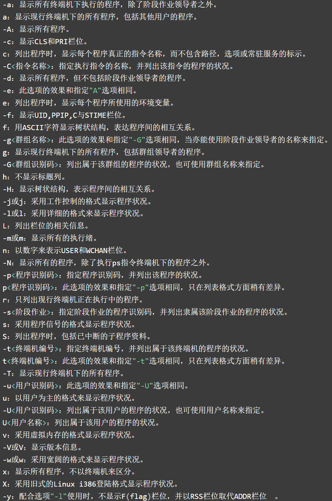
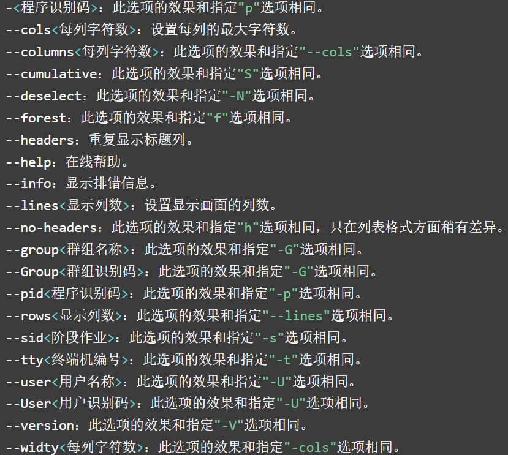
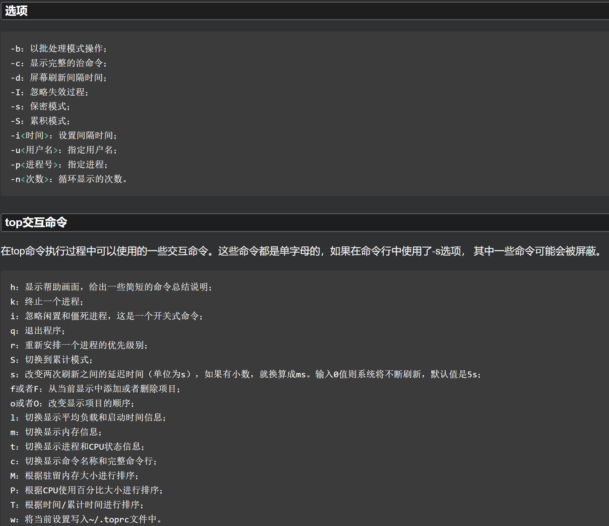

# 性能检测与优化

## CPU相关

- uptime 查看Linux系统负载信息
- vmstat 显示虚拟内存状态

### uptime 查看系统负载

- 能够打印系统总共运行了多长时间和系统的平均负载。
- uptime命令可以显示的信息显示依次为：现在时间、系统已经运行了多长时间、目前有多少登陆用户、系统在过去的1分钟、5分钟和15分钟内的平均负载。

**格式**

```shell
uptime
```

```shell
[root@bogon Test]# uptime
 20:41:51 up  1:21,  3 users,  load average: 0.00, 0.01, 0.05
# 现在时间、系统已运行时间、登陆用户数、系统在过去的1分钟、5分钟和15分钟内的平均负载。
```

### vmstat

 

```shell
[root@bogon ipv4]# vmstat
procs -----------memory---------- ---swap-- -----io---- -system-- ------cpu-----
 r  b   swpd   free   buff  cache   si   so    bi    bo   in   cs us sy id wa st
 1  0      0 4128428   2116 428040   0    0     3     0   14   11  0  0 100 0  0
```

**Procs（进程）**

- r: 运行队列中进程数量，这个值也可以判断是否需要增加CPU。（长期大于1）
- b: 等待IO的进程数量。

**Memory（内存）**

- swpd: 使用虚拟内存大小，如果swpd的值不为0，但是SI，SO的值长期为0，这种情况不会影响系统性能。
- free: 空闲物理内存大小。
- buff: 用作缓冲的内存大小。
- cache: 用作缓存的内存大小，如果cache的值大的时候，说明cache处的文件数多，如果频繁访问到的文件都能被cache处，那么磁盘的读IO bi会非常小。

**Swap**

- si: 每秒从交换区写到内存的大小，由磁盘调入内存。
- so: 每秒写入交换区的内存大小，由内存调入磁盘。
- 注意：内存够用的时候，这2个值都是0，如果这2个值长期大于0时，系统性能会受到影响，磁盘IO和CPU资源都会被消耗。如果free很少，但是si和so也很少（大多时候是0），那么不用担心，系统性能这时不会受到影响。

**IO（现在的Linux版本块的大小为1kb）**

- bi: 每秒读取的块数
- bo: 每秒写入的块数
- 注意：随机磁盘读写的时候，这2个值越大（如超出1024k)，能看到CPU在IO等待的值也会越大。

**system（系统）**

- in: 每秒中断数，包括时钟中断。
- cs: 每秒上下文切换数。
- 注意：上面2个值越大，会看到由内核消耗的CPU时间会越大。

**CPU（以百分比表示）**

- us: 用户进程执行时间百分比(user time)
  - us的值比较高时，说明用户进程消耗的CPU时间多，但是如果长期超50%的使用，那么我们就该考虑优化程序算法或者进行加速。
- sy: 内核系统进程执行时间百分比(system time)
  - sy的值高时，说明系统内核消耗的CPU资源多，这并不是良性表现，我们应该检查原因。
- wa: IO等待时间百分比
  - wa的值高时，说明IO等待比较严重，这可能由于磁盘大量作随机访问造成，也有可能磁盘出现瓶颈（块操作）。
- id: 空闲时间百分比

## 内存相关

- top
- free
- vmstat

### free 显示系统内存状态

**格式**

```shell
free [选项]
```

**常用组合**

| 组合            | 作用               |
|:------------- |:---------------- |
| free -s 秒     | 每几秒刷新一次          |
| free -b\|k\|m | 以Byte或KB或MB的单位显示 |
| free -t       | 显示内存总和           |

```shell
# free  -mts 10
[root@bogon Test]# free -mts 10
              total        used        free      shared  buff/cache   available
Mem:           4943         911        3037          10         994        3701
Swap:          5119           0        5119
Total:        10063         911        8157
```

**解释**

 

## IO

- iostat

### iostat 监视系统输入输出设备和CPU的使用情况

- iostat命令 被用于监视系统输入输出设备和CPU的使用情况。它的特点是汇报磁盘活动统计情况，同时也会汇报出CPU使用情况。同vmstat一样，iostat也有一个弱点，就是它不能对某个进程进行深入分析，仅对系统的整体情况进行分析。

 

 

```shell
[root@bogon ipv4]# iostat -x /dev/sda1
Linux 3.10.0-693.el7.x86_64 (bogon)     12/12/2022      _x86_64_        (12 CPU)

avg-cpu:  %user   %nice %system %iowait  %steal   %idle
           0.01    0.00    0.03    0.00    0.00   99.96

Device:         rrqm/s   wrqm/s     r/s     w/s    rkB/s    wkB/s avgrq-sz avgqu-sz   await r_await w_await  svctm  %util
sda1              0.00     0.00    0.18    0.00     0.56     0.20     8.34     0.00    0.13    0.12    3.00   0.12   0.00
```

## 网络性能评估

- netstat

# 运行级别

**启动**

 

 

 

**紧急模式 systemctl rescue**

## runlevel 查看当前用户运行级别

 

## init 改变系统运行级别

- init进程是所有Linux进程的父进程，它的进程号为1。init命令是Linux操作系统中不可缺少的程序之一，init进程是Linux内核引导运行的，是系统中的第一个进程。

```shell
init [选项] 运行级别
```

 

## /etc/inittab init配置文件

## systemctl rescue 紧急模式

## systemctl set-default 指向 更改默认运行级别

- 实际上是修改 /etc/systemd/ssytem/default.target 的指向
- 重启后生效

| 参数                | 指向                                        | 运行级别 |
|:----------------- |:----------------------------------------- |:---- |
| default.target    | /etc/systemd/system/default.target        | -    |
| multi-user.target | /usr/lib/systemd/system/multi-user.target | 3    |
| graphical.target  | /usr/lib/systemd/system/graphical.target  | 5    |

- 查看可选的指向： `ll /usr/lib/systemd/system | grep .target`

```shell
# 查看指向
[root@bogon ~]# ll /etc/systemd/system/default.target
lrwxrwxrwx. 1 root root 36 Nov 13 21:20 /etc/systemd/system/default.target -> /lib/systemd/system/graphical.target
# 更改指向
[root@bogon ~]# systemctl set-default multi-user.target
Removed symlink /etc/systemd/system/default.target.
Created symlink from /etc/systemd/system/default.target to /usr/lib/systemd/system/multi-user.target.
```

# systemctl systemd服务单元控制

**扩展与单元类型**

 

- systemctl命令 是系统服务管理器指令，它实际上将 service 和 chkconfig 这两个命令组合到一起。

 

## 对服务单元操作

```shell
systemctl start nfs-server.service . # 启动nfs服务
systemctl restart nfs-server.service # 重新启动某服务
systemctl stop firewalld.service # 停止某服务
systemctl enable nfs-server.service # 设置开机自启动
systemctl disable nfs-server.service # 停止开机自启动
systemctl status nfs-server.service # 查看服务当前状态

# 以上等效于：systemctl firewalld stop 
# 或 systemctl status firewalld

systemctl list-units --type=service # 查看所有已启动的服务
systemctl list-units-files # 查看系统中安装的服务
```

## 电源控制

```shell
systemctl poweroff # 关机
systemctl reboot # 重启
systemctl suspend # 待机

# 以上等效于 poweroff
```

## 单元配置文件

**存放位置**

|                   |                          |
| ----------------- | ------------------------ |
| 存放软件包安装的单元        | /usr/lib/systemd/system/ |
| 由系统管理员安装的与系统密切的单元 | /etc/systemd/system      |

**分为三个小节**

| 小节      | 说明                                    |
|:------- |:------------------------------------- |
| Unit    | 主要是单元的描述和依赖                           |
| Service | 单元的最主要内容，主要定义了服务的类型、启动、停止的命令、杀死服务的信号等 |
| Install | 安装单元                                  |

- 以vmtoolsd.service为例

```shell
[root@bogon ~]# cat /usr/lib/systemd/system/vmtoolsd.service
```

 

### 添加单元配置文件

1. 将单元配置文件放入相应的目录位置
2. 执行`systemctl daemon-relod`

# 进程管理

**分类**

| 进程        | 启动                       | 运行        | 状态       |
|:--------- |:------------------------ | --------- | -------- |
| **交互进程**  |                          |           |          |
| **批处理进程** |                          |           |          |
| **守护进程**  | 系统开机时通过脚本自动激活启动或root用户启动 | 后台运行，一直运行 | 等待请求处理任务 |

**进程的属性**

| 属性        | 说明                |
|:--------- |:----------------- |
| PID       | 进程ID，唯一值，区分进程     |
| PPID      | 父进程和父进程的PID       |
| UID、GID   | 启动进程的用户ID和所归属的组ID |
| 进程状态      | R（运行）、S（休眠）、Z（僵尸） |
| 进程执行的优先级  |                   |
| 进程所连接的终端名 |                   |
| 进程资源占用    |                   |

## ps 进程监视

- 用于报告当前系统的进程状态（非动态）
- 可以搭配kill指令随时中断、删除不必要的程序。

```shell
ps [选项]
```

 
 

**常用**

```shell
ps axo pid,comm,pcpu # 查看进程的PID、名称以及CPU 占用率
ps aux | sort -rnk 4 # 按内存资源的使用量对进程进行排序
ps aux | sort -nk 3  # 按 CPU 资源的使用量对进程进行排序
ps -A # 显示所有进程信息
ps -u root # 显示指定用户信息
ps -efL # 查看线程数
ps -e -o "%C : %p :%z : %a"|sort -k5 -nr # 查看进程并按内存使用大小排列
ps -ef # 显示所有进程信息，连同命令行
ps -ef | grep ssh # ps 与grep 常用组合用法，查找特定进程
ps -C nginx # 通过名字或命令搜索进程
ps aux --sort=-pcpu,+pmem # CPU或者内存进行排序,-降序，+升序
ps -f --forest -C nginx # 用树的风格显示进程的层次关系
ps -o pid,uname,comm -C nginx # 显示一个父进程的子进程
ps -e -o pid,uname=USERNAME,pcpu=CPU_USAGE,pmem,comm # 重定义标签
ps -e -o pid,comm,etime # 显示进程运行的时间
ps -aux | grep named # 查看named进程详细信息
ps -o command -p 91730 | sed -n 2p # 通过进程id获取服务名称
```

 

 

- 僵尸进程是指进程完成了，但父进程没有响应。

```shell
[root@bogon ~]# ps aux | head -2
USER        PID %CPU %MEM    VSZ   RSS TTY      STAT START   TIME COMMAND
root          1  0.0  0.0 191700  4760 ?        Ss   13:15   0:04 /usr/lib/systemd/systemd --switched-root --system --deserialize 21
```

## top 系统实时状态监视

- 动态交互命令
- 默认每5秒刷新一次

 

 

- 应用程序实际占用的内存：MemTotal - MemFree - Buffer - Cached (KB)而不是MemUsed

**常用**

```shell
top -n 1 # 显示一次结果就退出
top -p 5 # 显示指定PID的进程当前状态
top -u oracle # 显示某一用户的进程信息
```

## 前台进程和后台进程

- 前台进程会占用终端窗口，后台进程不会
- 启动前台进程：正常启动即可；启动后台进程：在启动命令后加上`$`

```shell
[root@bogon ~]# ps -ef $
error: garbage option

Usage:
 ps [options]

 Try 'ps --help <simple|list|output|threads|misc|all>'
  or 'ps --help <s|l|o|t|m|a>'
 for additional help text.

For more details see ps(1).
```

### bg  从前台进程切换到后台

1. Ctrl + Z 让正在执行的前台进程暂停
2. `jobs` 获取当前的后台作业号
3. `bg 作业号` 将进程放入后台执行

### fg 从后台到前台

1. `jobs` 获取当前的后台作业号
2. `fg 作业号` 将进程放入前台执行

```shell
[root@bogon ~]# top
#前台显示。。。
# Ctrl + Z
[1]+  Stopped                 top
# 查看作业号 
[root@bogon ~]# jobs
[1]+  Stopped                 top
# 放入后台
[root@bogon ~]# bg 1
[1]+ top &

[1]+  Stopped                 top
# 放入前台
[root@bogon ~]# fg 1
#前台显示。。。
```

### 子shell的使用

## kill / killall 杀死进程

- <mark>当父进程被终止时，子进程也被终止；而子进程的终止不会导致父进程的终止</mark>。
- 只有进程的属主和root用户可以杀死进程。
- 用来删除执行中的程序或工作。kill可将指定的信息送至程序。
- 预设的信息为SIGTERM(15),可将指定程序终止。若仍无法终止该程序，可使用SIGKILL(9)信息尝试强制删除程序。
- 程序或工作的编号可利用ps指令或jobs指令查看。
- <mark>kill 按PID杀死单个进程，killall 按进程名杀死同名的所有进程</mark>。

 

**信号 默认15**

 

```shell
# ps/top 找出进程号PID
[root@bogon ~]# ps -ef | pgrep -l top
7260 top
# kill进行杀死
# kill 按PID杀死，信号9 #在使用该进程的会显示killed
[root@bogon ~]# kill -9 7260
# killall 按进程名杀死同名的所有，信号9
[root@bogon ~]# killall -9 top
```

## nice / renice 进程优先级

**优先级**

- 优先级的数值为-20~19
- 负值和0是高优先级
- 启动进程时，其默认优先级是0
- <mark>进程的优先级是父进程Shell优先级的值与所指定优先级的**相加和**</mark>

### nice

- 在创建进程（可以是命令的执行）时指定进程的优先级
- 优先级是父进程和nice指定的优先的相加和，即：<mark>nice指定的并不就是该进程的优先级，而是一个**增量**</mark>。

 

- 注：指定优先级时：`nice -19 进程`表示优先级是19而不是-19，如果要-19则：`nice --19 进程`；也可以使用`nice -n -19 进程`表示-19.

```shell
[oracle@bogon Test]$ nice -19 tar zcf packTest.tar.gz test.txt
[oracle@bogon Test]$ nice -n 19 rm packTest.tar.gz
```

# 端口管理

## 修改默认端口

## 以ssh为例

```shell
# 修改修改配置文件 /etc/ssh/sshd_config
#Port 22 取消注释改为 #Port 10222
# 先临时关闭SELinux，SELinux会阻止端口的修改而导致sshd服务重启失败
[root@bogon ~]# setenforce 0
setenforce: SELinux is disabled
# 重启sshd服务
[root@bogon ~]# systemctl restart ssh
# 查看端口
[root@bogon ~]# netstat -plnt | grep 10222
tcp        0      0 0.0.0.0:10222           0.0.0.0:*               LISTEN      8553/sshd           
tcp6       0      0 :::10222                :::*                    LISTEN      8553/sshd
# 此时远程连接的软件ssh端口号需要改为10222
# 如果有问题，对SELinux和firewalld操作
[root@bogon ~]# systemctl stop firewalld
[root@bogon ~]# systemctl disable firewalld
Removed symlink /etc/systemd/system/multi-user.target.wants/firewalld.service.
Removed symlink /etc/systemd/system/dbus-org.fedoraproject.FirewallD1.service.
```
