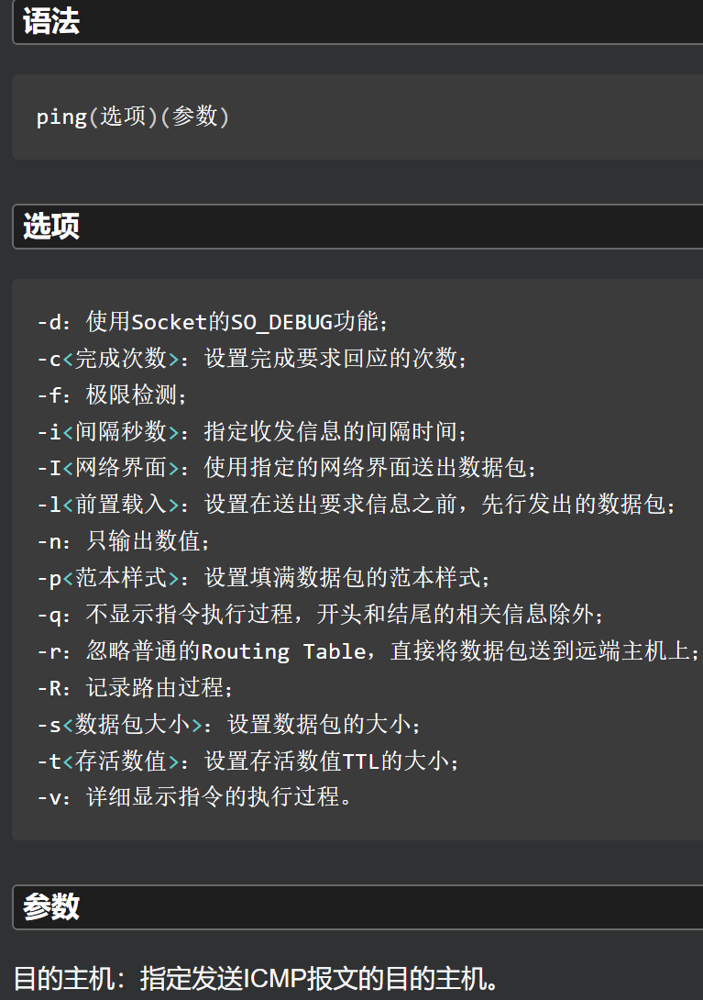

# 网络管理命令

## ip 网络配置工具

 

## ping

- 用来测试主机之间网络的连通性。执行ping指令会使用ICMP传输协议，发出要求回应的信息，若远端主机的网络功能没有问题，就会回应该信息，因而得知该主机运作正常。

 

**常用**

```shell
ping 域名/IP地址
ping -c 指定次数 域名/IP # 指定次数
ping -c 指定次数 -i 间隔秒数 域名/IP # 指定次数和每次间隔时间
```

 

## ifconfig 配置和显示Linux系统网卡的网络参数

- 用ifconfig命令配置的网卡信息，在网卡重启后机器重启后，配置就不存在。要想将上述的配置信息永远保存电脑，要修改网卡的配置文件。

 

 

**常用**

```shell
# 显示信息
ifconfig   #处于激活状态的网络接口
ifconfig -a  #所有配置的网络接口，不论其是否激活
ifconfig eth0  #显示eth0的网卡信息
# 启动关闭网卡eth0
ifconfig eth0 up
ifconfig eth0 down
# 为网卡eth0配置和删除IPv6地址：
ifconfig eth0 add 33ffe:3240:800:1005::2/64  #为网卡eth0配置IPv6地址
ifconfig eth0 del 33ffe:3240:800:1005::2/64  #为网卡eth0删除IPv6地址
# 用ifconfig修改eth0网卡MAC地址：
ifconfig eth0 hw ether 00:AA:BB:CC:dd:EE
# 配置网卡eth0的IP地址：
ifconfig eth0 192.168.2.10
ifconfig eth0 192.168.2.10 netmask 255.255.255.0
ifconfig eth0 192.168.2.10 netmask 255.255.255.0 broadcast 192.168.2.255
# 启用和关闭arp协议：
ifconfig eth0 arp    #开启网卡eth0 的arp协议
ifconfig eth0 -arp   #关闭网卡eth0 的arp协议
# 设置最大传输单元：
ifconfig eth0 mtu 1500    #设置能通过的最大数据包大小为 1500 bytes
```

## ifdown 禁用指定的网络接口

## route 显示添加/修改路由器

- 用来显示并设置Linux内核中的网络路由表，route命令设置的路由主要是静态路由。要实现两个不同的子网之间的通信，需要一台连接两个网络的路由器，或者同时位于两个网络的网关来实现。
- 在Linux系统中设置路由通常是为了解决以下问题：该Linux系统在一个局域网中，局域网中有一个网关，能够让机器访问Internet，那么就需要将这台机器的ip地址设置为Linux机器的默认路由。
- 要注意的是，直接在命令行下执行route命令来添加路由，不会永久保存，当网卡重启或者机器重启之后，该路由就失效了；可以在**/etc/rc.local**中添加route命令来保证该路由设置永久有效。

 

 

```shell
# 显示
route # 显示当前路由器
route -n # 显示所有路由器
# 添加网关/设置网关： route add -net IP地址 netmask 子网掩码 gw 网关 dev 网络接口
route add -net 224.0.0.0 netmask 240.0.0.0 dev ens33 #增加一条到达244.0.0.0的路由。
# 删除路由记录: 不会删除被屏蔽的路由（需要reject选项）
route del -net 224.0.0.0 netmask 240.0.0.0 #删除指定IP和子网掩码的路由
# 删除和添加设置默认网关：
route del default gw 192.168.120.240
route add default gw 192.168.120.240
# 删除和添加屏蔽的路由：
route add -net 224.0.0.0 netmask 240.0.0.0 reject #增加屏蔽的路由，目的地址为224.x.x.x将被拒
route add -net 224.0.0.0 netmask 240.0.0.0 reject #删除屏蔽的路由
```

## scp 加密的方式在本地主机和远程主机之间复制文件

- 用于在Linux下进行远程拷贝文件的命令，和它类似的命令有cp，不过cp只是在本机进行拷贝不能跨服务器，而且scp传输是加密的，可能会稍微影响速度。当服务器硬盘变为只读read only system时，用scp可以把文件移出来。另外，scp还非常不占资源，不会提高多少系统负荷，在这一点上，rsync就远远不及它了。虽然 rsync比scp会快一点，但当小文件众多的情况下，rsync会导致硬盘I/O非常高，而scp基本不影响系统正常使用。

 

```shell
# scp 源文件 目标文件

# scp 远程主机用户@远程主机IP地址:/要下载的完整文件路径 /下载到本机的文件路径
#从远程主机复制文件到本地 
scp root@192.168.186.137:/root/install/test.txt  /root/install/
#从远程主机复制文件目录到本地
scp -r zjk@192.168.186.137:/home/zjk/Downloads /root/install/

# scp /本地文件路径 远程主机用户@远程主机IP地址:/要上传到的文件路径
#上传本地文件目录到远程机器指定目录
scp -r /root/install zjk@192.168.186.137:/home/zjk/Downloads
#指定端口 即使用ssh端口默认22
scp -rp -P 22 /root/install/test.txt zjk@192.168.186.137:/home/zjk/Downloads
```

```shell
[root@bogon install]# scp root@192.168.186.137:/root/install/test.txt  /root/install/
The authenticity of host '192.168.186.137 (192.168.186.137)' can't be established.
ECDSA key fingerprint is SHA256:pqc8Zaq6EU1PrS4M/FGOkfQ3T0gvP+4dwglHsrq0r4g.
ECDSA key fingerprint is MD5:8c:cf:1e:3c:c9:aa:4b:32:32:5d:e6:8c:19:e2:cc:37.
Are you sure you want to continue connecting (yes/no)? yes
Warning: Permanently added '192.168.186.137' (ECDSA) to the list of known hosts.
root@192.168.186.137's password: 
test.txt                                                                                 100%    5     2.1KB/s   00:00    
[root@bogon install]# ll
total 12
drwxr-xr-x. 18 oracle wheel 4096 Dec  4 16:39 ncurses-6.3
-rw-r--r--.  1 root   root     5 Dec  5 15:12 test.txt
drwxrwxr-x.  9 zjk    zjk   4096 Jun 28 18:40 vim90

[root@bogon install]# scp -r zjk@192.168.186.137:/home/zjk/Downloads /root/install/
zjk@192.168.186.137's password: 
hello.txt                                                                                100%    6     1.8KB/s   00:00    
[root@bogon install]# ll
total 12
drwxr-xr-x.  2 root   root    23 Dec  5 15:22 Downloads
drwxr-xr-x. 18 oracle wheel 4096 Dec  4 16:39 ncurses-6.3
-rw-r--r--.  1 root   root     5 Dec  5 15:12 test.txt
drwxrwxr-x.  9 zjk    zjk   4096 Jun 28 18:40 vim90
```

### Linux 与 Windows的传输

- 需要在Windos安装SSH功能。**OPENSSH服务器和OPENSSH客户端**
   
- 需要启动SSH服务

#### Windows到Linux

**Windows需要SSH服务器，启动相应的服务**

```shell
[root@bogon ~]# scp -r zjk10@10.22.114.22:/g:/SCPtest /root/install/
zjk10@10.22.114.22's password: 
test.txt                                                                                 100%    0     0.0KB/s   00:00   
```

#### Linux到Windows

**Windows需要SSH客户端，启动相应的服务OpenSSH Authentication Agent**

```shell
C:\Users\zjk10>scp -r root@192.168.186.154:/root/install /G:/test

The authenticity of host '192.168.186.154 (192.168.186.154)' can't be established.
ED25519 key fingerprint is SHA256:gPlDhf9CboGI3JUnxNVrltOGAjUYX9GJyypCQulMDb0.
This key is not known by any other names
Are you sure you want to continue connecting (yes/no/[fingerprint])?
Warning: Permanently added '192.168.186.154' (ED25519) to the list of known hosts.
root@192.168.186.154's password:
```

## rsync 远程数据同步工具

- rsync命令 是一个远程数据同步工具，可通过LAN/WAN快速同步多台主机间的文件。rsync使用所谓的“rsync算法”来使本地和远程两个主机之间的文件达到同步，这个算法只传送两个文件的不同部分，而不是每次都整份传送，因此速度相当快。 

 
 
 

```shell
# 传送本地到远程主机

```

## netstat 查看网络系统状态信息

 

```shell
# 列出所有端口 (包括监听和未监听的)
netstat -a     #列出所有端口
netstat -at    #列出所有tcp端口
netstat -au    #列出所有udp端口                             
# 列出所有处于监听状态的 Sockets
netstat -l        #只显示监听端口
netstat -lt       #只列出所有监听 tcp 端口
netstat -lu       #只列出所有监听 udp 端口
netstat -lx       #只列出所有监听 UNIX 端口
# 显示每个协议的统计信息
netstat -s    #显示所有端口的统计信息
netstat -st   #显示TCP端口的统计信息
netstat -su   #显示UDP端口的统计信息
# 在netstat输出中显示 PID 和进程名称
netstat -p
# 在netstat输出中不显示主机，端口和用户名(host, port or user)
#当不想让主机，端口和用户名显示，使用netstat -n。将会使用数字代替那些名称。同样可以加速输出，因为不用进行比对查询。
netstat -an
# 如果只是不想让这三个名称中的一个被显示，使用以下命令:
netstat -a --numeric-ports
netstat -a --numeric-hosts
netstat -a --numeric-users
# 持续输出netstat信息
netstat -c   #每隔一秒输出网络信息
# 显示系统不支持的地址族(Address Families)
netstat --verbose
# 显示核心路由信息
netstat -r
# 找出程序运行的端口
#并不是所有的进程都能找到，没有权限的会不显示，使用 root 权限查看所有的信息。
netstat -ap | grep ssh
# 找出运行在指定端口的进程：
netstat -an | grep ':80'
# 通过端口找进程ID
netstat -anp|grep 8081 | grep LISTEN|awk '{printf $7}'|cut -d/ -f1
# 显示网络接口列表
netstat -i

# IP和TCP分析
# 查看连接某服务端口最多的的IP地址：
netstat -ntu | grep :80 | awk '{print $5}' | cut -d: -f1 | awk '{++ip[$1]} END {for(i in ip) print ip[i],"\t",i}' | sort -nr
# TCP各种状态列表：
netstat -nt | grep -e 127.0.0.1 -e 0.0.0.0 -e ::: -v | awk '/^tcp/ {++state[$NF]} END {for(i in state) print i,"\t",state[i]}'
# 查看phpcgi进程数，如果接近预设值，说明不够用，需要增加：
netstat -anpo | grep "php-cgi" | wc -l
```

## traceroute 显示数据包到主机间的路径

- traceroute命令 用于追踪数据包在网络上的传输时的全部路径，它默认发送的数据包大小是40字节。
- 通过traceroute可以知道信息从计算机到互联网另一端的主机是走的什么路径。每次数据包由某一同样的出发点（source）到达某一同样的目的地(destination)走的路径可能会不一样，但大部分时候所走的路由是相同的。
- 记录按序列号从1开始，每个纪录就是一跳 ，每跳表示一个网关。最多有30跳(即最多可经过30个路由)，如果超过还未到达目标机，则终止traceroute命令。每行有三个时间（即-q的默认参数），单位是ms是探测数据包向每个网关发送三个数据包后，网关响应后返回的时间。每个数据包都对应一个Max_ttl值，同一跳步的数据包的该值相同。不同跳步的数据包的值从1开始，每一跳加1。当本地机发出的数据包到达路由器时，路由器就响应一个ICMPTimeExceed消息，于是traceroute命令就显示这一跳的消息。如果在指定的时间内未收到响应包（可能是防火墙封掉了ICMP的返回信息），则traceroute命令显示星号`*`，直到收到一个ICMPPORT_UNREACHABLE的消息表示已经到达目标机，或到达指定的最多跳步数。
- 有时我们在某一网关处延时比较长，有可能是某台网关比较阻塞，也可能是物理设备本身的原因。当然如果某台DNS出现问题时，不能解析主机名、域名时，也会有延时长的现象；您可以加-n参数来避免DNS解析，以IP格式输出数据。
- 如果在局域网中的不同网段之间，可以通过traceroute 来排查问题所在，是主机的问题还是网关的问题。如果通过远程来访问某台服务器遇到问题时，我们用到traceroute 追踪数据包所经过的网关，提交IDC服务商，也有助于解决问题。

 

```shell
traceroute 域名/IP地址
traceroute -m 10 www.baidu.com # 跳数设置 默认最大30跳
traceroute -n www.baidu.com    # 显示IP地址，不查主机名
traceroute -p 6888 www.baidu.com  # 探测包使用的基本UDP端口设置6888
traceroute -q 4 www.baidu.com  # 把探测包的个数设置为值4
traceroute -r www.baidu.com    # 绕过正常的路由表，直接发送到网络相连的主机
traceroute -w 3 www.baidu.com  # 把对外发探测包的等待响应时间设置为3秒
traceroute -I 10.22.114.22 # 强制使用ICMP
```

```shell
[root@bogon ~]# traceroute -I 10.22.114.22
traceroute to 10.22.114.22 (10.22.114.22), 30 hops max, 60 byte packets
 1  bogon (192.168.186.2)  0.100 ms  0.055 ms  0.034 ms
 2  bogon (10.22.114.22)  0.542 ms  0.529 ms  0.776 ms
```

## telnet 登录远程主机和管理(测试ip端口是否连通)

- telnet命令用于登录远程主机，对远程主机进行管理，可以用来确认远程服务端口的状态。
- telnet程序基于TELNET协议，TELNET协议是TCP/IP协议族中的一员，是Internet远程登录服务的标准和主要方式。
- telnet因为采用明文传送报文，安全性不好。

 

**需要安装该程序telnet**

```shell
yum list telnet*    # 列出telnet相关的安装包
yum install telnet-server    # 安装telnet服务
yum install telnet.*    # 安装telnet客户端
```

```shell
telnet www.php.net 80 # 以80端口连接www.php.net
```

## wget 下载网络文件

- wget命令 用来从指定的URL下载文件。wget非常稳定，它在带宽很窄的情况下和不稳定网络中有很强的适应性，如果是由于网络的原因下载失败，wget会不断的尝试，直到整个文件下载完毕。如果是服务器打断下载过程，它会再次联到服务器上从停止的地方继续下载。这对从那些限定了链接时间的服务器上下载大文件非常有用。
- wget支持HTTP，HTTPS和FTP协议，可以使用HTTP代理。所谓的自动下载是指，wget可以在用户退出系统的之后在后台执行。这意味这你可以登录系统，启动一个wget下载任务，然后退出系统，wget将在后台执行直到任务完成，相对于其它大部分浏览器在下载大量数据时需要用户一直的参与，这省去了极大的麻烦。
- 用于从网络上下载资源，没有指定目录，下载资源会默认为当前目录。

1. 支持断点下传功能
2. 同时支持FTP和HTTP下载方式
3. 支持代理服务器 对安全强度很高的系统而言，一般不会将自己的系统直接暴露在互联网上，所以，支持代理是下载软件必须有的功能；
4. 设置方便简单
5. 程序小，完全免费

```shell
wget [参数] [URL地址]
```

**选项**

```
启动参数：

-V, –-version 显示wget的版本后退出
-h, –-help 打印语法帮助
-b, –-background 启动后转入后台执行
-e, –-execute=COMMAND 执行`.wgetrc’格式的命令，wgetrc格式参见/etc/wgetrc或~/.wgetrc

记录和输入文件参数：

-o, –-output-file=FILE 把记录写到FILE文件中
-a, –-append-output=FILE 把记录追加到FILE文件中
-d, –-debug 打印调试输出
-q, –-quiet 安静模式(没有输出)
-v, –-verbose 冗长模式(这是缺省设置)
-nv, –-non-verbose 关掉冗长模式，但不是安静模式
-i, –-input-file=FILE 下载在FILE文件中出现的URLs
-F, –-force-html 把输入文件当作HTML格式文件对待
-B, –-base=URL 将URL作为在-F -i参数指定的文件中出现的相对链接的前缀
–-sslcertfile=FILE 可选客户端证书
–-sslcertkey=KEYFILE 可选客户端证书的KEYFILE
–-egd-file=FILE 指定EGD socket的文件名

下载参数：

–-bind-address=ADDRESS 指定本地使用地址(主机名或IP，当本地有多个IP或名字时使用)
-t, –-tries=NUMBER 设定最大尝试链接次数(0 表示无限制).
-O –-output-document=FILE 把文档写到FILE文件中
-nc, –-no-clobber 不要覆盖存在的文件或使用.#前缀
-c, –-continue 接着下载没下载完的文件
–progress=TYPE 设定进程条标记
-N, –-timestamping 不要重新下载文件除非比本地文件新
-S, –-server-response 打印服务器的回应
–-spider 不下载任何东西
-T, –-timeout=SECONDS 设定响应超时的秒数
-w, –-wait=SECONDS 两次尝试之间间隔SECONDS秒
–waitretry=SECONDS 在重新链接之间等待1…SECONDS秒
–random-wait 在下载之间等待0…2*WAIT秒
-Y, –-proxy=on/off 打开或关闭代理
-Q, –-quota=NUMBER 设置下载的容量限制
–limit-rate=RATE 限定下载输率

目录参数：

-nd –-no-directories 不创建目录
-x, –-force-directories 强制创建目录
-nH, –-no-host-directories 不创建主机目录
-P, –-directory-prefix=PREFIX 将文件保存到目录 PREFIX/…
–cut-dirs=NUMBER 忽略 NUMBER层远程目录

HTTP 选项参数：

-–http-user=USER 设定HTTP用户名为 USER.
-–http-passwd=PASS 设定http密码为 PASS
-C, –-cache=on/off 允许/不允许服务器端的数据缓存 (一般情况下允许)
-E, –-html-extension 将所有text/html文档以.html扩展名保存
-–ignore-length 忽略 `Content-Length’头域
-–header=STRING 在headers中插入字符串 STRING
-–proxy-user=USER 设定代理的用户名为 USER
-–proxy-passwd=PASS 设定代理的密码为 PASS
-–referer=URL 在HTTP请求中包含 `Referer: URL’头
-s, –-save-headers 保存HTTP头到文件
-U, –-user-agent=AGENT 设定代理的名称为 AGENT而不是 Wget/VERSION
-–no-http-keep-alive 关闭 HTTP活动链接 (永远链接)
–-cookies=off 不使用 cookies
–-load-cookies=FILE 在开始会话前从文件 FILE中加载cookie
-–save-cookies=FILE 在会话结束后将 cookies保存到 FILE文件中

FTP 选项参数：

-nr, -–dont-remove-listing 不移走 `.listing’文件
-g, -–glob=on/off 打开或关闭文件名的 globbing机制
-–passive-ftp 使用被动传输模式 (缺省值).
-–active-ftp 使用主动传输模式
-–retr-symlinks 在递归的时候，将链接指向文件(而不是目录)

递归下载参数：

-r, -–recursive 递归下载－－慎用!
-l, -–level=NUMBER 最大递归深度 (inf 或 0 代表无穷)
–-delete-after 在现在完毕后局部删除文件
-k, –-convert-links 转换非相对链接为相对链接
-K, –-backup-converted 在转换文件X之前，将之备份为 X.orig
-m, –-mirror 等价于 -r -N -l inf -nr
-p, –-page-requisites 下载显示HTML文件的所有图片

递归下载中的包含和不包含(accept/reject)：

-A, –-accept=LIST 分号分隔的被接受扩展名的列表
-R, –-reject=LIST 分号分隔的不被接受的扩展名的列表
-D, –-domains=LIST 分号分隔的被接受域的列表
–-exclude-domains=LIST 分号分隔的不被接受的域的列表
–-follow-ftp 跟踪HTML文档中的FTP链接
–-follow-tags=LIST 分号分隔的被跟踪的HTML标签的列表
-G, –-ignore-tags=LIST 分号分隔的被忽略的HTML标签的列表
-H, –-span-hosts 当递归时转到外部主机
-L, –-relative 仅仅跟踪相对链接
-I, –-include-directories=LIST 允许目录的列表
-X, –-exclude-directories=LIST 不被包含目录的列表
-np, –-no-parent 不要追溯到父目录
wget -S –-spider url 不下载只显示过程
```

```shell
# 下载某个文件
wget URL地址
# 断点续传
wget -c URL地址
# 批量下载 其中download.list是一系列网址(每行一个网址)，将依次下载
wget -i download.list

使用wget下载单个文件

wget http://www.jsdig.com/testfile.zip
以下的例子是从网络下载一个文件并保存在当前目录，在下载的过程中会显示进度条，包含（下载完成百分比，已经下载的字节，当前下载速度，剩余下载时间）。

下载并以不同的文件名保存

wget -O wordpress.zip http://www.jsdig.com/download.aspx?id=1080
wget默认会以最后一个符合/的后面的字符来命令，对于动态链接的下载通常文件名会不正确。

错误：下面的例子会下载一个文件并以名称download.aspx?id=1080保存:

wget http://www.jsdig.com/download?id=1
即使下载的文件是zip格式，它仍然以download.php?id=1080命令。

正确：为了解决这个问题，我们可以使用参数-O来指定一个文件名：

wget -O wordpress.zip http://www.jsdig.com/download.aspx?id=1080
wget限速下载

wget --limit-rate=300k http://www.jsdig.com/testfile.zip
当你执行wget的时候，它默认会占用全部可能的宽带下载。但是当你准备下载一个大文件，而你还需要下载其它文件时就有必要限速了。

使用wget断点续传

wget -c http://www.jsdig.com/testfile.zip
使用wget -c重新启动下载中断的文件，对于我们下载大文件时突然由于网络等原因中断非常有帮助，我们可以继续接着下载而不是重新下载一个文件。需要继续中断的下载时可以使用-c参数。

使用wget后台下载

wget -b http://www.jsdig.com/testfile.zip

Continuing in background, pid 1840.
Output will be written to `wget-log'.
对于下载非常大的文件的时候，我们可以使用参数-b进行后台下载，你可以使用以下命令来察看下载进度：

tail -f wget-log
伪装代理名称下载

wget --user-agent="Mozilla/5.0 (Windows; U; Windows NT 6.1; en-US) AppleWebKit/534.16 (KHTML, like Gecko) Chrome/10.0.648.204 Safari/534.16" http://www.jsdig.com/testfile.zip
有些网站能通过根据判断代理名称不是浏览器而拒绝你的下载请求。不过你可以通过--user-agent参数伪装。

测试下载链接

当你打算进行定时下载，你应该在预定时间测试下载链接是否有效。我们可以增加--spider参数进行检查。

wget --spider URL
如果下载链接正确，将会显示:

Spider mode enabled. Check if remote file exists.
HTTP request sent, awaiting response... 200 OK
Length: unspecified [text/html]
Remote file exists and could contain further links,
but recursion is disabled -- not retrieving.
这保证了下载能在预定的时间进行，但当你给错了一个链接，将会显示如下错误:

wget --spider url
Spider mode enabled. Check if remote file exists.
HTTP request sent, awaiting response... 404 Not Found
Remote file does not exist -- broken link!!!
你可以在以下几种情况下使用--spider参数：

定时下载之前进行检查
间隔检测网站是否可用
检查网站页面的死链接
增加重试次数

wget --tries=40 URL
如果网络有问题或下载一个大文件也有可能失败。wget默认重试20次连接下载文件。如果需要，你可以使用--tries增加重试次数。

下载多个文件

wget -i filelist.txt
首先，保存一份下载链接文件：

cat > filelist.txt
url1
url2
url3
url4
接着使用这个文件和参数-i下载。

镜像网站

wget --mirror -p --convert-links -P ./LOCAL URL
下载整个网站到本地。

--miror开户镜像下载。
-p下载所有为了html页面显示正常的文件。
--convert-links下载后，转换成本地的链接。
-P ./LOCAL保存所有文件和目录到本地指定目录。
过滤指定格式下载

wget --reject=gif ur
下载一个网站，但你不希望下载图片，可以使用这条命令。

把下载信息存入日志文件

wget -o download.log URL
不希望下载信息直接显示在终端而是在一个日志文件，可以使用。

限制总下载文件大小

wget -Q5m -i filelist.txt
当你想要下载的文件超过5M而退出下载，你可以使用。注意：这个参数对单个文件下载不起作用，只能递归下载时才有效。

下载指定格式文件

wget -r -A.pdf url
可以在以下情况使用该功能：

下载一个网站的所有图片。
下载一个网站的所有视频。
下载一个网站的所有PDF文件。
FTP下载

wget ftp-url
wget --ftp-user=USERNAME --ftp-password=PASSWORD url
可以使用wget来完成ftp链接的下载。

使用wget匿名ftp下载：

wget ftp-url
使用wget用户名和密码认证的ftp下载：

wget --ftp-user=USERNAME --ftp-password=PASSWORD url
```

# 网络配置

**相关文件**

| 文件                                   | 说明                                                  |
| :------------------------------------- | :---------------------------------------------------- |
| /etc/hostname                          | 修改主机名称                                          |
| /etc/sysconfig/network-scripts/ifcfg-* | 设置网卡参数，*为网卡编号/回环网卡                    |
| /etc/resolv.conf                       | 设置DNS的相关信息，用于将域名解析到IP                 |
| /etc/hosts                             | 计算机IP对应的主机名称或域名对应的IP                  |
| /etc/nsswitch.conf                     | 名字服务切换配置（设置DNS解析优先还是本地设置优先等） |

- 通过对配置文件的修改，重启后依然有效

## 网络接口文件 /etc/sysconfig/network-scripts/ifcfg-* 

- 可以配置IP地址，修改之后需要重启网络服务才开始生效

```shell
# 查看配置文件
cat /etc/sysconfig/network-scripts/ifcfg-ens33
# 重启network服务后生效
systemctl restart network
```

 

### 子接口

- 同一个网络接口可以设置多个IP地址时，可使用子接口。
- 在/etc/rc.local中可以添加，使重启后仍然生效。不建议。

**设置子接口**

```shell
# 子接口的设置
ifconfig 网络接口:子接口编号 IP地址 netmask 子网掩码
```

```shell
[root@localhost network-scripts]# ifconfig ens33:11 192.168.186.153 netmask 255.255.255.0
[root@localhost network-scripts]# ifconfig
ens33: flags=4163<UP,BROADCAST,RUNNING,MULTICAST>  mtu 1500
        inet 192.168.186.154  netmask 255.255.255.0  broadcast 192.168.186.255
        inet6 fe80::9de5:f5e7:1447:1951  prefixlen 64  scopeid 0x20<link>
        ether 00:0c:29:fa:d4:2e  txqueuelen 1000  (Ethernet)
        RX packets 1990829  bytes 2488531319 (2.3 GiB)
        RX errors 0  dropped 0  overruns 0  frame 0
        TX packets 485327  bytes 711271182 (678.3 MiB)
        TX errors 0  dropped 0 overruns 0  carrier 0  collisions 0

ens33:11: flags=4163<UP,BROADCAST,RUNNING,MULTICAST>  mtu 1500
        inet 192.168.186.153  netmask 255.255.255.0  broadcast 192.168.186.255
        ether 00:0c:29:fa:d4:2e  txqueuelen 1000  (Ethernet)
```

## 设置主机名 hostname 或 /etc/hostname /etc/hosts

- 可修改/etc/hostname配置文件，使重启仍然生效。
- 在修改完主机名后，还需要修改相应的/etc/hosts文件，使主机能够顺利地解析该主机名。

```shell
# 设置主机名 并不修改/etc/hostname文件和/etc/hosts文件，能够被ping通
hostname 新的主机名
# 查看主机名
hostname
```

```shell
# 通过/etc/hostname修改
vim /etc/hostname #将主机名改为myhost
# 修改/ect/host添加该主机地域名解析
vim /etc/hosts #添加 127.0.0.1 myhost
# 检查能否ping通
ping myhost
```

```shell
[root@localhost ~]# hostname
localhost.localdomain
[root@localhost ~]# hostname mylinux
[root@localhost ~]# hostname
mylinux
[root@localhost ~]# ping mylinux
PING mylinux(mylinux (fe80::20c:29ff:fe00:6254%ens160)) 56 data bytes
64 bytes from mylinux (fe80::20c:29ff:fe00:6254%ens160): icmp_seq=1 ttl=64 time=0.146 ms
64 bytes from mylinux (fe80::20c:29ff:fe00:6254%ens160): icmp_seq=2 ttl=64 time=0.069 ms
64 bytes from mylinux (fe80::20c:29ff:fe00:6254%ens160): icmp_seq=3 ttl=64 time=0.084 ms
^C
--- mylinux ping statistics ---
3 packets transmitted, 3 received, 0% packet loss, time 2003ms
rtt min/avg/max/mdev = 0.069/0.099/0.146/0.035 ms
[root@localhost ~]# cat /etc/hosts
127.0.0.1   localhost localhost.localdomain localhost4 localhost4.localdomain4
::1         localhost localhost.localdomain localhost6 localhost6.localdomain6
```

```shell
[root@localhost ~]# vim /etc/hostname #此时修改为myLinuxHost，但此时ping不通
[root@localhost ~]# hostname
mylinux
[root@localhost ~]# vim /etc/hosts #添加 127.0.0.1 myLinuxHost
[root@localhost ~]# hostname #hostname应该是重启后正常
mylinux
[root@localhost ~]# ping myLinuxHost
PING mylinuxHost (127.0.0.1) 56(84) bytes of data.
64 bytes from localhost (127.0.0.1): icmp_seq=1 ttl=64 time=0.061 ms
64 bytes from localhost (127.0.0.1): icmp_seq=2 ttl=64 time=0.059 ms
64 bytes from localhost (127.0.0.1): icmp_seq=3 ttl=64 time=0.054 ms
64 bytes from localhost (127.0.0.1): icmp_seq=4 ttl=64 time=0.054 ms
64 bytes from localhost (127.0.0.1): icmp_seq=5 ttl=64 time=0.097 ms
^C
--- mylinuxHost ping statistics ---
5 packets transmitted, 5 received, 0% packet loss, time 4084ms
rtt min/avg/max/mdev = 0.054/0.065/0.097/0.016 ms
```

## 默认网关 route 或 /etc/sysconfig/network

- 在设置好IP地址以后，如果要访问其他的子网或Internet，用户还需要设置路由，或使用默认网关。


**route命令**

```shell
route add default gw IP地址
```

- 可以将执行的命令写入到/etc/rc.local文件中。

```shell
# 修改/etc/sysconfig/network文件
vim /etc/sysconfig/network #添加内容 GATEWAY=IP地址
# 重启
systemctl restart network
# 如果没有network服务
yum install network-service
```

## 设置DNS服务器

### 在接口配置文件/etc/sysconfig/network-scipts/ifcfg.* 中设置DNSn

### /etc/resolv.conf  当接口配置文件中的DEFROUTE=yes时，失效。

 

# DHCP 动态主机配置协议

- DHCP是用来自动给客户端分配TCP/IP信息的网络协议。
- DHCP基于CS模式，DHCP提供一组动态指定IP地址和相关网络配置参数的机制。

**工作原理**

- 每个DHCP客户端通过广播连接到区域内的DHCP服务器，该服务器响应请求，返回包括IP地址、网关和其他网络配置信息。

 

 

## 配置DHCP服务器

**1.rpm安装**

- dhcp-libs
- dhcp-common
- dhcp

```shell
[root@bogon ~]# rpm -aq | grep dhcp
dhcp-libs-4.2.5-58.el7.x86_64
dhcp-common-4.2.5-58.el7.x86_64
[root@bogon ~]# cd /mnt/room/Packages
[root@bogon Packages]# ll | grep dhcp
-r--r--r--.  383 root root   525388 May 16  2017 dhcp-4.2.5-58.el7.x86_64.rpm
-r--r--r--.  394 root root   177744 May 16  2017 dhcp-common-4.2.5-58.el7.x86_64.rpm
-r--r--r--.  383 root root   132816 May 16  2017 dhcp-libs-4.2.5-58.el7.i686.rpm
-r--r--r--.  394 root root   133128 May 16  2017 dhcp-libs-4.2.5-58.el7.x86_64.rpm
[root@bogon Packages]# rpm -ivh dhcp-4.2.5-58.el7.x86_64.rpm
warning: dhcp-4.2.5-58.el7.x86_64.rpm: Header V3 RSA/SHA256 Signature, key ID fd431d51: NOKEY
Preparing...                          ################################# [100%]
Updating / installing...
   1:dhcp-12:4.2.5-58.el7             ################################# [100%]
```

**2.编辑配置文件 /etc/dhcp/dhcpd.conf**

- /etc/dhcp/dhcpd.conf DHCP主配置文件
- /etc/init.d/dhcpd DHCP服务启停文件 

**DHCP服务器配置**

```shell
[root@bogon ~]# cat /etc/dhcp/dhcpd.conf
#
# DHCP Server Configuration file.
#   see /usr/share/doc/dhcp*/dhcpd.conf.example
#   see dhcpd.conf(5) man page

# 以上是格式说明和实例文件所在位置
# 以下为添加的内容

# 定义所支持的DNS动态更新类型。
# none表示不支持动态更新，interim表示DNS互动更新模式，ad-hoc表示特殊DNS更新模式
ddns-update-style none;

# 指定接收DHCP请求的网卡的子网地址(自己计算)
subnet 192.168.186.0 netmask 255.255.255.0{
        # 指定默认网关
        option routers 192.168.186.1;
        # 指定默认子网掩码
        option subnet-mask 255.255.255.0;
        # 指定DNS服务器地址
        option domain-name-servers 61.139.2.69;
        # 最大租用周期 秒
        max-lease-time 172800;
        # 此DHCP服务分配的IP地址范围
        range 192.168.186.230 192.168.186.240;
}
```

**DHCP客户端**

```shell
[root@mylinuxHost ~]# cat /etc/sysconfig/network-scripts/ifcfg-ens160
TYPE=Ethernet
PROXY_METHOD=none
BROWSER_ONLY=no
BOOTPROTO=dhcp  # 该项启用DHCP服务
DEFROUTE=yes
IPV4_FAILURE_FATAL=no
IPV6INIT=yes
IPV6_AUTOCONF=yes
IPV6_DEFROUTE=yes
IPV6_FAILURE_FATAL=no
NAME=ens160
UUID=8369a359-ed22-4998-be21-5d73d3793256
DEVICE=ens160
ONBOOT=yes
[root@mylinuxHost ~]# ifdown ens160
WARN      : [ifdown] You are using 'ifdown' script provided by 'network-scripts', which are now deprecated.
WARN      : [ifdown] 'network-scripts' will be removed in one of the next major releases of RHEL.
WARN      : [ifdown] It is advised to switch to 'NetworkManager' instead - it provides 'ifup/ifdown' scripts as well.
[root@mylinuxHost ~]# ifconfig ens160
ens160: flags=4163<UP,BROADCAST,RUNNING,MULTICAST>  mtu 1500
        ether 00:0c:29:00:62:54  txqueuelen 1000  (Ethernet)
        RX packets 73058  bytes 103609333 (98.8 MiB)
        RX errors 0  dropped 0  overruns 0  frame 0
        TX packets 20692  bytes 1263403 (1.2 MiB)
        TX errors 0  dropped 0 overruns 0  carrier 0  collisions 0
[root@mylinuxHost ~]# ifup ens160
WARN      : [ifup] You are using 'ifup' script provided by 'network-scripts', which are now deprecated.
WARN      : [ifup] 'network-scripts' will be removed in one of the next major releases of RHEL.
WARN      : [ifup] It is advised to switch to 'NetworkManager' instead - it provides 'ifup/ifdown' scripts as well.
Connection successfully activated (D-Bus active path: /org/freedesktop/NetworkManager/ActiveConnection/8)
[root@mylinuxHost ~]# ifconfig ens160
ens160: flags=4163<UP,BROADCAST,RUNNING,MULTICAST>  mtu 1500
        inet 192.168.186.137  netmask 255.255.255.0  broadcast 192.168.186.255
        inet6 fe80::20c:29ff:fe00:6254  prefixlen 64  scopeid 0x20<link>
        ether 00:0c:29:00:62:54  txqueuelen 1000  (Ethernet)
        RX packets 101538  bytes 144975827 (138.2 MiB)
        RX errors 0  dropped 0  overruns 0  frame 0
        TX packets 28945  bytes 1716123 (1.6 MiB)
        TX errors 0  dropped 0 overruns 0  carrier 0  collisions 0
```

# DNS 域名服务

- 在使用域名访问网络时，DNS负责将其解析为IP地址。
- DNS是一个分布式数据库系统，扩充性好。新加入的网络应用可以通过DNS负责将新主机的信息传播到网络中的其他部分。

**域名查询的方式**

1. 递归查询：由最初的域名服务器代替客户端进行域名查询。若该域名服务器不能直接回答，则会在域中的各分支的上下进行递归查询，最终将返回查询结果给客户端，在服务器查询期间，客户端将完全处于等待状态。
2. 迭代查询：每次由客户端发起请求，若请求的域名服务器能提供需要查询的信息则返回主机地址信息，若不能则引导客户端到其他域名服务器查询。

**DNS服务器类型**

| 服务器类型     | 说明                             |
| :------------- | :------------------------------- |
| 高速缓存服务器 | 将每次域名查询的结果缓存到本机   |
| 主DNS服务器    | 提供特定域的权威信息，是可信赖的 |
| 辅助DNS服务器  | 信息来源与主DNS服务器            |

## DNS服务器配置 BIND软件

### 1.安装

```shell
[root@bogon ~]# rpm -aq | grep bind
bind-utils-9.9.4-50.el7.x86_64
keybinder3-0.3.0-1.el7.x86_64
bind-libs-lite-9.9.4-50.el7.x86_64
bind-license-9.9.4-50.el7.noarch
bind-libs-9.9.4-50.el7.x86_64
rpcbind-0.2.0-42.el7.x86_64
[root@bogon ~]# cd /mnt/room/Packages
[root@bogon Packages]# ll | grep bind
-r--r--r--.  383 root root  1865044 May 23  2017 bind-9.9.4-50.el7.x86_64.rpm
-r--r--r--.  383 root root    87964 May 23  2017 bind-chroot-9.9.4-50.el7.x86_64.rpm
-r--r--r--.  356 root root   124676 Apr 28  2017 bind-dyndb-ldap-11.1-3.el7.x86_64.rpm
-r--r--r--.  383 root root  1033984 May 23  2017 bind-libs-9.9.4-50.el7.i686.rpm
-r--r--r--.  394 root root  1050544 May 23  2017 bind-libs-9.9.4-50.el7.x86_64.rpm
-r--r--r--.  383 root root   739580 May 23  2017 bind-libs-lite-9.9.4-50.el7.i686.rpm
-r--r--r--.  394 root root   749880 May 23  2017 bind-libs-lite-9.9.4-50.el7.x86_64.rpm
-r--r--r--.  764 root root    86208 May 23  2017 bind-license-9.9.4-50.el7.noarch.rpm
-r--r--r--.  383 root root   303928 May 23  2017 bind-pkcs11-9.9.4-50.el7.x86_64.rpm
-r--r--r--.  383 root root  1181628 May 23  2017 bind-pkcs11-libs-9.9.4-50.el7.i686.rpm
-r--r--r--.  383 root root  1202276 May 23  2017 bind-pkcs11-libs-9.9.4-50.el7.x86_64.rpm
-r--r--r--.  383 root root   202108 May 23  2017 bind-pkcs11-utils-9.9.4-50.el7.x86_64.rpm
-r--r--r--.  394 root root   207972 May 23  2017 bind-utils-9.9.4-50.el7.x86_64.rpm
-r--r--r--. 1641 root root   121980 Apr  1  2014 cmpi-bindings-pywbem-0.9.5-6.el7.x86_64.rpm
-r--r--r--. 1652 root root    14680 Apr  2  2014 keybinder3-0.3.0-1.el7.i686.rpm
-r--r--r--. 1679 root root    14628 Apr  2  2014 keybinder3-0.3.0-1.el7.x86_64.rpm
-r--r--r--.  269 root root    60564 Jun  2  2017 rpcbind-0.2.0-42.el7.x86_64.rpm
-r--r--r--.  134 root root   528072 Jun 22  2017 samba-winbind-4.6.2-8.el7.x86_64.rpm
-r--r--r--.  134 root root   131280 Jun 22  2017 samba-winbind-clients-4.6.2-8.el7.x86_64.rpm
-r--r--r--.  134 root root   113500 Jun 22  2017 samba-winbind-modules-4.6.2-8.el7.i686.rpm
-r--r--r--.  134 root root   113472 Jun 22  2017 samba-winbind-modules-4.6.2-8.el7.x86_64.rpm
-r--r--r--.  186 root root   113988 Jun 22  2017 sssd-winbind-idmap-1.15.2-50.el7.x86_64.rpm
-r--r--r--.  388 root root    63960 Mar 29  2017 ypbind-1.37.1-9.el7.x86_64.rpm
[root@bogon Packages]# rpm -ivh bind-9.9.4-50.el7.x86_64.rpm
warning: bind-9.9.4-50.el7.x86_64.rpm: Header V3 RSA/SHA256 Signature, key ID fd431d51: NOKEY
Preparing...                          ################################# [100%]
Updating / installing...
   1:bind-32:9.9.4-50.el7             ################################# [100%]
```

### 2.编辑配置文件 /etc/named/conf

- /etc/named.conf DNS主配置文件
- /usr/lib/systemd/named.service DNS服务器的控制单元文件

 

```shell
[root@mylinuxHost Packages]# cat /etc/named.conf
//
// named.conf
//
// Provided by Red Hat bind package to configure the ISC BIND named(8) DNS
// server as a caching only nameserver (as a localhost DNS resolver only).
//
// See /usr/share/doc/bind*/sample/ for example named configuration files.
//

options {
        listen-on port 53 { any; };
        listen-on-v6 port 53 { ::1; };
        directory       "/var/named";
        dump-file       "/var/named/data/cache_dump.db";
        statistics-file "/var/named/data/named_stats.txt";
        memstatistics-file "/var/named/data/named_mem_stats.txt";
        secroots-file   "/var/named/data/named.secroots";
        recursing-file  "/var/named/data/named.recursing";
        allow-query     { any; };

        /* 
         - If you are building an AUTHORITATIVE DNS server, do NOT enable recursion.
         - If you are building a RECURSIVE (caching) DNS server, you need to enable 
           recursion. 
         - If your recursive DNS server has a public IP address, you MUST enable access 
           control to limit queries to your legitimate users. Failing to do so will
           cause your server to become part of large scale DNS amplification 
           attacks. Implementing BCP38 within your network would greatly
           reduce such attack surface 
        */
        recursion yes;

        dnssec-enable yes;
        dnssec-validation yes;

        managed-keys-directory "/var/named/dynamic";

        pid-file "/run/named/named.pid";
        session-keyfile "/run/named/session.key";

        /* https://fedoraproject.org/wiki/Changes/CryptoPolicy */
        include "/etc/crypto-policies/back-ends/bind.config";
};

logging {
        channel default_debug {
                file "data/named.run";
                severity dynamic;
        };
};

zone "." IN {
        type hint;
        file "named.ca";
};


# 添加：搭建一个域名访问器，位于192.168.186.137，
# 其他主机可以通过该域名服务器解析已经注册的以oa.com结尾的域名
zone "oa.com" IN {
        type master;
        file "oa.com.zone";
        allow-update { none; };
};

include "/etc/named.rfc1912.zones";
include "/etc/named.root.key";
```

### 3.编辑DNS数据文件 /var/named/oa.com.zone

- 该文件可以配置每个域名指向的实际IP，在配置此文件时注意此文件的权限要属于named组，否则服务不能正常启动。\

```shell
vim /var/named/oa.com.zone
chmod 777 /var/named/oa.com/zone
```

 

### 4.启动域名服务

```shell
systemctl start named
```

### DNS服务测试

#### 客户端需要的配置

**1. /etc/resolv.conf**

- 客户端设置DNS服务器地址

```shell
[root@bogon Packages]# vim /etc/resolv.conf
[root@bogon Packages]# cat /etc/resolv.conf
# Generated by NetworkManager
search localdomain
# nameserver 192.168.186.2
nameserver 192.168.186.137
```

**2. nslookup命令检查**

```shell
[root@bogon Packages]# nslookup
> server 192.168.186.137
Default server: 192.168.186.137
Address: 192.168.186.137#53
> bbs.oa.com
;; connection timed out; trying next origin
;; connection timed out; no servers could be reached
```

# 路由

## 配置网络接口地址

### ifconfig 临时修改

```shell
ifconfig 网络接口 选项
# up 启动该网络接口
# down 关闭该网络接口
# netmask 子网掩码
# broadcast 广播地址
# address IP地址
```

### 网络接口配置文件 永久修改

**/etc/sysconfig/network-scripts/ifcfg-网络接口名**

- 需要`systemctl restart network`之后生效

```shell
[root@localhost ~]# vim /etc/sysconfig/network-scripts/ifcfg-ens33
TYPE="Ethernet"
PROXY_METHOD="none"
BROWSER_ONLY="no"
BOOTPROTO="dhcp" # 地址分配方式
# dhcp 表示从DHCP服务器动态获取
# none 表示静态路由
DEFROUTE="yes"
IPV4_FAILURE_FATAL="no"
IPV6INIT="yes"
IPV6_AUTOCONF="yes"
IPV6_DEFROUTE="yes"
IPV6_FAILURE_FATAL="no"
IPV6_ADDR_GEN_MODE="stable-privacy"
NAME="ens33" # 网络接口名
UUID="a6bb1ccf-854f-4179-8245-ebcd4c8946cf"
DEVICE="ens33" # 网络接口名
ONBOOT="yes" # 是否在主机启动时启动该接口
```

### route 修改静态路由

```shell
# 添加静态路由
route add [-net | host] 目标网络/主机 [netmask] [gw] [matric] [dev]
# 删除静态路由
route del [-net | host] 目标网络/主机 [netmask] [gw] [matric] [dev]
```

## 策略路由

 

### 路由表的管理

- RHEL系统中最多可以同时存在256个路由表（0~255）。每个路由表都各自独立，数据包传输时根据路由策略数据库中的策略决定数据包应该由哪个路由表传输。
- Linux系统负责维护4个路由表：0、253、254、255。
  - 0号表unspec是系统保留表；
  - 253号表default是默认路由表，一般来说，默认的路由都存放在253号表；
  - 254号表main是主路由表，如果没有指明路由所属的表，所有的路由都默认放在这个表；
  - 255号表local是本地路由表，由系统自动维护，管理员不能直接修改，本地接口地址、广播地址、NAT地址都放在这。

**/etc/iproute2/rt_tables**

- 表号和表名的对应关系

```shell
[root@localhost ~]# cat /etc/iproute2/rt_tables
#
# reserved values
#
255     local
254     main
253     default
0       unspec
#
# local
#
#1      inr.ruhep
```

### ip route命令 路由管理

```shell
ip rotue list SELECTOR
ip route {change | del | add | append | replace | monitor} 路由表名/路由表号
```

```shell
# 查看所有路由表信息
ip route
# 查看main路由表的信息
ip route list table main
# 在主路由表中添加一条路由信息：
ip route add 192.168.186.0/24 dev ens33 table main
# 删除到网络192.168.186.0/24的路由信息
ip route del 192.168.186.0/24
```

### ip rule命令 路由策略管理

```shell
# 查看当前系统存在的路由策略
ip rule
# 添加一条路由策略，匹配规则：所有来自192.168.186.0/24子网的数据包,使用12号路由表
ip rule add from 192.168.186.0/24 table 12
# 添加一条路由策略，匹配规则：所有发送192.168.186.0/24子网的数据包,使用13号路由表
ip rule add to 192.168.186.0/24 table 13
# 删除某条路由策略
ip route del to 192.168.186.0/24
# 清空路由策略数据库
ip rule flush
```

# NAT

- NAT网络地址转换，将IP数据包头中的IP地址转换为另外一个IP地址，以实现私有IP地址访问公有网络。
  - 私有IP地址：A类10.0.0.0~10.255.255.255; B类172.16.0.0~172.31.255.255；C类192.168.0.0~192.168.255.255
- NAT会自动修改IP报文的源IP地址和目的IP地址，IP地址校验在NAT处理过程中自动完成。

 

**NAT的实现：**

1. 静态转换：某个私有IP地址只能转换为某个指定的公有IP地址。
2. 动态转换：IP地址是随机的，系统会自动随机选择一个没有被使用的公有IP地址进行转换。
3. **端口多路复用**：修改数据包的源端口并进行端口转换，使内部网络的多台主机可以共享一个公有IP地址。

## 配置NAT服务

```shell
# 开启转发功能
echo 1 > /proc/sys/net/ipv4/ip_forward
# 配置NAT规则
```

### firewall-cmd

**将网络接口加入到外部区域**

```shell
# 查看网络接口ens33所属区域
firewall-cmd --get-zone-of-interface=ens33
# 改变区域为external
firewall-cmd --permanent --zone=external --change-interface=ens33
# 查看外部区域配置
firwall-cmd --zone=external --list-all
# 打开外部区域的伪装
firewall-cmd --permanent --zone=external --add-masquerade
```

**配置内部接口**

```shell
firewall-cmd --get-zone-of-interface=ens101
firewall-cmd --permanent --zone=internal --change-interface=ens101
```

**配置上网**

- 将所有主机的网关设置为RHEL主机的网络接口ens101（内部接口）的IP地址。
- 内部网络的主机的DNS服务器设置为运营商提供的DNS服务器的地址。