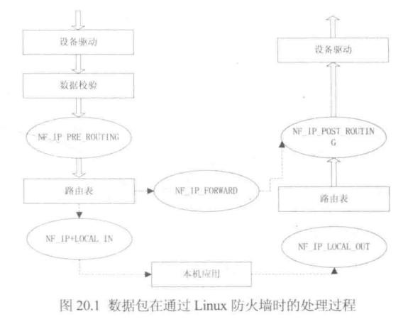

# 工作原理

- Linux内核提供的防火墙功能通过netfiter框架实现，并提供了iptables、firewalld工具配置和修改防火墙的规则。

## netfiter

- netfiter的通用框架不依赖于具体的协议，而是为每种网络协议定义一套**钩子函数**，在数据包经过协议栈的几个关键点时，调用这些钩子函数，同时协议栈将数据包和钩子函数作为参数传递给netfiter框架。
- 对于每种网络协议定义的钩子函数，任何内核模块可以对每种协议的一个或多个钩子函数进行注册，实现挂接：当某个数据包被传递给netfiter框架时，内核能检测到是否有相关模块对该协议和钩子函数进行了注册，若发现注册信息，则调用该模块注册时使用的回调函数，然后对应模块去检查、修改、丢弃该数据包并指示netfiter将该数据包传入用户空间的队列。

## netfiter体系结构

**数据包通信步骤**

 

 

## 包过滤

- 每个函数都可以对数据包进行处理，最基本的操作就是对数据包进行过滤。root用户可以通过iptables工具向内核模块注册多个过滤规则，并且指明过滤规则的优先权，每个钩子函数按照规则进行匹配，如果匹配则执行过滤操作。

| 过滤操作  | 说明                   |
| :-------- | :--------------------- |
| NF_ACCEPT | 继续正常地传送包       |
| NF_DROP   | 丢弃包，停止传送       |
| NF_STOLEN | 已经接管包，不继续传送 |
| NF_REPEAT | 再次使用该钩子函数     |

## 包选择

- 在netfiter框架上已经创建了一个包选择系统，这个包选择工具默认注册了3个表：过滤filter表、网络地址转换NAT表：mangle表。

 

- 在调用钩子函数时，按照如上的顺序来调用需要的表。
- 包过滤表只是过滤包，而不改变包，实际中由网络过滤框架来通过NF_IP_FORWARD钩子的输入和输出接口。NF_IP_LOCAL_IN和NF_IP_LOCAL_OUT也可以过滤，但只对本机。
- NAT表分别服务于两套不同的网络过滤挂钩的包，对于非本地包，NF_IP_PRE_ROUTING和NF_IP_POST_ROUTING挂钩可以很好地解决源地址和目标地址的变更问题。
- NAT表与Filter表的区别在于NAT表只有新建连接的第一个包会在表中传送，结果将被用于以后所有来自这一连接的包。如：某一连接的第一个数据包在这个表中被替换了源地址，则接下来的这条连接的所有包都将被替换源地址。
- Mangle表用于真正改变包的信息，Mangle表和所有的5个网络过滤的钩子都有关。

# firewalld

## Zone 防火墙区域/网络区域

- Zone：防火墙区域/网络区域，是一系列可以被快速执行到网络接口的预设置。

 

- 一个网络接口只能与一个网络区域对应。当数据包进入区域后，防火墙会依据区域内的规则进行逐一过滤，只有符合规则的数据包才能通过区域到达本机应用。

**共9个区域，从信任到不信任 如下：**

| 区域                    | 说明                                                         |
| :---------------------- | :----------------------------------------------------------- |
| trusted （信任）        | 信任所有的网络连接                                           |
| internal （内部网络）   | 用于企业等的内部网络，可基本信任内部网络中的计算机不会威胁计算机安全 |
| home （家庭网络）       | 可基本信任家庭网络中的计算机不会危害计算机安全               |
| work （工作网络）       | 可基本信任工作网络中的计算机不会危害计算机的安全             |
| dmz （非军事区/隔离区） | 此区域内的电脑可以公开访问，可以有限的进入内部网络           |
| external  （外部网络）  | 通常是使用了伪装的外部网络，该区域内的计算机可能会危害计算机安全 |
| public （公共区域）     | 在公共区域使用，该区域内的计算机可能会危害计算机安全         |
| block （阻塞/拒绝）     | 任何进入的网络连接都会被拒绝，并返回IPv4或IPv6的拒绝报文     |
| drop （丢弃）           | 任何进入的网络连接都会被丢弃，没有任何回复                   |

- 无论处于哪个区域，防火墙都不会拒绝由本机主动发起的网络连接，即：本地发起的数据包（包含对方响应或返回的数据包）将通过该区域。虽然这些区域已经有所描述，但实际通行规则由区域内的规则决定，最终决定连接是否被放行的是规则而不是区域的描述。

## firewall-cmd / firewall-config 配置工具

- firewall-cmd 是 firewalld的字符界面管理工具，firewalld支持动态更新，不用重启服务。

**firewalld跟iptables比起来至少有两大好处：**

- firewalld可以动态修改单条规则，而不需要像iptables那样，在修改了规则后必须得全部刷新才可以生效。
- firewalld自身并不具备防火墙的功能，而是和iptables一样需要通过内核的netfilter来实现，也就是说firewalld和 iptables一样，他们的作用都是用于维护规则，而真正使用规则干活的是内核的netfilter。


### 配置firewalld

```shell
firewall-cmd --version  # 查看版本
firewall-cmd --help     # 查看帮助

# 查看设置：
firewall-cmd --state  # 显示状态
firewall-cmd --get-active-zones  # 查看区域信息
firewall-cmd --get-zone-of-interface=eth0  # 查看指定接口所属区域
firewall-cmd --panic-on  # 拒绝所有包
firewall-cmd --panic-off  # 取消拒绝状态
firewall-cmd --query-panic  # 查看是否拒绝

# 更新防火墙规则
firewall-cmd --reload
firewall-cmd --complete-reload
# 两者的区别就是第一个无需断开连接，就是firewalld特性之一动态添加规则，第二个需要断开连接，类似重启服务

# 将接口添加到区域，默认接口都在public
firewall-cmd --zone=public --add-interface=eth0
# 永久生效再加上 --permanent 然后reload防火墙

# 设置默认接口区域，立即生效无需重启
firewall-cmd --set-default-zone=public

# 查看所有打开的端口：
firewall-cmd --zone=dmz --list-ports

# 加入一个端口到区域：
firewall-cmd --zone=dmz --add-port=8080/tcp
# 若要永久生效方法同上

# 打开一个服务，类似于将端口可视化，服务需要在配置文件中添加，/etc/firewalld 目录下有services文件夹，这个不详细说了，详情参考文档
firewall-cmd --zone=work --add-service=smtp

# 移除服务
firewall-cmd --zone=work --remove-service=smtp

# 显示支持的区域列表
firewall-cmd --get-zones

# 设置为家庭区域
firewall-cmd --set-default-zone=home

# 查看当前区域
firewall-cmd --get-active-zones

# 设置当前区域的接口
firewall-cmd --get-zone-of-interface=enp03s

# 显示所有公共区域（public）
firewall-cmd --zone=public --list-all

# 临时修改网络接口（enp0s3）为内部区域（internal）
firewall-cmd --zone=internal --change-interface=enp03s

# 永久修改网络接口enp03s为内部区域（internal）
firewall-cmd --permanent --zone=internal --change-interface=enp03s
```


### 服务管理

```shell
# 显示服务列表  
Amanda, FTP, Samba和TFTP等最重要的服务已经被FirewallD提供相应的服务，可以使用如下命令查看：

firewall-cmd --get-services

# 允许SSH服务通过
firewall-cmd --enable service=ssh

# 禁止SSH服务通过
firewall-cmd --disable service=ssh

# 打开TCP的8080端口
firewall-cmd --enable ports=8080/tcp

# 临时允许Samba服务通过600秒
firewall-cmd --enable service=samba --timeout=600

# 显示当前服务
firewall-cmd --list-services

# 添加HTTP服务到内部区域（internal）
firewall-cmd --permanent --zone=internal --add-service=http
firewall-cmd --reload     # 在不改变状态的条件下重新加载防火墙
```

### 端口管理

```shell
# 打开443/TCP端口
firewall-cmd --add-port=443/tcp

# 永久打开3690/TCP端口
firewall-cmd --permanent --add-port=3690/tcp

# 永久打开端口好像需要reload一下，临时打开好像不用，如果用了reload临时打开的端口就失效了
# 其它服务也可能是这样的，这个没有测试
firewall-cmd --reload

# 查看防火墙，添加的端口也可以看到
firewall-cmd --list-all
```


### 直接模式

```shell
# firewalld包括一种直接模式，使用它可以完成一些工作，例如打开TCP协议的9999端口
firewall-cmd --direct -add-rule ipv4 filter INPUT 0 -p tcp --dport 9000 -j ACCEPT
firewall-cmd --reload
```

### 控制端口 / 服务

- 可以通过两种方式控制端口的开放，一种是指定端口号，另一种是指定服务名。虽然开放 http 服务就是开放了 80 端口，但是还是不能通过端口号来关闭，也就是说通过指定服务名开放的就要通过指定服务名关闭；通过指定端口号开放的就要通过指定端口号关闭。还有一个要注意的就是指定端口的时候一定要指定是什么协议，tcp 还是 udp。知道这个之后以后就不用每次先关防火墙了，可以让防火墙真正的生效。

```shell
firewall-cmd --add-service=mysql        # 开放mysql端口
firewall-cmd --remove-service=http      # 阻止http端口
firewall-cmd --list-services            # 查看开放的服务
firewall-cmd --add-port=3306/tcp        # 开放通过tcp访问3306
firewall-cmd --remove-port=80tcp        # 阻止通过tcp访问3306
firewall-cmd --add-port=233/udp         # 开放通过udp访问233
firewall-cmd --list-ports               # 查看开放的端口
```

### 伪装 IP

```shell
firewall-cmd --query-masquerade # 检查是否允许伪装IP
firewall-cmd --add-masquerade   # 允许防火墙伪装IP
firewall-cmd --remove-masquerade# 禁止防火墙伪装IP
```

### 端口转发

- 端口转发可以将指定地址访问指定的端口时，将流量转发至指定地址的指定端口。转发的目的如果不指定 ip 的话就默认为本机，如果指定了 ip 却没指定端口，则默认使用来源端口。 如果配置好端口转发之后不能用，可以检查下面两个问题：

1. 比如我将 80 端口转发至 8080 端口，首先检查本地的 80 端口和目标的 8080 端口是否开放监听了
2. 其次检查是否允许伪装 IP，没允许的话要开启伪装 IP

```shell
firewall-cmd --add-forward-port=port=80:proto=tcp:toport=8080   # 将80端口的流量转发至8080
firewall-cmd --add-forward-port=proto=80:proto=tcp:toaddr=192.168.1.0.1 # 将80端口的流量转发至192.168.0.1
firewall-cmd --add-forward-port=proto=80:proto=tcp:toaddr=192.168.0.1:toport=8080 # 将80端口的流量转发至192.168.0.1的8080端口
```

- 当我们想把某个端口隐藏起来的时候，就可以在防火墙上阻止那个端口访问，然后再开一个不规则的端口，之后配置防火墙的端口转发，将流量转发过去。
- 端口转发还可以做流量分发，一个防火墙拖着好多台运行着不同服务的机器，然后用防火墙将不同端口的流量转发至不同机器。


```shell
[root@bogon ~]# firewall-cmd --get-zones
block dmz drop external home internal public trusted work
[root@bogon ~]# firewall-cmd --get-default-zone
public
[root@bogon ~]# firewall-cmd --get-active-zones
public
  interfaces: ens33
[root@bogon ~]# firewall-cmd --zone=internal --change-interface=ens33
The interface is under control of NetworkManager, setting zone to 'internal'.
success
[root@bogon ~]# firewall-cmd --get-active-zones
internal
  interfaces: ens33
[root@bogon ~]# firewall-cmd --get-zone-of-interface=ens33
internal
[root@bogon ~]# firewall-cmd --reload
success
[root@bogon ~]# firewall-cmd --get-zone-of-interface=ens33
internal
[root@bogon ~]# firewall-cmd --get-services
RH-Satellite-6 amanda-client amanda-k5-client bacula bacula-client bitcoin bitcoin-rpc bitcoin-testnet bitcoin-testnet-rpc ceph ceph-mon cfengine condor-collector ctdb dhcp dhcpv6 dhcpv6-client dns docker-registry dropbox-lansync elasticsearch freeipa-ldap freeipa-ldaps freeipa-replication freeipa-trust ftp ganglia-client ganglia-master high-availability http https imap imaps ipp ipp-client ipsec iscsi-target kadmin kerberos kibana klogin kpasswd kshell ldap ldaps libvirt libvirt-tls managesieve mdns mosh mountd ms-wbt mssql mysql nfs nrpe ntp openvpn ovirt-imageio ovirt-storageconsole ovirt-vmconsole pmcd pmproxy pmwebapi pmwebapis pop3 pop3s postgresql privoxy proxy-dhcp ptp pulseaudio puppetmaster quassel radius rpc-bind rsh rsyncd samba samba-client sane sip sips smtp smtp-submission smtps snmp snmptrap spideroak-lansync squid ssh synergy syslog syslog-tls telnet tftp tftp-client tinc tor-socks transmission-client vdsm vnc-server wbem-https xmpp-bosh xmpp-client xmpp-local xmpp-server
```