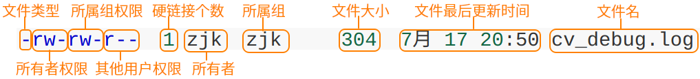

# Linux目录配置

## FHS 目录结构

 

- 基于文件系统层级标准（FHS）：Linux将文件存储在单个目录结构中（虚拟目录），虚拟目录将安装在PC上的所有存储设备的文件路径纳入单个目录结构中。Linux虚拟目录结构只包含一个根目录 / 的基础目录。根目录下的目录和文件会按照访问的目录路径一一列出。
- 根驱动器：在Linux PC上安装的第一个硬盘，包含了虚拟目录的核心，从此开始构造其他目录。
- [挂载点](#mount)：在根驱动器上创建的目录，是虚拟目录中用于分配额外存储设备的目录。虚拟目录会让（该额外存储设备上的）文件和目录出现在这些<span name="挂载点">挂载点</span>的目录上。

<table>
    <thead>
        <tr>
            <th></th>
            <th>可分享的（shareable）</th>
            <th>不可分享的（unshareable）</th>
        </tr>
    </thead>
    <tbody>
        <tr>
            <td rowspan="2">不变的（static）</td>
            <td>/usr （软件放置处）</td>
            <td>/etc （配置文件）</td>
        </tr>
        <tr>
            <td>/opt （第三方协力软件）</td>
            <td>/boot （开机与核心档）</td>
        </tr>
        <tr>
            <td rowspan="2">可变动的（variable）</td>
            <td>/var/mail （使用者邮件信箱）</td>
            <td>/var/run （程序相关）</td>
        </tr>
        <tr>
            <td>/var/spool/news （新闻群组）</td>
            <td>/var/lock （程序相关）</td>
        </tr>
    </tbody>
</table>

- FHS针对目录树架构仅定义出三层目录下面应该放置什么数据而已，分别是下面这三个目录的定义：

1. / （root， 根目录）：与开机系统有关
2. /usr （unix software resource）：与软件安装/执行有关
3. /var （vasriable）：与系统运行过程有关

- /usr目录在安装时会占用较大硬盘容量的目录；/var目录在系统运行后才会渐渐占用硬盘容量。 

### /

- FHS标准建议：根目录（/）所在分区应该越小越好， 且应用程序所安装的软件最好不要与根目录放在同一个分区内，保持根目录越小越好

<table>
    <tbody>
        <tr>
            <th colspan="2">第一部份：FHS 要求必须要存在的目录</th>
        </tr>
        <tr>
            <td>/bin</td>
            <td>二进制目录，存放系统所需要的重要命令。（命令对应的文件都是可执行的）<br />/usr/bin也存放一些系统命令，普通用户可以使用大部分的命令。</td>
        </tr>
        <tr>
            <td>/boot</td>
            <td>Linux启动时，内核及引导系统程序所需要的核心文件。<br />内核文件、gub系统引导管理器（引导装载程序）都位于此目录。</td>
        </tr>
        <tr>
            <td>/dev</td>
            <td>设备文件（光驱、磁盘等）。<br />访问该目录下某个文件相当于访问某个硬件设备，常用的是挂载光驱。</td>
        </tr>
        <tr>
            <td>/etc</td>
            <td>系统的配置文件<br />一般来说，这个目录下的各文件属性是可以让一般使用者查阅的， 但是只有root有权力修改。</td>
        </tr>
        <tr>
            <td>/lib</td>
            <td>放置的是在开机时会用到的函数库， 以及在/bin或/sbin下面的指令会调用的函数库而已。<br />FHS要求必须存在/lib/modules/，主要放置可抽换式的核心相关模块（驱动程序）</td>
        </tr>
        <tr>
            <td>/media</td>
            <td>媒体目录，可移动媒体设备（可移除设备）的常用挂载点<br />常见的文件名有：/media/floppy， /media/cdrom等等。</td>
        </tr>
        <tr>
            <td>/mnt</td>
            <td>挂载外部设备的挂载目录</td>
        </tr>
        <tr>
            <td>/opt</td>
            <td>可选目录，存放第三方软件包、数据文件</td>
        </tr>
        <tr>
            <td>/run</td>
            <td>运行目录，存放系统运行时的运行数据</td>
        </tr>
        <tr>
            <td>/sbin</td>
            <td>系统二进制目录，存放一些系统管理的命令，一般只能由root执行<br />放在/sbin下面的为开机过程中所需要的，里面包括了开机、修复、还原系统所需要的指令，包括：fdisk， fsck， ifconfig， mkfs等等。 <br />某些服务器软件程序，一般则放置到/usr/sbin/<br />本机自行安装的软件所产生的系统可执行文件（system binary）， 则放置到/usr/local/sbin/</td>
        </tr>
        <tr>
            <td>/srv</td>
            <td>服务目录（service），存放服务相关的文件<br />系统的服务数据如果尚未要提供给网际网络任何人浏览的话，默认还是建议放置到 /var/lib下面即可。</td>
        </tr>
        <tr>
            <td><span name="tmp1"><a href="#tmp2">/tmp</a></span></td>
            <td>临时文件目录，任何人都可以访问。<br />系统软件/用户运行程序时产生的临时文件存放到这里，空间不易过小。<br />此目录数据需要定期清除，重要数据不可放置在此目录下。</td>
        </tr>
        <tr>
            <td><a href="#/usr">/usr</a></td>
            <td>第二层FHS设置，用户二进制目录，应用程序存放目录（命令、帮助文件等）。<br />安装Linux软件包时默认安装到/usr/local目录下。</td>
        </tr>
        <tr>
            <td><a href="#/var">/var</a></td>
            <td>第二层FHS设置，此目录的内容经常变动的</td>
        </tr>
        <tr>
            <th colspan="2">第二部份：FHS 建议可以存在的目录</th>
        </tr>
        <tr>
            <td>/home</td>
            <td>默认的用户主目录（~）。<br />如果添加用户时不指定用户的主目录，默认在/home下创建与用户名同名的文件夹。</td>
        </tr>
        <tr>
            <td>/lib&lt;qual&gt;</td>
            <td>用来存放与 /lib 不同的格式的二进制函数库，例如支持 64 位的 /lib64 函数库等</td>
        </tr>
        <tr>
            <td>/root</td>
            <td>root用户的主目录<br />防止因为进入单人维护模式而仅挂载根目录时，该目录就能够拥有root的主文件夹，所以希望root的主文件夹与根目录放置在同一个分区中。</td>
        </tr>
        <tr>
            <th colspan="2">其他重要目录</th>
        </tr>
        <tr>
            <td>/lost+found</td>
            <td>使用标准的ext2/ext3/ext4文件系统格式才会产生该目录<br />存放系统意外崩溃、机器意外关机时产生的文件碎片</td>
        </tr>
        <tr>
            <td>/proc</td>
            <td>进程目录，存放操作系统运行时的信息<br />属于虚拟文件系统（virtual filesystem），此目录的内容存在于内存中，实际不占用磁盘空间。</td>
        </tr>
        <tr>
            <td>/sys</td>
            <td>系统目录，主要记录系统核心与系统硬件信息相关的信息。<br />属于虚拟文件系统（virtual filesystem），此目录的内容存在于内存中，实际不占用磁盘空间。</td>
        </tr>
    </tbody>
</table>

### /usr

- <span name="usr">/usr</span>（Unix Software Resource）：放置的数据属于可分享的与不可变动的（shareable， static）

<table>
    <tbody>
        <tr>
            <th colspan="2">第一部份：FHS 要求必须要存在的目录</th>
        </tr>
        <tr>
            <td >/usr/bin/</td>
            <td>所有一般用户能够使用的指令都放在这里，使用链接文件的方式将/bin链接至此<br />FHS 要求在此目录下不应该有子目录！</td>
        </tr>
        <tr>
            <td >/usr/lib/</td>
            <td>/lib就是链接到此目录中的</td>
        </tr>
        <tr>
            <td >/usr/local/</td>
            <td>系统管理员在本机自行安装自己下载的软件，建议安装到此目录</td>
        </tr>
        <tr>
            <td >/usr/sbin/</td>
            <td >非系统正常运行所需要的系统指令。<br />/sbin就是链接到此目录中的</td>
        </tr>
        <tr>
            <td >/usr/share/</td>
            <td>主要放置只读架构的数据文件，包括共享文件。 <br />在这个目录下放置的数据几乎是不分硬件架构均可读取的数据，几乎都是文本文件。<br />/usr/share/man 线上说明文档；/usr/share/doc 软件杂项的文件说明；/usr/share/zoneinfo 与时区有关的时区文件</td>
        </tr>
        <tr>
            <th colspan="2">第二部份：FHS 建议可以存在的目录</th>
        </tr>
        <tr>
            <td >/usr/games/</td>
            <td >与游戏比较相关的数据放置处</td>
        </tr>
        <tr>
            <td >/usr/include/</td>
            <td >c/c++等程序语言的文件开始（header）与包含档（include）放置处<br />以tarball方式 （*.tar.gz）安装某些数据时，会使用到此处的许多包含档</td>
        </tr>
        <tr>
            <td >/usr/libexec/</td>
            <td >某些不被一般使用者惯用的可执行文件或脚本（script）等等，都会放置在此目录中</td>
        </tr>
        <tr>
            <td >/usr/lib&lt;qual&gt;/</td>
            <td >/lib&lt;qual&gt;就是链接到此目录中</td>
        </tr>
        <tr>
            <td >/usr/src/</td>
            <td>一般源代码建议放置到这里<br />至于核心源代码则建议放置到/usr/src/linux/</td>
        </tr>
    </tbody>
</table>

### /var

- <span name="/var">/var</span>：主要针对常态性变动的文件，包括高速缓存（cache）、登录文件（log file）以及某些软件运行所产生的文件， 包括程序文件（lock file， run file），或者例如MySQL数据库的文件等等。

<table>
    <tbody>
        <tr>
            <th colspan="2">FHS 要求必须要存在的目录</th>
        </tr>
        <tr>
            <td>/var/cache/</td>
            <td>应用程序本身运行过程中会产生的一些暂存盘</td>
        </tr>
        <tr>
            <td>/var/lib/</td>
            <td>程序本身执行的过程中，需要使用到的数据文件放置的目录，在此目录下各自的软件应该要有各自的目录M<br />即：MySQL的数据库放置到/var/lib/mysql/；而rpm的数据库则放到/var/lib/rpm</td>
        </tr>
        <tr>
            <td>/var/lock/</td>
            <td>某些设备或者是文件资源一次只能被一个应用程序所使用，如果同时有两个程序使用该设备时，就可能产生一些错误的状况，因此就得要将该设备上锁（lock），以确保该设备只会给单一软件所使用。<br />目前此目录已经挪到/run/lock</td>
        </tr>
        <tr>
            <td>/var/log/</td>
            <td>登录文件放置的目录<br />/var/log/messages，/var/log/wtmp（记录登陆者的信息）等</td>
        </tr>
        <tr>
            <td>/var/mail/</td>
            <td>放置个人电子邮件信箱的目录<br />该目录也被放置到/var/spool/mail/，通常这两个目录互为链接文件</td>
        </tr>
        <tr>
            <td>/var/run/</td>
            <td>某些程序或者是服务启动后，会将他们的PID放置在这个目录下<br />该目录链接到/run</td>
        </tr>
        <tr>
            <td>/var/spool/</td>
            <td>通常放置一些伫列数据（排队等待其他程序使用的数据），这些数据被使用后通常都会被删除。 <br />如果是工作调度数据（crontab），就会被放置到/var/spool/cron/</td>
        </tr>
    </tbody>
</table>

## 目录树（directory tree）

- 目录树的启始点为根目录 （/， root）
- 每一个目录不止能使用本地端的 partition 的文件系统，也可以使用网络上的 filesystem 
- 每一个文件在此目录树中的文件名（包含完整路径）都是独一无二的。

  

# 文件/目录信息查看

## pwd 当前目录

```shell
# 绝对路径，而非链接路径
pwd -P
```

## ls 文件与目录检视

<table><tbody><tr><td>-a</td><td>显示所有文件及目录</td><td rowspan="6">&nbsp;</td><td>-r</td><td>依据首字母将文件以相反次序显示</td></tr><tr><td>-A</td><td>不显示当前目录和父目录</td><td>-R</td><td>递归显示所有子文件</td></tr><tr><td>-d</td><td>显示目录自身的属性信息</td><td>-S</td><td>依据内容大小将文件排序显示</td></tr><tr><td>-i</td><td>显示文件的inode属性信息</td><td>-t</td><td>依据最后修改时间将文件排序显示</td></tr><tr><td>-l</td><td>显示文件的详细属性信息</td><td>-X</td><td>依据扩展名将文件排序显示</td></tr><tr><td>-m</td><td>以逗号为间隔符，水平显示文件信息</td><td>-color</td><td>以彩色显示信息</td></tr></tbody></table>

```shell
# 显示当前目录中的文件名（默认不含隐藏文件）
ls

# 长信息方式显示当前目录（默认不含隐藏文件）
ls -l
ll

# 显示指定目录中的文件名（含隐藏文件）
ls -a /etc

# 依据文件内容大小进行排序，显示指定目录中文件名及其属性详情信息
ls -Sl

# 显示指定目录中一以sd开头的文件
ls /etc/sd*
```

```shell
# ls -al
total 464
drwxr-x--- 56 zjk  zjk    4096 12月 17 18:18 .
drwxr-xr-x  3 root root   4096 10月  8 15:23 ..
drwxrwxr-x  2 zjk  zjk    4096 10月 31 13:23 aiXcoder
```

### 隐藏文件/目录

- Linux的隐藏文件/目录只需要在文件/目录名前加上`.`即可

```shell
# 查看所有文件，包括隐藏文件
ls -a
```

## file  查看文件类型

## find 检索

- `find`：根据给定的路径和条件查找相关文件或目录，且支持正则表达式

<table><tbody><tr><td>-name<strong></strong></td><td>匹配文件名</td><td rowspan="7"><strong>&nbsp;</strong></td><td>-nouser<strong></strong></td><td>匹配无所属主的文件</td></tr><tr><td>-perm<strong></strong></td><td>匹配文件权限<strong></strong></td><td>-nogroup</td><td>匹配无所属组的文件<strong></strong></td></tr><tr><td>-user<strong></strong></td><td>匹配文件所属主</td><td>-newer<strong></strong></td><td>匹配比指定文件更新的文件<strong></strong></td></tr><tr><td>-group</td><td>匹配文件所属组<strong></strong></td><td>-type<strong></strong></td><td>匹配文件类型</td></tr><tr><td>-mtime<strong></strong></td><td>匹配最后修改文件内容时间<strong></strong></td><td>-size</td><td>匹配文件大小<strong></strong></td></tr><tr><td>-atime<strong></strong></td><td>匹配最后读取文件内容时间</td><td>-prune<strong></strong></td><td>不搜索指定目录<strong></strong></td></tr><tr><td>-ctime</td><td>匹配最后修改文件属性时间<strong></strong></td><td>-exec…… {}\;<strong></strong></td><td>进一步处理搜索结果<strong></strong></td></tr></tbody></table>

```shell
find 基础 判断 操作
```

```shell
# 从当前目录查找文件名开头是Hello的
find . -name "Hello*"

# 从/home/zjk/Documents开始查找属于zjk用户的文件，并将匹配到的文件及其父目录复制到/home/zjk/Doc，若不存在则创建该目录
find /home/zjk/Documents -user "zjk" -exec cp -rv {} /home/zjk/Doc \;

# 从/home/zjk/Documents开始查找属于zjk用户的文件，并将匹配到的文件及其父目录移动到/home/zjk/Doc
find /home/zjk/Documents -user "zjk" -exec mv {} /home/zjk/Doc \;
```

## basename/dirname 文件名称与目录名称

- 每个文件的完整文件名包含了前面的目录与最终的文件名（basename + dirname），而每个文件名的长度都可以到达 255 个字符

```shell
# 取得文件名network
basename /etc/sysconfig/network

# 取得目录名
dirname /etc/sysconfig/network
```

## lsof

## wc

- wc：查看文件的信息（行数、字节等），若不提供文件，则从标准输入中查看

```shell
# 查看文件的行数
wc -l test.txt
# 只查看文件的行数，而不显示文件名
wc -l < test.txt
```

## stat

- <span name="stat"><code>stat</code></span>（status）：显示文件的状态信息

<table><tbody><tr><td>-c</td><td>设置显示格式</td></tr><tr><td>-f</td><td>显示文件系统信息</td></tr><tr><td>-L</td><td>支持符号链接</td></tr><tr><td>-t</td><td>设置以简洁方式显示</td></tr><tr><td>-Z</td><td>显示SELinux安全上下文值</td></tr><tr><td>--help</td><td>显示帮助信息</td></tr><tr><td>--version</td><td>显示版本信息</td></tr>
    <tr><td>--format</td><td>格式化输出信息</td></tr></tbody></table>

```shell
# stat git_log.txt
  File: git_log.txt
  Size: 1583      	Blocks: 8          IO Block: 4096   regular file
Device: 10308h/66312d	Inode: 4068132     Links: 1
Access: (0664/-rw-rw-r--)  Uid: ( 1000/     zjk)   Gid: ( 1000/     zjk)
Access: 2024-01-13 19:36:47.612445563 +0800
Modify: 2024-01-13 19:36:47.612445563 +0800
Change: 2024-01-13 19:36:47.612445563 +0800
 Birth: 2023-12-31 11:27:48.960804510 +0800
 
# 格式化查看 stat --format
stat --format=%a:%A:%U:%G /tmp
```

# 文件/目录操作


## cd 切换目录

- cd（change directory）

```shell
# 当前目录
cd .

# 上一级目录
cd ..

# 用户主目录(home)
cd
cd ~

# 回到上次目录
cd -
```

## cp 复制

- cp（copy）：复制品的[属性与权限](#文件权限)属于执行者，而不是源文件。

```
cp 参数 源文件名 目标文件名
```

<table><tbody>
    <tr><td width="5%">-a</td><td width="42.5%">功能等价于pdr参数组合</td><td rowspan="5" width="5%"></td><td width="5%">-l</td><td width="42.5%">对源文件建立硬链接，而非复制文件</td></tr>
    <tr><td>-b</td><td>覆盖目标文件前先进行备份</td><td>-p</td><td>保留源文件或目录的所有属性信息</td></tr><tr><td>-d</td><td>复制链接文件时，将目标文件也建立为链接文件</td><td>-r</td><td>递归复制所有子文件</td></tr><tr><td>-f</td><td>若目标文件已存在，则会直接覆盖</td><td>-s</td><td>对源文件建立软链接，而非复制文件</td></tr><tr><td>-i</td><td>若目标文件已存在，则会询问是否覆盖</td><td>-v</td><td>显示执行过程详细信息</td></tr>
    <tr><td>-u</td><td>只复制时间戳晚于备份目录中的副本或未备份的文件</td><td></td></tr></tbody></table>

```shell
# 将多个文件一同复制到/etc目录中，如已有目标文件名称则默认询问是否覆盖
cp File1.cfg File2.cfg /etc
```

## touch 创建/更新文件

- `touch`：一是用于把已存在文件的时间标签更新为系统当前的时间（默认方式），它们的数据将原封不动地保留下来；二是用来创建新的空文件
- Linux系统中每个文件都有三个“历史时间”：最后访问时间（ATIME）、最后修改时间（MTIME）、最后更改时间；使用`touch`命令可以轻易修改文件的ATIME和MTIME；使用<a href="#stat"><code>stat</code></a>命令可以查看文件的这些时间，但这并不能作为文件是否被入侵的判断标准（`touch`）

<table><tbody><tr><td width="5%">-a</td><td width="42.5%">设置文件的读取时间记录</td><td rowspan="4" width="5%">&nbsp;</td><td width="5%">-t</td><td width="42.5%">设置文件的时间记录</td></tr><tr><td>-c</td><td>不创建新文件</td><td>--help</td><td>显示帮助信息</td></tr><tr><td>-d</td><td>设置时间与日期</td><td>--version</td><td>显示版本信息</td></tr><tr><td>-m</td><td>设置文件的修改时间记录</td><td>&nbsp;</td><td>&nbsp;</td></tr></tbody></table>

```shell
# 批量创建多个文件
touch {00..99}test.txt

# 更新文件的时间与日期 YYYY-MM-DD HH:mi
touch -d "2023-05-18 15:44" File.cfg
```

## mkdir/rmdir 创建/删除目录

- mkdir（make directory）：创建目录

<table><tbody><tr><td>-m</td><td>创建目录的同时设置权限</td><td rowspan="2">&nbsp;</td><td>-v</td><td>显示执行过程详细信息</td></tr><tr><td>-p</td><td>递归创建多级目录</td><td>-z</td><td>设置目录安全上下文</td></tr></tbody></table>

```shell
# 创建目录的同时赋予权限
mkdir -m 777 Dir2

# 创建多个目录
mkdir dir1 dir2

# 创建嵌套目录；默认（不使用-p时），需要一层层的创建
mkdir -p /dir1/dir2
```

- rmdir：删除空的目录，被删除的目录必须是空的

<table><tbody><tr><td>-p</td><td>递归处理所有子文件</td><td rowspan="2">&nbsp;</td><td>--help</td><td>显示帮助信息</td></tr><tr><td>-v</td><td>显示执行过程详细信息</td><td>--version</td><td>显示版本信息</td></tr></tbody></table>

```shell
# 删除当前目录的同时删除其路径上的目录（如果为空）
rmdir -p dir
```

## mv  移动/重命名

- `mv`（move）：对文件进行移动或重命名

<table><tbody><tr><td>-b<strong></strong></td><td>覆盖前为目标文件创建备份</td><td rowspan="5"><strong>&nbsp;</strong></td><td>-v<strong></strong></td><td>显示执行过程详细信息 </td></tr><tr><td>-f <strong></strong></td><td>强制覆盖目标文件而不询问<strong></strong></td><td>-Z</td><td>设置文件安全上下文 <strong></strong></td></tr><tr><td>-i<strong></strong></td><td>覆盖目标文件前询问用户是否确认 </td><td>--help<strong></strong></td><td>显示帮助信息 <strong></strong></td></tr><tr><td>-n</td><td>不要覆盖已有文件 <strong></strong></td><td>--version <strong></strong></td><td>显示版本信息</td></tr><tr><td>-u<strong></strong></td><td>当源文件比目标文件更新时，才执行覆盖操作 <strong></strong></td><td>&nbsp;</td><td><strong>&nbsp;</strong></td></tr></tbody></table>

```shell
# 将test文件移到/home
mv test /home

# 将test1文件移到/home下，并重命名为test2
mv test1 /home/test2
```

## rm 删除

- `rm`（remove）：

<table><tbody><tr><td>-d<strong></strong></td><td>仅删除无子文件的空目录</td><td rowspan="4">&nbsp;</td><td>-v<strong></strong></td><td>显示执行过程详细信息</td></tr><tr><td>-f<strong></strong></td><td>强制删除文件而不询问</td><td>--help </td><td>显示帮助信息 <strong></strong></td></tr><tr><td>-i<strong></strong></td><td>删除文件前询问用户是否确认</td><td>--version </td><td>显示版本信息<strong></strong></td></tr><tr><td>-r<strong></strong></td><td>递归删除目录及其内全部子文件</td><td>&nbsp;</td><td><strong>&nbsp;</strong></td></tr></tbody></table>

```shell
# 删库跑路，需要控制该权限
rm -rf /
```

## 压缩/解压

### zip/unzip

| 命令   | 说明               |
| ------ | ------------------ |
| gzip   | 压缩`.gz`          |
| gunzip | 解压               |
| gzcat  | 查看压缩文件的内容 |

```shell
# 将plateform目录下的所有内容连同该目录压缩到当前目录下，为target.zip
zip -r target platform/*
```

### rar/unrar

```shell
# 解压rar到当前目录
rar x my_file.rar
unrar x my_file.rar /tager
```

## tar 归档

- .tar、.tar.gz、.tgz、.tar.bz2

| 文件格式  | 命令参数 |
| --------- | -------- |
| \.tar\.xz | -xf      |

## ln 链接

- `ln`（link）：软链接相当于Windows系统中的快捷方式文件，原始文件被移动或删除后，软链接文件也将无法使用；硬链接则是将文件的inode属性块进行了复制，因此把原始文件移动或删除后，硬链接文件依然可以使用

- 硬链接：

1. 如果源文件被删除，硬链接仍然可以正常使用、读写数据
2. 不可以跨区/磁盘创建硬链接
3. 硬链接与源文件使用的是相同的设备、inode编号、文件属性和源文件相同

- 软链接（symbolic link，符号链接） `-s`：

1. 如果源文件被重命名、移动、删除，则无法继续使用软链接，因为软链接不会更新
2. 可以跨分区/磁盘创建软链接
3. 软链接的文件属性被标记为`l`，同时有指针\-\>指向源文件

```shell
# 硬链接
ln 源路径 目标路径

# 软链接
ln -s 完整源路径 目标路径
```

### inode 唯一标识符

- inode：

1. 文件可以由inode唯一识别，硬链接指向的是inode，而不是文件名，因此，硬链接会一直有效，所有硬链接不管是否被移动、重命名、删除，都会保持一致，始终指向同一个数据块。
2. Linux上的每个文件本身都是一个硬链接，创建硬链接相当于为现有的数据块创建一个新的文件名，因此，硬链接不能跨越文件系统，只能存在于一个文件系统中；且必须删除所有的硬链接，才视为彻底删除该文件
3. 每个符号链接都有自己的inode，而硬链接使用同一个inode

```shell
# 查看inode
ls -i

# 查看inode使用情况
df -i /dev

# 查看所有test.txt文件的硬链接
sudo find / -samefile test.txt
```


# 文件/目录的所属/权限

 

| 文件类型 | 说明                               |
| :------- | :--------------------------------- |
| -        | 普通文件                           |
| d        | 目录文件                           |
| l        | 符号链接文件                       |
| b/c      | b：块设备文件<br />c：字符设备文件 |
| p        | 管道文件                           |

- Linux的每个文件都有[3种类型的所有权](#chown)：所有者、组、其他用户；而每个文件都有6种权限模式：读r、写w、执行x、[黏滞位（sticky bit）、setuid、setgid](#chmod特殊模式)

- <span name="文件权限"><a href="#chmod">文件权限</a></span>：控制用户对文件的操作；对root用户而言，rw权限是可以无视的，而可执行文件则必须要有x权限（包括root用户）
- 目录权限：控制用户编辑或进入目录的操作

| 文件权限 | 对应数值 | 级别     |
| :------- | -------- | :------- |
| r        | 4        | 读权限   |
| w        | 2        | 写权限   |
| x        | 1        | 执行权限 |

## chown 文件所有者

- <span name="chown">chown（change owner）</span>：文件的所属者必须是已经存在系统中的帐号，即/etc/passwd中存在的用户名。

<table><tbody><tr><td>-c</td><td>显示所属变更信息</td><td rowspan="5">&nbsp;</td><td>-v</td><td>显示执行过程详细信息</td></tr><tr><td>-f</td><td>若该文件拥有者无法被更改也不显示错误</td><td>--help</td><td>显示帮助信息</td></tr><tr><td>-h</td><td>仅对链接文件（而非真正指向的文件）进行更改</td><td>--no-preserve-root</td><td>不特殊对待根目录</td></tr><tr><td>-P</td><td>不遍历任何符号链接</td><td>--preserve-root</td><td>不允许在根目录上执行递归操作</td></tr><tr><td>-R</td><td>递归处理所有子文件</td><td>--version</td><td>显示版本信息</td></tr></tbody></table>

```shell
# 改变指定文件的所属主与所属组
chown root:root File.txt

# 将目录中test1用户的文件所有权全部转移给另一个test2用户，可以通过UID或用户名来指定用户
chown -R --from test1 test2 /Documents
```

## chgrp 文件所属组

- chgrp（change group）：要被改变的群组名称必须要在/etc/group文件内存在，否则报错

<table ><tbody><tr><td>-c</td><td>显示调试信息</td></tr><tr><td>-f</td><td>不显示错误信息 </td></tr><tr><td>-h</td><td>对符号链接文件做修改</td></tr><tr><td>-L</td><td>遍历每个符号链接</td></tr><tr><td>-P</td><td>不遍历每个符号链接</td></tr><tr><td>-R</td><td>递归处理所有子文件</td></tr><tr><td>-v</td><td>显示执行过程详细信息</td></tr><tr><td>--help</td><td>显示帮助信息</td></tr><tr><td>--vesion</td><td>显示版本信息</td></tr></tbody></table>

```shell
chgrp -v -R root testDir
```

## chmod 文件/目录的权限

- <span name="chmod">chmod（change mode）</span>：改变文件或目录权限的命令；默认只有文件的所有者和管理员可以设置文件权限，普通用户只能管理自己文件的权限属性

<table><tbody><tr><td>-c<strong></strong></td><td>改变权限成功后再输出成功信息 </td><td rowspan="5"><strong>&nbsp;</strong></td><td>--no-preserve-root<strong></strong></td><td>不特殊对待根目录 </td></tr><tr><td>-f<strong></strong></td><td>改变权限失败后不显示错误信息 <strong></strong></td><td>--preserve-root</td><td>禁止对根目录进行递归操作 <strong></strong></td></tr><tr><td>-R<strong></strong></td><td>递归处理所有子文件 </td><td>--reference<strong></strong></td><td>使用指定参考文件的权限 <strong></strong></td></tr><tr><td>-v</td><td>显示执行过程详细信息</td><td>--version</td><td>显示版本信息</td></tr><tr><td>--help</td><td>显示帮助信息 <strong></strong></td><td><strong>&nbsp;</strong></td><td><strong>&nbsp;</strong></td></tr></tbody></table>

```shell
# [ugoa]*([-+=]([rwxXst]*|[ugo]))+|[-+=][0-7]+'
chmod u+x test.sh

# 为组和其他用户增加读写权限
chmod g+rw,o+rw test.sh

# 特殊权限模式-八进制表示法
chmod 0777 test.txt
```

### 权限对象

- chmod默认对所有（a）设置权限；可通过ugoa分别指定不同对象

<table>
    <tr>
        <td>a</td>
        <td>所属者、所属组、其他用户</td>
        <td rowspan="4"></td>
        <td>-</td>
        <td>移除权限/减去相应分数</td>
    </tr>
    <tr>
        <td>u</td>
        <td>所属者</td>
        <td>+</td>
        <td>增加权限/加上相应分数</td>
    </tr>
    <tr>
        <td>g</td>
        <td>所属组</td>
        <td>=</td>
        <td>设置为该权限/设置为该分数</td>
    </tr>
    <tr>
        <td>o</td>
        <td>其他用户</td>
        <td></td>
        <td></td>
    </tr>
</table>
### 权限表示法

- 设置权限时可以使用八进制表示法或符号表示法
- 八进制表示法：使用加法来设置对应的权限，如`777`对应`rwx rwx rwx`，也就是绝对权限

| 模式       | 特殊模式 | 所有者 u | 组 g | 其他 o | 符号       |
| ---------- | -------- | -------- | ---- | ------ | ---------- |
| 读取       |          | 4        | 4    | 4      | r          |
| 写入       |          | 2        | 2    | 2      | w          |
| 执行       |          | 1        | 1    | 1      | x          |
| setuid     | 4        |          |      |        | s（`u+s`） |
| setgid     | 2        |          |      |        | s（`g+s`） |
| sticky bit | 1        |          |      |        | t（`o+t`） |
| 无权限     |          | 0        | 0    | 0      | -          |

### 特殊权限模式

- <span name="chmod特殊模式">特殊权限模式</span>：sticky bit、setuid、setgid

<table>
    <tr>
        <td width="15%" rowspan="2">sticky bit</td>
        <td width="85%">应用对象是包含多个用户文件的目录，可以防止用户移动、重命名、删除其他人的文件</td>
    </tr>
    <tr>
        <td>restricted deletion bit 黏滞位、限制删除位，防止所有者以外的非特权用户删除或重命名目录中的文件，但可以读写，如 /tmp 目录下的文件</td>
    </tr>
    <tr>
        <td rowspan="2">setuid</td>
        <td>应用对象是可执行文件，可以将运行该命令的任何用户提升到与所有者相同的权限</td>
    </tr>
    <tr>
        <td>set user identification 设置用户标识，如 /usr/bin/passwd文件允许所有用户在运行该命令时都可以拥有root权限，但权限仅限于更改自己的密码</td>
    </tr>
    <tr>
        <td rowspan="2">setgid</td>
        <td>应用对象是目录，可以将目录中所有新建文件的组设置成目录的组；或者控制文件，将用户的有效组改为与文件所有者相同的组</td>
    </tr>
    <tr>
        <td>set group user identification 设置组用户标识，</td>
    </tr>
</table>

```shell
# 查看/tmp目录的权限设置
stat --format=%a:%A:%U:%G /tmp
# Access: (1777/drwxrwxrwt)

# 查看passwd命令的权限设置
stat /usr/bin/passwd
# Access: (4755/-rwsr-xr-x)
```

## umask 权限掩码

- <code><span name="umask">umask</span></code>（user file-creation mode mask）：用于管理权限掩码，权限掩码是由3个八进制的数字所组成，将现有的存取权限减掉权限掩码后，即可获得建立文件时预设的权限。例如当前Linux系统默认对于普通文件的存取权限为666，若将umask设定为022，则最终建立文件时权限为644
- <a href="./用户管理.md#/etc/login.defs"><code>/etc/login.defs</code></a>：修改`UMASK 022`即为默认的权限掩码设置；或者在<a href="Shell.md#bashrc"><code>~/.bashrc</code></a>中增加`umask 0022`命令在会话进行初始化时设置

<table><tbody><tr><td>-p</td><td>输出的权限掩码可直接作为指令来执行</td></tr><tr><td>-S </td><td>使用文字来表示权限掩码 </td></tr></tbody></table>

```shell
# 在当前会话临时更改UMASK为022
umask 0022
```

# 临时文件 /tmp

## /tmp概述

- Linux系统有一个专门用于临时文件使用的特殊目录<span name="tmp2"><a href="#tmp1">/tmp</a></span>，其中存放不需要永久保存的文件。

1. 大多数的Linux发行版会在启动时自动删除/tmp目录下的所有文件。
2. 所有用户都有权限读写/tmp目录下的文件（只是属于自己的临时文件可以被读写）。

## mktemp 创建临时文件

- <code>mktemp</code>命令用于创建临时文件，所创建的临时文件不使用默认的<a href="#umask">umask</a>值。用户作为临时文件的属主，拥有对临时文件的读写权限。
- Create a temporary file or directory, safely, and print its name（全路径名）.  TEMPLATE must contain at least 3 consecutive 'X's in last component.  If TEMPLATE is not specified, use tmp.XXXXXXXXXX, and `--tmpdir` is implied.  Files are created u+rw, and directories u+rwx, minus umask restrictions.

1. 默认情况下，<code>mktemp</code>命令会在本地目录中创建一个文件，只需要指定一个<b>文件名模板</b>即可，文件名模板可以是容易字符，只要文件后缀是 <code>.XXXXXX</code>即可（至少3个X）。<code>mktemp</code>命令会自动将<code>XXXXXX</code>替换为相同数量的字符，以确保在当前目录下该文件的唯一性。
2. <code>mktemp</code>命令会输出其创建的临时文件的文件名。

<table>
    <thead>
        <tr>
            <th width="30%">选项</th>
            <th width="70%">描述</th>
        </tr>
    </thead>
    <tbody>
        <tr>
            <td><code>-d, --directory</code></td>
            <td>create a directory（临时目录）, not a file</td>
        </tr>
        <tr>
            <td><code>-u, --dry-run</code></td>
            <td>do not create anything; merely print a name (unsafe)</td>
        </tr>
        <tr>
            <td><code>-q, --quiet</code></td>
            <td>suppress diagnostics about file/dir-creation failure</td>
        </tr>
        <tr>
            <td><code>--suffix=SUFF</code></td>
            <td>append SUFF to TEMPLATE; SUFF must not contain a slash（<code>/</code>）.  This option is implied if TEMPLATE does not end in X（这是个隐含选项）</td>
        </tr>
        <tr>
            <td><code>-p DIR, --tmpdir[=DIR]</code></td>
            <td>interpret  TEMPLATE  relative  to DIR; if DIR is not specified, use <b>$TMPDIR</b> if set, else /tmp.  With this option, TEMPLATE must not be an absolute name; unlike with -t, TEMPLATE may contain slashes, but mktemp creates only the final component
</td>
        </tr>
        <tr>
            <td><del><code>-t</code></del></td>
            <td><del>interpret TEMPLATE as a single file name component, relative to a directory: $TMPDIR, if set; else the directory specified via -p; else /tmp [deprecated]</del></td>
        </tr>
        <tr>
            <td><code>--help</code></td>
            <td>显示帮助信息并退出程序</td>
        </tr>
        <tr>
            <td><code>--version</code></td>
            <td>输出版本信息并退出程序</td>
        </tr>
    </tbody>
</table>


```shell
mktemp i_temp.XXXXXX
```

