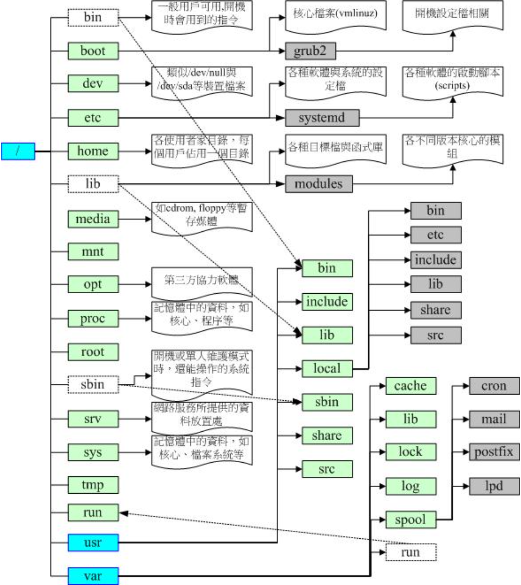

# 文件/目录信息查看

## pwd 当前目录

```shell
# 绝对路径，而非链接路径
pwd -P
```

## ls 文件与目录检视

<table><tbody><tr><td>-a</td><td>显示所有文件及目录</td><td rowspan="6">&nbsp;</td><td>-r</td><td>依据首字母将文件以相反次序显示</td></tr><tr><td>-A</td><td>不显示当前目录和父目录</td><td>-R</td><td>递归显示所有子文件</td></tr><tr><td>-d</td><td>显示目录自身的属性信息</td><td>-S</td><td>依据内容大小将文件排序显示</td></tr><tr><td>-i</td><td>显示文件的inode属性信息</td><td>-t</td><td>依据最后修改时间将文件排序显示</td></tr><tr><td>-l</td><td>显示文件的详细属性信息</td><td>-X</td><td>依据扩展名将文件排序显示</td></tr><tr><td>-m</td><td>以逗号为间隔符，水平显示文件信息</td><td>-color</td><td>以彩色显示信息</td></tr></tbody></table>

```shell
# 显示当前目录中的文件名（默认不含隐藏文件）
ls

# 长信息方式显示当前目录（默认不含隐藏文件）
ls -l
ll

# 显示指定目录中的文件名（含隐藏文件）
ls -a /etc

# 依据文件内容大小进行排序，显示指定目录中文件名及其属性详情信息
ls -Sl

# 显示指定目录中一以sd开头的文件
ls /etc/sd*
```

```shell
# ls -al
total 464
drwxr-x--- 56 zjk  zjk    4096 12月 17 18:18 .
drwxr-xr-x  3 root root   4096 10月  8 15:23 ..
drwxrwxr-x  2 zjk  zjk    4096 10月 31 13:23 aiXcoder
```

## file  查看文件类型

## find 检索

```shell
# 从当前目录查找文件名开头是Hello的
find . -name "Hello*"
```

## basename/dirname 文件名称与目录名称

- 每个文件的完整文件名包含了前面的目录与最终的文件名（basename + dirname），而每个文件名的长度都可以到达 255 个字符

```shell
# 取得文件名network
basename /etc/sysconfig/network

# 取得目录名
dirname /etc/sysconfig/network
```

## lsof

## wc

- wc：查看文件的信息（行数、字节等），若不提供文件，则从标准输入中查看

```shell
# 查看文件的行数
wc -l test.txt
# 只查看文件的行数，而不显示文件名
wc -l < test.txt
```

# 文件/目录操作

## cd 切换目录

- cd（change directory）

```shell
# 当前目录
cd .

# 上一级目录
cd ..

# 用户主目录(home)
cd
cd ~

# 回到上次目录
cd -
```

## cp 复制

- cp（copy）：复制品的[属性与权限](#文件权限)属于执行者，而不是源文件。

```
cp 参数 源文件名 目标文件名
```

<table><tbody><tr><td>-a</td><td>功能等价于pdr参数组合</td><td rowspan="5">&nbsp;</td><td>-l</td><td>对源文件建立硬链接，而非复制文件</td></tr><tr><td>-b</td><td>覆盖目标文件前先进行备份</td><td>-p</td><td>保留源文件或目录的所有属性信息</td></tr><tr><td>-d</td><td>复制链接文件时，将目标文件也建立为链接文件</td><td>-r</td><td>递归复制所有子文件</td></tr><tr><td>-f</td><td>若目标文件已存在，则会直接覆盖</td><td>-s</td><td>对源文件建立软链接，而非复制文件</td></tr><tr><td>-i</td><td>若目标文件已存在，则会询问是否覆盖</td><td>-v</td><td>显示执行过程详细信息</td></tr></tbody></table>

```shell
# 将多个文件一同复制到/etc目录中，如已有目标文件名称则默认询问是否覆盖
cp File1.cfg File2.cfg /etc
```

## touch 创建/更新文件

## mkdir/rmdir 创建/删除目录

- mkdir（make directory）：创建目录

<table><tbody><tr><td>-m</td><td>创建目录的同时设置权限</td><td rowspan="2">&nbsp;</td><td>-v</td><td>显示执行过程详细信息</td></tr><tr><td>-p</td><td>递归创建多级目录</td><td>-z</td><td>设置目录安全上下文</td></tr></tbody></table>

```shell
# 创建目录的同时赋予权限
mkdir -m 777 Dir2

# 创建多个目录
mkdir dir1 dir2

# 创建嵌套目录；默认（不使用-p时），需要一层层的创建
mkdir -p /dir1/dir2
```

- rmdir：删除空的目录，被删除的目录必须是空的

<table><tbody><tr><td>-p</td><td>递归处理所有子文件</td><td rowspan="2">&nbsp;</td><td>--help</td><td>显示帮助信息</td></tr><tr><td>-v</td><td>显示执行过程详细信息</td><td>--version</td><td>显示版本信息</td></tr></tbody></table>

```shell
# 删除当前目录的同时删除其路径上的目录（如果为空）
rmdir -p dir
```

## mv  移动/重命名

## rm 删除


## 压缩/解压

### zip/unzip

| 命令   | 说明               |
| ------ | ------------------ |
| gzip   | 压缩`.gz`          |
| gunzip | 解压               |
| gzcat  | 查看压缩文件的内容 |

### rar/unrar

```shell
# 解压rar到当前目录
rar e my_file.rar
unrar x my_file.rar /tager
```

## tar 归档

- .tar、.tar.gz、.tgz、.tar.bz2

| 文件格式  | 命令参数 |
| --------- | -------- |
| \.tar\.xz | -xf      |

## ln 链接

```shell
# 硬链接
ln 源路径 目标路径

# 软链接
ln -s 完整源路径 目标路径
```

- 硬链接：

1. 如果源文件被删除，硬链接仍然可以正常使用、读写数据
2. 不可以跨区/磁盘创建硬链接
3. 硬链接与源文件使用的是相同的设备、inode编号、文件属性和源文件相同

- 软链接 \-s：

1. 如果源文件被删除，则无法继续使用软链接
2. 可以跨分区/磁盘创建软链接
3. 软链接的文件属性被标记为`l`，同时有指针\-\>指向源文件

# 文件/目录的所属/权限

 

| 文件类型 | 说明                               |
| :------- | :--------------------------------- |
| -        | 普通文件                           |
| d        | 目录文件                           |
| l        | 符号链接文件                       |
| b/c      | b：块设备文件<br />c：字符设备文件 |
| p        | 管道文件                           |

- <span name="文件权限">文件权限</span>：对root用户而言，rw权限是可以无视的，而可执行文件则必须要有x权限（包括root用户）

| 文件权限 | 对应数值 | 级别     |
| :------- | -------- | :------- |
| r        | 4        | 读权限   |
| w        | 2        | 写权限   |
| x        | 1        | 执行权限 |

- 设置权限时可以使用数字法或字母表达式，777对应rwx rwx rwx，也就是绝对权限。

## chown 文件所有者

- chown（change owner）：文件的所属者必须是已经存在系统中的帐号，即/etc/passwd中存在的用户名。

<table><tbody><tr><td>-c</td><td>显示所属变更信息</td><td rowspan="5">&nbsp;</td><td>-v</td><td>显示执行过程详细信息</td></tr><tr><td>-f</td><td>若该文件拥有者无法被更改也不显示错误</td><td>--help</td><td>显示帮助信息</td></tr><tr><td>-h</td><td>仅对链接文件（而非真正指向的文件）进行更改</td><td>--no-preserve-root</td><td>不特殊对待根目录</td></tr><tr><td>-P</td><td>不遍历任何符号链接</td><td>--preserve-root</td><td>不允许在根目录上执行递归操作</td></tr><tr><td>-R</td><td>递归处理所有子文件</td><td>--version</td><td>显示版本信息</td></tr></tbody></table>

```shell
# 改变指定文件的所属主与所属组
chown root:root File.txt
```

## chgrp 文件所属组

- chgrp（change group）：要被改变的群组名称必须要在/etc/group文件内存在，否则报错

<table ><tbody><tr><td>-c</td><td>显示调试信息</td></tr><tr><td>-f</td><td>不显示错误信息 </td></tr><tr><td>-h</td><td>对符号链接文件做修改</td></tr><tr><td>-L</td><td>遍历每个符号链接</td></tr><tr><td>-P</td><td>不遍历每个符号链接</td></tr><tr><td>-R</td><td>递归处理所有子文件</td></tr><tr><td>-v</td><td>显示执行过程详细信息</td></tr><tr><td>--help</td><td>显示帮助信息</td></tr><tr><td>--vesion</td><td>显示版本信息</td></tr></tbody></table>

```shell
chgrp -v -R root testDir
```

## chmod 文件/目录的权限

- chmod（change mode）：改变文件或目录权限的命令；默认只有文件的所有者和管理员可以设置文件权限，普通用户只能管理自己文件的权限属性。

<table><tbody><tr><td>-c<strong></strong></td><td>改变权限成功后再输出成功信息 </td><td rowspan="5"><strong>&nbsp;</strong></td><td>--no-preserve-root<strong></strong></td><td>不特殊对待根目录 </td></tr><tr><td>-f<strong></strong></td><td>改变权限失败后不显示错误信息 <strong></strong></td><td>--preserve-root</td><td>禁止对根目录进行递归操作 <strong></strong></td></tr><tr><td>-R<strong></strong></td><td>递归处理所有子文件 </td><td>--reference<strong></strong></td><td>使用指定参考文件的权限 <strong></strong></td></tr><tr><td>-v</td><td>显示执行过程详细信息</td><td>--version</td><td>显示版本信息</td></tr><tr><td>--help</td><td>显示帮助信息 <strong></strong></td><td><strong>&nbsp;</strong></td><td><strong>&nbsp;</strong></td></tr></tbody></table>

```shell
# [ugoa]*([-+=]([rwxXst]*|[ugo]))+|[-+=][0-7]+'
chmod u+x test.sh
```

- chmod默认对所有（a）设置权限；可通过ugoa分别指定不同对象

<table>
    <tr>
        <td>a</td>
        <td>所属者、所属组、其他用户</td>
        <td rowspan="4"></td>
        <td>-</td>
        <td>移除权限/减去相应分数</td>
    </tr>
    <tr>
        <td>u</td>
        <td>所属者</td>
        <td>+</td>
        <td>增加权限/加上相应分数</td>
    </tr>
    <tr>
        <td>g</td>
        <td>所属组</td>
        <td>=</td>
        <td>设置为该权限/设置为该分数</td>
    </tr>
    <tr>
        <td>o</td>
        <td>其他用户</td>
        <td></td>
        <td></td>
    </tr>
</table>


# Linux目录配置

## FHS 目录结构

- 基于文件系统层级标准（FHS）：Linux将文件存储在单个目录结构中（虚拟目录），虚拟目录将安装在PC上的所有存储设备的文件路径纳入单个目录结构中。Linux虚拟目录结构只包含一个根目录 / 的基础目录。根目录下的目录和文件会按照访问的目录路径一一列出。
- 根驱动器：在Linux PC上安装的第一个硬盘，包含了虚拟目录的核心，从此开始构造其他目录。
- [挂载点](#mount)：在根驱动器上创建的目录，是虚拟目录中用于分配额外存储设备的目录。虚拟目录会让（该额外存储设备上的）文件和目录出现在这些<span name="挂载点">挂载点</span>的目录上。

<table>
    <thead>
        <tr>
            <th></th>
            <th>可分享的（shareable）</th>
            <th>不可分享的（unshareable）</th>
        </tr>
    </thead>
    <tbody>
        <tr>
            <td rowspan="2">不变的（static）</td>
            <td>/usr （软件放置处）</td>
            <td>/etc （配置文件）</td>
        </tr>
        <tr>
            <td>/opt （第三方协力软件）</td>
            <td>/boot （开机与核心档）</td>
        </tr>
        <tr>
            <td rowspan="2">可变动的（variable）</td>
            <td>/var/mail （使用者邮件信箱）</td>
            <td>/var/run （程序相关）</td>
        </tr>
        <tr>
            <td>/var/spool/news （新闻群组）</td>
            <td>/var/lock （程序相关）</td>
        </tr>
    </tbody>
</table>


- FHS针对目录树架构仅定义出三层目录下面应该放置什么数据而已，分别是下面这三个目录的定义：

1. / （root， 根目录）：与开机系统有关
2. /usr （unix software resource）：与软件安装/执行有关
3. /var （vasriable）：与系统运行过程有关

- /usr目录在安装时会占用较大硬盘容量的目录；/var目录在系统运行后才会渐渐占用硬盘容量。 

### /

- FHS标准建议：根目录（/）所在分区应该越小越好， 且应用程序所安装的软件最好不要与根目录放在同一个分区内，保持根目录越小越好

<table>
    <tbody>
        <tr>
            <th colspan="2">第一部份：FHS 要求必须要存在的目录</th>
        </tr>
        <tr>
            <td>/bin</td>
            <td>二进制目录，存放系统所需要的重要命令。（命令对应的文件都是可执行的）<br />/usr/bin也存放一些系统命令，普通用户可以使用大部分的命令。</td>
        </tr>
        <tr>
            <td>/boot</td>
            <td>Linux启动时，内核及引导系统程序所需要的核心文件。<br />内核文件、gub系统引导管理器（引导装载程序）都位于此目录。</td>
        </tr>
        <tr>
            <td>/dev</td>
            <td>设备文件（光驱、磁盘等）。<br />访问该目录下某个文件相当于访问某个硬件设备，常用的是挂载光驱。</td>
        </tr>
        <tr>
            <td>/etc</td>
            <td>系统的配置文件<br />一般来说，这个目录下的各文件属性是可以让一般使用者查阅的， 但是只有root有权力修改。</td>
        </tr>
        <tr>
            <td>/lib</td>
            <td>放置的是在开机时会用到的函数库， 以及在/bin或/sbin下面的指令会调用的函数库而已。<br />FHS要求必须存在/lib/modules/，主要放置可抽换式的核心相关模块（驱动程序）</td>
        </tr>
        <tr>
            <td>/media</td>
            <td>媒体目录，可移动媒体设备（可移除设备）的常用挂载点<br />常见的文件名有：/media/floppy， /media/cdrom等等。</td>
        </tr>
        <tr>
            <td>/mnt</td>
            <td>挂载外部设备的挂载目录</td>
        </tr>
        <tr>
            <td>/opt</td>
            <td>可选目录，存放第三方软件包、数据文件</td>
        </tr>
        <tr>
            <td>/run</td>
            <td>运行目录，存放系统运行时的运行数据</td>
        </tr>
        <tr>
            <td>/sbin</td>
            <td>系统二进制目录，存放一些系统管理的命令，一般只能由root执行<br />放在/sbin下面的为开机过程中所需要的，里面包括了开机、修复、还原系统所需要的指令，包括：fdisk， fsck， ifconfig， mkfs等等。 <br />某些服务器软件程序，一般则放置到/usr/sbin/<br />本机自行安装的软件所产生的系统可执行文件（system binary）， 则放置到/usr/local/sbin/</td>
        </tr>
        <tr>
            <td>/srv</td>
            <td>服务目录（service），存放服务相关的文件<br />系统的服务数据如果尚未要提供给网际网络任何人浏览的话，默认还是建议放置到 /var/lib下面即可。</td>
        </tr>
        <tr>
            <td >/tmp</td>
            <td>临时文件目录，任何人都可以访问。<br />系统软件/用户运行程序时产生的临时文件存放到这里，空间不易过小。<br />此目录数据需要定期清除，重要数据不可放置在此目录下。</td>
        </tr>
        <tr>
            <td><a href="#/usr">/usr</a></td>
            <td>第二层FHS设置，用户二进制目录，应用程序存放目录（命令、帮助文件等）。<br />安装Linux软件包时默认安装到/usr/local目录下。</td>
        </tr>
        <tr>
            <td><a href="#/var">/var</a></td>
            <td>第二层FHS设置，此目录的内容经常变动的</td>
        </tr>
        <tr>
            <th colspan="2">第二部份：FHS 建议可以存在的目录</th>
        </tr>
        <tr>
            <td>/home</td>
            <td>默认的用户主目录（~）。<br />如果添加用户时不指定用户的主目录，默认在/home下创建与用户名同名的文件夹。</td>
        </tr>
        <tr>
            <td>/lib&lt;qual&gt;</td>
            <td>用来存放与 /lib 不同的格式的二进制函数库，例如支持 64 位的 /lib64 函数库等</td>
        </tr>
        <tr>
            <td>/root</td>
            <td>root用户的主目录<br />防止因为进入单人维护模式而仅挂载根目录时，该目录就能够拥有root的主文件夹，所以希望root的主文件夹与根目录放置在同一个分区中。</td>
        </tr>
        <tr>
            <th colspan="2">其他重要目录</th>
        </tr>
        <tr>
            <td>/lost+found</td>
            <td>使用标准的ext2/ext3/ext4文件系统格式才会产生该目录<br />存放系统意外崩溃、机器意外关机时产生的文件碎片</td>
        </tr>
        <tr>
            <td>/proc</td>
            <td>进程目录，存放操作系统运行时的信息<br />属于虚拟文件系统（virtual filesystem），此目录的内容存在于内存中，实际不占用磁盘空间。</td>
        </tr>
        <tr>
            <td>/sys</td>
            <td>系统目录，主要记录系统核心与系统硬件信息相关的信息。<br />属于虚拟文件系统（virtual filesystem），此目录的内容存在于内存中，实际不占用磁盘空间。</td>
        </tr>
    </tbody>
</table>


### /usr

- <span name="usr">/usr</span>（Unix Software Resource）：放置的数据属于可分享的与不可变动的（shareable， static）

<table>
    <tbody>
        <tr>
            <th colspan="2">第一部份：FHS 要求必须要存在的目录</th>
        </tr>
        <tr>
            <td >/usr/bin/</td>
            <td>所有一般用户能够使用的指令都放在这里，使用链接文件的方式将/bin链接至此<br />FHS 要求在此目录下不应该有子目录！</td>
        </tr>
        <tr>
            <td >/usr/lib/</td>
            <td>/lib就是链接到此目录中的</td>
        </tr>
        <tr>
            <td >/usr/local/</td>
            <td>系统管理员在本机自行安装自己下载的软件，建议安装到此目录</td>
        </tr>
        <tr>
            <td >/usr/sbin/</td>
            <td >非系统正常运行所需要的系统指令。<br />/sbin就是链接到此目录中的</td>
        </tr>
        <tr>
            <td >/usr/share/</td>
            <td>主要放置只读架构的数据文件，包括共享文件。 <br />在这个目录下放置的数据几乎是不分硬件架构均可读取的数据，几乎都是文本文件。<br />/usr/share/man 线上说明文档；/usr/share/doc 软件杂项的文件说明；/usr/share/zoneinfo 与时区有关的时区文件</td>
        </tr>
        <tr>
            <th colspan="2">第二部份：FHS 建议可以存在的目录</th>
        </tr>
        <tr>
            <td >/usr/games/</td>
            <td >与游戏比较相关的数据放置处</td>
        </tr>
        <tr>
            <td >/usr/include/</td>
            <td >c/c++等程序语言的文件开始（header）与包含档（include）放置处<br />以tarball方式 （*.tar.gz）安装某些数据时，会使用到此处的许多包含档</td>
        </tr>
        <tr>
            <td >/usr/libexec/</td>
            <td >某些不被一般使用者惯用的可执行文件或脚本（script）等等，都会放置在此目录中</td>
        </tr>
        <tr>
            <td >/usr/lib&lt;qual&gt;/</td>
            <td >/lib&lt;qual&gt;就是链接到此目录中</td>
        </tr>
        <tr>
            <td >/usr/src/</td>
            <td>一般源代码建议放置到这里<br />至于核心源代码则建议放置到/usr/src/linux/</td>
        </tr>
    </tbody>
</table>


### /var

- <span name="/var">/var</span>：主要针对常态性变动的文件，包括高速缓存（cache）、登录文件（log file）以及某些软件运行所产生的文件， 包括程序文件（lock file， run file），或者例如MySQL数据库的文件等等。

<table>
    <tbody>
        <tr>
            <th colspan="2">FHS 要求必须要存在的目录</th>
        </tr>
        <tr>
            <td>/var/cache/</td>
            <td>应用程序本身运行过程中会产生的一些暂存盘</td>
        </tr>
        <tr>
            <td>/var/lib/</td>
            <td>程序本身执行的过程中，需要使用到的数据文件放置的目录，在此目录下各自的软件应该要有各自的目录M<br />即：MySQL的数据库放置到/var/lib/mysql/；而rpm的数据库则放到/var/lib/rpm</td>
        </tr>
        <tr>
            <td>/var/lock/</td>
            <td>某些设备或者是文件资源一次只能被一个应用程序所使用，如果同时有两个程序使用该设备时，就可能产生一些错误的状况，因此就得要将该设备上锁（lock），以确保该设备只会给单一软件所使用。<br />目前此目录已经挪到/run/lock</td>
        </tr>
        <tr>
            <td>/var/log/</td>
            <td>登录文件放置的目录<br />/var/log/messages，/var/log/wtmp（记录登陆者的信息）等</td>
        </tr>
        <tr>
            <td>/var/mail/</td>
            <td>放置个人电子邮件信箱的目录<br />该目录也被放置到/var/spool/mail/，通常这两个目录互为链接文件</td>
        </tr>
        <tr>
            <td>/var/run/</td>
            <td>某些程序或者是服务启动后，会将他们的PID放置在这个目录下<br />该目录链接到/run</td>
        </tr>
        <tr>
            <td>/var/spool/</td>
            <td>通常放置一些伫列数据（排队等待其他程序使用的数据），这些数据被使用后通常都会被删除。 <br />如果是工作调度数据（crontab），就会被放置到/var/spool/cron/</td>
        </tr>
    </tbody>
</table>


## 目录树（directory tree）

- 目录树的启始点为根目录 （/， root）
- 每一个目录不止能使用本地端的 partition 的文件系统，也可以使用网络上的 filesystem 
- 每一个文件在此目录树中的文件名（包含完整路径）都是独一无二的。

 

# 
