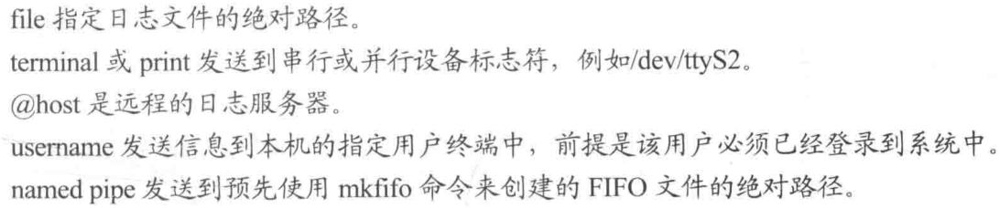

# 日志系统

## /var/log 日志目录

- Linux日志一般放在/var/log下，需要root用户权限。

| 日志类型     | 说明                                                         |
| :----------- | :----------------------------------------------------------- |
| 系统连接日志 | 记录系统的登录记录和用户名，写录到/var/log/wtmp、/var/log/utmp |
| 进程统计     | 系统内核执行，当一个进程终止时为每个进程往进程统计文件中写一个记录 |
| 错误日志     | 各种系统守护进程、用户程序和内核，通过syslog向/var/log/messages写录 |

| /var/log文件 | 说明                                       |
| :----------- | :----------------------------------------- |
| btmp         | 记录失败的记录                             |
| syslog       | 从syslog中记录信息                         |
| wtmp         | 一个用户每次登录和退出时间的永久记录       |
| lastlog      | 记录最后一次失败的登录和最近几次成功的登录 |
| dmesg        | Linux系统启动信息                          |
| **rpm系**    | **说明**                                   |
| messages     | 服务器的系统日志                           |
| access-log   | 记录Web服务访问日志，错误信息存于error-log |
| acct/pacct   | 记录用户命令                               |
| sudolog      | 记录使用sudo发出的命令                     |
| sulog        | 记录su命令的使用                           |
| secure       | 记录系统登录行为                           |
| utmp         | 记录当前登录的每个用户                     |

## 日志信息查看命令

| 命令   | 说明                                                         | 对应文件       |
| ------ | ------------------------------------------------------------ | -------------- |
| who、w | 显示目前登录系统的用户信息                                   | /var/log/wtmp  |
| users  | 显示当前登录系统的所有用户<br />如果一个用户有不止一个登录会话，那他的用户名将显示相同的次数 |                |
| last   | 列出目前与过去登录系统的用户相关信息                         | /var/log/wtmp  |
| dmesg  | 显示Linux系统启动信息，检查和控制内核的环形缓冲区            | /var/log/dmesg |

## /etc/rsyslog.conf 日志系统

```shell
# 服务1.优先级;服务2.优先级    操作动作
*.info;mail.none  /var/log/messages
```

| 日志设备       | 功能                              |
| -------------- | --------------------------------- |
| auth           | pam\_pwdb报告的认证活动           |
| authpriv       | 包括特权信息在内的认证活动        |
| cron           | 与cron、at相关的计划任务信息      |
| daemon         | 与inetd守护进程相关的后台进程信息 |
| kern           | 内核信息，先通过klogd传递         |
| lpr            | 与打印服务有关的信息              |
| mail           | 与电子邮件有关的信息              |
| mark           | syslog内部功能，用于生成时间戳    |
| news           | 来自新闻服务器的信息              |
| syslog         | syslog生成的信息                  |
| user           | 用户程序生成的信息                |
| uucp           | uucp生成的信息                    |
| local0\~local7 | 自定义程序使用                    |

| 优先级限定符 | 说明                                                         |
| :----------- | :----------------------------------------------------------- |
| \*           | 服务生成的所有日志消息都发送到操作动作指定的地点             |
| =            | 服务生成的本优先级的日志消息都发送到操作动作指定的地点       |
| \!           | 服务生成的所有日志消息都发送到操作动作指定的地点，但本优先级的消息不包括在内 |

- 操作动作：每条消息都会经过所有的规则，并非唯一匹配的

 

## /etc/logrotate.conf 日志轮转

- /etc/logrotate.conf：对系统日志进行轮转、压缩、删除、发送到指定邮箱。每个记录文件都可被设置成每日/周/月处理、或文件太大时处理。

```shell
# rotate log files weekly 每周轮转
weekly

# keep 4 weeks worth of backlogs 保存过去四周的文件
rotate 4

# create new (empty) log files after rotating old ones 轮转以后创建新的空白日志文件
create

# use date as a suffix of the rotated file 轮转的文件以日期结尾
dateext

# uncomment this if you want your log files compressed 如果需要对轮转后的日志压缩，去掉此行注释
# compress

# RPM packages drop log rotation information into this directory 其他配置存放的文件目录;即用户自定义的配置
include /etc/logrotate.d

# no packages own wtmp and btmp -- we'll rotate them here 一些系统日志的轮转规则
/var/log/wtmp {
    monthly
    create 0664 root utmp
        minsize 1M
    rotate 1
}

/var/log/btmp {
    missingok
    monthly
    create 0600 root utmp
    rotate 1
}

# system-specific logs may be also be configured here.
```

### /etc/logrotate.d 自定义配置轮转

 

```shell
# 测试轮转：无error日志，则正常生成轮转配置文件。
/user/sbin/logrotate -vf /etc/logrotate.conf
```

# 计划任务

## at 定时任务

| 命令 | 说明                           |
| ---- | ------------------------------ |
| at   | 在指定时间执行任务，只执行一次 |
| atq  | 显示当前所有定时任务           |
| atrm | 删除指定序号的定时任务         |

| 指定时间的格式 | 说明                                                         |
| -------------- | ------------------------------------------------------------ |
| 绝对计时法     | 当天的hh:mm。若该时间已过去，那么就放在第二天执行。<br />midnight（深夜），noon（中午），teatime（一般是下午4点）等比较模糊的词语来指定时间。<br />12小时计时制，时间后面加上AM（上午）、PM（下午）。<br />具体日期，指定格式为month day、mm/dd/yy、dd.mm.yy。指定的日期必须跟在指定时间的后面。 |
| 相对计时法     | now + count time-units：now当前时间、time-units是时间单位 minutes（分钟）、hours（小时）、days（天）、weeks（星期）、count是时间的数量，究竟是几天，还是几小时，等等。<br />直接使用today（今天）、tomorrow（明天）。 |

```shell
# at 23:43 today
at> date >/root/today.log            
at> <EOT>
job 3 at Sun Nov 27 23:43:00 2022
```

```shell
# atq
4       Wed Nov 30 08:40:00 2022 a root
```

## crontab 周期任务

- <span namr="crontab">crontab</span>：提交和管理用户需要周期性执行的任务。默认会安装此服务工具，并自动启动crond进程，crond进程每分钟会定期检查是否有要执行的任务，如果有要执行的任务，则自动执行该任务。

```shell
crontab [选项] [crontab 的任务列表文件]
```

```shell
# 打开cron配置文件进行编辑
crontab -e
```

## 任务调度

### 系统任务调度 /etc/crontab

- 系统任务调度的配置文件`/etc/crontab`：系统周期性所要执行的工作，比如写缓存数据到硬盘、日志清理等。

```shell
[root@localhost etc]# ll | grep cron
-rw-------.  1 root root      541 Mar 30  2017 anacrontab
drwxr-xr-x.  2 root root       54 Nov 13 21:16 cron.d
drwxr-xr-x.  2 root root       70 Nov 13 21:16 cron.daily
-rw-------.  1 root root        0 Mar 30  2017 cron.deny
drwxr-xr-x.  2 root root       41 Nov 13 21:16 cron.hourly
drwxr-xr-x.  2 root root        6 Dec 28  2013 cron.monthly
-rw-r--r--.  1 root root      451 Dec 28  2013 crontab
drwxr-xr-x.  2 root root        6 Dec 28  2013 cron.weekly
```

### 用户任务调度 /var/spool/cron

- 用户定期要执行的工作，比如用户数据备份、定时邮件提醒等。
- 所有用户定义的crontab文件都被保存在`/var/spool/cron`目录中。其文件名与用户名一致，

| 使用者权限文件   | 说明                                        |
| ---------------- | ------------------------------------------- |
| /etc/cron\.deny  | 该文件中所列用户不允许使用crontab命令       |
| /var/spool/cron/ | 所有用户crontab文件存放的目录，以用户名命名 |

```shell
# 每1分钟执行一次command
* * * * * command

# 每小时的第3和第15分钟执行
3,15 * * * * command

# 在上午8点到11点的第3和第15分钟执行
3,15 8-11 * * * command

# 每隔两天的上午8点到11点的第3和第15分钟执行
3,15 8-11 */2 * * command
# 每个星期一的上午8点到11点的第3和第15分钟执行
3,15 8-11 * * 1 command

# 每晚的21:30重启smb 
30 21 * * * /etc/init.d/smb restart

# 每月1、10、22日的4 : 45重启smb 
45 4 1,10,22 * * /etc/init.d/smb restart

# 每周六、周日的1:10重启smb
10 1 * * 6,0 /etc/init.d/smb restart

# 每天18 : 00至23 : 00之间每隔30分钟重启smb 
0,30 18-23 * * * /etc/init.d/smb restart

# 每星期六的晚上11:00 pm重启smb 
0 23 * * 6 /etc/init.d/smb restart

# 每一小时重启smb 
* */1 * * * /etc/init.d/smb restart

# 晚上11点到早上7点之间，每隔一小时重启smb
* 23-7/1 * * * /etc/init.d/smb restart

# 每月的4号与每周一到周三的11点重启smb 
0 11 4 * mon-wed /etc/init.d/smb restart

# 一月一号的4点重启smb
0 4 1 jan * /etc/init.d/smb restart

# 每小时执行/etc/cron.hourly目录内的脚本
01 * * * * root run-parts /etc/cron.hourly
```

## crond服务进程

```shell
service crond status # 查看crond服务状态
/sbin/service crond start    # 启动服务
/sbin/service crond stop     # 关闭服务
/sbin/service crond restart  # 重启服务
/sbin/service crond reload   # 重新载入配置
ntsysv # 查看crond服务是否已经设置为开机启动
chkconfig –level 35 crond on # 加入开机自动启动
```

# 
