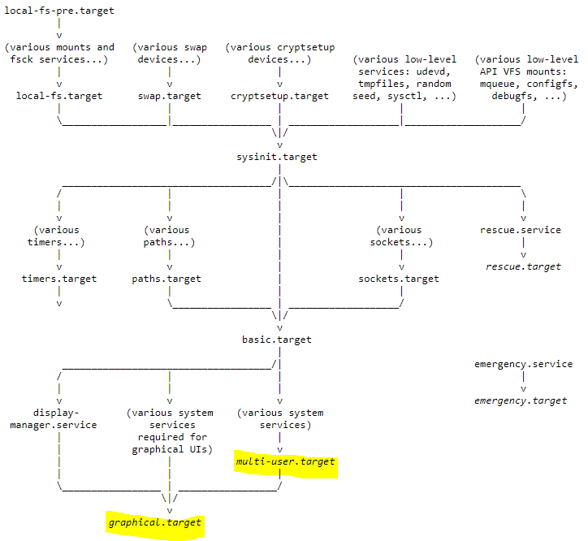

# Systemd

- Systemd：Linux系统机器的一种启动方式，宣称弥补了以传统Linux SysV init为基础的系统的缺点，取替传统的SysV init，启动过程将交给systemd处理。Systemd向后兼容，支持SysV init的后开机启动脚本。

> 传统的Linux系统启动过程主要由著名的init进程（也被称为SysV init启动系统）处理

## /etc/systemd/system

- `/etc/systemd/system`：单元配置文件

| 存放位置                | 说明                             |
| ----------------------- | -------------------------------- |
| /usr/lib/systemd/system | 软件包安装的单元                 |
| /etc/systemd/system     | 系统管理员安装的与系统密切的单元 |

## unit Systemd单元

| 单元类型  | 文件扩展名            | 描述                                           |
| --------- | --------------------- | ---------------------------------------------- |
| Device    | \.device              | 能被内核识别的设备                             |
| Service   | [\.service](#service) | 系统服务                                       |
| Target    | [\.target](#target)   | 一组系统服务（systemd的单元），与Linux启动相关 |
| Mount     | \.mount               | 挂载点                                         |
| Automount | \.automount           | 自动挂载点                                     |
| Path      | \.path                | 文件系统的文件/目录                            |
|           | \.scope               | 外部创建的进程                                 |
|           | \.slice               | 一组分层次管理的系统进程                       |
|           | \.snapshot            | 系统服务状态管理（快照）                       |
| Socket    | \.socket              | 进程间通讯套接字                               |
| Swap      | \.swap                | 定义swap文件、swap设备                         |
| Timer     | \.timer               | 定时器                                         |

# systemctl

- `systemctl`：服务单元控制命令

## [电源控制](./电源管理.md)

```shell
# 关机
systemctl poweroff

# 重启
systemctl reboot

# 待机
systemctl suspend
```

### 睡眠模式

```shell
# 挂起模式：将当前会话存储到内存中，并将所有硬件置于挂起状态；很快即可唤醒
systemctl suspend

# 休眠模式：将当前会话存储到磁盘中，并关闭机器；按下电源键并等待1~2分钟恢复后唤醒
systemctl hibernate

# 混合睡眠模式：将系统同时挂起到内存和磁盘，并关闭除内存外的所有设备；若内存断电，则系统将从磁盘恢复
systemctl hybrid-sleep

# 先挂起后休眠模式：先进入挂起模式，在指定时间后（/etc/systemd/sleep.conf HibernateDelaySec=""），进入休眠模式
systemctl suspend-then-hibernate 
```

## .service 服务单元

```shell
# 查看avahi-daemon服务状态
systemctl status avahi-daemon

# 启动服务
systemctl start avahi-daemon

# 重启服务
systemctl restart avahi-daemon

# 停止服务
systemctl stop avahi-daemon

# 设置自启动
systemctl enable avahi-daemon

# 禁止自启动
systemctl disable avahi-daemon
```

## .target 目标/运行级别

### .target启动流程

- <span name="target"><code>.target</code></span>（`/usr/lib/systemd/system/*.target`）：每个 Target 定义了一组需要启动或停止的 Systemd 单元单元（Unit），这些单元可以是服务、设备、挂载点等，设置不同的 Target，可以轻松地切换系统进入不同的状态

1. 当系统首次引导时，处理器会执行一个位于已知位置处的代码（一般保存在基本输入/输出系统BIOS）。
2. 找到一个引导设备之后，第一阶段的引导加载程序就被装入RAM并执行。这个引导加载程序在大小上小于512字节（一个扇区），它是加载第二阶段的引导加载程序。
3. 第二阶段的引导加载程序被装入RAM并执行时，通常会显示一个引导屏幕，并将Linux和一个可选的初始RAM磁盘（临时根文件系统）加载到内存中。
4. 加载映像时，第二阶段的引导加载程序就会将控制权交给内核映像，然后内核就可以进行解压和初始化。在这个阶段中，第二个阶段的引导加载程序会检测系统硬件、枚举系统链接的硬件设备、挂载根设备，然后加载必要的内核模块。
5. 完成这些操作之后启动第一个程序systemd，并执行高级系统初始化工作。
6. 通过以上过程系统完成引导，等待用户登录。


```shell
# 查看某个.target的依赖项
systemctl list-dependencies graphical.target
```

 

### systemctl set-default

- `systemctl set-default`：更改默认运行级别（default.target），重启后生效（/etc/systemd/ssytem/default.target 的指向）

| [.target](#target) | 指向                                      | 意义                                           |
| :----------------- | :---------------------------------------- | ---------------------------------------------- |
| default.target     | /etc/systemd/system/default.target        | 默认target，系统启动后进入的目标               |
| multi-user.target  | /usr/lib/systemd/system/multi-user.target | 多用户模式，用于启动多用户系统，不包含图形界面 |
| graphical.target   | /usr/lib/systemd/system/graphical.target  | 图形用户界面模式，用于启动图形桌面环境         |
| rescue.target      | /usr/lib/systemd/system/rescue.target     | 救援模式，用于修复系统问题，进入单用户维护模式 |

```shell
# 获取当前的default.target
systemctl get-default

# 设置当前的default.target
systemctl set-default graphical.target
```

### systemctl isolate

```shell
# 重启并切换到指定的target
systemctl isolate graphical.target

# 重启并进入救援模式
systemctl rescue

# 重启并进入紧急模式
systemctl emergency
```

### 运行级别

- 在老的 Linux 发行版本中，系统运行分成不同的运行级别（run level），不同的级别所启动的服务搭配有所不同；而较新的 Linux 发行版本，比如 CentOS 7+，已经将运行级别替换成目标（target）

| 参数 | 运行级别说明                   | 对应的target（Systemd目标）         |
| ---- | ------------------------------ | ----------------------------------- |
| 0    | 停机，一般不推荐设置此级别     | runlevel0.target，poweroff.target   |
| 1    | 单用户模式                     | runlevel1.target，rescue.target     |
| 2    | 多用户，但是没有网络文件系统   | runlevel2.target，multi-user.target |
| 3    | 完全多用户模式                 | runlevel3.target，multi-user.target |
| 4    | 没有用到                       | runlevel4.target，multi-user.target |
| 5    | X11，一般对应图形界面接口      | runlevel5.target，graphical.target  |
| 6    | 重新启动，一般不推荐设置此级别 | runlevel6.target，reboot.target     |

#### runlevel 当前用户运行级别

#### init 系统运行级别

- init：改变系统运行级别，init进程是所有[Linux进程](./进程管理.md)的父进程，它的进程号为1。

#### /etc/inittab init配置文件

### ctrl-alt-del.target

- `ctrl-alt-del.target`：对应`ctrl-alt-del`快捷键，按下后重启系统，即`/usr/lib/systemd/system/ctrl-alt-del.target`

```shell
# 禁用ctrl-alt-del.target：
sudo systemctl disable ctrl-alt-del.target

# 屏蔽ctrl-alt-del.target
sudo systemctl mask ctrl-alt-del.target

# 取消屏蔽ctrl-alt-del.target
sudo systemctl unmask ctrl-alt-del.target

# 重新启用
sudo systemctl enable ctrl-alt-del.target
```

# systemd-analyze

- `systemd-analyze`：分析引导系统启动时的情况

```shell
# 分析总体引导系统启动时的情况
systemd-analyze

# 分析zjk用户的blaem进程在引导系统启动时的情况
systemd-analyze blame --user
```

