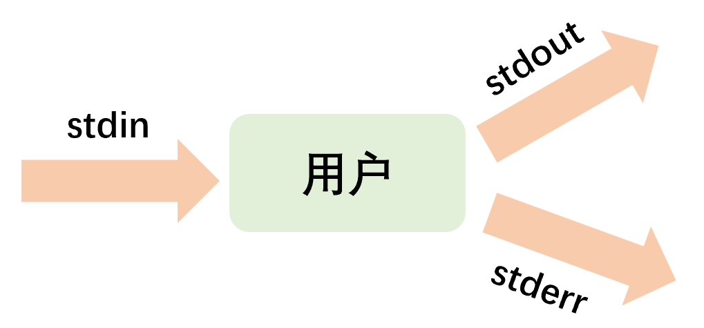
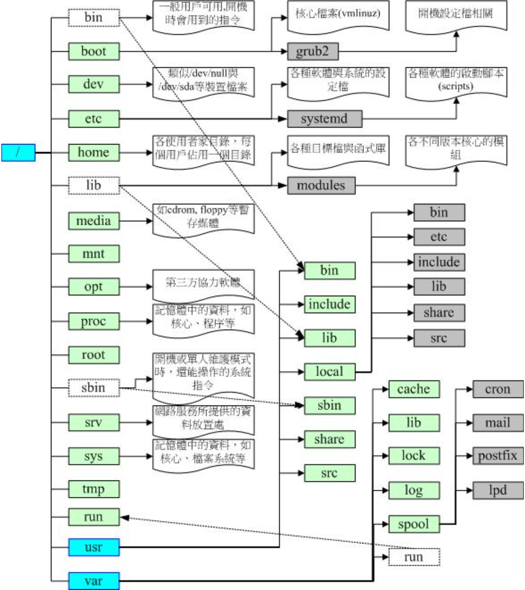
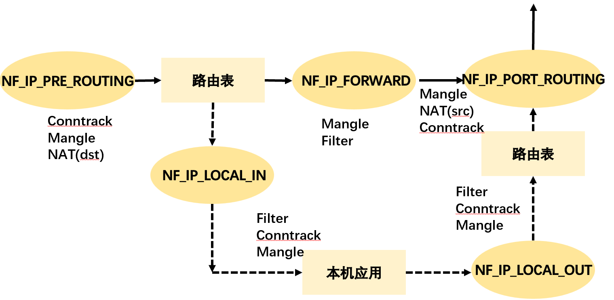
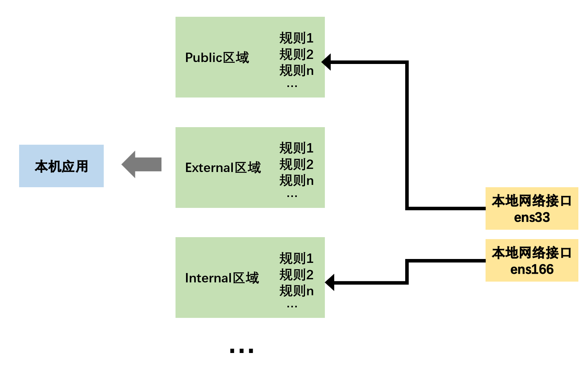

# 基本操作命令

## 命令与帮助

### man 操作说明

### alias 命令别名

- alias：设置指令的别名，对应的文件为/etc/bashrc

```shell
# 查看已经设置的别名
alias
alias -p

# 检查别名是否已被使用
type 别名

# 设置别名，多条命令之间使用分号分隔
alias 别名='命令1;命令2'

# 撤销别名，未更改/etc/bashrc
unalias 别名
```

### history 历史命令

- history：查看历史命令录
- `$HISTSIZE`：最大保存的历史命令条数（默认1000条）
- \~/\.bash\_history：历史命令文件；bash命令的历史记录先放在内存中，bash退出时才被写入到历史文件

```shell
# 查看指定的历史命令记录
history [n]
上下光标

# 清空当前缓冲区中的历史命令（并未对历史命令文件修改）
history -c

# 将历史命令文件中的命令读入当前历史命令缓冲区，否则只有在第一个终端被打开时才会读取历史命令文件
history -r

# 将历史命令缓冲区中的命令写入历史命令文件，同时打开多个终端时，其他终端的历史记录不会自动更新
history -a

# 将当前历史命令缓冲区中的命令写入历史命令文件，同时打开多个终端时，其他终端的历史记录也会自动更新
history -w
```

#### \!\! 执行上次命令

```shell
# 执行上次命令
!!

# 执行指定序号的历史命令
!{n}

# 执行以指定字符开头的历史命令
!{prex}
```

### \| 管道符

- \|（管道符）：连接两个命令，将一个程序/命令的输出作为另一个程序/命令的参数输入。一般为输入和输出的结合，一个进程向管道的一端发送数据，而另一个进程从该管道的另一端读取数据。

## 文本操作

### 标准输入与输出、重定向操作符

- 执行一个Shell命令通常会自动打开3个标准文件：标准输入文件stdin、标准输出文件stout、标准错误输出文件stderr；进程从标准输入文件得到输入数据，将正常输出数据输出到标准输出文件，而错误信息则打印到标准错误文件。

 

1. 如果给定的文件不止一个，则在显示的每个文件前面加一个文件名标题。
2. 若不指定任何文件名称/给予的文件名为"\-"，则命令从标准输入设备读取数据。

- 重定向操作符：把命令/可执行程序的标准输入/输出重定向到指定的文件。

| 操作符 | 说明                                                         |
| ------ | ------------------------------------------------------------ |
| \<     | 输入重定向                                                   |
| \<\<   | 文档的重定向                                                 |
| \>     | 输出重定向；若\>后面的文件不存在，则创建该文件；若存在，则将内容覆盖到该文件。 |
| \>\>   | 追加输出重定向；若\>\>后面的文件不存在，则创建该文件；若存在，则将内容追加到该文件。 |
| 2\>    | 错误输出重定向<br />若`2>`后面的文件不存在，则创建该文件；若存在，则将内容覆盖到该文件。<br />如果有错误信息，则不会在屏幕（标准输出文件）输出，而会保存在指定的文件；即使没有错误信息也会创建/覆盖。 |
| 2\>\>  | 追加错误输出重定向<br />若`2>>`后面的文件不存在，则创建该文件；若存在，则将内容追加到该文件。<br />如果有错误信息，则不会在屏幕（标准输出文件）输出，而会保存在指定的文件中；即使没有错误信息也会创建/追加。 |

- 重定向操作符可以混合使用。

```shell
# 将标准输出和标准错误输出重定向到同一个文件
ls >myOutAndErr.txt 2>&
```

### echo 格式化输出

```shell
echo -e "\e[编码1;编码2;编码3m内容"
# 文字色：
#颜色码：重置=0，黑色=30，红色=31，绿色=32，黄色=33，蓝色=34，洋红=35，青色=36，白色=37
echo -e "\e[1;31m内容\e[0m"
#\e[1;31m 将颜色设置为红色
#\e[0m 将颜色重新置回
# 背景色 ：
#颜色码：重置=0，黑色=40，红色=41，绿色=42，黄色=43，蓝色=44，洋红=45，青色=46，白色=47
echo -e "\e[1;42m内容\e[0m"
# 文字闪动：

# 0 关闭所有属性、1 设置高亮度（加粗）、4 下划线、5 闪烁、7 反显、8 消隐
echo -e "\033[37;31;5mMySQL Server Stop...\033[39;49;0m"
```

### sed 流编辑器

- sed流编辑器处理时，把当前处理的行存储在临时缓冲区（模式空间 pattern space），接着用sed命令处理缓冲区中的内容，处理完成后，把缓冲区的内容送往屏幕。接着处理下一行，这样不断重复，直到文件末尾。文件内容并没有改变，除非使用重定向存储输出。

```shell
sed [options] 'command' file(s)
sed [options] -f scriptfile file(s)
```

```shell
[root@localhost ~]# head -3 /etc/passwd |sed -n 2p
bin:x:1:1:bin:/bin:/sbin/nologin
[root@localhost ~]# head -3 /etc/passwd |sed -n 2,3p
bin:x:1:1:bin:/bin:/sbin/nologin
daemon:x:2:2:daemon:/sbin:/sbin/nologin
```

| 命令 | sed替换标记                                              |
| :--- | :------------------------------------------------------- |
| g    | 行内全面替换。                                           |
| p    | 打印行。                                                 |
| w    | 把行写入一个文件。                                       |
| x    | 互换模板块中的文本和缓冲区中的文本。                     |
| y    | 把一个字符翻译为另外的字符<br />（但是不用于正则表达式） |
| \\1  | 子串匹配标记                                             |
| \&   | 已匹配字符串标记                                         |

### sort 文件数据排序

- sort命令默认会将文本中的数据当成字符来排序按照会话指定的默认语言的升序排序顺序输出，包括数字和时间日期等，而不是按照相应的规则来排序。

| 命令                                       | 说明                                                         |
| ------------------------------------------ | ------------------------------------------------------------ |
| sort -n                                    | 将文本识别为数字来排序                                       |
| sort -M                                    | 将文本识别为Mar形式的月份来排序                              |
| sort -t '分隔字符' -k 指定排序的字符段位置 | -t对每行的字符段进行分隔，然后-k选择每行分隔的其中一段字符进行排序 |
| sort -r                                    | 将排序结果降序输出                                           |

```shell
# sort -t '字符' -k  文件
# 将/etc/passwd按uid来排序
[root@bogon ~]# sort -t ':' -k 3  /etc/passwd | head -n 5
root:x:0:0:root:/root:/bin/bash
operator:x:11:0:operator:/root:/sbin/nologin
bin:x:1:1:bin:/bin:/sbin/nologin
games:x:12:100:games:/usr/games:/sbin/nologin
ftp:x:14:50:FTP User:/var/ftp:/sbin/nologin
```

### grep 文本过滤

- grep：默认区分大小写、支持正则。

```shell
grep [选项] {"查找目标文本" | 查找目标文本} {被过滤文本}
```

| 选项 |                    |
| ---- | ------------------ |
| -v   | 反向搜索           |
| -n   | 匹配的同时输出行号 |
| -c   | 统计含有匹配的行数 |

### awk

```shell
awk [options] 'script' var=value file(s)
awk [options] -f scriptfile var=value file(s)
```

| 选项         | 说明                                                         |
| :----------- | :----------------------------------------------------------- |
| -F fs        | fs指定输入分隔符，fs可以是字符串或正则表达式                 |
| -v var=value | 赋值一个用户定义变量，将外部变量传递给awk                    |
| -f scripfile | 从脚本文件中读取awk命令                                      |
| -m[fr] val   | 对val值设置内在限制<br />-mf选项限制分配给val的最大块数目。<br />-mr选项限制记录的最大数目。 |

## 应用安装

### rpm

```shell
# 安装时显示信息
rpm -ivh RPM包

# 查看软件包的详细信息
rpm -qpl RPM包

# 查看已安装的软件包
rpm -qa

# 卸载软件包，如果存在依赖关系，需要先卸载需要其依赖的软件包
rpm -e

# 查看文件所属软件包
rpm -qf

# 更新已安装的软件包
rpm -Uvh RPM包
```

#### yum

### deb

#### apt

```shell
# 由Linux查找相应的软件包，并自动安装（包括依赖）。
sudo apt install <软件名>
```

```shell
# Ubutun apt源
sudo vim /etc/apt/sources.list
```

[清华大学镜像](https://mirrors.tuna.tsinghua.edu.cn/help/ubuntu/?spm=a2c6h.12873639.article-detail.7.4d0a3d66Nzz2jp)

```shell
# 卸载apt安装的软件
sudo apt purge <软件名>
sudo apt autoremove
```

#### dpkg

```shell
# 安装*.deb，自动安装依赖
sudo dpkg -i *.deb

# 如果仍然需要安装依赖，则在之后输入：
sudo apt-get -f -y install
```

### Flatpak

### Snap

```shell
sudo snap install <app>
```

# 用户与服务管理

## 用户管理

| 用户类型 | 说明                                                         |
| :------- | :----------------------------------------------------------- |
| 超级用户 | root；UID: 0                                                 |
| 系统用户 | 正常运行时，系统使用的用户，每个进程在系统中都有一个相应的属主。<br />系统用户不能用来登录（bin、daemon、mail等） |
| 普通用户 | user                                                         |

| 用户管理命令 | 作用     | 说明                                                         |
| ------------ | -------- | ------------------------------------------------------------ |
| useradd      | 添加用户 |                                                              |
| usermod      | 修改用户 | 不允许改变正在线上的使用者帐号名称。<br />改变user id时必须确认该用户没在电脑上执行任何程序。 |
| userdel      | 删除用户 | -r：同时删除该用户的相关任务和文件。                         |
| passwd       | 用户密码 | 设置用户的认证信息，包括用户密码、密码过期时间等。<br />只有管理者可以指定用户名称，一般用户只能变更自己的密码。 |
| id           | 用户信息 | 显示真实有效的用户ID（UID）、组ID（GID）。                   |

### 用户相关文件

#### /etc/passswd 用户账号文件

- /etc/passswd：普通用户的UID默认1000之后。

```shell
# 用户名:加密密码:UID:GID:用户相关注释:用户主目录:用户使用的shell
root:x:0:0:root:/root:/bin/bash
```

| 字段         | 说明                                                      |
| ------------ | --------------------------------------------------------- |
| 用户名       | 大小写敏感                                                |
| 加密密码     | 存储在/etc/shadow（用户密码文件），只有root用户可以查看   |
| UID          | 用户标识号，相同UID的用户被认为是同一用户，UID最大为65535 |
| GID          | 组标识号，与/etc/group文件相关                            |
| 用户相关注释 |                                                           |
| 用户的主目录 |                                                           |
| 使用的shell  | 用户登录系统时运行的shell，通常为/bin/bash                |

#### /etc/shadow  用户密码文件

- /etc/shadow：存储用户密码等重要信息，需要root用户才能查看。

```shell
# 用户名:加密密码:上次修改密码的时间:需要再次修改密码的最少间隔天数:密码的有效期:提前提醒用户密码过期的天数:密码过期几天后禁用该用户:用户过期时间:保留字段
root:$y$j9T$winqvu47uxSPB73JG1Cuu0$rWfYs20SLEtRak3NDJLSK7RHDody7iYD.8.lzX2QxS4:19526:0:99999:7:::
```

1. 需要再次修改密码的最少间隔天数：0表示禁用该选项；非0则表示经过n天之后必须修改密码
2. 提前提醒用户密码过期的天数：99999表示密码基本不用修改
3. 保留字段：置空，永久可用

- 计时：从1970-01-01开始计算的天数

#### /etc/group 用户组文件

- /etc/group：用户登录时默认的组放在/etc/passwd

```shell
# 用户组名:用户密码:GID:组内用户列表
zjk:x:1000:
```

### su、sudo 切换用户

| su指令          | 切换用户（不指定用户则默认root）                             |
| :-------------- | :----------------------------------------------------------- |
| su 用户         | 不改变环境变量                                               |
| su - 用户       | 改变环境变量                                                 |
| su -c 命令 用户 | 切换用户执行命令之后，返回原用户                             |
| **sudo指令**    | **普通用户获取超级权限**、以其他身份来执行命令，预设的身份为root。 |
| /etc/sudoers    | 设置可执行sudo指令的用户                                     |

### 用户组

- 用户创建的同时默认创建一个与用户名同名的用户组。
- 每个用户都有一个用户组，一个用户可以属于多个用户组，一个用户组可以有多个用户。
- 系统对一个用户组的用户集中管理，赋予用户组的权限可以被该用户获取；用户的权限为其所在的所有用户组的权限之和。

| 用户组文件  | 说明                                 |
| ----------- | ------------------------------------ |
| /etc/passwd | 定义的用户组为基本组，其他的为附加组 |
| /etc/group  | 用户组的操作基于对该文件的更新       |

| 用户组命令 | 作用                                                         |
| ---------- | ------------------------------------------------------------ |
| groupadd   | 添加用户组                                                   |
| groupdel   | 删除用户组（修改的系统文件包括/ect/group和/ect/shadow）<br />若该群组中仍包括某些用户，则必须先删除这些用户后，方能删除群组。 |
| groupmod   | 修改用户组                                                   |
| groups     | 查看用户所在用户组                                           |

## 文件管理

### 文件/目录信息查看

#### pwd 当前目录

```shell
# 绝对路径，而非链接路径
pwd -P
```

#### ls 文件与目录检视

<table><tbody><tr><td>-a</td><td>显示所有文件及目录</td><td rowspan="6">&nbsp;</td><td>-r</td><td>依据首字母将文件以相反次序显示</td></tr><tr><td>-A</td><td>不显示当前目录和父目录</td><td>-R</td><td>递归显示所有子文件</td></tr><tr><td>-d</td><td>显示目录自身的属性信息</td><td>-S</td><td>依据内容大小将文件排序显示</td></tr><tr><td>-i</td><td>显示文件的inode属性信息</td><td>-t</td><td>依据最后修改时间将文件排序显示</td></tr><tr><td>-l</td><td>显示文件的详细属性信息</td><td>-X</td><td>依据扩展名将文件排序显示</td></tr><tr><td>-m</td><td>以逗号为间隔符，水平显示文件信息</td><td>-color</td><td>以彩色显示信息</td></tr></tbody></table>

```shell
# 显示当前目录中的文件名（默认不含隐藏文件）
ls

# 长信息方式显示当前目录（默认不含隐藏文件）
ls -l
ll

# 显示指定目录中的文件名（含隐藏文件）
ls -a /etc

# 依据文件内容大小进行排序，显示指定目录中文件名及其属性详情信息
ls -Sl

# 显示指定目录中一以sd开头的文件
ls /etc/sd*
```

```shell
# ls -al
total 464
drwxr-x--- 56 zjk  zjk    4096 12月 17 18:18 .
drwxr-xr-x  3 root root   4096 10月  8 15:23 ..
drwxrwxr-x  2 zjk  zjk    4096 10月 31 13:23 aiXcoder
```

#### file  查看文件类型

#### find 检索

```shell
# 从当前目录查找文件名开头是Hello的
find . -name "Hello*"
```

#### basename/dirname 文件名称与目录名称

- 每个文件的完整文件名包含了前面的目录与最终的文件名（basename + dirname），而每个文件名的长度都可以到达 255 个字符

```shell
# 取得文件名network
basename /etc/sysconfig/network

# 取得目录名
dirname /etc/sysconfig/network
```

### 文件/目录操作

#### cd 切换目录

- cd（change directory）

```shell
# 当前目录
cd .

# 上一级目录
cd ..

# 用户主目录(home)
cd
cd ~

# 回到上次目录
cd -
```

#### cp 复制

- cp（copy）：复制品的[属性与权限](#文件权限)属于执行者，而不是源文件。

```
cp 参数 源文件名 目标文件名
```

<table><tbody><tr><td>-a</td><td>功能等价于pdr参数组合</td><td rowspan="5">&nbsp;</td><td>-l</td><td>对源文件建立硬链接，而非复制文件</td></tr><tr><td>-b</td><td>覆盖目标文件前先进行备份</td><td>-p</td><td>保留源文件或目录的所有属性信息</td></tr><tr><td>-d</td><td>复制链接文件时，将目标文件也建立为链接文件</td><td>-r</td><td>递归复制所有子文件</td></tr><tr><td>-f</td><td>若目标文件已存在，则会直接覆盖</td><td>-s</td><td>对源文件建立软链接，而非复制文件</td></tr><tr><td>-i</td><td>若目标文件已存在，则会询问是否覆盖</td><td>-v</td><td>显示执行过程详细信息</td></tr></tbody></table>

```shell
# 将多个文件一同复制到/etc目录中，如已有目标文件名称则默认询问是否覆盖
cp File1.cfg File2.cfg /etc
```

#### touch 创建/更新文件

#### mkdir/rmdir 创建/删除目录

- mkdir（make directory）：创建目录

<table><tbody><tr><td>-m</td><td>创建目录的同时设置权限</td><td rowspan="2">&nbsp;</td><td>-v</td><td>显示执行过程详细信息</td></tr><tr><td>-p</td><td>递归创建多级目录</td><td>-z</td><td>设置目录安全上下文</td></tr></tbody></table>

```shell
# 创建目录的同时赋予权限
mkdir -m 777 Dir2

# 创建多个目录
mkdir dir1 dir2

# 创建嵌套目录；默认（不使用-p时），需要一层层的创建
mkdir -p /dir1/dir2
```

- rmdir：删除空的目录，被删除的目录必须是空的

<table><tbody><tr><td>-p</td><td>递归处理所有子文件</td><td rowspan="2">&nbsp;</td><td>--help</td><td>显示帮助信息</td></tr><tr><td>-v</td><td>显示执行过程详细信息</td><td>--version</td><td>显示版本信息</td></tr></tbody></table>

```shell
# 删除当前目录的同时删除其路径上的目录（如果为空）
rmdir -p dir
```

#### mv  移动/重命名

#### rm 删除


#### 压缩/解压

##### zip/unzip

| 命令   | 说明               |
| ------ | ------------------ |
| gzip   | 压缩`.gz`          |
| gunzip | 解压               |
| gzcat  | 查看压缩文件的内容 |

##### rar

```shell
# 解压rar到当前目录
rar e my_file.rar
```

#### tar 归档

- .tar、.tar.gz、.tgz、.tar.bz2

| 文件格式  | 命令参数 |
| --------- | -------- |
| \.tar\.xz | -xf      |

#### ln 链接

```shell
# 硬链接
ln 源路径 目标路径

# 软链接
ln -s 完整源路径 目标路径
```

- 硬链接：

1. 如果源文件被删除，硬链接仍然可以正常使用、读写数据
2. 不可以跨区/磁盘创建硬链接
3. 硬链接与源文件使用的是相同的设备、inode编号、文件属性和源文件相同

- 软链接 \-s：

1. 如果源文件被删除，则无法继续使用软链接
2. 可以跨分区/磁盘创建软链接
3. 软链接的文件属性被标记为`l`，同时有指针\-\>指向源文件

### 文件/目录的所属/权限

 

| 文件类型 | 说明                               |
| :------- | :--------------------------------- |
| -        | 普通文件                           |
| d        | 目录文件                           |
| l        | 符号链接文件                       |
| b/c      | b：块设备文件<br />c：字符设备文件 |
| p        | 管道文件                           |

- <span name="文件权限">文件权限</span>：对root用户而言，rw权限是可以无视的，而可执行文件则必须要有x权限（包括root用户）

| 文件权限 | 对应数值 | 级别     |
| :------- | -------- | :------- |
| r        | 4        | 读权限   |
| w        | 2        | 写权限   |
| x        | 1        | 执行权限 |

- 设置权限时可以使用数字法或字母表达式，777对应rwx rwx rwx，也就是绝对权限。

#### chown 文件所有者

- chown（change owner）：文件的所属者必须是已经存在系统中的帐号，即/etc/passwd中存在的用户名。

<table><tbody><tr><td>-c</td><td>显示所属变更信息</td><td rowspan="5">&nbsp;</td><td>-v</td><td>显示执行过程详细信息</td></tr><tr><td>-f</td><td>若该文件拥有者无法被更改也不显示错误</td><td>--help</td><td>显示帮助信息</td></tr><tr><td>-h</td><td>仅对链接文件（而非真正指向的文件）进行更改</td><td>--no-preserve-root</td><td>不特殊对待根目录</td></tr><tr><td>-P</td><td>不遍历任何符号链接</td><td>--preserve-root</td><td>不允许在根目录上执行递归操作</td></tr><tr><td>-R</td><td>递归处理所有子文件</td><td>--version</td><td>显示版本信息</td></tr></tbody></table>

```shell
# 改变指定文件的所属主与所属组
chown root:root File.txt
```

#### chgrp 文件所属组

- chgrp（change group）：要被改变的群组名称必须要在/etc/group文件内存在，否则报错

<table ><tbody><tr><td>-c</td><td>显示调试信息</td></tr><tr><td>-f</td><td>不显示错误信息 </td></tr><tr><td>-h</td><td>对符号链接文件做修改</td></tr><tr><td>-L</td><td>遍历每个符号链接</td></tr><tr><td>-P</td><td>不遍历每个符号链接</td></tr><tr><td>-R</td><td>递归处理所有子文件</td></tr><tr><td>-v</td><td>显示执行过程详细信息</td></tr><tr><td>--help</td><td>显示帮助信息</td></tr><tr><td>--vesion</td><td>显示版本信息</td></tr></tbody></table>

```shell
chgrp -v -R root testDir
```

#### chmod 文件/目录的权限

- chmod（change mode）：改变文件或目录权限的命令；默认只有文件的所有者和管理员可以设置文件权限，普通用户只能管理自己文件的权限属性。

<table><tbody><tr><td>-c<strong></strong></td><td>改变权限成功后再输出成功信息 </td><td rowspan="5"><strong>&nbsp;</strong></td><td>--no-preserve-root<strong></strong></td><td>不特殊对待根目录 </td></tr><tr><td>-f<strong></strong></td><td>改变权限失败后不显示错误信息 <strong></strong></td><td>--preserve-root</td><td>禁止对根目录进行递归操作 <strong></strong></td></tr><tr><td>-R<strong></strong></td><td>递归处理所有子文件 </td><td>--reference<strong></strong></td><td>使用指定参考文件的权限 <strong></strong></td></tr><tr><td>-v</td><td>显示执行过程详细信息</td><td>--version</td><td>显示版本信息</td></tr><tr><td>--help</td><td>显示帮助信息 <strong></strong></td><td><strong>&nbsp;</strong></td><td><strong>&nbsp;</strong></td></tr></tbody></table>

```shell
# [ugoa]*([-+=]([rwxXst]*|[ugo]))+|[-+=][0-7]+'
chmod u+x test.sh
```

- chmod默认对所有（a）设置权限；可通过ugoa分别指定不同对象

<table>
    <tr>
        <td>a</td>
        <td>所属者、所属组、其他用户</td>
        <td rowspan="4"></td>
        <td>-</td>
        <td>移除权限/减去相应分数</td>
    </tr>
    <tr>
        <td>u</td>
        <td>所属者</td>
        <td>+</td>
        <td>增加权限/加上相应分数</td>
    </tr>
    <tr>
        <td>g</td>
        <td>所属组</td>
        <td>=</td>
        <td>设置为该权限/设置为该分数</td>
    </tr>
    <tr>
        <td>o</td>
        <td>其他用户</td>
        <td></td>
        <td></td>
    </tr>
</table>

### Linux目录配置

#### FHS 目录结构

- 基于文件系统层级标准（FHS）：Linux将文件存储在单个目录结构中（虚拟目录），虚拟目录将安装在PC上的所有存储设备的文件路劲纳入单个目录结构中。Linux虚拟目录结构只包含一个根目录 / 的基础目录。根目录下的目录和文件会按照访问的目录路径一一列出。
- 根驱动器：在Linux PC上安装的第一个硬盘，包含了虚拟目录的核心，从此开始构造其他目录。
- [挂载点](#mount)：在根驱动器上创建的目录，是虚拟目录中用于分配额外存储设备的目录。虚拟目录会让（该额外存储设备上的）文件和目录出现在这些<span name="挂载点">挂载点</span>的目录上。

<table>
    <thead>
        <tr>
            <th></th>
            <th>可分享的（shareable）</th>
            <th>不可分享的（unshareable）</th>
        </tr>
    </thead>
    <tbody>
        <tr>
            <td rowspan="2">不变的（static）</td>
            <td>/usr （软件放置处）</td>
            <td>/etc （配置文件）</td>
        </tr>
        <tr>
            <td>/opt （第三方协力软件）</td>
            <td>/boot （开机与核心档）</td>
        </tr>
        <tr>
            <td rowspan="2">可变动的（variable）</td>
            <td>/var/mail （使用者邮件信箱）</td>
            <td>/var/run （程序相关）</td>
        </tr>
        <tr>
            <td>/var/spool/news （新闻群组）</td>
            <td>/var/lock （程序相关）</td>
        </tr>
    </tbody>
</table>

- FHS针对目录树架构仅定义出三层目录下面应该放置什么数据而已，分别是下面这三个目录的定义：

1. / （root， 根目录）：与开机系统有关
2. /usr （unix software resource）：与软件安装/执行有关
3. /var （vasriable）：与系统运行过程有关

- /usr目录在安装时会占用较大硬盘容量的目录；/var目录在系统运行后才会渐渐占用硬盘容量。 

##### /

- FHS标准建议：根目录（/）所在分区应该越小越好， 且应用程序所安装的软件最好不要与根目录放在同一个分区内，保持根目录越小越好

<table>
    <tbody>
        <tr>
            <th colspan="2">第一部份：FHS 要求必须要存在的目录</th>
        </tr>
        <tr>
            <td>/bin</td>
            <td>二进制目录，存放系统所需要的重要命令。（命令对应的文件都是可执行的）<br />/usr/bin也存放一些系统命令，普通用户可以使用大部分的命令。</td>
        </tr>
        <tr>
            <td>/boot</td>
            <td>Linux启动时，内核及引导系统程序所需要的核心文件。<br />内核文件、gub系统引导管理器（引导装载程序）都位于此目录。</td>
        </tr>
        <tr>
            <td>/dev</td>
            <td>设备文件（光驱、磁盘等）。<br />访问该目录下某个文件相当于访问某个硬件设备，常用的是挂载光驱。</td>
        </tr>
        <tr>
            <td>/etc</td>
            <td>系统的配置文件<br />一般来说，这个目录下的各文件属性是可以让一般使用者查阅的， 但是只有root有权力修改。</td>
        </tr>
        <tr>
            <td>/lib</td>
            <td>放置的是在开机时会用到的函数库， 以及在/bin或/sbin下面的指令会调用的函数库而已。<br />FHS要求必须存在/lib/modules/，主要放置可抽换式的核心相关模块（驱动程序）</td>
        </tr>
        <tr>
            <td>/media</td>
            <td>媒体目录，可移动媒体设备（可移除设备）的常用挂载点<br />常见的文件名有：/media/floppy， /media/cdrom等等。</td>
        </tr>
        <tr>
            <td>/mnt</td>
            <td>挂载外部设备的挂载目录</td>
        </tr>
        <tr>
            <td>/opt</td>
            <td>可选目录，存放第三方软件包、数据文件</td>
        </tr>
        <tr>
            <td>/run</td>
            <td>运行目录，存放系统运行时的运行数据</td>
        </tr>
        <tr>
            <td>/sbin</td>
            <td>系统二进制目录，存放一些系统管理的命令，一般只能由root执行<br />放在/sbin下面的为开机过程中所需要的，里面包括了开机、修复、还原系统所需要的指令，包括：fdisk， fsck， ifconfig， mkfs等等。 <br />某些服务器软件程序，一般则放置到/usr/sbin/<br />本机自行安装的软件所产生的系统可执行文件（system binary）， 则放置到/usr/local/sbin/</td>
        </tr>
        <tr>
            <td>/srv</td>
            <td>服务目录（service），存放服务相关的文件<br />系统的服务数据如果尚未要提供给网际网络任何人浏览的话，默认还是建议放置到 /var/lib下面即可。</td>
        </tr>
        <tr>
            <td >/tmp</td>
            <td>临时文件目录，任何人都可以访问。<br />系统软件/用户运行程序时产生的临时文件存放到这里，空间不易过小。<br />此目录数据需要定期清除，重要数据不可放置在此目录下。</td>
        </tr>
        <tr>
            <td><a href="#/usr">/usr</a></td>
            <td>第二层FHS设置，用户二进制目录，应用程序存放目录（命令、帮助文件等）。<br />安装Linux软件包时默认安装到/usr/local目录下。</td>
        </tr>
        <tr>
            <td><a href="#/var">/var</a></td>
            <td>第二层FHS设置，此目录的内容经常变动的</td>
        </tr>
        <tr>
            <th colspan="2">第二部份：FHS 建议可以存在的目录</th>
        </tr>
        <tr>
            <td>/home</td>
            <td>默认的用户主目录（~）。<br />如果添加用户时不指定用户的主目录，默认在/home下创建与用户名同名的文件夹。</td>
        </tr>
        <tr>
            <td>/lib&lt;qual&gt;</td>
            <td>用来存放与 /lib 不同的格式的二进制函数库，例如支持 64 位的 /lib64 函数库等</td>
        </tr>
        <tr>
            <td>/root</td>
            <td>root用户的主目录<br />防止因为进入单人维护模式而仅挂载根目录时，该目录就能够拥有root的主文件夹，所以希望root的主文件夹与根目录放置在同一个分区中。</td>
        </tr>
        <tr>
            <th colspan="2">其他重要目录</th>
        </tr>
        <tr>
            <td>/lost+found</td>
            <td>使用标准的ext2/ext3/ext4文件系统格式才会产生该目录<br />存放系统意外崩溃、机器意外关机时产生的文件碎片</td>
        </tr>
        <tr>
            <td>/proc</td>
            <td>进程目录，存放操作系统运行时的信息<br />属于虚拟文件系统（virtual filesystem），此目录的内容存在于内存中，实际不占用磁盘空间。</td>
        </tr>
        <tr>
            <td>/sys</td>
            <td>系统目录，主要记录系统核心与系统硬件信息相关的信息。<br />属于虚拟文件系统（virtual filesystem），此目录的内容存在于内存中，实际不占用磁盘空间。</td>
        </tr>
    </tbody>
</table>

##### /usr

- <span name="usr">/usr</span>（Unix Software Resource）：放置的数据属于可分享的与不可变动的（shareable， static）

<table>
    <tbody>
        <tr>
            <th colspan="2">第一部份：FHS 要求必须要存在的目录</th>
        </tr>
        <tr>
            <td >/usr/bin/</td>
            <td>所有一般用户能够使用的指令都放在这里，使用链接文件的方式将/bin链接至此<br />FHS 要求在此目录下不应该有子目录！</td>
        </tr>
        <tr>
            <td >/usr/lib/</td>
            <td>/lib就是链接到此目录中的</td>
        </tr>
        <tr>
            <td >/usr/local/</td>
            <td>系统管理员在本机自行安装自己下载的软件，建议安装到此目录</td>
        </tr>
        <tr>
            <td >/usr/sbin/</td>
            <td >非系统正常运行所需要的系统指令。<br />/sbin就是链接到此目录中的</td>
        </tr>
        <tr>
            <td >/usr/share/</td>
            <td>主要放置只读架构的数据文件，包括共享文件。 <br />在这个目录下放置的数据几乎是不分硬件架构均可读取的数据，几乎都是文本文件。<br />/usr/share/man 线上说明文档；/usr/share/doc 软件杂项的文件说明；/usr/share/zoneinfo 与时区有关的时区文件</td>
        </tr>
        <tr>
            <th colspan="2">第二部份：FHS 建议可以存在的目录</th>
        </tr>
        <tr>
            <td >/usr/games/</td>
            <td >与游戏比较相关的数据放置处</td>
        </tr>
        <tr>
            <td >/usr/include/</td>
            <td >c/c++等程序语言的文件开始（header）与包含档（include）放置处<br />以tarball方式 （*.tar.gz）安装某些数据时，会使用到此处的许多包含档</td>
        </tr>
        <tr>
            <td >/usr/libexec/</td>
            <td >某些不被一般使用者惯用的可执行文件或脚本（script）等等，都会放置在此目录中</td>
        </tr>
        <tr>
            <td >/usr/lib&lt;qual&gt;/</td>
            <td >/lib&lt;qual&gt;就是链接到此目录中</td>
        </tr>
        <tr>
            <td >/usr/src/</td>
            <td>一般源代码建议放置到这里<br />至于核心源代码则建议放置到/usr/src/linux/</td>
        </tr>
    </tbody>
</table>

##### /var

- <span name="/var">/var</span>：主要针对常态性变动的文件，包括高速缓存（cache）、登录文件（log file）以及某些软件运行所产生的文件， 包括程序文件（lock file， run file），或者例如MySQL数据库的文件等等。

<table>
    <tbody>
        <tr>
            <th colspan="2">FHS 要求必须要存在的目录</th>
        </tr>
        <tr>
            <td>/var/cache/</td>
            <td>应用程序本身运行过程中会产生的一些暂存盘</td>
        </tr>
        <tr>
            <td>/var/lib/</td>
            <td>程序本身执行的过程中，需要使用到的数据文件放置的目录，在此目录下各自的软件应该要有各自的目录M<br />即：MySQL的数据库放置到/var/lib/mysql/；而rpm的数据库则放到/var/lib/rpm</td>
        </tr>
        <tr>
            <td>/var/lock/</td>
            <td>某些设备或者是文件资源一次只能被一个应用程序所使用，如果同时有两个程序使用该设备时，就可能产生一些错误的状况，因此就得要将该设备上锁（lock），以确保该设备只会给单一软件所使用。<br />目前此目录已经挪到/run/lock</td>
        </tr>
        <tr>
            <td>/var/log/</td>
            <td>登录文件放置的目录<br />/var/log/messages，/var/log/wtmp（记录登陆者的信息）等</td>
        </tr>
        <tr>
            <td>/var/mail/</td>
            <td>放置个人电子邮件信箱的目录<br />该目录也被放置到/var/spool/mail/，通常这两个目录互为链接文件</td>
        </tr>
        <tr>
            <td>/var/run/</td>
            <td>某些程序或者是服务启动后，会将他们的PID放置在这个目录下<br />该目录链接到/run</td>
        </tr>
        <tr>
            <td>/var/spool/</td>
            <td>通常放置一些伫列数据（排队等待其他程序使用的数据），这些数据被使用后通常都会被删除。 <br />如果是工作调度数据（crontab），就会被放置到/var/spool/cron/</td>
        </tr>
    </tbody>
</table>

#### 目录树（directory tree）

- 目录树的启始点为根目录 （/， root）
- 每一个目录不止能使用本地端的 partition 的文件系统，也可以使用网络上的 filesystem 
- 每一个文件在此目录树中的文件名（包含完整路径）都是独一无二的。

 

## 服务单元控制

| 文件扩展名               | 类型                          |
| ------------------------ | ----------------------------- |
| \.device                 | 能被内核识别的设备            |
| \.service                | 系统服务                      |
| \.target                 | 一组系统服务（Linux启动相关） |
| \.mount<br />\.automount | 挂载点<br />自动挂载点        |
| \.path                   | 文件系统的文件/目录           |
| \.scope                  | 外部创建的进程                |
| \.slice                  | 一组分层次管理的系统进程      |
| \.snapshot               | 系统服务状态管理              |
| \.socket                 | 进程间通讯套接字              |
| \.swap                   | 定义swap文件、swap设备        |
| \.timer                  | 定时器                        |

### 服务单元控制命令 systemctl、systemd

| **运行级别**                                               | **说明**                                                     |
| ---------------------------------------------------------- | ------------------------------------------------------------ |
| systemctl set-default                                      | 更改默认运行级别，重启后生效<br />（/etc/systemd/ssytem/default.target 的指向） |
| systemctl rescue                                           | 紧急模式                                                     |
| **服务单元**                                               | **说明**                                                     |
| systemctl start<br />systemctl restart<br />systemctl stop | 启动服务<br />重新启动服务<br />停止服务                     |
| systemctl enable<br />systemctl disable                    | 设置开机自启动<br />禁止开机自启动                           |
| systemctl status                                           | 查看服务当前状态                                             |
| **电源控制**                                               | **说明**                                                     |
| systemctl poweroff                                         | 关机                                                         |
| systemctl reboot                                           | 重启                                                         |
| systemctl suspend                                          | 待机                                                         |

| systemctl set-default参数 | 指向                                      | 运行级别 |
| :------------------------ | :---------------------------------------- | :------- |
| default.target            | /etc/systemd/system/default.target        | -        |
| multi-user.target         | /usr/lib/systemd/system/multi-user.target | 3        |
| graphical.target          | /usr/lib/systemd/system/graphical.target  | 5        |

### /etc/systemd/system 单元配置文件

| 存放位置                | 说明                             |
| ----------------------- | -------------------------------- |
| /usr/lib/systemd/system | 软件包安装的单元                 |
| /etc/systemd/system     | 系统管理员安装的与系统密切的单元 |
### 运行级别

| 参数 | target（System目标） | 说明 |
| ---- | -------------------- | ---- |
|0| runlevel0.target，poweroff.target| 停机，一般不推荐设置此级别|
|1| runlevel1.target，rescue.target| 单用户模式|
|2| runlevel2.target，multi-user.target |多用户，但是没有网络文件系统|
|3| runlevel3.target，multi-user.target| 完全多用户模式|
|4| runlevel4.target，multi-user.target |没有用到|
|5| runlevel5.target，graphical.target |X11，一般对应图形界面接口|
|6| runlevel6.target，reboot.target| 重新启动，一般不推荐设置此级别|

1. 当系统首次引导时，处理器会执行一个位于已知位置处的代码（一般保存在基本输入/输出系统BIOS）。
2. 找到一个引导设备之后，第一阶段的引导加载程序就被装入RAM并执行。这个引导加载程序在大小上小于512字节（一个扇区），它是加载第二阶段的引导加载程序。
3. 第二阶段的引导加载程序被装入RAM并执行时，通常会显示一个引导屏幕，并将Linux和一个可选的初始RAM磁盘（临时根文件系统）加载到内存中。
4. 加载映像时，第二阶段的引导加载程序就会将控制权交给内核映像，然后内核就可以进行解压和初始化。在这个阶段中，第二个阶段的引导加载程序会检测系统硬件、枚举系统链接的硬件设备、挂载根设备，然后加载必要的内核模块。
5. 完成这些操作之后启动第一个程序systemd，并执行高级系统初始化工作。
6. 通过以上过程系统完成引导，等待用户登录。

  

#### runlevel 当前用户运行级别

#### init 系统运行级别

- init：改变系统运行级别。init进程是所有Linux进程的父进程，它的进程号为1。

#### /etc/inittab init配置文件

## 日志与计划任务

### 日志系统

#### /var/log 日志目录

- Linux日志一般放在/var/log下，需要root用户权限。

| 日志类型     | 说明                                                         |
| :----------- | :----------------------------------------------------------- |
| 系统连接日志 | 记录系统的登录记录和用户名，写录到/var/log/wtmp、/var/log/utmp |
| 进程统计     | 系统内核执行，当一个进程终止时为每个进程往进程统计文件中写一个记录 |
| 错误日志     | 各种系统守护进程、用户程序和内核，通过syslog向/var/log/messages写录 |

| /var/log文件 | 说明                                       |
| :----------- | :----------------------------------------- |
| btmp         | 记录失败的记录                             |
| syslog       | 从syslog中记录信息                         |
| wtmp         | 一个用户每次登录和退出时间的永久记录       |
| lastlog      | 记录最后一次失败的登录和最近几次成功的登录 |
| dmesg        | Linux系统启动信息                          |
| **rpm系**    | **说明**                                   |
| messages     | 服务器的系统日志                           |
| access-log   | 记录Web服务访问日志，错误信息存于error-log |
| acct/pacct   | 记录用户命令                               |
| sudolog      | 记录使用sudo发出的命令                     |
| sulog        | 记录su命令的使用                           |
| secure       | 记录系统登录行为                           |
| utmp         | 记录当前登录的每个用户                     |

#### 日志信息查看命令

| 命令   | 说明                                                         | 对应文件       |
| ------ | ------------------------------------------------------------ | -------------- |
| who、w | 显示目前登录系统的用户信息                                   | /var/log/wtmp  |
| users  | 显示当前登录系统的所有用户<br />如果一个用户有不止一个登录会话，那他的用户名将显示相同的次数 |                |
| last   | 列出目前与过去登录系统的用户相关信息                         | /var/log/wtmp  |
| dmesg  | 显示Linux系统启动信息，检查和控制内核的环形缓冲区            | /var/log/dmesg |

#### /etc/rsyslog.conf 日志系统

```shell
# 服务1.优先级;服务2.优先级    操作动作
*.info;mail.none  /var/log/messages
```

| 日志设备       | 功能                              |
| -------------- | --------------------------------- |
| auth           | pam\_pwdb报告的认证活动           |
| authpriv       | 包括特权信息在内的认证活动        |
| cron           | 与cron、at相关的计划任务信息      |
| daemon         | 与inetd守护进程相关的后台进程信息 |
| kern           | 内核信息，先通过klogd传递         |
| lpr            | 与打印服务有关的信息              |
| mail           | 与电子邮件有关的信息              |
| mark           | syslog内部功能，用于生成时间戳    |
| news           | 来自新闻服务器的信息              |
| syslog         | syslog生成的信息                  |
| user           | 用户程序生成的信息                |
| uucp           | uucp生成的信息                    |
| local0\~local7 | 自定义程序使用                    |

| 优先级限定符 | 说明                                                         |
| :----------- | :----------------------------------------------------------- |
| \*           | 服务生成的所有日志消息都发送到操作动作指定的地点             |
| =            | 服务生成的本优先级的日志消息都发送到操作动作指定的地点       |
| \!           | 服务生成的所有日志消息都发送到操作动作指定的地点，但本优先级的消息不包括在内 |

- 操作动作：每条消息都会经过所有的规则，并非唯一匹配的

 

#### /etc/logrotate.conf 日志轮转

- /etc/logrotate.conf：对系统日志进行轮转、压缩、删除、发送到指定邮箱。每个记录文件都可被设置成每日/周/月处理、或文件太大时处理。

```shell
# rotate log files weekly 每周轮转
weekly

# keep 4 weeks worth of backlogs 保存过去四周的文件
rotate 4

# create new (empty) log files after rotating old ones 轮转以后创建新的空白日志文件
create

# use date as a suffix of the rotated file 轮转的文件以日期结尾
dateext

# uncomment this if you want your log files compressed 如果需要对轮转后的日志压缩，去掉此行注释
# compress

# RPM packages drop log rotation information into this directory 其他配置存放的文件目录;即用户自定义的配置
include /etc/logrotate.d

# no packages own wtmp and btmp -- we'll rotate them here 一些系统日志的轮转规则
/var/log/wtmp {
    monthly
    create 0664 root utmp
        minsize 1M
    rotate 1
}

/var/log/btmp {
    missingok
    monthly
    create 0600 root utmp
    rotate 1
}

# system-specific logs may be also be configured here.
```

##### /etc/logrotate.d 自定义配置轮转

 

```shell
# 测试轮转：无error日志，则正常生成轮转配置文件。
/user/sbin/logrotate -vf /etc/logrotate.conf
```

### 计划任务

#### at 定时任务

| 命令 | 说明                           |
| ---- | ------------------------------ |
| at   | 在指定时间执行任务，只执行一次 |
| atq  | 显示当前所有定时任务           |
| atrm | 删除指定序号的定时任务         |

| 指定时间的格式 | 说明                                                         |
| -------------- | ------------------------------------------------------------ |
| 绝对计时法     | 当天的hh:mm。若该时间已过去，那么就放在第二天执行。<br />midnight（深夜），noon（中午），teatime（一般是下午4点）等比较模糊的词语来指定时间。<br />12小时计时制，时间后面加上AM（上午）、PM（下午）。<br />具体日期，指定格式为month day、mm/dd/yy、dd.mm.yy。指定的日期必须跟在指定时间的后面。 |
| 相对计时法     | now + count time-units：now当前时间、time-units是时间单位 minutes（分钟）、hours（小时）、days（天）、weeks（星期）、count是时间的数量，究竟是几天，还是几小时，等等。<br />直接使用today（今天）、tomorrow（明天）。 |

```shell
# at 23:43 today
at> date >/root/today.log            
at> <EOT>
job 3 at Sun Nov 27 23:43:00 2022
```

```shell
# atq
4       Wed Nov 30 08:40:00 2022 a root
```

#### crontab 周期任务

- crontab：提交和管理用户需要周期性执行的任务。默认会安装此服务工具，并自动启动crond进程，crond进程每分钟会定期检查是否有要执行的任务，如果有要执行的任务，则自动执行该任务。

```shell
crontab [选项] [crontab 的任务列表文件]
```

#### 任务调度

##### 系统任务调度 /etc/crontab

- 系统任务调度的配置文件`/etc/crontab`：系统周期性所要执行的工作，比如写缓存数据到硬盘、日志清理等。

```shell
[root@localhost etc]# ll | grep cron
-rw-------.  1 root root      541 Mar 30  2017 anacrontab
drwxr-xr-x.  2 root root       54 Nov 13 21:16 cron.d
drwxr-xr-x.  2 root root       70 Nov 13 21:16 cron.daily
-rw-------.  1 root root        0 Mar 30  2017 cron.deny
drwxr-xr-x.  2 root root       41 Nov 13 21:16 cron.hourly
drwxr-xr-x.  2 root root        6 Dec 28  2013 cron.monthly
-rw-r--r--.  1 root root      451 Dec 28  2013 crontab
drwxr-xr-x.  2 root root        6 Dec 28  2013 cron.weekly
```

##### 用户任务调度 /var/spool/cron

- 用户定期要执行的工作，比如用户数据备份、定时邮件提醒等。
- 所有用户定义的crontab文件都被保存在`/var/spool/cron`目录中。其文件名与用户名一致，

| 使用者权限文件   | 说明                                        |
| ---------------- | ------------------------------------------- |
| /etc/cron\.deny  | 该文件中所列用户不允许使用crontab命令       |
| /var/spool/cron/ | 所有用户crontab文件存放的目录，以用户名命名 |

```shell
# 每1分钟执行一次command
* * * * * command

# 每小时的第3和第15分钟执行
3,15 * * * * command

# 在上午8点到11点的第3和第15分钟执行
3,15 8-11 * * * command

# 每隔两天的上午8点到11点的第3和第15分钟执行
3,15 8-11 */2 * * command
# 每个星期一的上午8点到11点的第3和第15分钟执行
3,15 8-11 * * 1 command

# 每晚的21:30重启smb 
30 21 * * * /etc/init.d/smb restart

# 每月1、10、22日的4 : 45重启smb 
45 4 1,10,22 * * /etc/init.d/smb restart

# 每周六、周日的1:10重启smb
10 1 * * 6,0 /etc/init.d/smb restart

# 每天18 : 00至23 : 00之间每隔30分钟重启smb 
0,30 18-23 * * * /etc/init.d/smb restart

# 每星期六的晚上11:00 pm重启smb 
0 23 * * 6 /etc/init.d/smb restart

# 每一小时重启smb 
* */1 * * * /etc/init.d/smb restart

# 晚上11点到早上7点之间，每隔一小时重启smb
* 23-7/1 * * * /etc/init.d/smb restart

# 每月的4号与每周一到周三的11点重启smb 
0 11 4 * mon-wed /etc/init.d/smb restart

# 一月一号的4点重启smb
0 4 1 jan * /etc/init.d/smb restart

# 每小时执行/etc/cron.hourly目录内的脚本
01 * * * * root run-parts /etc/cron.hourly
```

#### crond服务进程

```shell
service crond status # 查看crond服务状态
/sbin/service crond start    # 启动服务
/sbin/service crond stop     # 关闭服务
/sbin/service crond restart  # 重启服务
/sbin/service crond reload   # 重新载入配置
ntsysv # 查看crond服务是否已经设置为开机启动
chkconfig –level 35 crond on # 加入开机自动启动
```

# 系统控制与运行

## 防火墙

- Linux内核的防火墙由netfiter框架实现。

### netfiter框架

- netfiter的通用框架不依赖于具体的协议，而是为每种网络协议定义一套钩子函数。在数据包经过协议栈的几个关键点时，调用这些钩子函数，同时协议栈将数据包和钩子函数作为参数传递给netfiter框架。对于每种网络协议定义的钩子函数，任何内核模块可以对每种协议的一/多个钩子函数进行注册，实现挂接。
- 某个数据包被传递给netfiter框架时，内核能检测到是否有相关模块对该协议和钩子函数进行了注册，若发现注册信息，则调用该模块注册时使用的回调函数，然后对应模块去检查、修改、丢弃该数据包并指示netfiter将该数据包传入用户空间的队列。



| 钩子函数              | 说明                                                         |
| --------------------- | ------------------------------------------------------------ |
| NF\_IP\_PRE\_ROUTING  | 所有进入该系统的数据报都要由该函数处理。<br />是否替换IP包的目的地址（DNAT）。 |
| NF\_IP\_LOCAL\_IN     | 所有发送给本机的数据报都要由该函数处理。                     |
| NF\_IP\_FORWARD       | 所有不是发给本机的数据报都要由该函数处理。                   |
| NF\_IP\_LOCAL\_OUT    | 所有从本地进程发出的数据报都要由该函数处理。                 |
| NF\_IP\_POST\_ROUTING | 所有发送给其他主机的数据报都要由该函数处理。<br />是否替换IP包的源地址（SNAT）。 |

#### 包过滤

- 每个函数都可以对数据包进行处理，最基本的操作就是对数据包进行过滤。root用户可以通过iptables工具向内核模块注册多个过滤规则，并且指明过滤规则的优先权，每个钩子函数按照规则进行匹配，如果匹配则执行过滤操作。

| 过滤操作   | 说明                   |
| :--------- | :--------------------- |
| NF\_ACCEPT | 继续正常地传送包       |
| NF\_DROP   | 丢弃包，停止传送       |
| NF\_STOLEN | 已经接管包，不继续传送 |
| NF\_REPEAT | 再次使用该钩子函数     |

#### 包选择

- 在netfiter框架上已经创建了一个包选择系统，这个包选择工具默认注册了3个表：过滤filter表、网络地址转换NAT表：mangle表。

 

- 在调用钩子函数时，按照如上的顺序来调用需要的表。
- 包过滤表只是过滤包，而不改变包，实际中由网络过滤框架来通过NF\_IP\_FORWARD钩子的输入和输出接口。NF\_IP\_LOCAL\_IN和NF\_IP\_LOCAL\_OUT也可以过滤，但只对本机。
- NAT表分别服务于两套不同的网络过滤挂钩的包，对于非本地包，NF\_IP\_PRE\_ROUTING和NF\_IP\_POST\_ROUTING挂钩可以很好地解决源地址和目标地址的变更问题。
- NAT表与Filter表的区别在于NAT表只有新建连接的第一个包会在表中传送，结果将被用于以后所有来自这一连接的包。如：某一连接的第一个数据包在这个表中被替换了源地址，则接下来的这条连接的所有包都将被替换源地址。
- Mangle表用于真正改变包的信息，Mangle表和所有的5个网络过滤的钩子都有关。

### firewalld

##### Zone 防火墙区域/网络区域

- Zone：防火墙区域/网络区域，是一系列可以被快速执行到网络接口的预设置。一个网络接口只能与一个网络区域对应。当数据包进入区域后，防火墙会依据区域内的规则进行逐一过滤，只有符合规则的数据包才能通过区域到达本机应用。

 

| 区域（从信任到不信任）  | 说明                                                         |
| :---------------------- | :----------------------------------------------------------- |
| trusted （信任）        | 信任所有的网络连接                                           |
| internal （内部网络）   | 企业等的内部网络<br />基本信任内部网络中的计算机不会威胁计算机安全 |
| home （家庭网络）       | 基本信任家庭网络中的计算机不会危害计算机安全                 |
| work （工作网络）       | 基本信任工作网络中的计算机不会危害计算机的安全               |
| dmz （非军事区/隔离区） | 此区域内的电脑可以公开访问，可以有限的进入内部网络           |
| external  （外部网络）  | 通常是使用了伪装的外部网络<br />该区域内的计算机可能会危害计算机安全 |
| public （公共区域）     | 在公共区域使用，<br />该区域内的计算机可能会危害计算机安全   |
| block （阻塞/拒绝）     | 任何进入的网络连接都会被拒绝，并返回IPv4/IPv6的拒绝报文      |
| drop （丢弃）           | 任何进入的网络连接都会被丢弃，没有任何回复                   |

- 无论处于哪个区域，防火墙都不会拒绝由本机主动发起的网络连接，即本地发起的数据包（包含对方响应或返回的数据包）将通过该区域。虽然这些区域已经有所描述，但实际通行规则由区域内的规则决定，最终决定连接是否被放行的是规则而不是区域的描述。

#### firewalld（firewall-cmd、firewall-config）

- firewall-cmd是firewalld的字符界面管理工具。
- firewalld支持动态更新，不用重启服务，可以动态修改单条规则。
- firewalld自身并不具备防火墙的功能，需要通过内核的netfilter来实现。

## 磁盘管理

- Linux的所有文件和目录都存在于根分区/中，Linux系统中的每一个硬件设备都映射到系统的一个文件。
- 硬盘分区类型主要有：主分区、扩展分区、逻辑分区。每一个硬盘设备最多只能由4个主分区构成，任何一个扩展分区都要占用一个主分区号码（主分区和扩展分区数量最多为4），占用分区号1~4。当分区数量大于4时，要用到扩展分区和逻辑分区。先划分扩展分区，再在扩展分区的基础上建立逻辑分区。在进行系统分区时，主分区一般设置为激活状态，用于在系统启动时引导系统。分区时，每个分区的大小可以由用户指定。

- | 命令 | 说明                                     |
  | ---- | ---------------------------------------- |
  | df   | 显示每个有数据的已挂载文件系统（当前值） |
  | du   | 显示某个指定目录下的磁盘使用情况         |
  | lsof | 获取使用指定文件的进程                   |


### 文件系统管理

#### mount/umount 挂载/卸载文件系统

- <span name="mount">mount</span>：虚拟目录[挂载点](#挂载点)通常是在/mnt中新建一个目录来挂载。
- /etc/fstab：挂载文件

 

#### tune2fs 调整/查看磁盘的文件系统参数

#### mkfs 格式化文件系统

```shell
# 查看当前系统中支持mkfs的文件系统格式
ls -l /usr/sbin/mkfs.*
```

#### e2label ntfs格式、ext2/3/4格式

### 磁盘分区管理

#### fdisk

#### parted

#### lsblk

#### ntfslabel 磁盘分区改名

### <span name="磁盘IO监控">系统IO监控</span>

#### iostat 磁盘活动统计

- iostat：汇报磁盘活动统计情况、CPU使用情况。

```shell
# iostat -x /dev/sda1
Linux 3.10.0-693.el7.x86_64 (bogon)     12/12/2022      _x86_64_        (12 CPU)

avg-cpu:  %user   %nice %system %iowait  %steal   %idle
           0.01    0.00    0.03    0.00    0.00   99.96

Device:         rrqm/s   wrqm/s     r/s     w/s    rkB/s    wkB/s avgrq-sz avgqu-sz   await r_await w_await  svctm  %util
sda1              0.00     0.00    0.18    0.00     0.56     0.20     8.34     0.00    0.13    0.12    3.00   0.12   0.00
```

## 网络管理

### 网络状态检测

#### ping 连通性

- ping：测试主机之间网络的连通性（ICMP传输协议）。

#### netstat 网络状态

- netstat：查看当前主机的所有详细的网络信息。

```
Active Internet connections (w/o servers)
Proto   Recv-Q   Send-Q   Local Address    Foreign Address     State
```

| 基本信息                        | 说明                                        |
| ------------------------------- | ------------------------------------------- |
| Proto                           | 协议                                        |
| State                           | 状态                                        |
| Local Address                   | 本地地址                                    |
| Foreign Address                 | 外部地址                                    |
| **Active Internet connections** | **有源TCP连接**                             |
| Recv\-Q                         | 接收队列，通常为0，否则软件包正在队列中堆积 |
| Send\-Q                         | 发送队列，通常为0，否则软件包正在队列中堆积 |
| **Active UNIX domain sockets**  | **有源Unix域套接口**（只能用于本机通信）    |
| RefCnt                          | 连接到本套接口上的进程号                    |
| Types                           | 套接口的类型                                |
| Path                            | 连接到套接口的其它进程使用的路径名          |

### 网络服务

| 命令   | 说明                                                         |
| ------ | ------------------------------------------------------------ |
| scp    | 加密的方式在本地主机和远程主机之间复制文件                   |
| rsync  | 远程数据同步工具、只传送两个文件的不同部分                   |
| telnet | 登录远程主机和管理（测试ip端口是否连通）<br />明文传送报文，安全性不好 |
| wget   | 支持FTP和HTTP下载                                            |

#### curl 请求Web服务器

```shell
curl [options...] <url>
```

- 默认为\-X GET，即GET请求方式。

##### -X POST POST请求

```shell
# 发送表单数据
curl [-X POST] -d 'name1=value' [-d 'name2=value'] <url>

# 发送分段数据 Content-Type: multipart/form-data
curl [-X POST] -F 'name=value' <url>

# 文件传输（图片 pic） 读取xx.png，传输时改名为aa.png
curl [-X POST] -F 'pic=@xx.png;filename=aa' <url>

# JSON数据
curl -H 'Content-Type: application/json' -d '{"name1": "value"}' [-d '{"name2": "value"}'] <url>

# XML数据
curl -H 'Content-Type: text/xml' -d 'hello' <url>
```

##### --cookie Cookie

```shell
curl --cookie 'key=value' <url>
```

##### -H 请求头

```shell
curl -H 'key=value' [-H 'key=value']
```

### IP 网卡配置

| 配置工具 | 说明                                |
| -------- | ----------------------------------- |
| ifconfig | 配置和显示Linux系统网卡的网络参数。 |
| ifdown   | 禁用指定的网络接口。                |

#### ifconfig 网络接口参数

```
wlp1s0: flags=4163<UP,BROADCAST,RUNNING,MULTICAST>  mtu 1500
        inet 10.22.175.88  netmask 255.255.0.0  broadcast 10.22.255.255
        inet6 fe80::77bc:d47b:c023:d7aa  prefixlen 64  scopeid 0x20<link>
        ether 48:e7:da:0e:38:f7  txqueuelen 1000  (Ethernet)
        RX packets 6769  bytes 7814090 (7.8 MB)
        RX errors 0  dropped 0  overruns 0  frame 0
        TX packets 4049  bytes 401429 (401.4 KB)
        TX errors 0  dropped 0 overruns 0  carrier 0  collisions 0
```

| 特殊网络接口 | 说明                         |
| ------------ | ---------------------------- |
| lo           | 主机回环地址                 |
| virbr0       | 虚拟桥接网络，主要用于虚拟机 |
| docker0      | docker网络                   |

```
flags=4163<UP,BROADCAST,RUNNING,MULTICAST>  mtu 1500
```

| flags参数 | 标识                   |
| --------- | ---------------------- |
| LOOPBACK  | 回环地址               |
| UP        | 网络接口处于启用状态   |
| RUNNIG    | 网卡设备处于连接状态   |
| BROADCAT  | 支持广播               |
| MULTICAST | 支持组播               |
| **mtu**   | **数据包最大传输单元** |

```
inet 10.22.175.88  netmask 255.255.0.0  broadcast 10.22.255.255
inet6 fe80::77bc:d47b:c023:d7aa  prefixlen 64  scopeid 0x20<link>
```

| IPv4地址信息     | 说明     |
| ---------------- | -------- |
| inet             | IPv4地址 |
| netmask          | 子网掩码 |
| broadcast        | 广播地址 |
| **IPv6地址信息** | **说明** |
| inet6            | IPv6地址 |
| prefixlen        |          |
| scopeid          |          |

```
ether 48:e7:da:0e:38:f7  txqueuelen 1000  (Ethernet)
```

| MAC 硬件地址    | 说明                                               |
| --------------- | -------------------------------------------------- |
| ether<br />loop | Ethernet（以太网）<br />Local Loopback（本地环回） |
| txqueuelen      |                                                    |

```
RX packets 6769  bytes 7814090 (7.8 MB)
RX errors 0  dropped 0  overruns 0  frame 0
TX packets 4049  bytes 401429 (401.4 KB)
TX errors 0  dropped 0 overruns 0  carrier 0  collisions 0
```

| 数据包信息 | 说明                                                 |
| ---------- | ---------------------------------------------------- |
| RX packets | 接收数据包情况统计                                   |
| RX errors  | 接收数据包异常情况统计                               |
| TX packets | 发送数据包情况统计                                   |
| TX errors  | 发送数据包异常情况统计<br />collisions：发送冲突次数 |

#### 网络配置文件

##### /etc/sysconfig/network\-scripts/ifcfg\-\* 网络接口文件

- 网络接口文件：设置网卡参数，`*`为网卡编号/回环网卡，配置IP地址，修改之后需要重启网络服务才开始生效。

> /etc/sysconfig目录仅rpm系的Linux系统使用。

##### /etc/resolv\.conf 域名解析文件

- 域名解析文件：设置DNS的相关信息，用于将域名解析到IP。

##### /etc/hosts 主机名查询静态表

- 主机名查询静态表：定义IP地址和主机名的映射关系。输入域名时，系统会先从hosts文件中寻找对应的IP地址，若没有找到，才将域名发送到DNS服务器进行IP地址解析。

##### /etc/hostname 主机名文件

- /etc/hostname：修改主机名称（hostname指令），修改完主机名后，还需要修改相应的/etc/hosts文件，使主机能够顺利地解析该主机名。

##### /etc/nsswitch\.conf 名字服务切换配置文件

- 名字服务切换配置文件：设置DNS解析优先还是本地设置优先等。

##### /etc/sysconfig/network 默认网关

```shell
# 该文件在重启network服务后生效
systemctl restart network
```

### 路由

| 命令       | 说明                                                         |
| ---------- | ------------------------------------------------------------ |
| route      | 显示/添加/修改路由器（主要是静态路由）                       |
| traceroute | 追踪数据包在网络上的传输时的全部路径，默认发送的数据包大小是40字节。 |

#### route 路由器配置

```
Kernel IP routing table
Destination     Gateway         Genmask         Flags Metric Ref    Use Iface
default         _gateway        0.0.0.0         UG    600    0        0 wlp1s0
10.22.0.0       0.0.0.0         255.255.0.0     U     600    0        0 wlp1s0
link-local      0.0.0.0         255.255.0.0     U     1000   0        0 wlp1s0
172.17.0.0      0.0.0.0         255.255.0.0     U     0      0        0 docker0
```

| route信息   | 说明             |
| ----------- | ---------------- |
| Destination | 目标             |
| Gateway     | 无网关           |
| Genmask     | 子网掩码         |
| Flags       | 路由标识         |
| Metric      | 跃点数           |
| Ref         | 引用             |
| Use         | 使用             |
| Iface       | 网络接口（网卡） |

| Flags参数 | 标识                                                 |
| --------- | ---------------------------------------------------- |
| U         | UP，此路由处于启动状态。                             |
| \!        | 此路由处于关闭状态                                   |
| H         | Host，此网关是一个主机。                             |
| G         | Gateway，此网关是一个路由器。                        |
| R         | Reinstate Route，动态路由重新初始化的路由            |
| D         | Dynamically，此路由是动态写入的。                    |
| M         | Modified，此路由是路由守护进程、或导向器动态修改的。 |

#### ip rule 路由策略

- Linux系统负责维护4个路由表（0、253、254、255）。RHEL系统中最多可以同时存在256个路由表（0\~255），每个路由表都各自独立，数据包传输时根据路由策略数据库中的策略决定数据包应该由哪个路由表传输。

| 路由表             | 说明                                                         |
| ------------------ | ------------------------------------------------------------ |
| 0号表（unspec）    | 系统保留表。                                                 |
| 253号表（default） | 默认路由表，一般，默认的路由都存放在253号表。                |
| 254号表（main）    | 主路由表，若没有指明路由所属的表，则所有的路由都默认放在这个表。 |
| 255号表（local）   | 本地路由表，由系统自动维护，管理员不能直接修改。<br />存放本地接口地址、广播地址、NAT地址。 |

#### /etc/iproute2/rt\_tables 路由表文件

```shell
cat /etc/iproute2/rt_tables
255     local
254     main
253     default
0       unspec
```

### 端口

# 服务器配置

## 网络服务器

### NAT

## 文件服务器

### FTP

#### 基本FTP

### Samba

- Samba基于Server Message Block协议（SMB信息服务块），SMB是客户机/服务器型协议，是在局域网上共享文件和打印的通信协议，客户通过SMB可访问服务器上的共享文件系统和打印机等资源。

| 程序      | 说明                                                         |
| :-------- | :----------------------------------------------------------- |
| smbd      | SMB服务器，为客户机提供文件和打印服务                        |
| nmbd      | NetBIOS名字服务器，可以提供浏览器支持                        |
| smbclient | SMB客户程序，用于从Linux或其他操作系统上访问SMB服务器上的资源 |
| smbmount  | 挂载SMB文件系统的工具，对应的卸载工具：smbunmount            |
| smbpasswd | 用户增删服务器的用户和密码                                   |

### NFS

- NFS是一种分布式文件系统，允许网络中不同操作系统的计算机间共享文件，其通信协议基于TCP/IP协议层，可以将远程计算机磁盘挂载（mount）到本地并进行读写。NFS在文件传送/信息传送过程中依赖于RPC协议，该协议可以在不同的系统之间使用，此通信协议设计于主机及操作系统无关。

| 文件和进程              | 说明                                                         |
| :---------------------- | :----------------------------------------------------------- |
| nfs.service             | NFS服务启停控制单元，位于/usr/lib/systemd/system/nfs.service |
| rpc.nfsd                | NFS守护进程，控制客户端是否可以登录服务器，是nfs-utils的一部分存放在usr/sbin目录，可以结合/etc/hosts.allow和/etc/hosts.deny |
| rpc.mountd              | RPC安装守护进程，管理NFS的文件系统，初始化客户端的mount请求，是nfs-utils的一部分存放在usr/sbin目录 |
| rpc.statd               | 抓取文件锁，是nfs-utils的一部分存放在usr/sbin目录            |
| rpc.rquotad             | 对客户文件的磁盘配额限制，是nfs-utils的一部分存放在usr/sbin目录 |
| rpcbind                 | 管理RPC连接，对NFS是必需的。因为是NFS的动态端口分配守护进程，如果rpcbind不启动，NFS服务无法启动 |
| exportfs<br />（指令）  | 管理NFS共享文件系统列表 <br />如果修改了/etc/exports，则不需要重新激活NFS，只需要重新扫描一遍/etc/exports文件，并重新将设定加载即可 |
| showmount<br />（指令） | 查询“mountd”守护进程，以显示NFS服务器加载的信息。            |

# 性能监控

## 进程管理

### 进程属性与参数

- 进程：交互进程、批处理进程、守护进程。
- 守护进程：系统开机时通过脚本自动激活启动或root用户启动；后台运行，一直运行；等待请求处理任务。

| 进程属性 | 说明                                               |
| :------- | :------------------------------------------------- |
| PID      | 进程ID，唯一值，区分进程                           |
| PPID     | 父进程和父进程的PID                                |
| UID、GID | 启动进程的用户ID和所归属的组ID                     |
| 进程状态 | R（运行）、S（休眠）、Z（僵尸）                    |
| 其他     | 进程执行的优先级、进程所连接的终端名、进程资源占用 |

| 参数 | 进程状态                             |
| ---- | ------------------------------------ |
| D    | 不能被中断                           |
| R    | 运行中、在队列中可过行的             |
| S    | 休眠                                 |
| T    | 停止、或被跟踪                       |
| W    | 进入内存交换（内核2.6之后失效）      |
| X    | 死亡                                 |
| Z    | 僵尸（进程完成了，但父进程没有响应） |
| &lt; | 优先级较高                           |
| N    | 优先级较低                           |
| L    | 部分页被锁进内存                     |
| S    | 进程的领导者（拥有子进程）           |
| L    | 多个进程的宿主                       |
| \+   | 后台                                 |

### 进程状态检测

#### ps 静态进程监视

- ps（process）：进程监视，报告当前系统的进程状态（非动态）

<table><tbody><tr><td data-immersive-translate-effect="1" data-immersive_translate_walked="81ace535-7488-4eec-8e3e-38a3e5da32d5">-a<strong data-immersive-translate-effect="1" data-immersive_translate_walked="81ace535-7488-4eec-8e3e-38a3e5da32d5"></strong></td><td>显示所有进程信息 </td><td rowspan="14"><strong>&nbsp;</strong></td><td>-t <strong></strong></td><td data-immersive-translate-effect="1" data-immersive_translate_walked="81ace535-7488-4eec-8e3e-38a3e5da32d5">显示属于指定终端主机的程序状态 </td></tr><tr><td>-c <strong></strong></td><td>不显示程序路径 <strong></strong></td><td>-T </td><td>显示当前终端主机下的所有程序 <strong></strong></td></tr><tr><td>-d <strong></strong></td><td>不显示阶段作业程序 </td><td>-u <strong></strong></td><td>使用用户为主的格式来显示程序状态 <strong></strong></td></tr><tr><td>-e </td><td>显示环境变量信息 <strong></strong></td><td>-U <strong></strong></td><td>显示属于指定用户的程序状态 </td></tr><tr><td>-f <strong></strong></td><td data-immersive-translate-effect="1" data-immersive_translate_walked="81ace535-7488-4eec-8e3e-38a3e5da32d5">用ASCII字符显示树状结构 <strong data-immersive-translate-effect="1" data-immersive_translate_walked="81ace535-7488-4eec-8e3e-38a3e5da32d5"></strong></td><td>-v </td><td>使用虚拟内存的格式显示程序状态 <strong></strong></td></tr><tr><td>-g <strong></strong></td><td>显示所有程序及其所属组的程序 </td><td>-w <strong></strong></td><td>使用宽阔的格式显示程序状态 <strong></strong></td></tr><tr><td>-h </td><td>不显示标题列信息 <strong></strong></td><td>-x <strong></strong></td><td>不区分终端主机 </td></tr><tr><td>-H <strong></strong></td><td>使用树状结构展示程序间的相互关系 <strong></strong></td><td>-X </td><td>使用旧式登录格式显示程序状态 <strong></strong></td></tr><tr><td>-j</td><td>使用工作控制格式显示程序状态</td><td>--cols</td><td>设置每列的最大字符数</td></tr><tr><td>-l</td><td>使用详细格式显示程序状态</td><td>--headers</td><td>重复显示标题列</td></tr><tr><td>-p</td><td>指定程序识别码并显示该程序的状态</td><td>--help</td><td>显示帮助信息</td></tr><tr><td>-r</td><td>仅显示终端主机正在执行中的程序</td><td>--info</td><td>显示排错信息</td></tr><tr><td>-s</td><td data-immersive-translate-effect="1" data-immersive_translate_walked="81ace535-7488-4eec-8e3e-38a3e5da32d5">使用程序信号格式显示程序状态</td><td>--lines</td><td>设置显示画面的列数</td></tr><tr><td>-S</td><td data-immersive-translate-effect="1" data-immersive_translate_walked="81ace535-7488-4eec-8e3e-38a3e5da32d5">显示包括已中断的子程序的状态</td><td>--version</td><td data-immersive-translate-effect="1" data-immersive_translate_walked="81ace535-7488-4eec-8e3e-38a3e5da32d5">显示版本信息</td></tr></tbody></table>

```shell
# ps aux
USER PID %CPU %MEM VSZ RSS TTY STAT START TIME COMMAND 
root 2 0.0 0.0 0 0 ? S 20:05 0:00 [kthreadd]
```

| 参数    | 说明                                  |
| ------- | ------------------------------------- |
| USER    | 启动进程的用户名                      |
| PID     | 进程ID                                |
| %CPU    | 进程占用的CPU百分比                   |
| %MEM    | 进程使用的物理内存百分比              |
| VSZ     | 进程使用的虚拟内存总量 KB             |
| RSS     | 进程使用的、未被换出的物理内存大小 KB |
| TTY     | 终端ID                                |
| STAT    | 进程状态                              |
| START   | 启动进程的时间                        |
| TIME    | 进程消耗CPU的时间                     |
| COMMAND | 启动命令的名称和参数                  |

#### top 实时状态监视

- <span name="top">top</span>：系统实时状态监视，动态交互命令，默认每5秒刷新一次。

<table><tbody><tr><td data-immersive-translate-effect="1" data-immersive_translate_walked="e068191a-3cc0-4de8-88e8-6dffdc1d64f3">-a</td><td>按内存使用情况排序</td><td rowspan="7">&nbsp;</td><td>-n</td><td>设置显示的总次数，完成后自动退出</td></tr><tr><td>-b</td><td>使用批处理模式，不进行交互式显示</td><td>-p</td><td>仅显示指定进程ID</td></tr><tr><td>-c</td><td>使用显示模式</td><td>-s</td><td>使用安全模式，不允许交互式指令</td></tr><tr><td>-d</td><td>设置显示的更新速度</td><td>-u</td><td data-immersive-translate-effect="1" data-immersive_translate_walked="e068191a-3cc0-4de8-88e8-6dffdc1d64f3">仅显示与指定用户ID</td></tr><tr><td>-h</td><td>显示帮助信息</td><td>-v</td><td>使用线程模式</td></tr><tr><td>-i</td><td>不显示任何闲置或僵死的行程</td><td>-w</td><td>设置显示的宽度</td></tr><tr><td>-M</td><td>显示内存单位</td><td>&nbsp;</td><td>&nbsp;</td></tr></tbody></table>

```shell
# top
top - 09:59:27 up  1:07,  1 user,  load average: 0.78, 0.44, 0.41
Tasks: 384 total,   1 running, 383 sleeping,   0 stopped,   0 zombie
%Cpu(s):  0.4 us,  0.8 sy,  0.0 ni, 98.9 id,  0.0 wa,  0.0 hi,  0.0 si,  0.0 st
MiB Mem :  15381.9 total,   8103.5 free,   3652.5 used,   3626.0 buff/cache
MiB Swap:  15625.0 total,  15625.0 free,      0.0 used.  10799.0 avail Mem 

    PID USER      PR  NI    VIRT    RES    SHR S  %CPU  %MEM     TIME+ COMMAND                                                                
   6591 zjk       20   0  659868  73692  58712 S   6.2   0.5   0:03.80 gnome-terminal-                                                        
      1 root      20   0  167120  11592   8136 S   0.0   0.1   0:01.43 systemd                                                                
      2 root      20   0       0      0      0 S   0.0   0.0   0:00.00 kthreadd         
```

| 参数                           | 说明                                                         |
| ------------------------------ | ------------------------------------------------------------ |
| top - 09:59:27                 | 当前时间                                                     |
| up  1:07                       | 系统已启动时间（minute）                                     |
| 1 user                         | 当前登录到系统的用户数                                       |
| load average: 0.78, 0.44, 0.41 | 系统负载值：1分钟、5分钟、15分钟<br />若超过CPU个数的2倍，则为高负载；若小于CPU个数，则为正常状态 |
| Tasks                          | 所有进程状态统计                                             |
| %Cpu (s)                       | CPU使用情况                                                  |
| KiB Mem                        | 内存使用情况；buff/cache 用于缓存文件系统的内存              |
| KiB Swap                       | 交换空间使用情况；avail Mem 用于缓存文件内容的交换空间       |

| %Cpu参数 | 说明                                     |
| -------- | ---------------------------------------- |
| us       | 用户态程序使用的时间                     |
| sy       | 内核态程序使用的时间                     |
| ni       | nice优先级调整过的用户态程序使用的时间   |
| id       | CPU空闲时间                              |
| wa       | CPU等待系统IO的时间                      |
| hi       | CPU处理硬件中断的时间                    |
| si       | CPU处理软件中断的时间                    |
| st       | 使用虚拟CPU时，指示被虚拟机偷掉的CPU时间 |

- 应用程序实际占用的内存：MemTotal - MemFree - Buffer - Cached （KB）而不是MemUsed。

### 进程控制

#### sleep 睡眠

- sleep：进程没有置入后台时，在当前的CLI睡眠，直到该进程睡眠结束才可以在该CLI上输入下一个命令。睡眠结束时，若进程在后台，则直接恢复到前台。

#### coproc 协程

- coproc（协程）：同时处理两件事情，后台生成一个子shell并在该子shell中执行命令。

```shell
coproc 进程名 { 命令; 命令; }
```

#### 前台与后台进程

| 进程 | 终端窗口 | 启动            |
| ---- | -------- | --------------- |
| 前台 | 占用     | 正常启动        |
| 后台 | 不占用   | 启动命令加上`$` |

| 命令 | 说明                       |
| ---- | -------------------------- |
| jobs | 获取当前存在的进程的作业号 |
| bg   | 从前台进程切换到后台       |
| fg   | 从后台进程切换到前台       |

- Ctrl + Z 让正在执行的前台进程暂停。

#### kill、killall 终止进程

- 只有进程的属主或root用户可以杀死该进程
- 父进程被终止时，子进程也被终止；而子进程的终止不会导致父进程的终止

| 命令    | 说明                         |
| ------- | ---------------------------- |
| kill    | 按PID杀死单个进程。          |
| killall | 按进程名杀死同名的所有进程。 |

<table><tbody><tr><td>-a</td><td>不限制命令名与进程号的对应关系</td><td rowspan="2">&nbsp;</td><td>-p</td><td>不发送任何信号</td></tr><tr><td>-l</td><td>显示系统支持的信号列表</td><td>-s</td><td data-immersive-translate-effect="1" data-immersive_translate_walked="54491993-7fc2-439e-ac75-c9e05e42b08c">设置向进程发送的信号</td></tr></tbody></table>

| 序号 | 常用信号 | 说明                                |
| ---- | -------- | ----------------------------------- |
| 15   | SIGTERM  | kill、killall命令预设终止程序的信号 |
| 9    | SIGKILL  | 强制删除程序，尽量避免使用          |

#### 进程优先级

- 进程的优先级：

1. 优先级的数值为-20\~19，数值越小优先级越高；启动进程时，其默认优先级是0；仅有系统管理者可以设置负数等级
2. 进程的优先级是父进程shell优先级的值与（nice命令）所指定优先级的值相加和
3. 指定优先级时：`nice -19 进程`表示优先级是19而不是-19；如果要-19，则`nice --19 进程`；也可以使用`nice -n -19 进程`表示-19

##### nice

- nice：创建进程时指定进程的优先级，指定的并不就是该进程的优先级，而是一个增量。

<table><tbody><tr><td>-g</td><td>匹配进程组ID</td></tr><tr><td>-n</td><td>设置优先级别</td></tr><tr><td>-p</td><td>匹配进程ID</td></tr><tr><td>-u</td><td>匹配用户ID</td></tr><tr><td>--help</td><td>显示帮助信息</td></tr><tr><td>--version</td><td>显示版本信息</td></tr></tbody></table>

##### renice

- renice：修改正在运行的进程的调度优先级；只有系统管理者可以改变其他用户程序的优先权。

<table><tbody><tr><td> -g </td><td>指定进程组id</td></tr><tr><td> -p </td><td>改变该程序的优先权等级，此参数为预设值</td></tr><tr><td> -u </td><td>指定开启进程的用户名</td></tr></tbody></table>

```shell
# 将行程id为987及32的进程与进程拥有者为daemon及root的优先序号码加1
renice +1 987 -u daemon root -p 32
```

## CPU

### 检测命令

#### uptime 负载信息

- uptime：查看Linux系统负载信息。

 

#### vmstat 虚拟内存状态

```shell
# vmstat
procs -----------memory---------- ---swap-- -----io---- -system-- ------cpu-----
 r  b   swpd   free   buff  cache   si   so    bi    bo   in   cs us sy id wa st
 1  0      0 4128428   2116 428040   0    0     3     0   14   11  0  0 100 0  0
```

<table>
    <tr>
        <th>参数</th>
        <th>值</th>
        <th>说明</th>
    </tr>
    <tr>
        <td rowspan="2">Procs</td>
        <td>r</td>
        <td>运行队列中进程数量，可判断是否需要增加CPU。（长期大于1）</td>
    </tr>
    <tr>
        <td>b</td>
        <td>等待IO的进程数量</td>
    </tr>
    <tr>
        <td rowspan="4">Memory</td>
        <td>swpd</td>
        <td>当前使用虚拟内存大小；若swpd不为0，而si、si长期为0，并不会影响系统性能。</td>
    </tr>
    <tr>
        <td>free</td>
        <td>空闲物理内存大小</td>
    </tr>
    <tr>
        <td>buffer</td>
        <td>缓冲的内存大小</td>
    </tr>
    <tr>
        <td>cache</td>
        <td>缓存的内存大小；若频繁访问到的文件都能被cache处理，则磁盘的读IO bi会非常小。</td>
    </tr>
    <tr>
        <td rowspan="3">Swap</td>
        <td>si</td>
        <td>每秒从交换区写到内存的大小，由磁盘调入内存</td>
    </tr>
    <tr>
        <td>so</td>
        <td>每秒写入交换区的内存大小，由内存调入磁盘</td>
    </tr>
    <tr>
        <td colspan="2">内存够用的时候，si和so都是0；若si、so长期大于0，影响系统性能，磁盘IO和CPU资源都会被消耗</td>
    </tr>
    <tr>
        <td rowspan="3">IO</td>
        <td>bi</td>
        <td>每秒读取的块数</td>
    </tr>
    <tr>
        <td>bo</td>
        <td>每秒写入的块数</td>
    </tr>
    <tr>
        <td colspan="2">随机磁盘读写时，bi、bo越大，能看到CPU在IO等待的值也会越大</td>
    </tr>
    <tr>
        <td rowspan="3">system</td>
        <td>in</td>
        <td>每秒中断数（包括时钟中断）</td>
    </tr>
    <tr>
        <td>cs</td>
        <td>每秒上下文切换数</td>
    </tr>
    <tr>
        <td colspan="2">in、cs值越大，由内核消耗的CPU时间就越大</td>
    </tr>
    <tr>
        <td rowspan="4">CPU</td>
        <td>us</td>
        <td>用户进程执行时间百分比（user time）；值高时，说明用户进程消耗的CPU时间多；<br />若长期超50%的使用，就该考虑优化程序算法、进行加速</td>
    </tr>
    <tr>
        <td>sy</td>
        <td>内核系统进程执行时间百分比（system time）；值高时，说明系统内核消耗的CPU资源多，非良性</td>
    </tr>
    <tr>
        <td>wa</td>
        <td>O等待时间百分比；值高时，说明IO等待比较严重，这可能由于磁盘大量作随机访问造成，也有可能磁盘出现瓶颈（块操作）</td>
    </tr>
    <tr>
        <td>id</td>
        <td>空闲时间百分比</td>
    </tr>
</table>

#### 系统内存状态

##### free

- free：显示系统内存使用量情况，包含物理和交换内存的总量、使用量和空闲量情况。

<table><tbody><tr><td>-b</td><td>设置显示单位为Byte</td></tr><tr><td>-g</td><td>设置显示单位为GB</td></tr><tr><td>-h</td><td>自动调整合适的显示单位</td></tr><tr><td>-k</td><td>设置显示单位为KB</td></tr><tr><td>-l</td><td>显示低内存和高内存统计数据</td></tr><tr><td>-m</td><td>设置显示单位为MB</td></tr><tr><td>-o</td><td>不显示缓冲区数据列</td></tr><tr><td>-s</td><td>持续显示内存数据</td></tr><tr><td>-t</td><td>显示内存使用总合 </td></tr><tr><td>-V</td><td>显示版本信息</td></tr></tbody></table>

```shell
# free -mts 10
               total        used        free      shared  buff/cache   available
Mem:           15381        3061        8663         611        3657       11384
Swap:          15624           0       15624
Total:         31006        3061       24288
```

| 参数       | 说明                                                         |
| ---------- | ------------------------------------------------------------ |
| total      | 内存总数，total = used + free                                |
| used       | 已使用的内存数，总计分配给缓存（buffers+cache）使用的数量    |
| free       | 空闲的内存数                                                 |
| shared     | 共享内存（已废弃）                                           |
| buff/cache | 缓存内存数<br />buffers Buffer是系统分配但未使用的buffers数量；cached Page是系统分配但未使用的cache数量<br />(-buffer/cache) used：Mem中的used - buffers - cached，反映被程序真实消耗的内存<br />(+buffer/cache) free：Mem中的free + buffers + cached，反映可以挪用的内存 |
| available  |                                                              |

- 内存使用百分比：(total - free - buffers - cached) / total，即(-/+ buffers/cache)行的used / total；若超过80%，则需要进行应用程序的算法优化。

##### [top](#top)

## [磁盘IO](#磁盘IO监控)
