# netfiter框架

- Linux内核的防火墙由netfiter框架实现。netfiter的通用框架不依赖于具体的协议，而是为每种网络协议定义一套钩子函数。在数据包经过协议栈的几个关键点时，调用这些钩子函数，同时协议栈将数据包和钩子函数作为参数传递给netfiter框架。对于每种网络协议定义的钩子函数，任何内核模块可以对每种协议的一/多个钩子函数进行注册，实现挂接。
- 某个数据包被传递给netfiter框架时，内核能检测到是否有相关模块对该协议和钩子函数进行了注册，若发现注册信息，则调用该模块注册时使用的回调函数，然后对应模块去检查、修改、丢弃该数据包并指示netfiter将该数据包传入用户空间的队列。



| 钩子函数              | 说明                                                         |
| --------------------- | ------------------------------------------------------------ |
| NF\_IP\_PRE\_ROUTING  | 所有进入该系统的数据报都要由该函数处理。<br />是否替换IP包的目的地址（DNAT）。 |
| NF\_IP\_LOCAL\_IN     | 所有发送给本机的数据报都要由该函数处理。                     |
| NF\_IP\_FORWARD       | 所有不是发给本机的数据报都要由该函数处理。                   |
| NF\_IP\_LOCAL\_OUT    | 所有从本地进程发出的数据报都要由该函数处理。                 |
| NF\_IP\_POST\_ROUTING | 所有发送给其他主机的数据报都要由该函数处理。<br />是否替换IP包的源地址（SNAT）。 |

## 包过滤

- 每个函数都可以对数据包进行处理，最基本的操作就是对数据包进行过滤。root用户可以通过iptables工具向内核模块注册多个过滤规则，并且指明过滤规则的优先权，每个钩子函数按照规则进行匹配，如果匹配则执行过滤操作。

| 过滤操作   | 说明                   |
| :--------- | :--------------------- |
| NF\_ACCEPT | 继续正常地传送包       |
| NF\_DROP   | 丢弃包，停止传送       |
| NF\_STOLEN | 已经接管包，不继续传送 |
| NF\_REPEAT | 再次使用该钩子函数     |

## 包选择

- 在netfiter框架上已经创建了一个包选择系统，这个包选择工具默认注册了3个表：过滤filter表、网络地址转换NAT表：mangle表。

 

- 在调用钩子函数时，按照如上的顺序来调用需要的表。
- 包过滤表只是过滤包，而不改变包，实际中由网络过滤框架来通过NF\_IP\_FORWARD钩子的输入和输出接口。NF\_IP\_LOCAL\_IN和NF\_IP\_LOCAL\_OUT也可以过滤，但只对本机。
- NAT表分别服务于两套不同的网络过滤挂钩的包，对于非本地包，NF\_IP\_PRE\_ROUTING和NF\_IP\_POST\_ROUTING挂钩可以很好地解决源地址和目标地址的变更问题。
- NAT表与Filter表的区别在于NAT表只有新建连接的第一个包会在表中传送，结果将被用于以后所有来自这一连接的包。如：某一连接的第一个数据包在这个表中被替换了源地址，则接下来的这条连接的所有包都将被替换源地址。
- Mangle表用于真正改变包的信息，Mangle表和所有的5个网络过滤的钩子都有关。

# firewalld

## Zone 防火墙区域/网络区域

- Zone：防火墙区域/网络区域，是一系列可以被快速执行到网络接口的预设置。一个网络接口只能与一个网络区域对应。当数据包进入区域后，防火墙会依据区域内的规则进行逐一过滤，只有符合规则的数据包才能通过区域到达本机应用。

 

| 区域（从信任到不信任）  | 说明                                                         |
| :---------------------- | :----------------------------------------------------------- |
| trusted （信任）        | 信任所有的网络连接                                           |
| internal （内部网络）   | 企业等的内部网络<br />基本信任内部网络中的计算机不会威胁计算机安全 |
| home （家庭网络）       | 基本信任家庭网络中的计算机不会危害计算机安全                 |
| work （工作网络）       | 基本信任工作网络中的计算机不会危害计算机的安全               |
| dmz （非军事区/隔离区） | 此区域内的电脑可以公开访问，可以有限的进入内部网络           |
| external  （外部网络）  | 通常是使用了伪装的外部网络<br />该区域内的计算机可能会危害计算机安全 |
| public （公共区域）     | 在公共区域使用，<br />该区域内的计算机可能会危害计算机安全   |
| block （阻塞/拒绝）     | 任何进入的网络连接都会被拒绝，并返回IPv4/IPv6的拒绝报文      |
| drop （丢弃）           | 任何进入的网络连接都会被丢弃，没有任何回复                   |

- 无论处于哪个区域，防火墙都不会拒绝由本机主动发起的网络连接，即本地发起的数据包（包含对方响应或返回的数据包）将通过该区域。虽然这些区域已经有所描述，但实际通行规则由区域内的规则决定，最终决定连接是否被放行的是规则而不是区域的描述。

## firewalld（firewall-cmd、firewall-config）

- firewall-cmd是firewalld的字符界面管理工具。
- firewalld支持动态更新，不用重启服务，可以动态修改单条规则。
- firewalld自身并不具备防火墙的功能，需要通过内核的netfilter来实现。

# ufw

- ufw（Uncomplicated Firewall，简单防火墙）：对用户友好的简单防火墙管理工具

<table><tbody><tr><td>allow</td><td>允许通过</td></tr><tr><td>deny</td><td>禁止通过</td></tr><tr><td>disable</td><td>关闭防火墙</td></tr><tr><td>enable</td><td>启动防火墙</td></tr><tr><td>logging</td><td>启动或关闭日志</td></tr><tr><td>reload</td><td>重新加载</td></tr><tr><td>reset</td><td>重置配置</td></tr><tr><td>status</td><td>查看状态</td></tr><tr><td>show REPORT</td><td>显示报告</td></tr><tr><td>verbose</td><td>显示策略</td></tr><tr><td>--help</td><td>显示帮助信息</td></tr><tr><td>--version</td><td>显示版本信息</td></tr></tbody></table>

```shell
# 开放8080端口
sudo ufw allow 8080

# 开放5353/udp
sudo ufw 5353/udp

# 为特定服务开放端口
sudo ufw allow ssh
sudo ufw allow Samba
```

