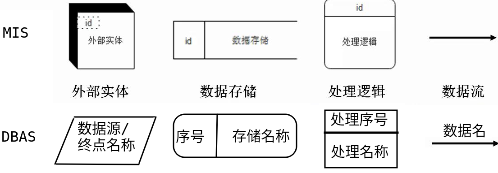
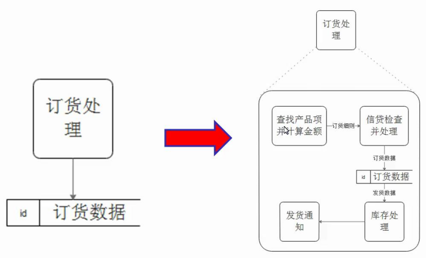
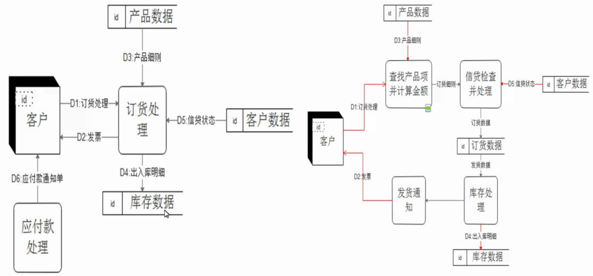
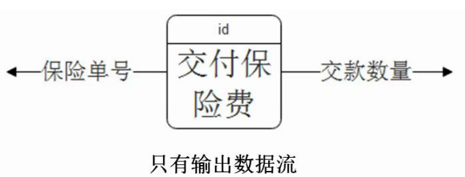
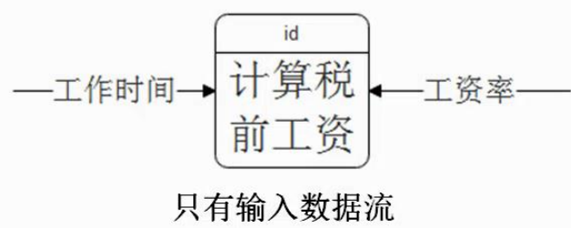
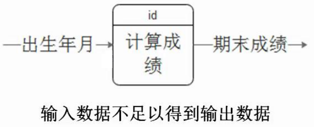
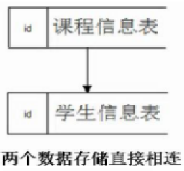
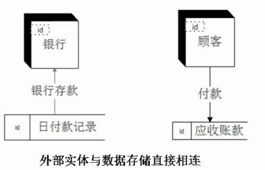
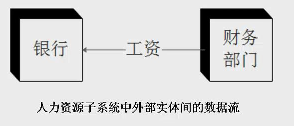

# DFD 数据流图

- DFD（Data Flow Diagram，数据流图/数据流程图）：数据的流动、加工处理和存储。DFD建模方法又称过程建模方法和功能建模方法，核心是数据流，从应用系统的数据流着手来描绘和表示一个具体业务系统中的数据处理过程和数据流。

# 4种基本元素

- DFD方法以应用信息系统或软件项目的功能为中心进行抽象和分解，以数据流的变换来分析和考察数据对企业及组织中各类业务活动的影响。

- 数据流程抽取（启发性原则）：

1. 将业务流程图中的业务处理单位转换成数据流图中的外部实体。

2. 将业务流程图中的业务处理描述转换成数据流图中的数据处理（处理逻辑）。

3. 将业务流程图中的表格制作转换成数据流图中的数据流。

4. 将业务流程图中的数据文件转换成数据流图中的数据存储。

<table>
    <tr>
        <td width="10%">外部项</td>
        <td width="90%">表示与本系统有消息传递关系的系统外的人或单位；描述系统数据的提供者或数据的使用者</td>
    </tr>
    <tr>
        <td rowspan="2">数据流</td>
        <td>表示系统中各组成元素之间传递的数据或对数据文件的存储操作</td>
    </tr>
    <tr>
        <td>一个数据流至少有一端是处理</td>
    </tr>
    <tr>
        <td rowspan="2">处理</td>
        <td>表示一个系统中的处理逻辑、功能或操作</td>
    </tr>
    <tr>
        <td>一个处理至少有一个输入流和一个输出流</td>
    </tr>
    <tr>
        <td rowspan="2">数据存储</td>
        <td>表示系统中存储的数据文件</td>
    </tr>
    <tr>
        <td>一个存储必定有输入和数据流和输出的数据流</td>
    </tr>
</table>

 

# 约定原则

- DFD图采用自顶向下逐步细化的结构化方法表示目标系统。由顶层图分出来的下一层图（通常是对父层的处理进行分解），描述为了实现顶层的使命必须要完成的功能和活动。然后，再对每个功能活动进行分解，直到每项功能活动都是具体的、可操作的、用一个程序模块可以实现其功能为止（功能完整性）。

1. 一个顶层图要将系统所涉及到的所有外部实体罗列出来。
2. 每层的处理不多于8个，如果多于8个，应该重新分析系统。最顶层只有一个处理，且顶层图中的处理名称应该是系统的名称。
3. 为每个处理符号使用唯一的编号：为了提高规范化程度，有必要对图中各个元素加以编号。通常在编号之首冠以字母，用以表示不同的元素，可以用P表示处理，D表示数据流，F表示数据存储，S表示外部实体。例如：P03-2.3表示第三子系统第二层图的第三个处理；D03-02表示第三个子系统中的第二个数据流。
4. 上层图不描述下层图的详细信息：一个数据存储如果只跟一个处理有数据联系的话，则该存储不必在此层流程图中体现，而是将具体细节体现在该处理的展开流程图中。
5. 子图与母图的数据流平衡：子图的输入、输出数据流必须包含母图中对应加工的输入、输出数据流。

 

 

# 6项注意情况

1. 处理逻辑中只有输出数据流，而没有输入数据流：信息系统的价值在于加工原始数据，产生有用的消息，在没有任何输入数据的情况下，自发产生输出数据并不符合常理。

 

2. 处理逻辑中只有输入数据流，而没有输出数据流：信息系统的价值在于产生消息，如果一个系统不产生任何输出数据，同样也不符合常理。

 

3. 处理逻辑中的输入数据不足以得到输出数据：处理逻辑的输出数据均是基于对数据加工处理后得到的。

 

4. 两个数据存储直接相连：在尚未明晰数据存储的表结构时，不适宜直接连接两个数据存储。（解决：在之间加入处理逻辑）。

> 例如，课程信息表和学生信息表的表结构并不相同，如果将两个数据存储直接相连，对于数据流程图的阅读者而言，可能会产生多种不同的理解：是要将两个表合并；或者是提取课程信息表中的某些字段加入到学生信息表中？
>
>  

5. 外部实体与数据存储直接相连：从数据安全性的角度出发，系统外的用户一般不应直接对系统内的数据进行读写操作。

​	

6. 两个外部实体直接相连：从简化数据流程图、提高流程图可理解性的角度出发。我们一般不建议在流程图中绘制外部实体间的数据联系。

> 例如，人力资源系统中的两个外部实体"银行"和"财务部门"，它们与人力资源系统之间的数据流关系应该在该系统流程图中体现，但是两个外部实体间的数据流关系，如果在人力资源子系统对应的流程图中出现，则会增加该流程图的复杂性。
>
>  
