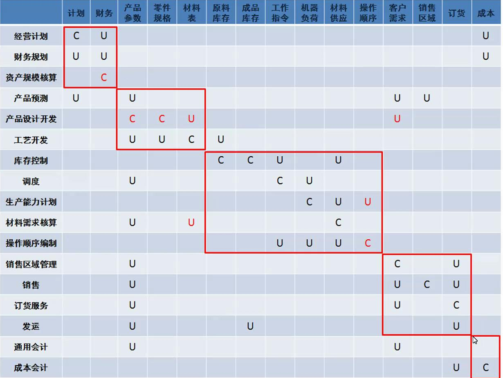
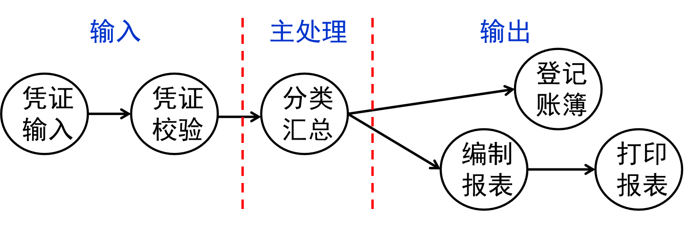

# 信息管理概述

## 管理信息

### 概述

#### 管理信息定义

- 管理信息：反映与控制管理活动的经过加工的数据。（数据是信息的载体）
- 管理信息按信息的来源分为：内源信息和外源信息。

1. 有效性

2. 共享性

3. 等级性

| 级别     | 战略级                     | 战术级（策略级）   | 作业级   |
| -------- | -------------------------- | ------------------ | -------- |
| 使用     | 高层管理者；全局和长期利益 | 局部和中期利益     | 基层业务 |
| 来源     | 多来自外部                 | 多来自内、外部双向 | 来自内部 |
| 寿命     | 最长                       | 长                 | 最短     |
| 保密程度 | 最高                       | 高                 | 最低     |
| 加工方法 | 不固定                     | 有一定的方法       | 最固定   |
| 使用频率 | 最低                       | 相对较高           | 最高     |
| 精确程度 | 最低                       | 中                 | 最高     |

4. 不完全性：信息匮乏、信息冗余。只有舍弃无用和次要的信息才能正确地使用信息。

   - 无用的信息： 干扰信息、冗余信息。

   - 不应该去除所有的冗余信息：冗余信息虽然本质上是多余的，但在传输过程中能起到补充作用，可以利用它们进行检错和纠错。
   - 信息接收者水平越高，传输的信息越简练。

5. 经济性：衡量使用效果，计算信息的产出。$信息的产出价值 = 在决策过程中用了该信息所增加的收益 -  获取信息所花费用$

   - 对生产信息商品的企业：信息投入确定信息的定价（信息的内在价值）。
   - 对使用信息的企业：信息的全情报价值衡量信息或信息系统是否合用（信息的外延价值）。

>  

> 外延价值：
>
> 

6. 滞后性
7. 传输性：尽可能用信息的传输代替物质的传输，通过信息流来减少物流。
8. 增殖性

- 信息的存储方式由系统目标确定。

#### 信息熵

- 信息熵：对不确定性的衡量。

| 概率     | 说明                     |
| -------- | ------------------------ |
| 后验概率 | 发生某件事情后再次的预料 |
| 先验概率 | 事前的预料               |

-  信息量的公式是双向的、是有方向的：甲-->乙、乙-->甲。

$$
I = \log_{2}{(后验概率/先验概率)}
$$

> 假设有A，B，C三个记者分别在甲、乙、丙地进行信息交换，甲、乙、丙分别有4、4、16种等概率状态。甲和乙先进行信息交换，然后乙和丙再进行信息交换，最后甲和丙进行信息交换。问甲和乙、乙和丙、甲和丙交换过程中的信息量。
>
>  

### 信息的新度

- 新度：信息和现实之间的时间差。新度越小，信息越新。

- 最新的信息一般要分散存放，以方便使用者；而老旧的信息一般采用集中存放，以较少冗余，方便管理。

### 生命周期

- 管理信息的生命周期：信息从它的生成、收集、加工、储存、使用、维护直到失效退出的过程。

#### 信息的生成与收集

1. 信息识别：信息收集的首要步骤，并确定信息需求。
   - 由决策者识别、由系统分析与设计人员识别、两者一起识别。

2. 信息收集
   - 信息的维度：阶段维度、层次维度、来源维度。

| 收集方式         | 信息类型           |
| ---------------- | ------------------ |
| 集中化收集       | 外源信息、二次信息 |
| 有目的的专项收集 | 内源信息、一次信息 |
| 随机积累法       | 外源信息、二次信息 |

3. 信息的表达：文字、数字、图形、表格。
   - 文字和表格：比较简练和确切，且不容易遗漏主要信息和引起偏见。

#### 信息的传输 香农模型

- 信源--(信号)->编码器--(信号)->信道(噪音干扰)--(信号)->译码器--(信息)->接收器。

#### 信息加工

#### 信息储存

#### 信息维护

- 保持信息处于合用状态。

- 保证信息的可靠性、及时性、安全保密性。

#### 信息使用

## 信息系统

### 概述

- 信息系统：一个对信息进行采集、处理、存储、管理、检索，必要时能向有关人员提供有用信息的系统。

- 管理信息系统是一个以计算机为基础，以人为主导的人机系统、是社会技术系统。

- 一个管理信息系统从使用者的角度看，它总是有一个目标，具有多种功能，各种功能之间又有各种信息联系，构成一个有机结合的整体，形成一个结构。该结构是功能结构。

- 三大要素：

1. 管理使用

2. 信息系统

3. 组织战略

- 对于一个企业而言，管理信息系统是任何企业不能没有的系统，管理信息系统只有优劣之分，不存在有无的问题

### 诺兰模型

| 阶段                 | 说明                                               |
| -------------------- | -------------------------------------------------- |
| 初始阶段             | 企业计算机应用非常少，作为简单办公设施             |
| 扩展阶段（蔓延阶段） | 盲目购机、盲目定制开发软件、缺少整体计划和规划     |
| 控制阶段             | 信息壁垒、信息孤岛                                 |
| 集成阶段             | 集成信息系统                                       |
| 数据管理阶段         | 信息成为企业的重要资源、基本实现资源整合、信息共享 |
| 成熟阶段             | 支持决策、集中统一的数据库                         |

- 一般认为诺兰模型中的各阶段都是不能跳跃的，需要先明确组织当前所处的生长阶段，再根据该阶段特征来指导管理信息系统建设。

### 信息系统组成

- 信息系统组成：信息源、信息处理器、信息用户、信息管理者
- 信息处理器：对信息的传输、加工、存储、为信息用户提供信息服务。

### 信息系统结构

- 按系统内部的结构分类系统可以分为：开环系统和闭环系统。

#### 综合

| 类型     | 说明                             |
| -------- | -------------------------------- |
| 横向综合 | 按层划分子系统（管理层次）       |
| 纵向综合 | 按条划分子系统（职能划分）       |
| 横纵综合 | 任一部分均可和其他部分组成子系统 |

#### 管理等级（纵向结构）

| 等级             | 功能                       |
| ---------------- | -------------------------- |
| 基层（运行管理） | 信息采集功能               |
| 中层（管理控制） | 调整控制功能               |
| 高层（决策管理） | 对汇总数据分析、预测并决策 |

 

# 开发组织和项目管理

## 甘特图

- 横维：进度、活动时间。
- 纵维：工作内容。
- 横道线：开始、结束、持续时间。

 

## 网络图

- 箭线：一个工作的活动、事情。
- 节点：工作的开始和结束。

| 路径       | 说明                                |
| ---------- | ----------------------------------- |
| 关键路径   | 路长最长的路径 关键节点：TE=TL |
| 次关键路径 | 路长仅次于关键路径                  |
| 非关键路径 |                                     |

- 关键路径的转移。

| 事情开始时间    | 节点           | 计算                                       |
| --------------- | -------------- | ------------------------------------------ |
| TE 最早开始时间 | 起始节点 TE=0  | 若存在多个前行事件，选择前行事件中最长的。 |
| TL 最晚开始时间 | 终点节点 TL=TE | 若存在多个后续事件，选择后续事件中最短的。 |

 

# 开发方法

- 先决条件：主要领导者的参与。

- 三要素：

1. 合理确定系统目标。

2. 组织系统性队伍。

3. 遵循系统工程的开发步骤。 

# 总体规划阶段

## 总体规划方法

### 组织机构法

- 组织机构法：不可行的规划思路，主观认为现有组织机构很合理，没有重新规划各子系统的合理划分，没有对现行系统进行必要的构造和调整。

### SST 战略目标集转化法

- 将企业的战略目标转化为MIS的战略目标。

1. 识别企业组织的战略集：
   1. 描绘出企业组织中各类人员的结构。
   2. 识别上述各类人员的目标。
   3. 识别上述人员的使命和战略。
2. 将企业组织的战略集转化为MIS的战略集。

### BSP 企业系统规划法

#### 概述

- 基本思路：首先自上而下识别系统目标，识别企业过程，识别数据，然后再自下而上设计系统。

1. 确定未来的MIS总体结构，明确子系统组成和开发子系统的先后顺序。

2. 对数据进行统一规划、管理和控制，明确各子系统之间的数据交换关系，保证信息的一致性。

#### 系统分析阶段

##### 定义企业过程

- 识别企业逻辑上相关的一组决策和活动的集合。

1. 识别计划和控制的企业过程。

2. 识别产品和服务的企业过程：生命周期----要求、获得、服务、退出。

3. 识别支持资源的企业过程：生命周期。

4. 通用模型法：参考之前的经验或其他的信息系统设计（典型案例），对企业过程进一步完善。

##### 定义数据类

- 定义数据类：对能够激发企业管理工作活动所需求数据的识别。

- 目的：为了解企业当前的数据状况和数据要求，查明数据共享的关系，并建立数据/过程矩阵。

###### 企业实体法

- 实体：数据存储载体。

- 数据类型：计划型、统计型、支持型、业务型。

###### 企业过程法

1. 利用之前识别的企业过程，分析每一过程的输入和输出数据。

2. 与企业实体法识别的数据类比较调整。

##### 分析当前的系统支持 问题/过程矩阵

- 问题/过程矩阵：对现行系统在开发新系统中能够提供的支持条件的调查分析，将无法支持的项目汇总 。
- 目的：找出之前识别的企业过程中不适合信息化的部分。

 

##### 分析对新系统的要求 组织/过程矩阵

- 组织/过程（系统）矩阵：调查和了解企业组织的领导和各职能部门对新系统的要求。
- 目的：找出权限设置问题、人员培训问题。

 

#### 系统设计阶段 U/C矩阵（过程/数据矩阵）

##### 创建U/C矩阵

- 由BSP方法系统分析阶段中的1、2步骤行列的功能、数据类建立U/C矩阵。

- U表示该流程使用的数据；C表示该流程产生的数据。

 

##### U/C矩阵正确性检验

1. 完备型检验：U/C矩阵的每一列必须有一个C和至少一个U；每一行至少一个C或U。

2. 一致性检验：每一数据列有且仅有一个C。

3. 无冗余性检验：矩阵中不允许出现空行/列。

 

##### 用U/C矩阵划分子系统的步骤

###### 调换过程和数据类的顺序，尽量使U、C集中到对角线。

1. 对功能列按功能组排列，每一功能组按功能发生的先后次序排序。

2. 调换数据类的横向位置，在不破坏功能成组的逻辑性的基础上。

- 目的：实现高内聚、低耦合。使得子系统内数据紧密性最高，子系统间数据联系最低。

 

 

###### 确定子系统：使用方框在U、C最密集的地方（尤其是C，C必须被放在方框内）

- 方框代表逻辑子系统的组合，划分并非唯一的。不允许子系统交叉。

 

##### U/C矩阵转化为数据流程总图

- 框外的U代表子系统之间的数据通信，即共享的数据资源。
- 通过U的归属来确定数据流的流向。

 

#### 系统实施阶段

# 系统分析阶段

## 现行系统分析

- 主要进行业务流程分析和数据流程调查。

## 组织结构与功能分析

- 发现现行组织结构存在的问题。

### 组织结构图

- 组织结构图：反映组织的构成和部分关系：组织内部和上下级关系。

### 组织业务流程图

- 组织业务流程图：反映各级组织的职能，业务关系。

 

## 业务流程分析

- 对于新生/变革企业：组织结构具有不稳定性；此时，信息系统的设计应以功能为准绳。

### 业务功能一览表

 

### TFD 业务流程图

- 业务流程图：描述系统内各单位、人员之间业务关系、作业顺序和管理信息流向的图表。

 

###  BPR 业务流程重组

- 现有的流程在信息技术支持下的优化。在业务流程的定义上，找出正确的流程和需要优化的流程（低效的）。

1. 以过程管理代替职能管理，取消不增值的管理环节。

2. 以事前管理代替事后监督，减少不必要的审核、检查和控制活动。

3. 取消不必要的信息处理环节，消除冗余信息集。

4. 以计算机协同处理为基础的并行过程取代串行和反馈控制管理过程。

5. 用信息技术实现过程自动化，尽可能抛弃手工管理过程。

## 数据与数据流程分析 

### [DFD 数据流程图](./DFD.md)

### 数据字典

- 数据字典：在新系统数据流程图基础上，进一步定义和描述所有数据项的工具。
- 数据字典的内容主要是对数据流程图（DFD）中的数据项、数据流、处理逻辑、数据存储、外部实体进行具体的定义。
- 数据流程图配以数据字典，就可以从图形和文字两个方面对系统的逻辑模型进行完整的描述。

#### 数据项

- 数据项（数据元素）：数据的最小单位。分析数据特性应从静态和动态两个方面去进行。在数据字典中，仅对数据的静态特性作了定义，具体包括:
  1. 数据项的名称、编号、别名和简述；
  2. 数据项的长度；
  3. 数据项的取值范围。

 

#### 数据流

- 数据流：由一个或一组固定的数据项组成。定义数据流时，不仅要说明数据流的名称、组成等，还应指明它的来源、去向和数据流量等。

 

#### 处理逻辑

- 处理逻辑：仅对数据流程图中最底层的处理逻辑加以说明。

 

#### 数据存储

 

#### 外部实体

 

## 功能/数据分析

### IPO图

- IPO图中比较简单的计算性的功能逻辑可以用自然语言定义。但对于一些处理过程较为复杂的模块，用自然语言描述其功能十分困难，并且对同一段文字描述，不同的人还可能产生不同的理解。

| 描述处理逻辑的方法 | 特点                       |
| ------------------ | -------------------------- |
| 决策树             | 多行动方案的决策过程       |
| 判断表             | 多判断条件的决策过程       |
| 结构英语           | 涉及具有循环动作执行的问题 |

#### 决策树

- 决策树是一种图形，它能够顺序的表示出条件和行动，因而能显示出应该首先考虑哪些条件，其次考虑哪些条件等。它也能表示出各条件和所允许的行动之间的关系。图形很像树枝，因而称为决策树。

- 决策树的组成：判别条件、判别选项、处理方案。
  - 在图形的左边是树根，它是决策序列的起点。
  - 紧接着的是各个分支，它们依赖于存在的条件和决策。可以从左到右，沿着某一个分支，做出一系列的决策。
  - 树的右边列出了要采取的行动，这种行动是依赖于它前面的条件序列的。

 

- 决策树应避免的问题：当系统本身过于复杂时，会存在许多步骤和组合条件的序列，结果系统的规模变得难以控制。在这种情况下，分析员应该避免使用决策树。分支的数目太多和通过的路径太多，对分析不但起不到帮助，反而会使人感到迷惑。在发生这些问题时，分析员应考虑改用判断表。

#### 判断表（决策表）

- 判断表是另外一种表达逻辑判断的工具。
- 与决策树方法相比，判断表：
  - 优点：能够把所有的条件组合充分地表达出来，因而对于说明复杂的政策和制定决策的规则是非常有效的。
  - 缺点：判断表的建立过程较为繁杂，且表达方式不如前者简便。

- 判断表的特性：条件语句、条件项、行动语句和行动项。
  - 条件语句：列出有关的判断条件。
  - 条件项：指出根据实际需要，选择的条件组合。
  - 行动语句：列出可供选择的行动方案。
  - 行动项：当选择的条件或条件的组合成立时，应采取的具体行动。

 

- 构建判断表：

1. 条件语句：确定决策应考虑的最相关因素。
2. 行动语句：在各种不同条件下，确定各种可能的行动方案。
3. 条件项：研究条件的可能组合。
4. 行动项：根据决策规则来填表。

- 检验判断表：每个判断表构建好后，分析员要检验它的正确性和完整性，以保证决策表能包括所有的条件以及决策规则。消除冗余项有助于控制表的大小。
- 当以下情况成立时，就会出现冗余：除了一个条件项外，其余条件项都是同的，并且它们对应的行动也是相同的。当两个或两个以上的规则有相同的一组条件，但是采取的行动不一样时，决策规则就出现了矛盾。

 

#### 结构化英语（结构语言）

- 结构化英语是一种模仿计算机语言的处理逻辑描述方法。使用了“IF”、“THEN”、“ELSE”等组成规范化语言。它的处理过程是以处理方案为主线，逐个描述。它克服了自然语言的模棱两可的问题，使用类似程序语言的语句，能够很快说明全部过程。

- 结构化英语的特点：受结构化程序设计思想的影响，由三种基本结构构成，即顺序结构、判断结构和循环结构。

1. 顺序结构：顺序结构是包括在过程中的一个单一步骤或行动，它不依赖于任何条件的存在，只要碰上它就执行。顺序结构使用一系列简单的陈述语句，每条语句可以使用行为动词，如GET，FIND，RECORD，CREATE，READ，UPDATE，DELETE，CALCULATE，WRITE，SORT，MERGE等，或是使用任何其他的用户可识别可理解的词。
2. 判断结构：决策结构说明了一个过程必须在不同的具体情况下执行不同的行为。当能够采取两个或者多个行为时，可以根据具体条件的值产生决策结构。用IF-THEN-ELSE结构来描述。
3. 循环结构：迭代结构说明了一组行为应该在某些特定的条件下重复执行。迭代指令包括：DO-WHILE和REPEAT-UNTIL。

## 新系统逻辑方案的建立

### 数据库的概念设计和逻辑设计

- 数据库设计的完整过程分为六个阶段：
1. 分析用户需求
2. 概念结构设计
3. 逻辑结构设计
4. 物理结构设计
5. 数据库实施
6. 数据库运行和维护

#### 分析用户要求

- 分析用户要求是数据库设计的起点和基础，其主要任务是对信息系统所要处理的对象进行全面的了解，要做的工作包括如下两个方面：

1. 确定用户对未来系统的各种要求，在此过程中必须重点了解各用户在业务活动中需要保存什么数据，对这些数据的格式、范围有何要求。另外还需了解用户会使用什么数据，如何处理这些数据，经过处理的数据的输出内容、格式是什么。最后还应明确处理后的数据应送往何处，谁有权查看这些数据。
2. 分析系统数据、产生数据字典，以描述数据流程图中涉及的各数据元素、数据结构、数据流、数据存储和处理等。

# 系统设计阶段

## 任务

- 任务：在系统分析提出的逻辑模型的基础上，科学合理地进行物理模型的设计。描述如何实现在系统分析中规定的系统功能。

1. 系统性原则：统一的代码方案、统一规划的数据库、统一的设计规范和标准。
2. 经济性原则：满足用户需求的基础上，尽可能少的减少费用支出。硬件不盲目追求技术上的先进（摩尔定律）。软件上，避免复杂化设计，模块简洁，可维护性强。

3. 可靠性原则硬件稳定性、软件安全保密性和抗病毒能力、检错纠错能力、容错能力和系统恢复能力。
4. 管理可接受的原则：人机界面的友好程度、系统操作的难易程度。

## HIPO图

- 结构化设计的起因：围绕系统设计的五大目标（系统的效率、工作质量、可变更性、通用性、可靠性），提出高内聚、低耦合的设计思路。
- 结构化设计的原理：自上而下逐步分解、自底向上分步实施。
- 结构化设计的工具：HIPO图。

- HIPO图：由层次结构图和IPO图两部分构成，描述系统结构和模块内部处理功能的工具。
  - 层次结构图：整个系统的设计结构以及各类模块之间的关系
  - IPO图：某个特定模块内部的处理过程和输入/输出关系。

### 层次模块结构图

- 层次模块结构图：系统划分为若干子系统，子系统下再划分为若干的模块，大模块再划分小模块，从而形成一种层次关系。
- 层次模块结构图主要关心的是模块的外部关系，即上下级模块、同级模块之间的数据传递和调用关系，而不关心模块的内部。

#### 绘制

1. 一个模块只能有一个上级，可以有几个下级。
2. 模块之间的连接只能存在上下级之间的调用关系，不能越级，也不能有同级之间的横向联系。
3. 整个系统呈树状结构，不允许有网状结构或交叉调用关系出现。

 

 

#### 模块划分的标准

- 总原则：高内聚，低耦合。
  - 模块与模块之间的关联度、模块内部各个组成部分之间的聚合度。

> 模块之间的关联度：一个模块与其他模块之间联系的紧密程度。关联度越低模块之间联系就越少，独立性就越强，可修改性和可维护性就越高，产生错误对其他模块的影响也就越小。

##### 模块之间的联系方式

| 连接形式 | 相互影响 | 可修改性 | 可读性 | 通用性 |
| -------- | -------- | -------- | ------ | ------ |
| 数据连接 | 弱       | 好       | 好     | 好     |
| 特征连接 | 弱       | 中       | 中     | 中     |
| 控制连接 | 中       | 不好     | 不好   | 不好   |
| 公共连接 | 强       | 不好     | 差     | 差     |
| 内容连接 | 最强     | 差       | 差     | 差     |

- 数据耦合：两个模块之间的联系通过数据交换实现的，耦合程度最低。
  - 一般来说，两个模块之间传递的数据越少，模块间的独立性就越强，因此模块的可修改性和可维护性就越高。

- 控制耦合：在两个模块之间，除了传递数据信息外，还传递控制信息。
  - 尽量避免或减少控制耦合。

 

- 内容耦合：在一个模块的执行过程中，从该模块直接转移到另一个模块中去运行。
  - 应完全避免内容耦合：如果两个模块是内容耦合，则在修改其中一个模块时，将直接影响到另一个模块，产生波动现象。

> 波动现象是指由于系统中各组成模块的独立性较差，修改其中一个模块，就会影响整个系统。

 

##### 模块之间使用控制信息的数量

- 由于控制信息直接影响程序的运行过程，所以过多地使用控制信息，必然会增加模块之间的联系，影响模块的独立性。因此，在模块之间尽可能不用或少用控制信息。

##### 模块的控制范围和影响范围

- 系统结构某一层次上的模块的判断处理，一般会影响其他层上模块的处理过程或数据的传递。

| 概念           | 说明                                                   |
| -------------- | ------------------------------------------------------ |
| 模块的影响范围 | 由该模块中包含的判断处理所影响到的所有其他模块的集合。 |
| 模块的控制范围 | 可以调用的所有下层模块和其本身所组成的集合。           |

- 基本原则：对于任意具有判断功能的模块，其影响范围都应当是它的控制范围的一个子集。

> A模块的控制范围是A、B、C、D四个模块，影响范围是B，C模块。
>
>  

| 控制范围和影响范围的关系     | 评价   | 举例：阴影部分为影响范围                                     |
| ---------------------------- | ------ | ------------------------------------------------------------ |
| 影响范围超出了控制范围       | 最差   |  |
| 判断点在层次结构中的位置太高 |        |  |
| 影响范围恰好是其直接下层模块 | 最理想 |  |

- 如果模块的影响范围不在其控制范围之内：

1. 在系统结构中向上移动判断点的位置，以扩大模块的控制范围；
2. 将具有判断功能的模块合并到它的上层调用模块中，从而提高判断点位置；
3. 在结构层次中，将受到某判断模块影响的模块下移，使其处于判断模块的控制范围之内。

> 

### IPO图

## 功能结构图

1. 把数据流程图划分为主处理和逻辑输入输出三部分：从数据流程图中，选出一个“功能处理”及其该“功能处理”的输入和输出数据流，作为变换分析的对象。

 

2. 以主处理为中心，设计结构图的最上层模块和最下层模块： 任何功能模块都是由输入、处理和输出三个基本部分组成。

 

3. 将各模块逐层进行功能分解，绘制出功能结构图。

 

## 处理流程图

- 信息系统流程图：信息在新系统内部的流动、转换、存储和处理的情况。

  

- 系统处理流程图是以新系统的数据流程图为基础绘制的：从数据流程图到信息系统流程图还应考虑哪些处理功能可以合并，或进一步分解，哪些地方需要增加一个临时用的中间文件，用来进行与其他处理之间的信息联系。

## 代码设计

- 代码设计是实现一个信息系统的前提条件，其目的是要设计出一套为系统各部分所公用的优化的代码系统。
- 代码：代表客观存在的事物名称、属性、状态等的符号。
- 在信息系统中，代码是人和机器的共同语言，是便于进行信息分类、校对、统计和检索的关键。一般用数字、字母或它们的组合来表示。

### 设计原则

1. 唯一性：每一个代码都仅代表唯一的实体或属性。
2. 标准性：系统内部使用的同一种代码应做到统一，使代码的使用范围越广泛越好。
3. 合理性：代码设计必须与编码对象的分类体系相适应，以使代码对编码对象的分类具有标识作用。
4. 可扩充性：要考虑系统的发展和变化，一般考虑3-5年的使用期限。当增加新的实体或属性时，直接利用原代码加以扩充，而不需要重新变动代码系统，即稳定性。
5. 简单性：代码结构要简单，为了同时适于计算机和人工处理使用。代码的长度不仅会影响所占据的存储单元和信息处理的速度，而且也会影响代码输入时出错的概率。
6. 适用性：代码不仅要具有逻辑含义，而且要便于识别和记忆。
   - 对于一些易混淆的字母：O、Z、I、S、V，尽量不用。
   - 代码长于4个字母或5个数字时，应分成小段。
7. 规范化：代码的结构、类型、编码格式必须严格统一，以便于计算机处理。
8. 逻辑处理一致性：设计的代码在逻辑上必须能满足用户的需要，在结构上应当与处理的方法相一致。

### 代码种类

 

| 代码   | 说明                                                         | 优点                                                     | 缺点                                                   | 用途                             |
| ------ | ------------------------------------------------------------ | -------------------------------------------------------- | ------------------------------------------------------ | -------------------------------- |
| 顺序码 | 以某种顺序形式编码                                           | 短而简单，易追加                                         | 可识别性差                                             | 其他码分类中细分类的一种补充手段 |
| 区间码 | 按编码对象的特点把代码分为若干个区段，其中每一区段代表一定的含义，代码中的位置和符号都代表一定的意义。 | 从结构上反映了数据的类型，排序、分类、检索等操作易于进行 | 位数较多，维护比较困难                                 |                                  |
| 助忆码 | 文字与数字的结合来描述、通过联想帮助记忆                     | 直观、便于记忆和使用                                     | 不利于计算机处理，当编码对象较多时，也容易引起联想出错 | 数据量较少的人工处理系统         |

### 校验位

- 校验码可检查的范围：
  - 移位错（1234记录为1243）
  - 双重移位错（1234记录为1432）
  - 抄写错（1234记录为1235）
  - 随机错误（包括以上两种或三种以上综合性错误）

1. 算术级数法
2. 几何级数法
3. 质数法

- 权因子：
  - 自然数：算术级数法
  - 几何级数：几何级数法
  - 质数：质数法

$$
\begin{matrix}
N位代码： & C_1C_2C_3...C_n \\
权因子： & P_1P_2P_3...P_n \\
加权和： & S = C_1P_1+C_2P_2+C_3P_3+...+C_nP_n \\
以模除和得余数： & \frac{S}{M} = Q...R \\
& 将余数R作为检验位，附加在原代码之后
\end{matrix}
$$

> 汉明码检验

## 输入输出设计

- 界面友好：软件具有良好的输入输出设计。

### 输入设计

- 输入设计：输入方式设计、用户界面设计。
- 目标：改善输入的环境，使输入的方式更简单、易于使用，而且更能够妥善地验证输入数据的正确性，减少人为的、不经意的错误。
- 输入设计是信息系统与用户之间交互的纽带，决定着人机交互的效率。

#### 原则

- 最根本的原则：提高效率和减少错误。

1. 控制输入量：
   1. 只输入必要的数据。（系统需要的数据项）
   2. 不输入DB数据。（能从系统文件中检索到或可用其他数据计算出的数据）
   3. 不输入常量。
   4. 使用代码。
2. 减少输入延迟：输入数据的速度往往成为提高信息系统运行效率的瓶颈，为减少延迟，可采用批量输入、用鼠标选取预先定义的输入等方式。
3. 减少输入错误：系统应具有自动数据校验和检查的功能，尽可能防止用户出现不必要的输入错误。对输入数据的检查应尽量接近原数据发生点，以便使错误及时得到改正。
4. 输入过程应尽量简化。输入过程应尽量容易，不能因为查错、纠错而使输入复杂化。 

#### 输入校验

- 数据出错的情况：

1. 数据本身有错误。
2. 数据多余或不足。
3. 数据的延误。

| 校验方式     | 说明                                                         |
| ------------ | ------------------------------------------------------------ |
| 重复输入检验 | 同一批数据两次键入系统 可用于任何类型的数据符号校验 工作量加倍 |
| 视觉检验     | 输入数据后屏幕再显示或打印机打印，由人来进行校对 效率低 |
| 控制总数校验 | 工作人员先用手工求出数据的总值，然后在数据的输入过程中由计算机程序累计总值，将两者对比校验 数值型的项目 |
| 记录计数校验 | 计算记录个数来检查记录有否遗漏和重复                         |
| 格式校验     | 校验数据记录中各数据项的位数和位置是否符合预先规定的格式     |
| 逻辑校验     | 根据业务上各种数据的逻辑性，检查有无矛盾                     |
| 界限校验     | 检查某项输入数据的内容是否位于规定范围之内                   |
| 顺序校验     | 检查记录的顺序                                               |
| 平衡校验     | 检查相反项目间是否平衡                                       |
| 对照校验     | 将输入的数据与基本文件的数据相核对，检查两者是否一致         |
| 数据类型检验 |                                                              |
| 数据平衡校对 | 财务报表和统计报表等完全数字型报表中。系统可对报表的行或列进行自动累加，并将累加值与原始报表的小计字段（在财务报表中一般都设有）进行比较 |

#### 输入媒介和装置

1. 键盘输入：主要用于和业务处理结合的输入，如少量控制信息的输入；不适合大批中间处理性质的数据的输入。
2. 读卡机：直接通过光电设备对实际数据进行采集并将其转换成数字信息的方法，是一种方便、安全可靠的数据输入方式，但有一定的读错率和拒读率，价格较贵。
   1. 条码输入； 
   2. 扫描仪输入； 
   3. 传感器输入。
3. 网络传送数据；
4. 数据存储器传送方式；
5. 语音输入。

### 用户界面设计

- 用户界面设计应坚持友好、简便、实用、易于操作的原则。
- 用户界面是系统与用户沟通最直接的媒介，用户界面设计最主要的工作是如何处理屏幕上用来告知用户信息的格式。

1. 限制用户对输入数据的屏幕随机定位。
2. 为每一个字段提供一个描述性的说明，为用户显示在哪里输入什么数据，包括所要求的字段大小。
3. 如果字段值必须以指定的格式输入的话，就给出这种格式的样式。
4. 对于可能存在不同输入格式或容易产生一义多词现象的字段，采用选择输入，保证输入内容形式的一致性。例如，日期，职业等。
5. 将默认值显示出来，用户只需按Enter键接受建议的值，如果默认值不合适，用户可以对它进行更改。
6. 为有限个合法的字段值显示一个可接受值的下拉列表，让用户可在列表中选择一个，自动输入到表格上。
7. 屏幕表格设计要与原始表格一致，符合用户的习惯，便于用户输入。
8. 不要在画面上放置不相关的文字，以降低屏幕画面的复杂性，从而增加可读性。 
9. 如果要求用户输入数据，应在输入数据位置以闪烁的光标作为提示；同时，应将要求输入数据的区域，用不同的颜色标示。

## 报表设计

- 报表：将系统内部数据处理后具体表现的一种方式，它必须包含用户所要得到的信息，而且以简单明了、美观、易于了解的形式出现。在设计上除了要注意数据的正确性之外，还要将各项数据安排在适当的位置，以合乎一般人的阅读方式。

1. 页标题行：报表程序必须生成主题和标题行，每一页应该包括报表的主题和标识代码、页号、打印日期以及时间。
2. 列标题行：列标题区分了每一列的数据，简短的、描述性的。
   - 如果一个或更多的字段唯一标识了这个细节行，它们应该首先出现，逻辑上相关联的项目应该组合起来。
3. 组合明细行：如果细节组是有意义的，它们应该以某种方式表示。
   - 注脚行：在一组的最后一个明细行的下一行加一个注脚。
4. 报表注脚：每一张报表应该有一个报表注脚来表示报表的结束。报表注脚与连续的每页上的页码组合在一起，保证报表用户对报表有一个全面的了解。
5. 设计的一致性：好的设计标准产生的报表是统一的、一致的。由一个系统产生的多张报表，每张报表都应有相似的风格。
6. 报表简明化。

# 实施与维护阶段

## 实施阶段任务

1. 设计方案购置、安装计算机网络系统。
2. 建设数据库系统。
3. 程序设计与调试。
4. 整理基础数据、操作人员培训。
5. 投入切换和运行。

## 程序设计

## 系统测试

### 逻辑覆盖

| 逻辑覆盖          | 说明                                 |
| ----------------- | ------------------------------------ |
| 语句覆盖          | 每条语句至少被执行一次               |
| 判定覆盖          | 每个判断的分支至少被执行一次         |
| 条件覆盖          | 每个判断的所有可能条件至少被执行一次 |
| 判断/条件组合覆盖 |                                      |
| 路径覆盖          | 所有可能路径至少被执行一次           |

>  

### 程序调试

1. 模块调试
2. 联调：主控程序调度模块，模拟数据。

## 系统转换

| 转换方式             | 优点               | 缺点                 |
| -------------------- | ------------------ | -------------------- |
| 直接转换             | 费用低             | 风险高               |
| 并行转换             | 安全               | 费用高、工作量大     |
| 分段转换（试点过渡） | 平稳安全、费用不高 | 可能衔接不平滑的问题 |

 

## 系统的运行和支持

1. 日常运行管理。
2. 系统文档规范管理。
3. 系统安全与保密。

### 日常运行管理

#### 数据维护

| 备份方式 | 说明                               |
| -------- | ---------------------------------- |
| 完全备份 | 对系统数据完全备份                 |
| 差分备份 | 备份与上次完全备份相比有变化的数据 |
| 增量备份 | 备份与上次备份相比有变化的数据     |

| 备份类型 | 说明 | 缺陷           |
| -------- | ---- | -------------- |
| 冷备     | 脱机 | 耗时长         |
| 热备     | 联机 | 可能数据不一致 |

