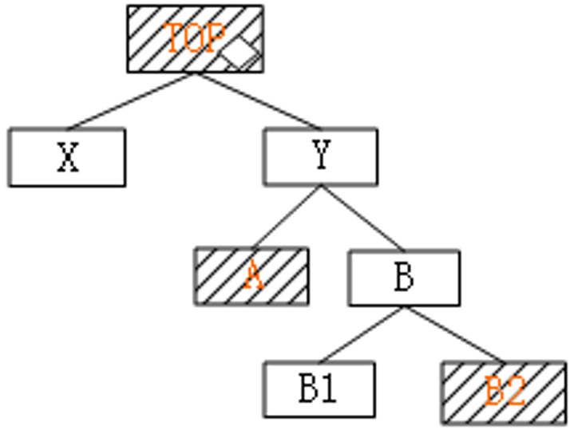

# 层次模块结构图概述

- 层次模块结构图：系统划分为若干子系统，子系统下再划分为若干的模块，大模块再划分小模块，从而形成一种层次关系。
- 层次模块结构图主要关心的是模块的外部关系（外部特性），即上下级模块、同级模块之间的数据传递和调用关系，而不关心模块的内部，与模块内部处理流程无关。

# 模块结构图的绘制

- 绘制模块结构图的原则：

1. 一个模块只能有一个上级，可以有几个下级。
2. 模块之间的连接只能存在上下级之间的调用关系，不能越级，也不能有同级之间的横向联系。
3. 整个系统呈树状结构，不允许有网状结构或交叉调用关系出现。

 

 

# 划分模块的标准

- 总原则：高内聚，低耦合。也就是，模块与模块之间的关联度、模块内部各个组成部分之间的聚合度；以及减少复杂接口。
- 模块之间的关联度：一个模块与其他模块之间联系的紧密程度。关联度越低模块之间联系就越少，独立性就越强，可修改性和可维护性就越高，产生错误对其他模块的影响也就越小。

## 模块之间的联系方式

<table>
	<thead>
		<tr>
			<th width="20%" align="center">连接形式</th>
			<th width="20%" align="center">相互影响</th>
			<th width="20%" align="center">可修改性</th>
			<th width="20%" align="center">可读性</th>
			<th width="20%" align="center">通用性</th>
		</tr>
	</thead>
	<tbody>
		<tr>
			<td align="center">数据连接</td>
			<td align="center">弱</td>
			<td align="center">好</td>
			<td align="center">好</td>
			<td align="center">好</td>
		</tr>
		<tr>
			<td align="center">特征连接</td>
			<td align="center">弱</td>
			<td align="center">中</td>
			<td align="center">中</td>
			<td align="center">中</td>
		</tr>
		<tr>
			<td align="center">控制连接</td>
			<td align="center">中</td>
			<td align="center">不好</td>
			<td align="center">不好</td>
			<td align="center">不好</td>
		</tr>
		<tr>
			<td align="center">公共连接</td>
			<td align="center">强</td>
			<td align="center">不好</td>
			<td align="center">差</td>
			<td align="center">差</td>
		</tr>
		<tr>
			<td align="center">内容连接</td>
			<td align="center">最强</td>
			<td align="center">差</td>
			<td align="center">差</td>
			<td align="center">差</td>
		</tr>
	</tbody>
</table>

- 数据耦合：两个模块之间的联系通过数据交换实现的，耦合程度最低。一般来说，两个模块之间传递的数据越少，模块间的独立性就越强，因此模块的可修改性和可维护性就越高。

- 控制耦合：在两个模块之间，除了传递数据信息外，还传递控制信息。应该尽量避免或减少控制耦合。

 

- 内容耦合：在一个模块的执行过程中，从该模块直接转移到另一个模块中去运行。应完全避免内容耦合，如果两个模块是内容耦合，则在修改其中一个模块时，将直接影响到另一个模块，产生<b>波动现象</b>。

> 波动现象是指由于系统中各组成模块的独立性较差，修改其中一个模块，就会影响整个系统。

 

## 模块之间使用控制信息的数量

- 由于控制信息直接影响程序的运行过程，所以过多地使用控制信息，必然会增加模块之间的联系，影响模块的独立性。因此，在模块之间尽可能不用或少用控制信息。

## 模块的控制范围和影响范围

- 系统结构某一层次上的模块的判断处理，一般会影响其他层上模块的处理过程或数据的传递。

<table>
	<tbody>
		<tr>
			<td width="20%">模块的影响范围</td>
			<td width="80%">由该模块中包含的判断处理所影响到的所有其他模块的集合。</td>
		</tr>
		<tr>
			<td>模块的控制范围</td>
			<td>可以调用的所有下层模块和其本身所组成的集合。</td>
		</tr>
	</tbody>
</table>

- 基本原则：对于任意具有判断功能的模块，其影响范围都应当是它的控制范围的一个子集。如下图，A模块的控制范围是A、B、C、D四个模块，影响范围是B，C模块。

 

<table>
	<thead>
		<tr>
			<th width="30%">控制范围和影响范围的关系</th>
			<th width="10%">评价</th>
			<th width="60%">举例：阴影部分为影响范围</th>
		</tr>
	</thead>
	<tbody>
		<tr>
			<td>影响范围超出了控制范围</td>
			<td>最差</td>
			<td>
				
			</td>
		</tr>
		<tr>
			<td>判断点在层次结构中的位置太高</td>
			<td></td>
			<td>
				
			</td>
		</tr>
		<tr>
			<td>影响范围恰好是其直接下层模块</td>
			<td>最理想</td>
			<td>
				
			</td>
		</tr>
	</tbody>
</table>

- 如果模块的影响范围不在其控制范围之内：

1. 在系统结构中向上移动判断点的位置，以扩大模块的控制范围；
2. 将具有判断功能的模块合并到它的上层调用模块中，从而提高判断点位置；
3. 在结构层次中，将受到某判断模块影响的模块下移，使其处于判断模块的控制范围之内。

