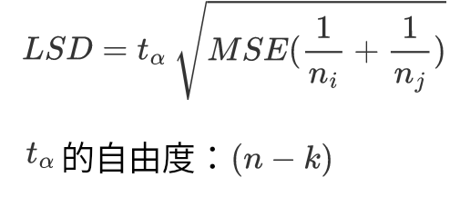

# 统计学 导论

- 统计学（Statistics）是收集、分析、表述和解释数据的科学。

1. 描述统计（descriptive statistics）：数据收集、处理、汇总、图标描述、概括与分析等统计方法。
2. 推断统计（inferential statistics）：如何利用样本数据来推断总体特征的统计方法。

<table>
    <tr>
        <td>标准</td>
        <td>统计数据的类型</td>
        <td>描述</td>
    </tr>
    <tr>
        <td rowspan="2">计量尺度</td>
        <td>分类数据 categorical data</td>
        <td>某一类别的非数字数据</td>
    </tr>
    <tr>
        <td>数值数据 metric data</td>
        <td>数字尺度测量的观测值</td>
    </tr>
    <tr>
        <td rowspan="2">收集方法</td>
        <td>观测数据 observational data</td>
        <td></td>
    </tr>
    <tr>
        <td>实验数据 experimental data</td>
        <td></td>
    </tr>
    <tr>
        <td rowspan="2">时间状态</td>
        <td>截面数据 cross-sectional data</td>
        <td></td>
    </tr>
    <tr>
        <td>时间序列数据 time series data</td>
        <td></td>
    </tr>
</table>

1. 总体（population）是包含所研究的全部个体（数据）的集合，组成总体的每个元素称为个体。总体根据其所包含的单位数目是否可数分为有限总体和无限总体，判别在抽样中每次抽取是否独立。
2. 样本（sample）是从总体中抽取的一部分元素的集合，构成样本的元素的数目称为样本量（sample size）。
3. 参数（parameter）是用来描述总体特征的概括性数字度量，是总体的某种特征值。
4. 统计量（statistics）是用来描述样本特征的概括性数字度量，是样本的函数。

 

# 数据的搜集

# 数据的图表展示

# 数据的概括性度量

# 概率与概率分布

# 统计量及其抽样分布

# 参数估计

# 假设检验

# 分类数据分析

# 方差分析 ANOVA

## 方差分析相关概念

- 因素（因子）、水平（处理）、观察值：若分析零售业、旅游业、航空业的被投诉次数，行业就是要检验的对象；零售业、旅游业、航空业就是水平；而每个行业的样本数据就是观察值。

| 误差分解                   | 说明                                                     |
| -------------------------- | -------------------------------------------------------- |
| 总误差 SST（总平方和）     |                                                          |
| 组内误差 SSE（组内平方和） | 只含有随机误差，反映一个样本内部数据的离散程度           |
| 组间误差 SSA（组间平方和） | 随机误差和系统误差的总和，反映不同样本之间数据的离散程度 |

- 方差分析的基本假定

1. 每个总体都应该服从正态分布
2. 各个总体的方差必须相同
3. 观察值是独立的

## 单因素方差分析

### 1. 提出假设：问题的一般提法

- 设因素有k个水平，每个水平的均值分别为u1, u2, ..., uk

H0: u1 = u2 = ... = uk
H1: u1, u2, ... , uk不全相等

### 2. 构造统计量

1. 各样本均值、全部观察值的总均值

 

2. 各误差平方和：SST、SSA、SSE

 

3. 均方：MSA、MSE

 

### 3. 决策统计 F分布

1. F分布值

 

2. 查表F&alpha;(k-1, n-k)
3. 若F &lt; F&alpha;，则不拒绝H0；否则拒绝H0

### 关系强度

- 只要SST不等于零，就表明两个变量之间有关系。

- R（而不是R2）测量自变量和因变量之间的关系强度：

 

### 多重比较 最小显著差异方法

- 通过对总体均值之间的配对比较俩进一步检验到底哪些均值之间存在差异。

1. 提出假设：

 

2. 计算检验统计量

 

3. 计算LSD

 

4. 比较检验结果

 

## 双因素方差分析

- 双因素方差分析（two-way analysis of variance）：行因素和列因素对实验结果的影响。

1. 无交互作用的双因素方差分析（无重复双因素分析）
2. 有交互作用的双因素方差分析（可重复双因素分析）

### 无交互作用的双因素方差分析

- 无交互作用的双因素方差分析：分为行因素和列因素，他们的每个水平都可以搭配成一组。

 

#### 1. 对两个因素分别提出假设

- 对行因素提出的假设：

 

- 对列因素提出的假设：

 

#### 2. 构造统计量

 

|各误差平方和|说明|自由度 df|
|--|--|--|
|SST|总误差平方和|kr-1|
|SSR|行因素所产生的误差平方和|k-1|
|SSC|列因素所产生的误差平方和|r-1|
|SSE|随机误差平方和 除行因素和列因素之外的剩余因素所产生的误差平方和|(k-1)(r-1)|

| 均方 | 说明             |
| ---- | ---------------- |
| MSR  | 行因素的均方     |
| MSC  | 列因素的均方     |
| MSE  | 随机误差项的均方 |

 

#### 3. 统计决策 F分布

- F分布统计量

  

1. 若FR &gt; F&alpha; (k-1, (k-1)(r-1))，则拒绝H0，认为...
2. 若FC &gt; F&alpha; (r-1, (k-1)(r-1))，则拒绝H0，认为...

#### 关系强度

 

### 有交互作用的双因素方差分析

 

 

