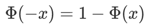
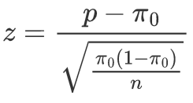

# 统计学 导论

- 统计学（Statistics）是收集、分析、表述和解释数据的科学。

1. 描述统计（descriptive statistics）：数据收集、处理、汇总、图标描述、概括与分析等统计方法。
2. 推断统计（inferential statistics）：如何利用样本数据来推断总体特征的统计方法。

<table>
    <tr>
        <td>标准</td>
        <td>统计数据的类型</td>
        <td>描述</td>
    </tr>
    <tr>
        <td rowspan="2">计量尺度</td>
        <td>分类数据 categorical data</td>
        <td>某一类别的非数字数据</td>
    </tr>
    <tr>
        <td>数值数据 metric data</td>
        <td>数字尺度测量的观测值</td>
    </tr>
    <tr>
        <td rowspan="2">收集方法</td>
        <td>观测数据 observational data</td>
        <td></td>
    </tr>
    <tr>
        <td>实验数据 experimental data</td>
        <td></td>
    </tr>
    <tr>
        <td rowspan="2">时间状态</td>
        <td>截面数据 cross-sectional data</td>
        <td>相近/相同时间点</td>
    </tr>
    <tr>
        <td>时间序列数据 time series data</td>
        <td>不同时间点</td>
    </tr>
</table>

1. 总体（population）是包含所研究的全部个体（数据）的集合，组成总体的每个元素称为个体。总体根据其所包含的单位数目是否可数分为有限总体和无限总体，判别在抽样中每次抽取是否独立。
2. 样本（sample）是从总体中抽取的一部分元素的集合，构成样本的元素的数目称为样本量（sample size）。
3. 参数（parameter）是用来描述总体特征的概括性数字度量，是总体的某种特征值。
4. 统计量（statistics）是用来描述样本特征的概括性数字度量，是样本的函数。

 

# 数据的搜集

## 调查方法

| 调查方法   | 随机原则       | 估计总体参数                                                 |
| ---------- | -------------- | ------------------------------------------------------------ |
| 概率抽样   | 依据随机原则   | 可以根据调查的结果对总体的有关参数进行估计                   |
| 非概率抽样 | 不依据随机原则 | 样本统计量的分布不确切，不能使用样本的结果对总体相应的参数进行推断 |

### 概率抽样

- 概率抽样（probability sampling，随机抽样）：

1. 抽样时按一定的概率以随机原则抽取样本
2. 每个单位被抽中的概率是已知的，或可以被计算得来
3. 可以根据调查的结果对总体的有关参数进行估计

| 概率抽样方式 | 执行方法                                                     |
| ------------ | ------------------------------------------------------------ |
| 简单随机抽样 | 抽样框（sampling frame）                                     |
| 分层抽样     | 将抽样单位按某种特征或规则划分为不同的层；之后从不同层中独立、随机地抽取样本 保证样本的结构与总体的结构相近；可以对总体参数或各层的目标量进行估计 |
| 整群抽样     | 将总体中若干单位合并为组（群）；抽样时，直接抽取群；之后对中选群中的所有单位全部实施调查 缺点是估计的精度较差 |
| 系统抽样     | 将总体中的所有单位按一定顺序排列，在规定的范围内随机抽取一个单位作为初始单位； 之后按照事先制定好的规则确定其他样本单位 缺点是对估计量方差的估计比较困难 |
| 多阶段抽样   | 首先抽取群（初级抽样单位）；再进一步抽样，从选中的群中抽取若干个单位（最终抽样单位）进行调查 以此类推 保证了样本相对集中；但抽样的阶段应尽可能少，每增加一个阶段就增添一份估计误差 |

### 非概率抽样

- 非概率抽样（non-probability sampling）：

1. 不依据随机原则，而是根据研究目的对数据的要求
2. 样本统计量的分布不确切，不能使用样本的结果对总体相应的参数进行推断

| 非概率抽样方式 | 特点                                                         |
| -------------- | ------------------------------------------------------------ |
| 方便抽样       | 调查员根据方便的原则，自行确定样本的单位                     |
| 判断抽样       | 研究人员根据经验、判断和对研究对象的了解，有目的地选择，是主观的 |
| 自愿抽样       | 被调查者自愿参加；样本的组成往往集中于某类特定的人群，是有偏的，可以反映某类群体的一般看法 |
| 滚雪球抽样     | 对稀少群体的调查，容易找到特定群体的被调查者（如，冬泳爱好者） |
| 配额抽样       | 首先将总体中所有的单位按一定的标志（变量）分为若干类，可以是单一变量或交叉变量； 之后在每类中采用方便抽样或判断抽样的方式选择样本单位； 广泛应用于市场调查 |

## 数据的误差

<table>
    <tr>
        <th>误差类型</th>
        <th  colspan="3">特点</th>
    </tr>
    <tr>
        <td rowspan="2">抽样误差</td>
        <td colspan="3">随机性误差：由抽样的随机性引起的（所有）样本结果与总体真值之间的差异</td>
    </tr>
    <tr>
        <td  colspan="3">样本量越大，抽样误差就越小（普查的抽样误差为0）；总体的变异性越大，抽样误差越大</td>
    </tr>
    <tr>
        <td rowspan="9">非抽样误差</td>
        <td colspan="3">除样本误差之外的误差</td>
    </tr>
    <tr>
        <td>抽样框误差</td>
        <td colspan="2">抽样框中的单位和研究总体中的单位有一一对应关系</td>
    </tr>
    <tr>
        <td rowspan="3">回答误差</td>
        <td>理解误差</td>
        <td>排除问卷中可能引起误解的选项，设置合理的排序</td>
    </tr>
    <tr>
        <td>记忆误差</td>
        <td colspan="2">应该缩短调查所涉及的时间间隔</td>
    </tr>
    <tr>
        <td>有意识误差</td>
        <td colspan="2">作好被调查者的思想工作，使其打消疑虑； 遵守职业道德，做好保密措施； 避免敏感问题</td>
    </tr>
    <tr>
        <td>无回答误差</td>
        <td colspan="2">有时随机的：可通过增加样本量来解决 有时是系统的：（1）预防，做好准备工作；（2）补救，对无回答的单位实施更有力的调查</td>
    </tr>
    <tr>
        <td>调查员误差</td>
        <td colspan="2">调查员个人的粗心、偏见等</td>
    </tr>
    <tr>
        <td>测量误差</td>
        <td colspan="2">与测量工具有关</td>
    </tr>
</table>

# 数据的图表展示

## 图表的格式要求

1. 图：`图号 图题`，置于图正下方
2. 表：`表号 表题`，置于表正下方；表格要求三段式的结构

## 数据分组

- 全距：max - min

- 组距：步长

1. 一般情况下，数据所分的组数不应少于5组且不多于15组，即5 &le; K &le; 15
2. 上组限不在内原则，即150归于140\~150
3. 开口组：XX以上或XX以下，通常以相邻组的组距作为其组距，即`上限 - 邻组组距`或`下限 + 邻组组距`
4. 组中值：每一组中下限值与上限值中间的值，组中值 = (下限值 + 上限值) / 2

## 数据图表

### 频数分布表

### 条形图、帕累托图

### 饼图、环形图

### 直方图

### 箱线图

### 散点图

### 雷达图

# 数据的概括性度量

## 集中趋势的度量

### 平均数

### 中位数

- 中位数：先对n个数据进行排序，在确认中位数的位置

1. n为奇数，即位置为整数值（`(n+1)/2`）：该位置的数值
2. n为偶数，即位置为非整数值（`(n+1)/2`）：该位置两侧值的平均值

### 四分位数

- Q25%位置 = `(n+1) / 4`
- Q75%位置 = `3(n+1) / 4`

1. 若位置是整数位，则为该数值
2. 若位置是0.5位，则取两侧数值的平均值
3. 若位置是0.25或0.75位，则按比例取两侧数值的差值

### 众数

## 离散程度的度量

### 全距

- 全距（极差）：max - min

### 四分位距 IQR

- 四分位距：反映中间50%数据的离散程度，其数值越小，中间的数据越集中，不受极值影响

### 方差和标准差

- 样本方差S2的自由度为n-1

 

### 离散系数

- 离散系数（CV，变异系数）：一组数据的标准差与其相应的平均数之比，消除了数据取指大小和计量单位对标准差的影响，反映一组数据的相对离散程度，离散系数越大，数据的相对离散程度越大

 

# 概率与概率分布

## 标准正态分布

 

 

# 统计量及其抽样分布

# 参数估计

# 假设检验

## 假设检验的基本问题

1. 提出原假设H0和备择假设H1
2. 确定检验统计量
3. 规定显著性水平&alpha;
4. 计算统计量

<table>
    <tr>
        <th colspan="2">检验类型</th>
        <th>假设</th>
        <th colspan="2">检验统计量</th>
    </tr>
    <tr>
        <td colspan="2">双侧检验</td>
        <td>H0：&mu; = &mu;0 H1：&mu; &ne; &mu;0</td>
        <td>Z&alpha;/2</td>
        <td>t&alpha;/2</td>
    </tr>
    <tr>
        <td rowspan="2">单侧检验</td>
        <td>左单侧检验</td>
        <td>H0：&mu; &ge; &mu;0 H1：&mu; &lt; &mu;0</td>
        <td>Z&alpha;</td>
        <td>t&alpha;</td>
    </tr>
    <tr>
        <td>右单侧检验</td>
        <td>H0：&mu; &le; &mu;0 H1：&mu; &gt; &mu;0</td>
        <td>Z&alpha;/2</td>
        <td>t&alpha;/2</td>
    </tr>
</table>

## 一个总体参数的检验

### 总体均值的检验

 

### 总体比例的检验

- 总体比例的检验通常采用Z统计量，即样本大的情况（np &gt; 5，nq &gt; 5）

 

## 两个总体参数的检验

### 两个总体均值之差的检验

#### &sigma;12，&sigma;22已知、或n较大

 

#### &sigma;12，&sigma;22未知，且n较小，但已知&sigma;12=&sigma;22

 

#### &sigma;12，&sigma;22未知，且n较小，但不能确定&sigma;12=&sigma;22

 

### 两个总体比例之差的检验

#### &pi;1 - &pi;2 = 0

 

#### &pi;1 - &pi;2 = d0

 

### 匹配样本

# 分类数据分析

# 方差分析 ANOVA

## 方差分析相关概念

- 因素（因子）、水平（处理）、观察值：若分析零售业、旅游业、航空业的被投诉次数，行业就是要检验的对象；零售业、旅游业、航空业就是水平；而每个行业的样本数据就是观察值。

| 误差分解                   | 说明                                                     |
| -------------------------- | -------------------------------------------------------- |
| 总误差 SST（总平方和）     |                                                          |
| 组内误差 SSE（组内平方和） | 只含有随机误差，反映一个样本内部数据的离散程度           |
| 组间误差 SSA（组间平方和） | 随机误差和系统误差的总和，反映不同样本之间数据的离散程度 |

- 方差分析的基本假定

1. 每个总体都应该服从正态分布
2. 各个总体的方差必须相同
3. 观察值是独立的

## 单因素方差分析

### 1. 提出假设：问题的一般提法

- 设因素有k个水平，每个水平的均值分别为u1, u2, ..., uk

H0: u1 = u2 = ... = uk
H1: u1, u2, ... , uk不全相等

### 2. 构造统计量

1. 各样本均值、全部观察值的总均值

 

2. 各误差平方和：SST、SSA、SSE

 

3. 均方：MSA、MSE

 

### 3. 决策统计 F分布

1. F分布值

 

2. 查表F&alpha;(k-1, n-k)
3. 若F &lt; F&alpha;，则不拒绝H0；否则拒绝H0

### 关系强度

- 只要SST不等于零，就表明两个变量之间有关系。

- R（而不是R2）测量自变量和因变量之间的关系强度：

 

### 多重比较 最小显著差异方法

- 通过对总体均值之间的配对比较俩进一步检验到底哪些均值之间存在差异。

1. 提出假设：

 

2. 计算检验统计量

 

3. 计算LSD

 

4. 比较检验结果

 

## 双因素方差分析

- 双因素方差分析（two-way analysis of variance）：行因素和列因素对实验结果的影响。

1. 无交互作用的双因素方差分析（无重复双因素分析）
2. 有交互作用的双因素方差分析（可重复双因素分析）

### 无交互作用的双因素方差分析

- 无交互作用的双因素方差分析：分为行因素和列因素，他们的每个水平都可以搭配成一组。

 

#### 1. 对两个因素分别提出假设

- 对行因素提出的假设：

 

- 对列因素提出的假设：

 

#### 2. 构造统计量

 

|各误差平方和|说明|自由度 df|
|--|--|--|
|SST|总误差平方和|kr-1|
|SSR|行因素所产生的误差平方和|k-1|
|SSC|列因素所产生的误差平方和|r-1|
|SSE|随机误差平方和 除行因素和列因素之外的剩余因素所产生的误差平方和|(k-1)(r-1)|

| 均方 | 说明             |
| ---- | ---------------- |
| MSR  | 行因素的均方     |
| MSC  | 列因素的均方     |
| MSE  | 随机误差项的均方 |

 

#### 3. 统计决策 F分布

- F分布统计量

  

1. 若FR &gt; F&alpha; (k-1, (k-1)(r-1))，则拒绝H0，认为...
2. 若FC &gt; F&alpha; (r-1, (k-1)(r-1))，则拒绝H0，认为...

#### 关系强度

 

### 有交互作用的双因素方差分析 \*

 

 

