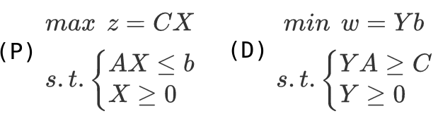
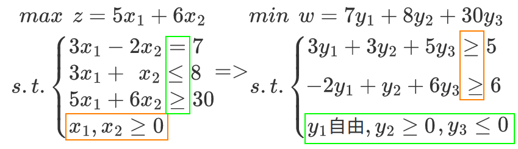
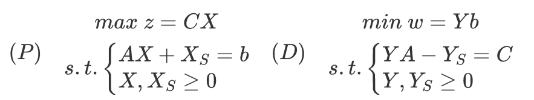
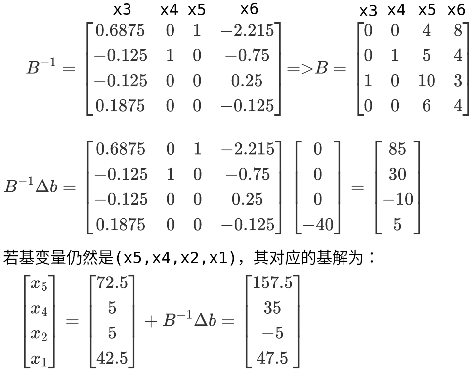
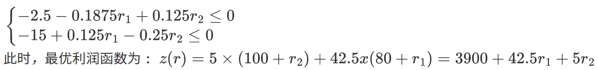

# 对偶线性规划问题

- 对偶问题（dual problem）每个线性规划问题都有一个与之对应的另一个线性规划问题。
- 原问题和对偶问题之间的对称关系：

1. 原问题的每个约束对应对偶问题的一个决策变量
2. 原问题为求极大（极小），则对偶问题为求极小（极大）
3. 原问题的目标函数系数对应于对偶问题的约束右边项，而原问题的约束右边项对应于对偶问题的目标函数系数
4. 原问题的系数矩阵和对偶问题的系数矩阵互为转置关系（X为列向量，而Y为行向量）
5. 原问题的约束条件方向上为小于等于，则对偶问题的约束条件方向上为大于等于

 

- 原问题的约束条件个数对应对偶问题的变量个数；原问题的变量个数对应对偶问题的约束条件个数。

- 约束条件的等价变换：（1）等号对应的对偶变量自由；（2）不符合标准的约束条件对应的对偶变量需要变换符号。

 

1. 原问题的最优目标函数值和对偶问题的最优目标函数值相等（z\* = w\*）
2. 原问题的最优解恰好对应对偶问题最终单纯形表的检验系数
3. 原问题最终单纯形表的检验系数乘以（-1）恰好对应对偶问题的最优解

- 对称性：对偶问题的对偶问题即为原问题
- 弱对偶性：若$\overline{X}$是原问题的任一可行解，$\overline{Y}$是对偶问题的任一可行解，则有C$\overline{X}$&le;$\overline{Y}$b
- 最优性：若$\widehat{X}$、$\widehat{Y}$分别是问题（P）和（D）的一个可行解，且满足C$\widehat{X}$=$\widehat{Y}$b，则它们分别是问题（P）和（D）的最优解。
- 最优对偶解：若B为原问题（P）的最优基，则$\widehat{Y}$=CBB-1是对偶问题（D）的最优解。
- 互补松弛性：若$\widehat{X}$、$\widehat{Y}$分别是如下标准形式的原问题和对偶问题的可行解，则$\widehat{X}$、$widehat{Y}$是两个问题的最优解的充分必要条件是$\widehat{Y}$XS=0 且 YS$\widehat{X}$ = 0

 

# 对偶单纯形法

- 单纯形法是在可行域的顶点（基可行解）上进行搜索；而对偶单纯形法是在可行域的外部（非基可行解）进行搜索，也就是对偶问题可行域的顶点（基可行解）上搜索。

# 线性规划的敏感性分析

## 约束右边项的敏感性分析

- 线性规划约束右边项（bi）发生变化（&Delta;b）时，问题的可行域发生变化，但目标函数及其等值线方向保持不变。
- 最终单纯形表中对应的约束方程式是在最初方程式的基础上左乘B-1得到的，可以直接从最终单纯形表中读出基阵的逆矩阵。

<table>
    <tr>
        <td colspan="3">cj&rarr;</td>
        <td>80</td>
        <td>100</td>
        <td>0</td>
        <td>0</td>
        <td>0</td>
        <td>0</td>
        <td></td>
    </tr>
    <tr>
        <td>CB</td>
        <td>基</td>
        <td>b</td>
        <td>x1</td>
        <td>x2</td>
        <td>x3</td>
        <td>x4</td>
        <td>x5</td>
        <td>x6</td>
        <td>&theta;i</td>
    </tr>
    <tr>
        <td>0</td>
        <td>x5</td>
        <td>72.5</td>
        <td>0</td>
        <td>0</td>
        <td>0.6875</td>
        <td>0</td>
        <td>1</td>
        <td>-2.125</td>
        <td></td>
    </tr>
    <tr>
        <td>0</td>
        <td>x4</td>
        <td>5</td>
        <td>0</td>
        <td>0</td>
        <td>-0.125</td>
        <td>1</td>
        <td>0</td>
        <td>-0.75</td>
        <td></td>
    </tr>
    <tr>
        <td>100</td>
        <td>x2</td>
        <td>5</td>
        <td>0</td>
        <td>1</td>
        <td>-0.125</td>
        <td>0</td>
        <td>0</td>
        <td>0.25</td>
        <td></td>
    </tr>
    <tr>
        <td>80</td>
        <td>x1</td>
        <td>42.5</td>
        <td>1</td>
        <td>0</td>
        <td>0.1875</td>
        <td>0</td>
        <td>0</td>
        <td>-0.125</td>
        <td></td>
    </tr>
    <tr>
        <td></td>
        <td></td>
        <td></td>
        <td>0</td>
        <td>0</td>
        <td>-2.5</td>
        <td>0</td>
        <td>0</td>
        <td>-15</td>
        <td></td>
    </tr>
</table>

 

- 将该基解带入原先的最终单纯形表：

<table>
    <tr>
        <td colspan="3">cj&rarr;</td>
        <td>80</td>
        <td>100</td>
        <td>0</td>
        <td>0</td>
        <td>0</td>
        <td>0</td>
        <td></td>
    </tr>
    <tr>
        <td>CB</td>
        <td>基</td>
        <td>b</td>
        <td>x1</td>
        <td>x2</td>
        <td>x3</td>
        <td>x4</td>
        <td>x5</td>
        <td>x6</td>
        <td>&theta;i</td>
    </tr>
    <tr>
        <td>0</td>
        <td>x5</td>
        <td>157.5</td>
        <td>0</td>
        <td>0</td>
        <td>0.6875</td>
        <td>0</td>
        <td>1</td>
        <td>-2.125</td>
        <td></td>
    </tr>
    <tr>
        <td>0</td>
        <td>x4</td>
        <td>35</td>
        <td>0</td>
        <td>0</td>
        <td>-0.125</td>
        <td>1</td>
        <td>0</td>
        <td>-0.75</td>
        <td></td>
    </tr>
    <tr>
        <td>100</td>
        <td>x2</td>
        <td>-5</td>
        <td>0</td>
        <td>1</td>
        <td>[-0.125]</td>
        <td>0</td>
        <td>0</td>
        <td>0.25</td>
        <td></td>
    </tr>
    <tr>
        <td>80</td>
        <td>x1</td>
        <td>47.5</td>
        <td>1</td>
        <td>0</td>
        <td>0.1875</td>
        <td>0</td>
        <td>0</td>
        <td>-0.125</td>
        <td></td>
    </tr>
    <tr>
        <td></td>
        <td></td>
        <td></td>
        <td>0</td>
        <td>0</td>
        <td>-2.5</td>
        <td>0</td>
        <td>0</td>
        <td>-15</td>
        <td></td>
    </tr>
</table>

- 判断非基可行解的检验数，显然需要继续换基迭代。

## 目标函数系数的敏感性分析

- 决策变量的目标函数发生变化只可能导致等值线的方向发生变化，并不影响到线性问题的可行域。只有各非基变量检验数均非正，最优解就不发生变化。

<table>
    <tr>
        <td colspan="3">cj&rarr;</td>
        <td>80+r1</td>
        <td>100+r2</td>
        <td>0</td>
        <td>0</td>
        <td>0</td>
        <td>0</td>
        <td></td>
    </tr>
    <tr>
        <td>CB</td>
        <td>基</td>
        <td>b</td>
        <td>x1</td>
        <td>x2</td>
        <td>x3</td>
        <td>x4</td>
        <td>x5</td>
        <td>x6</td>
        <td>&theta;i</td>
    </tr>
    <tr>
        <td>0</td>
        <td>x5</td>
        <td>157.5</td>
        <td>0</td>
        <td>0</td>
        <td>0.6875</td>
        <td>0</td>
        <td>1</td>
        <td>-2.125</td>
        <td></td>
    </tr>
    <tr>
        <td>0</td>
        <td>x4</td>
        <td>35</td>
        <td>0</td>
        <td>0</td>
        <td>-0.125</td>
        <td>1</td>
        <td>0</td>
        <td>-0.75</td>
        <td></td>
    </tr>
    <tr>
        <td>100+r2</td>
        <td>x2</td>
        <td>-5</td>
        <td>0</td>
        <td>1</td>
        <td>-0.125</td>
        <td>0</td>
        <td>0</td>
        <td>0.25</td>
        <td></td>
    </tr>
    <tr>
        <td>80+r1</td>
        <td>x1</td>
        <td>47.5</td>
        <td>1</td>
        <td>0</td>
        <td>0.1875</td>
        <td>0</td>
        <td>0</td>
        <td>-0.125</td>
        <td></td>
    </tr>
    <tr>
        <td></td>
        <td></td>
        <td></td>
        <td>0</td>
        <td>0</td>
        <td>-2.5-0.1875r1+0.125r2</td>
        <td>0</td>
        <td>0</td>
        <td>-15+0.125r1-0.25r2</td>
        <td></td>
    </tr>
</table>

 

