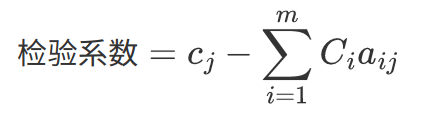
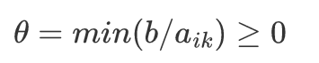

# 标准型

- 将一般线性规划问题转换为标准型：

1. 若目标函数求最小，可以将目标函数系数乘-1，等价为求最大。
2. 引入松弛变量和剩余变量作为初始基变量（单位矩阵）转换为标准型。松弛变量用于表示不足量；剩余变量用于表示剩余量。
3. 对于取值非正的决策变量xj，变量替换xj = -xj\'，（xj\' &ge;0）
4. 对于取值自由的决策变量xj，变量替换xj = xj\' - xj\'\'，（xj\' &ge;0， xj\'\' &ge;0）

 

# 解的性质

## 基本定理

1. 如果线性规划问题的可行域有界，则其最优值必可在某个顶点处获得。
2. 线性规划问题的基可行解X刚好对应于可行域的某个顶点。

# 单纯形表

 

1. 通过单位矩阵来确定初始基
2. 若非基变量的检验数全部非正（求最大的问题），则得到最优解；否则，执行下一步
3. 若存在某检验数λk大于零，则检查其对应的决策变量xk的列向量Pk，若Pk的所有元素均小于零，则该问题无有界最优解；否则执行下一步
4. 将最大非负检验数对应的决策变量作为入基变量（修改所在的行，使其和其他基向量满足单位矩阵），根据最小θ值确定出基变量，再执行第2步。

 

 

# 人工变量法

