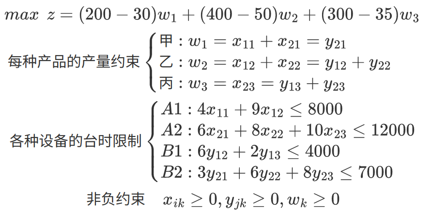

# 标准型与解的性质

## 标准型

- 将一般线性规划问题转换为标准型：

1. 若目标函数求最小，可以将目标函数系数乘-1，等价为求最大。
2. 引入松弛变量和剩余变量作为初始基变量（单位矩阵）转换为标准型。松弛变量用于表示不足量；剩余变量用于表示剩余量。
3. 对于取值非正的决策变量xj，变量替换xj = -xj\'，（xj\' &ge;0）
4. 对于取值自由的决策变量xj，变量替换xj = xj\' - xj\'\'，（xj\' &ge;0， xj\'\' &ge;0）

  

## 解的性质

1. 若线性规划问题的可行域有界，则其最优值必可在某个顶点处获得；若在两个顶点同时得到最优解，则它们连线上的任意一点都是最优解（无穷多最优解）。
2. 线性规划问题的基可行解X刚好对应于可行域的某个顶点。

  

# 线性规划问题的方法

## 单纯形表

 

1. 通过单位矩阵来确定初始基
2. 若非基变量的检验数全部非正（求最大的问题），则得到最优解；否则，执行下一步
3. 若存在某检验数&lambda;k大于零，则检查其对应的决策变量xk的列向量Pk，若Pk的所有元素均小于零，则该问题无有界最优解；否则执行下一步
4. 换基迭代：将最大非负检验数对应的决策变量作为入基变量（修改所在的行，使其和其他基向量满足单位矩阵），根据最小&theta;值确定出基变量，再执行第2步。

 

 

- 特殊情况：

1. 无穷多最优解：一般情况下，若换基迭代后，非基变量存在0通常可以（不绝对）推断无穷多最优解，而无穷多最优解必定非基变量存在0。
2. 退化解：换基迭代后的基变量不同，但最优解完全相同。
3. 对于求极小的问题，与求极大问题相反，检验数要求大于0，进基列的&theta;要求为最大的负数。

## 人工变量法

### 大M法

- 引入人工变量xn，对应的目标函数系数为M（无穷大）。若人工变量无法出基，则原问题无可行解。

### 两阶段法

# 线性规划对应的管理模型

## 合理利用线材

    
某工厂要做100套钢架，每套用长为2.9m、2.1m、1.5m的元钢各一根。已知每根原料长7.4m，问应如何下料，能在完成任务的前提下使用的原材料最省。

    1. 考虑以下几种套裁方案： 
    <table>
        <tr>
            <th rowspan="2">长度（m）</th>
            <th colspan="5">方案</th>
        </tr>
        <tr>
            <td>&#8544;</td>
            <td>&#8545;</td>
            <td>&#8546;</td>
            <td>&#8547;</td>
            <td>&#8548;</td>
        </tr>
        <tr>
            <td>2.9</td>
            <td>1</td>
            <td>2</td>
            <td></td>
            <td>1</td>
            <td></td>
        </tr>
        <tr>
            <td>2.1</td>
            <td>0</td>
            <td></td>
            <td>2</td>
            <td>2</td>
            <td>1</td>
        </tr>
        <tr>
            <td>1.5</td>
            <td>3</td>
            <td>1</td>
            <td>2</td>
            <td></td>
            <td>3</td>
        </tr>
        <tr>
            <th>合计</th>
            <td>7.4</td>
            <td>7.3</td>
            <td>7.2</td>
            <td>7.1</td>
            <td>6.6</td>
        </tr>
        <tr>
            <th>料头</th>
            <td>0</td>
            <td>0.1</td>
            <td>0.2</td>
            <td>0.3</td>
            <td>0.8</td>
        </tr>
    </table>
    2. 假定决策变量x1表示采用方案&#8544;的原料根数，x2表示采用方案&#8545;的原料根数，x3表示采用方案&#8546;的原料根数，x4表示采用方案&#8547;的原料根数，x5表示采用方案&#8548;的原料根数。 
    3. 建立线性规划的目标函数和约束条件： 
     
    4. 化为标准型： 
     
    5. 单纯形表：

## 生产安排

    

        某加工厂主要生产甲、乙、丙三种产品，都需要经过A、B两道加工工序。已知A工序可以在设备A1或A2上完成，B工序可以在设备B1或B2上完成。每种产品在每个设备上的加工时间和其他数据如表： 
        <table>
            <tr>
                <td rowspan="2">设备</td>
                <td colspan="3">产品</td>
                <td rowspan="2">设备有效台时</td>
            </tr>
            <tr>
                <td>甲</td>
                <td>乙</td>
                <td>丙</td>
            </tr>
            <tr>
                <td>A1</td>
                <td>4</td>
                <td>9</td>
                <td>/</td>
                <td>8000</td>
            </tr>
            <tr>
                <td>A2</td>
                <td>6</td>
                <td>8</td>
                <td>10</td>
                <td>12000</td>
            </tr>
            <tr>
                <td>B1</td>
                <td>/</td>
                <td>6</td>
                <td>2</td>
                <td>4000</td>
            </tr>
            <tr>
                <td>B2</td>
                <td>3</td>
                <td>6</td>
                <td>8</td>
                <td>7000</td>
            </tr>
            <tr>
                <td>原料费（元/件）</td>
                <td>30</td>
                <td>50</td>
                <td>35</td>
                <td></td>
            </tr>
            <tr>
                <td>售价（元/件）</td>
                <td>200</td>
                <td>400</td>
                <td>300</td>
                <td></td>
            </tr>
        </table>
    

    1. 假设决策变量xik表示利用设备Ai加工产品k的数量，yjk表示利用设备Bj加工产品k的数量，wk表示产品k的总加工数量（i=1,2、j=1,2、k=1,2,3）。 
    2. 列出目标函数和约束条件： 
     
    3. 解单纯形表

## 连续投资

    

        某人有10万元闲置资金，面临下列投资机会： 
        A：为期2年的定期存款，即每年年初投资，次年年末收回本金和利息，投资回报15%； 
        B：第3年初投资，到第5年年末收回本金和利息，投资回报25%，最大投资额4万元； 
        C：第2年初投资，到第5年年末收回本金和利息，投资回报40%，最大投资额3万元； 
        D：为期1年的定期存款，即每年年初投资，年末收回本金和利息，投资回报6%； 
        问：应该如何搭配投资组合，使得五年末总资产最大化？
    

    1. 假设决策变量：xik表示第i年初投资项目k的资金数（单位：万元）。根据A、B、C、D四个项目的投资时间表，得到如下11个决策变量： 
    <table>
        <tr>
            <td>项目</td>
            <td>第1年</td>
            <td>第2年</td>
            <td>第3年</td>
            <td>第4年</td>
            <td>第5年</td>
        </tr>
        <tr>
            <td>A</td>
            <td>x1A</td>
            <td>x2A</td>
            <td>x3A</td>
            <td>x4A</td>
            <td></td>
        </tr>
        <tr>
            <td>B</td>
            <td></td>
            <td></td>
            <td>x3B</td>
            <td></td>
            <td></td>
        </tr>
        <tr>
            <td>C</td>
            <td></td>
            <td>x2C</td>
            <td></td>
            <td></td>
            <td></td>
        </tr>
        <tr>
            <td>D</td>
            <td>x1D</td>
            <td>x2D</td>
            <td>x3D</td>
            <td>x4D</td>
            <td>x5D</td>
        </tr>
    </table>
    2. 目标函数和约束条件的模型： 
    

## 现金流管理

    

        某工厂的回款主要集中在每年的年中和年末。已知该厂下一年度每月的现金流(单位：万元)如表所示；其中现金流为负表示公司要支出相应的金额，现金流为正则表示公司要回收相应的款项。假设所有现金流都发生在月中。为了应付现金流的需求，该厂可能需要借助于银行借款。 有两种方式：（1）为期一年的长期借款，即于上一年年末借一年期贷款，一次得到全部贷款额，从下一年度1月起每月末偿还1%的利息，于12月底偿还本金和最后一期；（2）为期一个月的短期借款，即可以每月初获得短期贷款，于当月底偿还本金和利息，假设月利率为1.4%。当该厂有多余现金时，也可以以短期存款的方式获取部分利息收入。假设该厂只能每月初存入，月末取出，月息0.4%。 
        如果将每个月的月末和下月月初看作同一时间点，已知工厂在1月初持有资金5万元，请问该厂应如何进行存贷款操作来管理现金流？ 
        <table>
            <tr>
                <td>月份</td>
                <td>1</td>
                <td>2</td>
                <td>3</td>
                <td>4</td>
                <td>5</td>
                <td>6</td>
                <td>7</td>
                <td>8</td>
                <td>9</td>
                <td>10</td>
                <td>11</td>
                <td>12</td>
            </tr>
            <tr>
                <td>现金流</td>
                <td>-8</td>
                <td>-7</td>
                <td>-12</td>
                <td>-4</td>
                <td>-1</td>
                <td>4</td>
                <td>10</td>
                <td>-5</td>
                <td>-4</td>
                <td>-10</td>
                <td>10</td>
                <td>45</td>
            </tr>
        </table>
    

    1. 定义决策变量：x = 为期一年的长期借款金额；yi = 第i月初的短期借款金额；si = 第i月初的短期存款金额（i=1,...,12） 
    2. 目标函数和约束条件： 
    

## 排班问题

    

        某昼夜服务的公交线路每天各时间区段内所需司机和乘务人员数如表： 
        <table>
            <tr>
                <td>班次</td>
                <td colspan="2">时间</td>
                <td>所需人数</td>
            </tr>
            <tr>
                <td>1</td>
                <td>06:00</td>
                <td>10:00</td>
                <td>60</td>
            </tr>
            <tr>
                <td>2</td>
                <td>10:00</td>
                <td>14:00</td>
                <td>70</td>
            </tr>
            <tr>
                <td>3</td>
                <td>14:00</td>
                <td>18:00</td>
                <td>60</td>
            </tr>
            <tr>
                <td>4</td>
                <td>18:00</td>
                <td>22:00</td>
                <td>50</td>
            </tr>
            <tr>
                <td>5</td>
                <td>22:00</td>
                <td>02:00</td>
                <td>20</td>
            </tr>
            <tr>
                <td>6</td>
                <td>02:00</td>
                <td>06:00</td>
                <td>30</td>
            </tr>
        </table>
        设司机和乘务人员分别在各时间区段一开始时上班，并连续工作8小时，问该公交线路至少需要配备多少名司机和乘务人员。
    

