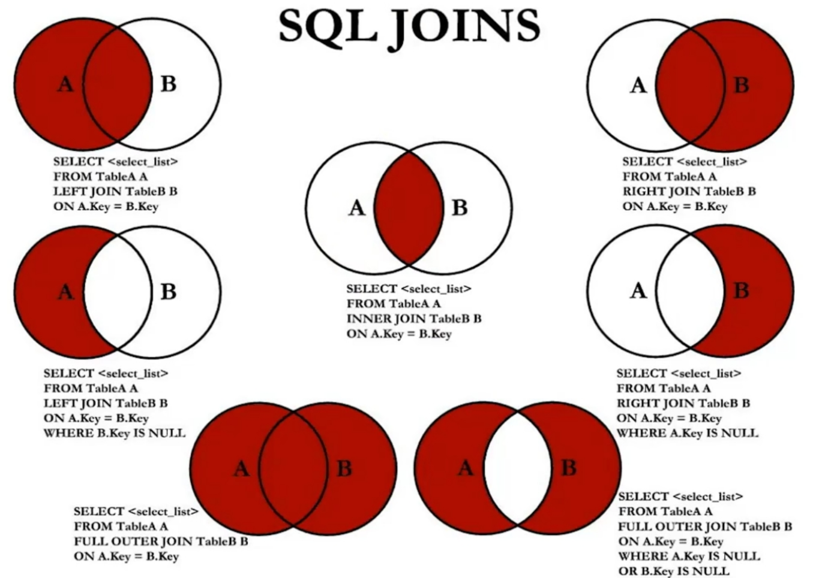
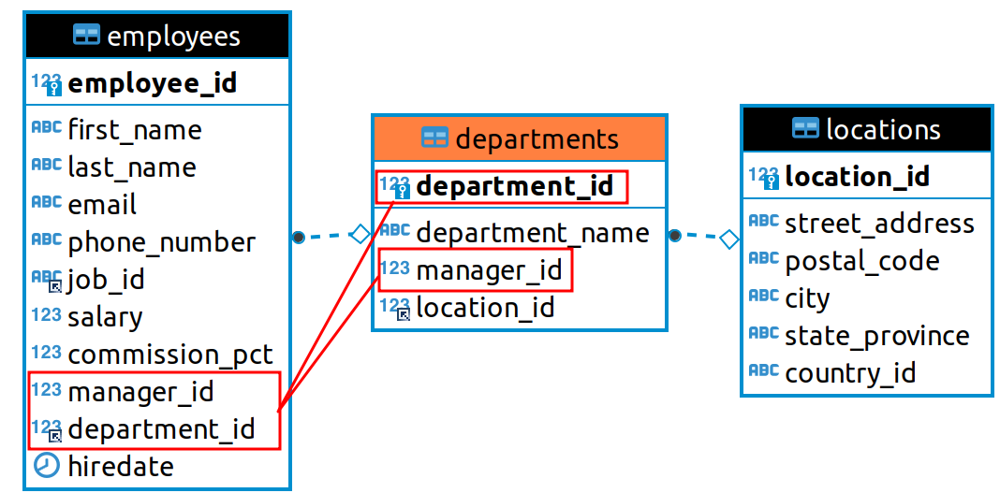

# insert

## insert into 插值

```mysql
insert into 表名(字段名, 字段名)
values
('数据',123),
('数据',123);
```

<table>
    <tr>
        <td rowspan="3" width="20%">表名(字段名, 字段名)</td>
        <td>若只给出表名，则需要严格按照表中的字段顺序来插入数据</td>
    </tr>
    <tr>
        <td>若只给出部分字段名，则按照给出的字段顺序来插入数据，未给出的字段则视为null；但如果违背了约束，则将插入失败</td>
    </tr>
    <tr>
        <td>若给出了全部字段名，则按照给出的字段顺序来插入数据</td>
    </tr>
    <tr>
        <td rowspan="4">values(数据, 数据,..)</td>
        <td>允许进行数据的多行插入，插入的规则如上所述</td>
    </tr>
    <tr>
        <td>日期类型的数据需要按照指定的格式和单引号（<code>'yyyy-mm-dd'</code>）插入</td>
    </tr>
    <tr>
        <td>字符类型的数据需要按照单引号（<code>'str'</code>）插入</td>
    </tr>
    <tr>
        <td>数字类型的数据可以直接插入（<code>123</code>）</td>
    </tr>
</table>

## load 外部文件导入

```mysql
load data local infile '/path/demo.txt' into table 表名
lines terminated by '行终止符';
```

> 行终止符：Linux和Windows使用`\r\n`；而macOS使用`\r`

- `demo.txt`文件中的每一行对应表的一行数据；每个字段之间以制表符`\t`分隔，且必须严格按照表中字段的顺序；对于null则使用`\N`来表示

```
Whistler        Gwen    bird    \N      1997-12-09      \N
```

# select

## select 查询

```mysql
select 字段
[from 数据源]
[where 谓词]
[order by 排序字段,排序字段 asc|desc]
[limit 偏移量,记录数] | [limit 记录数 offset 偏移量]
```

<table>
    <tr>
        <td>select 字段</td>
        <td>需要查询的字段，允许通过<code>*</code>选择所有字段</td>
    </tr>
    <tr>
        <td>from 数据源</td>
        <td>数据源可以是表、子查询等；若不需要数据源，则可以忽略，或使用<code>dual</code></td>
    </tr>
    <tr>
        <td>where 谓词</td>
        <td>查询条件</td>
    </tr>
    <tr>
        <td rowspan="2">order by</td>
        <td>指定字段排序，可以指定多个字段依次进行多级排序</td>
    </tr>
    <tr>
        <td>默认以升序排序<code>asc</code>（ascending），可选降序<code>desc</code>（descending）</td>
    </tr>
    <tr>
        <td>limit n</td>
        <td>限定只要前n行数据</td>
    </tr>
</table>

### as 别名

- `as`（或 `alias`）设置对象的别名，可省略`as`。对于特殊的要求可以使用`""`来设置别名。

```mysql
select name 
from employee e
where e.name = 'Tom';
```

- `select`子句中定义的属性别名不能使用在`where`子句中，否则`ERROR 1054 (42S22): Unknown column 'xxx' in 'where clause'`。这与MySQL数据库解析查询语句时的顺序有关（`from -> where -> select`）。
- 如果给某个关系设置了别名，则在之后的子句中必须使用该别名，而不能使用原来的关系名；相当于别名替代了在当前语句中的这个被使用的关系名。（当然可以另外再引入该关系以使用该关系名，但这个再引入的关系已经和使用别名的关系区分开来了）

## 谓词与运算符

- 对于运算符的使用尤其要注意空值[null](#null)的处理。

### null 空值处理

- <code><span name="null">null</span></code>：缺失的未知值

<table>
    <tr>
        <th width="20%">使用null值</th>
        <th width="80%" colspan="2">结果</th>
    </tr>
    <tr>
        <td>is [not] null</td>
        <td colspan="2">正确的结果</td>
    </tr>
    <tr>
        <td rowspan="3">算术比较符</td>
        <td colspan="2">除了<code>&lt;=&gt;</code>，与null的任何算术比较的结果只会是null</td>
    </tr>
    <tr>
        <td rowspan="2"><code>&lt;=&gt;可以对null进行比较</code></td>
        <td>两边均为null时，返回1</td>
    </tr>
    <tr>
        <td>一边为null时，返回0</td>
    </tr>
    <tr>
        <td rowspan="2">布尔运算 and or</td>
        <td><code>0 and null</code>：0</td>
        <td><code>1 and null</code>：null</td>
    </tr>
    <tr>
        <td><code>0 or null</code>：null</td>
        <td><code>1 or null</code>：1</td>
    </tr>
    <tr>
        <td>order by</td>
        <td colspan="2">在<code>asc</code>排序下，null优先显示；而<code>desc</code>相反</td>
    </tr>
</table>

### 算术运算符

### 比较运算符

#### 简单比较

<table>
    <tr>
        <th width="10%">运算符</th>
        <th width="10%">意义</th>
        <th width="80%">描述</th>
    </tr>
    <tr>
        <td>=</td>
        <td>等于</td>
        <td>判断两个值/字符串/表达式是否相等</td>
    </tr>
    <tr>
        <td rowspan="2">&lt;=&gt;</td>
        <td rowspan="2">安全等于</td>
        <td>安全地判断两个值/字符串/表达式是否相等</td>
    </tr>
    <tr>
        <td><b><code>&lt;=&gt;</code>可以对null比较。两边均为null时（isnull），返回1；一边为null时，返回0</b></td>
    </tr>
    <tr>
        <td>&lt;&gt;<br/>!=</td>
        <td>不等</td>
        <td>判断两个值/字符串/表达式是否不等</td>
    </tr>
    <tr>
        <td>&lt;</td>
        <td>小于</td>
        <td>判断符号前面的值/字符串/表达式是否小于后面的值/字符串/表达式</td>
    </tr>
    <tr>
        <td>&lt;=</td>
        <td>小于</td>
        <td>判断符号前面的值/字符串/表达式是否小于等于后面的值/字符串/表达式</td>
    </tr>
    <tr>
        <td>&gt;</td>
        <td>大于</td>
        <td>判断符号前面的值/字符串/表达式是否大于后面的值/字符串/表达式</td>
    </tr>
    <tr>
        <td>&gt;=</td>
        <td>大于等于</td>
        <td>判断符号前面的值/字符串/表达式是否大于等于后面的值/字符串/表达式</td>
    </tr>
</table>

- 以上进行比较运算时的规则：

1. 如果运算符两边都为字符串，则MySQL会按照字符串的[字符集](./character.md)来进行比较。
2. 如果运算符两边都是整数（数字），则MySQL会按照整数（数字）来进行比较。
3. 如果运算符一边是数字，一边是字符串，则MySQL会把字符串转换为数字进行比较。
4. 除了`<=>`外，其余比较运算符对null的比较结果始终为null。

#### 复杂比较

<table>
    <tr>
        <th width="20%">运算符</th>
        <th width="15%">意义</th>
        <th width="65%">描述</th>
    </tr>
    <tr>
        <th colspan="3">空值判断</th>
    </tr>
    <tr>
        <td>is null<br />isnull</td>
        <td>为空</td>
        <td>判断值/字符串/表达式是否为空</td>
    </tr>
    <tr>
        <td>is not null</td>
        <td>不为空</td>
        <td>判断值/字符串/表达式是否不为空</td>
    </tr>
    <tr>
        <th colspan="3">值比较</th>
    </tr>
    <tr>
        <td>least</td>
        <td>最小值</td>
        <td>在多个值（字符串）中返回最小值</td>
    </tr>
    <tr>
        <td>greatest</td>
        <td>最大值</td>
        <td>在多个值（字符串）中返回最大值</td>
    </tr>
    <tr>
        <td>between and</td>
        <td>两值之间</td>
        <td>判断一个值是否在两个值之间</td>
    </tr>
    <tr>
        <td>not between and</td>
        <td>不在两值之间</td>
        <td>判断一个值是否不在两个值之间</td>
    </tr>
    <tr>
        <th colspan="3">存在</th>
    </tr>
    <tr>
        <td>in</td>
        <td>属于</td>
        <td>判断一个值是否存在于集合</td>
    </tr>
    <tr>
        <td>not in</td>
        <td>不属于</td>
        <td>判断一个值是否不存在于集合</td>
    </tr>
    <tr>
        <th colspan="3">匹配</th>
    </tr>
    <tr>
        <td>like</td>
        <td>模式匹配</td>
        <td>判断一个值是否符合匹配模式</td>
    </tr>
    <tr>
        <td>regexp</td>
        <td>正则表达式</td>
        <td>判断一个值是否符合正则表达式的规则</td>
    </tr>
    <tr>
        <td>rlike</td>
        <td>正则表达式</td>
        <td>判断一个值是否符合正则表达式的规则</td>
    </tr>
</table>

##### like 模式匹配

- `like`：模式匹配

<table>
    <tr>
        <td rowspan="2" width="10%"><code>[not] like</code></td>
        <td width="80%"><code>_</code>匹配任何单个字符</td>
    </tr>
    <tr>
        <td><code>%</code>匹配任意数量字符</td>
    </tr>
    <tr>
        <td>regexp_like()</td>
        <td rowspan="3">正则扩展</td>
    </tr>
    <tr>
        <td>regexp</td>
    </tr>
    <tr>
        <td>rlike</td>
    </tr>
</table>

```mysql
select name from sys_menu where regexp_like(name, '^..管理');
```

#### 类型转换

- 类型转换（type conversion）：当运算符与不同类型的操作数一起使用时，会发生类型转换以使操作数兼容，有些转换是隐式发生的。

##### 不同类型之间的比较

<table>
    <tr>
        <th width="30%">参数情况</th>
        <th width="70%">是否转换</th>
    </tr>
    <tr>
        <td>一个或两个参数是null</td>
        <td>除了&lt;=&gt;运算符外，所有的比较结果都是null</td>
    </tr>
    <tr>
        <td>两个参数都是字符串</td>
        <td>作为字符串进行比较</td>
    </tr>
    <tr>
        <td>两个参数都是整数</td>
        <td>作为整数进行比较</td>
    </tr>
    <tr>
        <td>十六进制值如果不与数字比较</td>
        <td>Hexadecimal values are treated as binary strings if not compared to a number.<br/>十六进制值被视为二进制字符串来进行比较</td>
    </tr>
    <tr>
        <td rowspan="2">一个参数是<code>TIMESTAMP</code>或<code>DATETIME</code>类型，而另一个参数是常量</td>
        <td>在执行比较之前，该常量将转换为时间戳</td>
    </tr>
    <tr>
        <td>This is not done for the arguments to IN().<br/>如果是<code>IN()</code>相关的参数，则不会进行转换</td>
    </tr>
    <tr>
        <td>一个参数是十进制值</td>
        <td>比较取决于另一个参数。如果另一个参数是十进制值或整数值，则将参数作为十进制值进行比较；如果另一个参数是浮点值，则将参数作为浮点值进行比较</td>
    </tr>
    <tr>
        <td>所有其他情况下</td>
        <td>参数作为浮点（双精度）数字进行比较。例如，字符串和数字操作数的比较是浮点数的比较</td>
    </tr>
</table>

###### <span name="浮点数的精确度问题">浮点数的精确度问题</span>

- 当从字符串到浮点以及从整数到浮点的转换发生时，它们不一定以相同的方式发生。整数可以由CPU转换为浮点数，而字符串在涉及浮点乘法的操作中逐位转换。此外，结果可能会受到计算机体系结构或编译器版本或优化级别等因素的影响。
- 由于浮点数和`INTEGER`类型的大值之间的比较是近似值，因此出现如下两个查询的结果都是1（正确）的情况：

```mysql
SELECT '9223372036854775807' = 9223372036854775807;
        -> 1
SELECT '9223372036854775807' = 9223372036854775806;
        -> 1
```

```mysql
-- 避免字符串隐式转换为浮点数，而是指定转换为无符号数
SELECT CAST('9223372036854775807' AS UNSIGNED) = 9223372036854775806;
        -> 0
```

###### dtoa库提供的转换

- `dtoa` 库提供具有以下属性的转换。 `D` 表示具有 `DECIMAL` or 字符串表示形式的值，并以 `F` 本机二进制 （IEEE） 格式表示浮点数。

<table>
    <tr>
        <td width="10%">F&rarr;D</td>
        <td width="90%">conversion is done with the best possible precision, returning D as the shortest string that yields F when read back in and rounded to the nearest value in native binary format as specified by IEEE.<br/>转换以尽可能高的精度完成，当读入并四舍五入到IEEE指定的本机二进制格式中最接近的值时，返回D作为返回F的最短字符串</td>
    </tr>
    <tr>
        <td>F&rarr;D</td>
        <td>conversion is done such that F is the nearest native binary number to the input decimal string D.<br/>使F是最接近输入十进制字符串D的本机二进制数</td>
    </tr>
</table>

1. F&rarr;D&rarr;F是无损的，除非F是带有符号的（`-inf` 、 `+inf`）或者是无效值（NaN）。
2. D&rarr;F&rarr;D，无损的充分条件是 `D` 使用 15 位或更少的精度，不是正态值、 `-inf` 、 `+inf` 或 `NaN` 。尽管在某些情况下，即使 `D` 精度超过 15 位，转换也是无损的，但情况并非总是如此。

- 将数值或时态值隐式转换为字符串会生成一个值，该值具有由 `character_set_connection` 和 `collation_connection` 系统变量确定的字符集和排序规则。这意味着，这样的转换将产生字符（非二进制）字符串（CHAR、VARCHAR或LONGTEXT值），除非连接字符集被设置为二进制。在这种情况下（二进制），转换结果是一个二进制字符串（binary、VARBINARY或LONGBLOB值）。

- 对于整数表达式，其生成的值的类型（INT、BIGINT）取决于表达式（值）的长度。如果长度没有超过INT的范围，则类型为INT；如果长度超过INT的范围，则类型为BIGINT。

```mysql
-- 如下生成的类型是BIGINT
CREATE TABLE t SELECT 000000000000000000000;

mysql> desc t;
+-----------------------+--------+------+-----+---------+-------+
| Field                 | Type   | Null | Key | Default | Extra |
+-----------------------+--------+------+-----+---------+-------+
| 000000000000000000000 | bigint | NO   |     | 0       |       |
+-----------------------+--------+------+-----+---------+-------+
```

##### 时态类型之间的转换

##### JSON值的比较

- JSON值的比较在两个级别进行：第一级比较基于比较值的JSON类型。如果类型不同，则比较结果仅由哪种类型具有更高的优先级来确定。如果这两个值具有相同的 JSON 类型，则使用特定于类型的规则进行第二级比较。
- 比较JSON值和非 JSON值，会将非JSON值转换为JSON，并将值作为JSON值进行比较。

> Comparison of JSON values takes place at two levels. The first level of comparison is based on the JSON types of the compared values. If the types differ, the comparison result is determined solely by which type has higher precedence. If the two values have the same JSON type, a second level of comparison occurs using type-specific rules. For comparison of JSON and non-JSON values, the non-JSON value is converted to JSON and the values compared as JSON values. For details, see [Comparison and Ordering of JSON Values](https://dev.mysql.com/doc/refman/8.0/en/json.html#json-comparison).


### 逻辑运算符

<table>
    <tr>
        <th colspan="2">运算符</th>
        <th width="80%">意义</th>
    </tr>
    <tr>
        <td width="10%">not</td>
        <td width="10%">!</td>
        <td>逻辑非</td>
    </tr>
    <tr>
        <td>and</td>
        <td>&amp;&amp;</td>
        <td>逻辑与</td>
    </tr>
    <tr>
        <td>or</td>
        <td>||</td>
        <td>逻辑或</td>
    </tr>
    <tr>
        <td colspan="2">xor</td>
        <td>逻辑异或</td>
    </tr>
</table>

### 位运算符

<table>
    <tr>
        <th width="10%">运算符</th>
        <th width="90%">按位进行的操作</th>
    </tr>
    <tr>
        <td>&amp;</td>
        <td>与</td>
    </tr>
    <tr>
        <td>|</td>
        <td>或</td>
    </tr>
    <tr>
        <td>^</td>
        <td>异或</td>
    </tr>
    <tr>
        <td>~</td>
        <td>取反</td>
    </tr>
    <tr>
        <td>&gt;&gt;</td>
        <td>右移</td>
    </tr>
    <tr>
        <td>&lt;&lt;</td>
        <td>左移</td>
    </tr>
</table>
## 排序与筛选

### order by 排序

- `order by`：指定字段（或表达式）排序，可以指定多个字段依次进行多级排序。默认以升序排序asc（ascending），可选降序desc（descending）。
- `order by`使用的排序字段可以不在select子句中出现。

```mysql
# 按员工名称的长度来排序 asc
select name
from employee
order by length(name) asc;
```

### distinct 去重

- `distinct`关键字会自动对排在其之后的所有属性的值进行检查，从而去除具有重复属性值的元组，只保留唯一属性值的元组。

```mysql
# 对name和salary去重
select distinct name,salary
from employee;
```

### limit 分页

- `limit`：根据偏移量（\_offset）和每页最大记录数（page\_size）对查询进行分页，`limit _offset,page_size`。其中，`_offset = (page_no - 1) * page_size`，page\_no从1开始。
- `limit`的偏移量也可通过`offset`来指定，`limit p offset o`。
- `limit`子句必须放在查询语句的最后一句。

```mysql
# 分页查询员工信息，偏移量为0，每页最多20行
select *
from employees
limit 0,20;

select *
from employees
limit 20 offset 0;
```

## 关系结果集处理

- 在对多个表的结果集进行处理时，这些表对应的列数和数据类型必须相同，并且相互对应；各个select语句之间通过相应的运算符/关键字分隔。

<table>
    <tr>
        <td width="20%">union</td>
        <td width="80%">返回两个查询的结果集的并集，同时去除重复记录</td>
    </tr>
    <tr>
        <td>union all</td>
        <td>返回两个查询的结果集的并集，不进行去重操作，因此效率高于union</td>
    </tr>
</table>


## join 连接

- 如果查询语句中出现了在多个关系中同名的属性，则必须通过`关系.属性名`指明属性所在的关系。

- MySQL支持SQL99 `join .. on`；但不支持SQL92 连接符`(+)`。

```mysql
# 左外连接，使用空值来额外返回department表中不满足连接条件的行，以满足employee表中存在的行
select employee_id, department_name
from employees e
	left join departments d on e.department_id = d.department_id;
```

### 笛卡尔积 cross join

- 笛卡尔积（cross join，交叉连接）：将任意几个关系的所有元组进行相互拼接。
- 虽然笛卡尔积在某些特殊情况下是有用的，但大多数情况下，可以通过在`where子句`或`join`子句中设置连接条件来避免交叉连接。因为在一般情况下，出现笛卡尔积是不应该的错误。

```mysql
# 交叉连接
select *
from employee, department;

select *
from employee
  cross join department;
```

### 等值连接、非等值连接

```mysql
# 等值连接
select e.name, d.department_id
from employee e, department d
where e.department_id = d.department_id;

select e.name, d.department_id
from employee e 
	join department d on e.department_id = d.department_id;

# 非等值连接
select e.name, e.salary
from employee e, job_grades j
where e.salary between j.least_sal and j.greatest_sal;

select e.name, e.salary
from employee e 
	join job_grades j on e.salary between j.least_sal and j.greatest_sal;
```

### 自连接、非自连接

- 自连接：将关系与其自身进行连接，从而获得一些想要的数据。

```mysql
# 通过自连接，查看员工对应的管理者信息
select emp.employee_id, emp.name, mgr.employee_id, mgr.name
from employee emp, employee mgr
where emp.manager_id = mgr.employee_id;

select emp.employee_id, emp.name, mgr.employee_id, mgr.name
from employee emp
	join employee mgr on emp.manager_id = mgr.employee_id;
```

### 内连接、外连接

<table>
    <tr>
        <td width="10%" rowspan="2">内连接</td>
        <td width="90%">合并具有同一字段的多个表的行，结果集中不包含一个表与另一个表不匹配的行（没有特殊指定外连接的基本都是内连接）</td>
    </tr>
    <tr>
        <td><code>[inner] join</code></td>
    </tr>
    <tr>
        <td rowspan="2">外连接</td>
        <td>合并具有同一字段的多个表的行，结果集中除了包含一个表与另一个表匹配的行之外，还包含不匹配的行（左外连接、右外连接、满外连接）</td>
    </tr>
    <tr>
        <td><code>left|right [outer] join</code>。MySQL不支持满外连接（全连接）</td>
    </tr>
</table>

<table>
    <tr>
        <td width="10%" rowspan="2">左外连接</td>
        <td width="90%">两个表在连接过程中除了返回满足连接条件的行以外还返回左表中不满足连接条件的行</td>
    </tr>
    <tr>
        <td>左外连接，使用空值null来额外返回右表中不满足连接条件的行，以满足左表中存在的行，使得左表中的所有行都能够被显示</td>
    </tr>
    <tr>
        <td rowspan="2">右外连接</td>
        <td>两个表在连接过程中除了返回满足连接条件的行以外还返回右表中不满足连接条件的行</td>
    </tr>
    <tr>
        <td>右外连接，使用空值null来额外返回左表中不满足连接条件的行，以满足右表中存在的行，使得右表中的所有行都能够被显示</td>
    </tr>
    <tr>
        <td>满外连接</td>
        <td>MySQL不支持满外连接（全连接），两个表在连接过程中除了返回满足连接条件的行以外还返回两表中不满足连接条件的行</td>
    </tr>
</table>
 

```mysql
# 左外连接
select employee_id, department_name 
from employees e 
	left join departments d on e.department_id = d.department_id;
+-------------+-----------------+
| employee_id | department_name |
+-------------+-----------------+
|         178 | NULL            |
|         200 | Adm             |
|         201 | Mar             |
|         205 | Acc             |
|         206 | Acc             |
+-------------+-----------------+

# 右外连接
select employee_id, department_name
from employees e 
	right join departments d on e.department_id = d.department_id;
	
+-------------+-----------------+
| employee_id | department_name |
+-------------+-----------------+
|         200 | Adm             |
|         201 | Mar             |
|        NULL | Ret             |
|        NULL | Rec             |
|        NULL | Pay             |
+-------------+-----------------+
```

### 自然连接 natural join

- `natural join`（自然连接）是SQL99提供的语法标准，会自动通过两个连接表中的<b>所有相同字段</b>来进行等值连接。

 

```mysql
# 通过自然连接来查询employee和department
select employee_id, department_name
from employees 
	natural join departments;

# 结果集相当于如下查询：
select employee_id, department_name
from employees e
	join departments d on e.department_id = d.department_id
		and e.manager_id = d.manager_id;
```

### using join 同名连接

- `using join`（同名连接）是SQL99提供的语法标准，必须搭配`join`使用，通过使用`using`来指定数据表里的<b>同名字段</b>（可以指定多个）进行等值连接。

```mysql
select employee_id, department_name
from employees 
	join departments using (department_id);
	
select employee_id, department_name
from employees 
	join departments using (department_id, manager_id);
```

## [内置函数](./内置函数.md)

<table>
    <tr>
        <td width="15%"><code>count()</code></td>
        <td width="85%">计算行数，间接地表示某种类型的数据在表中出现的频率</td>
    </tr>
    <tr>
        <td><code>max()</code></td>
        <td>列的最大值</td>
    </tr>
    <tr></tr>
</table>

## group by

# update

```mysql
update 表
set 要更新的字段名=新数据
where 谓词
```

# delete

