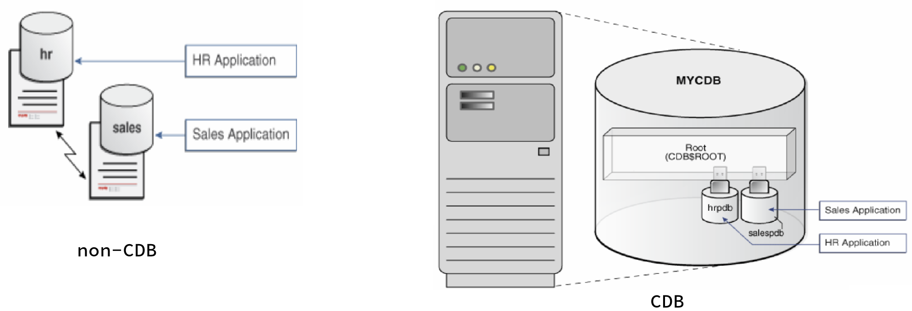
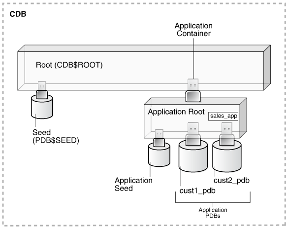
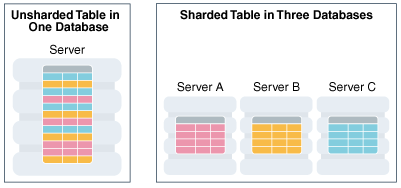

# RDBMS 关系数据库

## DBMS 数据库管理系统

- A <b>database management system (DBMS)</b> is software that controls the storage, organization, and retrieval of data.

<table>
    <caption>DBMS具有的元素</caption>
    <tr>
        <td width="25%">Kernal code （内核代码）</td>
        <td width="75%">管理DBMS的内存和存储</td>
    </tr>
    <tr>
        <td>Repository of metadata （元数据存储库）</td>
        <td>也就是 数据字典（data dictionary）</td>
    </tr>
    <tr>
        <td>Query language （查询语言）</td>
        <td>使应用程序能够访问数据</td>
    </tr>
</table>

- A <b>database application</b> is a software program that interacts with a database to access and manipulate data.

<table>
    <caption>第一代DBMS的类型</caption>
    <tr>
        <td width="10%">Hierarchical</td>
        <td width="90%">A <b>hierarchical database（分层数据库）</b> organizes data in a tree structure. Each parent record has one or more child records (one-to-many), similar to the structure of a file system.</td>
    </tr>
    <tr>
        <td>Network</td>
        <td>A <b>network database（网络数据库）</b> is similar to a hierarchical database, except records have a many-to-many rather than a one-to-many relationship.</td>
    </tr>
</table>

## Relational Model 关系模型

- A <b>relational database</b> is a database that conforms to <b>the relational model</b>.

<table>
    <tr>
        <td width="25%">Structures 数据库结构</td>
        <td width="75%">Well-defined objects store or access the data of a database.</td>
    </tr>
    <tr>
        <td>Operations 数据库操作</td>
        <td>Clearly defined actions enable applications to manipulate the data and structures of a database.</td>
    </tr>
    <tr>
        <td>Integrity rules 完整性规则</td>
        <td>Integrity rules govern operations on the data and structures of a database.</td>
    </tr>
</table>

- A relational database stores data in a set of simple relations. A relation is a set of tuples. A tuple is an unordered set of attribute values.
- A table is a two-dimensional representation of a relation in the form of <b>rows (tuples)</b> and <b>columns (attributes)</b>. Each row in a table has the same set of columns. A relational database is a database that stores data in <b>relations (tables)</b>. 

## RDBMS 关系数据库管理系统

- Relational Database Management System (<b>RDBMS</b>，关系数据库管理系统): The relational model is the basis for a relational database management system (RDBMS). An RDBMS moves data into a database, stores the data, and retrieves it so that applications can manipulate it.
- An RDBMS distinguishes between the following types of operations:

<table>
    <tr>
        <td width="20%">Logical operations 逻辑操作</td>
        <td width="80%">In this case, an application specifies what content is required.</td>
    </tr>
    <tr>
        <td>Physical operations 物理操作</td>
        <td>In this case, the RDBMS determines how things should be done and carries out the operation. The RDBMS stores and retrieves data so that physical operations are <b>transparent</b> to database applications. （物理操作对数据库应用程序是透明的）</td>
    </tr>
</table>

## Oracle Database

- <b>Oracle Database</b> is an <b>RDBMS</b>. An RDBMS that implements object-oriented features such as user-defined types(用户定义类型), inheritance(继承性), and polymorphism(多态性) is called an <b>object-relational database management system (ORDBMS)</b>. Oracle Database has extended the relational model to an object-relational model, making it possible to store complex business models in a relational database.

# Schema Objects 模式对象

- One characteristic of an RDBMS is the independence of physical data storage from logical data structures.（RDBMS的物理数据存储独立于逻辑数据结构）
- In Oracle Database, a <b>database schema</b> is a collection of logical data structures, or schema objects. A database user owns a database schema, which has the same name as the user name.（数据库用户拥有与用户名同名的数据库架构）

1. <b>Schema objects</b> are user-created structures that directly refer to the data in the database. The database supports many types of schema objects, the most important of which are <b>tables and indexes</b>.（模式中的对象通常包括表、索引、数据类型、序列、视图、存储过程、主键、外键等等）
2. A schema object is <b>one type of database object</b>. Some database objects, such as profiles and roles, do not reside in schemas.（模式对象&sube;数据库对象）

### Tables 表

- You define a table with a table name and set of columns. In general, you give each column a name, a data type, and a width when you create the table.
- A table is a set of rows. A column identifies an attribute of the entity described by the table, whereas a row identifies an instance of the entity. 
- You can optionally specify a rule, called an <b>integrity constraint（完整性约束）</b>, for a column. 

### Indexes 索引

- An <b>index</b> is an optional data structure that you can create on one or more columns of a table. Indexes can increase the performance of data retrieval.

1. When processing a request, the database can use available indexes to locate the requested rows efficiently. Indexes are useful when applications often query a specific row or range of rows.
2. Indexes are logically and physically independent of the data. 

# Data Access 数据访问

## Structured Query Language (SQL)

- Structured Query Language （SQL，结构化查询语言）is a set-based declarative language that provides an interface to an RDBMS such as Oracle Database. 

1. SQL is nonprocedural and describes *what* should be done.
2. SQL is the <b>ANSI</b> standard language for relational databases. All operations on the data in an Oracle database are performed using SQL statements. 
3. SQL statements enable you to perform the following tasks:
   1. Query data
   2. Insert, update, and delete rows in a table
   3. Create, replace, alter, and drop objects
   4. Control access to the database and its objects
   5. Guarantee database consistency and integrity

## PL/SQL and Java

- <b>PL/SQL</b> is a procedural extension to Oracle SQL and integrated with Oracle Database.
- A primary benefit of PL/SQL is the ability to <b>store application logic in the database itself</b>. A PL/SQL procedure or function is a schema object that consists of a set of SQL statements and other PL/SQL constructs, grouped together, stored in the database, and run as a unit to solve a specific problem or to perform a set of related tasks. The principal benefit of <b>server-side programming</b> is that built-in functionality can be deployed anywhere.
-  <b>Oracle Database can alsostore program units written in Java</b>. A Java stored procedure is a Java method published to SQL and stored in the database for general use. You can call existing PL/SQL programs from Java and Java programs from PL/SQL.

# Transaction Management 事务管理

- Oracle Database is designed as a <b>multiuser database</b>. The database must ensure that multiple users can work concurrently without corrupting one another's data.

## Transactions 事务

- A <b>transaction（事务）</b> is <b>a logical, atomic unit of work（逻辑上的一个原子性的作业单元）</b> that contains one or more <b>SQL statements（SQL语句）</b>.
- An RDBMS must be able to group SQL statements so that they are either all <b>committed</b>, which means they are applied to the database, or all <b>rolled back</b>, which means they are undone.

> Transactions are one feature that set Oracle Database apart from a file system. If you perform an atomic operation that updates several files, and if the system fails halfway through, then the files will not be consistent. In contrast, a transaction moves an Oracle database from one consistent state to another. The basic principle of a transaction is "all or nothing": an atomic operation succeeds or fails as a whole.

## Data Concurrency 数据并发

- A requirement of a multiuser RDBMS is the control of data concurrency, which is <b>the simultaneous access of the same data by multiple users</b>.Without concurrency controls, users could change data improperly.
- If multiple users access the same data, then one way of managing concurrency is to make users wait. However, the goal of a DBMS is to reduce wait time so it is either nonexistent or negligible. All SQL statements that modify data must proceed with as little interference as possible. <u>Destructive interactions, which are interactions that incorrectly update data or alter underlying data structures, must be avoided.</u>
- Oracle Database uses locks to control concurrent access to data. A <b>lock（事务锁）</b> is a mechanism that prevents destructive interaction between transactions accessing a shared resource. Locks help ensure data integrity while allowing maximum concurrent access to data.

## Data Consistency 数据一致性

- In Oracle Database, each user must see <b>a consistent view of the data</b>, including visible changes made by a user's own transactions and committed transactions of other users.

> For example, the database must prevent <b>the dirty read problem（脏读）</b>, which occurs when one transaction sees uncommitted changes made by another concurrent transaction.

- Oracle Database always enforces <b>statement-level read consistency（语句级读一致性）</b>, which guarantees that the data that a single query returns is committed and consistent for a single point in time. Depending on the transaction isolation level, this point is the time at which the statement was opened or the time the transaction began. The Oracle Flashback Query feature enables you to specify this point in time explicitly.
- The database can also provide read consistency to all queries in a transaction, known as <b>transaction-level read consistency（事务级读一致性）</b>. In this case, each statement in a transaction sees data from the same point in time, which is the time at which the transaction began.

# Oracle Database Architecture Oracle 数据库架构

- A <b>database server（数据库服务器）</b> is the key to information management.

1.  In general, a server reliably manages a large amount of data in a <b>multiuser</b> environment so that users can concurrently access the same data. 
2. A database server also <b>prevents unauthorized access</b> and provides efficient solutions for <b>failure recovery（故障恢复）</b>.

## Database and Instance 数据库和实例

- An Oracle database server consists of a database and at least one <b>database instance（数据库实例 [实例]）</b>, commonly referred to as simply an instance.

<table>
    <tr>
        <td width="20%">Database</td>
        <td width="80%">A database is a set of <b>files</b>, located on disk, that store data. These files can exist independently of a database instance.</td>
    </tr>
    <tr>
        <td>Database Instance</td>
        <td>An instance is a set of <b>memory structures</b> that manage database files. The instance consists of a shared memory area, called <b><u>the system global area (SGA)</u></b>, and a set of <u>background processes</u>. An instance can exist independently of database files.</td>
    </tr>
</table>

- For each user connection to the instance, a client process runs the application. Each client process is associated with its own server process. The server process has its own private session memory, known as <b><u>the program global area (PGA)</u></b>.

 

- Within the SGA are the Database Buffer Cache, Redo Log Buffer, Shared Pool, Large Pool, Fixed SGA, Java Pool, and Streams Pool. To the right of the SGA are the background processes PMON, SMON, RECO, MMON, MMNL, and Others. Below the SGA are DBWn, CKPT, LGWR, ARCn, and RVWR. Below the SGA are the PGA and Server Process. The Server Process is connected to a Client Process. To the right of the Client Process are Database Files (Data Files, Control Files, Online Redo Log), Archived Redo Log, and Flashback Log.
- Although in the strict sense an Oracle database is a set of physical structures (files and memory structures), applications can interact with multiple logical databases inside a single physical database, or a single logical database distributed across multiple physical databases.

### Multitenant Architecture 多租户架构（多重服务架构）

- The <b>multitenant architecture（多租户架构、多重服务架构）</b> enables an Oracle database to be a multitenant <b>container database (CDB，容器数据库)</b>.
- A <b>non-CDB</b> is a traditional Oracle database that cannot contain PDBs. <u>A CDB is a single physical database that contains zero, one, or many user-created pluggable databases.</u> A <b>pluggable database (PDB，可插式数据库)</b>  is a portable collection of schemas, schema objects, and nonschema objects that appears to an <b>Oracle Net</b> client as a non-CDB.
- By consolidating multiple physical databases on separate computers into a single database on a single computer, the multitenant architecture provides the following benefits:

1. Cost reduction for hardware
2. Easier and more rapid movement of data and code
3. Easier management and monitoring of the physical database
4. Separation of data and code
5. Separation of duties between a <u>PDB administrator</u>, who manages only the PDBs to which she or he is granted privileges, and the <u>CDB administrator</u>, who manages the entire CDB

- Benefits for manageability include:

1. Easier upgrade of data and code by unplugging and plugging in PDBs
2. Easier testing by using PDBs for development before plugging them in to the production CDB
3. Ability to flash back an individual PDB to a previous SCN
4. Ability to set performance limits for memory and I/O at the PDB level
5. Ability to install, upgrade, and manage a master application definition within an <b>application container</b>, which is a set of PDBs plugged in to a common <b>application root</b>

#### Database Consolidation 数据库合并

- <b>Database consolidation（数据库合并）</b> is the general process of moving data from one or more non-CDBs into a CDB.

> Starting in <b>Oracle Database 12c</b>, you must create a database as either a CDB or non-CDB. You can plug a traditional non-CDB into a CDB as a PDB. The PDB/non-CDB compatibility guarantee means that a PDB behaves the same as a non-CDB as seen from a client connecting with Oracle Net.

 

- To administer the CDB itself or any PDB within it, a CDB administrator can connect to the <b>CDB root</b>, which is a collection of schemas, schema objects, and nonschema objects to which all PDBs belong.

#### Application Containers 应用程序容器

- Starting in Oracle Database 12c Release 2 (12.2), an <b>application container（应用程序容器）</b> is an optional, user-created container that stores data and metadata for one or more application models.
- An<b> application</b> (also called an application model) is a named, versioned set of common data and metadata stored in the <b>application root</b>. For example, the application model might include definitions of tables, views, user accounts, and PL/SQL packages that are common to a set of PDBs.
- In some ways, an application container functions as an application-specific CDB within a CDB. An application container, like the CDB itself, can include multiple application PDBs, and enables these PDBs to share metadata and data. Plugging, unplugging, cloning, and other PDB-level operations are available for individual customer PDBs.

 

### Sharding Architecture 分片架构

- <b>Oracle Sharding（Oracle分片）</b> is a database scaling technique based on horizontal partitioning of data across multiple Oracle databases. <u>Applications perceive the pool of databases as a single logical database.</u>
- In a sharding architecture, each database is hosted on a dedicated server with its own local resources - CPU, memory, flash, or disk. Each database in such configuration is called a <b>shard（分片）</b>. All of the shards together make up a single logical database, which is referred to as a <b>sharded database（分片数据库）</b>.
- <b>Horizontal partitioning（水平分区）</b> involves splitting a database table across shards so that each shard contains the table with the same columns but a different subset of rows. A table split up in this manner is also known as a <b>sharded table（分区表）</b>.

 

  

## Database Storage Structures 数据库存储结构

- A database can be considered from both a physical and logical perspective. Physical data is data viewable at the operating system level. Logical data such as a table is meaningful only for the database. 
- The database has <b>physical structures</b> and <b>logical structures</b>. Because the physical and logical structures are separate, you <u>can manage the  physical storage of data without affecting access to logical storage  structures</u>. （物理结构和逻辑结构的分离）

### Physical Storage Structures 物理存储结构

- The physical database structures are the files that store the data.
- When you execute a `CREATE DATABASE` statement, the following files are created:

<table>
    <tr>
        <td width="20%">Data files 数据文件</td>
        <td with="80%">Every Oracle database has one or more physical data files, which <u>contain all the database data</u>. The data of logical database structures, such as tables and indexes, is physically stored in the data files.
</td>
    </tr>
    <tr>
        <td>Control files 控制文件</td>
        <td>Every Oracle database has a control file. A control file <u>contains metadata specifying the physical structure of the database</u> , including the database name and the names and locations of the database files.
</td>
    </tr>
    <tr>
        <td>Online redo log files 在线重做日志文件</td>
        <td>Every Oracle Database has an online redo log, which is a set of two or more online redo log files. An online redo log is <u>made up of redo entries</u> (also called redo log records), which record all changes made to data. </td>
    </tr>
    <tr>
        <td colspan="2">Many other files are important for the functioning of an Oracle database server. These include <u>parameter files and networking files</u>. <u>Backup files and archived redo log files</u> are offline files important for backup and recovery.
</td>
    </tr>
</table>

### Logical Storage Structures 逻辑存储结构

- Logical storage structures enable Oracle Database to have fine-grained control of disk space use.

<table>
    <tr>
        <td>Data blocks 数据块</td>
        <td><u>At the finest level of granularity</u>, Oracle Database data is stored in data blocks. One data block corresponds to a specific number of bytes on disk. </td>
    </tr>
    <tr>
        <td>Extents 区</td>
        <td>An extent is a specific number of <u>logically contiguous data blocks</u>, obtained in a single allocation, used to store a specific type of information. </td>
    </tr>
    <tr>
        <td>Segments 段</td>
        <td>A segment is a set of extents allocated for a <u>user object</u> (for example, a table or index), undo data, or temporary data. </td>
    </tr>
    <tr>
        <td>Tablespaces 表空间</td>
        <td>A database is divided into logical storage units called tablespaces. A tablespace is the logical container for segments. <u>Each tablespace consists of at least one data file.</u> </td>
    </tr>
</table>

## Database Instance Structures 数据库实例结构

- An Oracle database uses memory structures and processes to manage and  access the database. All memory structures exist in the main memory of  the computers that constitute the RDBMS.
- When applications connect to an Oracle database, they connect to a <b>database instance（数据库实例）</b>. The instance services applications by allocating other memory areas in addition to the SGA, and starting other processes in addition to background processes.

### Oracle Database Processes Oracle数据库进程

- An Oracle database instance has the following types of processes:

<table>
    <tr>
        <td width="20%">Client processes 客户端进程</td>
        <td width="80%">These processes are created and maintained to run the software code of an application program or an Oracle tool. Most environments have separate computers for client processes.
</td>
    </tr>
    <tr>
        <td>Background processes 后台进程</td>
        <td>These processes consolidate functions that would otherwise be handled by multiple Oracle Database programs running for each client process. Background processes asynchronously perform I/O and monitor other Oracle Database processes to provide increased parallelism for better performance and reliability.
</td>
    </tr>
    <tr>
        <td>Server processes 服务器进程</td>
        <td>These processes communicate with client processes and interact with Oracle Database to fulfill requests.
</td>
    </tr>
</table>

- Oracle processes include server processes and background processes. In  most environments, Oracle processes and client processes run on separate computers.

### Instance Memory Structures 

- Oracle Database creates and uses memory structures for program code,  data shared among users, and private data areas for each connected user.
- The following memory structures are associated with a database instance:

<table>
    <tr>
        <td width="20%" rowspan="2">System Global Area (SGA) 系统全局区域</td>
        <td width="80%">The SGA is a group of shared memory structures that contain data and control information <u>for one database instance</u>. Examples of SGA components include the database buffer cache and shared SQL areas. </td>
    </tr>
    <tr>
        <td>Starting in Oracle Database 12c Release 1 (12.1.0.2), the SGA can contain an optional In-Memory Column Store (IM column store), which enables data to be populated in memory in a columnar format.</td>
    </tr>
    <tr>
        <td>Program Global Areas (PGA) 程序全局区域</td>
        <td>A PGA is a memory region that contains data and control information <u>for a server or background process. Access to the PGA is exclusive to the process. Each server process and background process has its own PGA.</u>
</td>
    </tr>
</table>

## Application and Networking Architecture 应用与网络架构

- Oracle Database enables processing to be split between the database  server and the client programs. The computer running the RDBMS handles  the database server responsibilities while the computers running the  applications handle the interpretation and display of data.

### Application Architecture 应用架构

- The <b>application architecture</b> is the computing environment in which a  database application connects to an Oracle database. The two most common database architectures are <b>client/server</b> and<b> multitier</b>.

#### Client-Server Architecture 客户端-服务器体系结构

- In a <b>client/server architecture</b>, the client application initiates a request for an operation to be performed on the database server. The server runs Oracle Database software and handles the functions required for concurrent, shared data access. The server receives and processes requests that originate from clients.

#### Multitier Architecture 多层架构

- In a multitier architecture, one or more application servers perform parts of the operation. An application server contains a large part of the application logic, provides access to the data for the client, and performs some query processing. In this way, the load on the database decreases. The application server can serve as an interface between clients and multiple databases and provide an additional level of security.
- A <b>service-oriented architecture (SOA，面向服务的架构)</b> is a multitier architecture in which application functionality is encapsulated in services. SOA services are usually implemented as Web services. Web services are accessible through HTTP and are based on XML-based standards such as Web Services Description Language (WSDL) and SOAP.<u> Oracle Database can act as a Web service provider in a traditional multitier or SOA environment.</u>
- <b>Simple Oracle Document Access (SODA，Oracle简单文档处理)</b> is an adaption of SOA that enables you to access to data stored in the database. SODA is designed for schemaless application development without knowledge of relational database features or languages such as SQL and PL/SQL. You can create and store collections of documents in Oracle Database, retrieve them, and query them, without needing to know how the documents are stored. SODA for REST uses the representational state transfer (REST) architectural style to implement SODA.

### Oracle Net Services Architecture Oracle网络服务架构

- <b>Oracle Net Services</b> is the interface between the database and the network communication protocols that facilitate distributed processing and distributed databases.
- Communication protocols define the way that data is transmitted and  received on a network. Oracle Net Services supports communications on  all major network protocols, including TCP/IP, HTTP, FTP, and WebDAV.
- <b>Oracle Net</b>, a component of Oracle Net Services, establishes and maintains a network session from a client application to a database server. After a network session is established, Oracle Net acts as the data courier for both the client application and the database server, exchanging messages between them. Oracle Net can perform these jobs because it is <u>located on each computer in the network</u>.
- The most common ways to configure an Oracle database to service client requests are:

<table>
    <tr>
        <td width="20%">Dedicated server architecture 专用服务器架构</td>
        <td width="80%">Each client process connects to a <b>dedicated server</b> process. The server process is not shared by any other client for the duration of the client's session. Each new session is assigned a dedicated server process.
</td>
    </tr>
    <tr>
        <td>Shared server architecture 共享服务器架构</td>
        <td>The database uses a pool of <b>shared server</b> processes for multiple sessions. A client process communicates with a <b>dispatcher</b>, which is a process that enables many clients to connect to the same database instance without the need for a dedicated server process for each client.
</td>
    </tr>
</table>

