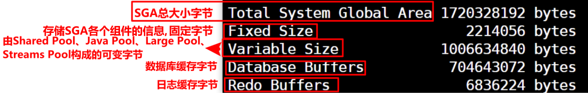

# 内存体系结构

- Oracle数据库的进程结构主要包括用户进程、服务器进程、程序全局区、数据库实例

 

 

## User Process(用户进程)

- 管理Oracle客户端的用户登录。
- 当用户运行一个应用程序时，系统就为它建立一个用户进程。

## Server Process(服务器进程)

- 帮助Oracle客户端连接到服务端。
  - 服务器进程处理与之相连的用户进程的请求，它与用户进程相通信，为相连的用户进程的Oracle请求服务。

## PGA (Program Global Area,程序全局区)

**管理每次会话的SQL执行。** PGA是一块独占内存区域，Oracle进程以专有的方式用他来存放数据和控制信息，当Oracle进程启动时，PGA就有Oracle数据库创建。当用户进程连接到数据库并创建一个对应的会话时，Oracle服务进程会为这个用户专门设置一个PGA区，用来存储这个用户会话的相关内容。当这个用户会话终止时，系统终端释放这个PGA区所占用的内存。

**PGA由以下几个部分组成。**

- Private SQL Area:私有SQL区。
- Session Memory:会话记忆区。
- SQL Work Areas:SQL工作区。

| 部分  | 说明                      |
|:--- |:----------------------- |
| 排序区 | 主要关注，在必要时手动调整           |
| 会话区 | -                       |
| 堆栈区 | -                       |
| 游标区 | 动态的区域，在游标打开时创建，游标关闭时释放。 |

### 结构

#### 四个分区

##### 排序区

**存放排序操作产生的临时数据** 当用户对数据进行排序时，数据库将需要排序的数据保存到PGA程序缓冲区的一个排序区中，在这个排序区中对这些数据进行排序。如果排序的数据大小为M，则这个排序区必须至少有M的空间容纳这些数据，且在排序过程中还需要M的空间来保存排序后的数据。如果排序区空间不足，则会将部分数据使用硬盘来读写，排序的效率降低。

- 排序区的大小占据PGA的大部分空间，通过<mark>初始化参数SORT_AREA_SIZE</mark>调整大小。

##### 会话区

**保存会话具备的权限、角色、性能统计等。由数据库自我维护，会话结束时自动释放。** 当用户进程和数据库建立会话时，系统将这个用户的相关权限查询出来，然后保存在这个会话区。用户进程访问数据时，系统会核对会话区内的用户权限信息。

##### 堆栈区

**保存绑定变量、会话变量、SQL语句运行时的内存结构等信息。由数据库自我维护，会话结束时自动释放。**

##### 游标区

**动态的区域，在游标打开时创建，游标关闭时释放。** 当运行时使用CURSOR时，数据库在PGA中为其分配一块区域，关闭CURSOR时，释放该区域。在创建和释放时，会占用一定的系统资源，因此使用CURSOR执行效率较低，应尽量减少使用

- 可以通过限制游标的数量来提高数据库性能，初始化参数OPEN_CURSORS，控制用户可以同时打开的CURSOR数量。但是如果硬件能够支持，应该将这个参数设置宽松，避免用户频繁地打开关闭游标，对游标区频繁的创建释放，影响数据库性能。

#### Private SQL Area

- Private SQL Area 保存每个Session私有的信息，而Shared Pool中有一个Public SQL Areaa，保存SQL执行计划等共享信息。
- Sersion Process每执行一个SQL都需要申请一个Private SQL Area(Cursor)。Server Process在执行SQL语句之前，必须在Shared Pool中定位语句的Share SQL Area。在PGA中，也是如此。如果定位失败，服务器必须为其分配一个Private SQL Area，并初始化，这个过程消耗大量CPU资源。
- PGA中可以有多个Private SQL Area，Server Process也会使用重用算法，增大Private SQL Area的重用，一个大的PGA可以减少对Private SQL Area的置换，减少CPU开销。

**Private SQL Area分为Persistent Area和Run-Time Area.**

**Persistent Area**

- 存放绑定变量，数据类型转换等Cursor结构信息，Cursor关闭时，该区域释放。
- 当一个SQL语句执行后，Run-Time Area就被释放，而Private SQL Area可以被其他SQL语句重用，重用时必须初始化。

**Run-Time Area**

- 在SQL运行时使用，大小依赖于SQL语句操作方式，处理数据行数和每行记录大小。如果是DML语句，执行完就释放。如果是SELECT语句，在记录全部传给客户端或取消查询后才释放。

##### Private SQL Area寻找Cursor的过程

1. 是否存在某个OPEN CURSOR，是：执行，否：继续下一步。
2. 是否存在SESSION CACHED CURSOR，是：执行，否：继续下一步。
3. 是否存在HOLD CURSOR，是：执行，否：继续下一步。
4. OPEN CURSOR，继续下一步
5. 检索SQL AREA，继续下一步
6. 是否可重用判断，是：软解析，否：硬解析。

#### Work Area

- 对于复杂的查询，PGA的很大一部分被内存需要很大的操作分配给Work Area。
  - 基于排序的操作：ORDER BY、GROUP BY、ROLLUP、窗口函数，参数SORT_AREA_SIZE
  - Hash join，参数HASH_AREA_SIZE
  - Bitmap merge，参数BITMAP_MERGE_AREA_SIZE
  - Bitmap create，参数CREATE_BITMAP_AREA_SIZE
- 如果操作所处理的数据量大于Work Area的大小，则将输入的数据分为一些更小的数据片，使一些数据能够在内存中处理，而其他的则在临时表空间的磁盘上稍后处理。虽然不会将数据放在硬盘上处理，但是操作的复杂度和Work Area的大小成反比。大的Work Area，使一些特定的操作性能更佳，但同时也消耗更大的内存。

#### Session Memory

- Session Memory保存会话中的变量和其他与会话相关的信息。在共享服务器模式下，该Session Memory是共享的。

##### 会话信息查看

```sql
SELECT server "服务器模式"
      ,s.username "用户"
      ,osuser "操作系统用户"
      ,name "内存名称"
      ,ROUND(value/1024/1024,4) "占用内存MB"
      ,s.sid "会话ID"
      ,s.serial# "SESSION序列号"
      ,spid "操作系统进程ID"
FROM V$SESSION s
    ,V$SESSTAT st
    ,v$STATNAME sn
    ,v$PROCESS p
WHERE st.sid = s.sid
 AND st.statistic# = sn.statistic#
 AND sn.name LIKE 'session pga memory'
 AND p.addr = s.paddr
ORDER BY value DESC;
```

### 设置

#### 自动PGA管理 PGA_AGGREGATE_TARGET

- 设值PGA_AGGREGATE_TARGET为非0值（为PGA开辟的总内存），则启用PGA自动管理，并忽略所有`*_AREA_SIZE`的设置。
- 默认为启用PGA的自动管理，Oracle根据SGA的20%来动态调整PGA中专用与Work Area部分的内存大小。

##### PGA_AGGREGATE_TARGET的设置

- PGA_AGGREGATE_TARGET设置为SGA的20%

```sql
ALTER SYSTEM SET PGA_AGGREGATE_TARGET=1200M SCOPE=BOTH;
```

**查看Oracle建议的PGA_AGGREGATE_TARGET的大小**

1. 查看所有会话的PGA占用情况

```sql
SELECT p.spid
      ,b.name
      ,s.program
      ,s.sid
      ,s.serial#
      ,s.osuser
      ,s.machine
FROM V$PROCESS p
    ,V$SESSION s
    ,V$BGPROCESS b
WHERE p.addr = s.paddr
 AND p.addr = b.paddr
UNION ALL
SELECT p.spid
      ,s.username
      ,s.program
      ,s.sid
      ,s.serial#
      ,s.osuser
      ,s.machine
FROM V$PROCESS p
    ,V$SESSION s
WHERE p.addr = s.paddr
 AND s.username IS NOT NULL;
```

2. 查看当前会话

```sql
SELECT s.username,s.sid,s.serial#
FROM V$LOCKED_OBJECT lo,DBA_OBJECTS ao,V$SESSION s
WHERE ao.object_id = lo.object_id
 AND lo.session_id = s.sid;
```

3. 查看某会话PGA占用情况

```sql
SELECT a.name, b.value 
FROM v$statname a, v$sesstat b 
WHERE a.statistic# = b.statistic# 
 AND b.sid = &sid 
 AND a.name like '%ga %' 
ORDER BY a.name;
```

**建议PGA大小**

```sql
select round(pga_target_for_estimate /(1024*1024)) "预测PGA_AGGREGATE_TARGET值M"
      ,estd_pga_cache_hit_percentage "Est.Cache Hit %"
      ,round(estd_extra_bytes_rw/(1024*1024)) "Est.ReadWrite(M)"
      ,estd_overalloc_count "Est.Over-Alloc" 
from v$pga_target_advice ;
```

- 或

```sql
SELECT 'PGA AGGREGATE Target' "条目"
      ,ROUND (pga_target_for_estimate / 1048576) "目标值(M)"
      ,estd_pga_cache_hit_percentage "相关缓存命中率"
      ,ROUND ( ( ( estd_extra_bytes_rw / DECODE ((b.BLOCKSIZE * i.avg_blocks_per_io),0,1, (b.BLOCKSIZE * i.avg_blocks_per_io)))* i.iotime)/100 ) "响应时间(秒)" 
FROM v$pga_target_advice
    ,(SELECT /*+AVG TIME TO DO AN IO TO TEMP TABLESPACE*/  
             AVG ( (readtim + writetim) / DECODE ((phyrds + phywrts), 0, 1, (phyrds + phywrts)) ) iotime
            ,AVG ( (phyblkrd + phyblkwrt)/ DECODE ((phyrds + phywrts), 0, 1, (phyrds + phywrts))) avg_blocks_per_io     
      FROM v$tempstat) i
    ,(SELECT /* temp ts block size */ VALUE BLOCKSIZE 
      FROM v$parameter 
      WHERE NAME = 'db_block_size') b;
```

#### 禁用自动PGA管理

**调整以下参数**

- BITMAP_MERGE_AREA_SIZE
- CREATE_BITMAP_AREA_SIZE
- HASH_AREA_SIZE
- SORT_AREA_SIZE

## UGA 用户全局区

- 在专用服务器模式下，进程和会话一对一，UGA被包含在PGA内。
- 在联机服务器模式下，进程和会话一对多，UGA不再属于PGA而是在Large Pool 中分配，当如果从Large Pool中分配失败，则使用Shared Pool分配。

## SID 数据库实例(Instance)

 

**数据库实例分为两个部分：SGA和Background Process(后台进程)。**

- 当在计算机服务器上启动Oracle数据库后，称服务器上启动了一个Oracle实例：
- Oracle实例是存取和控制数据库的软件机制，它包含系统全局区(SGA)和Oracle进程两部分：
  - SGA是系统为实例分配的一组共享内存缓冲区，用于存放数据库实例和控制信息，以实现对数据库中数据的治理和操作。

**进程**

- 一个进程执行一组操作，完成一个特定的任务
- 对Oracle数据库治理系统来说，<mark>进程由用户进程、服务器进程和后台进程</mark>所组成：
  - 当用户运行一个应用程序时，系统就为它建立一个用户进程。
  - 服务器进程处理与之相连的用户进程的请求，它与用户进程相通信，为相连的用户进程的Oace请求服务。
  - 为了提高系统性能，更好地实现多用户功能，Oracle还在系统后台启动一些后台进程用于数据库数据操作。

### SGA(Systerm Global Area,系统全局区)

- SGA是Oracle为一个实例分配的一组共享内存缓冲区，它包含该实例的数据和控制信息：SGA在实例成功时被自动分配，当实例关闭时被收回。数据库的所有数据操作都要通过SGA来进行。

#### SGA操作

##### 查询SGA

```sql
SHOW SGA;
```

 

##### 调整SGA大小

```sql
ALTER SYSTEM
SET DB_CACHE_SIZE = 1500M SCOPE=BOTH;
```

- SCOPE参数：

| SCOPE参数      | 说明                |
|:------------ |:----------------- |
| SCOPE=BOTH   | 默认，内存和SPFILE都更改   |
| SCOPE=MEMORY | 仅仅更改内存，下次启动失效     |
| SCOPE=SPFILE | 仅仅更改SPFILE，下次启动生效 |

#### SGA构成

##### Shared Pool(共享池)

- 存放SQL语句、PL/SQL代码、数据字典、资源锁和其他控制信息。
- 由初始化参数SHARED_POOL_SIZE控制大小
- 它包含<mark>库缓冲区(Library Cache)、数据字典高速缓存区(Data Dictionary Cache)、结果高速缓存区(Result Cache)。</mark>

**Library Cache**

- 保存最近解析过的SQL语句、PL/SQL过程和包。Oracle在执行语句之前，先在Library Cache中搜索，如果存在已经解析的，则直接使用Library Cache中保存的解析结果和执行计划，而不必再次解析。
- 将每一条SQL语句分为可共享和不可共享。
  - 共享SQL区：存储最近执行的SQL语句、解析后的语法树、优化后的执行计划。Oracle在执行一条新语句时，会为其在共享SQL区中分配空间，分配的大小取决于SQL语句的复杂度。如果共享SQL区中没有空闲空间，则使用LRU算法释放被占用的空间。
  - 私有SQL区（共享模式时）：存储执行SQL语句时与每个会话或用户相关的私有信息。其他会话执行相同的SQL语句时，不会用到这些私有信息（如：绑定变量、环境、会话参数）。

**Data Dictionary Cache**

- 存储经常使用的数据字典信息，它为所有用户进程所共享。Oracle运行过程中进程访问该缓存以便解析SQL语句，确定操作对象的存在、权限等，如果不在Data Dictionary Cache中，则从保存数据字典信息的数据文件中将其读入Data Dictionary Cache。
- 保存的是一条一条的记录，而不是数据块信息。

**Result Cache**

- 存储SQL查询和PL/SQL函数的结果，包含SQL查询结果高速缓存和PL/SQL函数结果高速缓存。

**锁与其他控制结构** 存储Oracle例程内部操作所需信息，如锁、闩、寄存器值等。

**参数指定**

```sql
ALTER SYSTEM
SET SHARED_POOL_SIZE=1200M SCOPE=BOTH;
```

##### Database Buffer Source (数据库缓冲资源/块缓冲区)

- 存储从数据文件中读取的数据块，由<mark>初始化参数DB_CACHE_SIZE</mark>决定。
- 工作原理：<mark>LRU</mark>。查询时，Oracle先把从磁盘读取的数据放入内存供所有用户共享。插入和更新时，Oracle会先在该区中缓存数据，之后再批量写入磁盘。

**缓存块**

- 在Database Buffer Source中存放数据库中数据库块的复制，它由一组缓冲块所组成，这些缓冲块为所有与该实例相连接的用户进程所共享。
- 缓冲块的数目由初始化参数DB_BLOCK_BUFFERS确定，
- 缓冲块的大小由初始化参数DB_BLOCK_SIZE确定。
- 大的数据块可提高查询速度。它由DBWR操作

**分类**

1. <mark>**Dirty Buffers 脏缓存块**</mark>
   - 保存修改过的缓存块，即当一条SQL语句对某个缓存块中的数据进行修改之后，该缓存块就被标记为脏缓存块，被**DBWn进程**写入硬盘的数据文件。
2. **Pinned Buffers 命中缓存块**
   - 保存最近正在被访问的缓存块，始终保留在Database Buffers中。   
3. **Free Buffers 空闲缓存块**
   - 没有数据，等待数据写入。Oracle从数据文件读取数据之后，寻找Free Buffers以写入。

**管理**

1. **DIRTY列表** 保存已经被修改但还没有被写入数据文件的Dirty Buffers
2. **LRU列表** 保存所有的Buffers（包括还未移到DIRTY列表的Dirty Buffers、Pinned Buffers、Free Buffers）。当某个Buffers被访问之后，该Buffers就移到LRU列表的头部，其他Buffers则向尾部移动，放在最尾部的最先被移出。

##### Java Pool(Java池)

- 为JVM和基于Java的应用而开辟的内存空间。保存了JVM中特定会话的Java Code和数据。
- 由JAVA_POOL_SIZE控制大小。
- 在编译数据库中的Java代码和使用数据库中的Java资源对象时，会用到Java Pool，Java的类加载程序对每个加载的类会使用约8K的空间。系统跟踪运行过程中，动态加载的Java类也会使用到Java Pool。

##### Large Pool(大池)

- 可选。<mark>Large Pool起隔离作用</mark>，如果没有Large Pool，则（需要大量内存空间的）操作将占用Shared Pool，对Shared Pool造成一定的性能影响。

**需要大量内存的操作**

- 数据库备份和恢复，如RMAN
- 具有大量排序操作的SQL语句
- 并行化的数据库操作（并行查询），存放进程间的消息缓冲区
- 共享服务器下UGA在Large Pool分配（如果有Large Pool）

**LAGER_POOL_SIZE参数 设置Large Pool大小**

```sql
ALTER SYSTEM
SET LAGER_POOL_SIZE=20M SCOPE=BOTH;
```

##### Redo Log Buffer(日志缓冲区)

- 服务进程从用户空间复制每条DML/DDL语句的REDO条目到REDO LOG BUFFER中，用于存放日志条目（记录对数据的改变）。当这块区域用完，**后台进程LGWR**把日志条目写到磁盘的联机日志文件中。
- Redo Log Buffer的大小由<mark>初始化参数LOG_BUFFER</mark>决定。对于长时间运行的事务，应该将Redo Log Buffer的大小尽量设大。
- 可以循环使用，服务进程复制新的REDO覆盖Redo Log Buffer中已经通过LGWR写入磁盘（ONLINE REDO LOG）的条目。

**LGWR执行写Redo Log Buffer到Online Redo Log的条件：**

1. 每3秒
2. 缓存达到1MB或1/3
3. COMMIT
4. DBWn将修改的缓存区写入磁盘时（如果相应的Redo Log Buffer未尚未写入磁盘）。

##### Stream Pool(流池缓存)

- 流池会用于缓存流进程在数据库间移动/复制数据时使用的队列消息。（如果没有流池，则是Shared Pool中至多10%的空间）
- 由Oracle Streams使用，加强对流的支持。一般由STREAM_POOL_SIZE控制。

##### Keep Buffer Cache(保持缓存)

- 保存Buffer Cache中存储的数据，使其尽可能时间长

##### Recycle Buffer Cache(回收缓存)

- 保存Buffer Cache中即将过期的数据

##### nK Block Size Buffer(非标准块缓存)

- 为与数据库默认数据块大小不同的数据块提供缓存，用来支持表空间的传输

### 后台进程

#### SMON(系统监控进程)

- 负责完成自动实例恢复和回收分类(Sot)表空间

#### PMON(进程监控进程)

- 实现用户进程故障恢复、清理内存区和释放该进程所需资源等

#### DBWn(数据库写进程)

- 数据库缓冲区的治理进程。在它的治理下，数据库缓冲区中总保持有一定数量的自由缓冲块，以确保用户进程总能找到供其使用的自由缓冲块（数据库实例与物理文件的连接)
- 对于大多数情况下，一个DBW0就足够，可以通过DB_WRITER_PROCESS初始化参数修改，最多20个，DBW0~DBW9和DBWa~DBWj。主要取决于CPU来设置数量，对于单CPU而言，配置额外的DBWR进程对性能提高无用。
- 将Buffer Cache中的Dirty Buffer写入磁盘中。根据LRU从Buffer Cache的冷端批量写入Dirty Buffer，该操作是异步进行的。

**满足以下条件时，DBWn将Dirty Buffer写入磁盘**

1. 当Server Process扫描了一定数量的Buffer之后，没有找到Free Buffer。
2. DBWn周期性的写Buffer，使得checkpoint前移，即实例恢复是重做日志的起始位置前移，该位置由最早的Dirty Buffers决定。

#### LGWR(日志文件写进进程)

- 每个实例只有一个LGWR进程
- LGWR是日志缓冲区的治理进程，负责把日志缓冲区中的日志项写入磁盘中的日志文件上。当LGWR将日志缓冲区的重做条目写入日志文件，Server Process同时将新的条目复制到日志缓冲区，覆盖已经被LGWR写入日志文件的重做条目。
- LGWR同步地向一个日志组的多个镜像成员写入。如果其中一个成员文件损坏，则LGWR继续向其他成员文件写入，并将错误记录到LGWR进程的trace文件和 alert log文件。如果一个日志组的所有成员文件都损坏或日志组未归档而暂时不可用，则LGWR无法继续工作。
- **快速提交机制**当用户执行了COMMIT，LGWR将提交记录放进日志缓冲区，并将之与事务的重做条目一起立即写入磁盘，而相关的被修改的数据块（Dirty Buffer）要等待更高效的时机才写入磁盘。一个事务的提交记录及相关的重做条目将通过一个原子性的写操作记录到磁盘，这个单一事件决定了事务是否被成功提交。此时被修改的数据缓冲区还未写入磁盘，但Oracle已经返回事务提交成功。如果重做日志缓存区的空间不足，那么LGWR在事务提交（COMMIT）之前就会将重做日志条目写入磁盘，这样的重做日志条目只有在相关事务提交之后才能永久存储。
- 当一个用户提交一个事务时，这个事务就被赋予一个**系统改变号SCN**，记录在redo log中，故恢复操作可以在RAC、分布式数据上同步进行。
- **批量提交**：当一个事务的重做条目被写入磁盘时，在此期间处于等待提交的事务的重做条目可以被一起写入磁盘。

**执行LGWR写入的条件**

1. 每3秒写入一次
2. 当日志缓冲区使用了1/3
3. 当DBWR将Dirty Buffer写入磁盘，但需要的日志还未写入

##### 先写日志原则 write-ahead protocol

- 执行LGWR写入的条件3：当DBWR将Dirty Buffer写入磁盘，但需要的日志还未写入
- 在DBWn向磁盘写入Dirty Buffer时，所有与修改数据相关的重做记录都必须被写入日志文件，即：write-ahead protocol。如果DBWn发现存在没有写入的重做条目，则通知LGWR写入，并等待LGWR完成写入，才继续执行DBWn的写入。

#### CKPT(检查点进程)

#### ARCn(归档进程)

- 把已经填满的在线日志文件复制到一个指定的存储设备上。
- 仅当日志文件组开关(Switch)出现时，才进行ARCH操作。
- ARCH不是必需的，而只有当自动归档可使用或者当手工归档请求时才发出

#### RECO(恢复进程)

- 是在具有分布式选项时使用的一个进程，主要用于解决引用分布式事务时所出现的故障。
- 它只能在答应分布式事务的系统中出现

#### LCKn(封锁进程)

- 用于并行服务器系统，主要完成实例之间的封锁

# 内存工作机制

**1. 检查共享SQL区有无该会话发出的SQL语句**

- 如果有：<mark>Library Cache Hit</mark> 在该共享SQL区中执行该会话的SQL语句
- 如果无：<mark>Library Cache Miss</mark> 为该SQL语句分配共享SQL区，同时将该语句指定给这些SESSION的Private Area

**2. 检查Share Pool（共享服务器模式）或PGA（专用服务器模式）中的Dictionary Cache中有无要访问的表/视图信息**

- 若无：<mark>Rowcache Miss</mark> 将其读入Dictionary Cache

**3. 检查Database Buffer Cache 当前有无Dictionary Cache被 Library Cache Hit**

- 有：<mark>Data Buffer Hit</mark> 使用当前的缓存
- 无：<mark>Date Buffer Miss</mark> 为该数据请求新的缓存，并进行以下：
  - <mark>**逻辑读**</mark>：搜索LRU List；发现Dirty Buffer 则写入Dirty List，并继续搜索；发现Free Buffer 则 将其分配给Session，同时移至MRU List；若未能搜索到Free Buffer，则触发DBWR进程，将一些Dirty Buffer写入磁盘，并将这部分释放为Free Buffer。

**4. 如果是DML操作，系统为其分配Redo Log Buffer，记录数据变更情况**

- 当Redo Log Buffer中无free buffer时，触发LGWR进程，将Redo Log Buffer中的部分数据写入Log File
