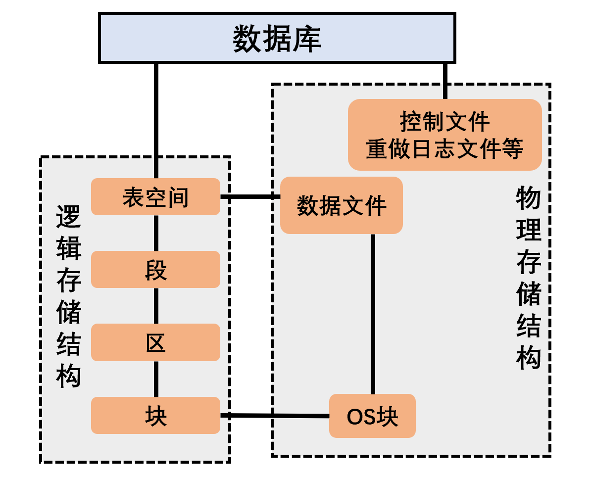
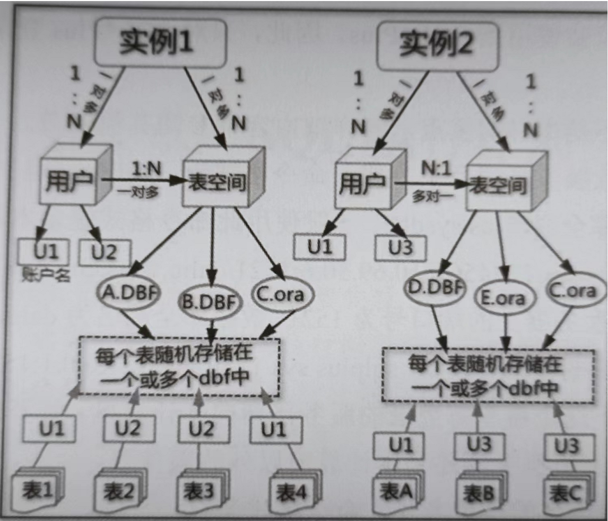

# 物理结构概述

- Oracle数据库的物理结构由数据库的操作系统文件所决定，包含数据文件、重做日志文件、控制文件、参数文件、密码文件、归档日志文件、备份文件、告警日志文件、跟踪文件等；
  - 其中数据文件、重做日志文件、控制文件和参数文件是必需的，其他文件可选。

# 数据文件(Datafile)

- 数据文件是数据库的物理存储单位，用来存储数据库中的全部数据，例如数据库表中的数据和索引数据。通常为`*.DBF`格式

**数据文件的定义**

- 一个数据库有多个数据文件。每个数据文件都是一个操作系统文件。数据文件真正存放数据库的数据。[数据库中的表(Tables)/索引(Indexes)的数据，物理上存放在数据文件中。]
  - 一个数据文件由多个操作系统块(OSBlock)组成
  - 注：操作系统块和Oracle的数据块是两个概念。

**数据文件有下面的特征：**

- 一个数据文件只能属于一个数据库。
- 数据文件可以被设置成自动扩展。当该文件上的空间使用完以后，它可以根据需要自动扩展。
- 一个或者多个数据文件形成一个表空间（表空间是Oracle的逻辑结构）。
- 数据库的数据存储在表空间中，表空间可能某一个或者多个数据文件中。
  - 一个表空间可以由一个或多个数据文件组成，
  - 一个数据文件只能属于一个表空间。
  - 一旦数据文件被加入某个表空间后，就不能删除这个文件如果要删除某个数据文件，只能删除其所属的表空间才行。

用户查询一个表，如果这个表的数据不在内存中，Oracle会读取该表所在的数据文件，并把数据放到内存中。

## 使数据文件离线

数据文件离线(Datafile Offline)的原理和表空间离线的原理是相同的。

- 表空间离线时，表空间中所有的数据文件都离线。我们也可以使表空间中的单个数据文件离线。
- 离线的数据文件不可访问。
- 在非归档（模式下，不要轻易离线数据文件，在这种模式下离线数据文件是很危险的，这样离线的数据文件可能永远也不能重新在线(Online).

### 在归档模式下（ARCHIVELOG）使数据文件离线

```
ALTER DATABASE DATAFILE '数据文件路径' OFFLINE
```

**注: 在非归档模式下使用该语句时：**

- ORA-01145: 除非启用了介质恢复, 否则不允许立即脱机

### 在非归档模式下（NOARCHIVELOG）使数据文件离线

- 使用FOR DROP选项，离线的数据库文件将永远不能再次在线，

```
ALTER DATABASE DATAFILE '数据文件路径' OFFLINE FOR DROP;
```

## 使数据文件在线

- 在线的数据文件使该数据文件中的数据可以访问。

```
ALTER DATABASE DATAFILE '数据文件路径' ONLINE;
```

## 移动数据文件

**查询当前数据文件路径**

```
SELECT file_name
      ,tablespace_name
FROM DBA_DATA_FILES;
```

**使该数据文件离线**

```
ALTER DATABASE DATAFILE '数据文件路径' OFFLINE;
```

**修改该数据文件在控制文件中的信息**

```
ALTER TABLESPACE 表空间名
RENAME DATAFILE '旧的数据文件路径名'
TO '新的数据文件路径名';
```

**使该数据文件重新在线**

```
ALTER DATABASE DATAFILE '数据文件路径' ONLINE; 
```

## 删除数据文件

```
ALTER TABLESPACE 表空间名
DROP DATAFILE '数据文件路径';

--表空间只有一个数据文件时，该数据文件不能删除
ORA-03261: 表空间 MYTEST_TABLESPACE 只有一个文件
```

### 删除临时文件

```
ALTER TABLESPACE 临时表空间名
DROP TEMPFILE '临时文件名';

ALTER DATABASE TEMPFILE '临时文件名' DROP
INCLUDING DATAFILES;
```

## 查询数据库中的数据文件

```
SELECT file#
      ,name
FROM V$DATAFILE;
```

# 重做日志文件(Redo Log File)

- 重做日志文件用于记录数据库所做的全部变更（如增加、删除、修改），以便在系统发生故障时，用它对数据库进行恢复。
  - 名字通常为`Log*.DBF`格式，如Log1GCC.dbf,
- 至少两组重做日志文件，Oracle以循环的方式来使用。

# 控制文件(Control File)

- 每个Oracle数据库都有相应的控制文件，它们是较小的二进制文件，
- 用于记录数据库的物理结构，如数据库名、数据库的数据文件和重做日志文件的名字和位置等信息，
- 用于打开、存取数据库。
- 名字通常为`Ctrl*.CTL`格式，

# 配置文件(Configuration File)

- 配置文件记录Oracle数据库运行时的一些重要参数，如数据块的大小，内存结构的配置等。
  - 名字通常为`init*.ORA`格式，

# 密码文件(Password File)

- 密码相关的数据存储。

# 参数文件(Parameter File)

- 参数相关的数据存储。

## 参数文件

**参数文件**

- Oracle把初始化参数及其值存放在一个文件中，我们把这个文件叫参数文件。
- 启动数据库时（严格地说，应该叫启动实例），Oracle会读取参数文件中的值，然后根据这些值对实例和数据库进行设置。
- PFILE和SPFILE是两种类型的参数文件，它们都用于启动数据库。启动数据库时，Oracle会读取这两个文件中的信息(Oracle一次只使用一个)，并进行相关的设置（如设置高速缓冲区的大小、指定控制文件的位置等)。PFILE、SPFILE内容相同，只是文件的格式不同而已。
  - PFILE(初始化参数文件)是文本文件，可以使用编辑器修改该文件的内容。
  - SPFILE(服务器参数文件)是二进制文件，不能使用编辑器直接修改它的内容，SPFILE的内容要通过Oracle的命令进行读写。
    - 在实例运行时，DBA可以动态修改SPFILE中的参数，因此，Oracle推荐使用SPFILE。

### 初始化参数文件 PFILE

- PFLE是传统的参数文件。它是一个文本文件，用于存放初始化参数。一个初始化参数文件的样例如下所示：

```
db name='ZDB'
java pool size=4194304
job queue_processes=10
undo management='AUTO'
undo tablespace='UNDOTBS1'
user_dump_dest='D:\ORACLE\PRODUCT\10.2.0\ADMIN\ZDB\UDUMP
log buffer=11154944
lock sga=TRUE
...
```

- 参数文件的缺点是，在数据库运行时，DBA不能永久修改初始化参数的值。要想永久修改初始化参数的值，DBA需要先关闭数据库，对参数文件(PFLE)进行修改，然后用修改后的PFILE重新启动数据库。

### 服务器参数文件 SPFILE

- SPFILE是一个位于数据库服务器上的二进制文件。和初始化参数文件(PFILE)一样，服务器参数文件也用于存放初始化参数，不同的是，在数据库运行的时候，DBA可以永久修改初始化参数的值。
- 服务器参数文件的默认名字及默认位置

| 操作系统       | 默认名字                  | 默认路径                  |
|:----------:|:---------------------:|:---------------------:|
| UNIX/Linux | spfileSORACLE_SID.ora | $ORACLE_HOME/dbs      |
| Windows    | spfileSORACLE_SID.ora | %ORACLE_HOME\database |

### PFLE、SPFILE的相互转换

#### 根据SPFILE创建PFILE

- 为了备份初始化参数的设置，可以根据SPFILE生成PFILE(一个文本文件)。PFILE也可以用来启动数据库。
- 在Windows系统中，PFILE和SPFILE的默认路径通常是：
  - `C:\app\10548\product\11.2.0\dbhome_1\database\SPFILEORCL.ORA`

**根据SPFILE创建PFILE的语法如下所示：**

```
CREATE PFILE='PFILE的完整路径'
FROM SPFILE='SPFILE的完整路径';
```

- 要想执行这个命令，用户必须拥有SYSDBA或者SYSOPER权限。
- PFILE可以是任意名字

**创建PFILE过程说明如下。**

1. 以SYSDBA的身份登录数据库。

```
CONNECT sys/change_on_install AS SYSDBA;
```

2. 执行语句根据SPFILE创建PFILE的语法

```
CREATE PFILE='E:\MyPFILEORCL.ORA'
FROM SPFILE='C:\app\10548\product\11.2.0\dbhome_1\database\SPFILEORCL.ORA';
```

3. 检查新创建的PFILE的存在

#### 根据PFILE创建SPFILE

**语法**

```
CREATE PFILE='PFILE的完整路径'
FROM SPFILE='SPFILE的完整路径';
```

- SPFILE的名字通常满足格式：`SPFILE$ORACLE_SID.ORA`

**创建SPFILE过程说明如下。**

1. 以SYSDBA的身份登录数据库

```
CONNECT sys/change_on_install AS SYSDBA;
```

2. 关闭数据库

```
SHUTDOWN IMMEDIATE
```

3. 执行语句根据PFILE创建SPFILE

```
CREATE SPFILE='E:\MySPFILEORCL.ORA'
FROM PFILE='E:\MyPFILEORCL.ORA';
```

4. 检查新创建的SPFILE的存在 

5. 重新启动数据库

```
STARTUP
```

### 使用参数文件启动数据库

#### 使用SPFILE启动数据库

1. 以SYSDBA的身份登录数据库

```
CONNECT sys/change_on_install AS SYSDBA;
```

2. 使用SPFILE启动数据库

```
STARTUP
```

#### 使用PFILE启动数据库

1. 以SYSDBA的身份登录数据库

```
CONNECT sys/change_on_install AS SYSDBA;
```

2. 使用PFILE启动数据库

```
STARTUP PFILE = 'E:\MyPFILEORCL.ORA';
```

## 初始化参数(Initialization Parameter)

**初始化参数**

- 数据库中有许多初始化参数(Initialization Parameter)，这些参数用于对整个数据库进行限制、对用户和进程进行限制、对数据库资源进行限制、对数据库的性能进行调整。
- 部分初始化参数如下所示：
  - DB_BLOCK_SIZE
  - DB_NAME
  - SESSIONS
  - CLUSTER_DATABASE
  - COMPATIBLE
  - ...

### 显示初始化参数的值

- 要想查看初始化参数的设置，有两种方法：**用SHOW命令和查询视图V$PARAMETER**。

**显示所有初始化参数的值。**

```
方法1：
SELECT name,value
FROM V$PARAMETER
其中，name是参数的名字；value是参数的值。

方法2：
SHOW PARAMETERS
其中，PARAMETERS是关键字，表示显示所有参数的值。
```

**显示指定初始化参数的值。**

```
方法1：
SHOW PARAMETER 参数名
>方法2：
SELECT NAME,VALUE
FROM V$PARAMETER
WHERE name = '参数名';
```

### 初始化参数的修改

**永久修改初始化参数**

为了对数据库进行限制或者调整数据库的性能，DBA需要永久修改初始化参数，则：

- 如果数据库使用的是初始化参数文件(PFILE),要想永久修改初始化参数文件的参数，
  - DBA需要经历关闭数据库→修改初始化参数文件(PFILE)中的参数→新启动数据库的过程。
- 如果数据库使用的是服务器参数文件(SPFILE),
  - DBA只需使用`ALTER SYSTEM SET...SCOPE=SPFILE命令`修改初始化参数，这个命令会更新初始化参数文(SPFILE)。

**临时更改初始化参数的值**

如果DBA只是想临时更改初始化参数的值，

- 可以使用`ALTER SYSTEM SET...SCOPE=MEMORY`命令，这种更改只对当前实例有效，也就是说，如果DBA重新启动实例，刚才的修改将会丢失。
- 用户也可以使用`ALTER SESSION命令`改变某些初始化参数值，但是这种改变仅限于本次会话。

# 耦合关系

- Oracle数据库的逻辑结构与物理结构的相互耦合连接可以达到数据存储持久化的目的。
  - 所谓持久化就是将数据物理地存储在磁盘上，不受关机或断电的影响。

 

- 一个用户可以使用一个或多个表空间，一个表空间也可以供多个用户使用。
- 用户和表空间没有隶属关系，表空间是一个用来管理数据存储的逻辑概念，表空间只是和数据文件发生关系，数据文件是物理的，
- 一个表空间可以包含多个数据文件，而一个数据文件只能隶属一个表空间。
- SID是Oracle实例的唯一名称标识，用户去访问数据库，实际上是向某一个Oracle实例发送请求，Oracle实例负责向数据库获取数据。
  - Oracle实例=内存结构(SGA)+后台进程(Background Process),
  - 所以Oracle实例是临时性的。
  - `STARTUP NOMOUNT`只启动实例
- 一个实例只能对应一个数据库，一个数据库可以使用多个实例、

 

**获取这些信息的SQL语句如下。**

- 查看Oracle数据库的库名SQL语句：

数据字典V$DATABASE

```
select name from v$database;
```

- 查看Oracle数据库的实例名SQL语句；

数据字典V$INSTANCE

```
select instance_name from v$instance;
```

- 查看Oracle数据库的域名SQL语句：

```
show parameter domain
```

- 查看Oracle数据库的全局名SQL语句

数据字典GLOBAL_NAME

```
select from global_name;
```
