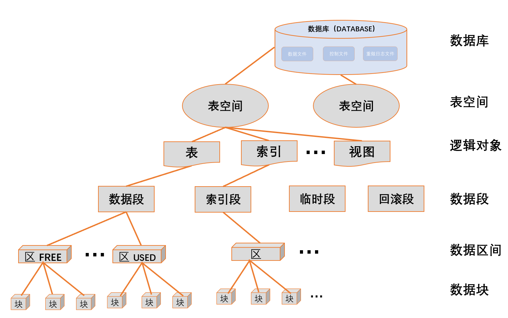
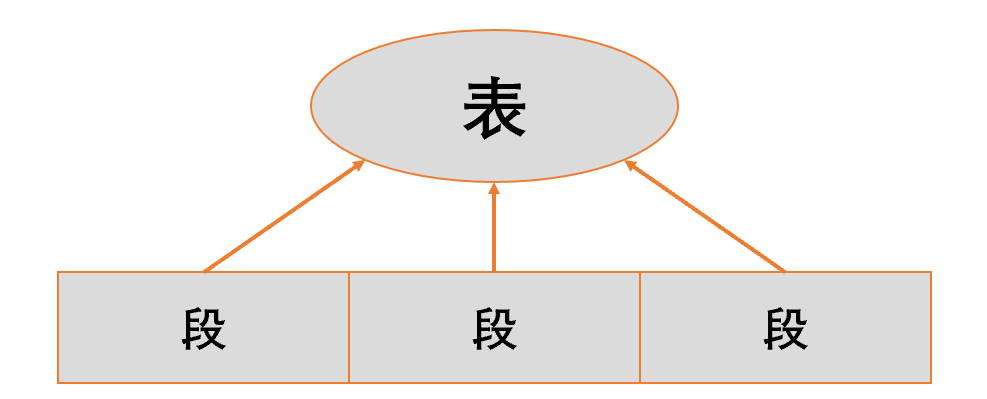
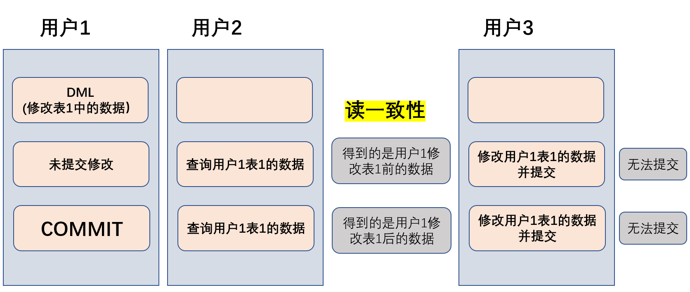
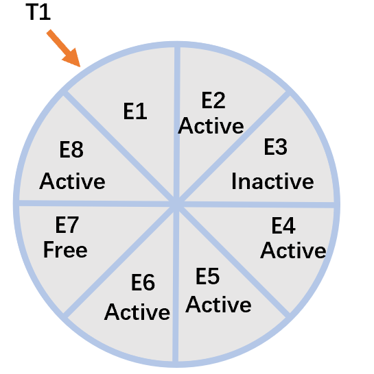

# 逻辑结构概述

Oracle存储的逻辑结构由数据块（Data Block），区（Extent），段（Segment）和表空间（Tablespace）以及模式对象(Schema Object)组成

 

Oracle数据库在逻辑上是由多个表空间组成的，表空间在物理上包含一个或多个数据文件。而数据文件大小是块大小的整数倍；表空间中存储的对象称为段，比如数据段、索引段和回滚段。段由区组成，区是磁盘分配的最小单位。段的增大是通过增加区的个数来实现的。每个区的大小是数据块大小的整数倍，区的大小可以不相同，数据块是数据库中最小的IO单位，同时也是内存数据缓冲区的单位，以及数据文件存储空间单位。**块的大小由参数DB_BLOCK_SIZE**设置，其值应设置为操作系统块大小的整数倍。

# 数据块(Data Block)

- 数据块是最基本的存储单元，它是Oracle最小的存储单位（数据文件磁盘存储空间单元），也是数据库I/O的最小单元。
  - 一个数据库至少要有两个数据块 
- 数据块组成区，区组成段，段组成表空间，表空间组成数据库

**数据块的大小由DB_BLOCK_SIZE参数决定。**

- 一般数据块的尺寸为操作系统块的尺寸的整数倍（1、2、4等）。 
- 在创建数据库时可以指定，一般是4KB或8KB，**一旦指定后，不可更改**
- 只要在内存结构中存在8KB的缓存，在块大小为4KB的数据库中也可以指定创建块大小为8K的表空间。   

**块的结构**

- 块的头部信息区
  - 块头 
    - 包含块的一般信息，如：块的物理地址、块所属的段类型。
  - 表目录
    - 如果块中存储的数据是表数据，则在表目录中保存块中所包含的表的相关信息。 如：表的结构定义等。
  - 行目录 
    - 行记录的相关信息，如ROWID。 
- 块的存储区
  - 主要包含空闲空间和已经使用的空间，通过以下参数管理： 
  - PCTFREE参数
    - 指定块中必须保留的最小空闲空间比例。
    - 当块中的空闲存储空间减少到PCTFREE所设置的比例时，Oracle将块标记为不可用状态，新的数据行将不能被加入到这个块。 
  - PCTUSED参数
    - 指定一个比例，当块中已经使用的存储空间减少到这个比例以下时，这个块将会被重新标记为可用状态。 
  - 可以在表空间或段的级别指定这两个参数，段级别的设置优先级更高。 

# 区(Extent)

- 区是磁盘空间分配和回收的最小单位（分配单元），是两个或多个相邻的Oracle数据库组成。磁盘按区划分，每次至少分配一个区。
- 区(Extent)是数据库的一个逻辑存储单元，存储在段中，它由连续的数据块组成。数据块(Block)组成区，区组成段(Segment)。
  - 区是一段连续的存储空间。
  - 当段中的空间耗尽时，Oracle会分配一个新的区给这个段。
- 在创建具有独立段结构的数据库对象时，首先为这些对象创建一个“段”，并为该“段”分配一个“初始区”

**回收对象中未使用的区**

```sql
ALTER TABLE 表
DEALLOCATE UNUESD;
```

```sql
ALTER TABLE scott.employees
DEALLOCATE UNUSED;
```

# 段(Segment)

- 段是分配给某个逻辑结构的一组区，是存放数据的逻辑存储单元。

**表和段的关系**

- 表由段组成，一个表由一个或者多个段组成。普通表由一个段组成，分区表由多个段组成。
- 创建表的时候，其实质就是创建一个或者多个段。

 

**段的类型**

- 数据段(Data Segment)、
- 索引段(Index Segment)、
- 临时段(Temporary Segment).、
- 回滚段(Rollback Segment)
1. 数据段
- 用于存放数据。
- 一个单独的段可以存放下面的数据：
  - 一个普通表的数据
  - 分区表(Partition Table)中的一个分区
  - 聚簇表(Cluster Table)
- 创建表的时候，其实质就是创建一个或者多个段。创建数据段的时候，可以指定数据段的存储参数。
2. 索引段
- 索引段用于存放索引数据，每个非分区索引(Nonpartitioned Index)有一个单独的索引段。
- 可以使用`CREATE INDEX`命令创建索引，实质上是创建一个或者多个索引段。创建索引段的时候，可以指定索引段的存储参数。
3. 临时段
- 临时段用于存放临时数据。当进行查询的时候，Oracle会用到临时段。
- 临时段是Oracle自动创建和维护的。
- 临时段用于数据的排序(Sort)。只有内存不足的时候，Oracle才会用到临时段。
  - Oracle用到临时段，是数据库性能降低的一个征兆。所以，DBA应该想方设法尽量让排序在内存中进行。
- 在使用`CREATE USER`命令创建用户或者使用`ALTER USER`命令修改用户的属性时，可以利用子句`TEMPORARY TABLESPACE`为用户指定临时表空间。
  - 如果没有为用户指定临时表空间，Oracle会默认使用SYSTEM表空间（系统表空间）作为用户的临时表空间。
  - SYSTEM表空间主要用于存放数据字典，推荐每个用户使用非系统表空间作为临时表空间。
  - 所有分配的临时段属于用户SYS,不属于执行操作的用户。
4. 回滚段
- 回滚段用于保存回滚条目，Oracle将数据被修改以前的版本保存在回滚条目中，利用这些条目，用户可以撤销以前对数据的修改。
- 回滚条目还可以实现读一致性。

# 模式对象（Schema Object）

- 模式对象是一种应用，包括表、约束条件、聚簇、视图、索引、序列、同义词、哈希、存储过程、存储函数、触发器、包及数据库链等。
- 对数据库的操作基本可以归结为对数据对象的操作，对象也是一个逻辑结构，是建立于段之上的

# 表空间(Tablespace)

- 表空间是数据库中最大的逻辑单位，每一个表空间由一个或多个数据文件组成，一个数据文件只能与一个表空间相联系。
- 表空间用于存放数据库对象（如表、索引等）。一个数据库逻辑上由一个或多个表空间（tablespace）构成。
- 表空间具有在线(Online)和离线(Offline)属性，可以将除System以外的其他任何表空间设置为离线。
- 每个数据库都拥有一个系统表空间(SYSTEM Tablespace)和一个辅助表空间(SYSAUX Tablespace)。
  - 创建数据库的时候，Oracle会自动创建这两个表空间。

**数据库创建完后会有如下表空间：**

- System表空间；
  - 用于存储系统的数据字典表、程序系统单元、过程函数、包和触发器等，也可用于存储用户数据表、索引对象。
- Sysaux表空间；
- 撤销UNDO表空间：
- 临时Temporary表空间。

对于索引、表等数据库对象，虽然也存在于表空间所属的数据文件中，但这些对象本身不会指定要存放在哪个数据文件上，数据文件只与表空间关联。

**数据库中有以下类型的表空间**

- 永久表空间(Permanent Tablespaces，又叫常规表空间)
- 临时表空间(Temporary Tablespace)
- 回滚表空间(Undo Tablespace）。

**大文件表空间和小文件表空间**

- 在默认情况下，Oracle创建小文件表空间(Smallfile Tablespace)，小文件表空间是传统的表空间。系统表空间和辅助表空间是小文件表空间。
- 同时，Oracle还允许创建大文件表空间(Bigfile Tablespace)。大文件表空间是由单个很大的文件组成的表空间。

**表空间与数据文件的关系**

- 表空间是Oracle存储的逻辑结构，而数据文件是Oracle存储的物理结构。
- 表空间用于存放数据库对象，而这些对象实际上存放在数据文件中，数据文件是数据的物理载体。
- 表空间的尺寸是组成这个表空间的所有数据文件的尺寸之和。

## 表空间中区(Extent)的管理方式

**对于表空间中区的空间管理，Oracle有两种管理方式：**

- 字典管理(Dictionary Managed Tablespace)，通过数据字典对区进行管理。
- 本地管理(Locally Managed Tablespace)，通过位图对区进行管理。
  - 本地管理是Oracle推荐使用的区的管理方式。

### 字典管理（Dictionary Managed Tablespaces)

- 如果使用字典管理，Oracle将使用数据字典来跟踪表空间中区的使用。
- 当分配一个新的区、使用一个区或者释放一个区的时候，Oracle都会更新数据字典`FET$与UET$`。通过数据字典来反映区的状态。
- 当更新数据字典时，会产生回滚信息，Oracle会存储这些回滚信息。这正是字典管理的表空间逐渐被淘汰的根源。

### 本地管理(Locally Managed Tablespaces)

**EXTENT MANAGEMENT LOCAL**

- 本地管理表空间是Oracle推荐使用的方式，它通过本地表空间来管理区的使用。
- 表空间中的每个教据文件都有一个位图(Bitma即)，位图存放在数据文件头，位图中的每个位(bit)与一个或者一组数据块(B1ok)相对应。当分配一个区或者释放一个区的时候，Oracle将更新位图以反映这种改变。
- 特别注意的是，对于本地管理的表空间，Oracle不会更新数据字典，也不会产生回滚信息

## 索引段(Segment)的管理方式

当用户进行数据的插入、更新、删除的时候，段中数据块的空间会发生改变，块的状态也会发生改变。

**Oracle使用两种方式来管理这些块：**

- 段的手动管理(Manual Segment Space Management):
- 段的自动管理(Automatic Segment Space Management,ASSM)。

### 段的手动管理

**SEGMENT SPACE MANAGEMENT MANUAL**

Oracle使用自由列表(Free List)来管理段中的块。自由列表列出了允许进行插入操作的数据块。

**Oracle通过PCT_FREE（PCTFREE)和PCT_USED(PCTUSED)两个参数来控制一个数据块是否允许插入数据。**

- 当对一个块进行INSERT或者UPDATE操作以后，Oracle会把这个块中剩余的自由空间和PCT_FREE进行对比，如果这个数据块中的自由空间小于PCT_FREE的设置，则Oracle将把这个块从自由列表中拿出来，表示这个块不再允许进行插入，但是，这个块中剩余空间允许更新操作；
- 当对一个块进行DELETE或者UPDATE操作以后，Oracle会把这个块中已使用的空间和PCT_USED进行对比，如果这个数据块中已经使用的空间小于PCT_USED的设置，则Oracle把这个块放回自由列表中，表示这个块允许数据的插入。因此，PCT_FREE涉及把块从自由列表中移出，PCT_USED涉及把块移到自由列表中。

### 段的自动管理

**SEGMENT SPACE MANAGEMENT AUTO**

“段的自动管理”使用位图来管理段中的数据块。当块中的空间发生变化的时候，Oracle会更新位图，以反映这块是否允许数据的插入。位图使Oracle能够自动管理自由空间。

## 常规表空间管理

### 创建表空间

```sql
CREATE TABLESPACE 表空间名
DATAFILE '数据文件完整路径.DBF'
SIZE 大小 K|M 
AUTOEXTEND ON NEXT 大小 K|M  --自动扩展
MAXSIZE UNLIMITED 
LOGGING EXTENT MANAGEMENT LOCAL  --表示本地管理的表空间
SEGMENT SPACE MANAGEMENT {AUTO | DEFAULT | MANUAL}; --使用段的自动管理
```

```sql
CREATE TABLESPACE mytest_tablespace
DATAFILE 'G:\mytest_tablespace\datafile_01.DBF'
SIZE 100M
AUTOEXTEND ON NEXT 50M
MAXSIZE UNLIMITED
LOGGING EXTENT MANAGEMENT LOCAL
SEGMENT SPACE MANAGEMENT AUTO
```

```sql
CREATE TABLESPACE mytest_tablespace_02
DATAFILE 'G:\mytest_tablespace_02\datafile_02_01.DBF'
SIZE 200M
AUTOEXTEND ON NEXT 50M
MAXSIZE UNLIMITED
LOGGING EXTENT MANAGEMENT LOCAL
SEGMENT SPACE MANAGEMENT MANUAL
```

### 扩展表空间(扩展组成表空间的数据文件)

#### 手动增加(重新设置大小)表空间中的数据文件大小

```
ALTER DATABASE DATAFILE '数据文件路径' 
RESIZE 大小 K|M;
```

```
ALTER DATABASE DATAFILE 'G:\mytest_tablespace\datafile_01.DBF' 
RESIZE 300M
```

#### 把表空间中的数据文件设置为自动扩展

```
ALTER DATABASE DATAFILE '数据文件路径' 
AUTOEXTEND ON NEXT 大小 
MAXSIZE UMLIMITED
```

```
ALTER DATABASE DATAFILE 'G:\mytest_tablespace\datafile_01.DBF'
AUTOEXTEND ON NEXT 30M
MAXSIZE UNLIMITED
```

#### 往表空间中增加数据文件

```
ALTER TABLESPACE 表空间名 
ADD DATAFILE '数据文件路径' SIZE 大小 K|M
```

```
ALTER TABLESPACE mytest_tablespace
ADD DATAFILE 'G:\mytest_tablespace\datafile_02.DBF' SIZE 100M
```

### 表空间离线

**表空间在线**

- 使表空间中的数据可以访问，
- 在数据库打开的状态下，SYSTEM表空间永远在线
  - Oracle需要访问存放在SYSTEM表空间内的数据字典 
  - SYSTEM表空间不能被离线。

**表空间离线**

- 使表空间中的数据不可访问
- 通常用于维护时，离线。

#### 使表空间离线

具有一定的风险。

```
ALTER TABLESPACE 表空间名 OFFLINE [NORMAL|TEMPORARY|IMMEDIATE];
```

**离线的三种方式**

1. NORMAL 常规的离线方式。会执行校验点，比较安全。
2. TEMPORARY 当数据文件有误时，使用
3. IMMEDIATE 离线数据文件，但是不会产生校验点，表空间重新在线时，需要执行恢复。

```
ALTER TABLESPACE mytest_tablespace OFFLINE;
```

#### 使表空间在线

```
ALTER TABLESPACE 表空间名 ONLINE;
```

```
ALTER TABLESPACE mytest_tablespace ONLINE;
```

### 重命名表空间

- 不能重命名表空间SYSTEM和SYSAUX
- 如果表空间离线或者表空间中有数据文件离线，表空间不能被重命名。

```
ALTER TABLSPACE 表空间名
RENAME TO 新表空间名;
```

```
ALTER TABLESPACE mytest_tablespace_02
RENAME TO mytest_tablespace02;
```

### 表空间的读写

**只读表空间(Read Only Tablespace)**

- 只读表空间，顾名思义，这个表空间只允许读，不允许修改。鉴于只读表空间的这种特性，只读表空间可以放在只读的设备上，如CD-ROM、WORM。
- 如果要想修改一个只读表空间，只能先把这个表空间的状态设成可读/写(Read/Write),接着对该表空间上的数据进行修改，修改完成后，再把该表空间改成只读(Read Only)。
- 由于只读表空间很少被修改，所以只读表空间不需要频繁备份。

#### 使表空间只读

```
ALTER TABLESPACE 表空间名 
READ ONLY;
```

```
ALTER TABLESPACE mytest_tablespace
READ ONLY;
```

#### 使表空间可读写

```
ALTER TABLESPACE 表空间名
READ WRITE;
```

```
ALTER TABLESPACE mytest_tablespace
READ WRITE;
```

### 删除表空间

```
DROP TABLESPACE 表空间名
```

#### 表空间内有内容时

```
DROP TABLESPACE 表空间名
INCLUDING CONTENTS;
```

#### 删除表空间及其数据文件

```
DROP TABLESPACE 表空间名
INCLUDING CONTENTS AND DATAFILES;
```

```
DROP TABLESPACE mytest_tablespace02
INCLUDING CONTENTS AND DATAFILES;
```

### 大文件表空间

#### 定义

**大文件表空间(Bigfile Tablespace)**

- 大文件表空间由一个单独很大的数据文件组成。大文件表空间使Oracle能够使用和管理超级大的文件。
- 在默认情况下，系统默认创建小文件表空间(Smallfile Tablespace)，小文件表空间(**SMALLFILE**)是传统的表空间类型。Oracle创建的SYSTEM表空间和SYSAUX表空间都是小文件表空间。

**使用大文件表空间有下面的优点。**

- 使表空间的容量更大。
  
  - 使用大文件表空间（bigfile tablespace）可以显著地增强Oracle数据库的存储能力。一个小文件表空间（smallfile tablespace）最多可以包含1024个数据文件（datafile），而 一个大文件表空间中只包含一个文件，这个数据文件的最大容量是小数据文件的1024倍。这样看来，大文件表空间和小文件表空间的最大容量是相同的。但是由 于每个数据库最多使用64K个数据文件，因此使用大文件表空间时数据库中表空间的极限个数是使用小文件表空间时的1024倍，使用大文件表空间时的总数据 库容量比使用小文件表空间时高出三个数量级。换言之，当一个Oracle数据库使用大文件表空间，且使用最大的数据块容量时（32K），其总容量可以达到 8EB。（1EB =1024PB，1PB = 1024TB，1TB=1024GB）

- 在超大型数据库中，简化数据文件的管理。使用大文件表空间，可以减小SGA的需求。同时，还可以减少控制文件的尺寸。
   -简化数据库的管理。
  
  - 当数据库文件由Oracle管理（Oracle-managed files），且使用大文件表空间（bigfile tablespace）时，数据文件对用户完全透明。换句话说，用户只须针对表空间（tablespace）执行管理操作，而无须关心处于底层的数据文件 （datafile）。使用大文件表空间，使表空间成为磁盘空间管理，备份，和恢复等操作的主要对象。使用大文件表空间，并与由Oracle管理数据库文件（Oracle-managed files）技术以及自动存储管理（Automatic Storage Management）技术相结合，就不再需要管理员手工创建新的数据文件（datafile）并维护众多数据库文件，因此简化了数据库文件管理工作。

- 只有本地管理的（locally managed），且段空间自动管理（automatic segmentspace  management）的表空间（tablespace）才能使用大文件表空间（bigfile tablespace）。 
  
  - 但是有两个例外：本地管理的撤销表空间（undo tablespace）和临时表空间（temporary tablespace），即使其段（segment）为手工管理（manually managed）

**使用大文件表空间时需要考虑的因素**

- 大文件表空间（bigfile tablespace）应该和自动存储管理（Automatic  Storage Management）或其他逻辑卷管理工具（logical volume manager）配合使用，这些工具应该能够支持动态扩展逻辑卷，也能支持striping（数据跨磁盘分布）或RAID。
- 应该避免在不支持striping的系统上使用大文件表空间，因为这将不利于并行执行（parallel execution）及 RMAN 的并行备份（backup parallelization）。
- 当表空间正在使用的磁盘组（disk group）可能没有足够的空间，且扩展表空间的唯一办法是向另一个磁盘组加入数据文件时，应避免使用大文件表空间。
- 不建议在不支持大文件的平台上使用大文件表空间，这会限制表空间（tablespace）的容量。参考相关的操作系统文档了解其支持的最大文件容量。
- 如果使用大文件表空间替代传统的表空间，数据库开启（open），checkpoints，以及 DBWR 进程的性能会得到提高。但是增大数据文件（datafile）容量可能会增加备份与恢复的时间

**特有的属性**

1. 每个大文件表空间只能包含一个数据文件。如果试图添加新的文件，则会报告 ORA-32771 错误
2. 只有自动段空间管理的 LMT (locally managed tablespaces ) 支持大文件表空间
3. 相对文件号(RELATIVE_FNO)为1024 ( 4096 on OS/390)
   - 因为大文件表空间只有一个数据文件，所以其相对文件号也是固定的:1024

#### 创建大文件表空间

```
CREATE BIGFILE TABLESPACE 表空间名  --BIGFILE指定创建的表空间是大文件表空间。 
DATAFILE '大数据文件路径' SIZE 大小;
```

```
CREATE BIGFILE TABLESPACE mytest_big_tablespace
DATAFILE 'G:\big_datafile_01.DBF' SIZE 100M;
```

#### 修改数据库默认的表空间类型：

```
ALTER DATABASE 
SET DEFAULT BIGFILE|SMALLFILE TABLESPACE;  --默认SMALLFILE表空间
```

### 表空间的加密

```
ALTER TABLESPACE 表空间名
DATAFILE '数据文件路径' SIZE 大小
ENCRYPTION USING '加密算法'
DAFAULT STORAGE(ENCRYPT);
```

**加密算法**

- 3DES168
- AES128
- AES192
- AES256

### 表和表空间的关系（查询表空间信息）

#### 列出数据库中的表空间

**数据字典DBA_TABLESPACES**

```
SELECT tablespace_name
FROM DBA_TABLESPACES;
```

#### 查询组成表空间的数据文件

**数据字典DBA_DATA_FILES**

```
SELECT file_name
FROM DBA_DATA_FILES
WHERE tablespace_name = '表空间名';
```

```
SELECT file_name
FROM DBA_DATA_FILES
WHERE tablespace_name = 'MYTEST_TABLESPACE';
```

#### 查询表空间的剩余空间

```
--统计所有表空间的空间使用情况
SELECT tbs 表空间名
      ,SUM(totalM) 总共大小M
      ,SUM(usedM) 已使用空间M
      ,SUM(remainedM) 剩余空间M
      ,TRUNC(SUM(usedM)/SUM(totalM)*100,1) 已使用百分比
      ,TRUNC(SUM(remainedM)/SUM(totalM)*100,1) 剩余百分比
FROM (
--查询每个表空间的空间使用情况
 SELECT b.file_id ID
       ,b.tablespace_name tbs
       ,b.file_name name
       ,b.bytes/1024/1024 totalM
       ,(b.bytes - SUM(NVL(a.bytes,0)))/1024/1024 usedM
       ,SUM(NVL(a.bytes,0))/1024/1024 remainedM
       ,SUM(NVL(a.bytes,0))/(b.bytes)*100 剩余百分比
       ,(100 - (SUM(NVL(a.bytes,0))/(b.bytes)*100)) 已使用百分比
 FROM DBA_FREE_SPACE a
     ,DBA_DATA_FILES b
 WHERE a.file_id = b.file_id
 GROUP BY b.tablespace_name
         ,b.file_name
         ,b.file_id
         ,b.bytes
 ORDER BY b.tablespace_name
)
GROUP BY tbs;
```

#### 查询创建表空间的代码

- 先设置显示

```
SET LONG 10000;
```

**软件包DBMS_METADATA**

```
SELECT DBMS_METADATA.GET_DDL('TABLESPACE','MYTEST_TABLESPACE')
FROM dual;
```

## 临时表空间

### 概要

**临时表空间，存放临时数据的表空间：（包括以下临时数据）**

- 索引数据
- 临时表数据，临时索引数据
- 临时大对象（LOB）的信息

#### 排序段(Sort Segment)

- 临时表空间中含有排序段（ort Segment)，临时数据放在排序段中。

- 临时数据是进行排序时用到的一些数据，这些数据暂时存放在临时段中。

- 一个SQL语句可能会使用一个或者多个临时表空间。

- 临时表空间中不能创建永久性的数据库对象（如表、索引）。

- 一个排序段可以被多个排序操作所共享
  
  - 当执行第一次排序时，Oracle在临时表空间中创建排序段，该排序段不断扩展，直到能够容纳所有的排序数据。但数据库关闭时，临时段被释救。

**下面的SQL语句将会用到排序段（临时表空间）：**

- CREATE INDEX
- SELECT...ORDER BY
- SELECT DISTINCT...
- SELECT.GROUP BY
- SELECT...UNION
- SELECT.INTERSECT
- SELECT...MINUS

#### 临时数据文件(Temporary Datafiles)

**临时数据文件属于临时表空间。临时数据文件和常规的数据文件差不多，只是有下面的一些差异：**

- 临时数据文件总是被设置成NOLOGGING。
- 不能使临时数据文件只读。
- 不能使用ALTER DATABASE创建临时数据文件。
- 介质恢复(Media Recovery)不能恢复临时数据文件。
- 创建临时数据文件时，Oracle并不总是给它分配空间，直到需要使用这些空间。
- 临时数据文件的信息并不是存在于数据字典DBA_DATA_FILES或V$DATAFILE中。
  - 临时数据文件的信息存放在单独的数据字典DBA_TEMP_FILES和V$TEMPFILE中。

### 创建临时表空间

```
CREATE TEMPORARY TABLESPACE 临时表空间名
TEMP FILE '路径'
SIZE 大小；
```

```
CREATE TEMPORARY TABLESPACE mytest_temp_tablespace_01
TEMPFILE 'F:\mytest_tablespace\mytest_temp_tablespace_01\mytest_tempfile_01_01'
SIZE 100M;
```

### 查询信息

**视图DBA_TEMP FILES用于描述临时文件的信息**

```
SELECT tablespace_name
      ,file_name
      ,status
FROM DBA_TEMP_FILES
ORDER BY tablespace_name;
```

### 默认临时表空间(Default Temporary Tablespace)

- 创建用户时，应该给用户指定一个临时表空间，用户的排序段存放在该表空间。
- 如果没有给用户指定临时表空间，Oracle会自动给这个用户指定一个临时表空间，这个临时表空间叫默认临时表空间(Default Temporary Tablespace）。
  - 如果系统表空间(SYSTEM Tablespace)是本地管理的(Locally Managed)，则必须定义一个默认临时表空间，**SYSTEM表空间不能作为默认临时表空间**；
  - 如果系统表空间是字典管型的(Dictionary Managed,则不必定义一个默认临时表空间，SYSTEM表空间可以作为默认临时表空间，但是，一旦用户使用SYSTEM表空间进行排序，Oae将会发出警告。
  - 从性能的角度考虑，不应该把SYSTEM表空间作为临时表空间。

#### 默认临时表空间的创建

创建数据库的时候，可以指定默认临时表空间。

#### 默认临时表空间的修改

数据库创建完成以后，我们也可以修改默认的临时表空间。

```
ALTER DATABASE DEFAULT TEMPORARY TABLESPACE 表空间名;
```

#### 查找默认临时表空间

```
SELECT property_name
      ,property_value
FROM DATABASE_PROPERTIES
WHERE property_name = 'DEFAULT_TEMP_TABLESPACE';
```

### 表空间组

在Oracle11g以前，一个用户只能使用一个临时表空间，如果临时表空间不足，将导致排序错误。同时，单个表空间的机制影响数据库的性能。Oracle11g引入了表空间组，一个用户可以同时使用多个表空间，这样的益处不言而喻，尤其值得注意的是，它使在**多个临时表空间上的并行执行**成为现实。
述表空间组的使用。

#### 把临时表空间加入表空间组

- 如果该表空间组不存在，该语句隐含创建该表空间组。

```
ALTER TABLESPACE 临时表空间名 
TABLESPACE GROUP 表空间组名;
```

#### 查询表空间组的信息。

**数据字典DBA_TABLESPACE_GROUPS**

```
SELECT *
FROM DBA_TABLESPACE_GROUPS;
```

#### 把默认临时表空间改成表空间组。

```
ALTER DATABASE DEFAULT TEMPORARY TABLESPACE 表空间组名;
```

#### 把临时表空间从表空间组中删除。

```
ALTER TABLESPACE 临时表空间名 TABLESPACE GROUP '';
```

## 回滚表空间

- 回滚表空间是表空间的一种类型，用于存放回滚数据。

### 概要

#### 回滚数据（Undo Data)

- 当用户修改数据的时候，Oracle会把数据修改以前的值保存起来，这样的数据叫回滚数据(Undo Data)。

**回滚数据有下面的用途：**

- 事务回滚(Transaction Undo),回滚未提交的事务
- 提供读一致性(Read Consistency)
- 数据库恢复(Database Recovery)
- 闪回查询(Flashback Query)

**回滚数据一直被保存在回滚段中，直到下面的情况出现：**

- 用户输入了ROLLBACK命令回滚了这个事务(Transaction)
- 用户输入了COMMIT命令提交了这个事务(Transaction)
- 用户（会话）被异常中止（事务被回滚）
- 用户正常退出Oracle登录（事务被提交）

**读一致性（Read Consistency)**

回滚数据为Oracle提供读一致性。当一个用户启动一个事务，对数据库进行修改，但数据未提交(Commit),而正在此时，另外一个用户查询刚才那个用户修改的数据，则Oracle会从回滚段中获得查询需要的数据。

 

**数据库恢复(Database Recovery)**

回滚数据是实例恢复(Instance Recovery)的重要组成部分。实例恢复是Oracle自动执行的。进行实例恢复时，Oracle应用重做日志文件中提交(Committed)的和未提交(Uncommitted)的事务，把数据库恢复到实例失败时的状态，最后，Oracle回滚未提交的事务，Oracle回滚的时候就会用到回滚段中的数据。

**闪回查询(Flashback Query)**

闪回查询是Oracle的新特性，它允许用户查询过去某个点（如时间点）表的状态。这项功能允许DBA把表恢复到过去的某个时间点。

**事务和回滚数据(Transactions and Undo Data)**

启动一个事务的时候，Oracle会把一个回滚段赋予这个事务。当数据被改变的时候，数据被改变以前的值将被复制到回滚段中，

**数据字典视图V$TRANSACTION**

- 查询回滚段被赋予的事务

#### 回滚段(Undo Segment)

- 回滚段是特殊的段，需要的时候，Oracle会自动创建回滚段。
- 与其他类型的段一样，回滚段由区组成，区由块组成。
- 回滚段会自动增长(Grow)和收缩(Shrink)。
- 回滚段与数据库中的数据段和索引段一样，都用于存放数据，只是回滚段存放的是回滚数据。
- 回滚段存放在一种特殊的表空间中，这种表空间叫“回滚表空间。
- 一个数据库可以有多个回滚表空间，但是只能有一个活动(Active)的回滚表空间。
- 回滚段存放一个或者多个表的回滚数据。
- 回滚段中的区是循环使用的，当回滚段中的一个区使用完成的时候，Oracle会使用已经存在的区或者分配一个新的区。当所有的区都使用完成的时候，如果第一个区没被其他活动事务所使用，Oracle会重新使用第一个区。

#### 回滚段的原理

事务T1开始写区E1，当E1写满的时候，Oracle检查下一个区，发现区E2上有活动的事务（即有未提交的数据）；Oracle继续检查下一个区，发现区E3是不活动的(数据已经提交)，Oracle把回滚数据写到E3中，当E3写满的时候，Orac1e对后续的区进行检查，发现E4、E5、E6中有活动事务，这几个区不能写，Omce又继续检查，发理一个空白的区E7,Oace开始往这个区中写回滚数据，当E7写满后，Oce继续检发现最后个区3是活动的，这时候，所有的区已经用完，OCe循环到区E引，如果区E1可用，Oracle会重用区E1,如果区E1不可用，Oracle只能给这个回滚段分配新的区（即再加一个E9）。

 

当用户输入DML (INSERT、UPDATE、DELETE)后，就开始了一个事务，Oracle把该事务和一个回滚段进行关联。Oracle将使用这个回滚段存放这个事务的回滚数据
对表中的任何数据的改变将被记录到回滚段中。

**当前活动的回滚段的信息，可以遍过查视图V$ROLLNAME获得。**

```
SELECT *
FROM V$ROLLNAME;
```

- 无论哪个用户使用回滚段，所有回滚段的拥有者都是用户SYS。
- 一个回滚段至少有两个区。
  - 因为至少要两个区才能实现回滚段的循环利用。
- 一个回滚段可以有许多区，对于数据块大小是8KB的表空间，一个回滚段默认情况下最多可有32765个区。

#### 回滚段的管理

回滚段有两种管理方式：手动回滚段管理(Manual Undo Management)和自动回滚段管理(Automatic Undo Management)。

**手动回滚段方式**

手动回滚段方式比较烦琐，许多工作都需要DBA手动完成，如手动创建回滚段，手动使回滚段在线(Online)。这些手动
的操作增加DBA的管理负担，使回滚段的管理变得更加复杂。手动回滚段管理正逐渐被Oracle所淘汰。

**自动回滚段管理**

自动回滚段管理(Automatic Undo Management)使DBA能够从繁重的工作中解脱出来。自动回滚段管理只需一个回滚表空间。回滚段的创建和释放等工作都由Oracle自动完成。

- 设置初始化参数UNDO_MANAGEMENT=AUTO,
- 并且通过初始化参数UNDO_TABLESPACE指定数据库使用哪个回滚表空间。

目前，自动回滚段管理方式已经得到广泛应用。

### 回滚表空间(Undo Tablespace)

- 回滚表空间是一个特殊的表空间，回滚表空间只能用于存放回滚段。不能在回滚表空间创建其他数据库对象（如表、索引）。
- 每个数据库可有零个或者多个回滚表空间。但是，只能有一个活动的回滚表空间。
- SYSTEM回滚段是特殊的回滚段，它存在于SYSTEM表空间，SYSTEM回滚段用于回滚系统事务。
  - 非系统事务只能交由非系统回滚段来处理。
  - 因此，除了系统回滚表空间外，每个数据库应该另外创建一个回滚表空间。

### 创建回滚表空间

```
CREATE UNDO TABLESPACE 回滚表空间名
DATAFILE '路径' 
SIZE 大小
REUSE --表示重用已经存在的数据文件
AUTOEXTEND ON; --打开自动扩展
```

```
CREATE UNDO TABLESPACE mytest_undo_tbs_01
DATAFILE 'F:\orcl\mytest_undo_tbs_01\undo_dat_01_01.DBF' 
SIZE 8M
REUSE 
AUTOEXTEND ON;
```

### 启用回滚表空间自动管理

**1.创建回滚表空间**

```
CREATE UNDO TABLESPACE mytest_undo_tbs_02
DATAFILE 'F:\orcl\mytest_undo_tbs_02\undo_dat_02.DBF'
SIZE 10M
REUSE
AUTOEXTEND ON;
```

**2.关闭数据库**

```
SHUTDOWN IMMEDIATE
```

**3.创建PFILE（也可以使用SPFILE来操作）**

```
CREATE PFILE = 'F:\orcl\mytestpfile.ORA'
FROM SPFILE = 'C:\app\zjk10\product\11.2.0\dbhome_1\database\SPFILEORCL.ORA';
```

**4.修改新创建PFILE，增加两个参数**

- UNDO_MANAGEMENT= AUTO
- UNDO_TABLESPACE= 回滚表空间名

```
orcl.__db_cache_size=3087007744
orcl.__java_pool_size=16777216
orcl.__large_pool_size=16777216
orcl.__oracle_base='C:\app\zjk10'#ORACLE_BASE set from environment
orcl.__pga_aggregate_target=2650800128
orcl.__sga_target=3976200192
orcl.__shared_io_pool_size=0
orcl.__shared_pool_size=805306368
orcl.__streams_pool_size=0
*.audit_file_dest='C:\app\zjk10\admin\orcl\adump'
*.audit_trail='db'
*.compatible='11.2.0.0.0'
*.control_files='C:\app\zjk10\oradata\orcl\control01.ctl','C:\app\zjk10\flash_recovery_area\orcl\control02.ctl'
*.db_block_size=8192
*.db_domain=''
*.db_keep_cache_size=0
*.db_name='orcl'
*.db_recovery_file_dest='C:\app\zjk10\flash_recovery_area'
*.db_recovery_file_dest_size=4102029312
*.diagnostic_dest='C:\app\zjk10'
*.dispatchers='(PROTOCOL=TCP) (SERVICE=orclXDB)'
*.memory_target=6616514560
*.open_cursors=300
*.processes=150
*.remote_login_passwordfile='EXCLUSIVE'
*.undo_tablespace='UNDOTBS1'
```

- 修改后

```
orcl.__db_cache_size=3087007744
orcl.__java_pool_size=16777216
orcl.__large_pool_size=16777216
orcl.__oracle_base='C:\app\zjk10'#ORACLE_BASE set from environment
orcl.__pga_aggregate_target=2650800128
orcl.__sga_target=3976200192
orcl.__shared_io_pool_size=0
orcl.__shared_pool_size=805306368
orcl.__streams_pool_size=0
*.audit_file_dest='C:\app\zjk10\admin\orcl\adump'
*.audit_trail='db'
*.compatible='11.2.0.0.0'
*.control_files='C:\app\zjk10\oradata\orcl\control01.ctl','C:\app\zjk10\flash_recovery_area\orcl\control02.ctl'
*.db_block_size=8192
*.db_domain=''
*.db_keep_cache_size=0
*.db_name='orcl'
*.db_recovery_file_dest='C:\app\zjk10\flash_recovery_area'
*.db_recovery_file_dest_size=4102029312
*.diagnostic_dest='C:\app\zjk10'
*.dispatchers='(PROTOCOL=TCP) (SERVICE=orclXDB)'
*.memory_target=6616514560
*.open_cursors=300
*.processes=150
*.remote_login_passwordfile='EXCLUSIVE'
*.undo_tablespace='MYTEST_UNDO_TBS_02'
*.undo_management=AUTO
```

**5.使用创建的PFILE启动数据库**

```
STARTUP PFILE = 'F:\orcl\mytestpfile.ORA';
```

### 删除回滚表空间

- 不能删除数据库正在使用的回滚表空间。只能将数据库切换到另外一个回滚表空间才能删除。

### 往回滚表空间添加数据文件

```
ALTER TABLESPACE 回滚表空间名
ADD DATAFILE '数据文件路径'
SIZE 大小
AUTOEXTEND ON NEXT 大小
MAXSIZE UNLIMITED；
```

```
ALTER TABLESPACE mytest_undo_tbs_02
ADD DATAFILE 'F:\orcl\mytest_undo_tbs_02\mytest_undo_02_01.DBF'
SIZE 10M
AUTOEXTEND ON NEXT 1M
MAXSIZE UNLIMITED;
```

### 切换数据库当前的回滚表空间

**查看正在使用的回滚表空间**

```
SHOW PARAMETER UNDO_TABLESPACE;
```

**切换当前正在使用的回滚表空间**

- 需要在使用SPFILE启动数据库的情况下使用
  - 否则：ORA-32001: 已请求写入 SPFILE, 但是没有正在使用的 SPFILE

```
ALTER SYSTEM
SET UNDO_TABLESPACE = 要切换的新回滚表空间
SCOPE = BOTH;  --表示此修改是永久有效的，且立即生效
```

### 查询数据库中的回滚表空间

**数据字典DBA_TABLESPACES**

```
SELECT tablespace_name
FROM DBA_TABLESPACES
WHERE contents = 'UNDO';
```
