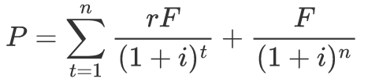

| 程度 | 标记      |
| ---- | --------- |
| 掌握 | &#9734;   |
| 理解 | &Delta;   |
| 了解 | &Omicron; |

# 财务报表

## 现代公司制度

### &Delta; 公司的目标

- 关于公司目标的几种观点：

1. 利润最大化：典型的传统公司目标理论
2. 收入最大化：与公司规模的扩大有直接关系，并不等于公司股东财富最大化或公司利润最大化，很可能导致股东无法对经理行使控制权
3. 管理目标
4. 社会福利目标
5. 股东财富最大化：

### &Delta; 委托-代理理论

#### 股东与管理者

#### 股东与债券人

- 管理者损害债权人的利益的常见做法：

1. 提高财务杠杆比率
2. 投资比债权人风险预期高的项目
3. 增加股利支付

- 为了防止利益受到损害，债权人往往在借款合同中加入限制性条款

#### 股东与社会责任

## 财务报表分析

 

## 比率分析

### 反映偿债能力的指标

#### &#9734; 流动比率

- 流动比率是流动资产与流动负债的比值。

$$
流动比率 = 流动资产 / 流动负债
$$

- 流动比率在一定程度上反映了企业偿还短期债务的能力。一般认为，生产企业合理的流动比率为2（流动性越强，盈利性越弱）。

| 流动资产 | 流动负债 |
| -------- | -------- |
| 现金     | 短期借款 |
| 应收票据 | 应付票据 |
| 应收账款 | 应付账款 |
| **存货** |          |

| 非流动资产 | 非流动负债 |
| ---------- | ---------- |
| 固定资产   | 长期借款   |
| 在建工程   | 应付债券   |
| 无形资产   | 长期应付款 |

#### &#9734; 速动比率

- 速动比率是从流动资产当中扣除存货部分后与流动负债的比值

$$
速动比率 = (流动资产 - 存货) / 流动负债
$$

- 速动比率是进一步反映了企业偿债能力的指标。一般任务，速动比率为1时合适。

### 反映营运能力的指标

#### &Delta; 存货周转率和存货周转天数

- 存货周转率是衡量和评价企业购入存货、投入生产、销售找回等各环节管理状况的综合性指标。

$$
存货周转率 = 销货成本 / 平均存货 \\
存货周转天数 = 360 / 存货周转率
$$

- 一般来说，存货周转次数越多，周转天数越少，存货周转速度越快，存货的占用越低，流动性就越强，存货转换为现金或应收账款的速度越快，存货管理的业绩就好，显示出良好的短期偿债能力和盈利能力。

#### &Delta; 固定资产周转率

- 固定资产周转率（固定资产利用率）：企业销售收入与固定资产净值的比率。

$$
固定资产 = 销售收入 / 平均资产总额
$$

- 固定资产周转率主要用于分析堆厂房、设备等固定资产的利用效率，比率越高，利用率越高，管理水平越好。

#### &Delta; 总资产周转率

- 总资产周转率是销售收入与平均资产总额的比率。

$$
总资产周转率 = 销售收入 / 平均资产总额
$$

- 总资产周转率反映资产总额的周转速度。周转越快，资产利用效果越好，销售能力越强，进而反映出企业的偿债能力和盈利能力令人满意。

#### 应收账款周转率

$$
应收账款周转率 = 销售收入 / 应收账款平均余额
$$

### 盈利能力比率

#### &#9734; 销售毛利率

- 销售毛利率：毛利与销售收入的比值，毛利是销售收入与销售成本的差。

$$
销售毛利率 = (销售收入 - 销售成本) / 销售收入
$$

- 销售毛利率表示每一元销售收入扣除销售产品或商品成本后，有多少钱可以用于各项期间费用和形成盈利。毛利率是企业销售净利率的最初基础。

#### &#9734; 销售净利率

- 销售净利率是指净利润与销售收入的比值。

$$
销售净利率 = 净利润 / 销售收入(净值)
$$

- 销售净利率反映每一元销售收入带来的净利润的多少，表示销售收入的收益水平。

#### &Omicron; 资产收益率

- 资产收益率：企业净利润与平均资产总额的比值

$$
资产收益率 = 净利润 / 平均资产总额
$$

- 资产收益率表示企业资产利用的综合效果，指标越高，表明资产利用率越高

#### &#9734; 净资产收益率 ROE

- 净资产收益率（ROE）是净利润与平均股东权益（平均净资产、所有者权益、股东权益）的比值

$$
净资产收益率 = 净利润 / 平均固定权益
$$

- 净资产收益率反映股东权益的收益水平，指标值越高，说明投资带来的收益越高。

### 反映投资收益的指标

#### &Omicron; 市盈率

- 市盈率：每股市价与每股盈利的比值

$$
市盈率 = 每股市价（股票的市场价格） / 每股收益
$$

- 市盈率是衡量股份制企业盈利能力的重要指标，用每股盈余与股价比较，反映投资者对每元利润所愿支付的价格。

$$
每股盈余 = (净利润 - 优先股股利) / 普通股股利
$$

#### &Omicron; 市净率

- 市净率：将每股净资产和每股市价联系起来

$$
市净率 = 每股市价 / 每股净资产
$$

- 市价越是高于其账面价值，公司资产的质量越好，优质股票的市净率普遍较高

### &#9734; 反映资产负债指标

#### 负债比率

#### 股东权益比率

#### 权益乘数

- 权益乘数越大，股东所投入的资本在资产总额所占的比例越小。

$$
权益乘数 = 资产总额 / 股东权益总额
$$

# 投资决策

## 价值衡量

### &#9734; 货币的时间价值

- 货币的时间价值：货币在不同的时点上具有不同的价值。

1. 从全社会来看，货币的时间价值是在不考虑风险及通货膨胀条件下，由全社会平均的资金利润率决定。
2. 从定量上分析，货币的时间价值实质上是在不考虑通货膨胀条件下全社会平均的无风险报酬率。

- 现值（P）、终值（S）、利息/年金（A）、利率（i）、年数（n）

| 系数         | 公式        | 计算              |
| ------------ | ----------- | ----------------- |
| 复利终值系数 | (S/P, i, n) | S = P (S/P, i, n) |
| 复利现值系数 | (P/S, i, n) | P = S (P/S, i, n) |
| 年金终值系数 | (S/A, i ,n) | S = A (S/A, i, n) |
| 年金现值系数 | (P/A, i, n) | P = A (P/A, i, n) |

- 递延年金现值 P = A (P/A, i, n)(P/S, i, m)，先求出n期的年金现值，再求出m期的复利现值

 

    
现有本金2000元，年利率为8%，每年计息一次，到期一次还本付息，则第5年末的本利和是多少？

    S = P(P/S, i, n) = 2000(S/P, 8%, 5)

 

     
假设企业按10%的年利率取得贷款100 000元，要求在6年内每年年末等额偿还，则每年的偿付金额应为多少元？

     由S = A(S/A, i, n)，得 100 000 = A(S/A, 10%, 6)
 

    
有一项现金，前3年无流入，后5年每年年末流入500万元，年利率为10%，其现值为多少？

    P = A(P/A, i, n)(P/S, i, m) = 500(P/A, 10%, 5)(P/S, 10%, 3)

### &Delta; 债券估价

- 债券的理论价格/现价（P）、市场利率/必要报酬率（i）、债券的面值（F）、债券的票面利率（r）

|债券类型|公式|
|--|--|
|附息债券的估价|利息支付次数（n） |
|一次还本付息债券的估价|持有剩余期间的期数（n）、整个计息期间的期数（m），新发行债券m=n |
|永久性债券的估价|类似于永续年金 |

    
某公司拟于2014年4月1日购买一张面额1000元的债券，其票面利率为12%，每年4月1日计算并支付一次利息，并于5年后的3月31日到期。市场利率为10%，债券的市价为1080元，问是否值得购买该债券？

     
    由上式计算，得到该债券的理论价值P=1075.84 &lt; 1080，不值得购买。

    
某债券面值1000元，期限10年，票面利率为10%，市场利率为8%，到期一次付息，如在发行时购买，多高的价格是可接受的？

     
    由上式计算得到该债券的理论价值P=1201.4，即为可接受的最高价格。

### &#9734; 股票估价

- 股票价格（P）、每年的股利（D）、折现率（r）、第t期

| 股票估价模型                                                 | 公式                                                       |
| ------------------------------------------------------------ | ---------------------------------------------------------- |
| 股利零增长，且长期持有                                       |   |
| 各年的股利增长率都不同，且长期持有                           |  |
| &#9734; 股票以某种固定比率增长，且长期持有                   |   |
| 前若干年股利增长不等，但经过一定年份（m+1期开始增长）， 股利又按某一固定比率（g）增长，且长期持有 |  |
| 股利在前若干期呈某一固定的较高比率（g1）快速增长， 而在之后（m+1期）则以另一较低的固定比率（g2）增长 |  |
| 若打算转让                                                   |                                                            |

    
某公司优先股每年可分得股息0.5元，要想获得每年8%的收益，股票的价格最高为多少？

    P = D / r = 0.5 / 8%

    
某公司必要报酬率为15%，第一年支付的股利为2元，股利的年增长率为11%，则股票的理论价格为多少？

    P = D1 / (r - g) = 2 / (15% - 11%) 

    
某公司目前普通股的每股股利为1.8元，公司预期以后的4年股利将以20%的比率增长，再往后则以8%的比率增长，投资者要求的报酬率为16%，请计算该普通股的每股理论价值。

    

    
某公司的普通股基年股利3元，估计股利年增长率为8%，期望收益率为15%，打算3年以后转让出去，估价转让价格为20元，试计算该普通股的理论价格。

    

## 风险衡量

### &#9734;系统性风险与非系统性风险

| 风险类型                       | 特点                                                         |
| ------------------------------ | ------------------------------------------------------------ |
| 非系统性风险（公司的特有风险） | 通过投资分散化，可以化解非系统性风险                         |
| 系统性风险（市场风险）         | 但投资组合中必然会有一部分风险不能化解，即系统性风险，&beta;系数 |

### &#9734; 资本资产定价模型（风险与收益理论）

#### 收益者角度

- &beta;值越高，表明单个证券的风险越高，所得到的补偿（风险收益率）也就越高

 

#### 成本角度

 

## 公司资本成本

### 资本成本（个别资本成本）

 

#### 债务资本成本

##### &#9734; 银行借款成本 Kl

 

##### &#9734; 债券成本 Kb

 

#### 优先股成本 Kp

 

#### &Omicron; 普通股成本 Ks

##### 固定股利

 

##### 固定增长股利

 

#### &Omicron; 留存收益成本 Ke

- 留存收益成本是公司交纳所得税后形成的，其所有权属于股东，属于内部筹资，没有筹资费用。留存收益成本基于普通股而计算。

##### 固定股利

 

##### 固定增长股利

 

### 加权平均资本成本 WACC

 

## &#9734; 净现值法 NPV

 

### 项目现金流估算

$$
现金流 = 当年净利润 + 当年折旧
$$

### 折旧计算

- 折旧：需要先扣除残值，而资产化利息计入固定资产

1. 直线计提法：总固定资产 / 年数

## &Delta; 回收期法

$$
回收期 = 净投资额 / 年净现金流
$$

- 静态回收期没有考虑到整个项目的现金流，忽略了货币的时间价值

### &Delta; 内部收益率法 IRR

- 内部收益率（IRR）：令净现值为0的贴现率。

 

- 内部收益率不是一个实际报酬率，不受资产市场上利率的影响，反映了项目的内在特征。当项目的资本成本小于内部收益率时，项目的净现值为正；内部收益率高的项目优于内部收益率小的项目。
- 若IRR和NPV不一致，优先选择NPV，NPV是最直接正确的。

# 融资决策

## 企业的长期融资渠道

### &Omicron; 股票

- 股票的种类：
- 优先股：优先于普通股获得固定的股利；破产和清算时，优先于普通股获得剩余资产的权利；优先于普通股参与分红。

### &Delta; 股权和债务的比较

1. 收益的固定性不同：
2. 索偿权的顺序不同：
3. 管理权限不同：
4. &#9734; 税收优惠不同（利息的减税效应）：

# 财务计划

## 股利

### &#9734; 股票股利

- 股票股利是上市公司以本公司的股票代替现金向股东分红的方式，属于无偿增资发行股票。
- 股票股利虽然不影响公司现金流出量，不改变所有者权益总额，但增加了股本数量，引起所有者权益构成项目的变化。

    
假定公司股票面额为1元，已发行5 000 000股。该公司宣布发放股票股利，每10股送1股，公司股票定价为22元。发行股票股利前所有者权益构成： 

    发行股票后的所有者权益构成： 
     
    公司将发放500 000股普通股票股利，每股1元，共计500 000元，资本公积因股票溢价将增加10 500 000元，即(22 - 1)*500000；其中22-1为溢价，即股票市价 - 面额。 
    股本增加 5000000*(1/10)*1，即发行的股票股利 
    发放股利的变化： 
    

## 长期财务计划

### 销售百分比法

- 销售百分比法建立在资产负债表、利润表和销售相关性的基础上。销售预测是资金需要量的可靠出发点。假定企业资产负债表上各项目同销售收入保持一定的百分比关系（线性相关），如果已经预测销售收入的变动，就可测算出企业的资金需要量（筹资）。

EF（资金需要量的筹集） = 资产增加 - 负债增加 - 留存收益增加

1. EF为正数，公司需要向外界筹集该数量的资金。
2. EF为负数，公司剩余该数量的资金，不需要向外界筹资，而是利用该资金。

## 短期财务计划

### 营运资本

- 营运资本影响企业的收益和风险，营运资本越紧缩，企业的收益和风险越大。

### 现金预算