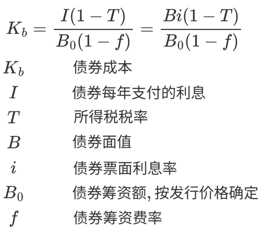

# 财务报表

## 财务报表分析

 

## 比率分析

### 反映偿债能力的指标

#### 流动比率

- 流动比率是流动资产与流动负债的比值。

$$
流动比率 = 流动资产 / 流动负债
$$

- 流动比率在一定程度上反映了企业偿还短期债务的能力。一般认为，生产企业合理的流动比率为2（流动性越强，盈利性越弱）。

| 流动资产 | 流动负债 |
| -------- | -------- |
| 现金     | 短期借款 |
| 应收票据 | 应付票据 |
| 应收账款 | 应付账款 |
| **存货** |          |

| 非流动资产 | 非流动负债 |
| ---------- | ---------- |
| 固定资产   | 长期借款   |
| 在建工程   | 应付债券   |
| 无形资产   | 长期应付款 |

#### 速动比率

- 速动比率是从流动资产当中扣除存货部分后与流动负债的比值

$$
速动比率 = (流动资产 - 存货) / 流动负债
$$

- 速动比率是进一步反映了企业偿债能力的指标。一般任务，速动比率为1时合适。

### 反映营运能力的指标

#### 存货周转率和存货周转天数

- 存货周转率是衡量和评价企业购入存货、投入生产、销售找回等各环节管理状况的综合性指标。

$$
存货周转率 = 销货成本 / 平均存货 \\
存货周转天数 = 360 / 存货周转率
$$

- 一般来说，存货周转次数越多，周转天数越少，存货周转速度越快，存货的占用越低，流动性就越强，存货转换为现金或应收账款的速度越快，存货管理的业绩就好，显示出良好的短期偿债能力和盈利能力。

#### 总资产周转率

- 总资产周转率是销售收入与平均资产总额的比率。

$$
总资产周转率 = 销售收入 / 平均资产总额
$$

- 总资产周转率反映资产总额的周转速度。周转越快，资产利用效果越好，销售能力越强，进而反映出企业的偿债能力和盈利能力令人满意。

#### 应收账款周转率

$$
应收账款周转率 = 销售收入 / 应收账款平均余额
$$

### 盈利能力比率

#### 销售净利率

- 销售净利率是指净利润与销售收入的比值。

$$
销售净利率 = 净利润 / 销售收入(净值)
$$

- 销售净利率反映每一元销售收入带来的净利润的多少，表示销售收入的收益水平。

#### 净资产收益率

- 净资产收益率是净利润与平均股东权益的比值

$$
净资产收益率 = 净利润 / 平均固定权益(平均净资产)
$$

- 净资产收益率反映股东权益的收益水平，指标值越高，说明投资带来的收益越高。

### 反映投资收益的指标

### 杠杆

#### 权益乘数

- 权益乘数越大，股东所投入的资本在资产总额所占的比例越小。

$$
权益乘数 = 资产总额 / 股东权益总额
$$

# 投资决策

## 价值衡量

### 货币的时间价值

- 货币的时间价值：货币在不同的时点上具有不同的价值。

1. 从全社会来看，货币的时间价值是在不考虑风险及通货膨胀条件下，由全社会平均的资金利润率决定。
2. 从定量上分析，货币的时间价值实质上是在不考虑通货膨胀条件下全社会平均的无风险报酬率。

- 现值（P）、终值（S）、利息/年金（A）、利率（i）、年数（n）

| 系数         | 公式        | 计算              |
| ------------ | ----------- | ----------------- |
| 复利终值系数 | (S/P, i, n) | S = P (S/P, i, n) |
| 复利现值系数 | (P/S, i, n) | P = S (P/S, i, n) |
| 年金终值系数 | (S/A, i ,n) | S = A (S/A, i, n) |
| 年金现值系数 | (P/A, i, n) | P = A (P/A, i, n) |

- 递延年金现值 P = A (P/A, i, n)(P/S, i, m)，先求出n期的年金现值，再求出m期的复利现值

 

    
现有本金2000元，年利率为8%，每年计息一次，到期一次还本付息，则第5年末的本利和是多少？

    S = P(P/S, i, n) = 2000(S/P, 8%, 5)

 

     
假设企业按10%的年利率取得贷款100 000元，要求在6年内每年年末等额偿还，则每年的偿付金额应为多少元？

     由S = A(S/A, i, n)，得 100 000 = A(S/A, 10%, 6)
 

    
有一项现金，前3年无流入，后5年每年年末流入500万元，年利率为10%，其现值为多少？

    P = A(P/A, i, n)(P/S, i, m) = 500(P/A, 10%, 5)(P/S, 10%, 3)

### 债券估价

- 债券的理论价格/现价（P）、市场利率/必要报酬率（i）、债券的面值（F）、债券的票面利率（r）

|债券类型|公式|
|--|--|
|附息债券的估价|利息支付次数（n） |
|一次还本付息债券的估价|持有剩余期间的期数（n）、整个计息期间的期数（m），新发行债券m=n |
|永久性债券的估价|类似于永续年金 |

    
某公司拟于2014年4月1日购买一张面额1000元的债券，其票面利率为12%，每年4月1日计算并支付一次利息，并于5年后的3月31日到期。市场利率为10%，债券的市价为1080元，问是否值得购买该债券？

     
    由上式计算，得到该债券的理论价值P=1075.84 &lt; 1080，不值得购买。

    
某债券面值1000元，期限10年，票面利率为10%，市场利率为8%，到期一次付息，如在发行时购买，多高的价格是可接受的？

     
    由上式计算得到该债券的理论价值P=1201.4，即为可接受的最高价格。

### 股票估价

- 股票价格（P）、每年的股利（D）、折现率（r）、第t期

| 股票估价模型                                                 | 公式                                                       |
| ------------------------------------------------------------ | ---------------------------------------------------------- |
| 股利零增长，且长期持有                                       |   |
| 各年的股利增长率都不同，且长期持有                           |  |
| 股票以某种固定比率增长，且长期持有                           |   |
| 前若干年股利增长不等，但经过一定年份（m+1期开始增长）， 股利又按某一固定比率（g）增长，且长期持有 |  |
| 股利在前若干期呈某一固定的较高比率（g1）快速增长， 而在之后（m+1期）则以另一较低的固定比率（g2）增长 |  |
| 若打算转让                                                   |                                                            |

    
某公司优先股每年可分得股息0.5元，要想获得每年8%的收益，股票的价格最高为多少？

    P = D / r = 0.5 / 8%

    
某公司必要报酬率为15%，第一年支付的股利为2元，股利的年增长率为11%，则股票的理论价格为多少？

    P = D1 / (r - g) = 2 / (15% - 11%) 

    
某公司目前普通股的每股股利为1.8元，公司预期以后的4年股利将以20%的比率增长，再往后则以8%的比率增长，投资者要求的报酬率为16%，请计算该普通股的每股理论价值。

    

    
某公司的普通股基年股利3元，估计股利年增长率为8%，期望收益率为15%，打算3年以后转让出去，估价转让价格为20元，试计算该普通股的理论价格。

    

## 风险衡量 资本资产定价模型（风险与收益理论）

- &beta;值越高，表明单个证券的风险越高，所得到的补偿（风险收益率）也就越高

 

## s公司资本成本

### 资本成本（个别资本成本）

 

#### 债务资本成本

##### 银行借款成本 Kl

 

##### 债券成本 Kb

 

#### 优先股成本 Kp

 

#### 普通股成本 Ks

##### 固定股利

 

##### 固定增长股利

 

#### 留存收益成本 Ke

- 留存收益成本是公司交纳所得税后形成的，其所有权属于股东，属于内部筹资，没有筹资费用。留存收益成本基于普通股而计算。

##### 固定股利

 

##### 固定增长股利

 

### 加权平均资本成本 WACC

 

## 净现值法 NPV

 

### 项目现金流估算

$$
现金流 = 当年净利润 + 当年折旧
$$

### 折旧计算

# 财务计划

## 长期财务计划

### 销售百分比法

- 销售百分比法建立在资产负债表、利润表和销售相关性的基础上。销售预测是资金需要量的可靠出发点。假定企业资产负债表上各项目同销售收入保持一定的百分比关系（线性相关），如果已经预测销售收入的变动，就可测算出企业的资金需要量（筹资）。

EF（资金需要量的筹集） = 资产增加 - 负债增加 - 留存收益增加

1. EF为正数，公司需要向外界筹集该数量的资金。
2. EF为负数，公司剩余该数量的资金，不需要向外界筹资，而是利用该资金。

## 短期财务计划

### 营运资本

- 营运资本影响企业的收益和风险，营运资本越紧缩，企业的收益和风险越大。

### 现金预算