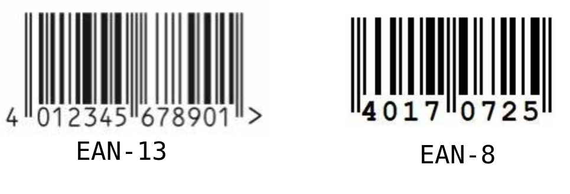
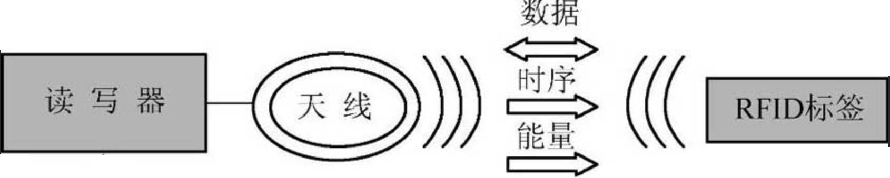
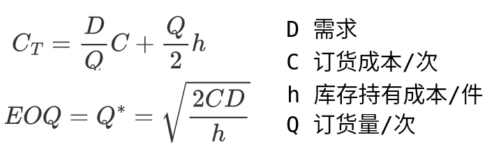

# 物流管理概述

## 物流概述

### &#9734; 物流的概念

- 物流概念的提出起源于军事领域（后勤、第二次世界大战期间的美国）

> 军事物流 \>\< 分销物流

1. 商流：商品所有权（观念）
2. 物流：实体

- &#9734; 2001年8月1日，我国首次颁布并实施了《物流术语》国家标准：“物流是物品从供应地向接收地的实体流动过程，根据实际需要，将运输、存储、装卸、搬运、包装、流通加工、配送、信息处理等基本功能实施有机结合”。
- 2002年1月，CLM的“02”定义：“物流是供应链过程的一部分，是对货物、服务及相关信息从起源地到消费地的有效率、有效益的正向和反向流动和储存进行计划、执行和控制，以满足顾客要求”。
- 2005年1月1日，CLM正式更名为CSCMP（供应链专业管理协会，Council of Supply Chain Management Prossionals），意味着全球进入供应链时代。

### 物流的功能

- 物流具体包括运输、仓储、流通加工、包装、装卸搬运（装卸、搬运）、配送、信息处理七大功能

1. 运输：空间效用
2. 仓储：时间效用
3. 流通加工：形质效用，不创造价值，而是升值
4. 包装：保护商品
5. 装卸搬运：装卸是指改变物品的存放、支承状态的活动；而搬运是指改变物品的空间位置的活动。
6. 配送：物流小缩影
7. 信息处理

### 物流的分类

| 分类标准                         | 说明                                                         |
| -------------------------------- | ------------------------------------------------------------ |
| 研究范围                         | 宏观物流（社会物流）、中观物流（企业外部物流）、微观物流（企业内部物流） |
| 地域范围                         | 国际物流、区域物流、城市物流、农村物流                       |
| 活动的范围和性质                 | 供应物流、生产物流、销售物流、回收物流（逆向物流）、废弃物物流 |
| 经营模式 物流活动的执行主体 | 自营物流（第一方物流、卖方物流） 第二方物流（买方物流） 第三方物流（合同物流）：由供方和需方以外的物流企业提供物流服务 第四方物流：解决方案提供 |
| 功能结构                         | 运输功能子系统、仓储功能子系统、流通加工功能子系统、包装功能子系统、 装卸搬运功能子系统、配送功能子系统、信息处理功能子系统 |

### 物流的作用与价值

- 物流的价值（效用）

1. 物流创造时间价值：缩短时间创造价值、弥补时间差创造价值、延长时间差创造价值。
2. 物流创造场所价值（空间效用）：从集中生产场所流入分散需求场所创造价值、从分散生产场所流入集中需求场所创造价值、从低价值生产地流入高价值需求地。
3. 物流操作加工价值（性质效用）

## 物流管理理论

### &#9734; 主要的理论与学说

1. 黑大陆学说：1962年，美国的彼得·德鲁克提出“流通是经济领域的黑暗大陆”，在流通领域中，物流活动的模糊性尤为突出。
2. 物流冰山说：日本早稻田大学的西泽修教授，把物流成本比作一座冰山。
3. 第三利润源学说：日本早稻田大学的西泽修教授，第一利润源是物质资源（劳动对象）；第二利润源是劳动力资源（劳动者）；第三利润源是物流（劳动工具）。
4. 效益背反说：物流系统的各功能要素之间存在着损益的矛盾，某一个功能要素发生优化，产生效益的同时，必然会使另一个或另几个功能要素的利益遭受损失。
5. 成本中心说：通过物流活动的合理化和物流管理的有效化来帮助企业降低成本，即物流是主要成本的产生点、降低成本的关注点、降低成本的宝库等。
6. 服务中心说：认为物流活动的最大作用在于提供企业服务用户的水平，进而增强企业的竞争能力。
7. 物流战略说：物流更具有战略性，是企业发展的战略。
8. 物流森林学说：总体效益最优。

### &#9734; 物流管理的目标和内容

- 物流管理的目标在于通过对物流活动的有效管理发挥物流“第三利润源”的作用，帮助企业创造利润。
- &#9734; 其定义为：为达到既定的目标，对物流的全过程进行计划、组织、协调与控制。
- &#9734; 物流管理的目标：

1. 服务最优
2. 快速反应
3. 总成本最低
4. 库存合理化
5. 物流质量最优

- 物流管理的内容：

1. 需求预测
2. 采购与供应商管理
3. 运输管理
4. 仓储管理
5. 客户服务
6. 其他物流活动的管理

### 现代物流管理的特征和发展趋势

- 现代物流管理的特征：

1. 以客户满意为第一目标
2. 以整体最优为目标
3. 以信息管理为中心
4. 注重近期效率，更注重远期效果

- 现代物流管理的发展趋势：智慧物流、国际物流、共同配送

1. 信息化
2. 国际化
3. 专业化
4. 协同化
5. 可持续化

# 供应链管理概述

## 供应链与供应链管理

### &#9734;  供应链 Supply Chain 

- 供应链（价值链、增值）（2006年）：生产及流通过程中，涉及将产品或服务提供给最终用户所形成的网链结构。
- &#9734; 供应链是围绕核心企业，通过对信息流、物流、资金流的控制，从采购原材料开始，制成中间产品以及最终产品，最后由销售网络把产品送到消费者手中的将供应商、制造商、分销商、零售商，直到最终用户连成一个整体的功能网链结构模式。
- 4P：Product、Presense、People、Process
- 传统管理模式（纵向一体化）：传统上常采用的策略是扩大自身规模，或参股到供应商企业（所有关系），“大而全”、“小而全”的经营方式。
- &#9734; 传统管理模式的弊端：

1. 增加企业投资负担
2. 承担丧失市场时机的风险
3. 迫使企业从事小而不擅长的业务活动
4. 企业在每个业务领域都直接面临众多竞争对手
5. 加大企业的行业风险

- 供应链管理模式（横向一体化）：只抓企业发展中最核心的东西（产品和市场），分散网络化制造、开放式。
- &#9734; 供应链的特征：

1. 复杂性：同一个供应链上的主体有不同目标（供需匹配）
2. 动态性
3. 交叉性
4. 面向用户需求：用户的需求拉动是供应链中信息流、产品/服务流、资金流运作的驱动源。（四流：商流、物流、资金流、信息流）

- 供应链失调（复杂性）：牛鞭效应（需求变异放大）、多重预测。

### &#9734; 供应链管理

- &#9734; 供应链管理的目标：4R，正确的产品、地点、时间、价格。（1）最大化客户服务水平；（2）最小化供应链运营成本。
- &#9734; 供应链管理（21年定义）：从供应链整体目标出发，对供应链中采购、生产、销售各环节的商流、物流、信息流以及资金流进行统一计划、组织、协调、控制的活动和过程。

1. 信息管理
2. 客户管理
3. 库存管理
4. 关系管理

- 供应链管理和物流管理的关系：物流管理是供应链管理的重要组成部分。

## &Delta; 供应链的类型与构建

### 供应链的主要类型（运作模式）

#### 供应链的功能

| 比较内容     | 响应式供应链                       | 效率性供应链                           |
| ------------ | ---------------------------------- | -------------------------------------- |
| 基本目标     | 尽可能对不可预测的需求作出快速反应 | 以最低的成本供应可预测的需求           |
| 制造的核心   | 配置多余的缓冲库存                 | 保存高效的平均利用率                   |
| 库存策略     | 部署好零部件和成品的缓冲库存       | 产生高收入而使整个供应链的库存最小化   |
| 提前期       | 大量投资以缩短提前期               | 在不增加成本的前提下，尽可能缩短提前期 |
| 供应商标准   | 以速度、柔性和质量为核心           | 以成本和质量为核心                     |
| 产品设计策略 | 模块化设计以尽可能延迟产品差异     | 绩效最大化而成本最小化                 |

#### 供应链驱动力的来源

| 评价标准 | 推动式供应链 | 拉动式供应链 | 推拉结合式 |
| -------- | ------------ | ------------ | ---------- |
| 集成度   | 低           | 高           |            |
| 库存水平 | 高           | 低           |            |
| 响应速度 | 慢           | 快           |            |

# 物流信息技术
- 物流信息（Logistics Information）是反映物流各种活动内容的知识、资料、图像、数据、文件的总称。
- 物流信息技术（Logistics Information Technology）是指现代信息技术在物流各个作业环节中的应用，以计算机和现代通信技术为主要手段实现对物流各环节中信息的获取、加工、传递和利用等功能的技术总称。

 ## 条码技术
- 条码（Barcode）是一组按一定编码规则排列的条、空以及对应的字符、数字及符号组成的可表示一定信息的标记。
- 条码是迄今为止最经济、实用的自动识别技术：

1. 输入速度快
2. 可靠性高
3. 采集信息量大
4. 灵活实用

 ### &#9734; EAN码
- EAN码是国际物品编码协会制定的国际通用商品代码；而UPC码是美国统一编码委员会（UCC）制定的通用商品代码。

 

#### EAN-13

P1 P2 P3   M1 M2 M3 M4     I1 I2 I3 I4   C

- P1 P2 P3：前缀码，由国际物品编码协会分配给其的成员国家或地区代码，我国是690\~695。
- M1 M2 M3 M4：厂商识别码
- I1 I2 I3 I4：商品项目码，代表具体的商品项目，由厂商自主分配
- C 校验码位：（偶数位的数字之和 \* 3 + 奇数位的数字之和）取个位X，若X=0，则C=0；若X&ne;0，则C=10-X

#### EAN-8

P1 P2 P3   I1 I2 I3 I4   C

 ## EDI

- EDI（电子数据交换，Electronic Data Interchange）是用户的计算机系统之间的对结构化、标准化的信息进行自动传送和自动处理的过程。

1. 减少了纸张文件的使用，从而降低了企业成本
2. 减少了许多重复劳动，提高了工作效率
3. 贸易双方能够以更迅速、有效的方式进行贸易，大大简化了订货过程或存货过程
4. 可以改善贸易双方的关系，货运代理商可以简化大量的出口文书工作，商业用户可以提高存货的效率，提高竞争能力。

 ## &#9734; RFID
- RFID（电子标签、无线射频识别 Radio Frequency Identification）：非接触式的自动识别技术，通过射频信号自动识别目标对象并获取相关数据，在阅读器和电子标签之间进行非接触双向数据传输，以达到目标识别和数据交换的目的。
- &#9734; RFID对比EAN的优点：

1. RFID可以识别单个的非常具体的物体，而不是像条形码那样只能识别一类物体;
2. 其采用无线电射频，可以透过外部材料读取数据，而条形码必须靠激光来读取信息；
3. RFID可以同时对多个物体进行识读，而条形码只能一个一个地读;
4. RFID储存的信息量非常大，并且可以进行反复读写，进行资料更新；
5. 高速移动的情况下，条码的读取受到限制，但是RFID可以进行高速移动读取。

| RFID系统部件       | 说明                                                         |
| ------------------ | ------------------------------------------------------------ |
| 电子标签           | RFID的真正载体                                               |
| 阅读器             | 查询器、读写器、读出装置；有时包含写入标签信息的设备； 提供与标签进行数据传输的途径 |
| 天线               | 用于在标签和读取器之间传递射频信号                           |
| 数据交换与管理系统 |                                                              |

- RFID的工作原理：RFID工作时，读写器通过发射天线发射一定频率的射频信号，随着标签的目标对象进入天线工作区域时产生感应电流，（1 被动式）电子标签凭借感应电流获得能量，发射存储在芯片中的数据信息；或（2 主动式）电子标签主动发射某一频率的射频信号。读写器对接受到的载波信号进行解调和解码后传输到数据管理系统，数据管理系统根据逻辑运算判断电子标签的合法性，针对不同的设置进行相应的处理和控制。

 

- RFID的工作频率广，可用于不同的情景中；低频、高频、超高频、微波。

## GIS和GPS技术

### GIS

- GIS（Geographical information systems，地理信息系统）：以地理空间数据为基础，采用地理模型分析方法，提供多种空间和动态地理信息，为地理研究和地理决策服务的计算机技术系统。

1. 区域性
2. 多维性
3. 动态性

### &#9734; GPS

- GPS（Global positioning systems，全球定位系统）：美国研制；全能性、全球性、全天候、精度高。

| 4个全球定位系统 | 归属   | &#9734; 卫星个数 |
| --------------- | ------ | ---------------- |
| NAVSTAR         | 美国   |                  |
| GLONASS         | 俄联邦 | 26               |
| 伽利略          | 欧洲   | 30               |
| 北斗            | 中国   | 55               |

- GPS的3大子系统：空间卫星系统、地面监控系统、用户接收系统。
- &#9734; 定位原理：至少需要4个卫星同时进行定位；其中，3个卫星定位空间，1个卫星定位时间。

# 物流运输管理

## 物流运输的重要性及功能

- 运输是物品借助于运力在空间上所发生的位置移动。利用载运工具、设施设备及人力等运力资源，使货物在较大空间上产生位置移动的活动。
- 运输系统的功能：

1. 产品和货物的转移功能
2. 产品和货物的存储功能
3. 物理节点的衔接功能：实物转移功能、信息沟通与传递功能

## 物流运输方式及选择

### 运输方式的分类

#### 运输线路

| 运输线路   | 说明                                                         |
| ---------- | ------------------------------------------------------------ |
| 干线运输   | 利用铁路、公路的干线，大型船舶的固定航线进行的长距离、大数量的运输 |
| 支线运输   | 与干线相接的分支线路上的运输                                 |
| 城市内运输 | 干线、支线运输到站后，站与用户仓库或指定接货地点之间的运输   |
| 厂内运输   | 工业企业                                                     |

#### 运输的协作程度

| 协作程度 | 说明                   |
| -------- | ---------------------- |
| 一般运输 |                        |
| 联合运输 | 前提是使用同一运送凭证 |
| 多式运输 |                        |

### &#9734; 运输基本方式及特点

#### &#9734; 公路运输

- 公路运输的优点：

1. 灵活性强，采取“门到门“的运输形式
2. 建设周期短、投资较低，易于因地制宜
3. 中短途运输的速度较快

- 公路运输的缺点：

1. 运输单位一般较小
2. 动力费和劳务费较高，特别是长距离运输缺点显著
3. 环境污染、能耗大

| &#9734; 公路运输类型 | 说明                        |
| -------------------- | --------------------------- |
| 整车运输             | 3吨及以上或体积大的轻泡货物 |
| 零担运输             | 不是整车的                  |
| 集装箱运输           | 货物集中装入标准化集装箱    |
| 包车运输             | 车辆包给托运人使用          |
| 短途                 | 边远落后地区的运输干线功能  |

#### 铁路运输

- 铁路运输的优点：

1. 陆地长距离运输的主要方式，主要承担长距离、大数量的货运
2. 运输成本低、能耗小
3. 行驶速度快
4. 不受其他运输条件的影响

- 铁路运输的缺点：

1. 灵活性差，只能在固定线路上实现运输
2. 货损率较高
3. 投资大、建设周期长

#### &#9734; 水运

- &#9734; 水运主要有沿海运输、近海运输、远洋运输、内河运输四种形式

- 水运的优点：

1. 低成本、大批量、远距离的运输
2. 建设投资少
3. 劳动生产率高

- 水运的缺点：

1. 运输速度慢
2. 受港口、水位、季节、气候影响较大

#### 航空运输

- 航空运输主要采取班机运输、包机运输、集中投运三种方式，以及航空快递。

- 航空运输的优点：

1. 速度快，降低库存
2. 不受地形的限制
3. 货损、货差少
4. 节省包装费用（安全）

- 航空运输的缺点：

1. 运输费用高
2. 载量少
3. 受天气限制

#### 管道运输

- 管道运输是利用管道输送气体、液体、粉状固体的一种运输方式，依靠物体在管道内顺着压力方向循序移动实现，而管道是静止不动的。

- 管道运输的优点：

1. 运量大
2. 占地少
3. 安全、连续性
4. 建设周期短、费用低
5. 成本低、耗能少、效益好

- 管道运输的缺点：

1. 灵活性低
2. 输送地点和输送对象具有局限性

## &#9734; 物流运输路线规划

- 物流运输路线选择的要素：流体、载体、流向、流量、流程、流速、流效。

- 物流运输路线选择的原则：

1. 费用最小原则
2. 动态性原则
3. 简化流程原则
4. 适度原则

### &#9734; 运输路线选择的方法

#### 单一不同起讫点问题

- Dijkstra（最小路线法）对分离、单个起点和终点的网络运输选择问题。

1. dij表示两相邻点i与j的距离，若i和j不相邻，则设置dij=&infin;；而dii=0
2. Lij表示从s点到i点的最短距离

- 从s点到某一点t的最短路径：

1. 从s点出发，Lss=0，将此值标注在s点旁的小方框内，表示s点已标号。
2. 从s点出发，找出与s点相邻的点中距离最小的一个，设为r。将Lsr = Lss + dsr的值标注在r旁的小方框内，表明点r已经标号。
3. 从已标号的点出发，找出与这些点相邻的所有未标号点p。若有Lsp = min\{Lss + dsp; Lsr + drp\}，则对p点标号，并将Lsp的值标注在p点旁的小方框内。
4. 重复第3步，直到t点得到标号为止。

    

        &#9734; 从v1到v7的最短路径 
        
    

    L11 = 0，标号v1 
    L1r = min{L11 + d12; L11 + d13} = 2 = L13，标号v3，描粗d13线 
    L1p = min{L11 + d12; L13 + d35; L13 + d36} = 5 = L12，标号v2，描粗d12线 
    L1p = min{L12 + d24; L12 + d25; L13 + d35; L13 + d36} = 6 = L16，标号v6，描粗d36线 
    L1p = min{L12 + d24; L12 + d25; L16 + d64; L16 + d65; L16 + d67} = 7 = L14 = L15，对v4和v5同时标号，描粗d24、d65线 
    L1p = min{L15 + d57; L16 + d67} = 10 = L17，对v7标号，描粗d57线 
    

#### 多起讫点问题

- 多起讫点问题是指有多个货源地可以同时为多个销售点或市场服务，[产销平衡表](../Mathematics/运输问题.md)。

#### 起讫点重合的问题（旅行推销员问题 TSP）

## 物流合理化

### 运输合理化必须解决的问题

1. 返程或启程空驶
2. 对流运输（相向运输、交错运输）：同一种货物，或彼此间可互相代用而又不影响管理、技术及效益的货物，在同一线路上或平行线路上做相对方向的运送，而与对方运程的全部或部分发生重叠交错的运输。

 

3. 迂回运输
4. 重复运输
5. 倒流运输
6. 过远运输
7. 运力选择不当
8. 托运方式选择不当

### 影响运输合理化的因素

1. 运输距离
2. 运输环节
3. 运输工具
4. 运输时间
5. 运输费用

### 实现运输合理化的途径

1. 提高运输工具实载率
2. 采取减少动力投入、增加运输能力的有效措施求得合理化
3. 发展社会化的运输体系
4. 尽量发展直达运输
5. 配载运输
6. 发展特殊运输技术和运输工具
7. 通过流通加工，使运输合理化

# 库存管理

## &#9734; 库存的概念与分类

- &#9734; 库存（Inventory）是为了满足未来需求而暂时闲置的资源（商品的使用）；而仓储是表示储藏物资，供出口或转运到外埠（中转）。

- 库存的作用：

1. 保证可得性、满意度
2. 降低成本（规模效应），包括生产和流通成本

### 库存的分类

#### 经济用途

1. 流通库存：为了满足生产或消费的需要，补充生产和消费储备的不足而建立的库存。其中有批发商、零售商为了保证供应和销售而建立的商品库存，以及在运输途中的商品。

2. 制造库存：制造商为了满足将来生产的需要，保证生产的顺利进行而建立的物资储备，包括原材料、在制品、半成品、产成品（企业已经全部完工，可供销售的制成品，即未进入流通）。
3. 其他库存

#### 经营过程的角度

1. 经常库存：企业在正常的经营环境下为满足日常的需要而建立的库存，（1）采购折扣；（2）降低货运、物料搬运以及管理成本
2. 在途库存
3. 安全（缓冲库存）：防止需求意外过高和提前期过长（不确定因素），（1）减少销售机会损失、缺货；（2）提高客户服务水平
4. 投机库存：为满足正常需求之外的某种意外需求而准备的库存。对价格波动大的物料在低价时大量采购，回避价格上涨的风险，从商品价格上涨中获利而准备的库存（目的）
5. 促销库存
6. 季节性库存：为了满足特定季节中出现的特点需要而建立的库存，（1）减少加班、分仓；（2）生产线利用率提高
7. 积压库存

## &#9734; 库存管理概述

- &#9734; 库存管理（库存控制），是指对制造业或服务业生产、经营全过程的各种物品、产成品已经其他资源进行管理和控制，使其储备保持在经济合理的水平上，在保障供应的前提下，以库存物品的数量最少和周转最快为目标所进行的计划、组织、协调和控制。
- 库存成本的构成：库存成本的总和是存货总价值的20%左右

1. 订货费用（c）：从需求确认到最终到货，采购等途径获得的费用
2. 库存持有成本：资金、服务、空间、风险成本
3. 缺货成本：销售额损失，紧急应对成本等
4. 补货成本：每采取紧急存货的采购成本

## &#9734; 库存管理方法

### &#9734; ABC库存管理法

- ABC库存管理法利用80/20原则，按重要性程度，将库存物资分为A、B、C三类，实行分级管理。

<table>
    <tr>
        <th colspan="2">分类及管理方法</th>
        <th>A</th>
        <th>B</th>
        <th>C</th>
    </tr>
    <tr>
        <td colspan="2">定额的综合程度</td>
        <td>按品种或规格</td>
        <td>按大类品种</td>
        <td>按该品种总金额</td>
    </tr>
    <tr>
        <td rowspan="2">定额的查定方法</td>
        <td>消耗定额</td>
        <td>技术计算法</td>
        <td>现场查定法</td>
        <td>经验估算法</td>
    </tr>
    <tr>
        <td>周转库存定额</td>
        <td>按库存理论的数学模型计算</td>
        <td>按库存理论的数学模型计算</td>
        <td>经验统计法</td>
    </tr>
    <tr>
        <td colspan="2">检查</td>
        <td>经常检查</td>
        <td>一般检查</td>
        <td>以季或年度检查</td>
    </tr>
    <tr>
        <td colspan="2">统计</td>
        <td>详细统计</td>
        <td>一般统计</td>
        <td>按金额统计</td>
    </tr>
    <tr>
        <td colspan="2">控制</td>
        <td>严格控制</td>
        <td>一般控制</td>
        <td>金额总量控制</td>
    </tr>
    <tr>
        <td colspan="2">安全库存</td>
        <td>控制较低水平</td>
        <td>较大</td>
        <td>允许较高</td>
    </tr>
</table>

### &#9734; 订货点订货法

#### &#9734; 定量订货法 

##### &#9734; 订货点的确定

 

- 订货点：订货时仓库里该品种保有的实际库存量。订货点是决策变量，是直接控制库存水平的关键。
- 订货点要适中，若订货点过高，则库存量过大，占用资金就越多，导致库存费用上升，成本增加；若订货点过低，则可能导致缺货，增加缺货成本，导致对客户的服务水平下降。
- 影响订货点确定的主要因素有需求速率、订货提前期、安全库存。

1. 订货速率（R）：货物需求的速度，单位时间内的需求量。需求速率越高，订货点越高。
2. 订货提前期（TK）：从发出订货单到收到货物为止所需要的时间，取决于供货时间的长短，与产品生产、运输路途远近和运输速度有关。订货提前期越长，订货点越高。
3. 安全库存（QS）：为了防止货物发生短缺而设置的库存。

- 订货点的确定方法：

1. 客户需求速率和订货提前期都稳定不变时（R1 = ··· =Rn，TK1 = ··· = TKn），不需要设置安全库存量（QS = 0），此时：

订货点 = 需求速率 x 订货提前期  = R x TK

2. 客户需求速率和订货提前期变化时（R1 &ne; ··· &ne;Rn，TK1 &ne; ··· &ne; TKn），需要设置安全库存量（QS &ne; 0 ），此时：

订货点 = 订货提前期内平均需求量 + 安全库存 = 平均需求速率 x 平均订货提前期 + 安全库存 = $\overline{R}$ x $\overline{T}$K + QS

##### &#9734; EOQ 经济订货批量模型

 

- 订货批量的确定，EOQ（经济订货批量，Economic Order Quantity）是一定条件下使库存总成本最小的订货量。

1. 假设每次订货的订货费用相同，且与订货批量的大小无关
2. 假设单位物品在单位时间内的保管费用与购买单价成正比
3. 假设单位时间内的需求量不变
4. 订货提前期固定

  

##### &#9734; 库存绩效指标

1. 平均库存投资：一般时间内，所有物品总存货量的平均值
2. 库存周转率：年销售金额 / 平均库存投资
3. 产品满足率、订单满足率：顾客对某产品/订单有需求时，库存库流中有存货/所有产品，且能立刻满足顾客需求的百分比
4. 服务水平：库存满足需求的比率
5. 提前期

## &#9734; 供应链环境下的库存管理策略

### &#9734; 零库存

- &#9734; 零库存：是一种特殊的库存概念，是库存管理的理想状态，并不是指企业所有的原材料、半成品、成品的库存为零，而是在确保企业生产经营活动顺利进行的（物资大部分处于周转）条件下，采用各种科学的管理方法，对库存进行合理的计算和有效的控制，尽可能降低库存量的一种方法。

### &#9734; VMI 供应商管理库存

- &#9734; VMI（供应商管理库存，Vendor Managed Inventory），VMI倾向于获得所有权，风险大；其特点如下：

1. 合作性：相互信任和信息透明
2. 互利性：使双方的成本都得以降低
3. 互动性
4. 协议性：要求企业在观念上达到目标一致
5. 连续改进性：供需双方共享利益和消除浪费

- VMI的优势：

1. 供应商多用户补货：配送间的协调，降低成本
2. 供应商在多个分销商需求基础上预测
3. 减弱信息扭曲
4. 对于分销商，库存管理成本下降。

- &#9734; VMI的实施方法和步骤：

1. 建立客户需求数据库
2. 建立物流网络管理系统
3. 订立供应商与分销商的合作框架协议
4. 组织机构的变革或业务重组

### JMI 联合库存管理

- JMI（联合库存管理，Join Managed Inventory）：供需双方协调，共同进行库存管理和控制，利益共享，风险共担（与VMI的主要区别在于风险）。

- JMI的优点：

1. 减少供应链的需求扭曲现象
2. 实现零库存、准时采购

- JMI的缺点：建立和协调成本较高

- JMI的实施：

1. 建立资源管理系统
2. 建立一种信息沟通的渠道或系统信息共享机制
3. 建立QR（快速反应系统）

4. 发挥第三方物流的作用

### &#9734; 其他3种库存管理策略

| &#9734; 共6种策略   | 说明                                                         |
| ------------------- | ------------------------------------------------------------ |
| 延迟供应策略        | 将商品延迟至客户附近成型，制造中的延迟、物流延迟（地域延迟）、流通加工的延迟 |
| QR（快速反应系统）  | 多频次、小批量配送方式，连续补充商品，缩短交货周期，减少库存 |
| ECR（有效客户反应） | 以满足客户需求和最大限度降低物流过程费用，及时作出准确反应   |

# 配送管理

## 配送的概念

### &#9734; 配送的含义及特点

- &#9734; 《物流术语》配送（Distribution）：在经济合理区域范围内，根据客户要求，对物品进行拣选、加工、包装、分割、组配等作业，并按时送达指定地点的物流活动。

| 概念对比 | 区别                 |
| -------- | -------------------- |
| 运输     | 生产厂&rarr;配送中心 |
| 配送     | 配送中心&rarr;客户   |

### 配送的类别

#### 配送主体所处的行业的不同

1. 制造业配送
2. 农业配送
3. 商业配送
4. 物流企业配送

#### 实施配送节点的不同

1. 配送中心配送
2. 仓库配送
3. 商店配送
4. 生产企业配送

#### 配送企业的专业化程度的不同

1. 综合配送
2. 专业配送

### 配送的运作模式

#### 企业自营型配送模式

- 自营配送模式：企业通过独立组建配送中心，实现内/外部货物的供应与配送。
- 一般适用于规模比较大的企业，对物流的控制能力较强。

#### 第三方配送模式（社会化中介型配送模式）

#### 共同配送模式

- 共同配送：物流企业之间为了提高配送效率以及实现配送合理化所建立的一种功能互补的配送联合体，是一种物流企业之间为实现整体配送合理化，以互惠互利为原则，互相提供便利的物流配送服务的协作型配送模式。

#### 众包配送模式

- 众包配送：需求经过众包平台以订单的形式向目标区域发布，附近的大众参与者通过“抢单”的形式接受配送任务，上门取货和送货到家的门到门服务。

### 配送的业务流程

1. 备货：准备货物的系列活动，它是配送的基础环节。严格来说，备货包括两项具体活动，筹集货物和存储货物。
2. 理货：理货包括货物分拣、配货和包装等经济活动，其中分拣是指采用适当的方式和手段，从储存的货物中选出用户所需货物的活动。
3. 送货：送货是配送活动的核心，也是备货和理货工序的延伸。在物流活动中，送货实际上就是货物的运输。

p157 图7-1

## &#9734; 配送中心

1. 仓库：储存物品的物流场所
2. &#9734; 配送中心：从事配送业务的物流场所或组织，主要为特定的用户服务，配送功能齐全，有完善的信息网络，辐射范围小（靠近消费市场），多品种小批量；以配送为主，储存为辅。
3. 分拨中心：辐射范围大（靠近生产）

### 配送中心的功能

1. 流通行销的功能
2. 仓储保管功能
3. 分拣配送功能
4. 流通加工功能
5. 信息处理功能
6. 结算功能
7. 物流系统设计咨询功能
8. 需求预测功能
9. 物流教育与培训功能

### 配送中心的类型

#### 按运营主体分类

1. 制造商型配送中心
2. 批发商型配送中心
3. 零售商型配送中心
4. 专业物流配送中心

#### 按服务区域和范围分类

1. 城市物流配送中心
2. 区域物流配送中心

#### 按功能分类

1. 储存型配送中心
2. 流通型配送中心（转运型）
3. 加工型配送中心

#### 按隶属关系分类

1. 自有型配送中心
2. 公共型配送中心

### 配送中心管理

#### 质量管理

1. 客户需求（Need）
2. 系统设计（Plan）
3. 作业控管（Do）
4. 服务评核（Check）
5. 分析改善（Action）

#### 作业管理

##### 配送管理

1. 排程与调度
2. 配送与验收
3. 回收品点交

##### 仓储管理

1. 进仓与验收
2. 入库与保管
3. 盘点

##### 信息管理

1. 接单与回单
2. 客户服务
