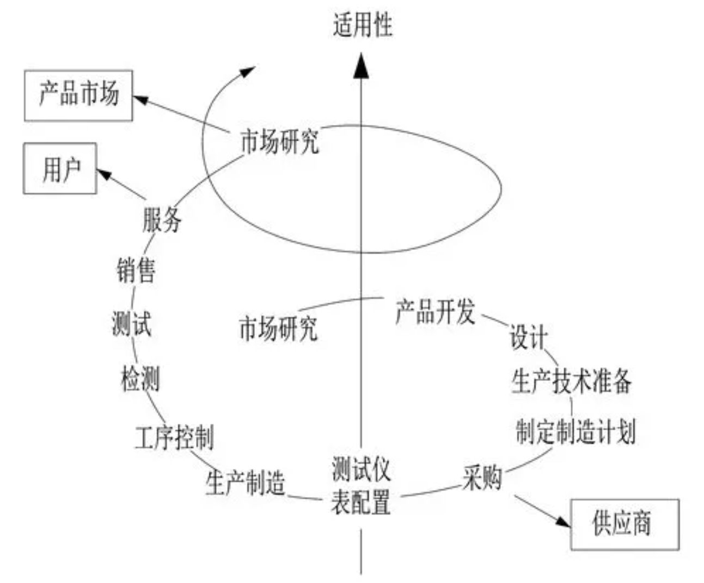
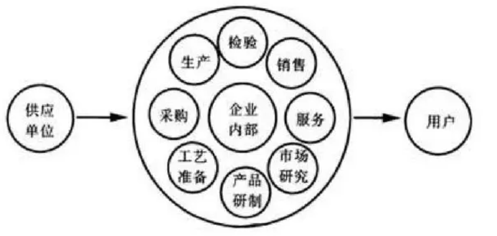
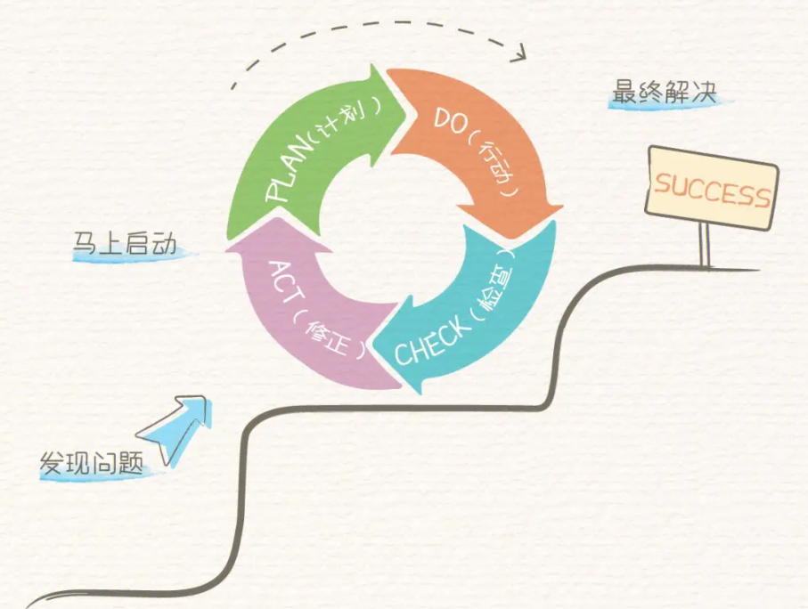
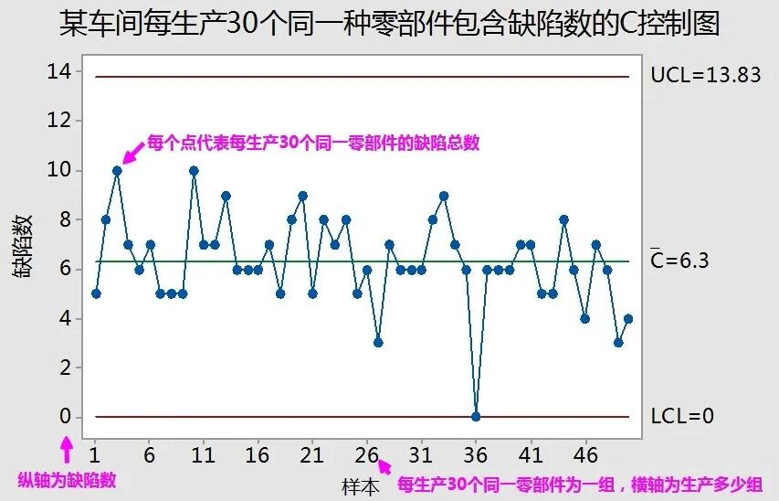

# 运营系统的竞争优势

# 运营系统的规划与设计

# 运营系统的运行与控制

## 质量管理

### 质量管理原理

- 质量：一组固有特性满足要求的程度。
- 质量管理：组织为了使产品质量能够满足不断更新的质量要求，达到顾客满意而开展的策划、组织、实施、控制、检查、审核和改进等所有相关管理活动的总和。

1. 质量方针和质量目标的制定
2. 质量策划
3. 质量控制与质量保证
4. 质量改进与持续改进

#### 质量管理的基本原理

1. 朱兰，质量三部曲和质量螺旋

 

2. L.Sandholm，质量循环

 

3. 戴明，PDCA循环（计划plan、实施do、检查check、处理act）

 

4. 克劳士比，零缺陷：认为任何水平的指令缺陷都不应该存在，质量是免费的。
5. 费根鲍姆，TQM（全面质量管理）
6. 产品生命周期质量管理

 

### 质量管理方法与工具

#### 质量管理方法

1. QFD（质量功能展开、质量屋）
2. 顾客满意度测评
3. QC小组
4. 田口方法

#### 质量管理工具

1. 核查表
2. 分层法
3. 帕累托图
4. 因果分析图（鱼骨图）：以质量特性为结果，以影响质量的因素为原因
5. 直方图：比较直观地看出产品质量特性的分布状态以及工序是否处于受控状态
6. 散点图：两个变量之间的关联性
7. 控制图

### 统计过程控制与过程能力分析

1. 质量检验：检查生产过程中的产品，以判断其可否接受
2. 统计质量控制：根据统计数据判断生产过程的非随机性差异，并分析原因
3. 过程能力分析：判断过程的固有差异是否在判定范围内

#### 控制图

- 控制图：按样本序号或时间顺序绘制的有关产品质量的样本统计量图形，平均数（CL）加减3&sigma;作为上下控制界限（UCL、LCL）。

 

- 控制图的目的是根据控制图中样本的分布形态推断生产过程是否处于受控状态。

1. 样本出界
2. 多个样本接近边界
3. 样本点明显单侧分布
4. 样本点连续上升或下降
5. 连续5个样本点中有3个及以上在同一侧的C区之外
6. 样本点呈现周期性波动

# 运营系统的更新与改善