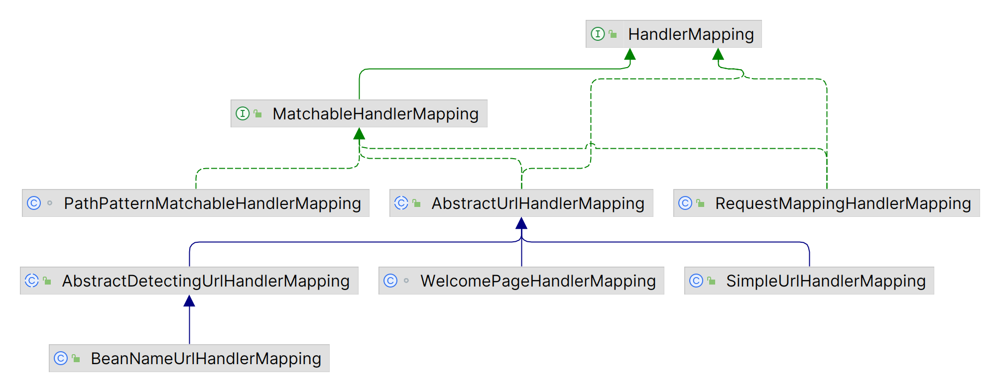
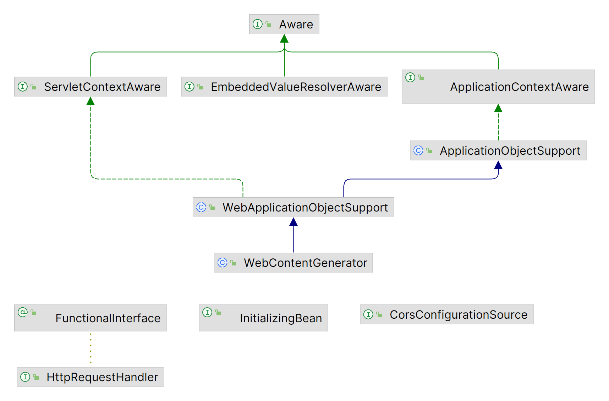

# 控制器概述

| 名称 | @Controller                                                  |
| ---- | ------------------------------------------------------------ |
| 类型 | 类注解                                                       |
| 作用 | 设定SpringMVC的控制器bean<br />返回值放入模型中，并传递给视图渲染 |

| 注解 | @RestController              |
| ---- | ---------------------------- |
| 位置 | 类注解                       |
| 作用 | @Controller \+ @ResponseBody |

# DispatcherServlet

- DispatcherServlet：基于Java Servlet API的前端控制器，它是整个Spring Web MVC框架的核心组件，负责接收、处理和转发所有的HTTP请求。

1. 初始化阶段：在服务器启动后，DispatcherServlet首先会被加载并创建一个新的WebApplicationContext实例，用于管理所有与Spring Web相关的bean。
2. 请求处理阶段：当接收到一个HTTP请求时，DispatcherServlet会根据请求URL、HTTP方法等信息决定由哪个处理器（Handler）来处理这个请求。
3. 分发阶段：确定了处理器之后，DispatcherServlet会调用该处理器的方法，并传递一个代表当前HTTP请求的对象（如HttpServletRequest和HttpServletResponse）作为参数。
4. 响应处理阶段：处理器处理完请求后，通常会返回一个 ModelAndView 对象，DispatcherServlet会根据这个对象的内容生成响应并发送回客户端。
5. 销毁阶段：在服务器关闭或者应用程序退出时，DispatcherServlet会清理资源并销毁WebApplicationContext。

# Handle 处理器

- Model的查找和执行在DispatcherServlet中是解耦的。控制器负责通过HandlerMapping查找Handler，再交由HandlerAdapter处理。

## HandlerMapping 映射器



### URL直接映射

- SimpleUrlHandlerMapping提供了一种简单的方式来定义URL和处理程序之间的映射关系，将特定的URL与特定的处理程序类或方法进行关联，当有请求匹配到指定的URL时，就会调用相应的处理程序进行处理。

```java
@Bean
public SimpleUrlHandlerMapping simpleUrlHandlerMapping(MyHandle myHandle){
    SimpleUrlHandlerMapping mapping = new SimpleUrlHandlerMapping();
    mapping.setOrder(1);
    mapping.setUrlMap(Collections.singletonMap("/simpleUrl",myHandle));
    return mapping;
}
```

### BeanName映射

- BeanNameUrlHandlerMapping将URL与bean名称映射，使用bean名称作为映射的key，将URL与bean名称存储在一个Map中。在处理请求时，它会根据URL查找相应的处理程序bean，并调用处理程序的方法来处理请求。（相当于通过URL来调用该bean）

```java
@Bean(name="/beanNameUrl") //http://localhost:8080/beanNameUrl
public HttpRequestHandler beanNameUrlHandler(){
    return (req,resp) ->{
        resp.getWriter().println("beanNameUrl");
    };
}
```

> - Bean名称映射是指通过在Spring配置文件中指定Bean的名称与其他组件的依赖关系，来实现通过名称来调用Bean的功能。通过在配置文件中设置Bean的名称和依赖关系，可以在代码中通过Bean的名称来获取对应的Bean对象，而无需了解具体的Bean的URL。 
> - 而通过URL来调用Bean是指通过在Web应用中的URL来访问特定的Bean。通过在Web应用的URL中设置特定的参数，可以定位到特定的Bean对象。  
> - BeanNameUrlHandlerMapping是一个实现了Web请求处理器接口的类，它可以根据URL来获取相应的处理Bean。通过将Bean的名称和URL的映射关系定义在配置文件中，可以使用URL来调用对应的Bean。因此，BeanNameUrlHandlerMapping的bean名称映射可以被认为是通过URL来调用该bean的一种方式。

### @RequestMapping

| 注解           | @RequestMapping                                              |
| -------------- | ------------------------------------------------------------ |
| 位置           | 类、方法注解                                                 |
| 作用           | 设置当前控制器方法请求访问路径。<br />@RequestMapping注解控制器类时，与方法上的@XxxMapping的信息合并。 |
| **注解**       | **@GetMapping、@PostMapping、@PutMapping、@DeleteMapping**   |
| 位置           | 方法注解                                                     |
| 作用           | 设置当前控制器方法请求访问路径与请求动作，每种对应一个请求动作。<br />只要访问路径或请求动作有一个不同，就可以使用多个该注解。 |
| **返回值**     | **说明**                                                     |
| String         | 响应的视图名称、重定向到的URL。                              |
| void           | 不需要返回任何响应。                                         |
| ModelAndView   | 响应的视图和模型数据的容器。                                 |
| ResponseEntity | 带有自定义HTTP头和状态代码的HTTP响应。                       |
| 其他类型       | 响应的序列化数据类型。                                       |

```java
@RestController
@RequestMapping("/users")
public class UserController {

//    @RequestMapping(value = "/users", method = RequestMethod.POST)
    @PostMapping
    public String save() {
        System.out.println("user save...");
        return "{'module':'user save'}";
    }

//    @RequestMapping(value = "/users/{id}", method = RequestMethod.DELETE)
    @DeleteMapping("/{id}")
    public String delete(@PathVariable Integer id) {
        System.out.println("user delete..." + id);
        return "{'module':'user delete'}";
    }

//    @RequestMapping(value = "/users", method = RequestMethod.PUT)
    @PutMapping
    public String update(@RequestBody User user) {
        System.out.println("user update..." + user);
        return "{'module':'user update'}";
    }

//    @RequestMapping(value = "/users/{id}", method = RequestMethod.GET)
    @GetMapping("/{id}")
    public String getById(@PathVariable Integer id) {
        System.out.println("user getById..." + id);
        return "{'module':'user getById'}";
    }

//    @RequestMapping(value = "/users", method = RequestMethod.GET)
    @GetMapping
    public String getAll() {
        System.out.println("user getAll...");
        return "{'module':'user getAll'}";
    }
}
```

#### RequestMappingHandlerMapping

- RequestMappingHandlerMapping负责解析HTTP请求的URL，遍历所有@RequestMapping的信息，寻找条件属性与请求信息最匹配的@RequestMapping作为最终的处理器方法。

#### RequestCondition接口 属性规则

- @RequestMapping的每个条件都是RequestCondition接口的实现，每个属性都有以下特性类型。

1. 匹配规则：与请求的匹配逻辑。
2. 多值匹配规则：属性数组提供多个值时的匹配逻辑。
3. 合并规则：方法与类型上的属性合并规则。
4. 排序规则：该请求有多个注解的属性匹配时，对匹配结果的排序规则。
5. 若注解中的属性没有提供值，则不对该条件过滤（任意请求都匹配）。

##### path 请求路径

- 在@RequestMapping中，path和value互为别名（@AliasFor("path") 注解属性别名机制）。
- @Request会自动为path路径匹配加上“/”，若已经存在“/”，则不添加。

```java
// 匹配所有路径的请求
@Request

// 匹配根路径请求
@Request("/")

// 匹配/path1的请求
@Request("path1")

// 匹配/path1或/path2的请求
@Request({"path1","path2"})

//类@RequestMapping("/home")搭配方法@XxxMapping("/design")：请求映射为/home/design。
```

- 路径模式支持方法和类级别的注解，同时出现时，对二者进行合并。

1. path属性在类和方法上的注解都指定，则拼接路径。
2. path属性只在方法/类上的注解指定，则以方法/类上的path为准。
4. path属性在类和方法上的注解都不指定，则匹配根路径。

- 模式字符串（path）的排序规则：越少通配符（Ant风格）越靠前，按如下顺序依次判断。

1. 与请求路径完全相同的模式字符串（无通配符），最靠前。
2. /\*\*匹配所有模式，最靠后。以/\*\*结尾的path排在不包含/\*\*结尾的path之后。
3. \*和\{\}总属性越少的越靠前。
4. path的长度越长越靠前。
5. \*数量越少越靠前。（不包括\*\*）
6. \{\}数量越少越靠前。

```properties
# SpringBoot默认关闭后缀匹配(.*)
spring.mvc.pathmatch.useSuffixPattern=false
```

##### method 请求方法

- method属性指定HTTP请求中的Reuqest Method（分别与RequestMethod枚举类的实例一一对应），不指定则匹配所有请求方法。
- @XxxMapping中的method已经在注解的名称中表现，该类注解等同于method=Xxx的@RequestMapping。

```java
// 匹配路径为path1、不限请求方式的请求
@Request(path = "path1")

// 匹配路径为path1、请求方式为GET的请求
@Request(path = "path1", method = RequestMethod.GET)

// 匹配路径为path1、请求方式为GET或POST的请求
@Request(path = "path1", method = {RequestMethod.GET,RequestMethod.POST})
```

##### params 请求参数

- params属性指定匹配HTTP请求中的参数，（1）URL上的查询参数；（2）请求体中的表单类型的参数（指定name属性的表单元素）。

- 若指定该params属性，则必须满足该属性的所有参数的请求才匹配。

1. name=value：请求中必须存在参数名为name且值为value的参数。
2. name\!=value：请求中不能存在参数名为name且值为value的参数。
3. name：请求中必须存在参数名为name的参数。
4. \!name：请求中不能存在参数名为name的参数。

- 类和方法注解中的params属性通过与（\&）的方式合并。
- 排序规则：提供的匹配属性数组越长（匹配条件越多），越靠前。

```java
// 匹配所有路径、存在参数名为username且值为Tom的参数的请求
@RequestMapping(params = "username=Tom")
```

> 不同的表单元素提交的值可能不同，如 checkBox默认未选中则不提交该参数，选中则提交on。

##### headers 请求头

- headers属性指定匹配HTTP请求头中的参数。headers属性的大部分规则和params属性相同，只有2点不同，（1）headers的参数名不区分大小写；（2）支持Accept和Content\-Type两种请求头条件的通配符类型。

```java
// 模糊匹配
headers = "Accept: text/*"
```

##### 内容类型 Content\-Type \& Accept

- Content\-Tyep和Accept请求头的值的规范都遵循MimeType的标准定义格式，在HTTP请求的数据传输中使用MediaType（MimeType的扩展集）。

```
类型/子类型(;参数名=参数值)*n
```

- 子类型为RFC 2046标准定义的类型值，可使用"\+"（类型家族\+格式类型）
- 参数可以没有，可以多个（使用`;`分割）；参数值可以放在\"\"、\'\'、或直接表示。
- 除了参数值，其他的都不区分大小写。

```
text/html;name=value
application/xhtml+xml
```


###### consumes （Accept）

- consumes属性指定处理方法能够接受的请求内容类型（请求的Content\-Type），即处理器是否消费该类型，匹配Accept请求头的值。


###### produces Content\-Type

- produces属性指定处理方法能够返回的响应内容类型（响应的Content\-Type），即处理器是否生产该类型。


### HttpRequestHandler



- HttpRequestHandler接口的实现类可以处理 HTTP 请求并将响应返回给客户端。实现类需要实现handleRequest()方法，该方法接受一个HttpServletRequest对象和一个HttpServletResponse对象作为参数，并且没有返回值。

- 仅实现了HttpRequestHandler接口的Handler，其查找和执行是分离的，需要被注册到对应的Mapping中，才能生效。

```java
public class MyHttpRequestHandler implements HttpRequestHandler {

    @Override
    public void handleRequest(HttpServletRequest httpServletRequest, HttpServletResponse httpServletResponse) throws ServletException, IOException {
        if (httpServletRequest.getMethod().equals("GET")) {
            httpServletResponse.setContentType("text/html;charset=utf-8");
            httpServletResponse.getWriter().write("<h1>Hello World</h1>");
        } else if (httpServletRequest.getMethod().equals("POST")) {
            httpServletResponse.setContentType("text/html;charset=utf-8");
            httpServletResponse.getWriter().write("<h1>Hello World</h1>");
        } else {
            httpServletResponse.setContentType("text/html;charset=utf-8");
            httpServletResponse.getWriter().write("<h1>Hello World</h1>");
        }
    }
}
```

### Controller接口

- org\.springframework\.web\.servlet\.mvc\.Controller用于定义处理 HTTP 请求的控制器类（不是@Controller）。实现Controller接口的类可以接收HTTP请求并生成HTTP响应。Spring Web MVC 框架会自动将符合特定规则的控制器类处理的方法注册为处理特定URL的处理方法。其中handleRequest()方法接收HttpServletRequest和HttpServletResponse对象作为参数，并返回一个ModelAndView对象（用于将数据模型和视图名称返回给Servlet容器）。

```java
@Component("/myController") //通过BeanNameUrlHandlerMapping调用
public class MyHttpRequestHandler implements org.springframework.web.servlet.mvc.Controller {
    @Override
    public ModelAndView handleRequest(HttpServletRequest httpServletRequest, HttpServletResponse httpServletResponse) throws Exception {
        Map<String,Object> model = new HashMap<>();
        model.put("name","Tom");
        return new ModelAndView("testView",model);
    }
}
```

### HandlerMethod

- HandlerMethod封装处理请求的Handler方法（一般是@XxxMapping标注的方法），包含了Handler方法的Method对象、Handler类的Class对象、Handler方法的参数类型等信息。
- RequestMappingHandlerMapping会扫描并封装被@Controller标注的类中被@XxxMapping标注的方法为HandlerMethod。

1. 请求参数自动绑定：请求参数可以自动绑定到方法参数内。
2. Model模型自动绑定：如果在方法参数中声明了Map类型的model，则由RequestMappingHandlerAdapter自动生成Modle模型并绑定到该参数。
3. 视图自动查找（没有@ResponseBody标注）：返回String类型的视图名，由RequestMappingHandlerAdapter自动查找相应名称的视图，并自动与参数中的Model绑定（如果存在Model参数）。

> Controller接口方式返回的是ModelAndView，并没有以上三种特性，需要通过req.getParameter("name")的方式来获取参数。

## HandlerInterceptor 拦截器

- 拦截器是HandlerInterceptor的实现类。在查找处理器时，HandlerMapping并不直接返回Handler，而是Handler的执行链HandlerExecutionChain，其封装需要应用到该Handler上的所有拦截器。

1. 定位拦截器：Spring MVC首先会扫描所有的拦截器，并将它们存储在一个列表中。  
2. 实现拦截器逻辑：每个拦截器都需要实现preHandle()方法、postHandle()方法、afterCompletion()方法。preHandle()方法在控制器方法调用之前执行，postHandle()方法在控制器方法调用之后执行，afterCompletion()方法在控制器方法抛出异常时执行。  
3. 执行控制器方法：当所有的拦截器都执行完毕后，Spring MVC会调用控制器方法。
4. 回收：在控制器方法返回结果之后，Spring MVC会执行所有的postHandle()方法、afterCompletion()方法，然后拦截器链执行完毕。

- 定义拦截器之后，还需要将其通过WebMvcConfigurer\#addInterceptors\(\.\.\)、@Intercepts等方式注册到Spring MVC环境中，才能生效。

 

| 注解     | @Order                                                       |
| -------- | ------------------------------------------------------------ |
| 位置     | 拦截器类                                                     |
| 作用     | 标注拦截器的执行顺序，如果两个拦截器的Order值相同，会根据它们的实现类名称的字母顺序来确定它们的执行顺序 |
| **注解** | **@Intercepts**                                              |
| 位置     | 拦截器类                                                     |
| 作用     | 指定一个URL路径、或包含一个FilterRegistrationBean对象被拦截器拦截，可用于配置更多的拦截器参数<br />（仅SpringMVC中存在） |
| **注解** | **@Filter**                                                  |
| 位置     | 拦截器类                                                     |
| 作用     | 指定一个URL路径，该路径将被拦截器拦截，只能配置一个拦截器<br />（仅SpringMVC中存在） |

```java
@Order(1)
@Intercepts(@Filter("/login"))
public class ProjectInterceptor implements HandlerInterceptor {
    @Override
    public boolean preHandle(HttpServletRequest request, HttpServletResponse response, Object handler) throws Exception { 
        HandlerMethod handlerMethod = (HandlerMethod) handler;
        Method method = handlerMethod.getMethod(); //获得原始执行方法
        return true;
    }

    @Override
    public void postHandle(HttpServletRequest request, HttpServletResponse response, Object handler, ModelAndView modelAndView) throws Exception {
    }

    @Override
    public void afterCompletion(HttpServletRequest request, HttpServletResponse response, Object handler, Exception ex) throws Exception {
        if(ex != null){
            ex.printStack();
        }
    }
}
```

## HandlerExecutionChain 处理器执行链

- HandlerExecutionChain包含了处理器方法中的HandlerMethod对象、Handler层次结构、Interceptors（拦截器）的顺序。

1. 在处理请求时，Spring MVC会通过RequestMappingHandlerMapping来寻找处理器，RequestMappingHandlerMapping会根据请求的路径来匹配处理器方法，并返回一个HandlerExecutionChain。
2. 接着，Spring MVC会通过HandlerAdapter来执行处理器方法，HandlerAdapter会根据请求的类型和处理器方法的方法signature来执行对应的方法，并返回处理结果。
3. 最后，Spring MVC会通过HandlerInterceptor来执行拦截器，在处理器方法执行前后进行一些操作。
