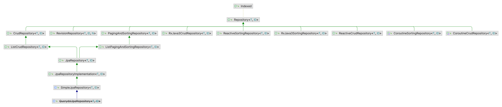

| 领域类注解                | 说明                                                         |
| ------------------------- | ------------------------------------------------------------ |
| @Entity                   | 声明JPA实体（类）。<br />（JPA需要实体带有空参构造器）       |
| @Id                       | 对象的唯一标识属性。<br />（javax.persistence，而不是org.springframwork.data.annotation） |
| @GeneratedValue(strategy) | 生成ID值。<br />strategy：生成策略。                         |
| @ManyToMany()             | 该属性（对应的类型）和类是多对多的关系。                     |
| @OneToMany(cascade)       | 所有的该属性（对应的类型）都属于该类（一对多）。<br />cascade：级联范围。 |

# Repository 存储库接口

> org.springframework.data.repository.Repository;

- Repository是Spring Data数据库操作的最顶级父类，继承该接口会基于存储库规范接口自动创建存储库，而不需要编写实现类。



```java
Xxx extends Repository<持久化对象类型,持久化对象ID类型>{}
```

> 数据预加载：CommandLineRunner、ApplicationRunner接口，对关系型、非关系型数据库均有效。

| 常用接口               | 存储库规范接口操作             |
| ---------------------- | ------------------------------ |
| CrudRepository         | 常用的CRUD                     |
| PagingAndSortRpository | 分页、排序                     |
| JpaRepository          | 关系型数据库                   |
| SimpleJpaRepository    | 关系型数据库的Repository实现类 |

# 自定义查询方法

| 注解 | @EnableJpaRepositories        |
| ---- | ----------------------------- |
| 位置 | 配置类                        |
| 作用 | 所有仓库的查询策略            |
| 参数 | queryLookupStrategy：查询策略 |

| QueryLookupStrategy\.Key | 查询策略                                         |
| ------------------------ | ------------------------------------------------ |
| Create                   | 直接根据（符合规则的）方法名创建。               |
| USE\_DECLARED\_QUERY     | 声明方式@Query创建。                             |
| CREATE\_IF\_NOT\_FOUND   | 默认，以上两种。先@Query创建，不行则方法名创建。 |

## DQM 方法名创建及语法

- Spring Data在生成存储库实现时，检查存储库接口的所有方法，解析方法的名称，并基于被持久化的对象来试图推测方法的目的（DSL 领域特定语言）。持久化的细节都是通过存储库方法的签名实现的。

```java
public Interface TacoOrder extends CrudRepository{
    //动词+[主题]+关键词By+断言
    findByDeliveryZip(String deliveryZip);//动词find、主题暗含TacoOrder、关键词By、断言DeliveryZip。
}
```

- `org.springframework.data.repository.query.parser.PartTree`：解析方法名称。

- `org.springframework.data.repository.query.parser.Part.Type$Type`：所有关键字的枚举。

## @Query 声明创建

| 注解 | @Query                                         |
| ---- | ---------------------------------------------- |
| 位置 | 查询方法                                       |
| 作用 | 指明方法调用时执行的查询，而不是根据方法签名。 |
| 参数 | SQL查询语句（JPA中可以使用JPA查询）            |
