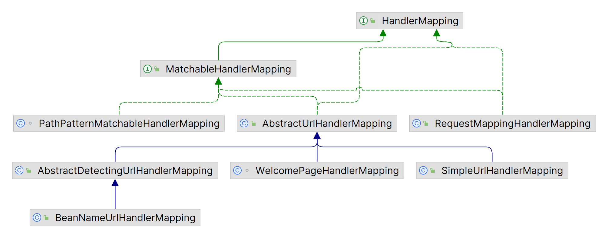
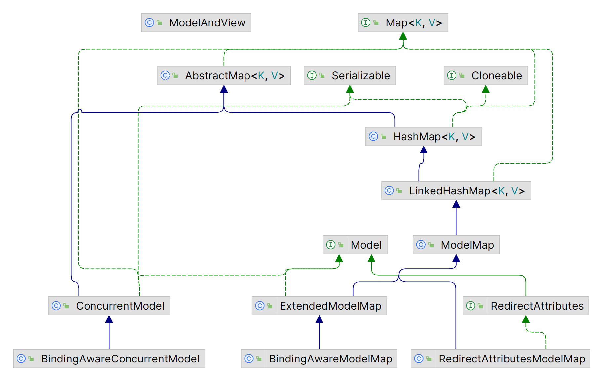

# MVC框架

| MVC层次 | 结构              |
| ------- | ----------------- |
| 控制层  | Controller 控制器 |
| 模型层  | Model 模型        |
| 视图层  | View 视图         |

# WebMvcConfigurer MVC配置类

- WebMvcConfigurer接口定义了多个Spring MVC的配置方法（default），所有配置类都可以实现该接口并覆盖其方法。

| WebMvcConfigurer方法        | 说明                     |
| --------------------------- | ------------------------ |
| addViewControllers          | 添加需要跳转的视图控制器 |
| addArgumentResolvers        | 添加请求参数解析器       |
| addViewResolvers            | 添加视图解析器           |
| addInterceptors             | 添加拦截器               |
| configureMessageConverters  | 配置消息转换器           |
| addResourceHandlers         | 添加静态资源处理器       |
| configurePathMatch          | 配置路径匹配方式         |
| configureContentNegotiation | 配置内容协商             |
| configureHandlerMapping     | 配置处理器映射器         |
| configureHandlerAdapter     | 配置处理器适配器         |


```java
@Configuration
public class WebConfig implements WebMvcConfigurer {
}
```

## addViewControllers 注册视图控制器

```java
public void addViewControllers(ViewControllerRegistry registry) {
    registry.addViewController("/").setViewName("home");
}
```

- addViewController("/myUrl") 设置视图控制器，可以设置多层url映射（如 "/\*\*"）。当请求路径为"myUrl"时，Spring MVC将该请求转发给该视图控制器处理，进行视图渲染等操作。setViewName("/myView") 设置显示的视图，渲染该视图到响应中返回给客户端。

 

## addInterceptors 注册拦截器

```java
@Autowired
private MyInterceptor myInterceptor;

@Override
public void addInterceptors(InterceptorRegistry registry) {
    registry.addInterceptor(myInterceptor)
        .addPathPatterns("/books","/books/**") //设置拦截的路径
        .excludePathPatterns("/books/1"); //排除拦截的路径
    // registry.addInterceptor(new MyInterceptor()).addPathPatterns("/books","/books/**");
}
```

## addResourceHandlers 静态资源处理器

```java
protected void addResourceHandlers(ResourceHandlerRegistry registry) {
    //当访问/pages/*时，走/pages目录下的内容
    registry.addResourceHandler("/pages/**").addResourceLocations("/pages/");
    registry.addResourceHandler("/js/**").addResourceLocations("/js/");
    registry.addResourceHandler("/css/**").addResourceLocations("/css/");
    registry.addResourceHandler("/plugins/**").addResourceLocations("/plugins/");
}
```


# Controller 控制器

| 注解 | @Controller                                                  |
| ---- | ------------------------------------------------------------ |
| 位置 | 类注解                                                       |
| 作用 | 设定SpringMVC的控制器bean<br />返回值放入模型中，并传递给视图渲染 |

| 注解 | @RestController              |
| ---- | ---------------------------- |
| 位置 | 类注解                       |
| 作用 | @Controller \+ @ResponseBody |

## DispatcherServlet 请求分发中心

- DispatcherServlet：基于Java Servlet API的前端控制器，它是整个Spring Web MVC框架的核心组件，负责接收、处理和转发所有的HTTP请求。

1. 初始化阶段：在服务器启动后，DispatcherServlet首先会被加载并创建一个新的WebApplicationContext实例，用于管理所有与Spring Web相关的bean。
2. 请求处理阶段：当接收到一个HTTP请求时，DispatcherServlet会根据请求URL、HTTP方法等信息决定由哪个处理器（Handler）来处理这个请求。
3. 分发阶段：确定了处理器之后，DispatcherServlet会调用该处理器的方法，并传递一个代表当前HTTP请求的对象（如HttpServletRequest和HttpServletResponse）作为参数。
4. 响应处理阶段：处理器处理完请求后，通常会返回一个 ModelAndView 对象，DispatcherServlet会根据这个对象的内容生成响应并发送回客户端。
5. 销毁阶段：在服务器关闭或者应用程序退出时，DispatcherServlet会清理资源并销毁WebApplicationContext。

## Handle 处理器

- Model的查找和执行在DispatcherServlet中是解耦的。控制器负责通过HandlerMapping查找Handler，再交由HandlerAdapter处理。

- HandlerExecutionChain（处理器执行链）：包含了处理器方法中的HandlerMethod对象、Handler层次结构、Interceptors（拦截器）的顺序。

1. 在处理请求时，Spring MVC会通过[RequestMappingHandlerMapping](#RequestMappingHandlerMapping)来寻找处理器，RequestMappingHandlerMapping会根据请求的路径来匹配处理器方法，并返回一个HandlerExecutionChain。
2. 接着，Spring MVC会通过HandlerAdapter来执行处理器方法，HandlerAdapter会根据请求的类型和处理器方法的方法signature来执行对应的方法，并返回处理结果。
3. 最后，Spring MVC会通过HandlerInterceptor来执行拦截器，在处理器方法执行前后进行一些操作。

### HandlerMapping 映射器



#### URL直接映射

- SimpleUrlHandlerMapping提供了一种简单的方式来定义URL和处理程序之间的映射关系，将特定的URL与特定的处理程序类或方法进行关联，当有请求匹配到指定的URL时，就会调用相应的处理程序进行处理。

```java
@Bean
public SimpleUrlHandlerMapping simpleUrlHandlerMapping(MyHandle myHandle){
    SimpleUrlHandlerMapping mapping = new SimpleUrlHandlerMapping();
    mapping.setOrder(1);
    mapping.setUrlMap(Collections.singletonMap("/simpleUrl",myHandle));
    return mapping;
}
```

#### BeanName映射

- BeanNameUrlHandlerMapping将URL与bean名称映射，使用bean名称作为映射的key，将URL与bean名称存储在一个Map中。在处理请求时，它会根据URL查找相应的处理程序bean，并调用处理程序的方法来处理请求。（相当于通过URL来调用该bean）

>Bean名称映射：指定Bean的名称与其他组件的依赖关系，而无需了解具体的Bean的URL。 
>
>通过URL来调用Bean：BeanNameUrlHandlerMapping的bean名称映射可以被认为是通过URL来调用该bean的一种方式。

```java
@Bean(name="/beanNameUrl") //http://localhost:8080/beanNameUrl
public HttpRequestHandler beanNameUrlHandler(){
    return (req,resp) ->{
        resp.getWriter().println("beanNameUrl");
    };
}
```

#### @RequestMapping

| 注解           | @RequestMapping                                              |
| -------------- | ------------------------------------------------------------ |
| 位置           | 类、方法注解                                                 |
| 作用           | 设置当前控制器方法请求访问路径。<br />@RequestMapping注解控制器类时，与方法上的@XxxMapping的信息合并。 |
| **注解**       | **@GetMapping、@PostMapping、@PutMapping、@DeleteMapping**   |
| 位置           | 方法注解                                                     |
| 作用           | 设置当前控制器方法请求访问路径与请求动作，每种对应一个请求动作。<br />只要访问路径或请求动作有一个不同，就可以使用多个该注解。 |
| **返回值**     | **说明**                                                     |
| String         | 响应的视图名称、重定向到的URL。                              |
| void           | 不需要返回任何响应。                                         |
| ModelAndView   | 响应的视图和模型数据的容器。                                 |
| ResponseEntity | 带有自定义HTTP头和状态代码的HTTP响应。                       |
| 其他类型       | 响应的序列化数据类型。                                       |

```java
@RestController
@RequestMapping("/users")
public class UserController {

//    @RequestMapping(value = "/users", method = RequestMethod.POST)
    @PostMapping
    public String save() {
        System.out.println("user save...");
        return "{'module':'user save'}";
    }

//    @RequestMapping(value = "/users/{id}", method = RequestMethod.DELETE)
    @DeleteMapping("/{id}")
    public String delete(@PathVariable Integer id) {
        System.out.println("user delete..." + id);
        return "{'module':'user delete'}";
    }

//    @RequestMapping(value = "/users", method = RequestMethod.PUT)
    @PutMapping
    public String update(@RequestBody User user) {
        System.out.println("user update..." + user);
        return "{'module':'user update'}";
    }

//    @RequestMapping(value = "/users/{id}", method = RequestMethod.GET)
    @GetMapping("/{id}")
    public String getById(@PathVariable Integer id) {
        System.out.println("user getById..." + id);
        return "{'module':'user getById'}";
    }

//    @RequestMapping(value = "/users", method = RequestMethod.GET)
    @GetMapping
    public String getAll() {
        System.out.println("user getAll...");
        return "{'module':'user getAll'}";
    }
}
```

#### HttpRequestHandler


- HttpRequestHandler接口的实现类可以处理 HTTP 请求并将响应返回给客户端。实现类需要实现handleRequest()方法，该方法接受一个HttpServletRequest对象和一个HttpServletResponse对象作为参数，并且没有返回值。

- 仅实现了HttpRequestHandler接口的Handler，其查找和执行是分离的，需要被注册到对应的Mapping中，才能生效。

```java
public class MyHttpRequestHandler implements HttpRequestHandler {

    @Override
    public void handleRequest(HttpServletRequest httpServletRequest, HttpServletResponse httpServletResponse) throws ServletException, IOException {
        if (httpServletRequest.getMethod().equals("GET")) {
            httpServletResponse.setContentType("text/html;charset=utf-8");
            httpServletResponse.getWriter().write("<h1>Hello World</h1>");
        } else if (httpServletRequest.getMethod().equals("POST")) {
            httpServletResponse.setContentType("text/html;charset=utf-8");
            httpServletResponse.getWriter().write("<h1>Hello World</h1>");
        } else {
            httpServletResponse.setContentType("text/html;charset=utf-8");
            httpServletResponse.getWriter().write("<h1>Hello World</h1>");
        }
    }
}
```

#### Controller接口

- org\.springframework\.web\.servlet\.mvc\.Controller用于定义处理 HTTP 请求的控制器类（不是@Controller），实现Controller接口的类可以接收HTTP请求并生成HTTP响应。Spring Web MVC 框架会自动将符合特定规则的控制器类处理的方法注册为处理特定URL的处理方法。

```java
@Component("/myController") //通过BeanNameUrlHandlerMapping调用
public class MyHttpRequestHandler implements org.springframework.web.servlet.mvc.Controller {
    
    // 接收HttpServletRequest和HttpServletResponse对象作为参数
    // 返回一个ModelAndView对象（用于将数据模型和视图名称返回给Servlet容器）
    @Override
    public ModelAndView handleRequest(HttpServletRequest httpServletRequest, HttpServletResponse httpServletResponse) throws Exception {
        Map<String,Object> model = new HashMap<>();
        model.put("name","Tom");
        return new ModelAndView("testView",model);
    }
}
```

### HandlerMethod 处理器方法

- HandlerMethod封装处理请求的Handler方法（一般是@RequestMapping标注的方法），包含了Handler方法的Method对象、Handler类的Class对象、Handler方法的参数类型等信息。
- RequestMappingHandlerMapping会扫描并封装被@Controller标注的类中被@RequestMapping标注的方法为HandlerMethod。

1. 请求参数自动绑定：请求参数可以自动绑定到方法参数内。
2. Model模型自动绑定：如果在方法参数中声明了Map类型的model，则由RequestMappingHandlerAdapter自动生成Modle模型并绑定到该参数。
3. 视图自动查找（没有@ResponseBody标注）：返回String类型的视图名，由RequestMappingHandlerAdapter自动查找相应名称的视图，并自动与参数中的Model绑定（如果存在Model参数）。

> Controller接口方式返回的是ModelAndView，并没有以上三种特性，需要通过req.getParameter("name")的方式来获取参数。

#### HandlerMethodArgumentResolver 参数解析

- HandlerMethodArgumentResolver 参数解析：HandlerAdapter（适配器）执行HandlerMethod（处理器方法）前，遍历当前处理器方法中的所有参数签名，根据每个参数签名自动从请求信息或当前应用信息中获取最合适的值，执行时传递给该处理器方法，作为执行处理器方法的参数列表。

```java
public interface HandlerMethodArgumentResolver {
    
    // 1. 根据方法中参数的元信息判断是否可以解析该参数的参数值，true支持解析
    boolean supportsParameter(MethodParameter var1); //MethodParameter封装处理器方法的参数

    // 2. 通过判断后，根据提供的请求信息和上下文，将请求中的数据解析并绑定到方法参数上
    @Nullable
    Object resolveArgument(MethodParameter var1, @Nullable ModelAndViewContainer var2, NativeWebRequest var3, @Nullable WebDataBinderFactory var4) throws Exception;
}
```

```java
// RequestMappingHandlerAdapter
@Nullable
public List<HandlerMethodArgumentResolver> getArgumentResolvers() {
    // RequestMappingHandlerAdapter处理适配器解析方法中的参数时
    // 遍历customArgumentResolvers并调用每个元素的supportsParameter(MethodParameter var1)
    return this.argumentResolvers != null ? this.argumentResolvers.getResolvers() : null;
}
```

##### @PathVariable 路径变量

| 注解        | @PathVariable                                                |
| ----------- | ------------------------------------------------------------ |
| 位置        | 形参注解                                                     |
| 作用        | 绑定路径参数和形参，路径参数名与形参名一一对应，<br />获取的参数值为String类型 |
| **属性**    | **说明**                                                     |
| value、name | 指定参数解析的路径变量名，默认参数名                         |
| required    | 参数值是否必要，若找不到参数值，true则报错，false则null<br />参数可以使用Optional类型，对应的该属性都是false |

```java
@RequestMapping(path = "/users/{id}", method = RequestMethod.GET)
@ResponseBody
public String getById(@PathVariable Integer id){
    return "{'module':'user getById'}";
}
```

##### @MatrixVariable 矩阵变量

- 矩阵变量依赖于路径变量而存在，不建议使用。

| 注解         | @MatrixVariable                                              |
| ------------ | ------------------------------------------------------------ |
| 位置         | 形参注解                                                     |
| 作用         | 绑定参数和路径中的矩阵变量                                   |
| **属性**     | **说明**                                                     |
| value、name  | 指定该参数解析的矩阵变量名                                   |
| pathVar      | 当存在多个路径段时，选择指定的路径变量中的矩阵变量<br />@PathVariable，通常不用指定该参数 |
| required     | 参数值是否必要，若找不到参数值，true则报错，false则null<br />参数可以使用Optional类型，对应的该属性都是false |
| defaultValue | 若找不到参数值，则使用该默认值，支持属性占位符               |

> `"\n\t\t\n\t\t\n\ue000\ue001\ue002\n\t\t\t\t\n";`仅用于表示null，运行时会替换为null。

- MultiValueMap复合矩阵变量，将所有路径段的矩阵变量按key-value存入。

1. 若多个路径段存在相同的矩阵变量，则这些相同的矩阵变量的值转为一个List存入MultiValueMap。
2. 可通过pathVar来指定存入MultiValueMap的路径段。
3. 可声明为Map类型，但当一个矩阵变量对应多个值时，只会保留第一个值，其余丢失。

##### @RequestParam 请求参数

- @RequestParam通过Request\.getParameter()方法获取请求参数值的解析，包括URL上的请求参数`?`、请求体的表单参数。解析处理器时，若方法参数未出现其他可被参数解析器解析的注解，且参数类型为Java中定义的类型，则视为隐式指定@RequestParam。
- 若@RequestParam标注的参数类型为Map\<String, String\>、MultiValueMap\<String, String\>，且未指定name属性，则将当前请求的所有请求参数绑定到该参数。同一个请求参数有多个值时，Map\<String, String\>只保留第一个。

| 注解         | @RequestParam                                                |
| ------------ | ------------------------------------------------------------ |
| 位置         | 形参注解                                                     |
| 作用         | 绑定形参和地址参数。<br />（形参与地址参数名不一致时，需要该注解指定） |
| **属性**     | **说明**                                                     |
| value、name  | 指定请求参数名，默认方法参数名                               |
| required     | 参数值是否必要，若找不到参数值，true则报错，false则null<br />参数可以使用Optional类型，对应的该属性都是false |
| defaultValue | 参数默认值，支持占位符                                       |

```java
// /user/userParam?id=9&name=zjk&age=18
@RequestMapping("/commonParam")
@ResponseBody
public String commonParam(@RequestParam("name") String userName,
                          @RequestParam("age") Integer age){
    System.out.println(userName);
    System.out.println(age);
    return "{'info':'commonParam'}";
}

// /products/12345?q=1&r=2
@GetMapping("/products/{productId}")
@ResponseBody
public String getProductDetails(@PathVariable("productId") String productId,
                                @RequestParam MultiValueMap<String, String> multiVars) {
    StringBuffer stringBuffer = new StringBuffer(productId + " Values: ");
    stringBuffer.append(multiVars.get("q"));
    stringBuffer.append(multiVars.get("r"));
    return stringBuffer.toString();
}
```

##### @RequestHeader 请求头

- @RequestHeader解析参数值为请求头的值，通过Request\.getHeader()方法获取请求头的值。
- @RequestHeader和@RequestParam一样支持Map和MultiValueMap类型，此外，还支持HttpHeaders类型。SpringMVC提供的默认类型转换策略识别逗号分割的多值请求头（如Accept），转换为数组或Collect类型。

| 注解         | @RequestHeader                                               |
| ------------ | ------------------------------------------------------------ |
| 位置         | 方法参数                                                     |
| 作用         | 绑定方法参数值为请求头的值                                   |
| **属性**     | **说明**                                                     |
| value、name  | 指定该参数解析的请求头（不区分大小写）                       |
| required     | 参数值是否必要，若找不到参数值，true则报错，false则null<br />参数可以使用Optional类型，对应的该属性都是false |
| defaultValue | 参数默认值，支持占位符                                       |

```java
// curl -H 'Accept: application/json' http://localhost:8080/getAccept
@GetMapping("getAccept")
@ResponseBody
public String getAccept(@RequestHeader("ACCEPT") List<String> accept) {
    return "accept: " + accept;
}
```

##### @CookieValue Cookie值

- @CookieValue为请求参数绑定Cookie值，通过Request\.getCookies()方法获取Cookie值。额外支持Cookie类型的参数。

> Cookie值通过HTTP请求的请求头传递。

| 注解         | @CookieValue                                                 |
| ------------ | ------------------------------------------------------------ |
| 位置         | 方法参数                                                     |
| 作用         | 绑定方法参数值为Cookie的值                                   |
| **属性**     | **说明**                                                     |
| value、name  | 指定该参数解析的Cookie名                                     |
| required     | 参数值是否必要，若找不到参数值，true则报错，false则null<br />参数可以使用Optional类型，对应的该属性都是false |
| defaultValue | 参数默认值，支持占位符                                       |

```java
// curl http://localhost:8080/getCookie --cookie 'JSESSIONID=12345'
@GetMapping("getCookie")
@ResponseBody
public String getCookie(@CookieValue("JSESSIONID") String jsessionId) {
    return "JSESSIONID: " + jsessionId;
}
```

##### @RequestBody 请求体

- @RequestBody直接将整个请求体转换。请求体数据以二进制流的形式传输，通过Request\.getInputStream()方法获取，Spring MVC通过HttpMessageConverter自动转换为对应的类型。@RequestBody的参数解析器中维护着HttpMessageConverter的列表，处理不同的类型（请求体内容格式），通过HttpMessageConvert的canRead()方法，由请求体中的Content-Type、方法的类型信息来判断使用。
- @RequestBody标注的参数可通过[@Validated](./Books/Spring/validation.md)来检验数据的正确性。

| 注解     | @RequestBody                                                 |
| -------- | ------------------------------------------------------------ |
| 位置     | 方法参数注解                                                 |
| 作用     | 将请求中请求体所包含的数据传递给请求参数<br />一个方法只能使用存在一个该注解。 |
| **属性** | **说明**                                                     |
| required | 参数值是否必要，若找不到参数值，true则报错，false则null<br />参数可以使用Optional类型，对应的该属性都是false |

```java
// curl -H 'Content-Type: application/json' -d '{"username": "Tom","account": "1001","password": "1234"}' http://localhost:8080/postUser
@PostMapping("postUser")
@ResponseBody
public String postUser(@Validated @RequestBody User user,
                       BindingResult result) {
    if (result.hasErrors()) return "some errors happened !!!";
    return user.toString();
}
```

##### HttpEntity\<T\> 请求头与请求体

- HttpEntity\<T\>及其子类RequestEntity\<T\>可以直接在方法参数中使用，SpringMVC自动为其绑定数据，泛型T为请求头要转换的目标类型。不支持参数检验，若声明了BindingResult类型的参数，会报错提示无可解析的绑定结果类型数据。

```java
// curl -H 'Content-Type: application/json' -d '{"username": "Tom","account": "1001","password": "1234"}' http://localhost:8080/postUser
@PostMapping("postUser")
@ResponseBody
public String postUser(HttpEntity<User> userHttpEntity) {
    return "headers: " + userHttpEntity.getHeaders()
        + "user: " + userHttpEntity.getBody();
}
```

##### @RequestPart 请求块

- 对于`Content-Type: mutilpart/form-data`类型的请求，Servlet API封装了以下两种方法来获取表单数据。

1. Request\.getPart(name)方法根据请求块属性名，返回请求块的封装类型（javax.servlet.http.Part），对于有相同数据名的多个请求块，只返回第一个请求块。而Request\.getParts()方法获取Part的Collection集合。
2. Request\.getParameter()方法也可以获取multipart类型的表单参数。在请求块的filename不存在的情况下，请求块会被添加到请求的ParameterMap中，便于Request\.getParameter()方法获取。

3. Spring MVC提供MultipartFile类型，封装多块请求中类型为文件的Part。

| 注解        | @RequestPart                                                 |
| ----------- | ------------------------------------------------------------ |
| 位置        | 方法参数                                                     |
| 作用        | 绑定方法参数值为请求块的值                                   |
| **属性**    | **说明**                                                     |
| value、name | 指定该参数解析的请求块属性名                                 |
| required    | 参数值是否必要，若找不到参数值，true则报错，false则null<br />参数可以使用Optional类型，对应的该属性都是false |

- @RequestPart支持的参数为：

1. 原始的javax.servlet.http.Part类型及其数组和Collection
2. MultipartFile类型及其数组和Collection
3. 其他任意可被消息转换器（HttpMessageConverter）转换的类型（@RequestPart对于基本数据类型没有相应的消息转换器HttpMediaTypeNoSupporrtException）。建议使用@RequestParam标记或不标记，已直接获取参数值；而@RequestPart需要经过消息转换器处理。

```java
// curl -X POST -F 'firstName=Zheng' -F 'lastName=Jikai' -F 'picture=@/home/zjk/Pictures/Screenshot.png' http://localhost:8080/demo/multipartForm
@PostMapping("demo/multipartForm")
@ResponseBody
public String postMultipartForm(@RequestPart String firstName,
                                @RequestPart String lastName,
                                @RequestPart("picture") MultipartFile picture) {
    return firstName + lastName + picture.getOriginalFilename();
}
```

- @RequestPart标记的非Part或非MultipartFile类型的参数都可以标记Valid相关的注解，利用Erros或BindingResult类型的参数以绑定校验结果。

##### FlashMap 重定向属性

- 重定向时，有两种参数传递方案：（1）通过重定向的URL参数；（2）通过Session临时存储。而FlashMap在重定向之前将一些需要使用的Model属性放入参数，重定向之后再取出这些参数并从Session移除，完成了重定向参数的自动管理（FlashMapManager）。

- 在处理器方法中引入类型为[RedirectAttributes](#RedirectAttributes)的参数

##### @ModelAttribute 模型属性

| 注解 | @ModelAttribute                                              |
| ---- | ------------------------------------------------------------ |
| 位置 | 形参、方法注解                                               |
| 方法 | 返回值自动存入ExtendedModelMapModel                          |
| 形参 | 数据绑定，该形参的值从模型取得，对该参数的修改不影响模型内的值。<br />若模型中找不到名称匹配的，则该参数会先被实例化（必须能够实例化），然后被添加到模型中。 |
| 属性 | value、name：添加/匹配到model的属性名称（默认为当前标注的参数名称）。<br />binding()：指定是否把请求参数值和路径参数绑定到模型属性实例中的内部属性，即参数的修改会更新到模型内的属性。 |

- 同个控制器内的@ModelAttribute方法先于@RequestMapping方法被调用。（如果同时被@XxxMapping和@ModelAttribute标注，则返回值不再是视图名，而是Model的一个属性）

```java
@GetMapping("/showUser")
@ModelAttribute("username")
public String showUser(){
    return "Tom";
}

@GetMapping("/showUser")
@ModelAttribute("username")
public String showUser(@ModelAttribute("username") String username){
    //从模型中获取的username仍然是空的，为什么？？？
    username = "Tom";
    return username;
}
```

- 通过现有的Model属性取值的来源：

1. 通过RedirectAttributes与重定向视图，在重定向后的请求中自动设置到当前的Model。
2. 通过@Controller或@ControllerAdvice中被@ModelAttributes标记的非处理器方法添加。
3. 通过在@Controller的类上标记的@SessionAttributes注解指定需要从Session中添加到Model中的属性。

- 根据类型创建Model属性（找不到名称匹配的）：

1. 从请求参数或路径参数中取指，并通过Spring的转换服务ConversionService把值转换为目标参数类型，转换器可以使用@Init BInder注解结合DataBinder注解定制。
2. 若第一种方法无法得到实例，则通过目标参数的构造器创建实例（没有无参构造器且有多于一个有参构造器时报错），若取到的构造器上有参数，则通过请求参数获取构造器参数并进行构造。
3. 完成参数构造后，若没有发生异常，此时还会判断该参数是否禁用了绑定，即通过@ModelAttribute的binding参数声明是否绑定。若没有声明绑定，则会把请求参数和路径参数中的值通过WebDataBinder绑定到生成的参数实例中，支持多种参数绑定规则。

| 参数绑定规则 | 说明                                                         |
| ------------ | ------------------------------------------------------------ |
| 简单属性绑定 | 生成实例中的简单类型属性值会从请求参数和路径参数中取值，并被设置到实例的该属性中 |
| 嵌套属性绑定 | 对于实例类中嵌套的其他类型，属性使用“.”作为嵌套分割符（P类中有S类的属性s：s.name、s\[name\]） |
| 数组属性     | 只能使用\[\]标记，\[\]内为数组元素索引值，允许元素空缺；支持嵌套 |
| List属性     | 同数组属性                                                   |
| Map属性      | 只支持\[\]标记Map中的key，其余同嵌套属性                     |

- 若一个参数值不是Java内置的简单类型或其他数组类型，则默认使用@ModelAttribute的规则进行参数绑定。

```shell
curl -X POST -d "firstName=Zheng&lastName=jk&age=18&personData.id=1001&personData.name=Zhengjk" \
http://127.0.0.1:8080/demo/modelAttribute
```

```java
@PostMapping("demo/modelAttribute")
@ResponseBody
public String postMultipartForm(@ModelAttribute Person person) {
    return person.toString();
}

@Data
@NoArgsConstructor
public class Person {private String firstName;private String lastName;private int age;private PersonData data;}

@Data
@NoArgsConstructor
class PersonData{private String id;private String name;}
```

##### @SessionAttributes 模型会话属性

##### @SessionAttribute 会话属性

### HandlerAdapter 适配器

- SpringMVC为@RequestMapping标注的处理器方法设置了参数自动解析。DispatcherServlet获取到处理器方法后，先执行拦截器的preHandler逻辑，若返回true，则当前的处理器Handler可以交给该Handler的HandlerAdapter（适配器）执行。

#### RequestMappingHandlerAdapter 适配器

- @RequestMapping标注的方法，返回的Handler类型为HandlerMethod，对应可执行的适配器为RequestMappingHandlerAdapter 。<span name="RequestMappingHandlerMapping">RequestMappingHandlerMapping</span>负责解析HTTP请求的URL，遍历所有@RequestMapping的信息，寻找条件属性与请求信息最匹配的@RequestMapping作为最终的处理器方法。

```java
public class RequestMappingHandlerAdapter extends AbstractHandlerMethodAdapter implements BeanFactoryAware, InitializingBean {
    
    // 处理器方法 参数解析
    private List<HandlerMethodArgumentResolver> customArgumentResolvers;
}
```

#### RequestCondition接口 属性规则

- @RequestMapping的每个条件都是RequestCondition接口的实现，每个属性都有以下特性类型。

1. 匹配规则：与请求的匹配逻辑。
2. 多值匹配规则：属性数组提供多个值时的匹配逻辑。
3. 合并规则：方法与类型上的属性合并规则。
4. 排序规则：该请求有多个注解的属性匹配时，对匹配结果的排序规则。
5. 若注解中的属性没有提供值，则不对该条件过滤（任意请求都匹配）。

```java
public interface RequestCondition<T> {
    //合并
    T combine(T var1);

    //匹配顺序
    @Nullable
    T getMatchingCondition(HttpServletRequest var1);

    //比较
    int compareTo(T var1, HttpServletRequest var2);
}
```

##### 属性参数

###### path 请求路径

- 在@RequestMapping中，path和value互为别名（@AliasFor("path") 注解属性别名机制）。
- @Request会自动为path路径匹配加上“/”，若已经存在“/”，则不添加。

```java
// 匹配所有路径的请求
@Request

// 匹配根路径请求
@Request("/")

// 匹配/path1的请求
@Request("path1")

// 匹配/path1或/path2的请求
@Request({"path1","path2"})

//类@RequestMapping("/home")搭配方法@XxxMapping("/design")：请求映射为/home/design。
```

- 路径模式支持方法和类级别的注解，同时出现时，对二者进行合并。

1. path属性在类和方法上的注解都指定，则拼接路径。
2. path属性只在方法/类上的注解指定，则以方法/类上的path为准。
3. path属性在类和方法上的注解都不指定，则匹配根路径。

- 模式字符串（path）的排序规则：越少通配符（Ant风格）越靠前，按如下顺序依次判断。

1. 与请求路径完全相同的模式字符串（无通配符），最靠前。
2. /\*\*匹配所有模式，最靠后。以/\*\*结尾的path排在不包含/\*\*结尾的path之后。
3. \*和\{\}总属性越少的越靠前。
4. path的长度越长越靠前。
5. \*数量越少越靠前。（不包括\*\*）
6. \{\}数量越少越靠前。

```properties
# SpringBoot默认关闭后缀匹配(.*)
spring.mvc.pathmatch.useSuffixPattern=false
```

###### method 请求方法

- method属性指定HTTP请求中的Reuqest Method（分别与RequestMethod枚举类的实例一一对应），不指定则匹配所有请求方法。
- @XxxMapping中的method已经在注解的名称中表现，该类注解等同于method=Xxx的@RequestMapping。

```java
// 匹配路径为path1、不限请求方式的请求
@Request(path = "path1")

// 匹配路径为path1、请求方式为GET的请求
@Request(path = "path1", method = RequestMethod.GET)

// 匹配路径为path1、请求方式为GET或POST的请求
@Request(path = "path1", method = {RequestMethod.GET,RequestMethod.POST})
```

###### params 请求参数

- params属性指定匹配HTTP请求中的参数，（1）URL上的查询参数；（2）请求体中的表单类型的参数（指定name属性的表单元素）。

- 若指定该params属性，则必须满足该属性的所有参数的请求才匹配。

1. name=value：请求中必须存在参数名为name且值为value的参数。
2. name\!=value：请求中不能存在参数名为name且值为value的参数。
3. name：请求中必须存在参数名为name的参数。
4. \!name：请求中不能存在参数名为name的参数。

- 类和方法注解中的params属性通过与（\&）的方式合并。
- 排序规则：提供的匹配属性数组越长（匹配条件越多），越靠前。

```java
// 匹配所有路径、存在参数名为username且值为Tom的参数的请求
@RequestMapping(params = "username=Tom")
```

> 不同的表单元素提交的值可能不同，如 checkBox默认未选中则不提交该参数，选中则提交on。

###### headers 请求头

- headers属性指定匹配HTTP请求头中的参数。headers属性的大部分规则和params属性相同，只有2点不同，（1）headers的参数名不区分大小写；（2）支持Accept和Content\-Type两种请求头条件的通配符类型。

```java
// 模糊匹配
headers = "Accept: text/*"
```

###### 内容类型 Content\-Type \& Accept

- Content\-Type和Accept请求头的值的规范都遵循MimeType的标准定义格式，在HTTP请求的数据传输中使用MediaType（MimeType的扩展集）。
- MediaType枚举类内封装了MediaType的大部分类型。

```
类型/子类型(;参数名=参数值)*n
```

- 子类型为RFC 2046标准定义的类型值，可使用"\+"（类型家族\+格式类型）
- 参数可以没有，可以多个（使用`;`分割）；参数值可以放在\" \"、\' \'、或直接表示。
- 除了参数值，其他的都不区分大小写。

```
text/html;name=value
application/xhtml+xml
```

1. 类型、子类型部分支持\*代表所有类型，若类型为\*，则子类型也必须是\*。
2. 子类型带\+的，若\+前为\*，表示所有子类型中\+前的任意类型。
3. 标准的q属性（质量因子 quality）0\~1，1最好、0不接受。

| 属性     | 说明                                                         |
| -------- | ------------------------------------------------------------ |
| consumes | consumes属性指定处理方法能够接受的请求内容类型（请求的Content\-Type），即处理器是否消费该类型，匹配Accept请求头的值。 |
| produces | produces属性指定处理方法能够返回的响应内容类型（响应的Content\-Type），即处理器是否生产该类型。 |

##### RequestMappingInfo 属性条件

- RequestMappingInfo是RequestCondition\<RequestMappingInfo\>的实现类，包含了@RequestMapping的所有属性条件。

1. 与请求进行匹配时，依次获取RequestMappingInfo中以下每个条件的匹配结果，只要有一个返回null，则该RequestMappingInfo对应的@RequestMapping与该请求不匹配。

```java
@Nullable
private final String name;
@Nullable
private final PathPatternsRequestCondition pathPatternsCondition;
@Nullable
private final PatternsRequestCondition patternsCondition; //path
private final RequestMethodsRequestCondition methodsCondition; //method
private final ParamsRequestCondition paramsCondition; //params
private final HeadersRequestCondition headersCondition; //headers
private final ConsumesRequestCondition consumesCondition; //consumers
private final ProducesRequestCondition producesCondition; //produces
private final RequestConditionHolder customConditionHolder; //自定义条件
```

```java
//匹配条件
public RequestMappingInfo getMatchingCondition(HttpServletRequest request)
```

2. 多个@RequestMapping对同一个请求匹配时，RequestMappingInfo的排序规则为path、params、headers、consumes、produces、method、custom。

```java
//多个匹配的@RequestMapping的排序
public int compareTo(RequestMappingInfo other, HttpServletRequest request){
    //如果请求方法是HEAD，则优先判断method。
    if (HttpMethod.HEAD.matches(request.getMethod())) {...}
    
    //常规的排序规则path、params、headers、consumes、produces、method、custom。
}
```

3. @RequestMapping的方法注解和类注解的合并就是RequestMappingInfo的合并，对所有条件的同类条件执行合并。每个条件都继承自AbstractRequestCondition，带有各自的combine(..)方法。

```java
//分别调用每个条件的combine(..)方法实现合并
public RequestMappingInfo combine(RequestMappingInfo other)
```

### HandlerInterceptor 拦截器

- 拦截器是HandlerInterceptor的实现类。在查找处理器时，HandlerMapping并不直接返回Handler，而是Handler的执行链HandlerExecutionChain，其封装需要应用到该Handler上的所有拦截器。

1. 定位拦截器：Spring MVC首先会扫描所有的拦截器，并将它们存储在一个列表中。  
2. 实现拦截器逻辑：每个拦截器都需要实现preHandle()方法、postHandle()方法、afterCompletion()方法。preHandle()方法在控制器方法调用之前执行，postHandle()方法在控制器方法调用之后执行，afterCompletion()方法在控制器方法抛出异常时执行。  
3. 执行控制器方法：当所有的拦截器都执行完毕后，Spring MVC会调用控制器方法。
4. 回收：在控制器方法返回结果之后，Spring MVC会执行所有的postHandle()方法、afterCompletion()方法，然后拦截器链执行完毕。

- 定义拦截器之后，还需要将其通过WebMvcConfigurer\#addInterceptors\(\.\.\)、@Intercepts等方式注册到Spring MVC环境中，才能生效。

 

| 注解     | @Order                                                       |
| -------- | ------------------------------------------------------------ |
| 位置     | 拦截器类                                                     |
| 作用     | 标注拦截器的执行顺序，如果两个拦截器的Order值相同，会根据它们的实现类名称的字母顺序来确定它们的执行顺序 |
| **注解** | **@Intercepts**                                              |
| 位置     | 拦截器类                                                     |
| 作用     | 指定一个URL路径、或包含一个FilterRegistrationBean对象被拦截器拦截，可用于配置更多的拦截器参数<br />（仅SpringMVC中存在） |
| **注解** | **@Filter**                                                  |
| 位置     | 拦截器类                                                     |
| 作用     | 指定一个URL路径，该路径将被拦截器拦截，只能配置一个拦截器<br />（仅SpringMVC中存在） |

```java
@Order(1)
@Intercepts(@Filter("/login"))
public class ProjectInterceptor implements HandlerInterceptor {
    @Override
    public boolean preHandle(HttpServletRequest request, HttpServletResponse response, Object handler) throws Exception { 
        HandlerMethod handlerMethod = (HandlerMethod) handler;
        Method method = handlerMethod.getMethod(); //获得原始执行方法
        return true;
    }

    @Override
    public void postHandle(HttpServletRequest request, HttpServletResponse response, Object handler, ModelAndView modelAndView) throws Exception {
    }

    @Override
    public void afterCompletion(HttpServletRequest request, HttpServletResponse response, Object handler, Exception ex) throws Exception {
        if(ex != null){
            ex.printStack();
        }
    }
}
```

# Model 模型

## 模型相关类型

 

- Model对应于一次用户的请求处理（一个请求内所有的Model操作都是同一个实例），负责控制器和视图之间的数据传递，Model属性中的数据被复制到Servlet Request属性。

| 模型相关类型       | 说明                                                        |
| ------------------ | ----------------------------------------------------------- |
| Map                | 模型数据存储的基本类型，视图渲染时也使用该类型              |
| Model              | SpringMVC对模型数据操作的抽象，可通过asMap(..)方法转换为Map |
| RedirectAttributes | addFlashAttribute(..)方法来添加重定向可用的Map参数          |
| ExtendedModelMap   | @XxxMapping处理前，SpringMVC自动绑定ExtendedModelMap        |

```java
@GetMapping("/thymeleafHello")
public String hello(Model model){
    model.addAttribute("name","张三");
    model.addAttribute("age",18);
    return "thymeleafHello";
}
```

## 模型数据绑定

### ExtendedModelMap自动绑定

- SpringMVC自动为@XxxMapping标志的方法绑定ExtendedModelMap。ExtendedModelMap的子类或父类（大部分可以）实现以下操作：

1. 方法参数声明为该类型的，会自动绑定模型数据，只要不返回就不会对原有的模型数据造成影响。
2. 方法内部声明为该类型的，返回的模型数据会对原有的模型数据造成影响，且视图为@XxxMapping指定的URL路径。

```java
@GetMapping("/showUser")
public String showUser(Model model){
    model.addAttribute("username","Tom");
    return "showUser";
}

@GetMapping("/showUser")
public Model showUser(){
    Model model<String,Object> = new ExtendedModelMap();
    model.addAttribute("username","Tom");
    return model;
}
```

### ModelAndView

- ModelAndView同时封装模型数据和视图信息，设置模型数据和视图名称，并将其返回给 DispatcherServlet，然后由 DispatcherServlet 进行视图的解析和渲染。

```java
@RequestMapping("/user")
public ModelAndView getUser() {
    User user = userService.getUser();  // 假设从数据库中获取到了用户数据

    ModelAndView modelAndView = new ModelAndView();
    modelAndView.addObject("user", user);  // 将用户数据添加到模型
    modelAndView.setViewName("user");  // 设置视图名称

    return modelAndView;
}
```

### RedirectAttributes

- <span name="RedirectAttributes">RedirectAttributes</span>只对重定向视图有效。

1. 利用RedirectAttributes的addFlashAttribute方法来添加这种重定向属性，重定向结束后自动将这些属性添加回Model
2. 而addAttribute方法添加的属性，则会被添加到重定向的URL中，作为URL的查询参数，使用时通过请求参数来获传递的参数值。

# View 视图

## 视图类型

- org.springframework.web.servlet.View封装了所有的视图实现，该接口的render(..)方法依据传入的Map类型的model对视图文件进行渲染，并传入到Responce完成处理。控制器只负责调用视图的渲染方法，将视图与Model绑定；而视图的渲染则是由视图的实现来执行。

### 内部资源视图 InternalResourceView

- InternalResourceView从服务器端渲染页面，使用RequestDispatcher接口（getRequestDispatcher()方法）将请求转发到服务器上的其他JSP或Servlet，并且不生成新的请求，URL不会出现变化。
- 转发前模型中的数据通过req.setAttribute()加入到req的属性中，而在转发的过程中req不改变，可通过req.getAttribute()来获取数据，实现数据共享。

### 重定向视图 RedirectView

- RedirectView重定向浏览器到一个新的URL上，生成新的请求（原有的请求和Model中的数据都丢失）。

```java
return "forward:/user"; //服务器内部转发
return "redirect:/user"; //服务器重定向
```

### 模板引擎视图

| 模板引擎                                 | 启用/禁用缓存属性（默认true） |
| ---------------------------------------- | ----------------------------- |
| FreeMarker                               | spring.freemarker.cache       |
| Groovy Templates                         | spring.groovy.template.cache  |
| Mustache                                 | spring.mustache.cache         |
| [Thymeleaf](./Books/Spring/Thymeleaf.md) | spring.thymeleaf.cache        |

## 视图解析 ViewResolver

### BeanName视图解析 BeanNameViewResolver

- BeanNameViewResolver执行解析要求bean类型为View接口的实现类，使用该bean来渲染视图。

```java
@GetMapping("/beanNameView")
public String beanNameView(Model model){
    model.addAttribute("name","Tom");
    return "beanNameView";
}
```

```java
@Component("beanNameView")
class CustomView implements View {

    @Override
    public String getContentType() {
        return MediaType.TEXT_HTML_VALUE;
    }

    @Override
    public void render(Map<String, ?> map, HttpServletRequest httpServletRequest, HttpServletResponse httpServletResponse) throws Exception {
        Object name = map.get("name");
        httpServletResponse.getWriter().append("name is " + name);
    }
}
```

```java
@Bean("beanNameView")
public View beanNameView(){
    return new View() {

        @Override
        public String getContentType() {
            return MediaType.TEXT_HTML_VALUE;
        }

        @Override
        public void render(Map<String, ?> map, HttpServletRequest httpServletRequest, HttpServletResponse httpServletResponse) throws Exception {
            httpServletResponse.getWriter().append("name is " + map.get("name"));
        }
    };
}
```

### 模板引擎视图解析

#### [ThymeleafViewResolver](./Thymeleaf.md)

### 内部资源视图解析 InternalResourceViewResolver

- InternalResourceViewResolver用于处理各种内部特殊视图，判断视图的前缀类型（forward:、redirect:），并返回对应类型的视图。

### 直接指定视图

- 控制器的@XxxMapping方法中直接返回View类型的实例，跳过视图解析的过程。	
