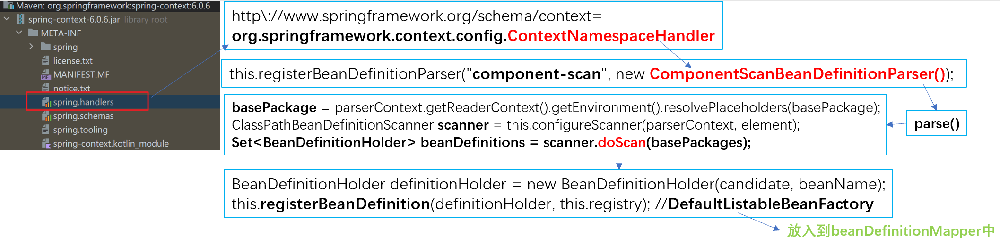
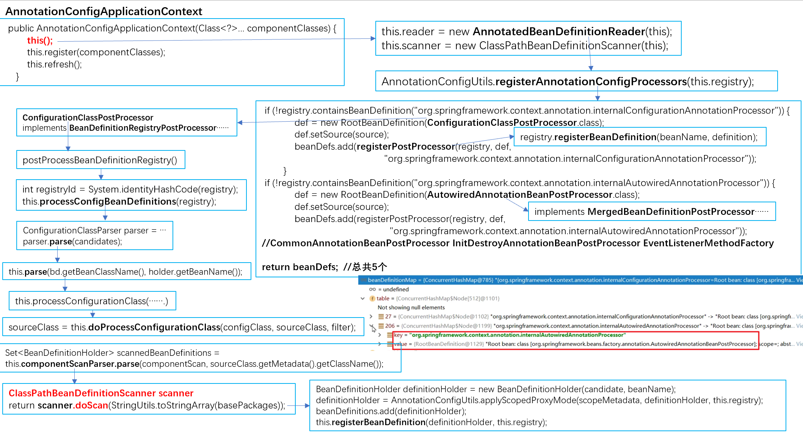
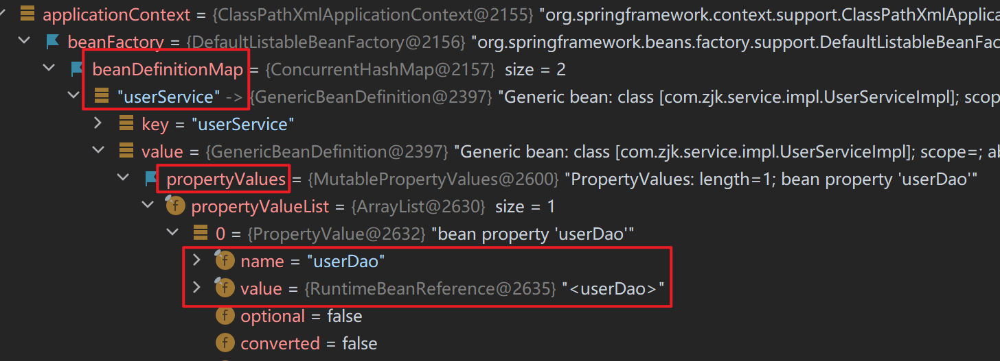
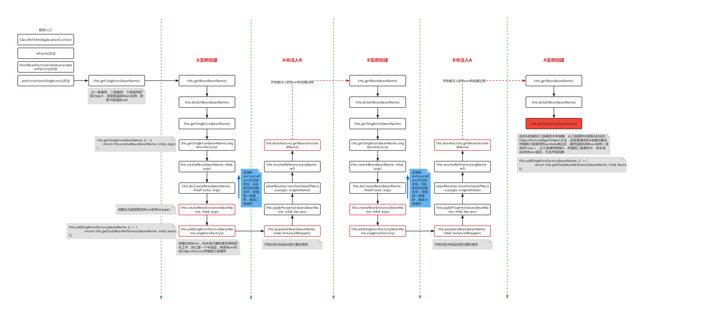
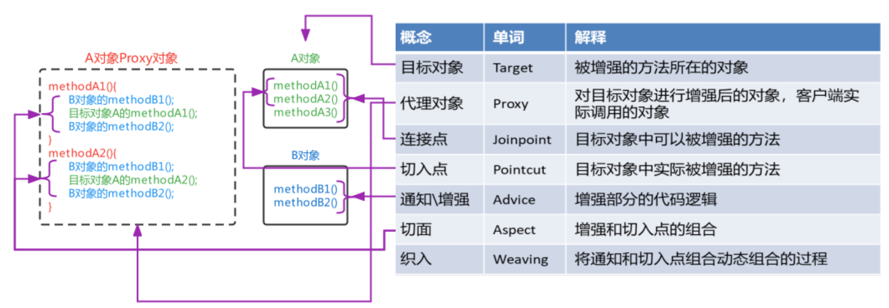
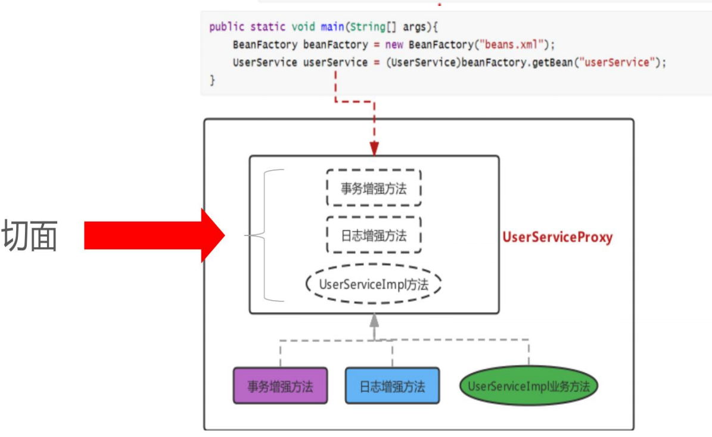
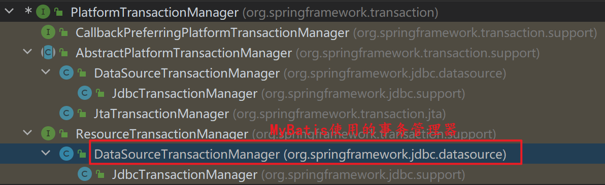

# IoC、DI

## BeanFactory

- BeanFactory（Bean工厂）：Spring底层核心部分。

  

 

### IoC 控制反转

- IoC：工厂设计模式，BeanFactory根据配置文件/配置类来生产Bean实例。

 

1. beans.xml配置文件

```xml
<?xml version="1.0" encoding="UTF-8"?>
<beans xmlns="http://www.springframework.org/schema/beans"
       xmlns:xsi="http://www.w3.org/2001/XMLSchema-instance"
       xsi:schemaLocation="http://www.springframework.org/schema/beans http://www.springframework.org/schema/beans/spring-beans.xsd">

    <bean id="userService" class="com.zjk.service.impl.UserServiceImpl"></bean>

</beans>
```

2. BeanFactory获取Bean对象：创建BeanFactory，加载配置文件，获取UserService实例对象。

```java
//1. 创建BeanFactory 工厂对象
DefaultListableBeanFactory beanFactory = new DefaultListableBeanFactory();
//2. 创建一个读取器 xml文件
XmlBeanDefinitionReader reader = new XmlBeanDefinitionReader(beanFactory);
//3. 绑定读取器和工厂对象 读取配置文件给工厂对象
reader.loadBeanDefinitions("beans.xml");
//4. 由beans.xml内配置的id获取Bean实例
UserService userService = (UserService) beanFactory.getBean("userService");

System.out.println(userService);
```

### DI 依赖注入

- DI：通过注入的方式反转Bean的创建权。

 

1. 定义接口及其实现类，setXxx(Xxx xxx)注入方法。（只要存在setXxx()，即使没有相应的xxx属性，也会执行该setXxx()注入方法）

```java
//com.zjk.service.UserService
public interface UserService {}
//com.zjk.service.impl.UserServiceImpl
public class UserServiceImpl implements UserService {
    //通过BeanFactory调用该方法 从容器中获取userDao设置到此处
    //需要先在beans.xml中配置对应的<bean>的<property>
    public void setUserDao(UserDao userDao){
        System.out.println("" + userDao);
    }
}
//com.zjk.dao
public interface UserDao{}
//com.zjk.dao.impl
public class UserDaoImpl implements UserDao{}
```

2. 具体的UserServiceImpl实现类

```java
package com.zjk.service.impl;

import com.zjk.dao.UserDao;
import com.zjk.service.UserService;

public class UserServiceImpl implements UserService {
    private UserDao userDao;

    //通过BeanFactory调用该set方法 从容器中获取userDao设置到此处
    //在beans.xml中的<bean id="userService" name="com.zjk.service.impl.userServiceImpl">中的
    //<property id="setXxx方法的xxx(即setUserDao的userDao)" name="beans.xml中配置的<bean id="userDao name="com.zjk.dao.UserDao">"的id"></property>
    public void setUserDao(UserDao userDao) {
        this.userDao = userDao;
    }
}
```

3. beans.xml配置文件 `<property>注入`

```xml
<bean id="userService" class="com.zjk.service.impl.UserServiceImpl">
    <property name="userDao" ref="userDao"></property>
    <!-- 配置注入
        name：UserServiceImpl中的属性名称(userDao) 即：setUserDao中的setXxx中的xxx
        ref： 在当前的配置文件(beans.xml)(容器)中查找相应的id(userDao)
    -->
</bean>
```

4. beans.xml

```xml
<?xml version="1.0" encoding="UTF-8"?>
<beans xmlns="http://www.springframework.org/schema/beans"
       xmlns:xsi="http://www.w3.org/2001/XMLSchema-instance"
       xsi:schemaLocation="http://www.springframework.org/schema/beans http://www.springframework.org/schema/beans/spring-beans.xsd">

    <bean id="userService" class="com.zjk.service.impl.UserServiceImpl">
        <property name="userDao" ref="userDao"></property>
    </bean>
    <bean id="userDao" class="com.zjk.dao.impl.UserDaoImpl"></bean>
</beans>
```

5. BeanFactory获取Bean对象：创建BeanFactory，加载配置文件，获取UserService实例对象，并提前将其依赖的UserDao注入。

```java
//1. 创建BeanFactory 工厂对象
DefaultListableBeanFactory beanFactory = new DefaultListableBeanFactory();
//2. 创建一个读取器 xml文件
XmlBeanDefinitionReader reader = new XmlBeanDefinitionReader(beanFactory);
//3. 绑定读取器和工厂对象 读取配置文件给工厂对象
reader.loadBeanDefinitions("beans.xml");
//4. 由id获取Bean实例  在获取时会执行UserService中的注入方法(set方法)setUserDao(UserDao userDao)
UserService userService = (UserService) beanFactory.getBean("userService");

System.out.println(userService);
```

### getBean()

| 方法                                    | 返回值和参数                                                 |
| :-------------------------------------- | :----------------------------------------------------------- |
| Object getBean (String beanName)        | 根据beanName(`<bean>`的id或别名)从容器中获取Bean实例。<br/>要求容器中Bean(id)唯一。<br/>返回值为Object，需要强转。 |
| T getBean (Class type)                  | 根据Class类型(`<bean>`的class)从容器中获取Bean实例。<br/>要求容器中Bean类型(class)唯一。<br/>返回值为Class类型实例，无需强转。 |
| T getBean (String beanName，Class type) | 根据beanName从容器中获得Bean实例。<br/>返回值为Class类型实例，无需强转。 |

```java
//根据beanName获取容器中的Bean实例，需要手动强转
UserService userService = (UserService) applicationContext.getBean("userService");
//根据Bean类型去容器中匹配对应的Bean实例，如存在多个匹配Bean则报错
UserService userService2 = applicationContext.getBean(UserService.class);
//根据beanName获取容器中的Bean实例，指定Bean的Type类型
UserService userService3 = applicationContext.getBean("userService", UserService.class);
```

## ApplicationContext

- ApplicationContext（Spring容器）：内部封装BeanFactory。

### BeanFactory、ApplicationContext

1. BeanFactory是Spring的早期接口：Bean工厂；ApplicationContext是后期更高级接口：Spring容器。

2. ApplicationContext在BeanFactory基础上对功能进行了扩展，监听功能、国际化功能等。BeanFactory的API更偏向底层，ApplicationContext的API大多数是对这些底层API的封装。
     

   - ApplicationContext除了继承了BeanFactory外，还继承了ApplicationEventPublisher（事件发布器）、ResouresPatternResolver（资源解析器）、MessageSource（消息资源）等。但是ApplicationContext的核心功能还是BeanFactory。
       

3. ApplicationContext与BeanFactory既有继承关系，又有融合关系。Bean创建的主要逻辑和功能都被封装在BeanFactory中，ApplicationContext不仅继承了BeanFactory，而且ApplicationContext内部还维护着BeanFactory的引用。 

4. Bean的初始化时机不同，原始BeanFactory是在首次调用getBean("id")时才进行Bean的创建，而ApplicationContext是加载配置文件、容器创建时就将所有的Bean实例都创建好了，存储到一个单例池中，当调用getBean时直接从单例池中获取Bean实例返回。

```java
//1. 加载配置文件，实例化容器
ApplicationContext applicationContext = new ClassPathXmlApplicationContext("applicationContext.xml");
//2. 获取Bean实例对象
UserService userService = (UserService) applicationContext.getBean("userService");

System.out.println(userService);
```

### ApplicationContext继承体系

- 只在Spring基础环境下，即只导入spring-context坐标时，此时ApplicationContext的继承体系:

  

  

- Spring基础环境下，常用的三个ApplicationContext作用如下：

| 实现类                             | 功能描述                                    |
| :--------------------------------- | :------------------------------------------ |
| ClassPathXmlApplicationContext     | 加载类路径下的xml配置的ApplicationContext   |
| FileSystemXmlApplicationContext    | 加载磁盘路径下的xml配置的ApplicationContext |
| AnnotationConfigApplicationContext | 加载注解配置类的ApplicationContext          |

- 在Spring的web环境下，常用的两个ApplicationContext作用如下：

| 实现类                                | 功能描述                                               |
| :------------------------------------ | :----------------------------------------------------- |
| XmlWebApplicationContext              | web环境下，加载类路径下的xml配置的ApplicationContext   |
| AnnotationConfigWebApplicationContext | web环境下，加载磁盘路径下的xml配置的ApplicationContext |

# @Configuration 配置类

| 名称     | 配置类 SpringConfig.class          | 配置文件 beans.xml             |
| -------- | ---------------------------------- | ------------------------------ |
| 配置方式 | @Configuration                     | `<beans>`                      |
| 容器     | AnnotationConfigApplicationContext | ClassPathXmlApplicationContext |

```java
@Configuration
public class ApplicationContextConfig {}
```

  

```java
//注解方式加载配置文件
AnnotationConfigApplicationContext applicationContext =  new AnnotationConfigApplicationContext(ApplicationContextConfig.class);
```

## @Profile 环境切换

| 注解 | @Profile                                                     |
| ---- | ------------------------------------------------------------ |
| 位置 | 类、方法                                                     |
| 作用 | 标注当前产生的Bean从属于哪个环境。<br />没有被@Profile标注的，都是默认处于激活的环境中。 |

> 只有激活了当前环境，被标注的Bean才能被注册到Spring容器里。
> 不指定环境的Bean，任何环境下都能注册到Spring容器里。

```java
@Repository("userDao")
@Profile("test")
public class UserDaoImpl implements UserDao{}

@Component
public class OtherBean {
    @Bean("service")
    @Profile("test")
    public UserService userService(@Qualifier("userServiceImpl") UserService userService) {
        return userService;
    }
}
```

| 激活环境 | 语句                                                         |
| -------- | ------------------------------------------------------------ |
| JVM      | ` -Dspring.profiles.active=环境名`                           |
| 代码     | `System.setProperty("spring.profiles.active","环境名")`<br />必须在创建Spring容器前。 |

- 默认激活最外层的`<beans>`；如果激活了子级的`<beans>`，则其父级也被激活。即：如果激活了最内层的`<beans>`则依次向外激活直到最外层的`<beans>`也被激活。（向外扩散激活）
- 如果外层和内存的`<beans>`存在相同id或class的`<bean>`，在二者都被激活的情况下，如果是getBean(id)或getBean(class)会出错。

## @Import 导入配置类

> 第三方框架与Spring整合注解方式很多是靠@Import注解完成的。

| 注解     | @Import                                                      |
| -------- | ------------------------------------------------------------ |
| 位置     | 配置类                                                       |
| 作用     | 加载其他配置类                                               |
| 导入类型 | 普通的配置类<br />实现ImportSelector接口的类<br />实现ImportBeanDefinitionRegistrar接口的类 |

```java
@Configuration
@ComponentScan
@PropertySource("classpath:jdbc.properties")
@Import(OtherConfig.class)
public class ApplicationContextConfig {}
```

### ImportSelect接口实现类

```java
public interface ImportSelector {
    //封装了需要被注册到Spring容器中的Bean的全限定名
    String[] selectImports(AnnotationMetadata importingClassMetadata);

    @Nullable
    default Predicate<String> getExclusionFilter() {
        return null;
    }
}
```

| 方法               | public String[] selectImports(AnnotationMetadata importingClassMetadata) |
| ------------------ | ------------------------------------------------------------ |
| AnnotationMetadata | 注解的媒体数据（当前@Import标注类上的其他注解(@Configuration等)的元信息）。 |
| String[]           | 封装需要被注册到Spring容器中的Bean的全限定名。<br />全限定名在该数组内的类即使没有被@Component标注，也会被注册到Spring容器中，以全限定名为beanName。而已经被@Component标注的，按@Component注解来注册。 |

```java
public class MyImportSelector implements ImportSelector {
    @Override
    public String[] selectImports(AnnotationMetadata importingClassMetadata) {
        Map<String, Object> annotationAttributes = importingClassMetadata.getAnnotationAttributes(ComponentScan.class.getName());
        //根据其他注解的属性名来获取信息：如@ComponenetScan的@AliasFor("basePackages")
        String[] basePackages = (String[]) annotationAttributes.get("basePackages");
        for (String page : basePackages) {
            System.out.println(page);
        }

        //返回的数组封装了需要被注册到Spring容器中的Bean的全限定名
        //全限定名在该数组内的类：即使没有被@Component标注解，也会被注册到Spring容器中，以全限定名为beanName
        //被@Component标注的，按@Component注解来注册
        return new String[]{OtherBean.class.getName()}; //com.zjk.beans.OtherBean
    }


    @Override
    public Predicate<String> getExclusionFilter() {
        return ImportSelector.super.getExclusionFilter();
    }
}
```

```java
@Configuration
@ComponentScan("com.zjk")
@Import(MyImportSelector.class)
@MapperScan("com.zjk.mapper")
@PropertySource("classpath:jdbc.properties")
public class ApplicationContextConfig {
    ...
}
```

```java
public class OtherBean {}
```

### ImportBeanDefinitionRegistrar接口实现类

- @Import导入实现ImportBeanDefinitionRegistrar接口的类，其**registerBeanDefinitions()** 方法会被自动调用，在该方法内可以注册BeanDefinition。

```java
public interface ImportBeanDefinitionRegistrar {
    default void registerBeanDefinitions(AnnotationMetadata importingClassMetadata, BeanDefinitionRegistry registry, BeanNameGenerator importBeanNameGenerator) {
        this.registerBeanDefinitions(importingClassMetadata, registry);
    }

    default void registerBeanDefinitions(AnnotationMetadata importingClassMetadata, BeanDefinitionRegistry registry) {
    }
}
```

```java
public class MyImportBeanDefinitionRegistrar implements ImportBeanDefinitionRegistrar {
    @Override
    public void registerBeanDefinitions(AnnotationMetadata importingClassMetadata, BeanDefinitionRegistry registry) {
        //注册BeanDefinition
        //1.创建RootBeanDefinition
        BeanDefinition beanDefinition = new RootBeanDefinition();
        beanDefinition.setBeanClassName(OtherBean.class.getName());
        //2.注册到BeanDefinitionMapper
        registry.registerBeanDefinition("OtherBean",beanDefinition);
    }
}
```

```java
@Configuration
@ComponentScan("com.zjk")
@Import({MyImportSelector.class, MyImportBeanDefinitionRegistrar.class})
@MapperScan("com.zjk.mapper")
@PropertySource("classpath:jdbc.properties")
public class ApplicationContextConfig {...}
```

## @ComponentScan 组件扫描

| 注解 | @ComponentScan                                               |
| ---- | ------------------------------------------------------------ |
| 位置 | 配置类                                                       |
| 作用 | 指定一个或多个包名：扫描指定包及其子包下标记的类。<br />不配置包名：扫描当前@ComponentScan标注类所在包及其子包下的类。 |
| 扫描 | 精确范围。<br />过滤器：excludeFilters、includeFilgters。    |

```java
@Configuration
@ComponentScan("com.zjk")
public class ApplicationContextConfig {
}
```

```java
@Configuration
@ComponentScan({"com.zjk.service","com.zjk.dao"})
public class ApplicationContextConfig {
}
```

| 过滤器          | 说明                                 |
| --------------- | ------------------------------------ |
| excludeFilters  | 设置扫描加载bean时，排除的过滤规则。 |
| includeFilgters | 加载指定的bean。                     |

| type属性        | 过滤                      |
| :-------------- | :------------------------ |
| ANNOTATION      | 注解                      |
| ASSIGNABLE_TYPE | 指定的类型                |
| ASPECTJ         | Aspectj表达式（基本不用） |
| REGEX           | 正则表达式                |
| CUSTOM          | 自定义规则                |

```java
@ComponentScan(value = "com.zjk",
        excludeFilters = @ComponentScan.Filter(
                type = FilterType.ANNOTATION, //指定注解类型的Bean
                classes = Controller.class //排除指定注解的Bean
        )
)
```

  

- component-scan是一个context命名空间下的自定义标签，要找到对应的命名空间处理器（NamespaceHandler）和解析器，查看spring-context包下的spring.handlers文件。将标注的@Component的类生成的对应的BeanDefiition进行注册。

```xml
<context:conponent-scan base-package="com.zjk"></context>
```



- AnnotationConfigApplicationContext在进行创建时，内部调用了如下代码，该工具注册了几个Bean后处理器。

```java
AnnotationConfigUtils.registerAnnotationConfigProcessors(this.registry)
```

- 其中，ConfigurationClassPostProcessor 是一个 BeanDefinitionRegistryPostProcessor，经过一系列源码调用，最终也被指定到了ClassPathBeanDefinitionScanner 的doScan 方法（与xml方式最终终点一致）。

  

      

## @PropertySource properties资源加载

| 注解 | @PropertySource            |
| ---- | -------------------------- |
| 位置 | 配置类                     |
| 作用 | 加载外部properties资源配置 |

```java
@Configuration
@ComponentScan
@PropertySource({"classpath:jdbc.properties","classpath:xxx.properties"})
public class ApplicationContextConfig {}
```

## @Primary 同类型注入优先

| 注解 | @Primary                                           |
| ---- | -------------------------------------------------- |
| 位置 | 类                                                 |
| 作用 | 标注相同类型的Bean优先被使用权。                   |
| 说明 | 搭配@Component/@Bean使用，标注该Bean的优先级更高。 |

> 通过类型获取Bean（getBean(class)）、@Autowired根据类型进行注入时，会选用优先级更高的Bean。
>
> @Qualifier指定名称注入，而不是优先级。

```java
@Repository
@Primary
public class UserDaoImpl implements UserDao{}
```

```java
@Bean
@Primary
public UserDao getUserDao01(){return new UserDaoImpl();}
```

# Bean

| Annotation     | 功能描述                                                     |
| -------------- | :----------------------------------------------------------- |
| @Component     | Bean的id和全限定名配置；<br>在指定扫描范围内被Spring加载并实例化 |
| @Scope         | Bean的作用范围<br>BeanFactory作为容器时取值singleton和prototype |
| @Lazy          | Bean的实例化时机，是否延迟加载。BeanFactory作为容器时无效    |
| @PostConstruct | Bean实例化后自动执行的初始化方法，method指定方法名           |
| @PreDestroy    | Bean实例销毁前的方法<br />method指定方法名                   |
| @Bean          | 指定工厂Bean的方法完成Bean的创建                             |

## @Component 基础类

| 注解   | @Component("beanName") |
| ------ | ---------------------- |
| 默认id | 类名首字母小写         |

| 构造型      | 层次    |
| :---------- | :------ |
| @Repository | Dao     |
| @Service    | Service |
| @Controller | Web     |

- bean标签：

```xml
<bean id="userDao" class="com.zjk.dao.impl.UserDaoImpl"></bean>
<bean class="com.zjk.dao.impl.UserDaoImpl"></bean>
```

```java
applicationContext.getBean("com.zjk.dao.impl.UserDaoImpl")
```

- @Component：

```java
@Component
public class UserDaoImpl implements UserDao {
}
```

```java
ApplicationContext applicationContext = new ClassPathXmlApplicationContext("applicationContext.xml");
UserDaoImpl userDao = applicationContext.getBean("userDaoImpl", UserDaoImpl.class);
System.out.println(userDao);
```

### @Scope 范围配置

>- Spring-Context环境Bean的作用范围有两个：Singleton、Prototype。
>- Spring-webmvc环境：request、session。

| 范围      | 说明                                                         |
| --------- | ------------------------------------------------------------ |
| singleton | 单例，默认值。<br/>Spring容器创建的时候，就会进行Bean的实例化，并存储到容器内部的单例池singletonObjects中。<br/>每次getBean()时都是从单例池中获取相同的Bean实例。 |
| prototype | 原型。<br/>pring容器初始化时不会创建Bean实例，当调用getBean()时才会实例化Bean。<br/>每次getBean()都会创建一个新的Bean实例。<br />信息存放在 beanDefinitionMap 。 |

```java
@Scope("singleton")
public class UserDaoImpl{}
```

### @Lazy 延迟加载

- 延迟加载：Spring容器创建时，不会立即创建Bean实例，等到需要时再创建Bean实例并存储到单例池中，后续使用该Bean则从单例池获取，仍然是单例。

```java
@Lazy(true)
public class UserDaoImpl{}
```

### @PostConstruct、@PreDestory 初始化、销毁

- Bean实例化后，可以执行指定的初始化方法完成一些初始化的操作；Bean销毁前也可以执行指定的销毁方法完成一些操作。

> ClassPathXmlApplicationContext类的close()方法关闭容器时会销毁其中的Bean。

> Bean的销毁不一定调用Bean的销毁方法：有可能在Spring容器关闭之后，还未来得及调用Bean的销毁方法，尽管如此Bean还是被销毁了。

| 注解 | @PostConstruct | @PreDestory |
| ---- | -------------- | ----------- |
| 位置 | 方法           | 方法        |
| 标注 | 初始化方法     | 销毁方法    |

> @PostConstruct和 @PreDestroy注解位于javax.annotation包，需要引入javax.annotation-api依赖。

```java
public class UserDaoImpl implements UserDao {
    @PostConstruct
    public void init(){ System.out.println("初始化方法..."); }
    @PreDestory
    public void destroy(){ System.out.println("销毁方法..."); }
}
```

## DI 依赖注入

**注入顺序（后面的覆盖前面的）**：字面量/声明 <-- 属性标注 <-- setXxx()标注。

### @Value 普通数据

- 普通数据：基本数据类型、String。

| 注解 | @Value                                                       |
| ---- | ------------------------------------------------------------ |
| 位置 | 属性、形参、方法<br />参数列表内对单个参数注解，方法上对所有参数注解。 |
| 作用 | 对普通数据传值注入                                           |

```java
//最终username属性为tom。
@Component
public class UserDaoImpl implements UserDao {
 @Value("zjk")
 private String username;

 @Value("tom")
 public void setUsername(String username) {
     this.username = username;
 }
}
```

### @Autowired 自动装配

| 注解 | @Autowired                                                   |
| ---- | ------------------------------------------------------------ |
| 位置 | 属性、形参、方法<br />参数列表内对单个参数注解，方法上对所有参数注解。 |
| 说明 | 优先根据类型自动装配。<br />从Spring容器中匹配 setXxx()、id注入。 |

> @Autowired用于属性注入：
>
> 隐式自动装配：只有一个构造器的，Spring会隐式地通过该构造器的参数应用依赖的自动装配。
> 若具有多个构造器，可在指定的构造器上标注@Autowired。

| 需要注入的Bean数量 | @Autowired说明                                               |
| :----------------- | :----------------------------------------------------------- |
| 1                  | 注入类型匹配的Bean。<br />若同一类型的Bean实例有多个，会尝试通过被注入属性的名称进行二次匹配；如果不存在匹配的beanName，则报错。 |
| n                  | 将通过类型匹配的Bean实例都注入到集合中。                     |

```java
@Service
public class UserServiceImpl implements UserService {
    @Autowired
    private UserDao userDaoImpl;
}
```

### @Qualifier 指定名称注入

| 注解 | @Qualifier                                                   |
| ---- | ------------------------------------------------------------ |
| 位置 | 属性、形参、方法<br />参数列表内对单个参数注解，方法上对所有参数注解。 |
| 说明 | Bean类型匹配。<br />匹配setXxx(Yyy 参数)的数据类型Yyy，在容器中查找class的类型是Yyy的。<br />同一类型只能匹配一个Bean，匹配出多个相同Bean类型时（class相同包括继承、实现），报错。 |
| 搭配 | 搭配@Autowired根据名称注入Bean实例。                         |

```java
@Service
public class UserServiceImpl implements UserService {
    //@Autowired 默认使用
    @Qualifier("userDaoImpl")
    private UserDao userDao;

    public UserDao getUserDao() {
        return userDao;
    }

    //@Autowired 默认使用
    @Qualifier("userDaoImpl2")
    public void setUserDao(UserDao userDao) {
        this.userDao = userDao;
    }
}
```

### @Resource

> @Resource注解存在于 javax.annotation 包中，Spring对其进行解析。

| 注解 | @Resource                                                    |
| ---- | ------------------------------------------------------------ |
| 位置 | 属性、形参、方法<br />参数列表内对单个参数注解，方法上对所有参数注解。 |
| 说明 | 不指定名称参数name-->根据类型注入。<br />指定名称参数name-->根据名称注入。 |
| 对比 | 当存在多个相同类型的Bean实例时，不会像@Autowired一样报错。   |

```java
@Service
public class UserServiceImpl implements UserService {
    @Resource
    private UserDao userDao;

    public UserDao getUserDao() {
        return userDao;
    }

    @Resource(name="userDaoImpl2")
    public void setUserDao(UserDao userDao) {
        this.userDao = userDao;
    }
}
```

### @PropertySource 配置文件资源加载

| 注解 | @PropertySource                |
| ---- | ------------------------------ |
| 位置 | 配置类                         |
| 说明 | 加载properties文件到Spring容器 |

```java
@Configuration
@PropertySource("classpath:jdbc.properties")
public class SpringConfig{}
```

- @Value在载入properties文件后，SpEL表达式注入properties文件中的属性。

```java
@Component
public class UserDaoImpl implements UserDao {
    @Value("${jdbc.username}")
    private String username;

    public String getUsername() {
        return username;
    }
}
```

## 工厂实例化

| 实例化方式                       | 说明                                                         |
| -------------------------------- | ------------------------------------------------------------ |
| 静态工厂<br />（factory-method） | 配置一个工厂Bean，提供一个静态方法用于生产Bean实例。<br />而不需要配置被生产的Bean。 |
| 实例工厂<br />（@Bean）          | 工厂对象调用非静态方法。<br />先配置工厂Bean，再配置目标Bean。<br />实例化Bean对象时，先实例化工厂Bean对象，再通过工厂Bean对象调用getXxx()来获取Bean对象。 |
| FactoryBean规范                  | 延迟实例化Bean。                                             |

### @Bean 实例工厂

| 注解 | @Bean                                                        |
| ---- | ------------------------------------------------------------ |
| 位置 | 工厂方法                                                     |
| 作用 | 将方法的返回值作为Bean实例注册到Spring容器中。               |
| 说明 | @Bean@Bean("beanName")指定当前返回的Bean实例的beanName。<br />如果不指定，则直接使用当前方法的名称作为当前Bean实例的beanName。 |


```java
@Component
public class OtherBean {
    @Bean
    public DruidDataSource dataSource(@Value("${jdbc.url}") String url,
                                         @Value("${jdbc.username}") String userName,
                                         @Value("1234") String password) {
        DruidDataSource dataSource = new DruidDataSource();
        dataSource.setUrl(url);
        dataSource.setUsername(userName);
        dataSource.setPassword(password);
        return dataSource;
    }

    @Bean
    public UserDao userDao(UserDaoImpl userDao){
        return userDao;
    }

    @Bean
    //@Autowired 可以省略@Autowired 
    public UserDao userService(@Qualifier("userDaoImpl2") UserDao dao) {
        //由于UserDao类型的Bean实例存在多个，需要使用@Qualifier指定注入的beanName
        return dao;
    }
}
```

### FactoryBean接口

- 实现FactoryBean接口，再交给Spring管理即可。

```java
public interface FactoryBean<T> {
    String OBJECT_TYPE_ATTRIBUTE = "factoryBeanObjectType";
    T getObject() throws Exception; //获得实例对象方法
    Class<?> getObjectType(); //获得实例对象类型方法
    default boolean isSingleton() {
        return true;
    }
}
```

- Spring容器创建时，FactoryBean被实例化并存储到singletonObjects中，但getObject() 方法尚未被执行，UserDaoImpl也没被实例化，当首次用到UserDaoImpl时，才调用getObject() 。此工厂方式产生的Bean实例不会存储到singletonObjects中，而是存储到factoryBeanObjectCache中，之后每次使用到userDao都从该缓存池中获取同一个userDao实例。

   

```java
@Component
public class UserDaoFactoryBean implements FactoryBean<UserDao> {

    @Override
    public UserDao getObject() throws Exception {
        return new UserDaoImpl();
    }

    @Override
    public Class<?> getObjectType() {
        return UserDao.class;
    }

    @Override
    public boolean isSingleton() {
        return FactoryBean.super.isSingleton();
    }
}
```

## 后处理器

> Spring的后处理器是Spring对外开发的重要扩展点，允许我们介入到Bean的整个实例化流程中来，以达到动态注册BeanDefinition，动态修改BeanDefinition，以及动态修改Bean的作用。

| 后处理器                                           | 执行时机                                                     |
| -------------------------------------------------- | ------------------------------------------------------------ |
| BeanFactoryPostProcessor<br />（Bean工厂后处理器） | BeanDefinitionMap填充完毕，Bean实例化之前执行。              |
| BeanPostProcessor<br />（Bean后处理器）            | 一般在Bean实例化之后，填充到单例池singletonObjects之前执行。 |

### Bean工厂后处理器

#### BeanFactoryPostProcessor

- BeanFactoryPostProcessor接口规范：该接口的实现类如果交由Spring容器管理，则Spring自动回调该接口的方法，对BeanDefinition注册、修改。
- 如果在postProcessBeanFactory()中修改了BeanDefinition的className，那么不能使用class来getBean()。

```java
public interface BeanFactoryPostProcessor {
    void postProcessBeanFactory(ConfigurableListableBeanFactory beanFactory);
}
```

- postProcessBeanFactory的参数ConfigurableListab：实质上是DefaultListableBeanFactory，可以对beanDefinitionMap中的BeanDefinition进行操作。

   

```java
public class MyBeanFactoryProcessor implements BeanFactoryPostProcessor {

    @Override
    public void postProcessBeanFactory(ConfigurableListableBeanFactory configurableListableBeanFactory) throws BeansException {
        //修改BeanDefinition
        //1.获取指定BeanDefinition
        BeanDefinition userService = configurableListableBeanFactory.getBeanDefinition("userService");
        //2.将UserService修改为UserDao对象
        userService.setBeanClassName("com.zjk.dao.impl.UserDaoImpl");

        //注册BeanDefinition
        //1.新建RootBeanDefinition对象
        BeanDefinition personDao = new RootBeanDefinition();
        //2.设置RootBeanDefinition对象的class
        personDao.setBeanClassName("com.zjk.dao.impl.PersonDaoImpl");
        //3.强转为DefaultListableBeanFactory
        DefaultListableBeanFactory defaultListableBeanFactory = (DefaultListableBeanFactory) configurableListableBeanFactory;
        //4.注册到BeanDefinitionMap中 registerBeanDefinition("id",beanDefinition)
        defaultListableBeanFactory.registerBeanDefinition("personDao",personDao);

        //使用BeanDefinitionRegistryPostProcessor进行注册
    }
}
```

#### BeanDefinitionRegistryPostProcessor

- BeanDefinitionRegistryPostProcessor：专门用于注册BeanDefinition操作的接口，继承BeanFactoryPostProcessor。

```java
public interface BeanDefinitionRegistryPostProcessor extends BeanFactoryPostProcessor {
    void postProcessBeanDefinitionRegistry(BeanDefinitionRegistry var1) throws BeansException;
}
```

- postProcessBeanDefinitionRegistry(BeanDefinitionRegistry beanDefinitionRegistry) 
- postProcessBeanFactory(ConfigurableListableBeanFactory configurableListableBeanFactory) 

```java
public class MyBeanDefinitionRegistryPostProcessor implements BeanDefinitionRegistryPostProcessor {
    @Override
    public void postProcessBeanDefinitionRegistry(BeanDefinitionRegistry beanDefinitionRegistry) throws BeansException {
        //1.新建RootBeanDefinition对象
        //2.设置RootBeanDefinition对象的className
        //3.注册到BeanDefinitionMap中 registerBeanDefinition("id",beanDefinition)
    }

    @Override
    public void postProcessBeanFactory(ConfigurableListableBeanFactory configurableListableBeanFactory) throws BeansException {

    }
}
```

- 执行顺序：BeanDefinitionRegistryPostProcessor的(postProcessBeanDefinitionRegistry > postProcessBeanFactory) > BeanFactoryPostProcessor的postProcessBeanFactory。

```java
public class MyBeanDefinitionRegistryPostProcessor implements BeanDefinitionRegistryPostProcessor {
    @Override
    public void postProcessBeanDefinitionRegistry(BeanDefinitionRegistry beanDefinitionRegistry) throws BeansException {
        //注册
        //1.新建RootBeanDefinition对象
        BeanDefinition personDao = new RootBeanDefinition();
        //2.设置RootBeanDefinition对象的class
        personDao.setBeanClassName("com.zjk.dao.impl.PersonDaoImpl");
        //3.注册到BeanDefinitionMap中 registerBeanDefinition("id",beanDefinition)
        beanDefinitionRegistry.registerBeanDefinition("personDao",personDao);
    }

    @Override
    public void postProcessBeanFactory(ConfigurableListableBeanFactory configurableListableBeanFactory) throws BeansException {

    }
}
```

### BeanPostProcessor Bean后处理器

- Bean后处理器：实现了该接口并被容器管理的BeanPostProcessor会在创建每个Bean的流程节点上被Spring自动调用。

> @Nullable 标识，方法可以不被实现。

| 方法参数        | 说明                                 |
| --------------- | ------------------------------------ |
| Object bean     | 当前被实例化的Bean                   |
| String beanName | 当前Bean在容器中的名称               |
| 返回值          | 加入到singletonObjects单例池中的bean |

```java
public interface BeanPostProcessor {
    //在属性注入完毕，init初始化方法执行之前被回调
    @Nullable
    default Object postProcessBeforeInitialization(Object bean, String beanName) throws BeansException {
        return bean;
    }
    //在init初始化方法执行之后，被添加到单例池singletonObjects之前被回调
    @Nullable
    default Object postProcessAfterInitialization(Object bean, String beanName) throws BeansException {
        return bean;
    }
}
```

> Proxy 动态代理在运行期间执行增强操作：
>
> - 代理设计模式和包装设计模式。
>
> - 使用动态代理 对目标bean进行增强，返回proxy对象，存储在singletonObjects单例池中。
>
> - 主要是在postProcessAfterInitialization(Object bean, String beanName)中，对已经init初始化的bean进行增强。

## Bean生命周期

- Spring Bean的生命周期：从 Bean 实例化之后（反射创建出对象之后），到Bean成为一个完整对象，最终存储到单例池。

| Bean所处阶段 | 说明                                                         |
| ------------ | ------------------------------------------------------------ |
| 实例化       | 取出BeanDefinition的信息进行判断当前Bean的范围是否是singleton的，是否是延迟加载的，是否是FactoryBean等，最终将一个普通的singleton的Bean通过反射进行实例化。 |
| 初始化       | Bean创建之后仅是个"半成品"，需要对Bean实例的属性进行填充、执行一些Aware接口方法、执行BeanPostProcessor方法、执行InitializingBean接口的初始化方法、执行自定义初始化init方法等。 |
| 完成         | 完整的Spring Bean被存储到单例池singletonObjects。            |

 

### 实例化阶段

1. 加载配置类，扫描每个Bean的信息，封装成一个个的BeanDefinition对象;
2. 将BeanDefinition存储在beanDefinitionMap（`Map<String,BeanDefinition>`）;
3. ApplicationContext底层遍历beanDefinitionMap，创建Bean实例对象;
4. 创建好的Bean实例对象被存储到singletonObjects（`Map<String,Object>`）;
5. 当执行applicationContext.getBean(beanName)时，从singletonObjects去匹配Bean实例返回。   

- Spring容器在进行初始化时，会将配置的Bean的信息封装成一个BeanDefinition对象，所有的BeanDefinition存储到beanDefinitionMap，Spring对该Map遍历、使用反射创建Bean实例对象。创建好的Bean对象存储在singletonObjects，当调用getBean()方法时则最终从singletonObjects中取出Bean实例对象返回。

#### beanDefinitionMap、DefaultListableBeanFactory

- Spring会取出beanDefinitionMap中的每个BeanDefinition信息，反射构造方法或调用指定的工厂方法生成Bean实例对象：只要将BeanDefinition注册到beanDefinitionMap这个Map中，Spring就会进行对应的Bean的实例化操作。

   

   

> BeanDefinition接口：RootBeanDefinition。   

- DefaultListableBeanFactory内部维护着beanDefinitionMap。

```java
public class DefaultListableBeanFactory extends ... implements ... {
    //存储<bean>标签对应的BeanDefinition对象
    //key:beanName，value:Bean定义对象BeanDefinition
    private final Map<String, BeanDefinition> beanDefinitionMap;
}
```

   

#### Bean实例、singletonObjects 单例池

- beanDefinitionMap中的BeanDefinition会被转化成对应的Bean实例对象，存储到单例池singletonObjects中去，在DefaultListableBeanFactory的上四级父类DefaultSingletonBeanRegistry中，维护着singletonObjects。

```java
public class DefaultSingletonBeanRegistry extends ... implements ... {
    //存储Bean实例的单例池
    //key:beanName，value:Bean的实例对象
    private final Map<String, Object> singletonObjects = new ConcurrentHashMap(256);
}
```

   

### 初始化阶段

1. Bean实例的属性填充。
2. Aware接口属性注入。
3. BeanPostProcessor的Object postProcessBeforeInitialization(Object bean, String beanName)方法回调。
4. InitializingBean接口的afterPropertiesSet()初始化方法回调。
5. 自定义初始化方法init回调 init-method。
6. BeanPostProcessor的Object postProcessAfterInitialization(Object bean, String beanName)方法回调。

#### Bean实例属性填充、三级缓存

##### Bean实例属性填充

- BeanDefinition将当前Bean实体的注入信息存储在propertyValues属性。

   

| 属性注入     | 说明                                                         |
| ------------ | ------------------------------------------------------------ |
| 普通属性     | String、int、存储基本类型的集合时，直接通过set方法的反射设置 |
| 单向对象引用 | 从容器中getBean()获取后通过set方法反射设置进去。<br />如果容器中没有，等待被注入对象Bean实例完成整个生命周期后，再进行注入操作。 |
| 双向对象引用 | 循环引用（循环依赖）问题。                                   |

- 单项对象引用：Bean对象的创建是按照在配置文件xml中`<bean>`的位置来确定先后顺序的。因此，尽量将被注入Bean的`<bean>`放在上面。

   

- 循环依赖 三级缓存存储：多个实体之间相互依赖并形成闭环的情况

   

   

##### 三级缓存存储

- Spring提供三级缓存存储完整Bean实例、半成品Bean实例：解决循环引用问题。
- 在DefaultListableBeanFactory的上四级父类**DefaultSingletonBeanRegistry**中提供如下三个Map：

```java
public class DefaultSingletonBeanRegistry ... {

    Map<String, Object> singletonObjects = new ConcurrentHashMap(256);

    Map<String, Object> earlySingletonObjects = new ConcurrentHashMap(16);

    Map<String, ObjectFactory<?>> singletonFactories = new HashMap(16);
}
```

| 缓存                                  | 说明                                                         |
| ------------------------------------- | ------------------------------------------------------------ |
| 三级缓存：<br />singletonFactories    | 对象Bean创建时就放入三级缓存，还未完成注入。<br />单例Bean的工厂池，缓存半成品对象，对象未被引用，使用时在通过工厂创建Bean。 |
| 二级缓存：<br />earlySingletonObjects | 对象Bean被注入到其他Bean中时，如果在三级缓存中，则移入到二级缓存。<br />早期Bean单例池，缓存半成品对象，且当前对象已经被其他对象引用了。 |
| 一级缓存：<br />singletoObjects       | 对象Bean完成实例化和初始化。<br />最终存储单例Bean成品（实例化和初始化都完成）的容器。 |

- 假设UserService和UserDao循环依赖：

1. UserService 实例化对象，但尚未初始化，将UserService存储到三级缓存；
2. UserService 属性注入，需要UserDao，从缓存中获取，没有UserDao；
3. UserDao实例化对象，但尚未初始化，将UserDao存储到到三级缓存；
4. UserDao属性注入，需要UserService，依次从一二三级缓存查找，在三级缓存中发现并获取UserService，UserService从三级缓存移入二级缓存；
5. UserDao执行其他生命周期过程，最终成为一个完成Bean，存储到一级缓存，删除二三级缓存；
6. UserService 注入UserDao；
7. UserService执行其他生命周期过程，最终成为一个完成Bean，存储到一级缓存，删除二三级缓存。

   

#### Aware

- Aware接口：框架辅助属性注入。

| Aware接口               | 回调方法                                                     | 作用                                                         |
| :---------------------- | :----------------------------------------------------------- | :----------------------------------------------------------- |
| ServletContextAware     | setServletContext(ServletContext context)                    | Spring框架回调方法注入ServletContext对象。<br />web环境下才生效 |
| BeanFactoryAware        | setBeanFactory(BeanFactory factory)                          | Spring框架回调方法注入beanFactory对象                        |
| BeanNameAware           | setBeanName(String beanName)                                 | Spring框架回调方法注入当前Bean在容器中的beanName             |
| ApplicationContextAware | setApplicationContext(ApplicationContext applicationContext) | Spring框架回调方法注入applicationContext对象                 |

```java
public class UserServiceImpl implements UserService, ServletContextAware, ApplicationContextAware, BeanFactoryAware, BeanNameAware {
    private UserDao userDao;

    public UserServiceImpl() {
        System.out.println("userService创建");
    }

    public UserDao getUserDao() {
        return userDao;
    }

    public void setUserDao(UserDao userDao) {
        System.out.println("userDao setUserDao");
        this.userDao = userDao;
    }

    @Override
    public void setServletContext(ServletContext servletContext) {
        System.out.println(servletContext);
    }

    @Override
    public void setApplicationContext(ApplicationContext applicationContext) throws BeansException {
        System.out.println(applicationContext);
        //org.springframework.context.support.ClassPathXmlApplicationContext@366e2eef, started on Thu Apr 06 22:57:14 CST 2023

    }

    @Override
    public void setBeanFactory(BeanFactory beanFactory) throws BeansException {
        System.out.println(beanFactory);
        //org.springframework.beans.factory.support.DefaultListableBeanFactory@358ee631: defining beans [userService,userDao]; root of factory hierarchy
    }

    @Override
    public void setBeanName(String s) {
        System.out.println(s);
        //userService
    }
}
```

#### InitializingBean

- InitializingBean接口：重写afterPropertiesSet()，属性设置完成之后调用，执行时机早于init-method 内的方法。

```java
public class UserDaoImpl implements UserDao, InitializingBean {
    public UserDaoImpl() {System.out.println("UserDaoImpl创建了...");}
    public void init(){System.out.println("初始化方法...");}
    public void destroy(){System.out.println("销毁方法...");}
    //执行时机早于init-method配置的方法
    public void afterPropertiesSet() throws Exception {
        System.out.println("InitializingBean..."); 
    }
}
```

# AOP

> aspectjweaver包。

| 面向 | 说明                                                         |
| ---- | ------------------------------------------------------------ |
| OOP  | 纵向对一个事物的抽象                                         |
| AOP  | 横向的对不同事物的抽象<br />属性与属性、方法与方法、对象与对象都可以组成一个切面。 |

| 概念      | 名词      | 解释                                                 |
| :-------- | :-------- | :--------------------------------------------------- |
| 目标对象  | Target    | 被增强方法                                           |
| 代理对象  | Proxy     | 对目标对象进行增强后的对象，即：客户端实际调用的对象 |
| 连接点    | Joinpoint | 目标对象可以被增强的方法                             |
| 切入点    | Pointcut  | 目标对象实际被增强的方法                             |
| 通知/增强 | Advice    | 增强部分的代码逻辑                                   |
| 切面      | Aspect    | 增强和切入点的组合                                   |
| 织入      | Weaving   | 将通知和切入点组合动态组合的过程                     |


 



## Advice 通知

### @Pointcut 切点表达式抽取

| 注解 | @Pointcut("execution") |
| ---- | ---------------------- |
| 位置 | 通知类中定义的方法     |
| 作用 | 标注切点表达式         |

```java
//execution 切入表达式 被增强的目标
execution([访问修饰符] 返回值类型 包名.类名.方法名(参数))
```

- 访问修饰符可以省略不写；

- 返回值类型、某一级包名、类名、方法名 可以使用 * 表示任意；

- 包名与类名之间使用单点 . 表示该包下的类，使用双点 .. 表示该包及其子包下的类；

- 参数列表可以使用两个点 .. 表示任意参数。

```java
//表示访问修饰符为public、无返回值、在com.itheima.aop包下的TargetImpl类的无参方法show
execution(public void com.itheima.aop.TargetImpl.show())
    
//表述com.itheima.aop包下的TargetImpl类的任意方法
execution(* com.itheima.aop.TargetImpl.*(..))
    
//表示com.itheima.aop包下的任意类的任意方法
execution(* com.itheima.aop.*.*(..))
    
//表示com.itheima.aop包及其子包下的任意类的任意方法
execution(* com.itheima.aop..*.*(..))
    
//表示任意包中的任意类的任意方法
execution(* *..*.*(..))
```

- 通知中使用如：@Before("通知类.标记方法()") 的形式获取切入。

```java
@Component
public class UserServiceAdvice{
    @Pointcut("execution(* com.zjk.service.*.*(..))")
    public void userServiceAdvicePointcut(){};

    @Before("userServiceAdvicePointcut()")
    public void before(){
        System.out.println("before");
    }
}
```

### @Aspect 织入

| 注解     | @Aspect                     |
| -------- | --------------------------- |
| 位置     | 增强类                      |
| 说明     |                             |
| **注解** | **@EnableAspectJAutoProxy** |
| 位置     | 配置类                      |
| 说明     | 开启AOP自动代理             |

| 通知类型     | 注解                                          |
| :----------- | :-------------------------------------------- |
| 前置通知     | @Before("切点表达式")                         |
| 后置通知     | @AfterReturning("切点表达式")                 |
| 环绕通知     | @Around("切点表达式")                         |
| 异常抛出通知 | @Throwable(pointcut="切点表达式" throwing="") |
| 最终通知     | @Afters("切点表达式")                         |

```java
@Configuration
@ComponentScan("com.zjk")
@EnableAspectJAutoProxy
public class ApplicationContextConfig {}
```

```java
@Component
@Aspect
public class UserServiceAdvice{
    @Pointcut("execution(* com.zjk.service.impl.*.*(..))")
    public void userServicePointcut() {
    }

    @Before("userServicePointcut()")
    public void before() {
        System.out.println("前置增强");
    }

    @Around("userServicePointcut()")
    public void around(ProceedingJoinPoint joinPoint) throws Throwable {
        System.out.println("环绕前增强");
        joinPoint.proceed();
        System.out.println("环绕后增强");
    }

    @AfterThrowing(pointcut = "userServicePointcut()", throwing = "e")
    public void afterThrowable(Throwable e) {
        e.printStackTrace();
    }
}
```

### 原理

#### 获取增强的Proxy对象

- xml配置：spring-aop jar包的META-INF下的spring.handlers和sprin.schemas

- AopNamespaceHandler：spring.handlers

```xml
http\://www.springframework.org/schema/aop=org.springframework.aop.config.AopNamespaceHandler
```

 

- **wrapIfNecessary()** 方法最终返回的就是一个Proxy对象：`return this.wrapIfNecessary(bean, beanName, cacheKey);`

#### AOP自动代理

- `<aop:aspectj-autoproxy/>`

 

- @EnableAspectJAutoProxy

 

 

## 声明式事务控制

> JDBC使用connection对事务进行控制；MyBatis使用SqlSession对事务进行控制。当切换数据库访问技术时，事务控制的方式总会变化，Spring提供了统一的控制事务的接口。

- 事物控制：保证事务的原子性。

| 事务控制方式   | 解释                                                         |
| :------------- | :----------------------------------------------------------- |
| 编程式事务控制 | Spring提供了事务控制的类和方法，使用编码的方式对业务代码进行事务控制，事务控制代码和业务操作代码耦合到了一起，开发中不使用。 |
| 声明式事务控制 | Spring将事务控制的代码封装，对外提供了xml和注解配置方式，通过配置的方式完成事务的控制，可以达到事务控制与业务操作代码解耦合，开发中使用。 |

> **编程式事务控制**
>
> **Spring事务编程相关的类**
>
> | 事务控制相关类                            | 解释                                                         |
> | :---------------------------------------- | :----------------------------------------------------------- |
> | 平台事务管理器 PlatformTransactionManager | 接口标准，实现类都具备事务提交、回滚和获得事务对象的功能，不同持久层框架可能会有不同实现方案 |
> | 事务定义 TransactionDefinition            | 封装事务的隔离级别、传播行为、过期时间等属性信息             |
> | 事务状态 TransactionStatus                | 存储当前事务的状态信息，如果事务是否提交、是否回滚、是否有回滚点等 |
>
> spring-jdbc坐标已经引入的spring-tx坐标。
>
> **平台事务管理器**
>
> - MyBatis作为持久层框架时，使用的平台事务管理器实现是DataSourceTransactionManager。
>
> - Hibernate作为持久层框架时，使用的平台事务管理器是HibernateTransactionManager。
>
> **Mybatis平台事务管理器**
>
> - MyBatis使用的平台事务管理器： **DataSourceTransactionManager**
>
>  
>
> - 需要注入的属性：
>
> ```java
> private DataSource dataSource;
> ```

### @Transactional 事务控制 

| 位置 | @Transactional                                               |
| ---- | ------------------------------------------------------------ |
| 类   | 该类下的所有方法都使用这注释的事务。                         |
| 方法 | 只对该方法使用该注释的事务。<br />优先级大于对类注释（就近原则）。 |

```java
@Transactional(isolation = Isolation.REPEATABLE_READ,propagation = Propagation.REQUIRED,readOnly = false,timeout = 5)
```

| 属性        | 说明                                                         |
| :---------- | :----------------------------------------------------------- |
| isolation   | 事务的隔离级别：解决事务并发问题                             |
| timeout     | 设置事务执行的超时时间，单位是秒。<br />如果超过该时间限制但事务还没有完成，则自动回滚事务，不再继续执行。<br />默认值是-1，即没有超时时间限制 |
| read-only   | 设置当前的只读状态。<br />如果是查询则设置为true，可以提高查询性能。<br />如果是DML（增删改）操作则设置为false。 |
| propagation | 设置事务的传播行为，主要解决是A方法调用B方法时，事务的传播方式问题的。<br />例如：使用单方的事务，还是A和B都使用自己的事务等 |

| isolation属性    | 指定事务的隔离级别，事务并发存在三大问题：脏读、不可重复读、幻读/虚读。<br />通过设置事务的隔离级别来保证并发问题的出现，常用的是READ_COMMITTED 和 REPEATABLE_READ。 |
| :--------------- | :----------------------------------------------------------- |
| DEFAULT          | 默认隔离级别，取决于当前数据库隔离级别。<br />例如MySQL默认隔离级别是REPEATABLE_READ |
| READ_UNCOMMITTED | A事务可以读取到B事务尚未提交的事务记录，不能解决任何并发问题。<br />安全性最低，性能最高。 |
| READ_COMMITTED   | A事务只能读取到其他事务已经提交的记录，不能读取到未提交的记录。<br />可以解决脏读问题，但是不能解决不可重复读和幻读。 |
| REPEATABLE_READ  | A事务多次从数据库读取某条记录结果一致。<br />可以解决不可重复读，不可以解决幻读。 |
| SERIALIZABLE     | 串行化，可以解决任何并发问题。<br />安全性最高，但是性能最低。 |

| propagation<br />事务传播行为 | 解释                                                         |
| :---------------------------- | :----------------------------------------------------------- |
| REQUIRED（默认值）            | A调用B，B需要事务。<br />如果A有事务，B就加入A的事务中，<br />如果A没有事务，B就自己创建一个事务。 |
| REQUIRED_NEW                  | A调用B，B需要新事务。<br />如果A有事务就挂起，B自己创建一个新的事务。 |
| SUPPORTS                      | A调用B，B有无事务无所谓。<br />A有事务就加入到A事务中，<br />A无事务B就以非事务方式执行。 |
| NOT_SUPPORTS                  | A调用B，B以无事务方式执行。<br />A如有事务则挂起。           |
| NEVER                         | A调用B，B以无事务方式执行。<br />A如有事务则抛出异常。       |
| MANDATORY                     | A调用B，B要加入A的事务中。<br />如果A无事务就抛出异常。      |
| NESTED                        | A调用B，B创建一个新事务。<br />A有事务就作为嵌套事务存在，<br />A没事务就以创建的新事务执行。 |

### @EnableTransactionManagemen 事务的自动代理

| 注解 | @EnableTransactionManagemen                                  |
| ---- | ------------------------------------------------------------ |
| 位置 | 配置类                                                       |
| 说明 | 事务的自动代理。<br />默认查找 **transactionManager** 命名的Bean。 |

```java
@Configuration
@MapperScan("com.zjk.mapper")
@PropertySource("classpath:jdbc.properties")
@ComponentScan("com.zjk")
@EnableTransactionManagement
public class ApplicationContextConfig {
    @Bean
    public DataSource dataSource(@Value("${jdbc.url}") String url,
                                 @Value("${jdbc.username}") String username,
                                 @Value("${jdbc.password}") String password) {
        DruidDataSource dataSource = new DruidDataSource();
        dataSource.setUrl(url);
        dataSource.setUsername(username);
        dataSource.setPassword(password);
        return dataSource;
    }

    @Bean
    public SqlSessionFactoryBean sqlSessionFactoryBean(DataSource dataSource) {
        SqlSessionFactoryBean sqlSessionFactoryBean = new SqlSessionFactoryBean();
        sqlSessionFactoryBean.setDataSource(dataSource);
        return sqlSessionFactoryBean;
    }

    //平台事务管理器
    @Bean
    public DataSourceTransactionManager transactionManager(DataSource dataSource){
        DataSourceTransactionManager transactionManager = new DataSourceTransactionManager();
        transactionManager.setDataSource(dataSource);
        return transactionManager;
    }
}
```

```java
@Service
public class AccountServiceImpl implements AccountService {

    @Autowired
    private AccountMapper accountMapper;

    public AccountMapper getAccountMapper() {
        return accountMapper;
    }

    public void setAccountMapper(AccountMapper accountMapper) {
        this.accountMapper = accountMapper;
    }

    //被事务控制的方法
    @Transactional
    public void trancate(Integer money, String fromAccountName,String toAccountName) {
        accountMapper.decrMoney(money, fromAccountName);
        accountMapper.incrMoney(money, toAccountName);
    }
}
```

# 
