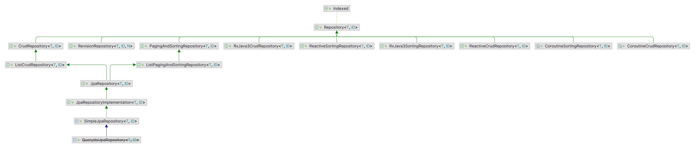

# Spring Data

> ```xml
><!--H2 DB-->
> <groupId>com.h2database</groupId>
> <artifactId>h2</artifactId>
> <scope>runtime</scope>
> ```

| 自动脚本文件 | 说明                                                         |
| ------------ | ------------------------------------------------------------ |
| schema\.sql  | src/main/resources/schema\.sql。<br />模式定义，若应用的根路径下存在该文件，则应用启动时会基于数据库执行该文件。 |
| data\.sql    | src/main/resources/data.sql。<br />预加载数据，同上，在数据源bean初始化时执行，适用于任何关系型数据库。 |

## [JDBC](./JDBC.md)

## [Cassandra](./Cassandra.md)

## [MongoDB](./MongoDB.md)

# Spring Data Commons

## Repository 存储库接口

> org.springframework.data.repository.Repository;

- Repository是Spring Data数据库操作的最顶级父类，继承该接口会基于存储库规范接口自动创建存储库，而不需要编写实现类。



```java
Xxx extends Repository<持久化对象类型,持久化对象ID类型>{}
```

> 数据预加载：CommandLineRunner、ApplicationRunner接口，对关系型、非关系型数据库均有效。

| 常用接口               | 存储库规范接口操作             |
| ---------------------- | ------------------------------ |
| CrudRepository         | 常用的CRUD                     |
| PagingAndSortRpository | 分页、排序                     |
| JpaRepository          | 关系型数据库                   |
| SimpleJpaRepository    | 关系型数据库的Repository实现类 |

## 自定义查询

- Spring Data在生成存储库实现时，检查存储库接口的所有方法，解析方法的名称，并基于被持久化的对象来试图推测方法的目的（DSL 领域特定语言）。持久化的细节都是通过存储库方法的签名实现的。

> Spring Data会忽略大多数的主题单词。

```java
public Interface TacoOrder extends CrudRepository{
    //动词+[主题]+关键词By+断言
    findByDeliveryZip(String deliveryZip);//动词find、主题暗含TacoOrder、关键词By、断言DeliveryZip。
}
```

| 方法签名的操作符 | 说明 |
| ---------------- | ---- |
|                  |      |

| 注解 | @Query                                         |
| ---- | ---------------------------------------------- |
| 位置 | 查询方法                                       |
| 作用 | 指明方法调用时执行的查询，而不是根据方法签名。 |
| 参数 | SQL查询语句<br />（JPA中可以使用JPA查询）      |

# ORM框架

- ORM（Object Relation Mapping）对象注解映射关系。

## [JPA](./JPA.md)

```xml
<groupId>org.springframework.boot</groupId>
<artifactId>spring-boot-starter-data-jpa</artifactId>
```

## [MyBatis](./MyBatis.md)

# Spring Data REST

```xml
<groupId>org.springframework.boot</groupId>
<artifactId>spring-boot-starter-data-rest</artifactId>
```

- Spring Data REST：基于储存库自动生成REST API，尝试使用相关实体类的复数来创建端点。Spring Data REST暴露了一个主资源，包含所有端点的链接。

```properties
# 设置API的基础路径
spring.data.rest.base-path=/
```

> Spring HATEOAS为Spring MVC控制器的响应中添加超链接，提供通用的支持。

| 注解 | @RestResource                                    |
| ---- | ------------------------------------------------ |
| 位置 | 类注解                                           |
| 作用 | 为实体类提供指定的关系名和路径                   |
| 参数 | rel：关系名<br />path：路径（基于base-path拼接） |

- 主资源上的所有链接都提供了可选的page、size、sort参数，默认请求集合资源返回首页的20个条目。（page从0开始-首页）

| 消费方式     | 说明                                                         |
| ------------ | ------------------------------------------------------------ |
| RestTemplate | Spring提供的简单、同步REST客户端。                           |
| Traverson    | 对RestTemplate的包装，由Spring HATEOAS提供的支持超链接、同步的REST客户端。 |
| WebClient    | 反应式、异步REST客户端。                                     |
