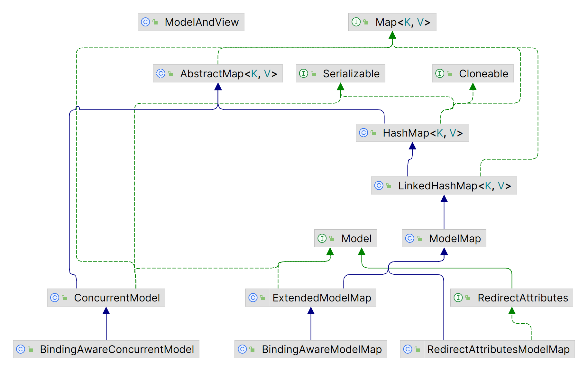

# 控制器

| 名称 | @Controller                                                  |
| ---- | ------------------------------------------------------------ |
| 类型 | 类注解                                                       |
| 作用 | 设定SpringMVC的控制器bean<br />返回值放入模型中，并传递给视图渲染 |

| 注解 | @RestController              |
| ---- | ---------------------------- |
| 位置 | 类注解                       |
| 作用 | @Controller \+ @ResponseBody |

## DispatcherServlet

- DispatcherServlet：基于Java Servlet API的前端控制器，它是整个Spring Web MVC框架的核心组件，负责接收、处理和转发所有的HTTP请求。

1. 初始化阶段：在服务器启动后，DispatcherServlet首先会被加载并创建一个新的WebApplicationContext实例，用于管理所有与Spring Web相关的bean。
2. 请求处理阶段：当接收到一个HTTP请求时，DispatcherServlet会根据请求URL、HTTP方法等信息决定由哪个处理器（Handler）来处理这个请求。
3. 分发阶段：确定了处理器之后，DispatcherServlet会调用该处理器的方法，并传递一个代表当前HTTP请求的对象（如HttpServletRequest和HttpServletResponse）作为参数。
4. 响应处理阶段：处理器处理完请求后，通常会返回一个 ModelAndView 对象，DispatcherServlet会根据这个对象的内容生成响应并发送回客户端。
5. 销毁阶段：在服务器关闭或者应用程序退出时，DispatcherServlet会清理资源并销毁WebApplicationContext。

## Handle 处理器

- Model的查找和执行在DispatcherServlet中是解耦的。控制器负责通过HandlerMapping查找Handler，再交由HandlerAdapter处理。

### HandlerMapping 映射器


#### URL直接映射

- SimpleUrlHandlerMapping提供了一种简单的方式来定义URL和处理程序之间的映射关系，将特定的URL与特定的处理程序类或方法进行关联，当有请求匹配到指定的URL时，就会调用相应的处理程序进行处理。

```java
@Bean
public SimpleUrlHandlerMapping simpleUrlHandlerMapping(MyHandle myHandle){
    SimpleUrlHandlerMapping mapping = new SimpleUrlHandlerMapping();
    mapping.setOrder(1);
    mapping.setUrlMap(Collections.singletonMap("/simpleUrl",myHandle));
    return mapping;
}
```

#### BeanName映射

- BeanNameUrlHandlerMapping将URL与bean名称映射，使用bean名称作为映射的key，将URL与bean名称存储在一个Map中。在处理请求时，它会根据URL查找相应的处理程序bean，并调用处理程序的方法来处理请求。（相当于通过URL来调用该bean）

```java
@Bean(name="/beanNameUrl") //http://localhost:8080/beanNameUrl
public HttpRequestHandler beanNameUrlHandler(){
    return (req,resp) ->{
        resp.getWriter().println("beanNameUrl");
    };
}
```

> - Bean名称映射是指通过在Spring配置文件中指定Bean的名称与其他组件的依赖关系，来实现通过名称来调用Bean的功能。通过在配置文件中设置Bean的名称和依赖关系，可以在代码中通过Bean的名称来获取对应的Bean对象，而无需了解具体的Bean的URL。 
> - 而通过URL来调用Bean是指通过在Web应用中的URL来访问特定的Bean。通过在Web应用的URL中设置特定的参数，可以定位到特定的Bean对象。  
> - BeanNameUrlHandlerMapping是一个实现了Web请求处理器接口的类，它可以根据URL来获取相应的处理Bean。通过将Bean的名称和URL的映射关系定义在配置文件中，可以使用URL来调用对应的Bean。因此，BeanNameUrlHandlerMapping的bean名称映射可以被认为是通过URL来调用该bean的一种方式。

#### @XxxMapping

- RequestMappingHandlerMapping负责解析HTTP请求的URL，并将其与注解（如 @RequestMapping）上定义的逻辑进行匹配，然后将请求交给相应的处理方法进行处理。

| 注解           | @RequestMapping                                              |
| -------------- | ------------------------------------------------------------ |
| 位置           | 类、方法注解                                                 |
| 作用           | 设置当前控制器方法请求访问路径。<br />@RequestMapping注解控制器类时，作为请求路径的前置。 |
| **注解**       | **@GetMapping、@PostMapping、@PutMapping、@DeleteMapping**   |
| 位置           | 方法注解                                                     |
| 作用           | 设置当前控制器方法请求访问路径与请求动作，每种对应一个请求动作。<br />只要访问路径或请求动作有一个不同，就可以使用多个该注解。 |
| **参数**       | **说明**                                                     |
| value/path     | 请求映射路径（默认根路径"/"）                                |
| method         | 指定请求方法                                                 |
| produces       | 限定能够处理的请求                                           |
| **返回值**     | **说明**                                                     |
| String         | 响应的视图名称、重定向到的URL。                              |
| void           | 不需要返回任何响应。                                         |
| ModelAndView   | 响应的视图和模型数据的容器。                                 |
| ResponseEntity | 带有自定义HTTP头和状态代码的HTTP响应。                       |
| 其他类型       | 响应的序列化数据类型。                                       |

> @RequestMapping("/home")搭配@XxxMapping("/design")：请求映射为/home/design。

```java
@RestController
@RequestMapping("/users")
public class UserController {

//    @RequestMapping(value = "/users", method = RequestMethod.POST)
    @PostMapping
    public String save() {
        System.out.println("user save...");
        return "{'module':'user save'}";
    }

//    @RequestMapping(value = "/users/{id}", method = RequestMethod.DELETE)
    @DeleteMapping("/{id}")
    public String delete(@PathVariable Integer id) {
        System.out.println("user delete..." + id);
        return "{'module':'user delete'}";
    }

//    @RequestMapping(value = "/users", method = RequestMethod.PUT)
    @PutMapping
    public String update(@RequestBody User user) {
        System.out.println("user update..." + user);
        return "{'module':'user update'}";
    }

//    @RequestMapping(value = "/users/{id}", method = RequestMethod.GET)
    @GetMapping("/{id}")
    public String getById(@PathVariable Integer id) {
        System.out.println("user getById..." + id);
        return "{'module':'user getById'}";
    }

//    @RequestMapping(value = "/users", method = RequestMethod.GET)
    @GetMapping
    public String getAll() {
        System.out.println("user getAll...");
        return "{'module':'user getAll'}";
    }
}
```

### Handler 处理器执行

#### HttpRequestHandler


- HttpRequestHandler接口的实现类可以处理 HTTP 请求并将响应返回给客户端。实现类需要实现handleRequest()方法，该方法接受一个HttpServletRequest对象和一个HttpServletResponse对象作为参数，并且没有返回值。

- 仅实现了HttpRequestHandler接口的Handler，其查找和执行是分离的，需要被注册到对应的Mapping中，才能生效。

```java
public class MyHttpRequestHandler implements HttpRequestHandler {

    @Override
    public void handleRequest(HttpServletRequest httpServletRequest, HttpServletResponse httpServletResponse) throws ServletException, IOException {
        if (httpServletRequest.getMethod().equals("GET")) {
            httpServletResponse.setContentType("text/html;charset=utf-8");
            httpServletResponse.getWriter().write("<h1>Hello World</h1>");
        } else if (httpServletRequest.getMethod().equals("POST")) {
            httpServletResponse.setContentType("text/html;charset=utf-8");
            httpServletResponse.getWriter().write("<h1>Hello World</h1>");
        } else {
            httpServletResponse.setContentType("text/html;charset=utf-8");
            httpServletResponse.getWriter().write("<h1>Hello World</h1>");
        }
    }
}
```

#### Controller接口

- org\.springframework\.web\.servlet\.mvc\.Controller用于定义处理 HTTP 请求的控制器类（不是@Controller）。实现Controller接口的类可以接收HTTP请求并生成HTTP响应。Spring Web MVC 框架会自动将符合特定规则的控制器类处理的方法注册为处理特定URL的处理方法。其中handleRequest()方法接收HttpServletRequest和HttpServletResponse对象作为参数，并返回一个ModelAndView对象（用于将数据模型和视图名称返回给Servlet容器）。

```java
@Component("/myController") //通过BeanNameUrlHandlerMapping调用
public class MyHttpRequestHandler implements org.springframework.web.servlet.mvc.Controller {
    @Override
    public ModelAndView handleRequest(HttpServletRequest httpServletRequest, HttpServletResponse httpServletResponse) throws Exception {
        Map<String,Object> model = new HashMap<>();
        model.put("name","Tom");
        return new ModelAndView("testView",model);
    }
}
```

#### HandlerMethod

- HandlerMethod封装处理请求的Handler方法（一般是@XxxMapping标注的方法），包含了Handler方法的Method对象、Handler类的Class对象、Handler方法的参数类型等信息。
- RequestMappingHandlerMapping会扫描并封装被@Controller标注的类中被@XxxMapping标注的方法为HandlerMethod。

1. 请求参数自动绑定：请求参数可以自动绑定到方法参数内。
2. Model模型自动绑定：如果在方法参数中声明了Map类型的model，则由RequestMappingHandlerAdapter自动生成Modle模型并绑定到该参数。
3. 视图自动查找（没有@ResponseBody标注）：返回String类型的视图名，由RequestMappingHandlerAdapter自动查找相应名称的视图，并自动与参数中的Model绑定（如果存在Model参数）。

> Controller接口方式返回的是ModelAndView，并没有以上三种特性，需要通过req.getParameter("name")的方式来获取参数。

### HandlerInterceptor 拦截器

- 拦截器是HandlerInterceptor的实现类。在查找处理器时，HandlerMapping并不直接返回Handler，而是Handler的执行链HandlerExecutionChain，其封装需要应用到该Handler上的所有拦截器。

1. 定位拦截器：Spring MVC首先会扫描所有的拦截器，并将它们存储在一个列表中。  
2. 实现拦截器逻辑：每个拦截器都需要实现preHandle()方法、postHandle()方法、afterCompletion()方法。preHandle()方法在控制器方法调用之前执行，postHandle()方法在控制器方法调用之后执行，afterCompletion()方法在控制器方法抛出异常时执行。  
3. 执行控制器方法：当所有的拦截器都执行完毕后，Spring MVC会调用控制器方法。
4. 回收：在控制器方法返回结果之后，Spring MVC会执行所有的postHandle()方法、afterCompletion()方法，然后拦截器链执行完毕。

- 定义拦截器之后，还需要将其通过WebMvcConfigurer\#addInterceptors\(\.\.\)、@Intercepts等方式注册到Spring MVC环境中，才能生效。

 

| 注解     | @Order                                                       |
| -------- | ------------------------------------------------------------ |
| 位置     | 拦截器类                                                     |
| 作用     | 标注拦截器的执行顺序，如果两个拦截器的Order值相同，会根据它们的实现类名称的字母顺序来确定它们的执行顺序 |
| **注解** | **@Intercepts**                                              |
| 位置     | 拦截器类                                                     |
| 作用     | 指定一个URL路径、或包含一个FilterRegistrationBean对象被拦截器拦截，可用于配置更多的拦截器参数<br />（仅SpringMVC中存在） |
| **注解** | **@Filter**                                                  |
| 位置     | 拦截器类                                                     |
| 作用     | 指定一个URL路径，该路径将被拦截器拦截，只能配置一个拦截器<br />（仅SpringMVC中存在） |

```java
@Order(1)
@Intercepts(@Filter("/login"))
public class ProjectInterceptor implements HandlerInterceptor {
    @Override
    public boolean preHandle(HttpServletRequest request, HttpServletResponse response, Object handler) throws Exception { 
        HandlerMethod handlerMethod = (HandlerMethod) handler;
        Method method = handlerMethod.getMethod(); //获得原始执行方法
        return true;
    }

    @Override
    public void postHandle(HttpServletRequest request, HttpServletResponse response, Object handler, ModelAndView modelAndView) throws Exception {
    }

    @Override
    public void afterCompletion(HttpServletRequest request, HttpServletResponse response, Object handler, Exception ex) throws Exception {
        if(ex != null){
            ex.printStack();
        }
    }
}
```

### HandlerExecutionChain 处理器执行链

- HandlerExecutionChain包含了处理器方法中的HandlerMethod对象、Handler层次结构、Interceptors（拦截器）的顺序。

1. 在处理请求时，Spring MVC会通过RequestMappingHandlerMapping来寻找处理器，RequestMappingHandlerMapping会根据请求的路径来匹配处理器方法，并返回一个HandlerExecutionChain。
2. 接着，Spring MVC会通过HandlerAdapter来执行处理器方法，HandlerAdapter会根据请求的类型和处理器方法的方法signature来执行对应的方法，并返回处理结果。
3. 最后，Spring MVC会通过HandlerInterceptor来执行拦截器，在处理器方法执行前后进行一些操作。

# Model 模型

 

- Model对应于一次用户的请求处理（一个请求内所有的Model操作都是同一个实例），负责控制器和视图之间的数据传递，Model属性中的数据被复制到Servlet Request属性。

| 模型相关类型       | 说明                                                        |
| ------------------ | ----------------------------------------------------------- |
| Map                | 模型数据存储的基本类型，视图渲染时也使用该类型              |
| Model              | SpringMVC对模型数据操作的抽象，可通过asMap(..)方法转换为Map |
| RedirectAttributes | addFlashAttribute(..)方法来添加重定向可用的Map参数          |
| ExtendedModelMap   | @XxxMapping处理前，SpringMVC自动绑定ExtendedModelMap        |

```java
@GetMapping("/thymeleafHello")
public String hello(Model model){
    model.addAttribute("name","张三");
    model.addAttribute("age",18);
    return "thymeleafHello";
}
```

## 模型数据绑定

### ExtendedModelMap自动绑定

- SpringMVC自动为@XxxMapping标志的方法绑定ExtendedModelMap。ExtendedModelMap的子类或父类（大部分可以）实现以下操作：

1. 方法参数声明为该类型的，会自动绑定模型数据，只要不返回就不会对原有的模型数据造成影响。
2. 方法内部声明为该类型的，返回的模型数据会对原有的模型数据造成影响，且视图为@XxxMapping指定的URL路径。

```java
@GetMapping("/showUser")
public String showUser(Model model){
    model.addAttribute("username","Tom");
    return "showUser";
}

@GetMapping("/showUser")
public Model showUser(){
    Model model<String,Object> = new ExtendedModelMap();
    model.addAttribute("username","Tom");
    return model;
}
```

### @ModelAttribute

| 注解 | @ModelAttribute                                              |
| ---- | ------------------------------------------------------------ |
| 位置 | 形参、方法注解                                               |
| 方法 | 返回值自动存入ExtendedModelMapModel                          |
| 形参 | 数据绑定，该形参的值从模型取得，对该参数的修改不影响模型内的值。<br />若模型中找不到名称匹配的，则该参数会先被实例化（必须能够实例化），然后被添加到模型中。 |
| 属性 | name：添加/匹配到model的属性名称（默认为当前标注的参数名称）。 |

- 同个控制器内的@ModelAttribute方法先于@RequestMapping方法被调用。（如果同时被@XxxMapping和@ModelAttribute标注，则返回值不再是视图名，而是Model的一个属性）

```java
@GetMapping("/showUser")
@ModelAttribute("username")
public String showUser(){
    return "Tom";
}

@GetMapping("/showUser")
@ModelAttribute("username")
public String showUser(@ModelAttribute("username") String username){
    //从模型中获取的username仍然是空的，为什么？？？
    username = "Tom";
    return username;
}
```

### ModelAndView

- ModelAndView同时封装模型数据和视图信息，设置模型数据和视图名称，并将其返回给 DispatcherServlet，然后由 DispatcherServlet 进行视图的解析和渲染。

```java
@RequestMapping("/user")
public ModelAndView getUser() {
    User user = userService.getUser();  // 假设从数据库中获取到了用户数据

    ModelAndView modelAndView = new ModelAndView();
    modelAndView.addObject("user", user);  // 将用户数据添加到模型
    modelAndView.setViewName("user");  // 设置视图名称

    return modelAndView;
}
```

### RedirectAttributes

- RedirectAttributes只对重定向视图有效。

## BindingResult 捕获绑定和验证过程中的错误信息

# View 视图

- org.springframework.web.servlet.View封装了所有的视图实现，该接口的render(..)方法依据传入的Map类型的model对视图文件进行渲染，并传入到Responce完成处理。控制器只负责调用视图的渲染方法，将视图与Model绑定；而视图的渲染则是由视图的实现来执行。

## 视图类型

### 内部资源视图 InternalResourceView

- InternalResourceView从服务器端渲染页面，使用RequestDispatcher接口（getRequestDispatcher()）将请求转发到服务器上的其他JSP或Servlet，并且不生成新的请求，URL不会出现变化。
- 转发前模型中的数据通过req.setAttribute()加入到req的属性中，而在转发的过程中req不改变，可通过req.getAttribute()来获取数据，实现数据共享。

### 重定向视图 RedirectView

- RedirectView重定向浏览器到一个新的URL上，生成新的请求（原有的请求和Model中的数据都丢失）。

```java
return "forward:/user"; //服务器内部转发
return "redirect:/user"; //服务器重定向
```

### 模板引擎视图 [Thymeleaf](./Books/Spring/Thymeleaf.md)

## 视图解析 ViewResolver

### BeanName视图解析 BeanNameViewResolver

- BeanNameViewResolver执行解析要求bean类型为View接口的实现类，使用该bean来渲染视图。

```java
@GetMapping("/beanNameView")
public String beanNameView(Model model){
    model.addAttribute("name","Tom");
    return "beanNameView";
}
```

```java
@Component("beanNameView")
class CustomView implements View {

    @Override
    public String getContentType() {
        return MediaType.TEXT_HTML_VALUE;
    }

    @Override
    public void render(Map<String, ?> map, HttpServletRequest httpServletRequest, HttpServletResponse httpServletResponse) throws Exception {
        Object name = map.get("name");
        httpServletResponse.getWriter().append("name is " + name);
    }
}
```

```java
@Bean("beanNameView")
public View beanNameView(){
    return new View() {

        @Override
        public String getContentType() {
            return MediaType.TEXT_HTML_VALUE;
        }

        @Override
        public void render(Map<String, ?> map, HttpServletRequest httpServletRequest, HttpServletResponse httpServletResponse) throws Exception {
            httpServletResponse.getWriter().append("name is " + map.get("name"));
        }
    };
}
```

### 模板引擎视图解析

#### ThymeleafViewResolver

- 引入spring-boot-starter-thymeleaf依赖后，Spring Boot自动配置生成ThymeleafResolver到Spring MVC中，控制器可以引用此视图解析器。

```yaml
spring: 
	thymeleaf: 
    	prefix: classpath:/templates/
    	suffix: .html
```

### 内部资源视图解析 InternalResourceViewResolver

- InternalResourceViewResolver用于处理各种内部特殊视图，判断视图的前缀类型（forward:、redirect:），并返回对应类型的视图。

### 直接指定视图

- 控制器的@XxxMapping方法中直接返回View类型的实例，跳过视图解析的过程。	

# WebMvcConfigurer

- WebMvcConfigurer接口定义了多个Spring MVC的配置方法（default），所有配置类都可以实现该接口并覆盖其方法。

| WebMvcConfigurer方法        | 说明                     |
| --------------------------- | ------------------------ |
| addViewControllers          | 添加需要跳转的视图控制器 |
| addArgumentResolvers        | 添加请求参数解析器       |
| addViewResolvers            | 添加视图解析器           |
| addInterceptors             | 添加拦截器               |
| configureMessageConverters  | 配置消息转换器           |
| addResourceHandlers         | 添加静态资源处理器       |
| configurePathMatch          | 配置路径匹配方式         |
| configureContentNegotiation | 配置内容协商             |
| configureHandlerMapping     | 配置处理器映射器         |
| configureHandlerAdapter     | 配置处理器适配器         |


## addViewControllers 注册视图控制器

```java
public void addViewControllers(ViewControllerRegistry registry) {
    registry.addViewController("/").setViewName("home");
}
```

- addViewController("/myUrl") 设置视图控制器，可以设置多层url映射（如 "/\*\*"）。当请求路径为"myUrl"时，Spring MVC将该请求转发给该视图控制器处理，进行视图渲染等操作。setViewName("/myView") 设置显示的视图，渲染该视图到响应中返回给客户端。

 

## addInterceptors 注册拦截器

```java
@Autowired
private MyInterceptor myInterceptor;

@Override
public void addInterceptors(InterceptorRegistry registry) {
    registry.addInterceptor(myInterceptor).addPathPatterns("/books","/books/**");
}
```

## addResourceHandlers 静态资源处理器

```java
protected void addResourceHandlers(ResourceHandlerRegistry registry) {
    //当访问/pages/*时，走/pages目录下的内容
    registry.addResourceHandler("/pages/**").addResourceLocations("/pages/");
    registry.addResourceHandler("/js/**").addResourceLocations("/js/");
    registry.addResourceHandler("/css/**").addResourceLocations("/css/");
    registry.addResourceHandler("/plugins/**").addResourceLocations("/plugins/");
}
```

# MVC功能扩展

| 名称 | @EnableWebMvc                                                |
| ---- | ------------------------------------------------------------ |
| 类型 | 类注解                                                       |
| 位置 | 配置类定义上方                                               |
| 作用 | 自行配置SpringMVC多项辅助功能<br />（不建议开启，会导致部分自动配置失效） |

## ServletInitializer 前端控制器

| 前端控制器抽象类                                     | 说明                                                         |
| ---------------------------------------------------- | ------------------------------------------------------------ |
| AbstractAnnotationConfigDispatcherServletInitializer | Spring和SpringMVC环境整合。<br />SpringMVC环境可以访问Spring环境，而Spring环境访问不了SpringMVC环境。 |
| AbstractDispatcherServletInitializer                 |                                                              |

```java
public class ServletContainersInitConfig extends AbstractAnnotationConfigDispatcherServletInitializer {

    @Override
    protected Class<?>[] getRootConfigClasses() {
        return new Class[]{SpringConfig.class}; //Spring环境
    }

    @Override
    protected Class<?>[] getServletConfigClasses() {
        return new Class[]{SpringMvcConfig.class}; //SpringMVC环境
    }

    @Override
    protected String[] getServletMappings() {
        return new String[]{"/"}; //拦截路径
    }
}
```

```java
public class ServletContainersInitConfig extends AbstractDispatcherServletInitializer {

    @Override
    protected WebApplicationContext createServletApplicationContext() {
        //将Spring容器添加到Web容器中
        AnnotationConfigWebApplicationContext applicationContext = new AnnotationConfigWebApplicationContext();
        applicationContext.register(SpringMvcConfig.class);
        return applicationContext;
    }

    @Override
    protected String[] getServletMappings() {
        return new String[]{"/"}; //设置被拦截的路径
    }

    @Override
    protected WebApplicationContext createRootApplicationContext() {
        return null;
    }
}
```

## Converter 类型转换器

- Converter接口：由SpringMVC对传递参数进行类型转换。

> Converter所属的包为org.springframework.core.convert.converter。

```java
@FunctionalInterface
public interface Converter<S, T> {
    @Nullable
    T convert(S var1);

    default <U> Converter<S, U> andThen(Converter<? super T, ? extends U> after) {
        Assert.notNull(after, "After Converter must not be null");
        return (s) -> {
            T initialResult = this.convert(s);
            return initialResult != null ? after.convert(initialResult) : null;
        };
    }
}
```

- HttpMessageConvert接口的内部通过Converter接口（HttpMessageConvert接口）的实现类完成类型转换（pojo \-\> json、Collection \-\> json）。

## @RestControllerAdvice 异常处理器

| 注解 | @RestControllerAdvice |
| ---- | --------------------- |
| 位置 | 类注解                |
| 作用 | 标注异常处理器        |

| 注解 | @ExceptionHandler                                            |
| ---- | ------------------------------------------------------------ |
| 位值 | 方法注解                                                     |
| 作用 | 设置指定异常的处理方案，功能等同于控制器方法。<br />出现异常后终止原始控制器执行，并转入当前方法执行。 |

```java
@RestControllerAdvice
public class ProjectExceptionAdvice {
    @ExceptionHandler(SystemException.class)
    public Result doSystemException(SystemException ex) {
        //记录日志
        //发送消息给运维
        //发送消息给开发人员
        return new Result(ex.getCode(), null, ex.getMessage());
    }

    @ExceptionHandler(BusinessException.class)
    public Result doBusinessException(BusinessException ex) {
        return new Result(ex.getCode(), null, ex.getMessage());
    }

    @ExceptionHandler(Exception.class)
    public Result doException(Exception ex) {
        return new Result(Code.SYSTEM_UNKNOW, null, "安抚客户");
    }
}
```

# 1

## @ResponseBody  响应体

| 注解       | @ResponseBody                                   |
| ---------- | ----------------------------------------------- |
| 位置       | 类、方法注解                                    |
| 作用       | 返回值直接写入响应体                            |
| **返回值** | **说明**                                        |
| String     | 文本内容响应给前端（而不是Mapping的页面跳转）。 |
| 对象       | 对象转换成JSON响应给前端。                      |

## @CrossOrigin 跨域资源访问

| 注解 | @CrossOrigin                                         |
| ---- | ---------------------------------------------------- |
| 位置 | 类注解                                               |
| 作用 | 跨域资源共享（Cross Origin Resource Sharing，RCORS） |

## @ResponseStatus 响应状态码

| 注解 | @ResponseStatus      |
| ---- | -------------------- |
| 位置 | 方法注解             |
| 作用 | 返回指定的响应状态码 |
| 参数 | HttpStatus.XXX       |

# 数据传递

| 注解          | 区别：接收参数                     | 应用                                                      |
| ------------- | ---------------------------------- | --------------------------------------------------------- |
| @RequestBody  | url地址/表单传参                   | 发送请求参数超过1个时，以json格式为主。                   |
| @RequestParam | json数据                           | 发送非json格式数据，接收请求参数。                        |
| @PathVariable | 路径参数，\{参数名称\}描述路径参数 | RESTful，参数数量较少时，接收请求路径变量，通常传递id值。 |

## 参数类型

| 参数类型 | 传递方式                                                     |
| -------- | ------------------------------------------------------------ |
| 值       | url地址传参，地址参数名与形参变量名相同时，自动接收参数。    |
| POJO     | 请求参数名与形参对象属性名相同时，自动接收参数。             |
| 嵌套POJO | 请求参数名与形参对象属性名相同时，按照对象层次结构关系接收嵌套POJO属性参数。 |
| 数组     | 请求参数名与形参对象属性名相同且请求参数为多个，定义数组类型即可接收参数 |
| 集合     | 同名请求参数可以使用@RequestParam注解映射到对应名称的集合对象中作为数据 |

### POJO参数

```java
//http://localhost:8080/user/userParam?id=9&name=zjk&age=18
@RequestMapping("/userParam")
@ResponseBody
public String commonParam(User user){ //id、name、age
    return "{'info':'userParam'}";
}
```

### 嵌套POJO参数

- 按照对象层次结构关系：作为属性的POJO.属性。

```java
@RequestMapping("/userParam")
@ResponseBody
public String commonParam(User user){ //User:id,name,age,address(Address:province,city)
    return "{'info':'userParam'}";
}
```

### 数组参数

- 数组名必须一致才能封装到一个数组中。

```java
@RequestMapping("/arrParam")
@ResponseBody
public String arrParam(String[] infos) {
    return "{'info':'arrParam'}";
}
```

### 日期参数 @DateTimeFormat

| 注解     | @DateTimeFormat                 |
| -------- | ------------------------------- |
| 位置     | 形参注解                        |
| 作用     | 设定日期时间型数据格式          |
| 相关属性 | pattern：指定日期时间格式字符串 |

```java
@RequestMapping("/dateParam")
@ResponseBody
public String dateParam(@DateTimeFormat(pattern = "yyyy-mm-dd") Date date1,
                        @DateTimeFormat(pattern = "yyyy-mm-dd HH:mm:ss") Date date2){
    return "{'info':'date'}";
}
```

## @RequestParam 请求参数

| 注解 | @RequestParam                                                |
| ---- | ------------------------------------------------------------ |
| 位置 | 形参注解                                                     |
| 作用 | 绑定形参和地址参数。<br />（形参与地址参数名不一致时，需要该注解指定） |
| 参数 | required：是否为必传参数 <br>defaultValue：参数默认值        |

```java
//http://localhost:8080/user/userParam?id=9&name=zjk&age=18
@RequestMapping("/commonParam")
@ResponseBody
public String commonParam(@RequestParam("name") String userName,
                          @RequestParam("age") Integer age){
    System.out.println(userName);
    System.out.println(age);
    return "{'info':'commonParam'}";
}

@RequestMapping("/listParam")
@ResponseBody
public String listParam(@RequestParam List<String> list) {
    return "{'info':'arrParam'}";
}
```

## @RequestBody 请求体

| 注解 | @RequestBody                                                 |
| ---- | ------------------------------------------------------------ |
| 位置 | 形参注解                                                     |
| 作用 | 将请求中请求体所包含的数据传递给请求参数<br />一个方法只能使用存在一个该注解。 |

```java
@RequestMapping("/userParamForJson")
@ResponseBody
public String userParamForJson(@RequestBody User user) {
    return "{'info':'userParamForJson'}";
}

@RequestMapping("/listParamForJson")
@ResponseBody
public String listParamForJson(@RequestBody List<String> list) {
    return "{'info':'listParamForJson'}";
}

@RequestMapping("/userListParamForJson")
@ResponseBody
public String userListParamForJson(@RequestBody List<User> list) {
    return "{'info':'userListParamForJson'}";
}
```

## @PathVariable 路径参数绑定

| 注解 | @PathVariable                                  |
| ---- | ---------------------------------------------- |
| 位置 | 形参注解                                       |
| 作用 | 绑定路径参数和形参，路径参数名与形参名一一对应 |

```java
@RequestMapping(value = "/users/{id}", method = RequestMethod.GET)
@ResponseBody
public String getById(@PathVariable Integer id){
    return "{'module':'user getById'}";
}
```

## @SessionAttributes

| 注解 | @SessionAttributes                                           |
| ---- | ------------------------------------------------------------ |
| 位置 | 控制器类                                                     |
| 作用 | 注解类中存放到Model中的属性在会话中会一直保持。<br />搭配@ModelAttribute使用。 |

> SessionStatus 接口会话状态
>
> ```java
> //将当前处理程序的会话处理标记为完成，允许清理会话属性。
> sessionStatus.setComplete();
> ```
