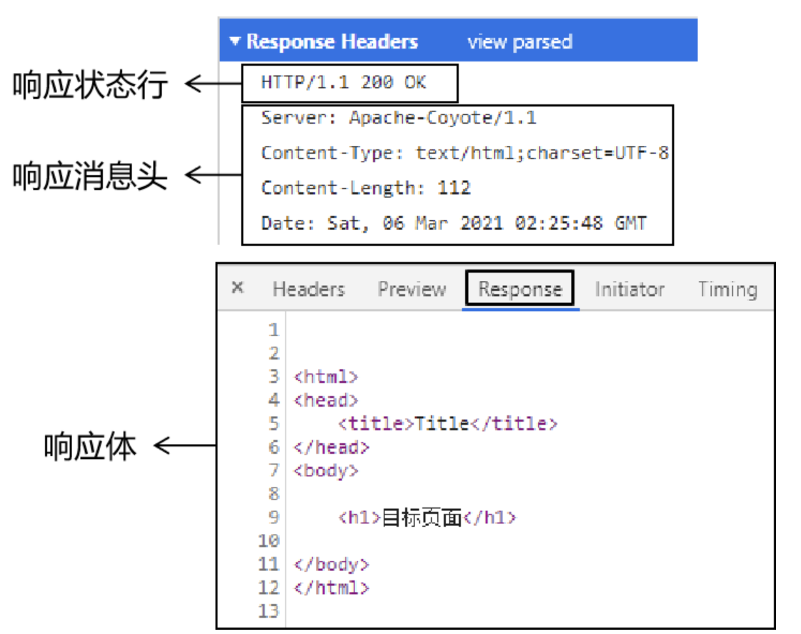
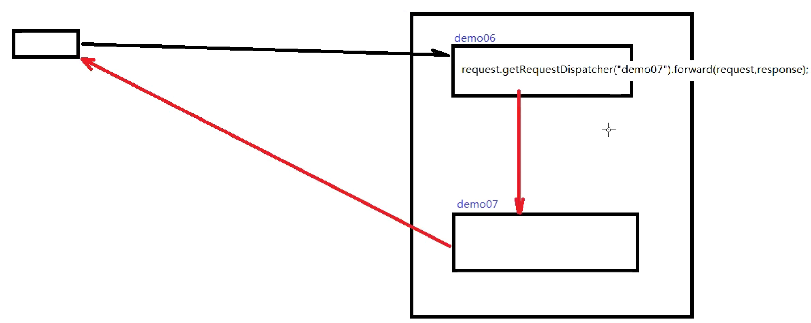
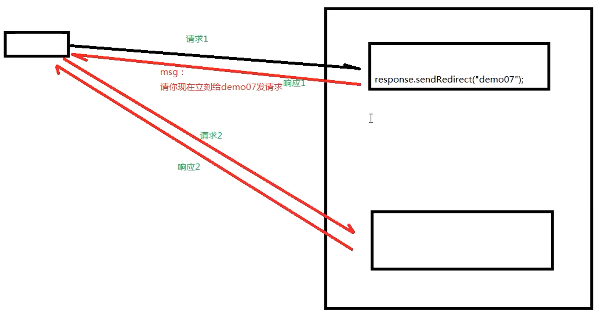
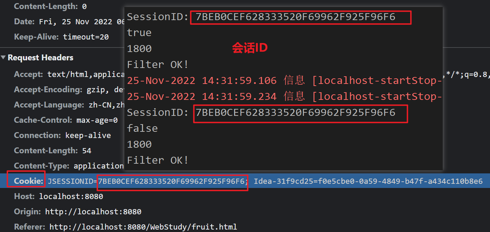
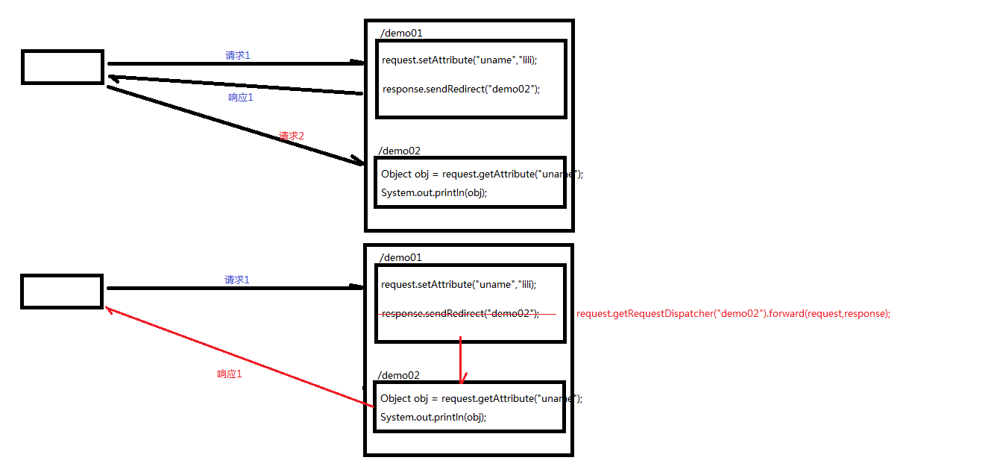
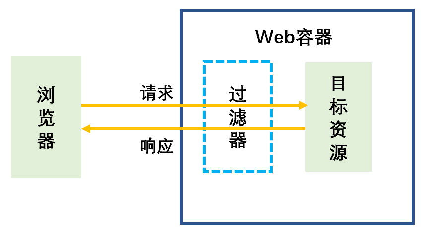
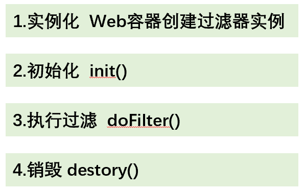

# JavaWeb（Servlet）


## Web基础

### C/S、B/S

| 体系结构                    | 说明                                                         |
| --------------------------- | ------------------------------------------------------------ |
| C/S <br />客户端/服务器结构 |  |
| B/S <br />浏览器/服务器结构 |  |

| 比较           | C/S                                                          | B/S                                                          |
| -------------- | ------------------------------------------------------------ | ------------------------------------------------------------ |
| 开发和维护成本 | 不同的客户端要开发不同的应用程序而且软件的安装、调试和升级均需要在所有的客户机上进行。 | 不必在客户端进行安装和维护，只需要对服务器进行升级维护即可。 |
| 客户端负载     | 减轻服务器的压力<br />减轻网络负荷                           | 服务器的负荷较重<br />网络负荷较重                           |
| 安全性         | 高于B/S                                                      |                                                              |

### MVC三层架构

| 层级                     | 说明                                             |
| :----------------------- | :----------------------------------------------- |
| Model（数据访问层）      | 对数据库的CRUD基本操作。                         |
| Controller（业务逻辑层） | 对业务逻辑进行封装，组合数据访问层中的基本功能。 |
| View（表现层）           | 接受请求，封装数据，调用业务逻辑层，响应数据。   |


### HTTP 超文本传输协议

- Http是无状态的，需要HttpSession来表示会话。

#### 请求

**请求： 请求行、请求消息头、请求主体。**


| 请求部分   | 说明                                                         |
| ---------- | ------------------------------------------------------------ |
| 请求行     | 请求的方式<br />请求的URL<br />请求的协议（一般都是HTTP1.1） |
| 请求消息头 | 客户端需要告诉服务器的信息                                   |
| 请求体     |                                                              |

| 请求方式 | 说明                                                         |
| -------- | ------------------------------------------------------------ |
| GET      | 从服务器端获取数据。<br />没有请求体、  请求参数附着在URL地址后面。 |
| POST     | 将数据保存到服务器端<br />有请求体、请求参数放在请求体中。   |
| PUT      | 命令服务器对数据执行更新。                                   |
| DELETE   | 命令服务器删除数据。                                         |
| 其他     | HEAD、CONNECT、OPTIONS、TRACE。                              |

| 请求消息头部分 | 功能                                                   |
| -------------- | ------------------------------------------------------ |
| Host           | 服务器的主机地址。                                     |
| Accept         | 声明当前请求能够接受的媒体类型。                       |
| Referer        | 当前请求来源页面的地址。                               |
| Content-Length | 请求体内容的长度。                                     |
| Content-Type   | 请求体的内容类型，这一项的具体值是媒体类型中的某一种。 |
| Cookie         | 浏览器访问服务器时携带的Cookie数据。                   |

#### 响应

| 响应   | 说明                                                         |
| ------ | ------------------------------------------------------------ |
| 响应行 | 协议、响应状态码(200) 、响应状态(ok)。                       |
| 响应头 | 服务器的信息、服务器发送给浏览器的信息<br />响应体的说明书、服务器端对浏览器端设置数据。 |
| 响应体 | 服务器返回的数据主体，有可能是各种数据类型。                 |



| [响应状态码 ](https://config.net.cn/tools/HttpStatusCode.html) | 原因短语                         | 说明                       |
| :----------------------------------------------------------- | :------------------------------- | -------------------------- |
| 1XX                                                          | Informational（信息性状态码）    | 接收的请求正在处理         |
| 2XX                                                          | Success（成功状态码）            | 请求正常处理完毕           |
| 3XX                                                          | Redirection（重定向）            | 需要进行附加操作以完成请求 |
| 4XX                                                          | Client Error（客户端错误状态码） | 服务器无法处理请求         |
| 5XX                                                          | Server Error（服务器错误状态码） | 服务器处理请求出错         |

| 响应头部分       | 功能                                          |
| ---------------- | --------------------------------------------- |
| Content-Type     | 响应体的内容类型（text/html、image/jpeg等）。 |
| Content-Length   | 响应体的内容长度（字节数）。                  |
| Content-Encoding | 表示该响应压缩算法（gzip等）。                |
| Set-Cookie       | 服务器返回新的Cookie信息给浏览器。            |
| location         | 重定向时，告诉浏览器访问下一个资源的地址。    |

## Tomcat

| 目录结构 | 说明           |
| -------- | -------------- |
| bin      | 可执行文件目录 |
| conf     | 配置文件目录   |
| lib      | 存放lib目录    |
| logs     | 日志文件目录   |
| temp     | 临时目录       |
| webapps  | 项目部署目录   |
| work     | 工作目录       |

> 其他文件：BUILDING.txt、CONTRIBUTING.md、LICENSE、NOTICE、README.md、RELEASE-NOTES、RUNNING.txt。

```shell
# JAVA_HOME 也需要配置
# set Tomcat enviroment
export CATALINA_HOME=/opt/Tomcat9
export PATH=$PATH:$CATALINA_HOME\lib:$CATALINA_HOME\bin
```

> Tomcat是用C和Java编写的。 

- Tomcat默认的地址为`http://localhost:8080`。

## Servlet

```xml
<dependency>
    <groupId>javax.servlet</groupId>
    <artifactId>javax.servlet-api</artifactId>
    <version>3.1.0</version>
    <scope>provided</scope>  
    <!--provided是为了之后打包成war包后在Tomcat中运行不会报错-->
</dependency>
```


### HttpServlet

 

  

- HTTP的请求方式包括DELETE,GET,OPTIONS,POST,PUT和TRACE：doDelete()、doGet()、doOptions()、doPost()、doPut()、doTrace()。

- HttpServlet依据请求方式的不同而采用不同的处理方法：请求方式由form表单的method属性确定。

```java
@WebServlet("/httpTest")
public class HttpServletTest extends HttpServlet {
    @Override
    protected void doGet(HttpServletRequest req, HttpServletResponse resp) throws ServletException, IOException {
        System.out.println("get...");
    }

    @Override
    protected void doPost(HttpServletRequest req, HttpServletResponse resp) throws ServletException, IOException {
        System.out.println("post...");
    }
}
```

### 生命周期

| Servlet生命周期 | 说明                                                         |
| --------------- | ------------------------------------------------------------ |
| 加载和实例化    | 默认当Servlet第一次被访问时，由容器创建Servlet对象。         |
| 初始化          | Servlet实例化之后，容器调用Servlet的**init()**方法初始化该对象。<br />**（init()方法只调用一次）** |
| 请求处理        | **每次请求Servlet时**，Servlet容器都会调用Servlet的**service()**方法对请求进行处理。 |
| 服务终止        | **释放内存/容器关闭时**，容器调用Servlet实例的**destroy()**方法。<br />destroy()方法调用之后，容器释放该Servlet实例（随后会被gc）。 |

**Servlet的初始化时机：**

- 默认情况下，第一次请求时，tomcat才会去实例化、初始化，耗时较长。
- `<servlet>`中的`<load-on-startup>`设置servlet启动的先后顺序，数字越小，启动越靠前，最小值0。

**Servlet在容器中是单例的、线程不安全的。**

| Servlet方法                                                  | 说明   |
| :----------------------------------------------------------- | :----- |
| void init(ServletConfig servletConfig)                       | 初始化 |
| void destory()                                               | 摧毁   |
| void service(ServletRequest servletRequest, ServletResponse servletResponse) | 服务   |
| String getServletInfo()                                      |        |
| ServletConfig getServletConfig()                             |        |

### 配置Servlet

#### web.xml

| `<servlet>`                              | Servlet内部名映射到一个Servlet类名（全限定名） |
| ---------------------------------------- | ---------------------------------------------- |
| `<servlet-name>类名</servlet-name>`      |                                                |
| `<servlet-class>全限定名<servlet-class>` |                                                |

| `<servlet-mapping>`             | 将用户访问的URL映射到Servlet内部名            |
| ------------------------------- | --------------------------------------------- |
| `<servlet-name></servlet-name>` | 必须与`<servlet>`元素中的`<servlet-name>`一致 |
| `<url-pattern></url-pattern>`   | 容器无法识别同时拥有两种匹配规则的pattern     |

- 一个 `<servlet>`可以对应多个`<servlet-mapping>`，即：可以将同一个Servlet程序应用于多个不同的页面(urlPatterns)。

```xml
<?xml version="1.0" encoding="UTF-8"?>
<web-app xmlns="http://xmlns.jcp.org/xml/ns/javaee"
         xmlns:xsi="http://www.w3.org/2001/XMLSchema-instance"
         xsi:schemaLocation="http://xmlns.jcp.org/xml/ns/javaee http://xmlns.jcp.org/xml/ns/javaee/web-app_4_0.xsd"
         version="4.0">
    <servlet>
        <servlet-name>MyServlet</servlet-name> <!--用来映射的名字，可以随便起-->
        <servlet-class>com.zjk.JSP.MyServlet</servlet-class> <!--指向该类的地址 包名+类名-->
    </servlet>
    <servlet-mapping>
        <servlet-name>MyServlet</servlet-name> <!--映射中的servlet-name要与servlet中的一致-->
        <url-pattern>/MyServlet</url-pattern> <!--指向的网页的URL（地址）-->
    </servlet-mapping>
</web-app>
```

#### @WebServlet

| @WebServlet()参数 | 说明                                    |
| :---------------- | :-------------------------------------- |
| urlPatterns       | 请求映射路径。<br />相当于url-pattern。 |
| loadOnStartup     | 初始化Servlet对象（默认-1）。           |

```java
@WebServlet("urlPatterns")
@WebServlet(urlPatterns = {"/demo1","/demo2"}) 
```

### 请求映射路径

- Servlet中请求映射路径的起点（DefaultServlet：`/`）。

- 当一个页面满足多个Servlet的url-pattern匹配规则时，采用更精确匹配的Servlet。

| 匹配规则    | 说明（`/html/demo1.html` 、 `/html/demo2.html`） |
| ----------- | ------------------------------------------------ |
| 精确        | `/html/demo1`、`/html/demo2`                     |
| 通配符/目录 | `/html/*`                                        |
| 扩展名      | `*.html，*.jpg ，*.do ，*.action`                |
| 默认        | 以上匹配都不成功时：`/*`                         |

> `/` 会覆盖Tomcat中的DefaultServlet，会导致静态资源（html文件等）无法访问。

## 请求、响应

```java
protected void doGet(HttpServletRequest req, HttpServletResponse resp) throws ServletException, IOException {}
```

### Request

| ServletRequest方法                            | 说明                                                         |
| :-------------------------------------------- | :----------------------------------------------------------- |
| Object getAttribute(String name)              | 获取名称为name的属性值                                       |
| void setAttribute(String name, Object object) | 在请求中保存名称为name的属性值                               |
| void removeAttibute(String name)              | 清除请求中名称为name的属性值                                 |
| String getParameter()                         | 获取表单中传递的参数                                         |
| **HttpServletRequest 增加的方法**             | **说明**                                                     |
| String getContextPath()                       | 返回请求URL中表示请求上下文的路径（URL开始部分）             |
| Cookie[] getCookies()                         | 返回客户端在此次请求中发送的所有Cookie对象                   |
| HttpSession getSession()                      | 返回和此次请求相关联的Session<br />如果没有给客户端分配Session，则创建一个新的Session |
| String getMethod()                            | 返回此次请求使用的Http方法的名称（GET、POST等）              |

- post请求参数中文乱码：

```java
//获取参数之前设置
req.setCharacterEncoding("utf-8")
```

> URL编码：
>
> ```java
> URLDecoder.decode(String,"utf-8"); //按utf-8编码为二进制字符串
> URLEncoder.encode(String,"utf-8"); //按utf-8解码为字符串
> 
> String username = new String(req.getParameter("username").getBytes("IOS-8859-1"),"utf-8");
> ```

> get请求：Tomcat8之前需要设置如下。
>
> ```java
> String fname = new String(req.getParameter("fname").getBytes("ISO-8859-1"),"UTF-8");
> ```

#### 请求参数传递

| req对象的方法                              | 获取参数                     |
| ------------------------------------------ | ---------------------------- |
| `Map<String,String[]> getParameterMap()`   | 所有参数Map集合              |
| `String[] getParameterValues(String name)` | 根据名称获取参数值（数组）   |
| `String getParameter(String name)`         | 根据名称获取参数值（单个值） |

```java
import javax.servlet.ServletException;
import javax.servlet.annotation.WebServlet;
import javax.servlet.http.HttpServlet;
import javax.servlet.http.HttpServletRequest;
import javax.servlet.http.HttpServletResponse;
import java.io.IOException;
import java.util.Map;

@WebServlet("/test.html")
public class RequestTest extends HttpServlet {
    @Override
    protected void doGet(HttpServletRequest req, HttpServletResponse resp) throws ServletException, IOException {
        System.out.println("get....");
    }

    @Override
    protected void doPost(HttpServletRequest req, HttpServletResponse resp) throws ServletException, IOException {
        System.out.println("post...");
        req.setCharacterEncoding("utf-8");
        //getParameterMap()
//        System.out.println("getParameterMap()");
//        Map<String, String[]> parameterMap = req.getParameterMap();
//        for (String key : parameterMap.keySet()
//        ) {
//            System.out.println(parameterMap.get(key));
//        }
        
        //getParameterValues()
//        System.out.println("getParameterValues()");
//        for (String value:req.getParameterValues("username")
//             ) {
//            System.out.println(value);
//        }

        //getParameter()
        System.out.println(req.getParameter("username"));
        this.doGet(req, resp);
    }
}
```

### Response

| ServletResponse方法                       | 说明                                                         |
| :---------------------------------------- | :----------------------------------------------------------- |
| PrintWriter getWriter()                   | 返回PrintWriter对象，用于向客户端发送文本                    |
| String getCharacterEncoding()             | 返回在响应中发送的正文所使用的字符编码                       |
| void setCharacterEncoding()               | 设置发送到客户端的响应的字符集编码                           |
| void setContentType(String type)          | 设置发送到客户端的响应的内容类型<br />此时响应的状态尚未提交 |
| **HttpServletResponse增加的方法**         | **说明**                                                     |
| void addCookie(Cookie cookie)             | 增加一个Cookie到响应<br />此方法可以多次调用，设置多个Cookie |
| void addHeader(String name, String value) | 将响应报头（name,value）添加到响应                           |
| void sendRedirect(String location)        | 发送临时的重定向响应到客户端<br />抛出IOException            |
| void encodeURL(String url)                | SessionID对用于重定向的URL进行编码                           |

#### 字符/字节流

```java
resp.setContentType("text\html;charset=utf-8"); //设置字符集
//该流不需要close()释放资源；随着响应结束，resonse对象销毁，由服务器关闭。
PrintWriter writer = resp.getWriter(); 
writer.write("");
```

```java
protected void doGet(HttpServletRequest req, HttpServletResponse resp) throws ServletException, IOException {
    //1.读取文件
    FileInputStream fis = new FileInputStream("E:/HTML/images/th.jpg");
    //2.获取字节输出流
    ServletOutputStream os = resp.getOutputStream();
    //3.操作
    byte[] buffer = new byte[1024];
    int len = 0;
    while ((len = fis.read(buffer)) != -1) {
        os.write(buffer, 0, len);
    }
    //IOUtils.copy(fis, os); //apache提供的工具类：依赖commons-io
    fis.close();
}
```

### 服务器内部转发、重定向

| 服务器内部转发                                               | 客户端重定向                                                 |
| :----------------------------------------------------------- | :----------------------------------------------------------- |
| `req.getRequestDispatcher("网页路径")`<br />`.forward(req,resp);` | `resp.sendRedirect("网页路径");`                             |
| 一次请求响应的过程<br />客户端不知道服务器内部的转发         | 两次请求响应的过程                                           |
| 地址栏不变                                                   | 地址栏改变                                                   |
|  |  |

## 会话跟踪

### Session 服务端会话跟踪技术

- Session（数据保存在服务端）：客户端第一次发请求给服务器时，服务器获取其session（如果获取不到，则创建新的session并响应给客户端[sessionID]）。客户端再次给服务器发请求（带有sessionID）带给服务器，服务器根据sessionID判断是同一个客户端。



> sessionID解决HTTP无状态的问题（识别会话）。

- Session默认在无操作的30分钟后销毁（或调用 `session.invalidate()`）。

```xml
<!--修改Session销毁时间（单位分钟）-->
<session-config>
    <session-timeout>100</session-timeout> 
</session-config>
```

- Session数据存储在服务端，服务器重启后，Session数据会被保存。但浏览器被关闭启动后，重新建立的连接是一个新的会话（SessionID不同），获取的Session数据也是一个新的对象。

| Tomcat      | 说明                                                         |
| ----------- | ------------------------------------------------------------ |
| Session钝化 | 服务器正常关闭后，Tomcat会自动将Session数据写入硬盘的文件中。 |
| Session活化 | 启动服务器时，从文件中加载数据到Session中。                  |

> Tomcat钝化的数据路径为:`项目目录\target\tomcat\work\Tomcat\localhost\项目名称\SESSIONS.ser`。
>
> 活化后，数据加载到Session中，路径中的`SESSIONS.ser`文件会被删除掉。

#### HttpSession

- HttpSession接口：实现一次会话的多次请求之间数据共享功能。

| 方法                             | 说明                                                         |
| :------------------------------- | :----------------------------------------------------------- |
| req.getSession(boolean)          | 通过Request对象获取当前会话<br />true：没有则创建一个新的会话。<br />false：没有则返回null，不会创建新的会话。 |
| session.getId()                  | 获取sessionID。                                              |
| session.isNew()                  | 判断当前session是否是新的。                                  |
| session.getMaxInactiveInterval() | session的非激活间隔时长，默认1800秒。                        |
| session.invalidate()             | 强制性让会话立即失效（销毁Session）。                        |

#### 保存作用域（会话数据传递）

| 保存作用域                          | 范围                                                         |
| ----------------------------------- | ------------------------------------------------------------ |
| page                                | 页面级别（几乎不用）                                         |
| request                             | 一次请求响应<br /> |
| session                             | 一次会话（和具体的某一个session对应的，切换其他session时，保存域不同）<br />同一个客户端（浏览器）<br /> |
| application<br />（ServletContext） | 整个Web应用程序<br />不同客户端（浏览器）也可以访问同一个Servlet上下文保存作用域。 |

| 方法                                  | 说明                     |
| :------------------------------------ | :----------------------- |
| 保存作用域对象.setAttribute(k,v)      | 向某个保存作用域保存数据 |
| Object 保存作用域对象.getAttribute(k) | 从某个保存作用域获取数据 |
| void removeAttribute(k)               | 从保存作用域移除数据     |

**ServletContext**

```java
ServletContext application = req.getServletContext();
application.setAttribute("uname","Tom");
```

### Cookie 客户端会话跟踪技术

- Cookie：将数据保存到客户端，以后每次请求都携带Cookie数据进行访问。

> Cookie的实现原理基于HTTP协议，涉及到两个请求头信息：响应头（set-cookie）、请求头（cookie）。

| 区别       | Cookie                                                    | Session（基于Cookie实现）                            |
| ---------- | --------------------------------------------------------- | ---------------------------------------------------- |
| 数据存储   | 客户端                                                    | 服务端                                               |
| 安全性     | 不安全                                                    | 安全                                                 |
| 数据大小   | 最大3KB                                                   | 无大小限制                                           |
| 存储时间   | setMaxAge()长期存储                                       | 默认30分钟                                           |
| 服务器资源 | 不占                                                      | 占用                                                 |
| 应用       | 保证用户在未登录情况下的身份识别<br />购物车、remeber功能 | 保存用户登录后的数据<br />登录用户的名称展示、验证码 |

```java
//创建Cookie对象，并设置数据
Cookie cookie = new Cookie("key","value");
//发送Cookie到客户端：
resp.addCookie(cookie);
```

```java
//获取客户端携带的所有Cookie：
Cookie[] cookies = req.getCookies();
//遍历获取每个Cookie对象 for
//使用Cookie对象获取数据
cookie.getName();
cookie.getValue();
```

- Cookie存活时间：默认情况下，Cookie存储在浏览器内存中，当浏览器关闭，内存释放，则Cookie被销毁。

```java
cookie.setMaxAge(int seconds);//设置Cookie最大存活时间
//1. 正数：将Cookie写入浏览器所在电脑的硬盘，持久化存储；到时间自动删除。
//2. 负数：默认值，Cookie在当前浏览器内存中，当浏览器关闭，则Cookie被销毁。
//3. 零：删除对应Cookie。
```

- Cookie不能直接存储中文：`java.lang.IllegalArgumentException: Control character in cookie value or attribute.`。

## Filter接口 过滤器



### Filter配置

| 配置方式   | 多个Filter的执行顺序                 |
| ---------- | ------------------------------------ |
| web.xml    | 按web.xml配置文件中的顺序执行。      |
| @WebFilter | 按过滤器的名字（字符串排序）升序排列 |

```xml
<filter>
    <display-name>FilterTest</display-name>
    <filter-name>FilterTest</filter-name> <!--用来映射的名字，可以随便起-->
    <filter-class>com.zjk.filters.FilterTest</filter-class> <!--指向该类的地址 包名+类名-->
</filter>
<filter-mapping>
    <filter-name>FilterTest</filter-name> <!--映射中的filter-name要与filter中的一致-->
    <url-pattern>/fruit</url-pattern> <!--拦截的路径-->
</filter-mapping>
```

```java
@WebFilter(urlPatterns="/*", filterName=“loginFilter”)
```

```java
package com.zjk.filters;

import javax.servlet.*;
import java.io.IOException;

public class FilterTest implements Filter {

    @Override
    public void init(FilterConfig filterConfig) throws ServletException {

    }

    @Override
    public void doFilter(ServletRequest servletRequest, ServletResponse servletResponse, FilterChain filterChain) throws IOException, ServletException {
        servletRequest.setCharacterEncoding("utf-8");
        servletResponse.setCharacterEncoding("utf-8");
        //如果没有 filterChain.doFilter(servletRequest, servletResponse)
        //则无法使用其他的应用程序：如其他的Filter、Servlet等
        filterChain.doFilter(servletRequest, servletResponse);
        System.out.println("Filter OK!");
    }

    @Override
    public void destroy() {
        System.out.println("filter is destoried");
    }
}
```

### Filter生命周期



**init(FilterConfig filterConfig)**

1. 在web应用程序启动时，web服务器将根据 web.xml文件中的配置信息来创建每个注册的Filter实例对象，并将其保存在服务器的内存中。
2. Web容器创建Filter对象实例后，将立即调用（仅执行一次）该Filter对象的init()方法，传递一个包含Filter的配置和运行环境的FilterConfig对象。
3. 利用FilterConfig对象可以得到ServletContext对象，以及部署描述符中配置的过滤器的初始化参数。

<mark>**doFilter(ServletRequest request, ServletResponse response, FilterChain chain)**</mark>

1. 当客户端请求目标资源的时候，容器就会调用与这个目标资源相关联的过滤器的 doFilter()方法。
2. 参数 request, response 为 web 容器或 Filter 链(即：<mark>chain参数的doFilter()</mark>使用的参数)的上一个 Filter 传递过来的请求和相应对象；参数 chain 为代表当前 Filter 链的对象，
3. 可以在当前 Filter 对象的 doFilter() 方法的内部调用 `FilterChain对象参数的 chain.doFilter(request,response)方法`把请求交付给 Filter 链中的下一个 Filter 或者目标 Servlet 程序去处理。<mark>否则无法使用其他的程序：其他的Fliter或Servlet等</mark>
   - 过滤器链中的任何一个 Filter 没有调用 `FilterChain.doFilter()` 方法，请求都不会到达目标资源。

**public void destroy()**：释放过滤器使用的资源。

## Listener 监听器

| 监听对象       | 监听器名称                      | 监听                   |
| :------------- | :------------------------------ | :--------------------- |
| ServletContext | ServletContextListener          | 创建、销毁             |
|                | ServletContextAttributeListener | 属性（增删改）         |
| Session        | HttpSessionListener             | 整体动态（创建、销毁） |
|                | HttpSessionAtrributeListener    | 属性（增删改）         |
|                | HttpSessionActivitionListener   | 数据的钝化和活化       |
| Request        | ServletRequestListener          | 创建、销毁             |
|                | ServletRequestAttributeListener | 属性（增删改）         |

```java
package com.zjk.web.listener;

import javax.servlet.*;
import javax.servlet.http.*;
import javax.servlet.annotation.*;

@WebListener
public class ContextLoaderListener implements ServletContextListener {

    public ContextLoaderListener() {
    }

    @Override
    public void contextInitialized(ServletContextEvent sce) {
        /* This method is called when the servlet context is initialized(when the Web application is deployed). */
        //加载资源
        System.out.println("ContextLoaderListener..");
    }

    @Override
    public void contextDestroyed(ServletContextEvent sce) {
        /* This method is called when the servlet Context is undeployed or Application Server shuts down. */
        //释放资源
    }
}
```

# MVC基础

## 工作流程

> 如果是Spring5在使用之前一定要修改为JRE8（jdk1.8）： [解决:javac: 无效的目标发行版: 1.8](https://blog.csdn.net/qq_37107280/article/details/73246274)

1. 控制器 @Controller（@Component的衍生注解）配置映射信息。

2. SpringMVC配置

3. 前端控制器DispatcherServlet

**启动服务器初始化过程和单次请求过程**

- 服务器初始化：

1. 服务器启动，执行ServletContainersInitConfig类，初始化web容器（web.xml）。

2. 执行createServletApplicationContext()方法，创建WebApplicationContext对象。（加载配置类ApplicationContextConfig来初始化Spring容器。）

3. 执行getServletMappings()方法，设定SpringMVC拦截请求的路径规则。

- 单次请求过程：

1. 发送请求`http://localhost/save`。
2. web容器发现该请求满足SpringMVC拦截规则，将请求交给SpringMVC处理。
3. 解析请求路径/save。@RequestMapping("/save")
4. 由/save匹配执行对应的方法save()。
5. 检测到有@ResponseBody直接将save()方法的返回值作为响应体返回给请求方。

> - @EnableWebMvc：开启SpringMVC注解驱动。
>
> ```java
> @Configuration
> @ComponentScan("com.zjk.controller")
> @EnableWebMvc
> public class SpringMvcConfig {}
> ```
>
> | 名称 | @EnableWebMvc             |
> | ---- | ------------------------- |
> | 类型 | 配置类注解                |
> | 位置 | SpringMVC配置类定义上方   |
> | 作用 | 开启SpringMVC多项辅助功能 |

## @Controller 控制器

| 名称 | @Controller                   |
| ---- | ----------------------------- |
| 类型 | 类注解                        |
| 位置 | SpringMVC控制器类定义上方     |
| 作用 | 设定SpringMVC的核心控制器bean |

## ServletInitializer 前端控制器

### AbstractAnnotationConfigDispatcherServletInitializer

- Spring和SpringMVC环境整合。

```java
public class ServletContainersInitConfig extends AbstractAnnotationConfigDispatcherServletInitializer {

    @Override
    protected Class<?>[] getRootConfigClasses() {
        return new Class[]{SpringConfig.class}; //Spring环境
    }

    @Override
    protected Class<?>[] getServletConfigClasses() {
        return new Class[]{SpringMvcConfig.class}; //SpringMVC环境
    }

    @Override
    protected String[] getServletMappings() {
        return new String[]{"/"}; //拦截路径
    }
}
```

- SpringMVC环境可以访问Spring环境，而Spring环境访问不了SpringMVC环境。

### AbstractDispatcherServletInitializer

```java
public class ServletContainersInitConfig extends AbstractDispatcherServletInitializer {

    @Override
    protected WebApplicationContext createServletApplicationContext() {
        //将Spring容器添加到Web容器中
        AnnotationConfigWebApplicationContext applicationContext = new AnnotationConfigWebApplicationContext();
        applicationContext.register(SpringMvcConfig.class);
        return applicationContext;
    }

    @Override
    protected String[] getServletMappings() {
        return new String[]{"/"}; //设置被拦截的路径
    }

    @Override
    protected WebApplicationContext createRootApplicationContext() {
        return null;
    }
}
```

## WebMvcConfigurer 配置MVC

- WebMvcConfigurer接口：定义了多个Spring MVC的配置方法（默认实现，需要时覆盖）。所有配置类都可以实现该接口并覆盖其方法。

```java
//视图控制器
public void addViewControllers(ViewControllerRegistry registry) {
    registry.addViewController("/").setViewName("home");
}
```

# 请求和响应

> **PostMan**
>
> - PostMan是一款功能强大的网页调试与发送网页HTTP请求的Chrome插件。常用于进行接口测试。
>
> 1. 创建WorkSpace工作空间。
>
> 2. 发送请求。
>
> 3. 保存当前请求。第一次请求需要创建一个新的目录，后面就不需要创建新目录，直接保存到已经创建好的目录即可。

## @RequestMapping 请求映射

| 名称 | @RequestMapping                              |
| ---- | -------------------------------------------- |
| 类型 | 类/方法注解                                  |
| 位置 | SpringMVC控制器类/方法定义上方               |
| 作用 | 设置当前控制器方法请求访问路径               |
| 参数 | value（默认）：请求映射路径（默认根路径"/"） |

- @RequestMapping注解控制器类时，作为请求路径的前置。
- @RequestMapping注解value属性前面加不加`/`都可以

| 返回值         | 说明                                                         |
| -------------- | ------------------------------------------------------------ |
| ModelAndView   | Model：Map类型对象，存储需要返回的数据。<br />View：视图。   |
| String         | 视图名称。<br />viewResolver将该字符串解析为具体的视图。     |
| ResponseEntity | ResponseEntity对象包含了HTTP响应的状态码、头部信息和响应体等内容。可以直接控制HTTP响应（包括重定向、返回Json数据等操作）。 |
| void           | 不需要返回任何数据。<br />可以通过HttpServletResponse对象来手动控制HTTP响应（不推荐）。 |

**String，进行页面跳转**

```java
return "/user";
return "redirect:/user"; //重定向
```

> @RequestMapping("/home")搭配@XxxMapping("/design")：请求映射为/home/design。

## 请求：参数传递

| 传递方式 | 说明                                                   |
| -------- | ------------------------------------------------------ |
| GET      | http://localhost:8080/user/commonParam?name=zjk&age=19 |
| POST     |                                                        |

> **过滤器 Post编码集乱码处理**
>
> - getServletFilters()：使用Spring内准备的过滤器。
>
> ```java
> public class ServletContainersInitConfig extends AbstractAnnotationConfigDispatcherServletInitializer {
>     //部分方法省略
> 
>     protected Filter[] getServletFilters() {
>         //org.springframework.web.filter.CharacterEncodingFilter;
>         CharacterEncodingFilter filter = new CharacterEncodingFilter();
>         filter.setEncoding("utf-8");
>         return new Filter[]{filter};
>     }
> 
> }
> ```

## 请求：参数接收

### 参数类型

| 参数类型 | 传递方式                                                     |
| -------- | ------------------------------------------------------------ |
| 值       | url地址传参，地址参数名与形参变量名相同时，自动接收参数。    |
| POJO     | 请求参数名与形参对象属性名相同时，自动接收参数。             |
| 嵌套POJO | 请求参数名与形参对象属性名相同时，按照对象层次结构关系接收嵌套POJO属性参数。 |
| 数组     | 请求参数名与形参对象属性名相同且请求参数为多个，定义数组类型即可接收参数 |
| 集合     | 同名请求参数可以使用@RequestParam注解映射到对应名称的集合对象中作为数据 |

#### POJO参数

- 对POJO的属性名注入。

> GET请求：将地址参数注入到对应的POJO属性中。
>
> ```http
> http://localhost:8080/user/userParam?id=9&name=zjk&age=18
> ```

```java
@RequestMapping("/userParam")
@ResponseBody
public String commonParam(User user){ //id、name、age
    return "{'info':'userParam'}";
}
```

#### 嵌套POJO参数

- 按照对象层次结构关系：作为属性的POJO.属性。

```java
@RequestMapping("/userParam")
@ResponseBody
public String commonParam(User user){ //User:id,name,age,address(Address:province,city)
    return "{'info':'userParam'}";
}
```

#### 数组参数

- 数组名必须一致才能封装到一个数组中。

```java
@RequestMapping("/arrParam")
@ResponseBody
public String arrParam(String[] infos) {
    return "{'info':'arrParam'}";
}
```

#### 日期参数 @DateTimeFormat

| 名称     | @DateTimeFormat                 |
| -------- | ------------------------------- |
| 类型     | 形参注解                        |
| 位置     | SpringMVC控制器方法形参前面     |
| 作用     | 设定日期时间型数据格式          |
| 相关属性 | pattern：指定日期时间格式字符串 |

```java
@RequestMapping("/dateParam")
@ResponseBody
public String dateParam(@DateTimeFormat(pattern = "yyyy-mm-dd") Date date1,
                        @DateTimeFormat(pattern = "yyyy-mm-dd HH:mm:ss") Date date2){
    return "{'info':'date'}";
}
```

> 默认格式 yyyy/mm/dd
>
> ```java
> @RequestMapping("/dateParam")
> @ResponseBody
> public String dateParam(Date date){
>  return "{'info':'date'}";
> }
> ```

### @RequestParam 指定地址参数

- @RequestParam：指定当前形参接收到的地址参数。（形参与地址参数名不一致时，需要该注解指定）

> 默认将当前参数名作为地址参数名。

| 名称     | @RequestParam                                         |
| -------- | ----------------------------------------------------- |
| 类型     | 形参注解                                              |
| 位置     | SpringMVC控制器方法形参定义前面                       |
| 作用     | 绑定请求参数与处理器方法形参间的关系                  |
| 相关参数 | required：是否为必传参数 <br>defaultValue：参数默认值 |

```http
http://localhost:8080/user/userParam?id=9&name=zjk&age=18
```

```java
@RequestMapping("/commonParam")
@ResponseBody
public String commonParam(@RequestParam("name") String userName,
                          @RequestParam("age") Integer age){
    System.out.println(userName);
    System.out.println(age);
    return "{'info':'commonParam'}";
}
```

>  如果按数组注入： **SpringMVC将List看做是一个POJO来处理** ，将其创建一个对象并准备把前端的数据封装到对象中，但是List是一个接口无法创建对象，所以报错。

- 请求参数名与形参名（集合对象）相同且请求参数为多个时，@RequestParam绑定参数关系。

```java
@RequestMapping("/listParam")
@ResponseBody
public String listParam(@RequestParam List<String> list) {
    return "{'info':'arrParam'}";
}
```

### @RequestBody

| 名称 | @RequestBody                                                 |
| ---- | ------------------------------------------------------------ |
| 类型 | 形参注解                                                     |
| 位置 | SpringMVC控制器方法形参定义前面                              |
| 作用 | 将请求中请求体所包含的数据传递给请求参数<br />此注解一个处理器方法只能使用一次 |

| 注解          | 区别：接收                                                   | 应用   |
| ------------- | ------------------------------------------------------------ | ------ |
| @RequestBody  | json数据【application/json】                                 | json   |
| @RequestParam | url地址传参<br/>表单传参【application/x-www-form-urlencoded】 | 非json |

>  JSON对象数组：
>
>  ```xml
>  <dependency>
>   <groupId>com.fasterxml.jackson.core</groupId>
>   <artifactId>jackson-databind</artifactId>
>   <version>2.9.0</version>
>  </dependency>
>  ```

```java
@RequestMapping("/userParamForJson")
@ResponseBody
public String userParamForJson(@RequestBody User user) {
    return "{'info':'userParamForJson'}";
}
```

```java
@RequestMapping("/listParamForJson")
@ResponseBody
public String listParamForJson(@RequestBody List<String> list) {
    return "{'info':'listParamForJson'}";
}
```

```java
@RequestMapping("/userListParamForJson")
@ResponseBody
public String userListParamForJson(@RequestBody List<User> list) {
    return "{'info':'userListParamForJson'}";
}
```

## @ResponseBody  响应体

| 名称     | @ResponseBody                                                |
| -------- | ------------------------------------------------------------ |
| 类型     | 方法\类注解                                                  |
| 位置     | SpringMVC控制器方法定义上方和控制类上。                      |
| 作用     | 设置当前控制器返回值作为响应体。（注解类==该类所有方法被注解） |
| 相关属性 | pattern：指定日期时间格式字符串。                            |

| 返回值 | 说明                                            |
| ------ | ----------------------------------------------- |
| String | 文本内容响应给前端（而不是Mapping的页面跳转）。 |
| 对象   | 对象转换成JSON响应给前端。                      |

## 类型转换

### Converter接口 类型转换器

- Converter接口：由SpringMVC对传递参数进行类型转换。

> Converter所属的包为org.springframework.core.convert.converter。

```java
@FunctionalInterface
public interface Converter<S, T> {
    @Nullable
    T convert(S var1);

    default <U> Converter<S, U> andThen(Converter<? super T, ? extends U> after) {
        Assert.notNull(after, "After Converter must not be null");
        return (s) -> {
            T initialResult = this.convert(s);
            return initialResult != null ? after.convert(initialResult) : null;
        };
    }
}
```

### HttpMessageConvert接口

- HttpMessageConvert接口：内部通过 Converter接口（HttpMessageConvert接口）的实现类完成类型转换。
  - 对象转Json数据（POJO -> json）
  - 集合转Json数据（Collection -> json）


```java
@Controller
public class UserController {

    @RequestMapping("/toJsonPOJO")
    @ResponseBody
    public User toJsonPOJO(){
        System.out.println("返回json对象数据");
        User user = new User();
        user.setName("itcast");
        user.setAge(15);
        return user;
    }

}
```

## REST

### REST风格

- REST（Representational State Transfer）：表现形式状态转换，一种软件架构**风格**（不是规范）。

1. 表现网络资源。
2. 区分请求。

| 资源描述形式 | 说明                                                         | 例                                                           |
| ------------ | ------------------------------------------------------------ | ------------------------------------------------------------ |
| 传统风格     | 一个请求url对应一种操作。                                    | `http://localhost/user/getById?id=1` 查询id为1的用户信息<br />`http://localhost/user/saveUser` 保存用户信息 |
| REST风格     | 隐藏资源的访问行为，无法通过地址得知对资源是何种操作。<br />书写简化。 | `http://localhost/users/1`<br />`http://localhost/users`     |

- 按照REST风格访问资源时使用**行为动作**区分对资源进行了何种操作。
- REST提供了对应的架构方式，按照这种架构设计项目可以降低开发的复杂性，提高系统的可伸缩性。
- 描述模块的名称通常使用复数（加s的格式描述）表示此类资源，而非单个资源。例如:users、books、accounts...

**按照不同的请求方式代表不同的操作类型**

| 请求   | 对应操作  |
| ------ | --------- |
| GET    | 查询      |
| POST   | 增加/保存 |
| PUT    | 修改/更新 |
| DELETE | 删除      |

### RESTful

- RESTful：根据REST风格对资源进行访问。

#### @PathVariable

| 名称 | @PathVariable                                                |
| ---- | ------------------------------------------------------------ |
| 类型 | 形参注解                                                     |
| 位置 | SpringMVC控制器方法形参定义前面                              |
| 作用 | 绑定路径参数与处理器方法形参间的关系，要求路径参数名与形参名一一对应 |

```java
@RequestMapping(value = "/users/{id}",method = RequestMethod.GET)
@ResponseBody
public String getById(@PathVariable Integer id){
    return "{'module':'user getById'}";
}
```

| 注解            | 区别：接收参数                     | 应用                                                         |
| --------------- | ---------------------------------- | ------------------------------------------------------------ |
| `@RequestBody`  | url地址/表单传参                   | 发送请求参数超过1个时，以json格式为主                        |
| `@RequestParam` | json数据                           | 发送非json格式数据，接收请求参数。                           |
| `@PathVariable` | 路径参数，`{参数名称}`描述路径参数 | RESTful进行开发，当参数数量较少时，接收请求路径变量，通常用于传递id值。 |

#### @RestController

| 名称 | @RestController                                              |
| ---- | ------------------------------------------------------------ |
| 类型 | 类注解                                                       |
| 位置 | 基于SpringMVC的RESTful开发控制器类定义上方                   |
| 作用 | 设置当前控制器类为RESTful风格，<br>等同于@Controller与@ResponseBody两个注解组合功能 |

#### @XxxMapping

| 名称 | @GetMapping、@PostMapping、@PutMapping、@DeleteMapping       |
| ---- | ------------------------------------------------------------ |
| 类型 | 方法注解                                                     |
| 位置 | 基于SpringMVC的RESTful开发控制器方法定义上方                 |
| 作用 | 设置当前控制器方法请求访问路径与请求动作，每种对应一个请求动作，<br>例如@GetMapping对应GET请求 |
| 参数 | value：请求映射路径（默认根路径"/"）                         |

| 返回值                           | 说明                                   |
| -------------------------------- | -------------------------------------- |
| String                           | 响应的视图名称、重定向到的URL。        |
| void                             | 不需要返回任何响应。                   |
| ModelAndView                     | 响应的视图和模型数据的容器。           |
| ResponseEntity                   | 带有自定义HTTP头和状态代码的HTTP响应。 |
| 其他类型<br />（例如自定义对象） | 响应的序列化数据类型。                 |

```java
@RestController
@RequestMapping("/users")
public class UserController {

//    @RequestMapping(value = "/users", method = RequestMethod.POST)
//    @ResponseBody
    @PostMapping
    public String save() {
        System.out.println("user save...");
        return "{'module':'user save'}";
    }

//    @RequestMapping(value = "/users/{id}", method = RequestMethod.DELETE)
//    @ResponseBody
    @DeleteMapping("/{id}")
    public String delete(@PathVariable Integer id) {
        System.out.println("user delete..." + id);
        return "{'module':'user delete'}";
    }

//    @RequestMapping(value = "/users", method = RequestMethod.PUT)
//    @ResponseBody
    @PutMapping
    public String update(@RequestBody User user) {
        System.out.println("user update..." + user);
        return "{'module':'user update'}";
    }

//    @RequestMapping(value = "/users/{id}", method = RequestMethod.GET)
//    @ResponseBody
    @GetMapping("/{id}")
    public String getById(@PathVariable Integer id) {
        System.out.println("user getById..." + id);
        return "{'module':'user getById'}";
    }

//    @RequestMapping(value = "/users", method = RequestMethod.GET)
//    @ResponseBody
    @GetMapping
    public String getAll() {
        System.out.println("user getAll...");
        return "{'module':'user getAll'}";
    }
}
```

# 会话

## Model

- Model对象负责控制器和视图之间的数据传递：Model属性中的数据被复制到Servlet Request属性中。

> Controller 将数据存储在 Model（或者 Map）对象中，再将视图名称和 Model 对象返回给 DispatcherServlet，DispatcherServlet 根据视图名称找到对应的视图（View），并将 Model 对象传递给它。（在方法的参数中声明一个 Model（或者 Map）类型的变量，然后在方法中通过该变量来存储数据）

```java
public interface Model {
    Model addAttribute(String attributeName, @Nullable Object attributeValue);

    Model addAttribute(Object attributeValue);

    Model addAllAttributes(Collection<?> attributeValues);

    Model addAllAttributes(Map<String, ?> attributes);

    Model mergeAttributes(Map<String, ?> attributes);

    boolean containsAttribute(String attributeName);

    @Nullable
    Object getAttribute(String attributeName);

    Map<String, Object> asMap();
}
```

- Model 接口的实现类：Spring MVC默认使用ExtendedModelMap（继承 LinkedHashMap），可用于存储和检索数据。

```java
@GetMapping("/thymeleafHello")
public String hello(Model model){
    model.addAttribute("name","张三");
    model.addAttribute("age",18);
    return "thymeleafHello";
}
```

### @ModelAttribute

| 注解 | @ModelAttribute                                              |
| ---- | ------------------------------------------------------------ |
| 位置 | 方法、形参                                                   |
| 方法 | 返回值存入Model的属性。<br />（如果同时被@XxxMapping注解，则返回值不再是视图名，而是Model的一个属性） |
| 形参 | 数据绑定，该形参的值将由model中取得。<br />如果model中找不到，那么该参数会先被实例化，然后被添加到model中。<br />（在model中存在以后，请求中所有名称匹配的参数都会填充到该参数中） |
| 属性 | name：添加/匹配到model的属性名称（默认为当前标注的参数名称）。 |

> 同个控制器内的@ModelAttribute方法先于@RequestMapping方法被调用。

```java
//默认将方法的返回值存入Model
@ModelAttribute
public Account addAccount(@RequestParam String number) {
    return accountManager.findAccount(number);
}

//通过addAttribute()，向Model中存入多个数据。
@ModelAttribute
public void populateModel(@RequestParam String number, Model model) {
    model.addAttribute(accountManager.findAccount(number));
    // add more ...
}
```

### @SessionAttributes

| 注解 | @SessionAttributes                                           |
| ---- | ------------------------------------------------------------ |
| 位置 | 控制器类                                                     |
| 作用 | 注解类中存放到Model中的属性在会话中会一直保持。<br />搭配@ModelAttribute使用。 |

> SessionStatus 接口会话状态
>
> ```java
> //将当前处理程序的会话处理标记为完成，允许清理会话属性。
> sessionStatus.setComplete();
> ```

# 拦截器

- 拦截器（Interceptor）：动态拦截方法调用的机制，在SpringMVC中动态拦截控制器（Controller）方法的执行。
  - 在指定的方法调用前后执行预先设定的代码。
  - 阻止原始方法的执行。

| 区别     | 拦截器（Interceptor）         | 过滤器（Filter）   |
| -------- | ----------------------------- | ------------------ |
| 归属     | SpringMVC                     | Servlet            |
| 拦截内容 | 仅针对SpringMVC的访问进行增强 | 对所有访问进行增强 |

> **拦截器链**
>
> - 拦截器链的运行顺序按照拦截器的添加顺序先后执行。
> - 当拦截器中出现对原始处理器的拦截，后面的拦截器均终止运行。

## HandlerInterceptor 拦截器接口

```java
//com.zjk.controller.interceptor
@Component
public class ProjectInterceptor implements HandlerInterceptor {
    @Override
    public boolean preHandle(HttpServletRequest request, HttpServletResponse response, Object handler) throws Exception { //在方法执行之前进行校验
        
        return true;//返回false则终止原始操作
    }

    @Override
    public void postHandle(HttpServletRequest request, HttpServletResponse response, Object handler, ModelAndView modelAndView) throws Exception {
    }

    @Override
    public void afterCompletion(HttpServletRequest request, HttpServletResponse response, Object handler, Exception ex) throws Exception {
    }
}
```

| 参数                      | 说明                                               |
| ------------------------- | -------------------------------------------------- |
| Object handler            | class org.springframework.web.method.HandlerMethod |
| ModelAndView modelAndView | 页面跳转                                           |
| Exception ex              | 抛出的异常对象                                     |

```java
public boolean preHandle(HttpServletRequest request, HttpServletResponse response, Object handler) throws Exception {
    HandlerMethod handlerMethod = (HandlerMethod) handler;
    Method method = handlerMethod.getMethod(); //获得原始执行方法
    return true;
}
```

## SpringMvcSuport

### WebMvcConfigurationSupport

```java
public class SpringMvcSupport extends WebMvcConfigurationSupport {
    @Autowired
    private ProjextInterceptor projextInterceptor;
    @Override
    protected void addInterceptors(InterceptorRegistry registry) {
        //当调用/book请求时，使用拦截器
        registry.addInterceptor(projextInterceptor).addPathPatterns("/books","/books/**");
    }
}
```

```java
@Configuration
public class SpringMvcSupport extends WebMvcConfigurationSupport {
    @Override
    protected void addResourceHandlers(ResourceHandlerRegistry registry) {
        //当访问/pages/*时，走/pages目录下的内容
        registry.addResourceHandler("/pages/**").addResourceLocations("/pages/");
        registry.addResourceHandler("/js/**").addResourceLocations("/js/");
        registry.addResourceHandler("/css/**").addResourceLocations("/css/");
        registry.addResourceHandler("/plugins/**").addResourceLocations("/plugins/");
    }
}
```

```java
public class ServletContainersInitConfig extends AbstractAnnotationConfigDispatcherServletInitializer {
    //部分方法

    protected String[] getServletMappings() {
        return new String[]{"/"}; //拦截路径
    }
}
```

### WebMvcConfigurer

```java
@Configuration
@ComponentScan("com.zjk.controller")
@EnableWebMvc
public class SpringMvcConfig implements WebMvcConfigurer {
    @Override
    public void addResourceHandlers(ResourceHandlerRegistry registry) {

    }

    @Autowired
    private ProjextInterceptor projextInterceptor;
    @Override
    public void addInterceptors(InterceptorRegistry registry) {
        registry.addInterceptor(projextInterceptor).addPathPatterns("/books","/books/**");
    }
}
```

# 异常处理机制

| 抛出异常的常见位置 | 诱因                                                 |
| ------------------ | ---------------------------------------------------- |
| 框架内部           | 使用不合规                                           |
| 数据层             | 外部服务器故障（服务器访问超时）                     |
| 业务层             | 业务逻辑书写错误（遍历业务书写操作，导致索引异常）   |
| 表现层             | 数据收集、校验等规则（不匹配的数据类型间导致异常）   |
| 工具类             | 工具类书写不严谨不够健壮（必要释放的连接长期未释放） |

- 所有的异常均抛出到表现层进行处理。
- AOP思想进行处理异常。

## @RestControllerAdvice 异常处理器、@ExceptionHandler

| 名称 | @RestControllerAdvice |
| ---- | --------------------- |
| 类型 | 类注解                |
| 位置 | 异常处理器类          |
| 作用 | 标注异常处理器        |

| 名称 | @ExceptionHandler                                            |
| ---- | ------------------------------------------------------------ |
| 类型 | 方法注解                                                     |
| 位置 | 专用于异常处理的控制器方法上方                               |
| 作用 | 设置指定异常的处理方案，功能等同于控制器方法，出现异常后终止原始控制器执行，并转入当前方法执行。 |

```java
@RestControllerAdvice
public class ProjectExceptionAdvice {
    @ExceptionHandler(SystemException.class)
    public Result doSystemException(SystemException ex) {
        //记录日志
        //发送消息给运维
        //发送消息给开发人员
        return new Result(ex.getCode(), null, ex.getMessage());
    }

    @ExceptionHandler(BusinessException.class)
    public Result doBusinessException(BusinessException ex) {
        return new Result(ex.getCode(), null, ex.getMessage());
    }

    @ExceptionHandler(Exception.class)
    public Result doException(Exception ex) {
        return new Result(Code.SYSTEM_UNKNOW, null, "安抚客户");
    }
}
```

## 项目异常分类

| 异常                          | 说明                                                       | 处理方案                                                     |
| ----------------------------- | ---------------------------------------------------------- | ------------------------------------------------------------ |
| 业务异常（BusinessException） | 规范的用户行为产生的异常<br>不规范的用户行为操作产生的异常 | 发送对应消息传递给用户，提醒规范操作                         |
| 系统异常（SytemException）    | 项目运行过程中可预计且无法避免的异常                       | 发送固定消息给用户，安抚用户<br>发送特点消息给运维人员，提醒维护<br>记录日志 |
| 其他异常（Exception）         | 编程人员未预期到的异常                                     | 发送固定消息传递给用户，安抚用户<br>发送特定消息给编程人员，提醒维护（纳入预期范围内）<br>记录日志 |

```java
public class SystemException extends RuntimeException {
    private Integer code;

    public void setCode(Integer code) {
        this.code = code;
    }

    public Integer getCode() {
        return code;
    }

    public SystemException(Integer code, String message) {
        super(message);
        this.code = code;
    }

    public SystemException(Integer code, String message, Throwable cause) {
        super(message, cause);
        this.code = code;
    }

}
```

```java
if(id == 1){
    throw new BusinessException(Code.BUSINESS_ERR,"业务异常");
}
//将可能出现的异常进行包装，转换成自定义异常
try {
    int i = 1 / 0;
} catch (ArithmeticException e) {
    throw new SystemException(Code.SYSTEM_TIMEOUT_ERR, "服务器访问超时。。。", e);
}
```

# 
