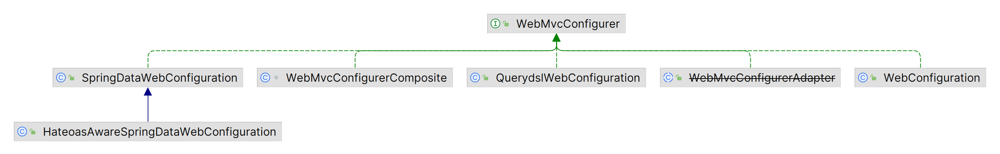

## WebMvcConfigurer MVC配置类

- WebMvcConfigurer接口定义了多个Spring MVC的配置方法（default），所有配置类都可以实现该接口并覆盖其方法。

| WebMvcConfigurer方法        | 说明                     |
| --------------------------- | ------------------------ |
| addViewControllers          | 添加需要跳转的视图控制器 |
| addArgumentResolvers        | 添加请求参数解析器       |
| addViewResolvers            | 添加视图解析器           |
| addInterceptors             | 添加拦截器               |
| configureMessageConverters  | 配置消息转换器           |
| addResourceHandlers         | 添加静态资源处理器       |
| configurePathMatch          | 配置路径匹配方式         |
| configureContentNegotiation | 配置内容协商             |
| configureHandlerMapping     | 配置处理器映射器         |
| configureHandlerAdapter     | 配置处理器适配器         |



## addViewControllers 注册视图控制器

```java
public void addViewControllers(ViewControllerRegistry registry) {
    registry.addViewController("/").setViewName("home");
}
```

- addViewController("/myUrl") 设置视图控制器，可以设置多层url映射（如 "/\*\*"）。当请求路径为"myUrl"时，Spring MVC将该请求转发给该视图控制器处理，进行视图渲染等操作。setViewName("/myView") 设置显示的视图，渲染该视图到响应中返回给客户端。

 

## addInterceptors 注册拦截器

```java
@Autowired
private MyInterceptor myInterceptor;

@Override
public void addInterceptors(InterceptorRegistry registry) {
    registry.addInterceptor(myInterceptor).addPathPatterns("/books","/books/**");
}
```

## addResourceHandlers 静态资源处理器

```java
protected void addResourceHandlers(ResourceHandlerRegistry registry) {
    //当访问/pages/*时，走/pages目录下的内容
    registry.addResourceHandler("/pages/**").addResourceLocations("/pages/");
    registry.addResourceHandler("/js/**").addResourceLocations("/js/");
    registry.addResourceHandler("/css/**").addResourceLocations("/css/");
    registry.addResourceHandler("/plugins/**").addResourceLocations("/plugins/");
}
```
