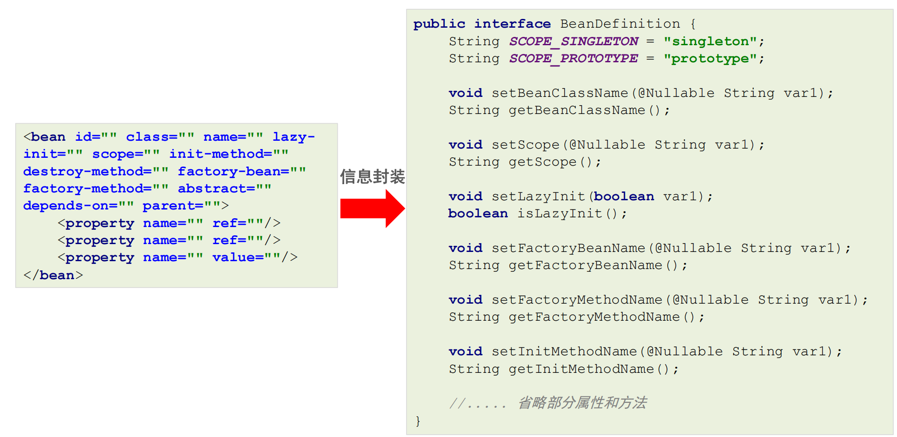
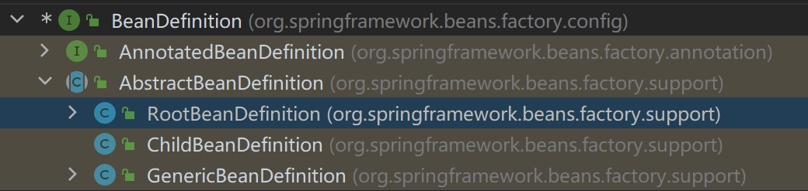
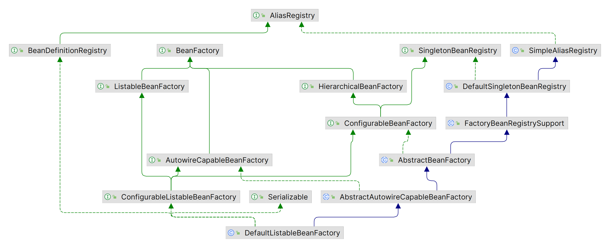

# beanDefinitionMap

- Spring会取出beanDefinitionMap中的每个BeanDefinition信息，反射构造方法或调用指定的工厂方法生成Bean实例对象。只要将BeanDefinition注册到beanDefinitionMap，Spring就会进行对应的Bean的实例化操作。

   

   

> BeanDefinition接口：RootBeanDefinition。
>
>    

- <b>DefaultListableBeanFactory</b>内部维护着beanDefinitionMap。

```java
public class DefaultListableBeanFactory extends ... implements ... {
    //存储<bean>标签对应的BeanDefinition对象
    //key:beanName，value:Bean定义对象BeanDefinition
    private final Map<String, BeanDefinition> beanDefinitionMap;
}
```

   

# singletonObjects 单例池

- beanDefinitionMap中的BeanDefinition会被转化成对应的Bean实例对象，存储到<b>单例池singletonObjects</b>中去，在DefaultListableBeanFactory的上四级父类DefaultSingletonBeanRegistry中，维护着singletonObjects。

```java
public class DefaultSingletonBeanRegistry extends ... implements ... {
    //存储Bean实例的单例池
    //key:beanName，value:Bean的实例对象
    private final Map<String, Object> singletonObjects = new ConcurrentHashMap(256);
}
```

   