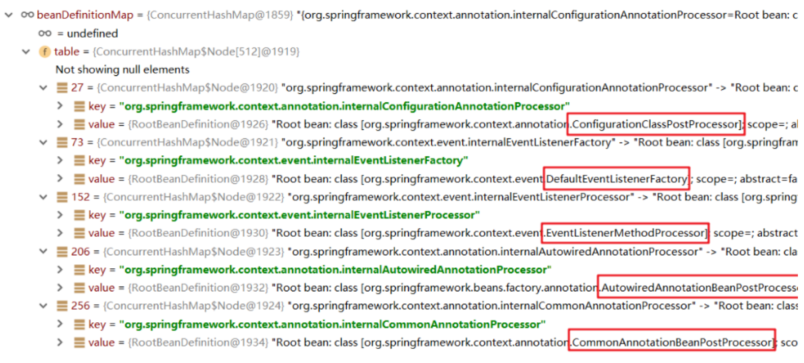

# @ComponentScan

- <code>@ComponentScan</code>组件扫描

1. 指定一个或多个包名：扫描指定包及其子包下标记的类。
2. 不配置包名：扫描当前@ComponentScan标注类所在包及其子包下的类。

- 扫描识别方式：

1. 精确范围。
2. 过滤器（excludeFilters、includeFilgters）。

# 扫描识别方式

## 精确范围（路径）

```java
@Configuration
@ComponentScan("com.zjk")
public class ApplicationContextConfig {
}
```

```java
@Configuration
@ComponentScan({"com.zjk.service","com.zjk.dao"})
public class ApplicationContextConfig {
}
```

## 过滤器

<table>
	<thead>
		<tr>
			<th width="15%">过滤器</th>
			<th width="85%">描述</th>
		</tr>
	</thead>
	<tbody>
		<tr>
			<td>excludeFilters</td>
			<td>设置扫描加载bean时，排除的过滤规则</td>
		</tr>
		<tr>
			<td>includeFilgters</td>
			<td>加载指定的bean</td>
		</tr>
	</tbody>
</table>

<table>
	<thead>
		<tr>
			<th width="20%">type属性</th>
			<th width="80%">过滤</th>
		</tr>
	</thead>
	<tbody>
		<tr>
			<td>ANNOTATION</td>
			<td>注解</td>
		</tr>
		<tr>
			<td>ASSIGNABLE_TYPE</td>
			<td>指定的类型</td>
		</tr>
		<tr>
			<td>ASPECTJ</td>
			<td>Aspectj表达式（基本不用）</td>
		</tr>
		<tr>
			<td>REGEX</td>
			<td>正则表达式</td>
		</tr>
		<tr>
			<td>CUSTOM</td>
			<td>自定义规则</td>
		</tr>
	</tbody>
</table>

```java
@ComponentScan(value = "com.zjk",
        excludeFilters = @ComponentScan.Filter(
                type = FilterType.ANNOTATION, // 指定注解类型的Bean
                classes = Controller.class // 排除指定注解的Bean
        )
)
```

# 扫描原理

  

- component-scan是一个context命名空间下的自定义标签，要找到对应的命名空间处理器（NamespaceHandler）和解析器，查看spring-context包下的spring.handlers文件。将标注的@Component的类生成的对应的BeanDefiition进行注册。

```xml
<context:conponent-scan base-package="com.zjk"></context>
```


- AnnotationConfigApplicationContext在进行创建时，内部调用了如下代码，该工具注册了几个Bean后处理器。

```java
AnnotationConfigUtils.registerAnnotationConfigProcessors(this.registry)
```

- 其中，ConfigurationClassPostProcessor 是一个 BeanDefinitionRegistryPostProcessor，经过一系列源码调用，最终也被指定到了ClassPathBeanDefinitionScanner 的doScan 方法（与xml方式最终终点一致）。

  

    