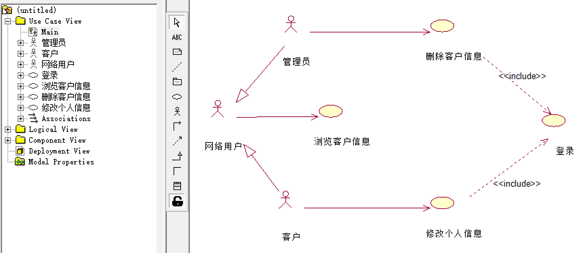
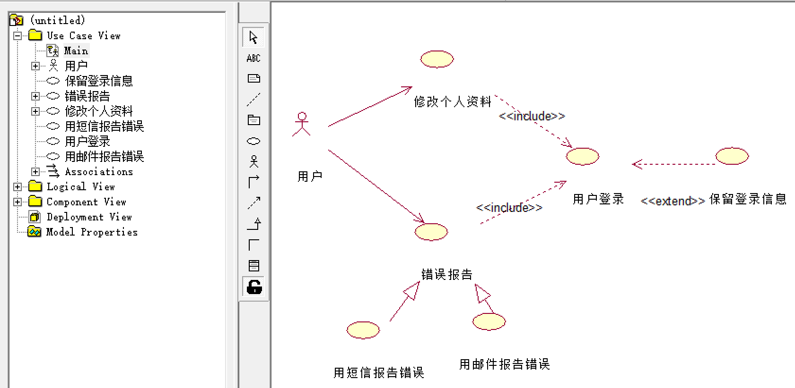
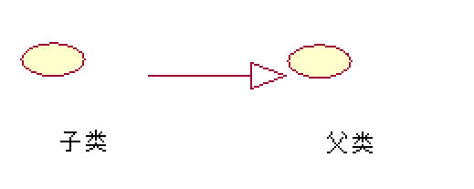
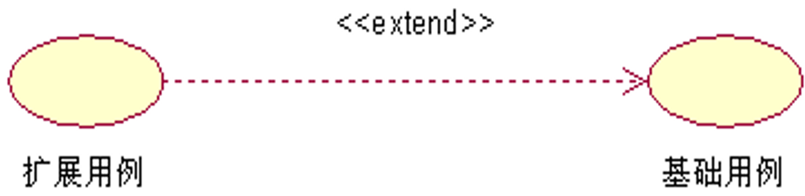
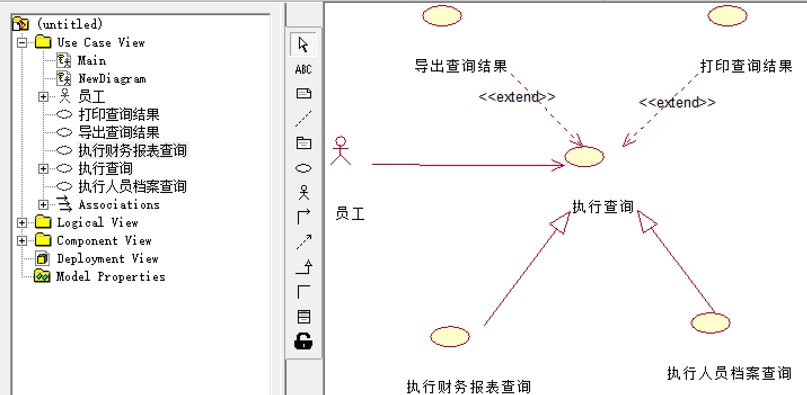
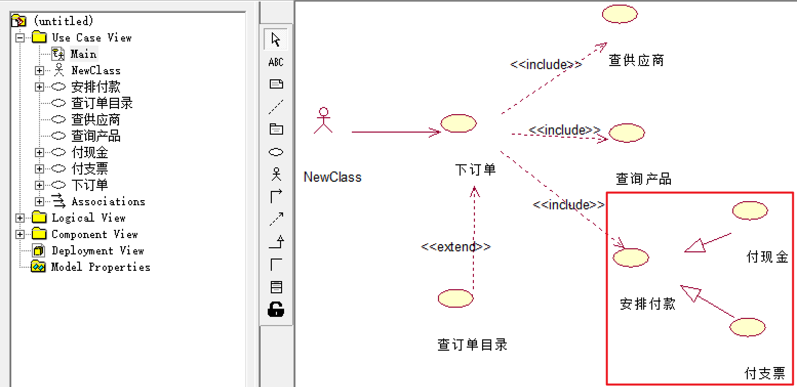

# 用例视图

- 用例视图：描述了系统的参与者和系统进行交互的功能，是参与者所有观察和使用到的系统功能的模型图。
  - 标识出系统中的用例和参与者之间的联系，并确定什么样的参与者执行了哪个用例。
  - 当用例视图出现在系统参与者面前时，用例视图捕获了系统、子系统和用户执行的动作行为，将系统描述为系统的参与者对系统有用功能的需求（用例）。
- 用例：用例是系统的一个功能单元，是系统参与者和系统之间进行的一次交互作用。
  - 系统与一个或多个参与者之间的一系列消息来描述系统的交互作用。
  - 系统参与者：可以是人、外部系统、外部子系统等。

# 用例图 Use Case

- 用例图：由参与者（Actor）、用例（Use Case）依据他们之间的关系构成的用于描述系统功能的动态视图。描述系统提供的一个功能单元，表示用例的组织关系。主要用于需求分析阶段，帮助开发团队以一种可视化的方式理解系统的功能需求。

1. Use Case图是指系统的外部事物（参与者）与系统的交互，表达了系统的功能，即系统向用户所提供的服务。

2. Use Case图是后续的系统分析与设计工作的依据，也是系统测试的依据。

3. Use Case图对需求的描述规范化，较好地避免了表达地歧义性，便于用户和开发人员理解系统的需求，取得共识。 

>某电话公司决定开发一个管理所有客户信息的交互网络系统。系统功能（用例）如下：
>
>1. 浏览客户信息：任何使用Internet的网络用户都可以浏览电话公司所有的客户信息（包括姓名、住址、电话号码等）。
>2. 登录：电话公司授予每个客户一个帐号。拥有授权帐号的客户，可以使用系统提供的页面设置个人密码，并使用该帐号和密码向系统注册。
>3. 修改个人信息：客户登录后，可以对个人信息进行修改。
>4. 删除客户信息：管理员登录后，可以删除不再接受公司服务的客户的信息。
>
>

> 某“错误报告系统”包含以下功能：
>
> 1. 用户登录
> 2. 修改个人资料
> 3. 错误报告
> 4. 用邮件报告错误
> 5. 用短信报告错误
> 6. 保留登录信息
>
> 说明：用户修改个人资料或者进行错误报告时，都必须先进行用户登录；错误报告有两种方式，一种是用邮件、一种是用短信；用户登录时可以选择保存登录信息，以便下一次登录。使用ROSE实现以上说明。
>
> 

> 现有一个产品销售系统，其总体需求如下：
>
> 1. 销售员负责产品销售，每次产品销售时都需要完成支付、更新存货清单和登记销售记录，更新存货清单和登记销售记录时均可选择输出报告。
> 2. 完成支付有两种方式，信用卡支付或支票支付，两种支付方式都必须进行身份验证。
> 3. 管理员负责系统维护，需要时可选择输出报告。
>
> 根据上述需求，使用ROSE绘制出用例图。
>
> 

## 参与者

- 参与者是指存在于系统外部并直接与系统进行交互的人、其他系统、设备、时间等。
- 每个参与者可以参与一个或多个用例，一个用例可以有多个参与者。 

**参与者之间的泛化关系**

- 参与者本质上也是类，参与者和参与者之间主要是泛化关系（继承）。
- 泛化关系：提取共同的用例，将用例都是共同的用例的参与者当作父类来继承。

### 识别、确认参与者

**如何确定参与者**

- 负责支持或维护系统中信息的人。
- 与系统进行信息交换（包括数据信息和控制信息交换）的外部事物可以确定为参与者；包括：人、设备、第三方系统。
- 时间是否会触发某些事件。时间也可以是参与者。

**识别参与者： 以图书管理系统为例**

1. 系统开发以后，使用系统主要功能的对象。 （学生、教师）
2. 需要借助系统来完成日常工作的对象。 （图书管理员）
3. 系统需要从哪些对象（人或系统等）中获取数据。 （扫码枪、读卡器、学籍管理系统）
4. 系统会为哪些人或系统提供数据。 （借阅人员、学籍系统、图书管理员）
5. 系统会与哪些系统交互。包括计算机系统和计算机中的其他应用软件。其他系统可以分为两类：
   - 该系统要使用的系统 （E卡通系统）
   - 启动该系统的系统 （WindowsXP系统）
6. 系统是由谁来维护和管理的，以保证系统处于工作状态 （系统管理员）
7. 系统控制的硬件设备有哪些。 （扫码枪、读卡器）
8. 对本系统产生的结果感兴趣的对象。（馆长、图书供应商）

### 参与者的分类

**主要参与者和次要参与者**

- 主要参与者：执行系统主要功能的参与者。
- 次要参与者：使用系统次要功能的参与者。

**发起参与者和参加参与者**

- 参与者发起了用例的执行过程，一个用例只有一个发起参与者，可以有若干个参加参与者。

## 用例

- 用例是外部可见的系统功能、是参与者可以感受到的系统服务或功能单元。定义系统如何被参与者使用，描述参与者为使用系统所提供的某一完整功能而与系统之间发生的一段对话。
- 每个用例在其所属包里都有唯一的位置，往往是一个能准确描述功能的动词或者动名词短语。

**用例的特征**

1. 用例表明的是类，而不是某个具体的实例：描述的是它代表的功能的各个方面，包含了用例指向期间可能发生的各种情况。
2. 用例必须由某一个参与者触发激活后才能执行，即每个用例至少拥有一个参与者。
3. 用例是一个完整的描述：只有当所有的小用例都完成，并最终产生了返回给参与者的结果，才代表整个用例的完成。

### 识别用例

1. 参与者会将哪些外部事件通知给系统。 （续借图书）
2. 系统中发生的哪些事件会通知参与者。 （图书超期）
3. 是否存在影响系统的外部事件。 （E通卡升级） 
4. 参与者希望系统提供哪些功能。
5. 参与者是否会读取、创建、修改、存储系统的某种信息。

### 用例粒度

- 用例的粒度：用例所包含的系统服务或功能单元的多少。
  - 用例粒度越大、用例包含的功能越多、得到的用例数越少。

- 一般的做法是复杂系统的用例粒度大一些，简单系统的用例粒度小一些：如果用例数目过多会造成用例模型过大，用例之间的关系过于负责，导致后续的系统设计难度大大提高。

### 用例规约

- 用例规范：对每一个用例的详细描述信息：

1. 简要说明：对用例名称、编号、相关参与者、作用和目的的简要说明。
2. 事件流：
   - 基本事件流（基本流）：用例的基本流程，用例正常运行时的场景。
   - 扩展事件流（备选流）：很少使用的逻辑路径，异常、错误情况下所执行的逻辑路径。
3. 前置条件：执行用例之前系统必须所处的状态。

> 要求用户有访问的权限或是要求某个用例必须先被执行等。

4. 后置条件：用例执行完毕之后系统可能处于的一组状态。

> 货品出库用例执行后、需要执行应付款处理用例。

5. 非功能性需求：可靠性、性能、可用性和可扩展性等。

> 法律或法规方面的需求、应用程序标准和所构建系统的质量属性等。

## 用例间的关系

- 关系：带箭头和不带箭头；箭尾连接对话的主动发起者，箭头所指的是对话的被动接受者。   
  - 参与者可以是主动发起者和被动接收者。

| 对比   | 泛化                                                         | 扩展                                                         | 包含                                                         |
| ------ | ------------------------------------------------------------ | ------------------------------------------------------------ | ------------------------------------------------------------ |
| 构造型 |                                                              | `<<extend>>`                                                 | `<<include>>`                                                |
| 指向   |  |  |  |
| 符号   | 空心箭头                                                     | 虚箭线                                                       | 虚箭线                                                       |
| 执行   |                                                              | 基用例执行，扩展用例不一定执行                               | 基用例执行，被包含用例必执行                                 |

### 泛化

- 用户的泛化指的是一个父用例可以被特化形成多个子用例，而父用例和子用例之间的关系就是泛化关系。
- 在用例的泛化关系中，子用例继承了父用例所有的结构、行为和关系，子用例是父用例的一种特殊形式。
- 子用例还可以添加、覆盖、改变继承的行为。
- 在UML中用例的泛化关系通过一个三角箭头从子用例指向父用例来表示。

>   

### 扩展

- 扩展：从扩展用例到基础用例的关系，添加对小概率事件的扩展，往往被用来处理异常或者构建灵活的系统框架。
  - 扩展用例：在一定条件下，把新的行为加入到已有的用例中，获得的新用例。
  - 基础用例：原有的用例。

> 员工需要使用“执行查询”功能，有时还需要“导出查询结果”或“打印查询结果”。
>
> 后期业务进一步发展，员工“执行查询”功能细分为“执行财务报表查询”和“执行人员档案查询”。
>
> 将以上需求用用例图表达出来。
>
>  

### 包含

- 包含：一个用例的功能过多、事件流过于复杂时，将某一段事件流（多个用例用到同一段的行为）抽象成为一个被包含的用例。
- 基础用例的执行必然引起被包含用例的执行。

1. 避免在多个用例中重复描述一段行为。
2. 提高用例模型可维护性，复用用例中的公共行为。

> 共有“下订单”、“查供应商”、“查询产品”、“查订单目录”、“安排付款”、“付现金”、“付支票”7个用例。他们之 间的关系如下：
>
> - 下订单的过程中必需查供应商、查询产品并且安排付款，如果有需要的话，还可以查订单目录；
> - 付款的方式有两种，包括付现金和付支票。
>
> 从支持复用、简化用例的角度出发，使用ROSE设计用例图：
>
> 

