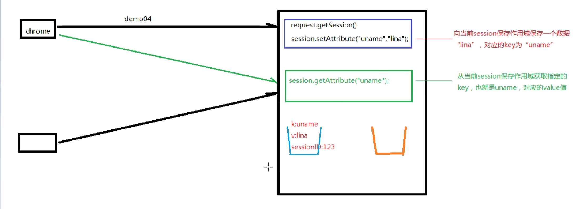

# JavaWeb 概述

  

## C/S、B/S

| 体系结构                    | 说明                                                         |
| --------------------------- | ------------------------------------------------------------ |
| C/S <br />客户端/服务器结构 |  |
| B/S <br />浏览器/服务器结构 |  |

| 比较           | C/S                                                          | B/S                                                          |
| -------------- | ------------------------------------------------------------ | ------------------------------------------------------------ |
| 开发和维护成本 | 不同的客户端要开发不同的应用程序而且软件的安装、调试和升级均需要在所有的客户机上进行。 | 不必在客户端进行安装和维护，只需要对服务器进行升级维护即可。 |
| 客户端负载     | 减轻服务器的压力<br />减轻网络负荷                           | 服务器的负荷较重<br />网络负荷较重                           |
| 安全性         | 高于B/S                                                      |                                                              |

## Web应用程序的工作原理

| Web应用  | 说明                                                         |
| -------- | ------------------------------------------------------------ |
| 静态网站 | HTML语言<br /> |
| 动态网站 | HTML语言和动态脚本语言<br />根据用户的请求动态地生成页面信息。  <br />（并不等同于带有动画效果的网页，而是具有交互功能的网页）<br /> |

## MVC三层架构

| 层级                     | 说明                                             |
| :----------------------- | :----------------------------------------------- |
| Model（数据访问层）      | 对数据库的CRUD基本操作。                         |
| Controller（业务逻辑层） | 对业务逻辑进行封装，组合数据访问层中的基本功能。 |
| View（表现层）           | 接受请求，封装数据，调用业务逻辑层，响应数据。   |


# Servlet

```xml
<dependency>
    <groupId>javax.servlet</groupId>
    <artifactId>javax.servlet-api</artifactId>
    <version>3.1.0</version>
    <scope>provided</scope>  
    <!--provided是为了之后打包成war包后在Tomcat中运行不会报错-->
</dependency>
```

## Servlet

**Servlet处理Web请求的过程**

1. 服务器接收从客服端发出的请求。
2. 服务器将请求信息发送至Servlet。
3. Servlet经过处理之后，生成响应的内容。
4. 服务器将响应的内容返回给客服端。  

### 体系结构

  

#### HttpServlet

 

  

- HTTP的请求方式包括DELETE,GET,OPTIONS,POST,PUT和TRACE：doDelete()、doGet()、doOptions()、doPost()、doPut()、doTrace()。

- HttpServlet依据请求方式的不同而采用不同的处理方法：请求方式由form表单的method属性确定。

```java
@WebServlet("/httpTest")
public class HttpServletTest extends HttpServlet {
    @Override
    protected void doGet(HttpServletRequest req, HttpServletResponse resp) throws ServletException, IOException {
        System.out.println("get...");
    }

    @Override
    protected void doPost(HttpServletRequest req, HttpServletResponse resp) throws ServletException, IOException {
        System.out.println("post...");
    }
}
```

#### ServletResponse、HttpServletResponse

| ServletResponse方法              | 说明                                                         |
| :------------------------------- | :----------------------------------------------------------- |
| PrintWriter getWriter()          | 返回PrintWriter对象，用于向客户端发送文本                    |
| String getCharacterEncoding()    | 返回在响应中发送的正文所使用的字符编码                       |
| void setCharacterEncoding()      | 设置发送到客户端的响应的字符集编码                           |
| void setContentType(String type) | 设置发送到客户端的响应的内容类型<br />此时响应的状态尚未提交 |

| HttpServletResponse增加的方法             | 说明                                                         |
| :---------------------------------------- | :----------------------------------------------------------- |
| void addCookie(Cookie cookie)             | 增加一个Cookie到响应<br />此方法可以多次调用，设置多个Cookie |
| void addHeader(String name, String value) | 将响应报头（name,value）添加到响应                           |
| void sendRedirect(String location)        | 发送临时的重定向响应到客户端<br />抛出IOException            |
| void encodeURL(String url)                | SessionID对用于重定向的URL进行编码                           |

#### ServletRequest、HttpServletRequest

### Servlet生命周期

| 生命周期     | 说明                                                         |
| ------------ | ------------------------------------------------------------ |
| 加载和实例化 | 默认当Servlet第一次被访问时，由容器创建Servlet对象。         |
| 初始化       | Servlet实例化之后，容器调用Servlet的**init()**方法初始化该对象。<br />**（init()方法只调用一次）** |
| 请求处理     | **每次请求Servlet时**，Servlet容器都会调用Servlet的**service()**方法对请求进行处理。 |
| 服务终止     | **释放内存/容器关闭时**，容器调用Servlet实例的**destroy()**方法。<br />destroy()方法调用之后，容器释放该Servlet实例（随后会被gc）。 |

**Servlet的初始化时机：**

- 默认情况下，第一次请求时，tomcat才会去实例化、初始化，耗时较长。
- `<servlet>`中的`<load-on-startup>`设置servlet启动的先后顺序，数字越小，启动越靠前，最小值0。

**Servlet在容器中是单例的、线程不安全的。**

### web.xml方式

#### Servlet方法

| 方法                                                         | 说明   |
| :----------------------------------------------------------- | :----- |
| void init(ServletConfig servletConfig)                       | 初始化 |
| void destory()                                               | 摧毁   |
| void service(ServletRequest servletRequest, ServletResponse servletResponse) | 服务   |
| String getServletInfo()                                      |        |
| ServletConfig getServletConfig()                             |        |

#### 1.创建Servlet类

1. 实现Servlet接口
2. 继承GenericServlet类
3. 继承HttpSevlet类

**创建HttpServlet的步骤——“四部曲”**

1. 扩展HttpServlet抽象类； 
2. 覆盖HttpServlet的部分方法，如覆盖doGet()或doPost()方法； 
3. 获取HTTP请求信息。通过HttpServletRequest对象来检索HTML表单所提交的数据或URL上的查询字符串； 
4. 生成HTTP响应结果。通过HttpServletResponse对象生成响应结果，它有一个getWriter()方法，该方法返回一个PrintWriter对象。

**Tomcat中打开Web的根目录**

```java
//从Maven中Tomcat-run中查看 
[INFO] Running war on http://localhost:8080/
```

##### service()

##### doget() dopost()等 do...

#### 2.Servlet的部署 web.xml

- `<servlet>`元素，将Servlet内部名映射到一个Servlet类名，"包名+类名"

  - `<servlet-name>类名</servlet-name>`
  - `<servlet-class>包名+类名（即：完整的类位置）<servlet-class>`  

- `<servlet-mapping>`元素，将用户访问的URL映射到Servlet内部名

  - **一个 `<servlet>`可以对应多个`<servlet-mapping>`**，即：可以将同一个Servlet程序应用于多个不同的页面(urlPatterns)

  - `<servlet-name></servlet-name>` 必须与`<servlet>`元素中的`<servlet-name>`一致

  - `<url-pattern></url-pattern>` 容器无法识别同时拥有两种匹配规则的pattern

    - 当有一个页面满足两个Servlet的url-pattern的匹配规则；采用更精确的匹配的哪个Servlet

    - 假定某html文件的路径为：`/html/demo1.html` 和 `/html/demo2.html`

    1. 精确匹配：`/html/demo1`类似于/myServlet的精确路径
    2. 通配符匹配（目录匹配）：`/html/*` 相当于：`/html/demo1和/html/demo2`都匹配
    3. 扩展名匹配：`*.html，*.jpg ，*.do ，*.action`之类的
    4. 默认匹配：当之前匹配都不成功时，使用该url-pattern的Servlet
       - `/` 会覆盖Tomcat中的DefaultServlet，会导致静态资源（html文件等）无法访问
       - `/*`

### @WebServlet

- 在Servlet3.0之后可以使用注解来注册。
- 在新建的Servlet类上注释`@WebServlet("url_pattern")`，其中的url_pattern指的是原来的在web.xml中的url-pattern的内容。

**@WebServlet()的参数**

| 参数          | 说明                        |
| :------------ | :-------------------------- |
| urlPatterns   | 调用该Servlet的网页路径     |
| loadOnStartup | 初始化Servlet对象的；默认-1 |

```java
@WebServlet("urlPatterns")
@WebServlet(urlPatterns = {"/demo1","/demo2"}) 
@WebServlet(urlPatterns = "urlPatterns", loadOnStartup = 1)
```

### url-pattern 路径

 
  

## 请求和响应处理 

- request对象是用来封装请求数据的对象
- response对象是用来封装响应数据的对象

**具体说明**

* request:==获取==请求数据
  * 浏览器会发送HTTP请求到后台服务器[Tomcat]
  * HTTP的请求中会包含很多请求数据[请求行+请求头+请求体]
  * 后台服务器[Tomcat]会对HTTP请求中的数据进行解析并把解析结果存入到一个对象中
  * 所存入的对象即为request对象，所以我们可以从request对象中获取请求的相关参数
  * 获取到数据后就可以继续后续的业务，比如获取用户名和密码就可以实现登录操作的相关业务
* response:==设置==响应数据
  * 业务处理完后，后台就需要给前端返回业务处理的结果即响应数据
  * 把响应数据封装到response对象中
  * 后台服务器[Tomcat]会解析response对象,按照[响应行+响应头+响应体]格式拼接结果
  * 浏览器最终解析结果，把内容展示在浏览器给用户浏览

### HTTP 超文本传输协议

- Http是无状态的，因此需要HttpSession来表示会话。
- Http请求响应包含两个部分：请求和响应

#### 请求

- 请求包含三个部分： 1.请求行 ； 2.请求消息头 ； 3.请求主体

  

##### 请求行

**1. 请求的方式 ； 2.请求的URL ； 3.请求的协议（一般都是HTTP1.1）**

HTTP1.1中共定义了八种请求方式：

- **GET**：从服务器端获取数据
- **POST**：将数据保存到服务器端
- **PUT**：命令服务器对数据执行更新
- **DELETE**：命令服务器删除数据
- HEAD
- CONNECT
- OPTIONS
- TRACE

######  GET请求

- 特征1：**没有请求体**
- 特征2：**请求参数附着在URL地址后面**
- 特征3：请求参数在浏览器地址栏能够直接被看到，存在安全隐患
- 特征4：在URL地址后面携带请求参数，数据容量非常有限。如果数据量大，那么超出容量的数据会丢失
- 特征5：从报文角度分析，请求参数是在请求行中携带的，因为访问地址在请求行

###### POST请求

- 特征1：有请求体
- 特征2：**请求参数放在请求体中**
- 特征3：请求体发送数据的空间没有限制
- 特征4：可以发送各种不同类型的数据
- 特征5：从报文角度分析，请求参数是在请求体中携带的
- 特征6：由于请求参数是放在请求体中，所以浏览器地址栏看不到

##### 请求消息头

- 包含了很多客户端需要告诉服务器的信息

| 名称           | 功能                                                 |
| -------------- | ---------------------------------------------------- |
| Host           | 服务器的主机地址                                     |
| Accept         | 声明当前请求能够接受的『媒体类型』                   |
| Referer        | 当前请求来源页面的地址                               |
| Content-Length | 请求体内容的长度                                     |
| Content-Type   | 请求体的内容类型，这一项的具体值是媒体类型中的某一种 |
| Cookie         | 浏览器访问服务器时携带的Cookie数据                   |

##### 请求体

- get方式，没有请求体，但是有一个queryString
- post方式，有请求体，form data
- json格式，有请求体，request payload

  

#### 响应：

**1. 响应行 ； 2.响应头 ； 3.响应体**

  

##### 响应行

**1.协议 2.响应状态码(200) 3.响应状态(ok)**

###### 响应状态码

| 类别 | 原因短语                         |                            |
| :--- | :------------------------------- | -------------------------- |
| 1XX  | Informational（信息性状态码）    | 接收的请求正在处理         |
| 2XX  | Success（成功状态码）            | 请求正常处理完毕           |
| 3XX  | Redirection（重定向）            | 需要进行附加操作以完成请求 |
| 4XX  | Client Error（客户端错误状态码） | 服务器无法处理请求         |
| 5XX  | Server Error（服务器错误状态码） | 服务器处理请求出错         |

[Http状态码详解 (config.net.cn)](https://config.net.cn/tools/HttpStatusCode.html)

| 状态码 | 英文描述                               | 解释                                                         |
| ------ | -------------------------------------- | ------------------------------------------------------------ |
| 200    | **`OK`**                               | 客户端请求成功，即**处理成功**，这是我们最想看到的状态码     |
| 302    | **`Found`**                            | 指示所请求的资源已移动到由`Location`响应头给定的 URL，浏览器会自动重新访问到这个页面 |
| 304    | **`Not Modified`**                     | 告诉客户端，你请求的资源至上次取得后，服务端并未更改，你直接用你本地缓存吧。隐式重定向 |
| 400    | **`Bad Request`**                      | 客户端请求有**语法错误**，不能被服务器所理解                 |
| 403    | **`Forbidden`**                        | 服务器收到请求，但是**拒绝提供服务**，比如：没有权限访问相关资源 |
| 404    | **`Not Found`**                        | **请求资源不存在**，一般是URL输入有误，或者网站资源被删除了  |
| 428    | **`Precondition Required`**            | **服务器要求有条件的请求**，告诉客户端要想访问该资源，必须携带特定的请求头 |
| 429    | **`Too Many Requests`**                | **太多请求**，可以限制客户端请求某个资源的数量，配合 Retry-After(多长时间后可以请求)响应头一起使用 |
| 431    | **` Request Header Fields Too Large`** | **请求头太大**，服务器不愿意处理请求，因为它的头部字段太大。请求可以在减少请求头域的大小后重新提交。 |
| 405    | **`Method Not Allowed`**               | 请求方式有误，比如应该用GET请求方式的资源，用了POST          |
| 500    | **`Internal Server Error`**            | **服务器发生不可预期的错误**。服务器出异常了，赶紧看日志去吧 |
| 503    | **`Service Unavailable`**              | **服务器尚未准备好处理请求**，服务器刚刚启动，还未初始化好   |
| 511    | **`Network Authentication Required`**  | **客户端需要进行身份验证才能获得网络访问权限**               |

##### 响应头

- 包含了服务器的信息；服务器发送给浏览器的信息（内容的媒体类型、编码、内容长度等）
- 响应体的说明书。
- 服务器端对浏览器端设置数据，例如：服务器端返回Cookie信息。

| 名称             | 功能                                                 |
| ---------------- | ---------------------------------------------------- |
| Content-Type     | 响应体的内容类型，例如text/html、image/jpeg          |
| Content-Length   | 响应体的内容长度（字节数）                           |
| Content-Encoding | 表示该响应压缩算法，例如gzip；                       |
| Set-Cookie       | 服务器返回新的Cookie信息给浏览器                     |
| location         | 在**重定向**的情况下，告诉浏览器访问下一个资源的地址 |

##### 响应体

服务器返回的数据主体，有可能是各种数据类型。

- HTML页面
- 图片
- 视频
- 以下载形式返回的文件
- CSS文件
- JavaScript文件

### Request

#### Request继承体系

1. ServletRequest  Java提供的请求对象根接口
2. HttpServletRequest  Java提供的对Http协议封装的请求对象接口
3. RequestFacade  Tomcat定义的实现类

**ServletRequest 接口**

| 方法                                          | 说明                           |
| :-------------------------------------------- | :----------------------------- |
| Object getAttribute(String name)              | 获取名称为name的属性值         |
| void setAttribute(String name, Object object) | 在请求中保存名称为name的属性值 |
| void removeAttibute(String name)              | 清除请求中名称为name的属性值   |
| String getParameter()                         | 获取表单中传递的参数           |

**HttpServletRequest 接口**

| 增加的方法               | 说明                                                         |
| :----------------------- | :----------------------------------------------------------- |
| String getContextPath()  | 返回请求URL中表示请求上下文的路径（URL开始部分）             |
| Cookie[] getCookies()    | 返回客户端在此次请求中发送的所有Cookie对象                   |
| HttpSession getSession() | 返回和此次请求相关联的Session，如果没有给客户端分配Session，则创建一个新的Session |
| String getMethod()       | 返回此次请求使用的Http方法的名称，如GET、POST                |

#### 获取请求信息

**请求行 GET/demo/test1?usernaem=zjk HTTP/1.1**

| 方法                    | 说明                      | 示例                             |
| :---------------------- | :------------------------ | -------------------------------- |
| String getMethod()      | 获取请求方式              | GET                              |
| String getQueryString() | 获取请求参数(GET)         | /demo                            |
| String getContextPath() | 获取虚拟目录              | http://localhost:8080/demo/test1 |
| String getRequestURL()  | 获取URL（统一资源定位符） | /demo/test1                      |
| StringgetRequestURI()   | 获取URI（统一资源标识符） | username=zjk&password=123        |

**请求头 User-Agent: Mozilla/5.0 Chrome/91.0.4472.106**

- String getHeader(String name)：根据请求头名称，获取值
  - user-agent：浏览器版本信息

**请求体 username=zjk&password=123**

- ServletInputStream getInputStream()：获取字节输入流
- BufferedReader getReader()：获取字符输入流

```java
import javax.servlet.ServletException;
import javax.servlet.annotation.WebServlet;
import javax.servlet.http.HttpServlet;
import javax.servlet.http.HttpServletRequest;
import javax.servlet.http.HttpServletResponse;
import java.io.BufferedReader;
import java.io.IOException;

@WebServlet("/demo/test1.html")
public class RequestTest extends HttpServlet {
    @Override
    protected void doGet(HttpServletRequest req, HttpServletResponse resp) throws ServletException, IOException {
        //getMethod()
        System.out.println(req.getMethod()); //GET
        //getContextPath()
        System.out.println(req.getContextPath());
        //getRequestURL()
        System.out.println(req.getRequestURL()); //http://localhost:8080/demo/test1
        //getRequestURI
        System.out.println(req.getRequestURI()); //demo/test
        //getQueryString()
        System.out.println(req.getQueryString()); //null

        //获取请求头 getHeader()
        //user-agent 浏览器版本信息
        System.out.println(req.getHeader("user-agent")); //Mozilla/5.0 (Windows NT 10.0; Win64; x64) AppleWebKit/537.36 (KHTML, like Gecko) Chrome/111.0.0.0 Safari/537.36
    }

    @Override
    protected void doPost(HttpServletRequest req, HttpServletResponse resp) throws ServletException, IOException {
        //获取post请求体

        //获取字符输入流
        BufferedReader bfr = req.getReader();
        System.out.println(bfr.readLine());
    }
}
```

##### 通用方法获取请求参数

**普通获取**

- GET方式:

```java
String getQueryString()
```

- POST方式:

```java
BufferedReader getReader();
```

- 可以在doPost()方法中调用doGet();减少代码的重写。

**request对象**

- 获取所有参数Map集合

```
Map<String,String[]> getParameterMap()
```

- 根据名称获取参数值（数组）

```
String[] getParameterValues(String name)
```

- 根据名称获取参数值(单个值)

```
String getParameter(String name)
```

```java
import javax.servlet.ServletException;
import javax.servlet.annotation.WebServlet;
import javax.servlet.http.HttpServlet;
import javax.servlet.http.HttpServletRequest;
import javax.servlet.http.HttpServletResponse;
import java.io.IOException;
import java.util.Map;

@WebServlet("/test.html")
public class RequestTest extends HttpServlet {
    @Override
    protected void doGet(HttpServletRequest req, HttpServletResponse resp) throws ServletException, IOException {
        System.out.println("get....");
    }

    @Override
    protected void doPost(HttpServletRequest req, HttpServletResponse resp) throws ServletException, IOException {
        System.out.println("post...");
        req.setCharacterEncoding("utf-8");
        //getParameterMap()
//        System.out.println("getParameterMap()");
//        Map<String, String[]> parameterMap = req.getParameterMap();
//        for (String key : parameterMap.keySet()
//        ) {
//            System.out.println(parameterMap.get(key));
//        }
//        //getParameterValues()
//        System.out.println("getParameterValues()");
//        for (String value:req.getParameterValues("username")
//             ) {
//            System.out.println(value);
//        }
        //getParameter()
        System.out.println(req.getParameter("username"));
        this.doGet(req, resp);
    }
}
```

##### 请求参数中文乱码

**编码**

- post方式下需要设置编码，防止中文乱码
  - `req.setCharacterEncoding("utf-8")` 
  - 必须在获取参数之前完成设置
- get方式不需要设置编码，基于Tomcat8
  - Tomcat8之前

  

- URL编解码

```java
URLDecoder.decode(String,"utf-8"); //按utf-8编码为二进制字符串
URLEncoder.encode(String,"utf-8"); //按utf-8解码为字符串
```

```java
String username = new String(req.getParameter("username").getBytes("IOS-8859-1"),"utf-8");
```

**例**

- MyServletTest.html

```html
<!DOCTYPE html>
<html lang="en">
<head>
    <meta charset="UTF-8">
    <title>注册页面</title>
</head>
<body>
<!--
    action:提交到服务器的路径
    method:提交的方式
 -->
<form action="MyServlet" method="post">
    <!-- servlet通过name属性获取用户输入的数据 -->
    用户名:<input type="text" name="username"><br>
    密码:<input type="password" name="userpwd"><br>
    <input type="submit" value="注册">
</form>
</body>
</html>
```

- MyServlet.class

```java
package com.zjk.JSP;

import javax.servlet.*;
import javax.servlet.http.*;
import javax.servlet.annotation.*;
import java.io.IOException;

@WebServlet(name = "MyServlet", value = "/MyServlet")
public class MyServlet extends HttpServlet {
    private static final long serialVersionUID = 1L;

    /* 对应form表单的get请求方式
     * HttpServletRequest：请求对象
     * HttpServletResponse：响应对象
     */
    @Override
    protected void doGet(HttpServletRequest req, HttpServletResponse resp) throws ServletException, IOException {
        //设定请求的字符集
        req.setCharacterEncoding("utf-8");
        //设置响应的文本类型
        resp.setContentType("text/html;charset=utf-8");
        //通过请求对象获取用户输入的内容
        String username = req.getParameter("username");
        String password = req.getParameter("userpwd");

        System.out.println(username + " : " + password);
        //如果输入的用户名是abc，密码是123，则表示注册成功，反之注册失败
//        if ("abc".equals(username) && "123".equals(password)) {
//            //使用响应对象，重定向到成功页面
//            //resp.sendRedirect("success.html");
//            //请求转发
//            req.getRequestDispatcher("success.html").forward(req, resp);
//        } else {
//            //使用响应对象，重定向到注册页面
//            resp.sendRedirect("MyServletTest.html");
//        }
    }

    @Override
    protected void doPost(HttpServletRequest req, HttpServletResponse resp) throws ServletException, IOException {
        //设定请求的字符集
        req.setCharacterEncoding("utf-8");
        //设置响应的文本类型
        resp.setContentType("text/html;charset=utf-8");
        //通过请求对象获取用户输入的内容
        String username = req.getParameter("username");
        String password = req.getParameter("userpwd");
        System.out.println(username + " " + password);
        //如果输入的用户名是abc，密码是123，则表示注册成功，反之注册失败
//        if ("abc".equals(username) && "123".equals(password)) {
//            //使用响应对象，重定向到成功页面
//            resp.sendRedirect("success.html");
//        } else {
//            //使用响应对象，重定向到注册页面
//            resp.sendRedirect("MyServletTest.html");
//        }
    }
}
```

- web.xml

```xml
<?xml version="1.0" encoding="UTF-8"?>
<web-app xmlns="http://xmlns.jcp.org/xml/ns/javaee"
         xmlns:xsi="http://www.w3.org/2001/XMLSchema-instance"
         xsi:schemaLocation="http://xmlns.jcp.org/xml/ns/javaee http://xmlns.jcp.org/xml/ns/javaee/web-app_4_0.xsd"
         version="4.0">
    <servlet>
        <servlet-name>MyServlet</servlet-name> <!--用来映射的名字，可以随便起-->
        <servlet-class>com.zjk.JSP.MyServlet</servlet-class> <!--指向该类的地址 包名+类名-->
    </servlet>
    <servlet-mapping>
        <servlet-name>MyServlet</servlet-name> <!--映射中的servlet-name要与servlet中的一致-->
        <url-pattern>/MyServlet</url-pattern> <!--指向的网页的URL（地址）-->
    </servlet-mapping>
</web-app>
```

### 服务器内部转发以及重定向

| 服务器内部转发                                          | 客户端重定向                   |
| :------------------------------------------------------ | :----------------------------- |
| req.getRequestDispatcher("网页路径").forward(req,resp); | resp.sendRedirect("网页路径"); |
| 一次请求响应的过程，客户端不知道服务器内部的转发        | 两次请求响应的过程             |
| 地址栏不变                                              | 地址栏改变                     |

**服务器内部转发**

  

**客服端重定向**

  

```java
package com.zjk.redirect;


import javax.servlet.ServletException;
import javax.servlet.http.HttpServlet;
import javax.servlet.http.HttpServletRequest;
import javax.servlet.http.HttpServletResponse;
import java.io.IOException;

public class ServletDemo01 extends HttpServlet {
    @Override
    protected void service(HttpServletRequest req, HttpServletResponse resp) throws ServletException, IOException {
        System.out.println("demo01");
        //服务器内部转发
        //req.getRequestDispatcher("demo02");

        //客户端重定向
        resp.sendRedirect("demo02");
        //重定向的另一种实现
        ////1.设置响应状态码 302
        //resp.setStatus(302);
        ////2.设置响应头
        //resp.setHeader("Location";"/demo02");
    }
}
```

#### 路径问题

- 浏览器：需要虚拟目录
- 服务器：不用虚拟目录

**动态获取虚拟目录**

```java
resp.sendRedirect(req.getContextPath + "/test.html");
```

```java
@Override
protected void doGet(HttpServletRequest req, HttpServletResponse resp) throws ServletException, IOException {
    System.out.println("get");
    resp.sendRedirect(req.getContextPath() + "/index.html"); //转发到index.html
}
```

### Response响应字符和字节数据

**字符流 resp.getWriter()**

```java
resp.setContentType("text\html;charset=utf-8"); //设置字符集
PrintWriter writer = resp.getWriter();
writer.write("");
```

- 该流不需要close()释放资源；随着响应结束，resonse对象销毁，由服务器关闭。
- 中文数据乱码：通过Response获取的字符输出流默认编码：iso-8859-1

**字节流 resp.get**

```java
protected void doGet(HttpServletRequest req, HttpServletResponse resp) throws ServletException, IOException {
//1.读取文件
FileInputStream fis = new FileInputStream("E:/HTML/images/th.jpg");
//2.获取字节输出流
ServletOutputStream os = resp.getOutputStream();
//3.操作
byte[] buffer = new byte[1024];
int len = 0;
while ((len = fis.read(buffer)) != -1) {
    os.write(buffer, 0, len);
}
//IOUtils.copy(fis, os); //apache提供的工具类：依赖commons-io
fis.close();
```

## 会话跟踪技术

- 会话：浏览器访问Web服务器的资源时，会话建立，在一次会话中可以有多次请求和响应，当其中一方断开连接后，会话结束。

**Http是无状态的**

- HTTP 无状态 ：服务器无法判断这两次请求是同一个客户端发过来的，还是不同的客户端发过来的
- 无状态带来的现实问题：第一次请求是添加商品到购物车，第二次请求是结账；如果这两次请求服务器无法区分是同一个用户的，那么就会导致混乱
- 通过**会话跟踪技术来解决HTTP无状态的问题。即识别会话**

### Session 服务端会话跟踪技术

- 数据保存在服务端
- 客户端第一次发请求给服务器，服务器获取session，获取不到，则创建新的，然后响应给客户端
- 下次客户端给服务器发请求时，会把**sessionID**带给服务器，那么服务器就能获取到了，那么服务器就判断这一次请求和上次某次请求是同一个客户端，从而能够区分开客户端

  

#### 基本使用 HttpSession

- 在JavaEE中提供了HttpSession接口，来实现一次会话的多次请求之间数据共享功能。

| 方法                             | 说明                                                         |
| :------------------------------- | :----------------------------------------------------------- |
| request.getSession(boolean)      | 获取当前的会话，没有则创建一个新的会话；true效果和不带参数相同；false获取当前会话，没有则返回null，不会创建新的 |
| session.getId()                  | 获取sessionID                                                |
| session.isNew()                  | 判断当前session是否是新的                                    |
| session.getMaxInactiveInterval() | session的非激活间隔时长，默认1800秒                          |
| session.setMaxInactiveInterval() | 设置session的非激活间隔时长，默认1800秒                      |
| session.invalidate()             | 强制性让会话立即失效                                         |

**获取Session对象,使用的是request对象**

```java
HttpSession session = request.getSession();
```

**Session对象提供的功能:**

```java
//存储数据到 session 域中
void setAttribute(String name, Object o)
//根据 key，获取值
Object getAttribute(String name)
//根据 key，删除该键值对
void removeAttribute(String name)
```

**应用1**

```java
package com.zjk.web.session;

import javax.servlet.*;
import javax.servlet.http.*;
import javax.servlet.annotation.*;
import java.io.IOException;

@WebServlet("/demo1")
public class SessionDemo1 extends HttpServlet {
    @Override
    protected void doGet(HttpServletRequest request, HttpServletResponse response) throws ServletException, IOException {
        //存储数据
        //1.获取session对象
        HttpSession session = request.getSession();
        //2.存储数据 存储的可以是任何数据类型 Object
        session.setAttribute("username","zjk");
    }

    @Override
    protected void doPost(HttpServletRequest request, HttpServletResponse response) throws ServletException, IOException {
        this.doGet(request,response);
    }
}

package com.zjk.web.session;

import javax.servlet.*;
import javax.servlet.http.*;
import javax.servlet.annotation.*;
import java.io.IOException;

@WebServlet("/demo2")
public class SessionDemo2 extends HttpServlet {
    @Override
    protected void doGet(HttpServletRequest request, HttpServletResponse response) throws ServletException, IOException {
        //1.获取HttpSession对象
        HttpSession session = request.getSession();
        //2.获取数据
        Object username = session.getAttribute("username");
        System.out.println((String) username);
    }

    @Override
    protected void doPost(HttpServletRequest request, HttpServletResponse response) throws ServletException, IOException {
        this.doGet(request, response);
    }
}
```

**应用2**

1. HttpServlet

```java
package com.zjk.sessions;

import javax.servlet.ServletException;
import javax.servlet.http.HttpServlet;
import javax.servlet.http.HttpServletRequest;
import javax.servlet.http.HttpServletResponse;
import javax.servlet.http.HttpSession;
import java.io.IOException;

public class ServletSession extends HttpServlet {
    @Override
    protected void service(HttpServletRequest req, HttpServletResponse resp) throws ServletException, IOException {
        //获取SessionID
        HttpSession session = req.getSession();
        System.out.println("SessionID: " + session.getId());
        System.out.println(session.isNew());
        System.out.println(session.getMaxInactiveInterval());
    }
}
```

2. web.xml部分配置

```xml
<servlet>
    <servlet-name>ServletSession</servlet-name>
    <servlet-class>com.zjk.sessions.ServletSession</servlet-class>
</servlet>
<servlet-mapping>
    <servlet-name>ServletSession</servlet-name>
    <url-pattern>/fruit</url-pattern>
</servlet-mapping>
```

#### Session原理 

- Session是基于Cookie实现的。
- SessionID

#### Session使用细节

##### Session钝化、活化

- 钝化：在服务器正常关闭后，Tomcat会自动将Session数据写入硬盘的文件中
  - 钝化的数据路径为:`项目目录\target\tomcat\work\Tomcat\localhost\项目名称\SESSIONS.ser`
  - 正常关闭：在IDEA的Terminal中使用mvn命令正常打开和关闭tomcat：`cd 项目`;`mvn tomcat7:run`
- 活化：再次启动服务器后，从文件中加载数据到Session中
  - 数据加载到Session中后，路径中的`SESSIONS.ser`文件会被删除掉

**结论**

* session数据存储在服务端，服务器重启后，session数据会被保存
* 浏览器被关闭启动后，重新建立的连接就已经是一个全新的会话，获取的session数据也是一个新的对象
* session的数据要想共享，浏览器不能关闭，所以session数据不能长期保存数据
* cookie是存储在客户端，是可以长期保存

##### Session 销毁

- 默认情况下，无操作，30分钟自动销毁

**通过配置进行修改**

  - 在项目的web.xml中配置
  - 如果没有配置，默认是30分钟，默认值是在Tomcat的web.xml配置文件中写死的

```xml
<?xml version="1.0" encoding="UTF-8"?>
<web-app xmlns="http://xmlns.jcp.org/xml/ns/javaee"
            xmlns:xsi="http://www.w3.org/2001/XMLSchema-instance"
            xsi:schemaLocation="http://xmlns.jcp.org/xml/ns/javaee http://xmlns.jcp.org/xml/ns/javaee/web-app_3_1.xsd"
            version="3.1">

    <session-config>
        <session-timeout>100</session-timeout> 单位分钟
    </session-config>
</web-app>
```

**调用Session对象的invalidate()进行销毁**

- 在SessionDemo2类中添加session销毁的方法

```java
@WebServlet("/demo2")
public class SessionDemo2 extends HttpServlet {
    @Override
    protected void doGet(HttpServletRequest request, HttpServletResponse response) throws ServletException, IOException {
        //获取数据，从session中

        //1. 获取Session对象
        HttpSession session = request.getSession();
        System.out.println(session);

        // 销毁
        session.invalidate();
        //2. 获取数据
        Object username = session.getAttribute("username");
        System.out.println(username);
    }

    @Override
    protected void doPost(HttpServletRequest request, HttpServletResponse response) throws ServletException, IOException {
        this.doGet(request, response);
    }
}
```

- 启动访问测试，先访问demo1将数据存入到session，再次访问demo2从session中获取数据：报500 
- 该销毁方法一般会在用户退出的时候，需要将session销毁掉。


#### 保存作用域

**四种保存作用域：**

1. page 页面级别，现在几乎不用
2. request 一次请求响应范围
     
3. session 一次会话范围
     
4. application 整个应用程序范围
     

##### session保存作用域

- session保存作用域是和具体的某一个session对应的，切换其他session时，保存域不同。
- 在一次会话范围内有效。也就是一个客户端内。

  

| 方法                           | 说明                        |
| :----------------------------- | :-------------------------- |
| void session.setAttribute(k,v) | 向session保存作用域保存数据 |
| Object session.getAttribute(k) | 从session保存作用域获取数据 |
| void removeAttribute(k)        |                             |

- req.setAttribute(k,v) 则是request保存作用域

1. Servlet

```java
import javax.servlet.ServletException;
import javax.servlet.http.HttpServlet;
import javax.servlet.http.HttpServletRequest;
import javax.servlet.http.HttpServletResponse;
import java.io.IOException;

public class FirstSession extends HttpServlet {
    @Override
    protected void service(HttpServletRequest req, HttpServletResponse resp) throws ServletException, IOException {
        req.getSession().setAttribute("fname","Tom");
        System.out.println("1");
    }
}

import javax.servlet.ServletException;
import javax.servlet.http.HttpServlet;
import javax.servlet.http.HttpServletRequest;
import javax.servlet.http.HttpServletResponse;
import java.io.IOException;

public class SecondeSession extends HttpServlet {
    @Override
    protected void service(HttpServletRequest req, HttpServletResponse resp) throws ServletException, IOException {
        System.out.println("2" + req.getSession().getAttribute("fname"));
    }
}
```

2. web.xml

```xml
<?xml version="1.0" encoding="UTF-8"?>
<web-app xmlns="http://xmlns.jcp.org/xml/ns/javaee"
         xmlns:xsi="http://www.w3.org/2001/XMLSchema-instance"
         xsi:schemaLocation="http://xmlns.jcp.org/xml/ns/javaee http://xmlns.jcp.org/xml/ns/javaee/web-app_4_0.xsd"
         version="4.0">
    <servlet>
        <servlet-name>FirstSession</servlet-name>
        <servlet-class>FirstSession</servlet-class>
    </servlet>
    <servlet-mapping>
        <servlet-name>FirstSession</servlet-name>
        <url-pattern>/demo1</url-pattern>
    </servlet-mapping>
    <servlet>
        <servlet-name>SecondeSession</servlet-name>
        <servlet-class>SecondeSession</servlet-class>
    </servlet>
    <servlet-mapping>
        <servlet-name>SecondeSession</servlet-name>
        <url-pattern>/demo2</url-pattern>
    </servlet-mapping>
</web-app>
```

##### request保存作用域

- 只能是一次请求响应的。

##### application保存作用域 ServletContext

- 即不同客户端(浏览器)也可以访问同一个Servlet上下文保存作用域。

**ServletContext Servlet上下文**

- `ServletContext application = req.getServletContext();`
- `application.setAttribute("uname","Tom");`

### Cookie 客户端会话跟踪技术

- 客户端会话技术，将数据保存到客户端，以后每次请求都携带Cookie数据进行访问。

#### 基本使用

**发送Cookie Response**

```java
//创建Cookie对象，并设置数据
Cookie cookie = new Cookie("key","value");
//发送Cookie到客户端：
response.addCookie(cookie);
```

**获取Cookie Request**

```java
//获取客户端携带的所有Cookie：
Cookie[] cookies = request.getCookies();
//遍历获取每个Cookie对象 for
//使用Cookie对象获取数据
cookie.getName();
cookie.getValue();
```

**应用**

```java
package com.zjk.web;

import javax.servlet.*;
import javax.servlet.http.*;
import javax.servlet.annotation.*;
import java.io.IOException;

@WebServlet("/aServlet")
public class AServlet extends HttpServlet {
    @Override
    protected void doGet(HttpServletRequest request, HttpServletResponse response) throws ServletException, IOException {
        //1.创建cookie
        Cookie cookie = new Cookie("username", "zjk");
        //2.响应cookie
        response.addCookie(cookie);

    }

    @Override
    protected void doPost(HttpServletRequest request, HttpServletResponse response) throws ServletException, IOException {
        this.doGet(request,response);
    }
}


package com.zjk.web;

import javax.servlet.*;
import javax.servlet.http.*;
import javax.servlet.annotation.*;
import java.io.IOException;

@WebServlet("/bServlet")
public class BServlet extends HttpServlet {
    @Override
    protected void doGet(HttpServletRequest request, HttpServletResponse response) throws ServletException, IOException {
        //获取一组Cookie
        Cookie[] cookies = request.getCookies();
        //遍历Cookie对象
        //获取每个Cookie的属性
        for (Cookie cookie : cookies) {
            String cookieName = cookie.getName();
            if (cookieName.equals("username")) {
                String cookieValue = cookie.getValue();
                System.out.println(cookieName + "-" + cookieValue);
                break;
            }
        }
    }

    @Override
    protected void doPost(HttpServletRequest request, HttpServletResponse response) throws ServletException, IOException {
        this.doGet(request, response);
    }
}
```

#### Cookie原理

- 对于Cookie的实现原理是基于HTTP协议的,其中设计到HTTP协议中的两个请求头信息:
  - 响应头:set-cookie
  - 请求头: cookie

#### Cookie使用细节

##### Cookie存活时间

- 默认情况下，Cookie存储在浏览器内存中，当浏览器关闭，内存释放，则Cookie被销毁

**设置Cookie存活时间**

```java
cookie.setMaxAge(int seconds)
```

- 参数值为:

1. 正数：将Cookie写入浏览器所在电脑的硬盘，持久化存储。到时间自动删除
2. 负数：默认值，Cookie在当前浏览器内存中，当浏览器关闭，则Cookie被销毁
3. 零：删除对应Cookie

##### Cookie存储中文

- 500

```java
//Cookie中文报错
java.lang.IllegalArgumentException: Control character in cookie value or attribute.
```

- Cookie不能直接存储中文
- 使用URL编码来处理
  1. 在AServlet中对中文进行URL编码，采用URLEncoder.encode()，将编码后的值存入Cookie中    
  2. 在BServlet中获取Cookie中的值,获取的值为URL编码后的值
  3. 将获取的值在进行URL解码,采用URLDecoder.decode()，就可以获取到对应的中文值

```java
//在AServlet中
    protected void doGet(HttpServletRequest request, HttpServletResponse response) throws ServletException, IOException {
        //1.创建cookie
//        Cookie cookie = new Cookie("username", "郑"); //Cookie不能直接存储中文
        //URL编码
        String value = URLEncoder.encode("郑");
        Cookie cookie = new Cookie("username",value);

        //2.响应cookie
        response.addCookie(cookie);
    }
    
//在BServlet中
    protected void doGet(HttpServletRequest request, HttpServletResponse response) throws ServletException, IOException {
        //获取一组Cookie
        Cookie[] cookies = request.getCookies();
        //遍历Cookie对象
        //获取每个Cookie的属性
        for (Cookie cookie : cookies) {
            String cookieName = cookie.getName();
            if (cookieName.equals("username")) {
                //URL解码
                String cookieValue = URLDecoder.decode(cookie.getValue());
                System.out.println(cookieName + "-" + cookieValue);
                break;
            }
        }
    }
```

### Session和Cookie区别

* 区别:
  * 存储位置：Cookie 是将数据存储在客户端，Session 将数据存储在服务端
  * 安全性：Cookie不安全，Session安全
  * 数据大小：Cookie最大3KB，Session无大小限制
  * 存储时间：Cookie可以通过setMaxAge()长期存储，Session默认30分钟
  * 服务器性能：Cookie不占服务器资源，Session占用服务器资源
* 应用场景:
  * 购物车:使用Cookie来存储
  * 以登录用户的名称展示:使用Session来存储
  * 记住我功能:使用Cookie来存储
  * 验证码:使用session来存储
* 结论
  * Cookie是用来保证用户在未登录情况下的身份识别
  * Session是用来保存用户登录后的数据

## Filter接口 过滤器

### 工作原理

  

**Filter执行流程**

1. 放行前对Request的数据处理
2. 放行 chain.doFilter(req,resp);
3. 放行后对Response的数据处理

#### 过滤器链

- 多个Filter接口的实现类，在web.xml配置文件中，按顺序执行

**执行顺序**

- 多个具有特定操作和功能的过滤器的组合，且在**xml配置文件**中也要存在相应的多个过滤器配置，**按配置文件中的顺序**，逐一进行处理，直到Web资源。
- 如果是**注解**的方式：**按照过滤器的名字(字符串排序)来进行升序**排列。

**应用**

1. 统一处理请求和响应
2. 对请求进行日志记录和审核
3. 对数据屏蔽和替换
4. 对数据加密和解密

### 生命周期

  

**init(FilterConfig filterConfig)**

1. 在web应用程序启动时，web服务器将根据 web.xml文件中的配置信息来创建每个注册的Filter实例对象，并将其保存在服务器的内存中。
2. Web容器创建Filter对象实例后，将立即调用该Filter对象的init()方法。
   - Init方法在Filter生命周期中仅执行一次
   - 传递一个包含Filter的配置和运行环境的FilterConfig对象
3. 利用FilterConfig对象可以得到ServletContext对象，以及部署描述符中配置的过滤器的初始化参数。

<mark>**doFilter(ServletRequest request, ServletResponse response, FilterChain chain)**</mark>

1. 当客户端请求目标资源的时候，容器就会调用与这个目标资源相关联的过滤器的 doFilter()方法。
2. 参数 request, response 为 web 容器或 Filter 链(即：<mark>chain参数的doFilter()</mark>使用的参数)的上一个 Filter 传递过来的请求和相应对象；参数 chain 为代表当前 Filter 链的对象，
3. 可以在当前 Filter 对象的 doFilter() 方法的内部调用 `FilterChain对象参数的 chain.doFilter(request,response)方法`把请求交付给 Filter 链中的下一个 Filter 或者目标 Servlet 程序去处理。<mark>否则无法使用其他的程序：其他的Fliter或Servlet等</mark>
   - 过滤器链中的任何一个 Filter 没有调用 `FilterChain.doFilter()` 方法，请求都不会到达目标资源。

**public void destroy()**

- 释放过滤器使用的资源。

### Filter使用

#### 1. 实现Filter接口

```java
package com.zjk.filters;

import javax.servlet.*;
import java.io.IOException;

public class FilterTest implements Filter {

    @Override
    public void init(FilterConfig filterConfig) throws ServletException {

    }

    @Override
    public void doFilter(ServletRequest servletRequest, ServletResponse servletResponse, FilterChain filterChain) throws IOException, ServletException {
        servletRequest.setCharacterEncoding("utf-8");
        servletResponse.setCharacterEncoding("utf-8");
        //如果没有 filterChain.doFilter(servletRequest, servletResponse)
        //则无法使用其他的应用程序：如其他的Filter、Servlet等
        filterChain.doFilter(servletRequest, servletResponse);
        System.out.println("Filter OK!");
    }

    @Override
    public void destroy() {
        System.out.println("filter is destoried");
    }
}
```

#### 2. 配置web.xml文件

```xml
<filter>
    <display-name>FilterTest</display-name>
    <filter-name>FilterTest</filter-name> <!--用来映射的名字，可以随便起-->
    <filter-class>com.zjk.filters.FilterTest</filter-class> <!--指向该类的地址 包名+类名-->
</filter>
<filter-mapping>
    <filter-name>FilterTest</filter-name> <!--映射中的filter-name要与filter中的一致-->
    <url-pattern>/fruit</url-pattern> <!--拦截的路径-->
</filter-mapping>
```

```xml
<?xml version="1.0" encoding="UTF-8"?>
<web-app xmlns="http://xmlns.jcp.org/xml/ns/javaee"
         xmlns:xsi="http://www.w3.org/2001/XMLSchema-instance"
         xsi:schemaLocation="http://xmlns.jcp.org/xml/ns/javaee http://xmlns.jcp.org/xml/ns/javaee/web-app_4_0.xsd"
         version="4.0">
    <servlet>
        <servlet-name>FruitServlet</servlet-name> <!--用来映射的名字，可以随便起-->
        <servlet-class>com.zjk.servlets.FruitServlet</servlet-class> <!--指向该类的地址 包名+类名-->
    </servlet>
    <servlet-mapping>
        <servlet-name>FruitServlet</servlet-name> <!--映射中的servlet-name要与servlet中的一致-->
        <url-pattern>/fruit</url-pattern> <!--指向的网页的URL（地址）-->
    </servlet-mapping>
    <filter>
        <display-name>FilterTest</display-name>
        <filter-name>FilterTest</filter-name> <!--用来映射的名字，可以随便起-->
        <filter-class>com.zjk.filters.FilterTest</filter-class> <!--指向该类的地址 包名+类名-->
    </filter>
    <filter-mapping>
        <filter-name>FilterTest</filter-name> <!--映射中的filter-name要与filter中的一致-->
        <url-pattern>/fruit</url-pattern> <!--指向的网页的URL（地址）-->
    </filter-mapping>
</web-app>
```

#### 3.在doFile()方法中放行


#### @WebFilter

- 如果使用注解的方式：@WebFilter ： `@WebFilter(urlPatterns="/dd/*", filterName=“loginFilter”)`

```java
@WebFilter("拦截路径")
```

## Listener Servlet监听器

- 监听器可以监听就是在 `application`，`session`，`request` 三个对象创建、销毁或者往其中添加修改删除属性时自动执行代码的功能组件。

**JavaWeb 提供了8个监听器：**

| 监听器分类         | 监听器名称                      | 作用                                           |
| :----------------- | :------------------------------ | :--------------------------------------------- |
| ServletContext监听 | ServletContextListener          | 用于对ServletContext对象进行监听（创建、销毁） |
|                    | ServletContextAttributeListener | 对Servlet对象中属性的监听（增删改属性）        |
| Session监听        | HttpSessionListener             | 对Session对象的整体正态的监听（创建、销毁）    |
|                    | HttpSessionAtrributeListener    | 对Session对象的属性监听（增删改属性）          |
|                    | HttpSessionActivitionListener   | 对Session数据的钝化和活化的监听                |
| Request监听        | ServletRequestListener          | 对Request对象进行监听（创建、销毁）            |
|                    | ServletRequestAttributeListener | 对Requets对象的属性监听（增删改属性）          |

### ServletContextListener

**`ServletContextListener` 接口中有以下两个方法**

|                                                  |                                            |
| :----------------------------------------------- | :----------------------------------------- |
| void contextInitialized(ServletContextEvent sce) | ServletContext对象被创建了会自动执行的方法 |
| void contextDestroyed(ServletContextEvent sce)   | ServletContext对象被销毁时会自动执行的方法 |

```java
package com.zjk.web.listener;

import javax.servlet.*;
import javax.servlet.http.*;
import javax.servlet.annotation.*;

@WebListener
public class ContextLoaderListener implements ServletContextListener {

    public ContextLoaderListener() {
    }

    @Override
    public void contextInitialized(ServletContextEvent sce) {
        /* This method is called when the servlet context is initialized(when the Web application is deployed). */
        //加载资源
        System.out.println("ContextLoaderListener..");
    }

    @Override
    public void contextDestroyed(ServletContextEvent sce) {
        /* This method is called when the servlet Context is undeployed or Application Server shuts down. */
        //释放资源
    }
}
```