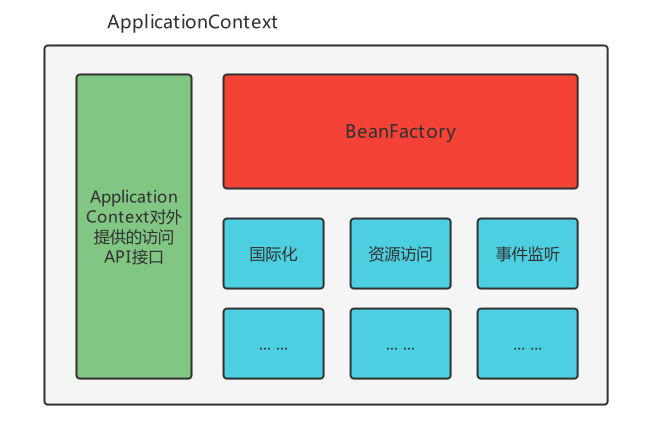
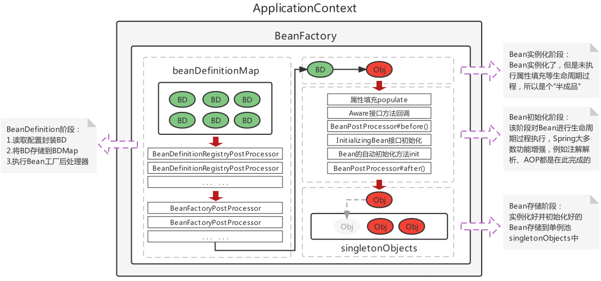
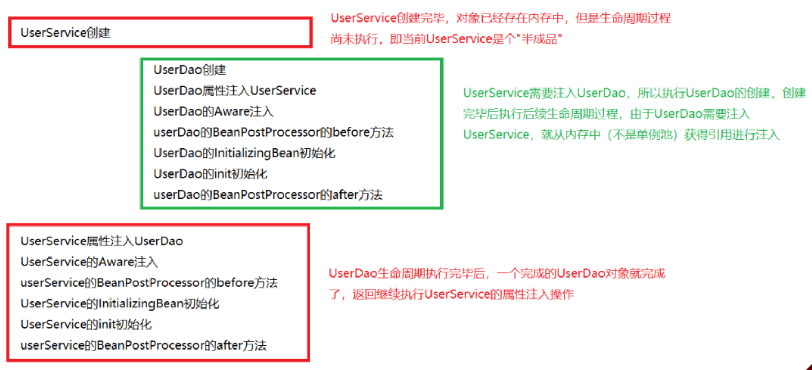

# Spring基础


## 概述

### 基本思想

| 基本思想 | 名词     | 说明                              |
| ---- | ------ | ------------------------------- |
| IoC  | 控制反转   | 将创造Bean的权利交给Spring进行管理          |
| DI   | 依赖注入   | 某个Bean的完整创建依赖于其他Bean（或普通参数）的注入。 |
| AOP  | 面向切面编程 | 横向抽取方法（属性、对象等）思想，组装成一个功能性切面。    |

### 命名空间

#### xml标签概念

| 标签类型  | 说明                                             |
| ----- | ---------------------------------------------- |
| 默认标签  | 默认命名空间内的标签，如`<bean>`。                          |
| 自定义标签 | 导入的命名空间内的标签，如`<context:property-placeholder>`。 |

- xml标签格式：默认命名空间，可以省略前缀。

```xml
<命名空间前缀:标签名>
```

#### 命名空间 xmlns

- 命名空间：默认命名空间、自定义命名空间。自动为 XML 标签补全前缀，避免标签命名冲突。

- 为了确保命名空间的唯一，不同的命名空间的通常使用URL作为被识别的id（名称空间被xml解释器内部所识别的时候所真正使用的id），只是被当做一个字符串名字去处理（而不是网址），xml解释器根据这个id去获取它对应的标准，从而知道这个命名空间定义有什么样的标签(xml解释器自带有一些通用的命名空间的标准)。

```xml
<beans xmlns="http://www.springframework.org/schema/beans" 
       xmlns:xsi="http://www.w3.org/2001/XMLSchema-instance"
       xsi:schemaLocation="http://www.springframework.org/schema/beans   
                           http://www.springframework.org/schema/beans/spring-beans.xsd"> 
</beans>
```

| 属性                 | 说明       |
|:------------------ |:-------- |
| xmlns              | 默认命名空间   |
| xmlns:xsi          | 遵守xml规范  |
| xsi:schemaLocation | schema资源 |

- xmlns="`http://www.springframework.org/schema/beans`" 表示引入了一个默认的名称空间，下文中不使用命名空间前缀的都默认使用这个命名空间，其真正的id是"`http://www.springframework.org/schema/beans`"。

- schemaLocation中存储的值每两个为一组，第一个代表命名空间，第二个代表该命名空间的标准的.xsd schame约束文件位置。
  
  - 只允许存在一个schemaLocation；内部可以存放多个schema资源。
  - 使用META-INF目录下的约束映射文件spring.schemas、处理器映射文件spring.handlers。

**自定义命名空间**

- 需要引入新的 Spring 配置时，添加一个新的命名空间，以及其 schema 资源

```xml
<beans xmlns="http://www.springframework.org/schema/beans"
       xmlns:xsi="http://www.w3.org/2001/XMLSchema-instance"
       xmlns:context="http://www.springframework.org/schema/context"
       xsi:schemaLocation="http://www.springframework.org/schema/beans 
                           http://www.springframework.org/schema/beans/spring-beans.xsd
                           http://www.springframework.org/schema/context 
                           http://www.http://www.springframework.org/schema/context/spring-context.xsd">
</beans>
```

#### 默认标签

- Spring的默认标签用到的是Spring的默认命名空间 `xmlns="http://www.springframework.org/schema/beans"`（里面维护的标签都是默认标签）。

| 标签         | 说明                           |
|:---------- |:---------------------------- |
| `<beans>`  | 一般作为 xml 配置根标签，其他标签都是该标签的子标签 |
| `<bean>`   | Bean的配置标签                    |
| `<import>` | 外部资源导入标签                     |
| `<alias>`  | 指定Bean的别名标签，使用较少             |

#### 自定义标签

- **自定义标签**：Spring的自定义标签需要引入外部的命名空间，并为外部的命名空间指定前缀。（ `<前缀:标签>`）

```xml
<!--默认标签-->
<bean id="userDao" class="com.itheima.dao.impl.UserDaoImpl"/>
<!--自定义标签-->
<context:property-placeholder/>
<mvc:annotation-driven/>
<dubbo:application name="application"/>
```

1. 导入坐标
2. 命名空间

```xml
<beans xmlns="http://www.springframework.org/schema/beans"
       xmlns:xsi="http://www.w3.org/2001/XMLSchema-instance"
       xmlns:mvc="http://www.springframework.org/schema/mvc"
       xsi:schemaLocation="http://www.springframework.org/schema/beans
                           http://www.springframework.org/schema/beans/spring-beans.xsd
                           http://www.springframework.org/schema/mvc
                           http://www.springframework.org/schema/mvc/spring-mvc.xsd">
    <mvc:annotation-driven></mvc:annotation-driven>

</beans>
```

## IoC、DI

### BeanFactory

- BeanFactory（Bean工厂）：Spring底层核心部分。

  

 

#### IoC 控制反转

- IoC：工厂设计模式，BeanFactory根据配置文件/配置类来生产Bean实例。

 

1. beans.xml配置文件

```xml
<?xml version="1.0" encoding="UTF-8"?>
<beans xmlns="http://www.springframework.org/schema/beans"
       xmlns:xsi="http://www.w3.org/2001/XMLSchema-instance"
       xsi:schemaLocation="http://www.springframework.org/schema/beans http://www.springframework.org/schema/beans/spring-beans.xsd">

    <bean id="userService" class="com.zjk.service.impl.UserServiceImpl"></bean>

</beans>
```

2. BeanFactory获取Bean对象：创建BeanFactory，加载配置文件，获取UserService实例对象。

```java
//1. 创建BeanFactory 工厂对象
DefaultListableBeanFactory beanFactory = new DefaultListableBeanFactory();
//2. 创建一个读取器 xml文件
XmlBeanDefinitionReader reader = new XmlBeanDefinitionReader(beanFactory);
//3. 绑定读取器和工厂对象 读取配置文件给工厂对象
reader.loadBeanDefinitions("beans.xml");
//4. 由beans.xml内配置的id获取Bean实例
UserService userService = (UserService) beanFactory.getBean("userService");

System.out.println(userService);
```

#### DI 依赖注入

- DI：通过注入的方式反转Bean的创建权。

 

1. 定义接口及其实现类，setXxx(Xxx xxx)注入方法。（只要存在setXxx()，即使没有相应的xxx属性，也会执行该setXxx()注入方法）

```java
//com.zjk.service.UserService
public interface UserService {}
//com.zjk.service.impl.UserServiceImpl
public class UserServiceImpl implements UserService {
    //通过BeanFactory调用该方法 从容器中获取userDao设置到此处
    //需要先在beans.xml中配置对应的<bean>的<property>
    public void setUserDao(UserDao userDao){
        System.out.println("" + userDao);
    }
}
//com.zjk.dao
public interface UserDao{}
//com.zjk.dao.impl
public class UserDaoImpl implements UserDao{}
```

2. 具体的UserServiceImpl实现类

```java
package com.zjk.service.impl;

import com.zjk.dao.UserDao;
import com.zjk.service.UserService;

public class UserServiceImpl implements UserService {
    private UserDao userDao;

    //通过BeanFactory调用该set方法 从容器中获取userDao设置到此处
    //在beans.xml中的<bean id="userService" name="com.zjk.service.impl.userServiceImpl">中的
    //<property id="setXxx方法的xxx(即setUserDao的userDao)" name="beans.xml中配置的<bean id="userDao name="com.zjk.dao.UserDao">"的id"></property>
    public void setUserDao(UserDao userDao) {
        this.userDao = userDao;
    }
}
```

3. beans.xml配置文件 `<property>注入`

```xml
<bean id="userService" class="com.zjk.service.impl.UserServiceImpl">
    <property name="userDao" ref="userDao"></property>
    <!-- 配置注入
        name：UserServiceImpl中的属性名称(userDao) 即：setUserDao中的setXxx中的xxx
        ref： 在当前的配置文件(beans.xml)(容器)中查找相应的id(userDao)
    -->
</bean>
```

4. beans.xml

```xml
<?xml version="1.0" encoding="UTF-8"?>
<beans xmlns="http://www.springframework.org/schema/beans"
       xmlns:xsi="http://www.w3.org/2001/XMLSchema-instance"
       xsi:schemaLocation="http://www.springframework.org/schema/beans http://www.springframework.org/schema/beans/spring-beans.xsd">

    <bean id="userService" class="com.zjk.service.impl.UserServiceImpl">
        <property name="userDao" ref="userDao"></property>
    </bean>
    <bean id="userDao" class="com.zjk.dao.impl.UserDaoImpl"></bean>
</beans>
```

5. BeanFactory获取Bean对象：创建BeanFactory，加载配置文件，获取UserService实例对象，并提前将其依赖的UserDao注入。

```java
//1. 创建BeanFactory 工厂对象
DefaultListableBeanFactory beanFactory = new DefaultListableBeanFactory();
//2. 创建一个读取器 xml文件
XmlBeanDefinitionReader reader = new XmlBeanDefinitionReader(beanFactory);
//3. 绑定读取器和工厂对象 读取配置文件给工厂对象
reader.loadBeanDefinitions("beans.xml");
//4. 由id获取Bean实例  在获取时会执行UserService中的注入方法(set方法)setUserDao(UserDao userDao)
UserService userService = (UserService) beanFactory.getBean("userService");

System.out.println(userService);
```

#### getBean()

| 方法                                     | 返回值和参数                                                                                   |
|:-------------------------------------- |:---------------------------------------------------------------------------------------- |
| Object getBean (String beanName)       | 根据beanName(`<bean>`的id或别名)从容器中获取Bean实例。<br/>要求容器中Bean(id)唯一。<br/>返回值为Object，需要强转。        |
| T getBean (Class type)                 | 根据Class类型(`<bean>`的class)从容器中获取Bean实例。<br/>要求容器中Bean类型(class)唯一。<br/>返回值为Class类型实例，无需强转。 |
| T getBean (String beanName，Class type) | 根据beanName从容器中获得Bean实例。<br/>返回值为Class类型实例，无需强转。                                          |

```java
//根据beanName获取容器中的Bean实例，需要手动强转
UserService userService = (UserService) applicationContext.getBean("userService");
//根据Bean类型去容器中匹配对应的Bean实例，如存在多个匹配Bean则报错
UserService userService2 = applicationContext.getBean(UserService.class);
//根据beanName获取容器中的Bean实例，指定Bean的Type类型
UserService userService3 = applicationContext.getBean("userService", UserService.class);
```

### ApplicationContext 容器

- ApplicationContext（Spring容器）：内部封装BeanFactory。

#### BeanFactory、ApplicationContext

1. BeanFactory是Spring的早期接口：Bean工厂；ApplicationContext是后期更高级接口：Spring容器。

2. ApplicationContext在BeanFactory基础上对功能进行了扩展，监听功能、国际化功能等。BeanFactory的API更偏向底层，ApplicationContext的API大多数是对这些底层API的封装。
     
   
   - ApplicationContext除了继承了BeanFactory外，还继承了ApplicationEventPublisher（事件发布器）、ResouresPatternResolver（资源解析器）、MessageSource（消息资源）等。但是ApplicationContext的核心功能还是BeanFactory。
       

3. ApplicationContext与BeanFactory既有继承关系，又有融合关系。Bean创建的主要逻辑和功能都被封装在BeanFactory中，ApplicationContext不仅继承了BeanFactory，而且ApplicationContext内部还维护着BeanFactory的引用。 

4. Bean的初始化时机不同，原始BeanFactory是在首次调用getBean("id")时才进行Bean的创建，而ApplicationContext是加载配置文件、容器创建时就将所有的Bean实例都创建好了，存储到一个单例池中，当调用getBean时直接从单例池中获取Bean实例返回。

```java
//1. 加载配置文件，实例化容器
ApplicationContext applicationContext = new ClassPathXmlApplicationContext("applicationContext.xml");
//2. 获取Bean实例对象
UserService userService = (UserService) applicationContext.getBean("userService");

System.out.println(userService);
```

#### ApplicationContext继承体系

```java
public interface ApplicationContext extends EnvironmentCapable, ListableBeanFactory, HierarchicalBeanFactory, MessageSource, ApplicationEventPublisher, ResourcePatternResolver {
    @Nullable
    String getId();

    String getApplicationName();

    String getDisplayName();

    long getStartupDate();

    @Nullable
    ApplicationContext getParent();

    AutowireCapableBeanFactory getAutowireCapableBeanFactory() throws IllegalStateException;
}
```

- 只在Spring基础环境下，即只导入spring-context坐标时，此时ApplicationContext的继承体系:

  

  

- Spring基础环境下，常用的三个ApplicationContext作用如下：

| 实现类                                | 功能描述                             |
|:---------------------------------- |:-------------------------------- |
| ClassPathXmlApplicationContext     | 加载类路径下的xml配置的ApplicationContext  |
| FileSystemXmlApplicationContext    | 加载磁盘路径下的xml配置的ApplicationContext |
| AnnotationConfigApplicationContext | 加载注解配置类的ApplicationContext       |

- 在Spring的web环境下，常用的两个ApplicationContext作用如下：

| 实现类                                   | 功能描述                                    |
|:------------------------------------- |:--------------------------------------- |
| XmlWebApplicationContext              | web环境下，加载类路径下的xml配置的ApplicationContext  |
| AnnotationConfigWebApplicationContext | web环境下，加载磁盘路径下的xml配置的ApplicationContext |

## Bean

### 配置类/文件 @Configuration、 `<beans>`

| 名称   | 配置类 SpringConfig.class             | 配置文件 beans.xml                 |
| ---- | ---------------------------------- | ------------------------------ |
| 配置方式 | @Configuration                     | `<beans>`                      |
| 容器   | AnnotationConfigApplicationContext | ClassPathXmlApplicationContext |
| 说明   |                                    | xml配置的根标签（可嵌套在根标签内）            |

```java
@Configuration
public class ApplicationContextConfig {}
```

  

```java
//注解方式加载配置文件
AnnotationConfigApplicationContext applicationContext =  new AnnotationConfigApplicationContext(ApplicationContextConfig.class);
```

#### 环境切换 @Profile、profile

| 设置环境     | 说明                                                                                                                                       |
| -------- | ---------------------------------------------------------------------------------------------------------------------------------------- |
| profile  |                                                                                                                                          |
| @Profile | @Profile 标注在类或方法上，标注当前产生的Bean从属于哪个环境，只有激活了当前环境，被标注的Bean才能被注册到Spring容器里，不指定环境的Bean，任何环境下都能注册到Spring容器里。<br />没有被@Profile标注的，都是默认处于激活的环境中。 |

- profile：

```xml
<beans xmlns="http://www.springframework.org/schema/beans"
       xmlns:xsi="http://www.w3.org/2001/XMLSchema-instance"
       xmlns:context="http://www.springframework.org/schema/context"
       xsi:schemaLocation="http://www.springframework.org/schema/beans 
                           http://www.springframework.org/schema/beans/spring-beans.xsd">
    <beans profile="环境名1">
    </beans>

    <beans profile="环境名2">
    </beans>
</beans>
```

- @Profile：

```java
@Repository("userDao")
@Profile("test")
public class UserDaoImpl implements UserDao{}

@Component
public class OtherBean {
    @Bean("service")
    @Profile("test")
    public UserService userService(@Qualifier("userServiceImpl") UserService userService) {
        return userService;
    }
}
```

| 激活环境 | 语句                                                                             |
| ---- | ------------------------------------------------------------------------------ |
| JVM  | ` -Dspring.profiles.active=环境名`                                                |
| 代码   | `System.setProperty("spring.profiles.active","环境名")`<br />必须在加载配置文件创建Spring容器前 |

- 默认激活最外层的`<beans>`；如果激活了子级的`<beans>`，则其父级也被激活。即：如果激活了最内层的`<beans>`则依次向外激活直到最外层的`<beans>`也被激活。
- 如果外层和内存的`<beans>`存在相同id或class的`<bean>`，在二者都被激活的情况下，如果是getBean(id)或getBean(class)会出错。

```xml
<beans xmlns="http://www.springframework.org/schema/beans"
       xmlns:xsi="http://www.w3.org/2001/XMLSchema-instance"
       xmlns:context="http://www.springframework.org/schema/context"
       xsi:schemaLocation="http://www.springframework.org/schema/beans
                           http://www.springframework.org/schema/beans/spring-beans.xsd
                           http://www.springframework.org/schema/context
                           http://www.http://www.springframework.org/schema/context/spring-context.xsd">
    <bean id="service" class="com.zjk.service.impl.UserServiceImpl"></bean>
    <beans profile="dev">
        <bean id="userService" class="com.zjk.service.impl.UserServiceImpl">
            <property name="userDao" ref="userDao"></property>
        </bean>
        <bean id="userDao" class="com.zjk.dao.impl.UserDaoImpl"></bean>
    </beans>
    <beans profile="test">
        <bean id="userDao" class="com.zjk.dao.impl.UserDaoImpl"></bean>
    </beans>
</beans>
```

```java
System.setProperty("spring.profiles.active", "dev"); //必须在加载配置文件创建Spring容器前
ApplicationContext applicationContext = new ClassPathXmlApplicationContext("applicationContext.xml");
UserService userService = applicationContext.getBean("userService",UserService.class);
```

#### 导入 @Import、`<import>`

| 导入方式       | 说明                                                                  |
| ---------- | ------------------------------------------------------------------- |
| @Import    | 加载其他配置类<br />替代原有xml中的`<import resource="classpath:beans.xml"/>`配置。 |
| `<import>` | 导入其他配置文件<br />相当于在该配置文件最外层的`<beans>`内加入其他配置文件的`<beans>`的内容。         |

- 如果使用`<import>`导入的配置文件的子级`<beans>`：只需要激活该环境即可，和普通子级`<beans>`的使用相同。
- `<import>`：

```xml
<beans xmlns="http://www.springframework.org/schema/beans"
       xmlns:xsi="http://www.w3.org/2001/XMLSchema-instance"
       xmlns:context="http://www.springframework.org/schema/context"
       xsi:schemaLocation="http://www.springframework.org/schema/beans 
                           http://www.springframework.org/schema/beans/spring-beans.xsd">

    <import resource="classpath:类路径配置文件名(同一个resources目录下的)"></import>

</beans>
```

```xml
<!--导入用户模块配置文件-->
<import resource="classpath:UserModuleApplicationContext.xml"/>
<!--导入商品模块配置文件-->
<import resource="classpath:ProductModuleApplicationContext.xml"/>**` `**
```

- @Import：

```java
@Configuration
@ComponentScan
@PropertySource("classpath:jdbc.properties")
@Import(OtherConfig.class)
public class ApplicationContextConfig {}
```

#### 组件扫描 @ComponentScan、context:component-scan

##### 包扫描

| 组件扫描                                        | 说明                                                                                               |
| ------------------------------------------- | ------------------------------------------------------------------------------------------------ |
| @Component("base-package")                  | 指定一个或多个包名：扫描指定包及其子包下使用注解的类<br />不配置包名：扫描当前@componentScan注解配置类所在包及其子包下的类<br />多个包扫描：`{"包1","包2"}` |
| `<context:component-scan base-package=""/>` |                                                                                                  |

```xml
<context:component-scan base-package="com.zjk"/>
```

```java
@Configuration
@ComponentScan("com.zjk")
public class ApplicationContextConfig {
}
```

```java
@Configuration
@ComponentScan({"com.zjk.service","com.zjk.dao"})
public class ApplicationContextConfig {
}
```

##### Bean加载控制

###### 精确范围

```java
@Component({"com.zjk.service","com.zjk.dao"})
```

###### 过滤器 excludeFilters、includeFilgters

| 过滤器             | 说明                   |
| --------------- | -------------------- |
| excludeFilters  | 设置扫描加载bean时，排除的过滤规则。 |
| includeFilgters | 加载指定的bean。           |

| type属性          | 说明                    |
|:--------------- |:--------------------- |
| ANNOTATION      | 按照注解排除                |
| ASSIGNABLE_TYPE | 按照指定的类型过滤             |
| ASPECTJ         | 按照Aspectj表达式排除，基本上不会用 |
| REGEX           | 按照正则表达式排除             |
| CUSTOM          | 按照自定义规则排除             |

```java
@ComponentScan(value = "com.zjk",
        excludeFilters = @ComponentScan.Filter(
                type = FilterType.ANNOTATION, //指定注解类型的Bean
                classes = Controller.class //排除指定注解的Bean
        )
)
```

##### 组件扫描原理

 

 

###### component-scan

- component-scan是一个context命名空间下的自定义标签，要找到对应的命名空间处理器（NamespaceHandler）和解析器，查看spring-context包下的spring.handlers文件。将标注的@Component的类生成的对应的BeanDefiition进行了注册。

```xml
<context:conponent-scan base-package="com.zjk"></context>
```


###### @ComponentScan

- AnnotationConfigApplicationContext容器在进行创建时，内部调用了如下代码，该工具注册了几个Bean后处理器。

```java
AnnotationConfigUtils.registerAnnotationConfigProcessors(this.registry)
```

- 其中，ConfigurationClassPostProcessor 是一个 BeanDefinitionRegistryPostProcessor，经过一系列源码调用，最终也被指定到了ClassPathBeanDefinitionScanner 的doScan 方法（与xml方式最终终点一致）。

  

      

#### properties资源加载 @PropertySource、`<context:property-placeholder>`

| 类型         | 加载外部properties资源配置                            |
| ---------- | --------------------------------------------- |
| Annotation | @PropertySource                               |
| xml        | `<context:property-placeholder location=""/>` |

```java
@Configuration
@ComponentScan
@PropertySource({"classpath:jdbc.properties","classpath:xxx.properties"})
public class ApplicationContextConfig {}
```

#### 同类型注入优先 @Primary

- @Primary：标注相同类型的Bean优先被使用权。与@Component、@Bean一起使用，标注该Bean的优先级更高。

> 通过类型获取Bean（getBean(class)）、@Autowired根据类型进行注入时，会选用优先级更高的Bean。
> 
> @Qualifier指定名称注入，而不是优先级。

```java
@Repository
@Primary
public class UserDaoImpl implements UserDao{}

@Repository
public class UserDaoImpl2 implements UserDao{}
```

```java
@Bean
@Primary
public UserDao getUserDao01(){return new UserDaoImpl();}

@Bean
public UserDao getUserDao02(){return new UserDaoImpl2();}
```

### Bean配置 `<bean>`

| xml                                         | Annotation     | 功能描述                                               |
|:------------------------------------------- | -------------- |:-------------------------------------------------- |
| `<bean id="" class="">`                     | @Component     | Bean的id和全限定名配置；<br>在指定扫描范围内被Spring加载并实例化           |
| `<bean name="">`                            |                | Bean的别名                                            |
| `<bean scope="">`                           | @Scope         | Bean的作用范围<br>BeanFactory作为容器时取值singleton和prototype |
| `<bean lazy-init="">`                       | @Lazy          | Bean的实例化时机，是否延迟加载。BeanFactory作为容器时无效               |
| `<bean init-method="">`                     | @PostConstruct | Bean实例化后自动执行的初始化方法，method指定方法名                     |
| `<bean destroy-method="">`                  | @PreDestroy    | Bean实例销毁前的方法<br />method指定方法名                      |
| `<bean autowire="byType"> `                 |                | 设置自动注入模式<br />按照类型byType、按照名字byName                |
| `<bean factory-bean="" factory-method=""/>` | @Bean          | 指定工厂Bean的方法完成Bean的创建                               |

#### 基础配置 @Component

| 方式   | @Component("beanName") | `<bean id="" class="">` |
| ---- | ---------------------- | ----------------------- |
| 默认id | 类名首字母小写                | 全限定名                    |

> id：存储到Spring容器 （singletonObjects单例池）中的Bean的beanName。
> 
> class：实例对应的类。

| @Component衍生注解 | 层次      |
|:-------------- |:------- |
| @Repository    | Dao     |
| @Service       | Service |
| @Controller    | Web     |

- bean标签：

```xml
<bean id="userDao" class="com.zjk.dao.impl.UserDaoImpl"></bean>
<bean class="com.zjk.dao.impl.UserDaoImpl"></bean>
```

```java
applicationContext.getBean("com.zjk.dao.impl.UserDaoImpl")
```

- @Component：

```java
@Component
public class UserDaoImpl implements UserDao {
}
```

```java
ApplicationContext applicationContext = new ClassPathXmlApplicationContext("applicationContext.xml");
UserDaoImpl userDao = applicationContext.getBean("userDaoImpl", UserDaoImpl.class);
System.out.println(userDao);
```

#### 别名配置 name、`<alias>`

- Bean可以指定多个别名，根据别名可以获得Bean对象、在配置文件中使用该别名（和id一样的用法）。

- beanFactory中维护`Map<String,String> aliasMap`：存储别名和beanName之间的映射关系。

| 情景    | beanName                             |
| ----- | ------------------------------------ |
| id存在  | 别名指向id，singletoObjects中的beanName使用id |
| id不存在 | singletonObjects中的beanName使用第一个别名    |

   

- name：对于多个别名，别名之间使用逗号`,`分隔： 

```xml
<bean id="userDao" name="别名" class="com.zjk.dao.impl.UserDaoImpl"></bean>
<bean id="userDao" name="alia1,alia2" class="com.zjk.dao.impl.UserDaoImpl"></bean>
```

- `<alas>`：

```xml
<bean id="Bean的id(userService)" name="别名1"></bean>
<alias name="添加别名的Bean的id(userService)" alias="别名2"></alias>   
```

```xml
<bean id="userService" class="com.zjk.service.impl.UserServiceImpl"></bean>
<alias name="userService" alias="service"></alias>
```

#### 范围配置 @Scope 、scope

- Spring-Context环境Bean的作用范围有两个：Singleton、Prototype。
- Spring-webmvc环境：request、session。

| 范围        | 说明                                                                                                            |
| --------- | ------------------------------------------------------------------------------------------------------------- |
| singleton | 单例，默认值。<br/>Spring容器创建的时候，就会进行Bean的实例化，并存储到容器内部的单例池singletonObjects中。<br/>每次getBean()时都是从单例池中获取相同的Bean实例。     |
| prototype | 原型。<br/>pring容器初始化时不会创建Bean实例，当调用getBean()时才会实例化Bean。<br/>每次getBean()都会创建一个新的Bean实例。信息存放在 beanDefinitionMap 。 |

```xml
<bean id="userDao" class="com.zjk.dao.impl.UserDaoImpl" scope="singleton"></bean>
```

```java
@Scope("singleton")
public class UserDaoImpl{}
```

#### 延迟加载  @Lazy、lazy-init

- 延迟加载：Spring容器创建时，不会立即创建Bean实例，等到需要时再创建Bean实例并存储到单例池中，后续使用该Bean则从单例池获取，仍然是单例。

```xml
<bean id="userDao" class="com.zjk.dao.impl.UserDaoImpl" lazy-init="true"></bean>
```

```java
@Lazy(true)
public class UserDaoImpl{}
```

#### 初始化、销毁

- Bean实例化后，可以执行指定的初始化方法完成一些初始化的操作；Bean销毁前也可以执行指定的销毁方法完成一些操作。

> ClassPathXmlApplicationContext类的close()方法关闭容器时会销毁其中的Bean。

> Bean的销毁不一定调用Bean的销毁方法：有可能在Spring容器关闭之后，还未来得及调用Bean的销毁方法，尽管如此Bean还是被销毁了。

| 方式  | 初始化                  | 销毁                      |
| --- | -------------------- | ----------------------- |
| xml | init-method="method" | destory-method="method" |
| 注解  | @PostConstruct       | @PreDestory             |

> @PostConstruct和 @PreDestroy注解位于javax.annotation包，需要引入javax.annotation-api依赖。

- xml：

```xml
<bean id="userDao" class="com.zjk.dao.impl.UserDaoImpl" init-method="init" destory-method="destory"></bean>
```

```java
public class UserDaoImpl implements UserDao {
    public void init(){ System.out.println("初始化方法..."); }
    public void destroy(){ System.out.println("销毁方法..."); }
}
```

- Annotation：

```java
public class UserDaoImpl implements UserDao {
    @PostConstruct
    public void init(){ System.out.println("初始化方法..."); }
    @PreDestory
    public void destroy(){ System.out.println("销毁方法..."); }
}
```

### DI 依赖注入

#### 依赖注入方式

##### set()注入

- `<property name="userDao" ref="userDao"/>`
- `<property name="userDao" value="haohao"/>`

| 注解         | 数据类型                       | 位置    |
| ---------- | -------------------------- | ----- |
| @Value     | 普通数据                       | 字段、方法 |
| @Autowired | 根据类型（byType）注入引用数据<br />缺省 | 字段、方法 |
| @Qualifier | 结合@Autowired，根据名称注入        | 字段、方法 |
| @Resource  | 根据类型或名称进行注入                | 字段、方法 |

- setXxx()方法注入的属性值会覆盖直接给属性注入的值。

##### 构造器注入

- `<constructor-arg name="name" ref="userDao"/>`
- `<constructor-arg name="name" value="haohao"/>`

#### 依赖注入的数据类型

| 数据类型                        | xml                       | Annotation |
| --------------------------- | ------------------------- | ---------- |
| 普通数据类型<br />（基本数据类型+String） | value                     | @Value     |
| 引用                          | ref                       | @Autowired |
| 集合                          | `<list><set><map><props>` | @Autowired |

##### 普通 @Value value

- 普通数据类型：String（不需要双引号""）、基本数据类型。

- `<property>`内嵌`<value>`标签：

```xml
<bean id="userService" class="com.zjk.service.impl.UserServiceImpl">
    <property name="属性">
        <value>hello</value> 如果带上引号，则赋值的是："hello"而不是hello
    </property>
</bean>
```

```xml
<bean id="userService" class="com.zjk.service.impl.userService">
    <property name="name" value="hello"></property>
</bean>
```

- @Value：

```java
@Component
public class UserDaoImpl implements UserDao {
    @Value("zjk")
    private String username;

    public String getUsername() {
        return username;
    }

    @Value("tom")
    public void setUsername(String username) {
        this.username = username;
    }
}
```

##### 引用 ref

- `<property>`内嵌`<ref>`标签：对`<bean>`的引用。

```xml
<bean id="userService" class="com.zjk.service.impl.UserServiceImpl">
    <property>
        <ref bean="dao1"> <!--对id=dao1的bean标签的引用-->
        <bean id="dao2" class="com.zjk.dao.impl.UserDaoImpl"></bean>
    </property>
</bean>
<bean id="dao1" class="com.zjk.dao.impl.UserDaoImpl"></bean>
```

##### 集合

| 集合           | `<property>`对应标签                                     |
|:------------ |:---------------------------------------------------- |
| `List<T>`    | `<list>`                                             |
| `Set<T>`     | `<set>`                                              |
| `Map<T>`     | `<map>`内部`<entry key或key-ref="" value或value-ref="">` |
| `Properties` | `<props>`内部`<prop key="">value</prop>`               |

###### `List<T>`

```xml
<bean id="userService" class="com.zjk.service.impl.UserServiceImpl">
    <property name="userDaoList">
        <list>
            <ref bean="dao1"></ref>
            <bean id="dao2" class="com.zjk.dao.impl.UserDaoImpl"></bean>
            <bean id="dao3" class="com.zjk.dao.impl.UserDaoImpl"></bean>
        </list>
    </property>
</bean>
<bean id="dao1" class="com.zjk.dao.impl.UserDaoImpl"></bean>
```

```java
//com.zjk.service.impl.UserServiceImpl
private List<UserDao> userDaoList;

public void setUserDaoList(List<UserDao> userDaoList) {
    this.userDaoList = userDaoList;

    userDaoList.forEach(dao -> System.out.println(dao));
}
```

###### `Map<T>`

```xml
<bean id="userService" class="com.zjk.service.impl.UserServiceImpl">
    <property name="userDaoMap">
        <map>
            <entry key="1" value-ref="dao1"></entry>
            <entry key="2" value-ref="dao2"></entry>
            <entry key="3" value-ref="dao3"></entry>
        </map>
    </property>
</bean>
<bean id="dao1" class="com.zjk.dao.impl.UserDaoImpl"></bean>
<bean id="dao2" class="com.zjk.dao.impl.UserDaoImpl"></bean>
<bean id="dao3" class="com.zjk.dao.impl.UserDaoImpl"></bean>
```

```java
//com.zjk.service.impl.UserServiceImpl
private Map<Integer,UserDao> userDaoMap;

public void setUserDaoMap(Map<Integer,UserDao> userDaoMap) {
    this.userDaoMap = userDaoMap;

    userDaoMap.forEach((k,v)->System.out.println(k + ":" + v););
}
```

###### Properties @PropertySource、props

- props：

```xml
<bean id="userService" class="com.zjk.service.impl.UserServiceImpl">
    <property name="properties">
        <props>
            <prop key="username">zjk</prop>
            <prop key="password">123</prop>
        </props>
    </property>
</bean>
```

```java
//com.zjk.service.impl.UserServiceImpl
private Properties properties;

public void setProperties(Properties properties) {
    this.properties = properties;

    properties.forEach((k,v) -> System.out.println(k + ":" + v));
}
```

- @PropertySource、@Value
1. 加载properties文件到Spring容器。

```xml
<context:property-placeholder location="classpath:jdbc.properties"/>
```

```java
@Configuration
@PropertySource("classpath:jdbc.properties")
public class SpringConfig{}
```

2. @Value 注入properties文件中的属性，在载入properties文件后：SpEL表达式注入。

```java
@Component
public class UserDaoImpl implements UserDao {
    @Value("${jdbc.username}")
    private String username;

    public String getUsername() {
        return username;
    }

    @Value("${jdbc.username}")
    public void setUsername(){
        this.username = username;
    }
}
```

#### 自动装配

##### autowire

- 如果被注入的属性类型是Bean引用的话，那么可以在`<bean>` 标签中使用 autowire 属性去配置自动注入方式

| 注解                         | 属性     | 说明                                                                                                                                                                  |
| -------------------------- | ------ | ------------------------------------------------------------------------------------------------------------------------------------------------------------------- |
| @Autowired                 | byName | 属性名自动装配：匹配 setXxx()和id，在配置文件查找id="xxx"（或name="xxx"）的`<bean>` ，如果存在该`<bean>`则使用该Bean来装配。                                                                             |
| @Autowired<br />@Qualifier | byType | Bean的类型从容器中匹配：匹配setXxx(Yyy 参数)的数据类型Yyy，在配置文件中查找class的类型是Yyy的。<br />只要和set()方法的参数类型匹配，就会为该set()方法提供参数。  <br />同一类型只能匹配一个`<bean>`，匹配出多个相同Bean类型时（class相同：包括继承、实现），报错。 |

- autowire="byName"

```xml
<bean id="userService" class="com.zjk.service.impl.UserServiceImpl" autowire="byName"></bean>
<bean id="userDao" class="com.zjk.dao.impl.UserDaoImpl"></bean>
```

- autowire="byType"

```xml
<bean id="userService" class="com.zjk.service.impl.UserServiceImpl" autowire="byType"></bean>
<bean id="userDao" class="com.zjk.dao.impl.UserDaoImpl"></bean>
```

```java
//com.zjk.service.impl.UserServiceImpl
private UserDao userDao;

public void setUserDao(UserDao userDao) {
    this.userDao = userDao;
}
```

##### @Autowired

- 同一类型的Bean实例只有一个时：

```java
@Service
public class UserServiceImpl implements UserService {
    @Autowired
    private UserDao userDao;

    @Autowired
    public void show(UserDao userDao) {
        System.out.println("show:" + userDao);
    }
}
```

```java
@Repository
public class UserDaoImpl implements UserDao{}
```

- 同一类型的Bean实例存在多个时：

| 注入数量                            | 说明                                                              |
|:------------------------------- |:--------------------------------------------------------------- |
| 只注入一个Bean实例                     | 当容器中同一类型的Bean实例有多个时，会尝试通过被注入属性的参数名称进行二次匹配。如果不存在匹配的beanName，则报错。 |
| 注入多个Bean实例 <br>List`<Bean实例类型>` | 将通过类型匹配的Bean实例都注入到集合中。                                          |

```java
@Repository
public class UserDaoImpl implements UserDao{}
@Repository
public class UserDaoImpl2 implements UserDao{}
```

```java
@Service
public class UserServiceImpl implements UserService {

    @Autowired
    private UserDao userDaoImpl;

    public UserDao getUserDao() {
        return userDaoImpl;
    }

    @Resource
    public void setUserDao(UserDao userDao) {
        this.userDaoImpl = userDao;
    }
}
```

```java
@Autowired
public void show(List<UserDao> userDaoList){
    userDaoList.forEach(dao -> System.out.println(dao));
}
```

##### @Qualifier 指定名称注入

```java
public @interface Qualifier {
    String value() default "";
}
```

- @Qualifier配合@Autowired根据名称注入Bean实例。

```java
@Service
public class UserServiceImpl implements UserService {
    @Autowired
    @Qualifier("userDaoImpl")
    private UserDao userDao;

    public UserDao getUserDao() {
        return userDao;
    }

    @Autowired
    @Qualifier("userDaoImpl2")
    public void setUserDao(UserDao userDao) {
        this.userDao = userDao;
    }
}
```

##### @Resource

- @Resource注解存在于 javax.annotation 包中，Spring对其进行解析。

- @Resource：不指定名称参数name时-->根据类型注入，指定名称参数name时-->根据名称注入。

- 当存在多个相同类型的Bean实例时，不会像@Autowired一样报错。  

```java
@Service
public class UserServiceImpl implements UserService {
    @Resource
    private UserDao userDao;

    public UserDao getUserDao() {
        return userDao;
    }

    @Resource(name="userDaoImpl2")
    public void setUserDao(UserDao userDao) {
        this.userDao = userDao;
    }
}
```

### Bean实例化

| 实例化方式 | 说明                       |
| ----- | ------------------------ |
| 构造方式  | 底层通过构造方法对Bean进行实例化       |
| 工厂方式  | 底层通过调用自定义的工厂方法对Bean进行实例化 |

#### 构造器 constructor-arg

- 对于多个构造方法：根据`<consturctor-arg>`的参数来选择相应的构造器。

**无参构造方法** 

**有参构造方法**

- 使用`<bean>`的内嵌标签`<consturctor-arg>`进行参数注入
- 只要是为了实例化Bean对象而传递的参数都可以通过`<constructor-arg>`标签完成

```xml
<consturctor-arg name="构造方法中的参数名称" value="参数的值"></consturctor-arg>
```

```xml
<bean id="userDao" name="com.zjk.dao.impl.UserDaoImpl">
    <consturctor-arg name="name" value="Tom"></consturctor-arg>
    <constructor-arg name="age" value="18"></constructor-arg>
</bean>
```

```java
public UserDaoImpl(String name,int age){
}
```

#### 工厂

- 静态工厂方法实例化Bean。
- 实例工厂方法实例化Bean。
- 实现FactoryBean规范延迟实例化Bean。

##### 静态工厂 factory-method

- 静态工厂：配置一个工厂Bean，提供一个静态方法用于生产Bean实例。而不需要配置被生产的Bean。

```xml
<bean id="getBean()获取Bean实例的id" class="工厂类的全限定名" factory-method="工厂类定义的get方法 ">
    <!--只要是为了实例化对象而传递的参数都可以通过`<constructor-arg>`标签完成-->
    <constructor-arg name="工厂类get方法的参数" value="参数值"></constructor-arg>
</bean>
```

```xml
<bean id="userDao" class="com.zjk.factory.UserDaoFactory" factory-method="getUserDao"></bean>
```

```java
public class UserDaoFactory {
    public static UserDaoImpl getUserDao(){
        return new UserDaoImpl();
    }
}
```

##### 实例工厂方法 @Bean、factory-bean

###### factory-bean

- 实例工厂方法：工厂对象调用非静态方法，先配置工厂Bean，再配置目标Bean。实例化Bean对象时，先实例化工厂Bean对象，再通过工厂Bean对象调用getXxx()来获取Bean对象。

```xml
<beans>
    <bean id="工厂类id" class="工厂类的全限定名"></bean>
    <bean id="获取Bean实例" class="Bean实例的全限定名" factory-bean="工厂类id" factory-method="工厂类的get方法">
        <constructor-arg name="工厂类get方法的参数" value="传入的值"></constructor-arg>
    </bean>
</beans>
```

```xml
<bean id="@Bean指定的beanName" factory-bean="外层的@Component注解的Bean实例" factory-method="工厂类的get方法"></bean>
```

```xml
<bean id="userDaoFactoryBean" class="com.zjk.factory.UserFactoryBean"></bean>
<bean id="userDao" class="com.zjk.dao.impl.UserDaoImpl" factory-bean="userDaoFactoryBean" factory-method="getUserDao">
    <constructor-arg name="name" value="Tom"></constructor-arg>
</bean>
```

```java
public class UserDaoFactoryBean {
    //非静态工厂方法
    public UserDao getUserDao(String name){
        return new UserDaoImpl();
    }
}
```

   

###### @Bean

- @Bean工厂方法参数注入：@Value、@Autowired、@Qualifier。
  - 参数列表内对单个参数注解。
  - 方法上对所有参数注解。
- @Bean将方法的返回值作为Bean实例注册到Spring容器中。@Bean("beanName")指定当前返回的Bean实例的beanName，如果不指定，则直接使用当前方法的名称(getDataSource)来作为当前Bean实例的beanName。

```java
@Component
public class OtherBean {
    @Bean("dataSource")
    public DruidDataSource dataSource(@Value("${jdbc.url}") String url,
                                         @Value("${jdbc.username}") String userName,
                                         @Value("1234") String password) {
        DruidDataSource dataSource = new DruidDataSource();
        dataSource.setUrl(url);
        dataSource.setUsername(userName);
        dataSource.setPassword(password);
        return dataSource;
    }

    @Bean("userDao")
    //@Autowired 可以省略@Autowired 
    public UserDao userDao(UserDaoImpl userDao){
        return userDao;
    }

    @Bean("dao")
    //@Autowired 可以省略@Autowired 
    public UserDao userService(@Qualifier("userDaoImpl2") UserDao dao) {
        //由于UserDao类型的Bean实例存在多个，需要使用@Qualifier指定注入的beanName
        return dao;
    }
}
```

##### FactoryBean接口

- 实现FactoryBean接口，再交给Spring管理即可。

```java
public interface FactoryBean<T> {
    String OBJECT_TYPE_ATTRIBUTE = "factoryBeanObjectType";
    T getObject() throws Exception; //获得实例对象方法
    Class<?> getObjectType(); //获得实例对象类型方法
    default boolean isSingleton() {
        return true;
    }
}
```

```xml
<bean id="工厂类" class="工厂类的全限定名"></bean>
```

- Spring容器创建时，FactoryBean被实例化并存储到singletonObjects中，但getObject() 方法尚未被执行，UserDaoImpl也没被实例化，当首次用到UserDaoImpl时，才调用getObject() 。此工厂方式产生的Bean实例不会存储到singletonObjects中，而是存储到factoryBeanObjectCache中，之后每次使用到userDao都从该缓存池中获取同一个userDao实例。

   

```xml
<bean id="userDao" class="com.zjk.factory.UserDaoFactoryBean"></bean>
```

```java
public class UserDaoFactoryBean implements FactoryBean<UserDao> {

    @Override
    public UserDao getObject() throws Exception {
        return new UserDaoImpl();
    }

    @Override
    public Class<?> getObjectType() {
        return UserDao.class;
    }

    @Override
    public boolean isSingleton() {
        return FactoryBean.super.isSingleton();
    }
}
```

#### 非自定义Bean

##### Druid

1. 导入依赖
2. 配置 DruidDataSource

```xml
<!-- mysql驱动 -->
<dependency>
    <groupId>mysql</groupId>
    <artifactId>mysql-connector-java</artifactId>
    <version>5.1.49</version>
</dependency>
<!-- druid数据源 -->
<dependency>
    <groupId>com.alibaba</groupId>
    <artifactId>druid</artifactId>
    <version>1.1.23</version>
</dependency>
```

- 源码

```java
DruidDataSource dataSource = new DruidDataSource();
dataSource.setDriverClassName("com.mysql.jdbc.Driver");
dataSource.setUrl("jdbc://localhost:3306/db1");
dataSource.setUsername("root");
dataSource.setPassword("1234");
```

- xml配置

```xml
<!--配置 DruidDataSource数据源-->
<bean class="com.alibaba.druid.pool.DruidDataSource">
    <!--配置必要属性-->
        <property name="driverClassName" value="com.mysql.jdbc.Driver"/>
        <property name="url" value="jdbc:mysql://localhost:3306/db1"/>
        <property name="username" value="root"/>
        <property name="password" value="root"/>
</bean>
```

##### Connection

- Connection 的产生是通过DriverManager的静态方法getConnection获取的，所以我们要用静态工厂方式配置

- 源码

```java
//Connection conn = druidDataSource.getConnection();
Connection conn = DriverManager.getConnection("jdbc:mysql://127.0.0.1:3306/db1","root","1234");
```

- applicationContext.xml配置

```xml
<!--
<bean class="java.lang.Class" factory-method="forName">
    <constructor-arg name="className" value="com.mysql.jdbc.Driver"/>
</bean>                   
-->factory-method="getConnection"可能会报错，不影响
<bean id="connection" class="java.sql.DriverManager" factory-method="getConnection" scope="prototype">
    <constructor-arg name="url" value="jdbc:mysql:///db1"/>
    <constructor-arg name="user" value="root"/>
    <constructor-arg name="password" value="root"/>
</bean>
```

##### Date

```java
//产生一个指定日期格式的对象，原始代码按如下：
String currentTimeStr = "2023-08-27 07:20:00";
SimpleDateFormat simpleDateFormat = new SimpleDateFormat("yyyy-MM-dd HH:mm:ss");
Date date = simpleDateFormat.parse(currentTimeStr);
```

```xml
<bean id="dateFactoryBean" class="java.text.SimpleDateFormat">
    <constructor-arg value="yyyy-mm-dd HH:mm:ss"/>
</bean>
<bean id="date" class="java.util.Date" factory-bean="dateFactoryBean" factory-method="parse">
    <constructor-arg value="2023-04-03 17:44:20"/>
</bean>
```

- 如果需要自己提供值或改变值，而不只是配置文件内的设定值（可以看作默认值），可以对getBean()得到的Bean实例进行操作。

##### MyBatis

1. 导入MyBatis的相关坐标
2. SqlSessionFactory交由Spring管理配置

```xml
<!--mybatis框架-->
<dependency>
    <groupId>org.mybatis</groupId>
    <artifactId>mybatis</artifactId>
    <version>3.5.5</version>
</dependency>
<!-- mysql驱动 -->
<dependency>
    <groupId>mysql</groupId>
    <artifactId>mysql-connector-java</artifactId>
    <version>5.1.49</version>
</dependency>
```

- 源码

```java
//加载mybatis核心配置文件，使用Spring静态工厂方式
InputStream in = Resources.getResourceAsStream(“mybatis-conifg.xml”);
//创建SqlSessionFactoryBuilder对象，使用Spring无参构造方式
SqlSessionFactoryBuilder builder = new SqlSessionFactoryBuilder();
//调用SqlSessionFactoryBuilder的build方法，使用Spring实例工厂方式
SqlSessionFactory sqlSessionFactory = builder.build(in);
```

- applicationContext.xml配置

```xml
<!--静态工厂方式产生Bean实例-->
<bean id="inputStream" class="org.apache.ibatis.io.Resources" factory-method="getResourceAsStream">
    <constructor-arg name="resource" value="mybatis-config.xml"/>
</bean>
<!--无参构造方式产生Bean实例-->
<bean id="sqlSessionFactoryBuilder" class="org.apache.ibatis.session.SqlSessionFactoryBuilder"/>
<!--实例工厂方式产生Bean实例-->
<bean id="sqlSessionFactory" factory-bean="sqlSessionFactoryBuilder" factory-method="build">
    <constructor-arg name="inputStream" ref="inputStream"/>
</bean>
```

### 后处理器

- Spring的后处理器是Spring对外开发的重要扩展点，允许我们介入到Bean的整个实例化流程中来，以达到动态注册BeanDefinition，动态修改BeanDefinition，以及动态修改Bean的作用。

| 后处理器                                 | 执行时机                                    |
| ------------------------------------ | --------------------------------------- |
| BeanFactoryPostProcessor（Bean工厂后处理器） | BeanDefinitionMap填充完毕，Bean实例化之前执行       |
| BeanPostProcessor（Bean后处理器）          | 一般在Bean实例化之后，填充到单例池singletonObjects之前执行 |

##### Bean工厂后处理器 – BeanFactoryPostProcessor

###### BeanFactoryPostProcessor

- BeanFactoryPostProcessor接口规范：该接口的实现类如果交由Spring容器管理，则Spring自动回调该接口的方法，对BeanDefinition注册、修改。
  - 如果在postProcessBeanFactory()中修改了BeanDefinition的className，那么不能使用class来getBean()。

```java
public interface BeanFactoryPostProcessor {
    void postProcessBeanFactory(ConfigurableListableBeanFactory beanFactory);
}
```

###### ConfigurableListableBeanFactory

- postProcessBeanFactory的参数ConfigurableListab实质上是**DefaultListableBeanFactory**。可以对beanDefinitionMap中的BeanDefinition进行操作。

   

- applicationContext.xml

```xml
<?xml version="1.0" encoding="UTF-8"?>
<beans xmlns="http://www.springframework.org/schema/beans"
       xmlns:xsi="http://www.w3.org/2001/XMLSchema-instance"
       xsi:schemaLocation="http://www.springframework.org/schema/beans
                           http://www.springframework.org/schema/beans/spring-beans.xsd">
    <bean class="com.zjk.processor.MyBeanFactoryProcessor"></bean>
    <bean id="userDao" class="com.zjk.dao.impl.UserDaoImpl"></bean>
    <bean id="userService" class="com.zjk.service.impl.UserServiceImpl">
<!--        <property name="userDao" ref="userDao"></property>-->
    </bean>
</beans>
```

- MyBeanFactoryProcess

```java
public class MyBeanFactoryProcessor implements BeanFactoryPostProcessor {

    @Override
    public void postProcessBeanFactory(ConfigurableListableBeanFactory configurableListableBeanFactory) throws BeansException {
        //修改BeanDefinition
        //1.获取指定BeanDefinition
        BeanDefinition userService = configurableListableBeanFactory.getBeanDefinition("userService");
        //2.将UserService修改为UserDao对象
        userService.setBeanClassName("com.zjk.dao.impl.UserDaoImpl");

        //注册BeanDefinition
        //1.新建RootBeanDefinition对象
        BeanDefinition personDao = new RootBeanDefinition();
        //2.设置RootBeanDefinition对象的class
        personDao.setBeanClassName("com.zjk.dao.impl.PersonDaoImpl");
        //3.强转为DefaultListableBeanFactory
        DefaultListableBeanFactory defaultListableBeanFactory = (DefaultListableBeanFactory) configurableListableBeanFactory;
        //4.注册到BeanDefinitionMap中 registerBeanDefinition("id",beanDefinition)
        defaultListableBeanFactory.registerBeanDefinition("personDao",personDao);

        //使用BeanDefinitionRegistryPostProcessor进行注册
    }
}
```

- test

```java
ApplicationContext applicationContext = new ClassPathXmlApplicationContext("applicationContext.xml");
UserDao userService = (UserDao) applicationContext.getBean("userService"); //只能使用id来getBean()
System.out.println(userService); //com.zjk.dao.impl.UserDaoImpl@4fb61f4a

PersonDao personDao = applicationContext.getBean("personDao", PersonDao.class);
System.out.println(personDao);
```

###### BeanDefinitionRegistryPostProcessor

- BeanDefinitionRegistryPostProcessor：专门用于注册BeanDefinition操作的接口。

```java
public interface BeanDefinitionRegistryPostProcessor extends BeanFactoryPostProcessor {
    void postProcessBeanDefinitionRegistry(BeanDefinitionRegistry var1) throws BeansException;
}
```

- postProcessBeanDefinitionRegistry(BeanDefinitionRegistry beanDefinitionRegistry) 
- postProcessBeanFactory(ConfigurableListableBeanFactory configurableListableBeanFactory) 

```java
public class MyBeanDefinitionRegistryPostProcessor implements BeanDefinitionRegistryPostProcessor {
    @Override
    public void postProcessBeanDefinitionRegistry(BeanDefinitionRegistry beanDefinitionRegistry) throws BeansException {
        //1.新建RootBeanDefinition对象
        //2.设置RootBeanDefinition对象的className
        //3.注册到BeanDefinitionMap中 registerBeanDefinition("id",beanDefinition)
    }

    @Override
    public void postProcessBeanFactory(ConfigurableListableBeanFactory configurableListableBeanFactory) throws BeansException {

    }
}
```

- 执行顺序：BeanDefinitionRegistryPostProcessor的(postProcessBeanDefinitionRegistry > postProcessBeanFactory) > BeanFactoryPostProcessor的postProcessBeanFactory。

```xml
<bean class="com.zjk.processor.MyBeanDefinitionRegistryPostProcessor"></bean>
```

```java
public class MyBeanDefinitionRegistryPostProcessor implements BeanDefinitionRegistryPostProcessor {
    @Override
    public void postProcessBeanDefinitionRegistry(BeanDefinitionRegistry beanDefinitionRegistry) throws BeansException {
        //注册
        //1.新建RootBeanDefinition对象
        BeanDefinition personDao = new RootBeanDefinition();
        //2.设置RootBeanDefinition对象的class
        personDao.setBeanClassName("com.zjk.dao.impl.PersonDaoImpl");
        //3.注册到BeanDefinitionMap中 registerBeanDefinition("id",beanDefinition)
        beanDefinitionRegistry.registerBeanDefinition("personDao",personDao);
    }

    @Override
    public void postProcessBeanFactory(ConfigurableListableBeanFactory configurableListableBeanFactory) throws BeansException {

    }
}
```

##### Bean后处理器 – BeanPostProcessor

- Bean后处理器：实现了该接口并被容器管理的BeanPostProcessor会在创建每个Bean的流程节点上被Spring自动调用。

> @Nullable 标识，方法可以不被实现。

| 方法参数            | 说明                           |
| --------------- | ---------------------------- |
| Object bean     | 当前被实例化的Bean                  |
| String beanName | 当前Bean在容器中的名称                |
| 返回值             | 加入到singletonObjects单例池中的bean |

```java
public interface BeanPostProcessor {
    //在属性注入完毕，init初始化方法执行之前被回调
    @Nullable
    default Object postProcessBeforeInitialization(Object bean, String beanName) throws BeansException {
        return bean;
    }
    //在init初始化方法执行之后，被添加到单例池singletonObjects之前被回调
    @Nullable
    default Object postProcessAfterInitialization(Object bean, String beanName) throws BeansException {
        return bean;
    }
}
```

- Proxy 动态代理在运行期间执行增强操作：
  
  - 代理设计模式和包装设计模式。
  
  - 使用动态代理 对目标bean进行增强，返回proxy对象，存储在singletonObjects单例池中。
  
  - 主要是在postProcessAfterInitialization(Object bean, String beanName)中，对已经init初始化的bean进行增强。

```java
public class TimeLogBeanPostProcessor implements BeanPostProcessor {

    @Override
    public Object postProcessAfterInitialization(Object bean, String beanName) throws BeansException {
        Object beanProxy = Proxy.newProxyInstance(
                bean.getClass().getClassLoader(),
                bean.getClass().getInterfaces(),
                //new InvocationHandler()
                (proxy, method, args) -> {
                    //1.输出开始时间
                    System.out.println(method.getName() + "开始：" + new Date().getTime());
                    //2.输出目标方法
                    Object result = method.invoke(bean, args);
                    //3.输出结束时间
                    System.out.println(method.getName() + "结束：" + new Date().getTime());
                    return result;
                }
        );

        return beanProxy; //返回 的是包装后的proxy对象
    }
}
```

### Bean生命周期

- Spring Bean的生命周期：从 Bean 实例化之后（反射创建出对象之后），到Bean成为一个完整对象，最终存储到单例池。

| Bean所处阶段 | 说明                                                                                                                |
| -------- | ----------------------------------------------------------------------------------------------------------------- |
| 实例化      | 取出BeanDefinition的信息进行判断当前Bean的范围是否是singleton的，是否是延迟加载的，是否是FactoryBean等，最终将一个普通的singleton的Bean通过反射进行实例化。           |
| 初始化      | Bean创建之后仅是个"半成品"，需要对Bean实例的属性进行填充、执行一些Aware接口方法、执行BeanPostProcessor方法、执行InitializingBean接口的初始化方法、执行自定义初始化init方法等。 |
| 完成       | 完整的Spring Bean被存储到单例池singletonObjects。                                                                            |

 

#### 实例化阶段

##### 基本流程

1. 加载xml配置文件，解析获取配置中的每个`<bean>`的信息，封装成一个个的BeanDefinition对象;

2. 将BeanDefinition存储在一个名为beanDefinitionMap的Map<String,BeanDefinition>中;

3. ApplicationContext底层遍历beanDefinitionMap，创建Bean实例对象;

4. 创建好的Bean实例对象，被存储到一个名为singletonObjects的Map<String,Object>中;

5. 当执行applicationContext.getBean(beanName)时，从singletonObjects去匹配Bean实例返回。
   
      

##### beanDefinitionMap

- Spring容器在进行初始化时，会将xml配置的`<bean>`的信息封装成一个BeanDefinition对象，所有的BeanDefinition存储到一个名为beanDefinitionMap（Map），Spring框架在对该Map进行遍历，使用反射创建Bean实例对象，创建好的Bean对象存储在singletonObjects（Map），当调用getBean()方法时则最终从singletonObjects中取出Bean实例对象返回。

   

   

- BeanDefinition接口：RootBeanDefinition。

   

##### DefaultListableBeanFactory

- DefaultListableBeanFactory对象内部维护着一个Map（beanDefinitionMap）：存储封装好的BeanDefinition。

```java
public class DefaultListableBeanFactory extends ... implements ... {
    //存储<bean>标签对应的BeanDefinition对象
    //key:是Bean的beanName，value:是Bean定义对象BeanDefinition
    private final Map<String, BeanDefinition> beanDefinitionMap;
}
```

- Spring框架会取出beanDefinitionMap中的每个BeanDefinition信息，反射构造方法或调用指定的工厂方法生成Bean实例对象：只要将BeanDefinition注册到beanDefinitionMap这个Map中，Spring就会进行对应的Bean的实例化操作。

   

##### Bean实例、单例池singletonObjects

- beanDefinitionMap中的BeanDefinition会被转化成对应的Bean实例对象，存储到单例池singletonObjects中去，在DefaultListableBeanFactory的上四级父类DefaultSingletonBeanRegistry中，维护着singletonObjects。

```java
public class DefaultSingletonBeanRegistry extends ... implements ... {
    //存储Bean实例的单例池
    //key:是Bean的beanName，value:是Bean的实例对象
    private final Map<String, Object> singletonObjects = new ConcurrentHashMap(256);
}
```

   

#### 初始化阶段

1. Bean实例的属性填充。
2. Aware接口属性注入。
3. BeanPostProcessor的Object postProcessBeforeInitialization(Object bean, String beanName)方法回调。
4. InitializingBean接口的afterPropertiesSet()初始化方法回调。
5. 自定义初始化方法init回调 init-method。
6. BeanPostProcessor的Object postProcessAfterInitialization(Object bean, String beanName)方法回调。

##### Bean实例属性填充、三级缓存

###### Bean实例属性填充

- BeanDefinition将当前Bean实体的注入信息存储在propertyValues属性。

   

| 属性注入   | 说明                                                                    |
| ------ | --------------------------------------------------------------------- |
| 普通属性   | String、int、存储基本类型的集合时，直接通过set方法的反射设置                                  |
| 单向对象引用 | 从容器中getBean()获取后通过set方法反射设置进去。如果容器中没有，等待被注入对象Bean实例完成整个生命周期后，再进行注入操作。 |
| 双向对象引用 | 循环引用（循环依赖）问题。                                                         |

- 单项对象引用：Bean对象的创建是按照在配置文件xml中`<bean>`的位置来确定先后顺序的。因此，尽量将被注入Bean的`<bean>`放在上面。

   

- 循环依赖 三级缓存存储：多个实体之间相互依赖并形成闭环的情况

   

   

###### 三级缓存存储

- Spring提供三级缓存存储完整Bean实例、半成品Bean实例：解决循环引用问题。
- 在DefaultListableBeanFactory的上四级父类**DefaultSingletonBeanRegistry**中提供如下三个Map：

```java
public class DefaultSingletonBeanRegistry ... {
    //1、最终存储单例Bean成品的容器，即实例化和初始化都完成的Bean，称之为"一级缓存"
    Map<String, Object> singletonObjects = new ConcurrentHashMap(256);
    //2、早期Bean单例池，缓存半成品对象，且当前对象已经被其他对象引用了，称之为"二级缓存"
    Map<String, Object> earlySingletonObjects = new ConcurrentHashMap(16);
    //3、单例Bean的工厂池，缓存半成品对象，对象未被引用，使用时在通过工厂创建Bean，称之为"三级缓存"
    Map<String, ObjectFactory<?>> singletonFactories = new HashMap(16);
}
```

| 缓存                         | 说明                                   |
| -------------------------- | ------------------------------------ |
| 三级缓存：singletonFactories    | 对象Bean创建时就放入三级缓存，还未完成注入              |
| 二级缓存：earlySingletonObjects | 对象Bean被注入到其他Bean中时，如果在三级缓存中，则移入到二级缓存 |
| 一级缓存：singletoObjects       | 对象Bean完成实例化和初始化                      |

- 假设UserService和UserDao循环依赖：
1. UserService 实例化对象，但尚未初始化，将UserService存储到三级缓存；
2. UserService 属性注入，需要UserDao，从缓存中获取，没有UserDao；
3. UserDao实例化对象，但尚未初始化，将UserDao存储到到三级缓存；
4. UserDao属性注入，需要UserService，依次从一二三级缓存查找，在三级缓存中发现并获取UserService，UserService从三级缓存移入二级缓存；
5. UserDao执行其他生命周期过程，最终成为一个完成Bean，存储到一级缓存，删除二三级缓存；
6. UserService 注入UserDao；
7. UserService执行其他生命周期过程，最终成为一个完成Bean，存储到一级缓存，删除二三级缓存。

   

##### Aware

- Aware接口：框架辅助属性注入。

| Aware接口                 | 回调方法                                                         | 作用                                       |
|:----------------------- |:------------------------------------------------------------ |:---------------------------------------- |
| ServletContextAware     | setServletContext(ServletContext context)                    | Spring框架回调方法注入ServletContext对象，web环境下才生效 |
| BeanFactoryAware        | setBeanFactory(BeanFactory factory)                          | Spring框架回调方法注入beanFactory对象              |
| BeanNameAware           | setBeanName(String beanName)                                 | Spring框架回调方法注入当前Bean在容器中的beanName        |
| ApplicationContextAware | setApplicationContext(ApplicationContext applicationContext) | Spring框架回调方法注入applicationContext对象       |

```java
public class UserServiceImpl implements UserService, ServletContextAware, ApplicationContextAware, BeanFactoryAware, BeanNameAware {
    private UserDao userDao;

    public UserServiceImpl() {
        System.out.println("userService创建");
    }

    public UserDao getUserDao() {
        return userDao;
    }

    public void setUserDao(UserDao userDao) {
        System.out.println("userDao setUserDao");
        this.userDao = userDao;
    }

    @Override
    public void setServletContext(ServletContext servletContext) {
        System.out.println(servletContext);
    }

    @Override
    public void setApplicationContext(ApplicationContext applicationContext) throws BeansException {
        System.out.println(applicationContext);
        //org.springframework.context.support.ClassPathXmlApplicationContext@366e2eef, started on Thu Apr 06 22:57:14 CST 2023

    }

    @Override
    public void setBeanFactory(BeanFactory beanFactory) throws BeansException {
        System.out.println(beanFactory);
        //org.springframework.beans.factory.support.DefaultListableBeanFactory@358ee631: defining beans [userService,userDao]; root of factory hierarchy
    }

    @Override
    public void setBeanName(String s) {
        System.out.println(s);
        //userService
    }
}
```

##### InitializingBean接口

- InitializingBean接口：重写afterPropertiesSet()，属性设置完成之后调用，执行时机早于init-method 内的方法。

```java
public class UserDaoImpl implements UserDao, InitializingBean {
    public UserDaoImpl() {System.out.println("UserDaoImpl创建了...");}
    public void init(){System.out.println("初始化方法...");}
    public void destroy(){System.out.println("销毁方法...");}
    //执行时机早于init-method配置的方法
    public void afterPropertiesSet() throws Exception {
        System.out.println("InitializingBean..."); 
    }
}
```

## 第三方框架

**两种整合方案**

- 不需要自定义命名空间xmlns，不需要使用Spring的配置文件配置第三方框架本身内容：MyBatis
- 需要引入第三方框架命名空间，需要使用Spring的配置文件配置第三方框架本身内容：Dubbo、Context

### xml整合MyBatis

- MyBatis提供了mybatis-spring.jar专门用于两大框架的整合。
- 对于Spring5：Unsupported class file major version 62：报错，注意jdk版本：可以换成jdk8。

#### 步骤

**Spring整合MyBatis的步骤如下：**

1. 导入MyBatis整合Spring的相关坐标
2. 编写Mapper和Mapper.xml；（不需要mybatis核心配置文件）
3. 配置SqlSessionFactoryBean和MapperScannerConfigurer；
4. 编写测试代码

##### 1.导入mybatis-spring

```xml
<dependency>
    <groupId>org.mybatis</groupId>
    <artifactId>mybatis-spring</artifactId>
    <version>2.0.5</version>
</dependency>
<dependency>
    <groupId>org.springframework</groupId>
    <artifactId>spring-jdbc</artifactId>
    <version>5.2.13.RELEASE</version>
</dependency>
```

##### 2.mapper.xml配置

##### 3.applicationContext.xml配置 SqlSessionFactoryBean和MapperScannerConfigurer

- Spring容器内部自动绑定SqlSessionFactoryBean和MapperScannerConfigurer。并且自动提交事务。

**SqlSessionFactoryBean**：将SqlSessionFactory存储到Spring容器。

**MapperScannerConfigurer**：扫描指定的包，产生Mapper对象存储到Spring容器。

- applicationContext.xml

```xml
<!--配置数据源-->
<bean id="dataSource" class="com.alibaba.druid.pool.DruidDataSource">
    <property name="url" value="jdbc:mysql://127.0.0.1:3306/db1"/>
    <property name="username" value="root"/>
    <property name="password" value="1234"/>
</bean>
<!--SqlSessionFactoryBean    将SqlSessionFactory存储到Spring容器中-->
<bean class="org.mybatis.spring.SqlSessionFactoryBean">
    <property name="dataSource" ref="dataSource"/>
</bean>
<!--MapperScannerConfigurer    扫描指定的包，产生Mapper对象存储到Spring容器-->
<bean class="org.mybatis.spring.mapper.MapperScannerConfigurer">
    <property name="basePackage" value="com.zjk.mapper"/>
</bean>

<!--可以在UserService中直接使用UserMapper-->
<bean id="userService" class="com.zjk.service.impl.UserServiceImpl">
    <property name="userMapper" ref="userMapper"/>
</bean>
```

- mybatis-config.xml：在当前的配置中不需要，但是别名之类在mybatis核心配置文件中的配置也无法使用。
  
  - 别名：`sqlSessionFactoryBean.setTypeAliasesPackage("com.zjk.pojo");` 

- userMapper.xml：

```xml
<?xml version="1.0" encoding="UTF-8" ?>
<!DOCTYPE mapper
        PUBLIC "-//mybatis.org//DTD Mapper 3.0//EN"
        "http://mybatis.org/dtd/mybatis-3-mapper.dtd">

<mapper namespace="com.zjk.mapper.UserMapper">

    <select id="selectAll" resultType="com.zjk.pojo.User">
        select * from tb_user;
    </select>
</mapper>
```

- UserMapper接口

```java
public interface UserMapper {
    List<User> selectAll();
}
```

#### 原理解析

- mybatis-spring整合包里提供了一个SqlSessionFactoryBean和一个扫描Mapper的配置对象，SqlSessionFactoryBean一旦被实例化，就开始扫描Mapper并通过动态代理产生Mapper的实现类存储到Spring容器中。

##### SqlSessionFactory

- 配置SqlSessionFactoryBean作用是向容器中提供SqlSessionFactory
- SqlSessionFactoryBean实现了FactoryBean和InitializingBean两个接口，所以会自动执行getObject() 和afterPropertiesSet()方法

```java
public class SqlSessionFactoryBean implements FactoryBean<SqlSessionFactory>, InitializingBean, ApplicationListener<ApplicationEvent> {
    //部分代码

    public void setDataSource(DataSource dataSource) {
        if (dataSource instanceof TransactionAwareDataSourceProxy) {
            this.dataSource = ((TransactionAwareDataSourceProxy)dataSource).getTargetDataSource();
        } else {
            //注入连接池
            this.dataSource = dataSource; 
        }
    }

    public void afterPropertiesSet() throws Exception {
        //部分代码
        //在注入完成后，执行buildSqlSessionFactory()获取sqlSessionFactory
        this.sqlSessionFactory = this.buildSqlSessionFactory(); 
    }

    protected SqlSessionFactory buildSqlSessionFactory() throws Exception {
        //部分代码
        return this.sqlSessionFactoryBuilder.build(targetConfiguration);
    }

    //将SqlSession对象存入Spring容器中
    public SqlSessionFactory getObject() throws Exception {
        if (this.sqlSessionFactory == null) {
            this.afterPropertiesSet();
        }

        return this.sqlSessionFactory;
    }
}
```

##### MapperScannerConfigurer

- **MapperScannerConfigurer**：用于扫描Mapper，向容器中注册Mapper对应的MapperFactoryBean，MapperScannerConfigurer实现了BeanDefinitionRegistryPostProcessor和InitializingBean两个接口，会在postProcessBeanDefinitionRegistry方法中向容器中注册MapperFactoryBean。
- **MapperFactoryBean**：Mapper的FactoryBean，获得指定Mapper时调用getObject()方法。
- **ClassPathMapperScanner**：definition.setAutowireMode(2) 修改了自动注入状态，所以MapperFactoryBean中的setSqlSessionFactory会自动注入。

```java
public class MapperScannerConfigurer implements BeanDefinitionRegistryPostProcessor, InitializingBean, ApplicationContextAware, BeanNameAware {
    //部分代码

    public void postProcessBeanDefinitionRegistry(BeanDefinitionRegistry registry) {
        //部分代码
        ClassPathMapperScanner scanner = new ClassPathMapperScanner(registry);
        //1. 扫描获取包 com.zjk.mapper
        scanner.scan(StringUtils.tokenizeToStringArray(this.basePackage, ",; \t\n"));
        //2. ClassPathMapperScanner调用父类ClassPathBeanDifinitionScanner的scan()
        public int scan(String... basePackages) {
            int beanCountAtScanStart = this.registry.getBeanDefinitionCount();
            this.doScan(basePackages);
            //部分代码
        }
        //3. ClassPathBeanDifinitionScanner的scan()调用其子类ClassPathMapperScanner的doScan()
        public Set<BeanDefinitionHolder> doScan(String... basePackages) {
            Set<BeanDefinitionHolder> beanDefinitions = super.doScan(basePackages);
            //4. ClassPathMapperScanner的doScan()又调用父类的doScan()获取beanDefinitions
            protected Set<BeanDefinitionHolder> doScan(String... basePackages) {
                //部分代码
                //注册BeanDifinition definitionHolder内的beanClass为要注册的接口
                //将扫描到的类注册到beanDefinitionMap中，此时beanClass是当前类全限定名
                this.registerBeanDefinition(definitionHolder, this.registry); 

                return beanDefinitions;
            }
            //5.获取mapper
            this.processBeanDefinitions(beanDefinitions);

                private void processBeanDefinitions(Set<BeanDefinitionHolder> beanDefinitions) {
                    for(Iterator var3 = beanDefinitions.iterator(); var3.hasNext(); definition.setLazyInit(this.lazyInitialization)) {
                        //部分代码
                        definition.setBeanClass(this.mapperFactoryBeanClass);
                        //public class MapperFactoryBean<T> extends SqlSessionDaoSupport implements FactoryBean<T>
                        public MapperFactoryBean(Class<T> mapperInterface) {
                            this.mapperInterface = mapperInterface;
                        }
                        public T getObject() throws Exception {
                            return this.getSqlSession().getMapper(this.mapperInterface);
                        }
                        public void setSqlSessionFactory(SqlSessionFactory sqlSessionFactory) {
                            this.sqlSessionTemplate = this.createSqlSessionTemplate(sqlSessionFactory);
                        }

                        //setAutowireMode(2)自动注入 1是根据名称自动装配，2是根据类型自动装配 
                        //从Spring容器中查找SqlSessionFactory注入产生mapper对象
                        definition.setAutowireMode(2);
                    }

                    return beanDefinitions;
                }
            }
        }
    }
}
```

### xml 整合 Context

#### 加载外部properties文件，将键值对存储在Spring容器中

- context:property-placeholder 将properties文件导入到配置文件中
- 加载的properties文件中的属性最终通过Spring解析后会被存储到了Spring容器的environment中去，不仅自己定义的属性会进行存储，Spring也会把环境相关的一些属性进行存储。

  

- 使用SpEL表达式在xml或注解中根据key获得value：`${key}`来获取properties文件中相应的值

```xml
<context:property-placeholder location="classpath:jdbc.properties"></context:property-placeholder>
```

- jdbc.properties

```properties
jdbc.url=jdbc:mysql://127.0.0.1:3306/db1
jdbc.username=root
jdbc.password=1234
```

- applicationContext.xml

```xml
<?xml version="1.0" encoding="UTF-8"?>
<beans xmlns="http://www.springframework.org/schema/beans"
       xmlns:xsi="http://www.w3.org/2001/XMLSchema-instance"
       xmlns:context="http://www.springframework.org/schema/context"
       xsi:schemaLocation="http://www.springframework.org/schema/beans http://www.springframework.org/schema/beans/spring-beans.xsd http://www.springframework.org/schema/context https://www.springframework.org/schema/context/spring-context.xsd">

    <context:property-placeholder location="classpath:jdbc.properties"></context:property-placeholder>

    <!--配置数据源-->
    <bean id="dataSource" class="com.alibaba.druid.pool.DruidDataSource">
        <property name="url" value="${jdbc.url}"/>
        <property name="username" value="${jdbc.username}"/>
        <property name="password" value="${jdbc.password}"/>
    </bean>
</beans>
```

#### 原理解析

  

- 如果是默认命名空间，则执行parseDefaultElement()方法。

  

- 如果是自定义命名空间，则执行parseCustomElement()方法。在执行resovle方法时，就是从Map<String, Object> handlerMappings中根据命名空间名称获得对应的处理器对象，此处是ContextNamespaceHandler，最终执行NamespaceHandler的parse方法。
- 在创建DefaultNamespaceHandlerResolver时，为处理器映射地址handlerMappingsLocation属性赋值，并加载命名空间处理器到Map<String, Object> handlerMappings 中去。用于DefaultBeanDefinitionDocumentReader的parseBeanDefinitions()方法中。

  

- ContextNamespaceHandler，间接实现了NamespaceHandler接口，初始化方法init会被自动调用。由于context命名空间下有多个标签，所以每个标签又单独注册了对应的解析器，注册到了其父类NamespaceHandlerSupport的`Map<String,BeanDefinitionParser> parsers`

  

##### 外部命名空间标签的执行流程

1. 将自定义标签的约束 与 物理约束文件与网络约束名称的约束 以键值对形式存储到一个spring.schemas文件里，该文件存储在类加载路径的 META-INF里，Spring会自动加载到;
2. 将自定义命名空间的名称 与 自定义命名空间的处理器映射关系 以键值对形式存在到一个叫spring.handlers文件里，该文件存储在类加载路径的 META-INF里，Spring会自动加载到;
3. 准备好NamespaceHandler，如果命名空间只有一个标签，那么直接在parse方法中进行解析即可，一般解析结果就是注册该标签对应的BeanDefinition。如果命名空间里有多个标签，那么可以在init方法中为每个标签都注册一个BeanDefinitionParser，在执行NamespaceHandler的parse方法时在分流给不同的BeanDefinitionParser进行解析(重写doParse方法即可)。

  

### 框架与Spring的集成开发

- 效果是通过一个指示标签，向Spring容器中自动注入一个BeanPostProcessor

**步骤分析**：

1. 确定命名空间名称、schema虚拟路径、标签名称；

2. 编写schema约束文件haohao-annotation.xsd

3. 在类加载路径下创建META-INF目录，编写约束映射文件spring.schemas和处理器映射文件spring.handlers

4. 编写命名空间处理器 HaohaoNamespaceHandler，在init方法中注册HaohaoBeanDefinitionParser

5. 编写标签的解析器 HaohaoBeanDefinitionParser，在parse方法中注册HaohaoBeanPostProcessor

6. 编写HaohaoBeanPostProcessor
   
   ==========以上五步是框架开发者写的，以下是框架使用者写的===========

7. 在applicationContext.xml配置文件中引入命名空间

8. 在applicationContext.xml配置文件中使用自定义的标签

#### 命名空间名称、schema虚拟路径、标签名称

- applicationContext.xml

```xml
<?xml version="1.0" encoding="UTF-8"?>
<beans xmlns="http://www.springframework.org/schema/beans"
       xmlns:xsi="http://www.w3.org/2001/XMLSchema-instance"
       xmln:myTest="http://www.zjk.com/myTest"   命名空间名称和标签名称
       xsi:schemaLocation="http://www.springframework.org/schema/beans 
                           http://www.springframework.org/schema/beans/spring-beans.xsd 
                           http://www.zjk.com/myTest  schema虚拟路径
                           http://www.zjk.com/myTest/myTest-annotation.xsd">
    <myTest:annotation-driven></myTest:annotation-driven>
</beans>
```

#### schema约束文件

- 在resource下创建com/zjk/myTest/config存放每个标签的xsd文件。

  

```xml
<?xml version="1.0" encoding="utf-8" ?>
<xsd:schema xmlns="http://www.zjk.com/myTest" 命名空间
            xmlns:xsd="http://www.w3.org/2001/XMLSchema"
            targetNamespace="http://www.zjk.com/myTest">
    <xsd:element name="annotation-driven"></xsd:element>

</xsd:schema>
```

#### META-INF目录

- 在schema约束文件的com/zjk/myTest/config的同一目录(resources)下创建META-INF目录。

  

##### spring.schemas 约束映射文件

- 配置映射关系：applcationContex.xml中的xsi:schemaLocation和真实的xsd文件路径的映射。

```properties
http\://www.zjk.com/myTest/myTest-annotation.xsd=com/zjk/myTest/config/myTest-annotation.xsd
```

##### spring.handlers 处理器映射文件

- 配置映射关系：applcationContex.xml中的xsi:schemaLocation和真实的命名空间处理器路径的映射

```properties
http\://www.zjk.com/myTest=com.zjk.handlers.MyTestNamespaceHandler
```

#### 命名空间处理器 NamespaceHandler

```java
public interface NamespaceHandler {
    void init();

    @Nullable
    BeanDefinition parse(Element var1, ParserContext var2);

    @Nullable
    BeanDefinitionHolder decorate(Node var1, BeanDefinitionHolder var2, ParserContext var3);
}
```

- 通常选择extends NamespaceHandlerSupprtor只需要实现init()方法即可，其他方法已经准备。

- 如果是implements NamespaceHandler，则需要实现init()、parse()、decorate()方法。

- 一般情况下，一个命名空间下有多个标签，在init()方法中为每一个标签注册一个命名空间处理器。`this.registerBeanDefinitionParser("标签名",parser)`

```java
public class MyTestNamespaceHandler extends NamespaceHandlerSupport {
    @Override
    public void init() {
        //this.registerBeanDefinitionParser("标签名",parser)
        this.registerBeanDefinitionParser("annotation-driven",new MyTestBeanDefinitionParser());
    }
}
```

#### 标签的解析器 BeanDefinitionParser

```java
public class MyTestBeanDefinitionParser implements BeanDefinitionParser {
    @Override
    public BeanDefinition parse(Element element, ParserContext parserContext) {
        //注入BeanPostProcessor
        BeanDefinition beanDefinition = new RootBeanDefinition();
        beanDefinition.setBeanClassName("com.zjk.processor.MyTestBeanPostProcessor");
        parserContext.getRegistry().registerBeanDefinition("myTestBeanPostProcessor", beanDefinition);
        return beanDefinition;
    }
}
```

- 相应的BeanPostProcessor

```java
public class MyTestBeanPostProcessor implements BeanPostProcessor {
    @Override
    public Object postProcessAfterInitialization(Object bean, String beanName) throws BeansException {
        System.out.println("MyTestBeanPostProcessor");
        return BeanPostProcessor.super.postProcessAfterInitialization(bean, beanName);
    }
}
```

### Annotation整合MyBatis

- xml方式：mybatis-spring

```xml
<!--配置数据源-->
<bean id="dataSource" class="com.alibaba.druid.pool.DruidDataSource">
    <property name="url" value="jdbc:mysql://127.0.0.1:3306/db1"/>
    <property name="username" value="root"/>
    <property name="password" value="1234"/>
</bean>
<!--SqlSessionFactoryBean    将SqlSessionFactory存储到Spring容器中-->
<bean class="org.mybatis.spring.SqlSessionFactoryBean">
    <property name="dataSource" ref="dataSource"/>
</bean>
<!--MapperScannerConfigurer    扫描指定的包，产生Mapper对象存储到Spring容器-->
<bean class="org.mybatis.spring.mapper.MapperScannerConfigurer">
    <property name="basePackage" value="com.zjk.mapper"/>
</bean>
```

- **@Bean**将DataSource和SqlSessionFactoryBean存储到Spring容器中。
- MapperScannerConfigurer使用注解 **@MapperScan** 进行指明需要扫描的Mapper在哪个包下。

**例**

- ApplicationContextConfig配置类

```java
@Configuration
@ComponentScan("com.zjk")
@Import(OtherConfig.class)
@MapperScan("com.zjk.mapper")
@PropertySource("classpath:jdbc.properties")
public class ApplicationContextConfig {
    @Bean("dataSource")
    public DataSource dataSource(@Value("${jdbc.url}") String url,
                                    @Value("${jdbc.username") String username,
                                    @Value("${jdbc.password}") String password) {
        DruidDataSource dataSource = new DruidDataSource();
        dataSource.setUrl(url);
        dataSource.setUsername(username);
        dataSource.setPassword(password);
        return dataSource;
    }

    @Bean("sqlSessionFactoryBean")
    public SqlSessionFactoryBean sqlSessionFactoryBean(DataSource dataSource){
        SqlSessionFactoryBean sqlSessionFactoryBean = new SqlSessionFactoryBean();
        sqlSessionFactoryBean.setDataSource(dataSource);
        return sqlSessionFactoryBean;
    }

}
```

- com.zjk.mapper.UserMapper接口
- sql映射文件：UserMapper.xml
- 直接使用userMapper

```java
AnnotationConfigApplicationContext applicationContext = new AnnotationConfigApplicationContext(ApplicationContextConfig.class);
UserMapper userMapper = applicationContext.getBean("userMapper", UserMapper.class);
userMapper.selectAll().forEach(user -> System.out.println(user));
```

### 原理解析

#### @MapperScan

- MapperScannerConfigurer使用注解 **@MapperScan** 进行指明需要扫描的Mapper在哪个包下。

- @MapperScan不是Spring提供的注解，是MyBatis为了整合Spring，在整合包**org.mybatis.spring.annotation**中提供的注解。

```java
@Retention(RetentionPolicy.RUNTIME)
@Target({ElementType.TYPE})
@Documented
@Import({MapperScannerRegistrar.class})
@Repeatable(MapperScans.class)
public @interface MapperScan {
    String[] value() default {};
    String[] basePackages() default {};
    Class<?>[] basePackageClasses() default {};
    Class<? extends Annotation> annotationClass() default Annotation.class;
    // ... ...
}
```

- **@Import({MapperScannerRegistrar.class})**，当@MapperScan被扫描加载时，会解析@Import注解，从而加载指定的类，此处就是加载了**MapperScannerRegistrar**。MapperScannerRegistrar实现了**ImportBeanDefinitionRegistrar接口**，Spring会自动调用registerBeanDefinitions方法，该方法中又注册MapperScannerConfigurer类，而**MapperScannerConfigurer**类作用是扫描Mapper，向容器中注册Mapper对应的MapperFactoryBean。

- xml直接配置MapperScannerConfigurer

```xml
<bean class="org.mybatis.spring.mapper.MapperScannerConfigurer">
    <property name="basePackage" value="com.zjk.mapper"/>
</bean>
```

- @MapperScan通过MapperScannerRegistrar来加载MapperScannerConfigurer

```java
public class MapperScannerRegistrar implements ImportBeanDefinitionRegistrar, 
ResourceLoaderAware {
    //默认执行registerBeanDefinitions方法
    void registerBeanDefinitions(AnnotationMetadata annoMeta, AnnotationAttributes annoAttrs, 
                                 BeanDefinitionRegistry registry, String beanName) {
        BeanDefinitionBuilder builder = 
            BeanDefinitionBuilder.genericBeanDefinition(MapperScannerConfigurer.class);
        //... 省略其他代码 ...
        //注册BeanDefinition
        registry.registerBeanDefinition(beanName, builder.getBeanDefinition());
    }
}
```

   

#### @Import

- 第三方框架与Spring整合xml方式很多是凭借自定义标签完成的，而第三方框架与Spring整合注解方式很多是靠@Import注解完成的。

**@Import可以导入如下三种类：**

- 普通的配置类
- 实现ImportSelector接口的类
- 实现ImportBeanDefinitionRegistrar接口的类

##### ImportSelect接口实现类

```java
public interface ImportSelector {
    //封装了需要被注册到Spring容器中的Bean的全限定名
    String[] selectImports(AnnotationMetadata importingClassMetadata);

    @Nullable
    default Predicate<String> getExclusionFilter() {
        return null;
    }
}
```

**public String[] selectImports(AnnotationMetadata importingClassMetadata)**

- **参数AnnotationMetadata**：代表**注解的媒体数据**，是当前@Import注解修饰的类上的其他注解(@Configuration等)的元信息，例如：获得组件扫描(@ConponentScan)的包名("com.zjk")等。
- **返回值String[]**：返回的数组封装了需要被**注册到Spring容器中的Bean的全限定名**。全限定名在该数组内的类：即使没有被@Component标注解，也会被注册到Spring容器中，以全限定名为beanName。而已经被@Component标注的，按@Component注解来注册。

**例**

- ImportSelector实现类

```java
public class MyImportSelector implements ImportSelector {
    @Override
    public String[] selectImports(AnnotationMetadata importingClassMetadata) {
        Map<String, Object> annotationAttributes = importingClassMetadata.getAnnotationAttributes(ComponentScan.class.getName());
        //根据其他注解的属性名来获取信息：如@ComponenetScan的@AliasFor("basePackages")
        String[] basePackages = (String[]) annotationAttributes.get("basePackages");
        for (String page : basePackages) {
            System.out.println(page);
        }

        //返回的数组封装了需要被注册到Spring容器中的Bean的全限定名
        //全限定名在该数组内的类：即使没有被@Component标注解，也会被注册到Spring容器中，以全限定名为beanName
        //                    被@Component标注的，按@Component注解来注册
        return new String[]{OtherBean.class.getName()}; //com.zjk.beans.OtherBean
    }


    @Override
    public Predicate<String> getExclusionFilter() {
        return ImportSelector.super.getExclusionFilter();
    }
}
```

- ApplicationContextConfig配置类

```java
@Configuration
@ComponentScan("com.zjk")
@Import(MyImportSelector.class)
@MapperScan("com.zjk.mapper")
@PropertySource("classpath:jdbc.properties")
public class ApplicationContextConfig {
    ...
}
```

- com.zjk.beans.OtherBean

```java
public class OtherBean {}
```

##### ImportBeanDefinitionRegistrar接口实现类

- @Import导入实现ImportBeanDefinitionRegistrar接口的类，实现了该接口的类的 **registerBeanDefinitions()** 方法会被自动调用，在该方法内可以注册BeanDefinition。

```java
public interface ImportBeanDefinitionRegistrar {
    default void registerBeanDefinitions(AnnotationMetadata importingClassMetadata, BeanDefinitionRegistry registry, BeanNameGenerator importBeanNameGenerator) {
        this.registerBeanDefinitions(importingClassMetadata, registry);
    }

    default void registerBeanDefinitions(AnnotationMetadata importingClassMetadata, BeanDefinitionRegistry registry) {
    }
}
```

**例**

- 配置类

```java
@Configuration
@ComponentScan("com.zjk")
@Import({MyImportSelector.class, MyImportBeanDefinitionRegistrar.class})
@MapperScan("com.zjk.mapper")
@PropertySource("classpath:jdbc.properties")
public class ApplicationContextConfig {...}
```

- ImportBeanDefinitionRegistrar实现类

```java
public class MyImportBeanDefinitionRegistrar implements ImportBeanDefinitionRegistrar {
    @Override
    public void registerBeanDefinitions(AnnotationMetadata importingClassMetadata, BeanDefinitionRegistry registry) {
        //注册BeanDefinition
        //1.创建RootBeanDefinition
        BeanDefinition beanDefinition = new RootBeanDefinition();
        beanDefinition.setBeanClassName(OtherBean.class.getName());
        //2.注册到BeanDefinitionMapper
        registry.registerBeanDefinition("OtherBean",beanDefinition);
    }
}
```

##### 模拟MapperScan

- 使用上面的MyImportBeanDefinitionRegistrar，来模拟MapperScan注册BeanDefinition到Spring容器的过程。

```java
@Retention(RetentionPolicy.RUNTIME)
@Target({ElementType.TYPE})
@Import(MyImportBeanDefinitionRegistrar.class)
public @interface MyMapperScan {

}
```

- 配置类

```java
@Configuration
@ComponentScan("com.zjk")
@MapperScan("com.zjk.mapper")
@PropertySource("classpath:jdbc.properties")
@MyMapperScan
public class ApplicationContextConfig {
    ...
}
```

## AOP

### AOP概念

| 面向  | 说明                                           |
| --- | -------------------------------------------- |
| OOP | 纵向对一个事物的抽象                                   |
| AOP | 横向的对不同事物的抽象<br />属性与属性、方法与方法、对象与对象都可以组成一个切面。 |

| 概念    | 名词        | 解释                         |
|:----- |:--------- |:-------------------------- |
| 目标对象  | Target    | 被增强方法                      |
| 代理对象  | Proxy     | 对目标对象进行增强后的对象，即：客户端实际调用的对象 |
| 连接点   | Joinpoint | 目标对象可以被增强的方法               |
| 切入点   | Pointcut  | 目标对象实际被增强的方法               |
| 通知/增强 | Advice    | 增强部分的代码逻辑                  |
| 切面    | Aspect    | 增强和切入点的组合                  |
| 织入    | Weaving   | 将通知和切入点组合动态组合的过程           |


 


### 通知

- 坐标：aspectjweaver包。

#### pointcut 切点

##### execution 切入表达式

```
execution([访问修饰符] 返回值类型 包名.类名.方法名(参数))
```

- 访问修饰符可以省略不写；

- 返回值类型、某一级包名、类名、方法名 可以使用 * 表示任意；

- 包名与类名之间使用单点 . 表示该包下的类，使用双点 .. 表示该包及其子包下的类；

- 参数列表可以使用两个点 .. 表示任意参数。

```java
//表示访问修饰符为public、无返回值、在com.itheima.aop包下的TargetImpl类的无参方法show
execution(public void com.itheima.aop.TargetImpl.show())
//表述com.itheima.aop包下的TargetImpl类的任意方法
execution(* com.itheima.aop.TargetImpl.*(..))
//表示com.itheima.aop包下的任意类的任意方法
execution(* com.itheima.aop.*.*(..))
//表示com.itheima.aop包及其子包下的任意类的任意方法
execution(* com.itheima.aop..*.*(..))
//表示任意包中的任意类的任意方法
execution(* *..*.*(..))
```

##### pointcut 切点表达式抽取

###### `aop:pointcut`

```xml
<aop:pointcut id="myPointcut" expression="execution(void com.itheima.service.impl.UserServiceImpl.show1())"/>
```

###### @Pointcut

- 在通知类中定义方法，并注解为@Pointcut("切入表达式")
- 在通知的注解中使用如：@Before("通知类.标记方法()") 的形式获取切入。

```java
@Component
public class UserServiceAdvice{
    @Pointcut("execution(* com.zjk.service.*.*(..))")
    public void userServiceAdvicePointcut(){};

    @Before("userServiceAdvicePointcut()")
    public void before(){
        System.out.println("before");
    }
}
```

#### Aspect 织入

##### @Aspect

| 通知类型   | 注解                                       |
|:------ |:---------------------------------------- |
| 前置通知   | @Before("切点表达式")                         |
| 后置通知   | @AfterReturning("切点表达式")                 |
| 环绕通知   | @Around("切点表达式")                         |
| 异常抛出通知 | @Throwable(pointcut="切点表达式" throwing="") |
| 最终通知   | @Afters("切点表达式")                         |

- 配置类

```java
@Configuration
@ComponentScan("com.zjk")
@EnableAspectJAutoProxy
public class ApplicationContextConfig {}
```

- 增强类

```java
@Component
@Aspect
public class UserServiceAdvice{
    @Pointcut("execution(* com.zjk.service.impl.*.*(..))")
    public void userServicePointcut() {
    }

    @Before("userServicePointcut()")
    public void before() {
        System.out.println("前置增强");
    }

    @Around("userServicePointcut()")
    public void around(ProceedingJoinPoint joinPoint) throws Throwable {
        System.out.println("环绕前增强");
        joinPoint.proceed();
        System.out.println("环绕后增强");
    }

    @AfterThrowing(pointcut = "userServicePointcut()", throwing = "e")
    public void afterThrowable(Throwable e) {
        e.printStackTrace();
    }
}
```

- 目标类

```java
@Component
public class UserServiceImpl implements UserService {

    @Override
    public void show1() {
        System.out.println("show1");
    }

    @Override
    public void show2() {
        System.out.println("show2");
    }
}
```

###### AOP自动代理

**注解@Aspect、@Around需要被Spring解析**

```xml
<aop:aspectj-autoproxy/>
```

```java
@EnableAspectJAutoProxy
```

##### AspectJ

###### aspect

| 通知名称 | 配置方式                    | 执行时机                         |
|:---- |:----------------------- |:---------------------------- |
| 前置通知 | ` <aop:before> `        | 目标方法执行之前执行                   |
| 后置通知 | `<aop:after-returning>` | 目标方法执行之后执行，目标方法异常时，不再执行      |
| 环绕通知 | ` <aop:around >`        | 目标方法执行前后执行，目标方法异常时，环绕后通知不再执行 |
| 异常通知 | ` <aop:after-throwing>` | 目标方法抛出异常时执行                  |
| 最终通知 | ` <aop:after>`          | 不管目标方法是否有异常，最终都会执行（finally）  |

```xml
<!--目标类-->
<bean id="userService" class="com.zjk.service.impl.UserServiceImpl"></bean>
<!--增强方法类-->
<bean id="userServiceAdvice" class="com.zjk.advice.UserServiceAdvice"></bean>

<aop:config>
    <!--配置切点表达式,对哪些方法进行增强-->
    <aop:pointcut id="myPointcut" expression="execution(void com.itheima.service.impl.UserServiceImpl.show1())"/>
    <!--切面=切点+通知-->
    <aop:aspect ref="myAdvice">
        <!--指定前置通知方法是beforeAdvice-->
        <aop:before method="beforeAdvice" pointcut-ref="myPointcut"/>
        <!--指定后置通知方法是afterAdvice-->
        <aop:after-returning method="afterAdvice" pointcut="execution(void com.itheima.service.impl.UserServiceImpl.show1())"/>
    </aop:aspect>
</aop:config>
```

 

###### # 环绕通知

- ProceedingJoinPoint参数
- **joinPoint.proceed();** 执行目标方法

```java
public void around(ProceedingJoinPoint joinPoint) throws Throwable {
    System.out.println("环绕前通知");
    Object proceed = joinPoint.proceed(); //执行目标方法 可能有返回值
    System.out.println("环绕后通知");
}
```

###### # 通知方法参数传递

| 参数类型                | 作用                                          |
|:------------------- |:------------------------------------------- |
| JoinPoint           | 连接点对象，任何通知都可使用，可以获得当前目标对象、目标方法参数等信息         |
| ProceedingJoinPoint | JoinPoint子类对象，主要是在环绕通知中执行proceed()，进而执行目标方法 |
| Throwable           | 异常对象，使用在异常通知中，需要在配置文件中指出异常对象名称              |

**JoinPoint**

```java
public void beforeAdvice(JoinPoint joinPoint) {
    System.out.println("当前增强的对象：" + joinPoint.getTarget()); //com.zjk.service.impl.UserServiceImpl@2eea88a1
    System.out.println("表达式：" + joinPoint.getStaticPart()); //execution(void com.zjk.service.UserService.show1())
    System.out.println("前置增强");
}
```

**Throwable**

- throwing：抛出的异常对象。

```xml
<aop:after-throwing method="afterThrowing" pointcut-ref="userServicePointcut" throwing="throwable"/>
```

```java
public void afterThrowing(Throwable throwable){
    System.out.println("异常信息：" + throwable);
}
```

###### advisor

**通知类实现Advice的子功能接口**

  

| 通知类型 | 接口                   | 实现的方法                                                                                       |
|:---- |:-------------------- |:------------------------------------------------------------------------------------------- |
| 前置通知 | MethodBeforeAdvice   | public void before(Method method, Object[] args, Object target)                             |
| 后置通知 | AfterReturningAdvice | public void afterReturning(Object returnValue, Method method, Object[] args, Object target) |
| 环绕通知 | MethodInterceptor    | public Object invoke(MethodInvocation methodInvocation)                                     |

```xml
<aop:advisor advice-ref="Advice子接口的实现类id" pointcut-ref="切入点"/>
```

- applicationContext.xml

```xml
<!--目标类-->
<bean id="userService" class="com.zjk.service.impl.UserServiceImpl"></bean>
<!--增强方法类-->
<bean id="userServiceAdvice2" class="com.zjk.advice.UserServiceAdvice2"></bean>

<aop:config>
    <aop:pointcut id="userServicePointcut" expression="execution(void com.zjk.service.impl.UserServiceImpl.*(..))"/>
    <aop:advisor advice-ref="userServiceAdvice2" pointcut-ref="userServicePointcut"/>
</aop:config>
```

- 增强类-实现相应的Advice子接口

```java
public class UserServiceAdvice2 implements MethodBeforeAdvice, AfterReturningAdvice {

    @Override
    public void before(Method method, Object[] args, Object target) throws Throwable {
        System.out.println("前置通知");
    }

    @Override
    public void afterReturning(Object returnValue, Method method, Object[] args, Object target) throws Throwable {
        System.out.println("后置通知");
    }
}
```

###### aspect和advisor比较

- 通知类的定义要求
  - advisor 需要的通知类需要实现Advice的子功能接口
  - aspect 不需要通知类实现任何接口，在配置的时候指定哪些方法属于哪种通知类型即可，更加灵活方便：
- 可配置的切面数量
  - `<aop advisor>`只能配置一个固定通知和一个切点表达式；
  - `<aop aspect>`可以配置多个通知和多个切点表达式任意组合，粒度更细。
- 使用场景
  - 如果通知类型多、允许随意搭配情况下可以使用aspect进行配置；
  - 如果通知类型单一、且通知类中通知方法一次性都会使用到的情况下可以使用advisor进行配置； 
  - 在通知类型已经固定，不用人为指定通知类型时，可以使用advisor进行配置，例如Spring事务控制的配置；

```xml
<aop:config>
    <aop:pointcut id="userServicePointcut" expression="execution(void com.zjk.service.impl.UserServiceImpl.*(..))"/>
    <aop:advisor advice-ref="userServiceAdvice2" pointcut-ref="userServicePointcut"/>
</aop:config>
```

```xml
<aop:config>
    <!--配置切入-->
    <aop:pointcut id="userServicePointcut"
                  expression="execution(* com.zjk.service.impl.UserServiceImpl.*(..))"/>
    <!--配置织入-->
    <aop:aspect ref="userServiceAdvice">
        <aop:before method="beforeAdvice" pointcut-ref="userServicePointcut"/>
        <aop:after-returning method="afterAdvice" pointcut-ref="userServicePointcut"/>
        <aop:around method="around" pointcut-ref="userServicePointcut"/>
        <aop:after-throwing method="afterThrowing" pointcut-ref="userServicePointcut" throwing="throwable"/>
    </aop:aspect>
</aop:config>
```

#### 通知原理

##### 获取增强的Proxy对象

- xml配置：spring-aop jar包的META-INF下的spring.handlers和sprin.schemas

- AopNamespaceHandler：spring.handlers

```xml
http\://www.springframework.org/schema/aop=org.springframework.aop.config.AopNamespaceHandler
```

 

- **wrapIfNecessary()** 方法最终返回的就是一个Proxy对象：`return this.wrapIfNecessary(bean, beanName, cacheKey);`

##### 获取的Proxy对象类型

- 动态代理的实现的选择，在调用getProxy() 方法时，可选用的 AopProxy接口的两个实现类：
  
  - 基于JDK：JdkDynamicAopProxy
  
  - 基于Cglib：CglibAopProxy

| 代理技术         | 使用条件                                    | 配置方式                                                                            |
|:------------ |:--------------------------------------- |:------------------------------------------------------------------------------- |
| JDK 动态代理技术   | 目标类有接口，是基于接口动态生成实现类的代理对象                | 目标类有接口的情况下，默认方式                                                                 |
| Cglib 动态代理技术 | 目标类无接口且不能使用final修饰，是基于被代理对象动态生成子对象为代理对象 | 目标类无接口时，默认使用该方式；目标类有接口时，手动配置`<aop:config proxytarget-class="true">`强制使用Cglib方式 |

 

 

 

###### Cglib基于超类的动态代理

- 设置Enhancer对象(代理对象)的父类为目标类`enhancer.setSuperclass(目标类.class);`

- 设置回调

```java
enhander.setCallback(new MethodInterceptor() {
    @Override
    public Object intercept(Object obj, Method method, Object[] args, MethodProxy proxy) throws Throwable {
        advice.before();
        Object result = method.invoke(person, args);
        advice.afterReturning();
        return result;
    }
});
```

- 生成代理对象：返回Object可强转为代理的目标类类型

```java
enhander.create();
```

**例**

- 目标类 com.zjk.test.Person

```java
public class Person{
    public void show(){
        System.out.println("show");
    }
}
```

- 增强类 com.zjk.advice.PersonAdvice

```java
public class PersonAdvice{
    public void before(){
        System.out.println("前置增强");
    }

    public void afterReturning(){
        System.out.println("后置增强");
    }
}
```

- 测试

```java
//目标类对象
Person person = new Person();
//增强类对象
PersonAdvice advice = new PersonAdvice();
//代理器
Enhancer enhander = new Enhancer();
//1.设置代理器的父类
enhander.setSuperclass(Person.class);
//2.设置回调
enhander.setCallback(new MethodInterceptor() {
    @Override
    public Object intercept(Object obj, Method method, Object[] args, MethodProxy proxy) throws Throwable {
        advice.before();
        Object result = method.invoke(person, args);
        advice.afterReturning();
        return result;
    }
});
//3.创建代理
Person personProxy = (Person) enhander.create();

personProxy.show();
```

##### AOP自动代理

- `<aop:aspectj-autoproxy/>`

 

- @EnableAspectJAutoProxy

 

 

### 声明式事务控制

#### Spring事务编程概述

- JDBC使用connection对事务进行控制；MyBatis使用SqlSession对事务进行控制。当切换数据库访问技术时，事务控制的方式总会变化，Spring提供了统一的控制事务的接口。
- 事物控制：保证事务的原子性。

| 事务控制方式  | 解释                                                                       |
|:------- |:------------------------------------------------------------------------ |
| 编程式事务控制 | Spring提供了事务控制的类和方法，使用编码的方式对业务代码进行事务控制，事务控制代码和业务操作代码耦合到了一起，开发中不使用         |
| 声明式事务控制 | Spring将事务控制的代码封装，对外提供了xml和注解配置方式，通过配置的方式完成事务的控制，可以达到事务控制与业务操作代码解耦合，开发中使用 |

##### 编程式事务控制

###### Spring事务编程相关的类

| 事务控制相关类                            | 解释                                             |
|:---------------------------------- |:---------------------------------------------- |
| 平台事务管理器 PlatformTransactionManager | 接口标准，实现类都具备事务提交、回滚和获得事务对象的功能，不同持久层框架可能会有不同实现方案 |
| 事务定义 TransactionDefinition         | 封装事务的隔离级别、传播行为、过期时间等属性信息                       |
| 事务状态 TransactionStatus             | 存储当前事务的状态信息，如果事务是否提交、是否回滚、是否有回滚点等              |

> spring-jdbc坐标已经引入的spring-tx坐标。

###### 平台事务管理器

- MyBatis作为持久层框架时，使用的平台事务管理器实现是DataSourceTransactionManager。

- Hibernate作为持久层框架时，使用的平台事务管理器是HibernateTransactionManager。

**Mybatis平台事务管理器**

- MyBatis使用的平台事务管理器： **DataSourceTransactionManager**

 

- 需要注入的属性：

```java
private DataSource dataSource;
```

#### 基于xml

##### 平台事务管理器Bean

```xml
<!--MyBatis使用的平台事务管理器：DataSourceTransactionManager-->
<bean id="transactionManager" class="org.springframwork.jdbc.datasource.DataSourceTranctionManager">
    <property name="dataSource" ref="数据连接池Bean引用"/>
</bean>
```

##### Spring提供通知类  `<tx:advice>`

- 相当于配置通知类的`<bean>`

```xml
<tx:advice id="advice-ref引用" transaction-manager="平台事务管理器Bean引用">
    <!--配置不同方法的事务属性-->
    <tx:attributes> 
        <tx:method name="*"></tx:method>
    </tx:attributes>
</tx:advice>
```

###### `<tx:method>`

| `<tx:method>`属性 | 说明                                                                 |
|:--------------- |:------------------------------------------------------------------ |
| name            | 方法名称。`*` 模糊匹配(addUser、addAccount-->add`*`或`*`)                     |
| isolation       | 事务的隔离级别：解决事务并发问题                                                   |
| timeout         | 设置事务执行的超时时间，单位是秒，如果超过该时间限制但事务还没有完成，则自动回滚事务，不再继续执行。默认值是-1，即没有超时时间限制 |
| read-only       | 设置当前的只读状态，如果是查询则设置为true，可以提高查询性能，如果是DML（增删改）操作则设置为false。           |
| propagation     | 设置事务的传播行为，主要解决是A方法调用B方法时，事务的传播方式问题的。例如：使用单方的事务，还是A和B都使用自己的事务等      |

**isolation**

- 指定事务的隔离级别，事务并发存在三大问题：脏读、不可重复读、幻读/虚读。可以通过设置事务的隔离级别来保证并发问题的出现，常用的是READ_COMMITTED 和 REPEATABLE_READ。

| isolation属性      | 解释                                                      |
|:---------------- |:------------------------------------------------------- |
| DEFAULT          | 默认隔离级别，取决于当前数据库隔离级别，例如MySQL默认隔离级别是REPEATABLE_READ       |
| READ_UNCOMMITTED | A事务可以读取到B事务尚未提交的事务记录，不能解决任何并发问题，安全性最低，性能最高              |
| READ_COMMITTED   | A事务只能读取到其他事务已经提交的记录，不能读取到未提交的记录。可以解决脏读问题，但是不能解决不可重复读和幻读 |
| REPEATABLE_READ  | A事务多次从数据库读取某条记录结果一致，可以解决不可重复读，不可以解决幻读                   |
| SERIALIZABLE     | 串行化，可以解决任何并发问题，安全性最高，但是性能最低                             |

**propagation**

| 事务传播行为        | 解释                                            |
|:------------- |:--------------------------------------------- |
| REQUIRED（默认值） | A调用B，B需要事务，如果A有事务B就加入A的事务中，如果A没有事务，B就自己创建一个事务 |
| REQUIRED_NEW  | A调用B，B需要新事务，如果A有事务就挂起，B自己创建一个新的事务             |
| SUPPORTS      | A调用B，B有无事务无所谓，A有事务就加入到A事务中，A无事务B就以非事务方式执行     |
| NOT_SUPPORTS  | A调用B，B以无事务方式执行，A如有事务则挂起                       |
| NEVER         | A调用B，B以无事务方式执行，A如有事务则抛出异常                     |
| MANDATORY     | A调用B，B要加入A的事务中，如果A无事务就抛出异常                    |
| NESTED        | A调用B，B创建一个新事务，A有事务就作为嵌套事务存在，A没事务就以创建的新事务执行    |

##### 织入 advisor

- Spring已经配置好的通知类：使用advisor方式。

##### 原理解析

  

- TxAdviceBeanDefinitionParser二级父类AbstractBeanDefinitionParser的parse方法将TransactionInterceptor以配置的名称注册到了Spring容器中

#### 基于注解

##### 事务控制 @Transactional

| 注释位置 | 说明                                   |
| ---- | ------------------------------------ |
| 类    | 该类下的所有方法都使用这注释的事务。                   |
| 方法   | 只对该方法使用该注释的事务。<br />优先级大于对类注释（就近原则）。 |

```java
@Transactional(isolation = Isolation.REPEATABLE_READ,propagation = Propagation.REQUIRED,readOnly = false,timeout = 5)
```

- 配置织入，对应于xml的：

```xml
<tx:advice id="advice-ref引用" transaction-manager="平台事务管理器Bean引用">
    <!--配置不同方法的事务属性-->
    <tx:attributes> 
        <tx:method name="*"></tx:method>
    </tx:attributes>
</tx:advice>
```

##### 配置类 @EnableTransactionManagemen

- 事务的自动代理，默认查找 **transactionManager** 命名的Bean
- 对应于xml的：

```xml
<tx:annotation-driven/>
<!--<tx:annotation-driven transaction-manager="transactionManager"/>-->
```

- 配置类

```java
@Configuration
@MapperScan("com.zjk.mapper")
@PropertySource("classpath:jdbc.properties")
@ComponentScan("com.zjk")
@EnableTransactionManagement
public class ApplicationContextConfig {
    @Bean
    public DataSource dataSource(@Value("${jdbc.url}") String url,
                                 @Value("${jdbc.username}") String username,
                                 @Value("${jdbc.password}") String password) {
        DruidDataSource dataSource = new DruidDataSource();
        dataSource.setUrl(url);
        dataSource.setUsername(username);
        dataSource.setPassword(password);
        return dataSource;
    }

    @Bean
    public SqlSessionFactoryBean sqlSessionFactoryBean(DataSource dataSource) {
        SqlSessionFactoryBean sqlSessionFactoryBean = new SqlSessionFactoryBean();
        sqlSessionFactoryBean.setDataSource(dataSource);
        return sqlSessionFactoryBean;
    }

    //平台事务管理器
    @Bean
    public DataSourceTransactionManager transactionManager(DataSource dataSource){
        DataSourceTransactionManager transactionManager = new DataSourceTransactionManager();
        transactionManager.setDataSource(dataSource);
        return transactionManager;
    }
}
```

- 切入点

```java
@Service
public class AccountServiceImpl implements AccountService {

    @Autowired
    private AccountMapper accountMapper;

    public AccountMapper getAccountMapper() {
        return accountMapper;
    }

    public void setAccountMapper(AccountMapper accountMapper) {
        this.accountMapper = accountMapper;
    }

    //被事务控制的方法
    @Transactional
    public void trancate(Integer money, String fromAccountName,String toAccountName) {
        accountMapper.decrMoney(money, fromAccountName);
        accountMapper.incrMoney(money, toAccountName);
    }
}
```

# Spring MVC


## MVC基础

### 工作流程

> 如果是Spring5在使用之前一定要修改为JRE8（jdk1.8）： [解决:javac: 无效的目标发行版: 1.8](https://blog.csdn.net/qq_37107280/article/details/73246274)

1. 控制器 @Controller（@Component的衍生注解）配置映射信息。

2. SpringMVC配置

3. 前端控制器DispatcherServlet

**启动服务器初始化过程和单次请求过程**

- 服务器初始化：
1. 服务器启动，执行ServletContainersInitConfig类，初始化web容器（web.xml）。

2. 执行createServletApplicationContext()方法，创建WebApplicationContext对象。（加载配置类ApplicationContextConfig来初始化Spring容器。）

3. 执行getServletMappings()方法，设定SpringMVC拦截请求的路径规则。
- 单次请求过程：
1. 发送请求`http://localhost/save`。
2. web容器发现该请求满足SpringMVC拦截规则，将请求交给SpringMVC处理。
3. 解析请求路径/save。@RequestMapping("/save")
4. 由/save匹配执行对应的方法save()。
5. 检测到有@ResponseBody直接将save()方法的返回值作为响应体返回给请求方。

### @Controller 控制器

| 名称  | @Controller           |
| --- | --------------------- |
| 类型  | 类注解                   |
| 位置  | SpringMVC控制器类定义上方     |
| 作用  | 设定SpringMVC的核心控制器bean |

### ServletInitializer 前端控制器

#### AbstractAnnotationConfigDispatcherServletInitializer

- Spring和SpringMVC环境整合。

```java
public class ServletContainersInitConfig extends AbstractAnnotationConfigDispatcherServletInitializer {

    @Override
    protected Class<?>[] getRootConfigClasses() {
        return new Class[]{SpringConfig.class}; //Spring环境
    }

    @Override
    protected Class<?>[] getServletConfigClasses() {
        return new Class[]{SpringMvcConfig.class}; //SpringMVC环境
    }

    @Override
    protected String[] getServletMappings() {
        return new String[]{"/"}; //拦截路径
    }
}
```

- SpringMVC环境可以访问Spring环境，而Spring环境访问不了SpringMVC环境。

#### AbstractDispatcherServletInitializer

```java
public class ServletContainersInitConfig extends AbstractDispatcherServletInitializer {

    @Override
    protected WebApplicationContext createServletApplicationContext() {
        //将Spring容器添加到Web容器中
        AnnotationConfigWebApplicationContext applicationContext = new AnnotationConfigWebApplicationContext();
        applicationContext.register(SpringMvcConfig.class);
        return applicationContext;
    }

    @Override
    protected String[] getServletMappings() {
        return new String[]{"/"}; //设置被拦截的路径
    }

    @Override
    protected WebApplicationContext createRootApplicationContext() {
        return null;
    }
}
```

### @EnableWebMvc MVC配置类

- @EnableWebMvc：开启SpringMVC注解驱动。

```java
@Configuration
@ComponentScan("com.zjk.controller")
@EnableWebMvc
public class SpringMvcConfig {}
```

| 名称 | @EnableWebMvc             |
| ---- | ------------------------- |
| 类型 | 配置类注解                |
| 位置 | SpringMVC配置类定义上方   |
| 作用 | 开启SpringMVC多项辅助功能 |

## 请求和响应

> **PostMan**
>
> - PostMan是一款功能强大的网页调试与发送网页HTTP请求的Chrome插件。常用于进行接口测试。
>
> 1. 创建WorkSpace工作空间。
>
> 2. 发送请求。
>
> 3. 保存当前请求。第一次请求需要创建一个新的目录，后面就不需要创建新目录，直接保存到已经创建好的目录即可。

### @RequestMapping 请求映射

| 名称 | @RequestMapping                              |
| ---- | -------------------------------------------- |
| 类型 | 类/方法注解                                  |
| 位置 | SpringMVC控制器类/方法定义上方               |
| 作用 | 设置当前控制器方法请求访问路径               |
| 参数 | value（默认）：请求映射路径（默认根路径"/"） |

- @RequestMapping注解控制器类时，作为请求路径的前置。
- @RequestMapping注解value属性前面加不加`/`都可以

| 返回值         | 说明                                                         |
| -------------- | ------------------------------------------------------------ |
| ModelAndView   | Model：Map类型对象，存储需要返回的数据。<br />View：视图。   |
| String         | 视图名称。<br />viewResolver将该字符串解析为具体的视图。     |
| ResponseEntity | ResponseEntity对象包含了HTTP响应的状态码、头部信息和响应体等内容。可以直接控制HTTP响应（包括重定向、返回Json数据等操作）。 |
| void           | 不需要返回任何数据。<br />可以通过HttpServletResponse对象来手动控制HTTP响应（不推荐）。 |

- String，进行页面跳转：

```java
return "/user/index.html";
return "redirect:/user/index.html"; //重定向
```

### 请求：参数传递

| 传递方式 | 说明                                                   |
| -------- | ------------------------------------------------------ |
| GET      | http://localhost:8080/user/commonParam?name=zjk&age=19 |
| POST     |                                                        |

> **过滤器 Post编码集乱码处理**
>
> - getServletFilters()：使用Spring内准备的过滤器。
>
> ```java
> public class ServletContainersInitConfig extends AbstractAnnotationConfigDispatcherServletInitializer {
>     //部分方法省略
> 
>     protected Filter[] getServletFilters() {
>         //org.springframework.web.filter.CharacterEncodingFilter;
>         CharacterEncodingFilter filter = new CharacterEncodingFilter();
>         filter.setEncoding("utf-8");
>         return new Filter[]{filter};
>     }
> 
> }
> ```

### 请求：参数接收

#### 参数类型

| 参数类型 | 传递方式                                                     |
| -------- | ------------------------------------------------------------ |
| 值       | url地址传参，地址参数名与形参变量名相同时，自动接收参数。    |
| POJO     | 请求参数名与形参对象属性名相同时，自动接收参数。             |
| 嵌套POJO | 请求参数名与形参对象属性名相同时，按照对象层次结构关系接收嵌套POJO属性参数。 |
| 数组     | 请求参数名与形参对象属性名相同且请求参数为多个，定义数组类型即可接收参数 |
| 集合     | 同名请求参数可以使用@RequestParam注解映射到对应名称的集合对象中作为数据 |

##### POJO参数

- 对POJO的属性名注入。

> GET请求：将地址参数注入到对应的POJO属性中。
>
> ```http
> http://localhost:8080/user/userParam?id=9&name=zjk&age=18
> ```

```java
@RequestMapping("/userParam")
@ResponseBody
public String commonParam(User user){ //id、name、age
    return "{'info':'userParam'}";
}
```

##### 嵌套POJO参数

- 按照对象层次结构关系：作为属性的POJO.属性。

```java
@RequestMapping("/userParam")
@ResponseBody
public String commonParam(User user){ //User:id,name,age,address(Address:province,city)
    return "{'info':'userParam'}";
}
```

##### 数组参数

- 数组名必须一致才能封装到一个数组中。

```java
@RequestMapping("/arrParam")
@ResponseBody
public String arrParam(String[] infos) {
    return "{'info':'arrParam'}";
}
```

##### 日期参数 @DateTimeFormat

| 名称     | @DateTimeFormat                 |
| -------- | ------------------------------- |
| 类型     | 形参注解                        |
| 位置     | SpringMVC控制器方法形参前面     |
| 作用     | 设定日期时间型数据格式          |
| 相关属性 | pattern：指定日期时间格式字符串 |

```java
@RequestMapping("/dateParam")
@ResponseBody
public String dateParam(@DateTimeFormat(pattern = "yyyy-mm-dd") Date date1,
                        @DateTimeFormat(pattern = "yyyy-mm-dd HH:mm:ss") Date date2){
    return "{'info':'date'}";
}
```

> 默认格式 yyyy/mm/dd
>
> ```java
> @RequestMapping("/dateParam")
> @ResponseBody
> public String dateParam(Date date){
>     return "{'info':'date'}";
> }
> ```

#### @RequestParam 指定地址参数

- @RequestParam：指定当前形参接收到的地址参数。（形参与地址参数名不一致时，需要该注解指定）

> 默认将当前参数名作为地址参数名。

| 名称     | @RequestParam                                         |
| -------- | ----------------------------------------------------- |
| 类型     | 形参注解                                              |
| 位置     | SpringMVC控制器方法形参定义前面                       |
| 作用     | 绑定请求参数与处理器方法形参间的关系                  |
| 相关参数 | required：是否为必传参数 <br>defaultValue：参数默认值 |

```http
http://localhost:8080/user/userParam?id=9&name=zjk&age=18
```

```java
@RequestMapping("/commonParam")
@ResponseBody
public String commonParam(@RequestParam("name") String userName,
                          @RequestParam("age") Integer age){
    System.out.println(userName);
    System.out.println(age);
    return "{'info':'commonParam'}";
}
```

>  如果按数组注入： **SpringMVC将List看做是一个POJO来处理** ，将其创建一个对象并准备把前端的数据封装到对象中，但是List是一个接口无法创建对象，所以报错。

- 请求参数名与形参名（集合对象）相同且请求参数为多个时，@RequestParam绑定参数关系。

```java
@RequestMapping("/listParam")
@ResponseBody
public String listParam(@RequestParam List<String> list) {
    return "{'info':'arrParam'}";
}
```

#### @RequestBody

| 名称 | @RequestBody                                                 |
| ---- | ------------------------------------------------------------ |
| 类型 | 形参注解                                                     |
| 位置 | SpringMVC控制器方法形参定义前面                              |
| 作用 | 将请求中请求体所包含的数据传递给请求参数<br />此注解一个处理器方法只能使用一次 |

| 注解          | 区别：接收                                                   | 应用   |
| ------------- | ------------------------------------------------------------ | ------ |
| @RequestBody  | json数据【application/json】                                 | json   |
| @RequestParam | url地址传参<br/>表单传参【application/x-www-form-urlencoded】 | 非json |

>  JSON对象数组：
>
> ```xml
> <dependency>
>     <groupId>com.fasterxml.jackson.core</groupId>
>     <artifactId>jackson-databind</artifactId>
>     <version>2.9.0</version>
> </dependency>
> ```
>

```java
@RequestMapping("/userParamForJson")
@ResponseBody
public String userParamForJson(@RequestBody User user) {
    return "{'info':'userParamForJson'}";
}
```

```java
@RequestMapping("/listParamForJson")
@ResponseBody
public String listParamForJson(@RequestBody List<String> list) {
    return "{'info':'listParamForJson'}";
}
```

```java
@RequestMapping("/userListParamForJson")
@ResponseBody
public String userListParamForJson(@RequestBody List<User> list) {
    return "{'info':'userListParamForJson'}";
}
```

### @ResponseBody  响应体

| 名称     | @ResponseBody                                                |
| -------- | ------------------------------------------------------------ |
| 类型     | 方法\类注解                                                  |
| 位置     | SpringMVC控制器方法定义上方和控制类上。                      |
| 作用     | 设置当前控制器返回值作为响应体。（注解类==该类所有方法被注解） |
| 相关属性 | pattern：指定日期时间格式字符串。                            |

| 返回值 | 说明                                            |
| ------ | ----------------------------------------------- |
| String | 文本内容响应给前端（而不是Mapping的页面跳转）。 |
| 对象   | 对象转换成JSON响应给前端。                      |


### 类型转换

#### Converter接口 类型转换器

- Converter接口：由SpringMVC对传递参数进行类型转换。

> Converter所属的包为org.springframework.core.convert.converter。

```java
@FunctionalInterface
public interface Converter<S, T> {
    @Nullable
    T convert(S var1);

    default <U> Converter<S, U> andThen(Converter<? super T, ? extends U> after) {
        Assert.notNull(after, "After Converter must not be null");
        return (s) -> {
            T initialResult = this.convert(s);
            return initialResult != null ? after.convert(initialResult) : null;
        };
    }
}
```

#### HttpMessageConvert接口

- HttpMessageConvert接口：内部通过 Converter接口（HttpMessageConvert接口）的实现类完成类型转换。
  - 对象转Json数据（POJO -> json）
  - 集合转Json数据（Collection -> json）


```java
@Controller
public class UserController {

    @RequestMapping("/toJsonPOJO")
    @ResponseBody
    public User toJsonPOJO(){
        System.out.println("返回json对象数据");
        User user = new User();
        user.setName("itcast");
        user.setAge(15);
        return user;
    }

}
```

### REST

#### REST风格

- REST（Representational State Transfer）：表现形式状态转换，一种软件架构**风格**（不是规范）。

1. 表现网络资源。
2. 区分请求。

| 资源描述形式 | 说明                                                         | 例                                                           |
| ------------ | ------------------------------------------------------------ | ------------------------------------------------------------ |
| 传统风格     | 一个请求url对应一种操作。                                    | `http://localhost/user/getById?id=1` 查询id为1的用户信息<br />`http://localhost/user/saveUser` 保存用户信息 |
| REST风格     | 隐藏资源的访问行为，无法通过地址得知对资源是何种操作。<br />书写简化。 | `http://localhost/users/1`<br />`http://localhost/users`     |

- 按照REST风格访问资源时使用**行为动作**区分对资源进行了何种操作。
- REST提供了对应的架构方式，按照这种架构设计项目可以降低开发的复杂性，提高系统的可伸缩性。
- 描述模块的名称通常使用复数（加s的格式描述）表示此类资源，而非单个资源。例如:users、books、accounts...

**按照不同的请求方式代表不同的操作类型**

| 请求   | 对应操作  |
| ------ | --------- |
| GET    | 查询      |
| POST   | 增加/保存 |
| PUT    | 修改/更新 |
| DELETE | 删除      |

#### RESTful

- RESTful：根据REST风格对资源进行访问。

##### @PathVariable

| 名称 | @PathVariable                                                |
| ---- | ------------------------------------------------------------ |
| 类型 | 形参注解                                                     |
| 位置 | SpringMVC控制器方法形参定义前面                              |
| 作用 | 绑定路径参数与处理器方法形参间的关系，要求路径参数名与形参名一一对应 |

```java
@RequestMapping(value = "/users/{id}",method = RequestMethod.GET)
@ResponseBody
public String getById(@PathVariable Integer id){
    return "{'module':'user getById'}";
}
```

| 注解            | 区别：接收参数                     | 应用                                                         |
| --------------- | ---------------------------------- | ------------------------------------------------------------ |
| `@RequestBody`  | url地址/表单传参                   | 发送请求参数超过1个时，以json格式为主                        |
| `@RequestParam` | json数据                           | 发送非json格式数据，接收请求参数。                           |
| `@PathVariable` | 路径参数，`{参数名称}`描述路径参数 | RESTful进行开发，当参数数量较少时，接收请求路径变量，通常用于传递id值。 |

##### @RestController

| 名称 | @RestController                                              |
| ---- | ------------------------------------------------------------ |
| 类型 | 类注解                                                       |
| 位置 | 基于SpringMVC的RESTful开发控制器类定义上方                   |
| 作用 | 设置当前控制器类为RESTful风格，<br>等同于@Controller与@ResponseBody两个注解组合功能 |

##### @XxxMapping

| 名称 | @GetMapping、@PostMapping、@PutMapping、@DeleteMapping       |
| ---- | ------------------------------------------------------------ |
| 类型 | 方法注解                                                     |
| 位置 | 基于SpringMVC的RESTful开发控制器方法定义上方                 |
| 作用 | 设置当前控制器方法请求访问路径与请求动作，每种对应一个请求动作，<br>例如@GetMapping对应GET请求 |
| 参数 | value：请求映射路径（默认根路径"/"）                         |

| 返回值                           | 说明                                   |
| -------------------------------- | -------------------------------------- |
| String                           | 响应的视图名称、重定向到的URL。        |
| void                             | 不需要返回任何响应。                   |
| ModelAndView                     | 响应的视图和模型数据的容器。           |
| ResponseEntity                   | 带有自定义HTTP头和状态代码的HTTP响应。 |
| 其他类型<br />（例如自定义对象） | 响应的序列化数据类型。                 |

```java
@RestController
@RequestMapping("/users")
public class UserController {

//    @RequestMapping(value = "/users", method = RequestMethod.POST)
//    @ResponseBody
    @PostMapping
    public String save() {
        System.out.println("user save...");
        return "{'module':'user save'}";
    }

//    @RequestMapping(value = "/users/{id}", method = RequestMethod.DELETE)
//    @ResponseBody
    @DeleteMapping("/{id}")
    public String delete(@PathVariable Integer id) {
        System.out.println("user delete..." + id);
        return "{'module':'user delete'}";
    }

//    @RequestMapping(value = "/users", method = RequestMethod.PUT)
//    @ResponseBody
    @PutMapping
    public String update(@RequestBody User user) {
        System.out.println("user update..." + user);
        return "{'module':'user update'}";
    }

//    @RequestMapping(value = "/users/{id}", method = RequestMethod.GET)
//    @ResponseBody
    @GetMapping("/{id}")
    public String getById(@PathVariable Integer id) {
        System.out.println("user getById..." + id);
        return "{'module':'user getById'}";
    }

//    @RequestMapping(value = "/users", method = RequestMethod.GET)
//    @ResponseBody
    @GetMapping
    public String getAll() {
        System.out.println("user getAll...");
        return "{'module':'user getAll'}";
    }
}
```

### Model

- Model对象负责控制器和视图之间的数据传递：Model属性中的数据被复制到Servlet Request属性中。

> Controller 将数据存储在 Model（或者 Map）对象中，再将视图名称和 Model 对象返回给 DispatcherServlet，DispatcherServlet 根据视图名称找到对应的视图（View），并将 Model 对象传递给它。（在方法的参数中声明一个 Model（或者 Map）类型的变量，然后在方法中通过该变量来存储数据）

```java
public interface Model {
    Model addAttribute(String attributeName, @Nullable Object attributeValue);

    Model addAttribute(Object attributeValue);

    Model addAllAttributes(Collection<?> attributeValues);

    Model addAllAttributes(Map<String, ?> attributes);

    Model mergeAttributes(Map<String, ?> attributes);

    boolean containsAttribute(String attributeName);

    @Nullable
    Object getAttribute(String attributeName);

    Map<String, Object> asMap();
}
```

- Model 接口的实现类：Spring MVC默认使用ExtendedModelMap（继承 LinkedHashMap），可用于存储和检索数据。

```java
@GetMapping("/thymeleafHello")
public String hello(Model model){
    model.addAttribute("name","张三");
    model.addAttribute("age",18);
    return "thymeleafHello";
}
```

#### @ModelAttribute

| 注解 | @ModelAttribute |
| ---- | --------------- |
| 位置 | 方法、形参      |
| 方法     | 返回值存入Model的属性。<br />（如果同时被@XxxMapping注解，则返回值不再是视图名，而是Model的一个属性） |
| 形参     | 数据绑定，该形参的值将由model中取得。<br />如果model中找不到，那么该参数会先被实例化，然后被添加到model中。<br />（在model中存在以后，请求中所有名称匹配的参数都会填充到该参数中） |
| 属性 | name：添加/匹配到model的属性名称（默认为当前标注的参数名称）。 |

> 同个控制器内的@ModelAttribute方法先于@RequestMapping方法被调用。

```java
//默认将方法的返回值存入Model
@ModelAttribute
public Account addAccount(@RequestParam String number) {
    return accountManager.findAccount(number);
}

//通过addAttribute()，向Model中存入多个数据。
@ModelAttribute
public void populateModel(@RequestParam String number, Model model) {
    model.addAttribute(accountManager.findAccount(number));
    // add more ...
}
```

#### @SessionAttributes

| 注解 | @SessionAttributes                                           |
| ---- | ------------------------------------------------------------ |
| 位置 | 控制器类                                                     |
| 作用 | 注解类中存放到Model中的属性在会话中会一直保持。<br />搭配@ModelAttribute使用。 |

## 拦截器

- 拦截器（Interceptor）：动态拦截方法调用的机制，在SpringMVC中动态拦截控制器（Controller）方法的执行。
  - 在指定的方法调用前后执行预先设定的代码。
  - 阻止原始方法的执行。

| 区别   | 拦截器（Interceptor）    | 过滤器（Filter） |
| ---- | ------------------- | ----------- |
| 归属   | SpringMVC           | Servlet     |
| 拦截内容 | 仅针对SpringMVC的访问进行增强 | 对所有访问进行增强   |

> **拦截器链**
>
> - 拦截器链的运行顺序按照拦截器的添加顺序先后执行。
> - 当拦截器中出现对原始处理器的拦截，后面的拦截器均终止运行。

### HandlerInterceptor 拦截器接口

```java
//com.zjk.controller.interceptor
@Component
public class ProjectInterceptor implements HandlerInterceptor {
    @Override
    public boolean preHandle(HttpServletRequest request, HttpServletResponse response, Object handler) throws Exception { //在方法执行之前进行校验
        
        return true;//返回false则终止原始操作
    }

    @Override
    public void postHandle(HttpServletRequest request, HttpServletResponse response, Object handler, ModelAndView modelAndView) throws Exception {
    }

    @Override
    public void afterCompletion(HttpServletRequest request, HttpServletResponse response, Object handler, Exception ex) throws Exception {
    }
}
```

| 参数                      | 说明                                               |
| ------------------------- | -------------------------------------------------- |
| Object handler            | class org.springframework.web.method.HandlerMethod |
| ModelAndView modelAndView | 页面跳转                                           |
| Exception ex              | 抛出的异常对象                                     |

```java
public boolean preHandle(HttpServletRequest request, HttpServletResponse response, Object handler) throws Exception {
    HandlerMethod handlerMethod = (HandlerMethod) handler;
    Method method = handlerMethod.getMethod(); //获得原始执行方法
    return true;
}
```

### SpringMvcSuport

#### WebMvcConfigurationSupport

```java
public class SpringMvcSupport extends WebMvcConfigurationSupport {
    @Autowired
    private ProjextInterceptor projextInterceptor;
    @Override
    protected void addInterceptors(InterceptorRegistry registry) {
        //当调用/book请求时，使用拦截器
        registry.addInterceptor(projextInterceptor).addPathPatterns("/books","/books/**");
    }
}
```

```java
@Configuration
public class SpringMvcSupport extends WebMvcConfigurationSupport {
    @Override
    protected void addResourceHandlers(ResourceHandlerRegistry registry) {
        //当访问/pages/*时，走/pages目录下的内容
        registry.addResourceHandler("/pages/**").addResourceLocations("/pages/");
        registry.addResourceHandler("/js/**").addResourceLocations("/js/");
        registry.addResourceHandler("/css/**").addResourceLocations("/css/");
        registry.addResourceHandler("/plugins/**").addResourceLocations("/plugins/");
    }
}
```

```java
public class ServletContainersInitConfig extends AbstractAnnotationConfigDispatcherServletInitializer {
    //部分方法

    protected String[] getServletMappings() {
        return new String[]{"/"}; //拦截路径
    }
}
```

#### WebMvcConfigurer

```java
@Configuration
@ComponentScan("com.zjk.controller")
@EnableWebMvc
public class SpringMvcConfig implements WebMvcConfigurer {
    @Override
    public void addResourceHandlers(ResourceHandlerRegistry registry) {

    }

    @Autowired
    private ProjextInterceptor projextInterceptor;
    @Override
    public void addInterceptors(InterceptorRegistry registry) {
        registry.addInterceptor(projextInterceptor).addPathPatterns("/books","/books/**");
    }
}
```

## 模板引擎

### Thymeleaf

**Thymeleaf 视图模板技术**

- Thymeleaf是适用于Web和独立环境的现代服务器端Java模板引擎。
- 默认`/classpath:/templates（src/main/resources/tempaltes）`目录下的.html文件被识别为**模板文件**，由模板引擎解析。
- Thymeleaf使用`@Controller`注解，不能带有`@ResponseBody`。由Controller方法的返回值（String）进行页面跳转。

#### 表达式

| EL表达式 | 名称                                       |
| -------- | ------------------------------------------ |
| `@{}`    | 链接表达式                                 |
| `${}`    | 变量表达式：对整个上下文                   |
| `*{}`    | 选择变量表达式：对选定对象                 |
| `#{}`    | 消息表达（文本外部化）：读取配置文件中数据 |

```html
<!--@{}链接表达式-->
<link rel="stylesheet" th:href="@{index.css}">
<script type="text/javascript" th:src="@{index.js}"></script>
<a th:href="@{index.html}">url</a>
```

```html
<!--${}变量表达式-->

<!--普通字符串-->
<p th:text="${name}"></p>
<!--POJO类型 person(name,age)-->
<p th:text="${person.name}"></p>
<p th:text="${person['name']}"></p>
<p th:text="${person.getName()}"></p>

<!--List-->
<tr th:each="item:${userlist}">
    <td th:text="${item}"></td>
</tr>

<!--Map取值-->
<td th:text="${map.place}"></td>
<td th:text="${map.['place']}"></td>
<td th:text="${map.get('place')}"></td>

<!--Map遍历-->
<tr th:each="item:${map}">
    <td th:text="${item.key}"></td>
    <td th:text="${item.value}"></td>
</tr>
```

```html
<!--*{}选择变量表达式-->
<div th:object="${user}">
    <p>Name: <span th:text="*{name}">赛</span>.</p>
    <p>Age: <span th:text="*{age}">18</span>.</p>
    <p>Detail: <span th:text="*{detail}">好好学习</span>.</p>
</div>
```

#### 常用标签

| 标签               | 作用               |
| ------------------ | ------------------ |
| th:id              | 替换id             |
| th:text            | 文本替换           |
| th:utext           | 支持html的文本替换 |
| th:src             | 替换资源           |
| th:href            | 替换超链接         |
| th:object          | 替换对象           |
| th:value           | 替换值             |
| th:if<br>th:unless | 判断               |
| th:each            | 循环               |

- th:each所在标签的内部都会被循环

```html
<!--List循环-->
<td th:each="user:${userList}" th:text="${user}"></td>

<!--Map循环-->
<table>
    <tr th:each="person:${personMapper}">
        <td th:text="${person.key}"></td>
        <td th:text="${person.value}"></td>
    </tr>
</table>
```

## 异常处理机制

| 抛出异常的常见位置 | 诱因                                                 |
| ------------------ | ---------------------------------------------------- |
| 框架内部           | 使用不合规                                           |
| 数据层             | 外部服务器故障（服务器访问超时）                     |
| 业务层             | 业务逻辑书写错误（遍历业务书写操作，导致索引异常）   |
| 表现层             | 数据收集、校验等规则（不匹配的数据类型间导致异常）   |
| 工具类             | 工具类书写不严谨不够健壮（必要释放的连接长期未释放） |

- 所有的异常均抛出到表现层进行处理。
- AOP思想进行处理异常。

### @RestControllerAdvice 异常处理器、@ExceptionHandler

| 名称 | @RestControllerAdvice |
| ---- | --------------------- |
| 类型 | 类注解                |
| 位置 | 异常处理器类          |
| 作用 | 标注异常处理器        |

| 名称 | @ExceptionHandler                                            |
| ---- | ------------------------------------------------------------ |
| 类型 | 方法注解                                                     |
| 位置 | 专用于异常处理的控制器方法上方                               |
| 作用 | 设置指定异常的处理方案，功能等同于控制器方法，出现异常后终止原始控制器执行，并转入当前方法执行。 |

```java
@RestControllerAdvice
public class ProjectExceptionAdvice {
    @ExceptionHandler(SystemException.class)
    public Result doSystemException(SystemException ex) {
        //记录日志
        //发送消息给运维
        //发送消息给开发人员
        return new Result(ex.getCode(), null, ex.getMessage());
    }

    @ExceptionHandler(BusinessException.class)
    public Result doBusinessException(BusinessException ex) {
        return new Result(ex.getCode(), null, ex.getMessage());
    }

    @ExceptionHandler(Exception.class)
    public Result doException(Exception ex) {
        return new Result(Code.SYSTEM_UNKNOW, null, "安抚客户");
    }
}
```

### 项目异常分类

| 异常                          | 说明                                                       | 处理方案                                                     |
| ----------------------------- | ---------------------------------------------------------- | ------------------------------------------------------------ |
| 业务异常（BusinessException） | 规范的用户行为产生的异常<br>不规范的用户行为操作产生的异常 | 发送对应消息传递给用户，提醒规范操作                         |
| 系统异常（SytemException）    | 项目运行过程中可预计且无法避免的异常                       | 发送固定消息给用户，安抚用户<br>发送特点消息给运维人员，提醒维护<br>记录日志 |
| 其他异常（Exception）         | 编程人员未预期到的异常                                     | 发送固定消息传递给用户，安抚用户<br>发送特定消息给编程人员，提醒维护（纳入预期范围内）<br>记录日志 |

```java
public class SystemException extends RuntimeException {
    private Integer code;

    public void setCode(Integer code) {
        this.code = code;
    }

    public Integer getCode() {
        return code;
    }

    public SystemException(Integer code, String message) {
        super(message);
        this.code = code;
    }

    public SystemException(Integer code, String message, Throwable cause) {
        super(message, cause);
        this.code = code;
    }

}
```

```java
if(id == 1){
    throw new BusinessException(Code.BUSINESS_ERR,"业务异常");
}
//将可能出现的异常进行包装，转换成自定义异常
try {
    int i = 1 / 0;
} catch (ArithmeticException e) {
    throw new SystemException(Code.SYSTEM_TIMEOUT_ERR, "服务器访问超时。。。", e);
}
```

# Sping Boot


> Tomcat作为Spring Boot的一部分运行。

## Spring Boot 基础

### Initializr

| 组成                     | 说明                                           |
| ------------------------ | ---------------------------------------------- |
| `@SpringBootApplication` | SpringBoot启动类。<br />默认所在包为扫描路径。 |
| `/static`                | 静态资源                                       |
| `/templates`             | 模板文件                                       |
| application.properties   | 配置文件                                       |

- Starter依赖管理：Spring对依赖包的集中描述。本身不包含库代码，而是传递性地拉取其他库。

```xml
spring-boot-starter
```

### @SpringBootApplication

- `@SpringBootApplication` SpringBoot启动类。

```java
@SpringBootApplication
public class BootStudyApplication {

    public static void main(String[] args) {
        //启动相应的SpringBoot容器之前可以对容器进行一系列的设置
        //创建Spring应用上下文：配置类、命令行参数。
        SpringApplication.run(BootStudyApplication.class, args);
    }
}
```

| 内含注解                     | 说明            |
| ------------------------ | ------------- |
| @EnableAutoConfiguration | 自动配置          |
| @SpringBootConfiguration | SpringBoot配置类 |
| @ComponentScan           | 组件扫描          |

**自动配置**

- @EnableAutoConfiguration 、@SpringBootApplication

```java
CONDITIONS EVALUATION REPORT  //debug
Positive matches:  //生效的自动配置
Negative matches:  //不生效的自动配置
Exclusions:        //指定不生效的自动配置
Unconditional classes: //无条件生效的自动配置
```

**指定不生效的自动配置**

```java
@SpringBootApplication(exclude = MultipartAutoConfiguration.class)
public class BootStudyApplication {}

Exclusions:
-----------
    org.springframework.boot.autoconfigure.web.servlet.MultipartAutoConfiguration
```

### Spring Boot DevTools

| DevTools特性   | 说明                                                         |
| -------------- | ------------------------------------------------------------ |
| 应用自动重启   | DevTools启动时：应用程序加载到JVM的两个独立类加载器中（base、restart）。 |
| 浏览器自动刷新 |                                                              |
| 禁用模板缓存   |                                                              |
| 内置h2控制台   | http://localhost:8080/h2-console                             |

> LiveReload浏览器插件。

| 类加载器 | 属性            | 作用                                                         |
| -------- | --------------- | ------------------------------------------------------------ |
| base     | restart.exclude | 加载依赖的库的类加载器，代码变更时原封不动。                 |
| restart  | restart.include | 加载Java代码、属性文件、main路径<br>代码变更时触发重启：restart类加载器实例及其加载的内容都会被丢弃，并重新创建一个restart类加载器实例。 |

> 默认情况下：IDEA中打开的开发项目中所有的代码都会被restart类加载加载。

>  默认配置 DevToolsPropertyDefaultsPostProcessor。

```java
spring.devtools.addproperties=false //关闭默认配置
```

- `/resources/application.properties`：SpringBoot启动类默认读取该配置文件。
- 直接在文件修改 或者 `System.setProperty();`。

| 参数                                                        | 说明                                                         |
| ----------------------------------------------------------- | ------------------------------------------------------------ |
| spring.devtools.restart.log-condition-evaluationdelta=false | 禁用condition evaluation日志                                 |
| spring.devtools.restart.additional-paths=目录               | 指定触发自动重启的目录<br>默认监控classpath除静态目录之外的文件的变化 |
| spring.devtools.restart.exclude=剔除的目录                  | 修改默认不触发重启目录配置                                   |
| spring.devtools.restart.enabled=false                       | 禁用自动重启                                                 |
| spring.devtools.restart.trigger-file=类路径文件             | 指定触发器文件<br>当设置了触发器文件后：只有该触发器文件被修改才会导致重启。 |

## Lombok

- Lombok：编译期自动生成类的方法（@Data）。（生成jar、war时自动剔除Lombok）

> IDE中需要安装相应的Lombok插件。

```xml
<dependency>
    <groupId>org.projectlombok</groupId>
    <artifactId>lombok</artifactId>
</dependency>
```

```xml
<build>
    <plugins>
        <plugin>
            <groupId>org.springframework.boot</groupId>
            <artifactId>spring-boot-maven-plugin</artifactId>
            <configuration>
                <excludes>
                    <exclude>
                        <groupId>org.projectlombok</groupId>
                        <artifactId>lombok</artifactId>
                    </exclude>
                </excludes>
            </configuration>
        </plugin>
    </plugins>
</build>
```

| 注解   | 说明                                            |
| ------ | ----------------------------------------------- |
| @Data  | 自动为需要构造器、初始化方法...的创建对应方法。 |
| @Slf4j | 自动生成SLF4J Logger静态属性。                  |

## Multipart 文件上传

### MultipartProperties 参数设置

- MultipartAutoConfiguration中自动文件上传的自动配置：Spring MVC默认开启。

- 文件上传参数：MultipartProperties。

```properties
spring.servlet.multipart.enabled=true
spring.servlet.multipart.file-size-threshold=0B
spring.servlet.multipart.location=
spring.servlet.multipart.max-file-size=1MB
spring.servlet.multipart.max-request-size=10MB
spring.servlet.multipart.resolve-lazily=false
```

```java
public class MultipartProperties {
    private boolean enabled = true; //是否开启分段上传
    private String location; //上传文件的临时目录
    private DataSize maxFileSize = DataSize.ofMegabytes(1L); //上传文件最大大小
    private DataSize maxRequestSize = DataSize.ofMegabytes(10L); //文件请求最大大小
    private DataSize fileSizeThreshold = DataSize.ofBytes(0L); //文件写入磁盘的阈值
    private boolean resolveLazily = false; //是否在文件或产生访问时延迟解析大部分请求

    public MultipartProperties() {
    }

    public boolean getEnabled() {
        return this.enabled;
    }

    public void setEnabled(boolean enabled) {
        this.enabled = enabled;
    }

    public String getLocation() {
        return this.location;
    }

    public void setLocation(String location) {
        this.location = location;
    }

    public DataSize getMaxFileSize() {
        return this.maxFileSize;
    }

    public void setMaxFileSize(DataSize maxFileSize) {
        this.maxFileSize = maxFileSize;
    }

    public DataSize getMaxRequestSize() {
        return this.maxRequestSize;
    }

    public void setMaxRequestSize(DataSize maxRequestSize) {
        this.maxRequestSize = maxRequestSize;
    }

    public DataSize getFileSizeThreshold() {
        return this.fileSizeThreshold;
    }

    public void setFileSizeThreshold(DataSize fileSizeThreshold) {
        this.fileSizeThreshold = fileSizeThreshold;
    }

    public boolean isResolveLazily() {
        return this.resolveLazily;
    }

    public void setResolveLazily(boolean resolveLazily) {
        this.resolveLazily = resolveLazily;
    }

    public MultipartConfigElement createMultipartConfig() {
        MultipartConfigFactory factory = new MultipartConfigFactory();
        PropertyMapper map = PropertyMapper.get().alwaysApplyingWhenNonNull();
        PropertyMapper.Source var10000 = map.from(this.fileSizeThreshold);
        Objects.requireNonNull(factory);
        var10000.to(factory::setFileSizeThreshold);
        var10000 = map.from(this.location).whenHasText();
        Objects.requireNonNull(factory);
        var10000.to(factory::setLocation);
        var10000 = map.from(this.maxRequestSize);
        Objects.requireNonNull(factory);
        var10000.to(factory::setMaxRequestSize);
        var10000 = map.from(this.maxFileSize);
        Objects.requireNonNull(factory);
        var10000.to(factory::setMaxFileSize);
        return factory.createMultipartConfig();
    }
}
```

### 文件上传处理 MultipartFile

- 表单提交

```html
<form method="post" action="/ upload" enctype="multipart/form-data">
    <input type="file" name="file">
    <br>
    <input type="submit" value="提交">
</form>
```

- Controller

```java
@RestController
@RequestMapping("/upload")
public class UploadController {
    @Value("${save.path}")
    String savePath; //save.path=E:\\files
    //注意保存的路径中使用 \\或/ 否则：InvalidPathException路径异常

    @PostMapping
    public String upload(@RequestParam("file") MultipartFile file) throws IOException {
        //重命名当前文件 file.getOriginalFilename()-->return this.filename;
        String fileSaveName = System.currentTimeMillis() + "-" + file.getOriginalFilename(); 
        //文件保存路径
        Path saveTo = Paths.get(savePath, fileSaveName);
        //写入文件
        Files.write(saveTo, file.getBytes());
        return fileSaveName + ", 上传成功";
    }
}
```

```java
@PostMapping
public String upload(@RequestParam("file") MultipartFile file) throws IOException {
    Resource resource = new FileUrlResource("E:/files");
    File dest = new File(resource.getFile(), file.getOriginalFilename());
    file.transferTo(dest);
    return  "上传成功";
}
```

#### MultipartFile

- 由StandardMultipartHttpServletRequest的内部类：StandardMultipartFile实现。

```java
public interface MultipartFile extends InputStreamSource {
    String getName();

    @Nullable
    String getOriginalFilename(); //获取当前文件名称

    @Nullable
    String getContentType(); //返回上传文件的类型
    //图像文件类型：image/jpeg、image/png
    //文本文件类型：text/plain

    boolean isEmpty();

    long getSize();

    byte[] getBytes() throws IOException;

    InputStream getInputStream() throws IOException;

    default Resource getResource() {
        return new MultipartFileResource(this);
        //根据指定的资源路径获取对应的Resource对象
    }

    void transferTo(File dest) throws IOException, IllegalStateException;
    //将上传的文件直接保存（覆盖）到指定的目的地文件，自动处理文件上传过程中的所有细节

    default void transferTo(Path dest) throws IOException, IllegalStateException {
        FileCopyUtils.copy(this.getInputStream(), Files.newOutputStream(dest));
    }
}
```

```java
private static class StandardMultipartFile implements MultipartFile, Serializable {
    private final Part part;
    private final String filename;

    public StandardMultipartFile(Part part, String filename) {
        this.part = part;
        this.filename = filename;
    }

    public String getName() {
        return this.part.getName();
    }

    public String getOriginalFilename() {
        return this.filename;
    }

    public String getContentType() {
        return this.part.getContentType();
    }

    public boolean isEmpty() {
        return this.part.getSize() == 0L;
    }

    public long getSize() {
        return this.part.getSize();
    }

    public byte[] getBytes() throws IOException {
        return FileCopyUtils.copyToByteArray(this.part.getInputStream());
    }

    public InputStream getInputStream() throws IOException {
        return this.part.getInputStream();
    }

    public void transferTo(File dest) throws IOException, IllegalStateException {
        this.part.write(dest.getPath());
        if (dest.isAbsolute() && !dest.exists()) {
            FileCopyUtils.copy(this.part.getInputStream(), Files.newOutputStream(dest.toPath()));
        }

    }

    public void transferTo(Path dest) throws IOException, IllegalStateException {
        FileCopyUtils.copy(this.part.getInputStream(), Files.newOutputStream(dest));
    }
}
```

## Quartz 任务调度

- QuartzAutoConfiguration开启Quartz的自动配置。
- Starter：spring-boot-starter-quartz

### QuartzProperties 参数设置

| 参数                                                 | 默认值                                                              | 说明                                         |
| -------------------------------------------------- | ---------------------------------------------------------------- | ------------------------------------------ |
| spring.quartz.auto-startup                         | true                                                             | 初始化之后是否启动调度器                               |
| spring.quartz.jdbc.comment-prefix                  | `[#,--]`                                                         | 初始化sql脚本中的单行注释符号                           |
| spring.quartz.jdbc.initialize-schema               | embedded                                                         | 启动时进行存储初始<br>默认只在使用内存数据库时在启动时进行初始化         |
| spring.quartz.jdbc.schema                          | `classpath:org/quartz/impl/jdbcjobstore/tables_@@platform@@.sql` | 初始化数据库的SQL文件路径                             |
| spring.quartz.job-store-type                       | memory                                                           | Quartz job存储类型：<br>mempry内存存储<br>jdbc数据库存储 |
| spring.quartz.overwrtite-existing-jobs             | false                                                            | 由配置文件创建的任务是否覆盖持久化存储中定义的任务                  |
| spring.quartz.properties.*                         |                                                                  | Quartz定时器的其他属性                             |
| spring.quartz.sheduler-name                        | quartzScheduler                                                  | 调度器在容器中的name                               |
| spring.quartz.startup-delay                        | 0s                                                               | 初始化之后，调度程序启动的延时                            |
| spring.quartz.wait-for-jobs-to-comlete-on-shutdown | false                                                            | 在关闭程序时是否等待正在运行任务执行完成                       |

```java
@ConfigurationProperties("spring.quartz")
public class QuartzProperties {
    private JobStoreType jobStoreType; //Quartz job存储类型：mempry内存存储/jdbc数据库存储
    private String schedulerName; //调度器在容器中的name
    private boolean autoStartup; //初始化之后是否启动调度器
    private Duration startupDelay; //初始化之后，调度程序启动的延时
    private boolean waitForJobsToCompleteOnShutdown; //在关闭程序时是否等待正在运行任务执行完成
    private boolean overwriteExistingJobs; //由配置文件创建的任务是否覆盖持久化存储中定义的任务
    private final Map<String, String> properties; //Quartz定时器的其他属性
    private final Jdbc jdbc;

    public QuartzProperties() {
        this.jobStoreType = JobStoreType.MEMORY;
        this.autoStartup = true;
        this.startupDelay = Duration.ofSeconds(0L);
        this.waitForJobsToCompleteOnShutdown = false;
        this.overwriteExistingJobs = false;
        this.properties = new HashMap();
        this.jdbc = new Jdbc();
    }

    public JobStoreType getJobStoreType() {
        return this.jobStoreType;
    }

    public void setJobStoreType(JobStoreType jobStoreType) {
        this.jobStoreType = jobStoreType;
    }

    public String getSchedulerName() {
        return this.schedulerName;
    }

    public void setSchedulerName(String schedulerName) {
        this.schedulerName = schedulerName;
    }

    public boolean isAutoStartup() {
        return this.autoStartup;
    }

    public void setAutoStartup(boolean autoStartup) {
        this.autoStartup = autoStartup;
    }

    public Duration getStartupDelay() {
        return this.startupDelay;
    }

    public void setStartupDelay(Duration startupDelay) {
        this.startupDelay = startupDelay;
    }

    public boolean isWaitForJobsToCompleteOnShutdown() {
        return this.waitForJobsToCompleteOnShutdown;
    }

    public void setWaitForJobsToCompleteOnShutdown(boolean waitForJobsToCompleteOnShutdown) {
        this.waitForJobsToCompleteOnShutdown = waitForJobsToCompleteOnShutdown;
    }

    public boolean isOverwriteExistingJobs() {
        return this.overwriteExistingJobs;
    }

    public void setOverwriteExistingJobs(boolean overwriteExistingJobs) {
        this.overwriteExistingJobs = overwriteExistingJobs;
    }

    public Map<String, String> getProperties() {
        return this.properties;
    }

    public Jdbc getJdbc() {
        return this.jdbc;
    }

    public static class Jdbc {
        private static final String DEFAULT_SCHEMA_LOCATION = "classpath:org/quartz/impl/jdbcjobstore/tables_@@platform@@.sql";
        private String schema = "classpath:org/quartz/impl/jdbcjobstore/tables_@@platform@@.sql";
        private String platform;
        private DatabaseInitializationMode initializeSchema;
        private List<String> commentPrefix;

        public Jdbc() {
            this.initializeSchema = DatabaseInitializationMode.EMBEDDED;
            this.commentPrefix = new ArrayList(Arrays.asList("#", "--"));
        }

        public String getSchema() {
            return this.schema;
        }

        public void setSchema(String schema) {
            this.schema = schema;
        }

        public String getPlatform() {
            return this.platform;
        }

        public void setPlatform(String platform) {
            this.platform = platform;
        }

        public DatabaseInitializationMode getInitializeSchema() {
            return this.initializeSchema;
        }

        public void setInitializeSchema(DatabaseInitializationMode initializeSchema) {
            this.initializeSchema = initializeSchema;
        }

        public List<String> getCommentPrefix() {
            return this.commentPrefix;
        }

        public void setCommentPrefix(List<String> commentPrefix) {
            this.commentPrefix = commentPrefix;
        }
    }
}
```

### 任务调度


```java
public class MyJob extends QuartzJobBean {
    @Override
    protected void executeInternal(JobExecutionContext context) throws JobExecutionException {
        System.out.println("MyJob:" + new Date());
    }
}
```

```java
@Configuration
public class QuartzConfig {
    @Bean
    public JobDetail printTimeJobDetail() {
        return JobBuilder.newJob(MyJob.class)
                .withIdentity("MyJobDetail")
                .storeDurably()
                .build();
    }

    @Bean
    public Trigger printTimeJobTrigger() {
        CronScheduleBuilder cronScheduleBuilder = CronScheduleBuilder.cronSchedule("0/1 * * * * ?");
        return (Trigger) TriggerBuilder.newTrigger()
                .forJob("MyJobDetail")
                .withIdentity("quartzTaskService")
                .withSchedule(cronScheduleBuilder)
                .build();
    }
}
```

#### Job 任务

##### Job 工作类接口

- jobClass属性中的工作类，具体实现工作任务操作的类。

```java
public interface Job {
    void execute(JobExecutionContext var1) throws JobExecutionException;
}
```

###### QuartzJobBean

- 实现了Job接口的抽象类，继承QuartzJobBean的类更加方便。

```java
public abstract class QuartzJobBean implements Job {
    public QuartzJobBean() {
    }

    public final void execute(JobExecutionContext context) throws JobExecutionException {
        try {
            BeanWrapper bw = PropertyAccessorFactory.forBeanPropertyAccess(this);
            MutablePropertyValues pvs = new MutablePropertyValues();
            pvs.addPropertyValues(context.getScheduler().getContext());
            pvs.addPropertyValues(context.getMergedJobDataMap());
            bw.setPropertyValues(pvs, true);
        } catch (SchedulerException var4) {
            throw new JobExecutionException(var4);
        }

        this.executeInternal(context);
    }

    protected abstract void executeInternal(JobExecutionContext context) throws JobExecutionException;
}
```

##### JobDetailImpl

- JobBuilder实际创建的任务实例。

```java
public class JobDetailImpl implements Cloneable, Serializable, JobDetail {
    private static final long serialVersionUID = -6069784757781506897L; //序列化ID
    private String name; //作业名称
    private String group; //作业的组名
    private String description; //描述信息
    private Class<? extends Job> jobClass; //作业类的类型,用于标识Quartz中需要调度的作业实现类
    //实现了Job接口的类且有无参构造器。
    //当调度器开始执行任务时，Quartz框架会实例化这个类，然后调用execute方法执行任务具体的逻辑。
    private JobDataMap jobDataMap; //作业数据容器 Map<String, Object>
    //存储一些任务的上下文数据，可以在任务执行时被获取并使用。
    private boolean durability; //作业的持久化标识
    //如果为true，则表示即使没有Trigger关联的Job，作业也应该被保留。
    private boolean shouldRecover; //作业是否应该被恢复
    //如果为true，则在Quartz实例被重新启动时，尝试恢复丢失的Triggers。
    private transient JobKey key;//由作业名称name和作业组名group组成，唯一标识Job任务实例
    //JobKey jobKey = new JobKey("job1", "group1");

    public JobDetailImpl() {
        this.group = "DEFAULT";
        this.durability = false;
        this.shouldRecover = false;
        this.key = null;
    }

    /** @deprecated */
    public JobDetailImpl(String name, Class<? extends Job> jobClass) {
        this(name, (String)null, jobClass);
    }

    /** @deprecated */
    public JobDetailImpl(String name, String group, Class<? extends Job> jobClass) {
        this.group = "DEFAULT";
        this.durability = false;
        this.shouldRecover = false;
        this.key = null;
        this.setName(name);
        this.setGroup(group);
        this.setJobClass(jobClass);
    }

    /** @deprecated */
    public JobDetailImpl(String name, String group, Class<? extends Job> jobClass, boolean durability, boolean recover) {
        this.group = "DEFAULT";
        this.durability = false;
        this.shouldRecover = false;
        this.key = null;
        this.setName(name);
        this.setGroup(group);
        this.setJobClass(jobClass);
        this.setDurability(durability);
        this.setRequestsRecovery(recover);
    }

    public String getName() {
        return this.name;
    }

    public void setName(String name) {
        if (name != null && name.trim().length() != 0) {
            this.name = name;
            this.key = null;
        } else {
            throw new IllegalArgumentException("Job name cannot be empty.");
        }
    }

    public String getGroup() {
        return this.group;
    }

    public void setGroup(String group) {
        if (group != null && group.trim().length() == 0) {
            throw new IllegalArgumentException("Group name cannot be empty.");
        } else {
            if (group == null) {
                group = "DEFAULT";
            }

            this.group = group;
            this.key = null;
        }
    }

    public String getFullName() {
        return this.group + "." + this.name;
    }

    public JobKey getKey() {
        if (this.key == null) {
            if (this.getName() == null) {
                return null;
            }

            this.key = new JobKey(this.getName(), this.getGroup());
        }

        return this.key;
    }

    public void setKey(JobKey key) {
        if (key == null) {
            throw new IllegalArgumentException("Key cannot be null!");
        } else {
            this.setName(key.getName());
            this.setGroup(key.getGroup());
            this.key = key;
        }
    }

    public String getDescription() {
        return this.description;
    }

    public void setDescription(String description) {
        this.description = description;
    }

    public Class<? extends Job> getJobClass() {
        return this.jobClass;
    }

    public void setJobClass(Class<? extends Job> jobClass) {
        if (jobClass == null) {
            throw new IllegalArgumentException("Job class cannot be null.");
        } else if (!Job.class.isAssignableFrom(jobClass)) {
            throw new IllegalArgumentException("Job class must implement the Job interface.");
        } else {
            this.jobClass = jobClass;
        }
    }

    public JobDataMap getJobDataMap() {
        if (this.jobDataMap == null) {
            this.jobDataMap = new JobDataMap();
        }

        return this.jobDataMap;
    }

    public void setJobDataMap(JobDataMap jobDataMap) {
        this.jobDataMap = jobDataMap;
    }

    public void setDurability(boolean durability) {
        this.durability = durability;
    }

    public void setRequestsRecovery(boolean shouldRecover) {
        this.shouldRecover = shouldRecover;
    }

    public boolean isDurable() {
        return this.durability;
    }

    public boolean isPersistJobDataAfterExecution() {
        return ClassUtils.isAnnotationPresent(this.jobClass, PersistJobDataAfterExecution.class);
    }

    public boolean isConcurrentExectionDisallowed() {
        return ClassUtils.isAnnotationPresent(this.jobClass, DisallowConcurrentExecution.class);
    }

    public boolean requestsRecovery() {
        return this.shouldRecover;
    }

    public String toString() {
        return "JobDetail '" + this.getFullName() + "':  jobClass: '" + (this.getJobClass() == null ? null : this.getJobClass().getName()) + " concurrentExectionDisallowed: " + this.isConcurrentExectionDisallowed() + " persistJobDataAfterExecution: " + this.isPersistJobDataAfterExecution() + " isDurable: " + this.isDurable() + " requestsRecovers: " + this.requestsRecovery();
    }

    public boolean equals(Object obj) {
        if (!(obj instanceof JobDetail)) {
            return false;
        } else {
            JobDetail other = (JobDetail)obj;
            if (other.getKey() != null && this.getKey() != null) {
                return other.getKey().equals(this.getKey());
            } else {
                return false;
            }
        }
    }

    public int hashCode() {
        JobKey key = this.getKey();
        return key == null ? 0 : this.getKey().hashCode();
    }

    public Object clone() {
        try {
            JobDetailImpl copy = (JobDetailImpl)super.clone();
            if (this.jobDataMap != null) {
                copy.jobDataMap = (JobDataMap)this.jobDataMap.clone();
            }

            return copy;
        } catch (CloneNotSupportedException var3) {
            throw new IncompatibleClassChangeError("Not Cloneable.");
        }
    }

    public JobBuilder getJobBuilder() {
        JobBuilder b = JobBuilder.newJob().ofType(this.getJobClass()).requestRecovery(this.requestsRecovery()).storeDurably(this.isDurable()).usingJobData(this.getJobDataMap()).withDescription(this.getDescription()).withIdentity(this.getKey());
        return b;
    }
}
```

##### JobBulider

- 工厂类：创建JobDetail对象。

```java
public JobDetail printTimeJobDetail(){
    return JobBuilder.newJob(MyJob.class)
        .withIdentity("myJob1","group1")
        .storeDurably()
        .build();
}
```

```java
public class JobBuilder {
    private JobKey key; // withIdentity()
    private String description; //withDescription()
    private Class<? extends Job> jobClass; //newJob(Class<? extends Job> jobClass)
    private boolean durability; //storeDurably()
    private boolean shouldRecover; //requestRecovery()
    private JobDataMap jobDataMap = new JobDataMap(); 

    protected JobBuilder() {
    }

    public static JobBuilder newJob() {
        return new JobBuilder();
    }

    public static JobBuilder newJob(Class<? extends Job> jobClass) {
        JobBuilder b = new JobBuilder();
        b.ofType(jobClass);
        return b;
    }

    //创建任务实例：JobDetailImpl
    public JobDetail build() {
        JobDetailImpl job = new JobDetailImpl();
        job.setJobClass(this.jobClass);
        job.setDescription(this.description);
        if (this.key == null) {
            this.key = new JobKey(Key.createUniqueName((String)null), (String)null);
        }

        job.setKey(this.key);
        job.setDurability(this.durability);
        job.setRequestsRecovery(this.shouldRecover);
        if (!this.jobDataMap.isEmpty()) {
            job.setJobDataMap(this.jobDataMap);
        }

        return job;
    }

    //设置JobDetail的JobKey
    public JobBuilder withIdentity(String name) {
        this.key = new JobKey(name, (String)null);
        return this;
    }

    public JobBuilder withIdentity(String name, String group) {
        this.key = new JobKey(name, group);
        return this;
    }

    public JobBuilder withIdentity(JobKey jobKey) {
        this.key = jobKey;
        return this;
    }

    //设置任务的描述信息
    public JobBuilder withDescription(String jobDescription) {
        this.description = jobDescription;
        return this;
    }

    public JobBuilder ofType(Class<? extends Job> jobClazz) {
        this.jobClass = jobClazz;
        return this;
    }

    public JobBuilder requestRecovery() {
        this.shouldRecover = true;
        return this;
    }

    public JobBuilder requestRecovery(boolean jobShouldRecover) {
        this.shouldRecover = jobShouldRecover;
        return this;
    }

    //
    public JobBuilder storeDurably() {
        return this.storeDurably(true);
    }

    public JobBuilder storeDurably(boolean jobDurability) {
        this.durability = jobDurability;
        return this;
    }

    public JobBuilder usingJobData(String dataKey, String value) {
        this.jobDataMap.put(dataKey, value);
        return this;
    }

    public JobBuilder usingJobData(String dataKey, Integer value) {
        this.jobDataMap.put(dataKey, value);
        return this;
    }

    public JobBuilder usingJobData(String dataKey, Long value) {
        this.jobDataMap.put(dataKey, value);
        return this;
    }

    public JobBuilder usingJobData(String dataKey, Float value) {
        this.jobDataMap.put(dataKey, value);
        return this;
    }

    public JobBuilder usingJobData(String dataKey, Double value) {
        this.jobDataMap.put(dataKey, value);
        return this;
    }

    public JobBuilder usingJobData(String dataKey, Boolean value) {
        this.jobDataMap.put(dataKey, value);
        return this;
    }

    public JobBuilder usingJobData(JobDataMap newJobDataMap) {
        this.jobDataMap.putAll(newJobDataMap);
        return this;
    }

    public JobBuilder setJobData(JobDataMap newJobDataMap) {
        this.jobDataMap = newJobDataMap;
        return this;
    }
}
```

#### Scheduler 调度器

- 整合Job和Trigger。

##### SchedulerBuilder

| 子类                               | 说明                                                     |
| -------------------------------- | ------------------------------------------------------ |
| SimpleScheduleBuilder            | 用来构建简单的定时任务规则，可以设置任务的执行间隔时间和重复执行次数。                    |
| CronScheduleBuilder              | 用来构建Cron表达式的定时任务规则，可以精确指定任务的执行时间和重复执行规则。               |
| CalendarIntervalScheduleBuilder  | 用来构建基于日历的定时任务规则，可以设置任务的执行间隔时间，以及基于指定的日程表进行精确的任务执行。     |
| DailyTimeIntervalScheduleBuilder | 用来构建每日定时任务规则，可以指定任务的执行时间的起始时间和终止时间，以及任务的执行间隔时间和重复执行次数。 |

```java
public abstract class ScheduleBuilder<T extends Trigger> {
    public ScheduleBuilder() {
    }

    protected abstract MutableTrigger build();
}
```

###### CronScheduleBuilder

```java
CronScheduleBuilder cronScheduleBuilder = CronScheduleBuilder.cronSchedule("0/1 * * * * ?");
```

**Cron表达式**

```
Seconds Minutes Hours DayofMonth Month DayofWeek Year
Seconds Minutes Hours DayofMonth Month DayofWeek
```

| 字段             | 允许值                      | 允许的特殊字符              |
| -------------- | ------------------------ | -------------------- |
| 秒（Seconds）     | 0-59的整数                  | , - * / 四个字符         |
| 分（Minutes）     | 0-59的整数                  | , - * / 四个字符         |
| 小时（Hours）      | 0-23的整数                  | , - * / 四个字符         |
| 日期（DayofMonth） | 1-31的整数（需要考虑月的天数）        | ,- * ? / L W C 八个字符  |
| 月份（Month）      | 1-12的整数或者 JAN-DEC        | , - * / 四个字符         |
| 星期（DayofWeek）  | 1-7的整数或者 SUN-SAT （1=SUN） | , - * ? / L C # 八个字符 |
| 年(可选，留空)（Year） | 1970-2099                | , - * / 四个字符         |

- 每一个域都使用数字，但还可以出现如下特殊字符：

| 特殊字符 | 说明                                                                                                                                                                          |
| ---- | --------------------------------------------------------------------------------------------------------------------------------------------------------------------------- |
| `*`  | 表示匹配该域的任意值。                                                                                                                                                                 |
| ?    | 匹配域的任意值，但实际不会。因为DayofMonth和DayofWeek会相互影响。<br>例如想在每月的20日触发调度，不管20日到底是星期几，则只能使用如下写法： `13 13 15 20 * ?`, 其中最后一位只能用？，而不能使用`*`。                                                 |
| `-`  | 表示范围。<br>例如在Minutes域使用5-20，表示从5分到20分钟每分钟触发一次                                                                                                                                |
| /    | 表示起始时间开始触发，然后每隔固定时间触发一次。<br>例如在Minutes域使用5/20,则意味着5分钟触发一次，而25，45等分别触发一次.                                                                                                    |
| ,    | 表示列出枚举值。<br>例如：在Minutes域使用5,20，则意味着在5和20分每分钟触发一次。                                                                                                                           |
| L    | 表示最后，只能出现在DayofWeek和DayofMonth域。<br>如果在DayofWeek域使用5L,意味着在最后的一个星期四触发。                                                                                                       |
| W    | 表示有效工作日(周一到周五)，只能出现在DayofMonth域，系统将在离指定日期的最近的有效工作日触发事件。<br>例如：在 DayofMonth使用5W，如果5日是星期六，则将在最近的工作日：星期五，即4日触发。如果5日是星期天，则在6日(周一)触发；如果5日在星期一到星期五中的一天，则就在5日触发。<br>W的最近寻找不会跨过月份 。 |
| LW   | L和W连用，表示在某个月最后一个工作日，即最后一个星期五。                                                                                                                                               |
| `#`  | 用于确定每个月第几个星期几，只能出现在DayofWeek域。<br>例如在`4#2`，表示某月的第二个星期三。                                                                                                                     |

```java
public class CronScheduleBuilder extends ScheduleBuilder<CronTrigger> {
    private CronExpression cronExpression;
    private int misfireInstruction = 0;

    protected CronScheduleBuilder(CronExpression cronExpression) {
        if (cronExpression == null) {
            throw new NullPointerException("cronExpression cannot be null");
        } else {
            this.cronExpression = cronExpression;
        }
    }

    public MutableTrigger build() {
        CronTriggerImpl ct = new CronTriggerImpl();
        ct.setCronExpression(this.cronExpression);
        ct.setTimeZone(this.cronExpression.getTimeZone());
        ct.setMisfireInstruction(this.misfireInstruction);
        return ct;
    }

    //创建带有cron表达式的调度器CronSchedule对象
    public static CronScheduleBuilder cronSchedule(String cronExpression) {
        try {
            return cronSchedule(new CronExpression(cronExpression));
        } catch (ParseException var2) {
            throw new RuntimeException("CronExpression '" + cronExpression + "' is invalid.", var2);
        }
    }

    public static CronScheduleBuilder cronScheduleNonvalidatedExpression(String cronExpression) throws ParseException {
        return cronSchedule(new CronExpression(cronExpression));
    }

    private static CronScheduleBuilder cronScheduleNoParseException(String presumedValidCronExpression) {
        try {
            return cronSchedule(new CronExpression(presumedValidCronExpression));
        } catch (ParseException var2) {
            throw new RuntimeException("CronExpression '" + presumedValidCronExpression + "' is invalid, which should not be possible, please report bug to Quartz developers.", var2);
        }
    }

    public static CronScheduleBuilder cronSchedule(CronExpression cronExpression) {
        return new CronScheduleBuilder(cronExpression);
    }

    public static CronScheduleBuilder dailyAtHourAndMinute(int hour, int minute) {
        DateBuilder.validateHour(hour);
        DateBuilder.validateMinute(minute);
        String cronExpression = String.format("0 %d %d ? * *", minute, hour);
        return cronScheduleNoParseException(cronExpression);
    }

    public static CronScheduleBuilder atHourAndMinuteOnGivenDaysOfWeek(int hour, int minute, Integer... daysOfWeek) {
        if (daysOfWeek != null && daysOfWeek.length != 0) {
            Integer[] arr$ = daysOfWeek;
            int i = daysOfWeek.length;

            for(int i$ = 0; i$ < i; ++i$) {
                int dayOfWeek = arr$[i$];
                DateBuilder.validateDayOfWeek(dayOfWeek);
            }

            DateBuilder.validateHour(hour);
            DateBuilder.validateMinute(minute);
            String cronExpression = String.format("0 %d %d ? * %d", minute, hour, daysOfWeek[0]);

            for(i = 1; i < daysOfWeek.length; ++i) {
                cronExpression = cronExpression + "," + daysOfWeek[i];
            }

            return cronScheduleNoParseException(cronExpression);
        } else {
            throw new IllegalArgumentException("You must specify at least one day of week.");
        }
    }

    public static CronScheduleBuilder weeklyOnDayAndHourAndMinute(int dayOfWeek, int hour, int minute) {
        DateBuilder.validateDayOfWeek(dayOfWeek);
        DateBuilder.validateHour(hour);
        DateBuilder.validateMinute(minute);
        String cronExpression = String.format("0 %d %d ? * %d", minute, hour, dayOfWeek);
        return cronScheduleNoParseException(cronExpression);
    }

    public static CronScheduleBuilder monthlyOnDayAndHourAndMinute(int dayOfMonth, int hour, int minute) {
        DateBuilder.validateDayOfMonth(dayOfMonth);
        DateBuilder.validateHour(hour);
        DateBuilder.validateMinute(minute);
        String cronExpression = String.format("0 %d %d %d * ?", minute, hour, dayOfMonth);
        return cronScheduleNoParseException(cronExpression);
    }

    public CronScheduleBuilder inTimeZone(TimeZone timezone) {
        this.cronExpression.setTimeZone(timezone);
        return this;
    }

    public CronScheduleBuilder withMisfireHandlingInstructionIgnoreMisfires() {
        this.misfireInstruction = -1;
        return this;
    }

    public CronScheduleBuilder withMisfireHandlingInstructionDoNothing() {
        this.misfireInstruction = 2;
        return this;
    }

    public CronScheduleBuilder withMisfireHandlingInstructionFireAndProceed() {
        this.misfireInstruction = 1;
        return this;
    }
}
```

#### Trigger 触发器

```java
public interface Trigger extends Serializable, Cloneable, Comparable<Trigger> {
    long serialVersionUID = -3904243490805975570L;
    int MISFIRE_INSTRUCTION_SMART_POLICY = 0; //智能策略，Quartz会根据具体情况进行触发器misfire。
    int MISFIRE_INSTRUCTION_IGNORE_MISFIRE_POLICY = -1; //忽略misfire策略，直接对触发器执行。
    int DEFAULT_PRIORITY = 5; //优先级

    //其余代码省略...
}
```

##### TriggerBuilder

```java
public Trigger printTimeJobTrigger() {
    CronScheduleBuilder cronScheduleBuilder = CronScheduleBuilder.cronSchedule("0/1 * * * * ?");
    return (Trigger) TriggerBuilder.newTrigger()
        .forJob("MyJobDetail")
        .withIdentity("quartzTaskService")
        .withSchedule(cronScheduleBuilder)
        .build();
}
```

```java
public class TriggerBuilder<T extends Trigger> {
    private TriggerKey key; //触发器的唯一标识 
    //new TriggerKey(name, group)
    //withIdentity()
    private String description; //描述信息
    private Date startTime = new Date(); //触发器的开始时间
    private Date endTime; //触发器的结束时间
    private int priority = 5; //触发器的优先级
    private String calendarName; //触发器的执行日历
    private JobKey jobKey; //触发器绑定的JobDetail任务的jobKey
    //forJob()
    private JobDataMap jobDataMap = new JobDataMap(); //触发器绑定的JobDetail任务的数据jobDataMap
    private ScheduleBuilder<?> scheduleBuilder = null; //触发器绑定的调度器
    //withSchedule()

    private TriggerBuilder() {
    }

    //创建TriggerBuilder对象进行之后的配置
    public static TriggerBuilder<Trigger> newTrigger() {
        return new TriggerBuilder();
    }

    //创建Trigger，返回Trigger的子类
    public T build() {
        if (this.scheduleBuilder == null) {
            this.scheduleBuilder = SimpleScheduleBuilder.simpleSchedule();
        }

        MutableTrigger trig = this.scheduleBuilder.build();
        trig.setCalendarName(this.calendarName);
        trig.setDescription(this.description);
        trig.setStartTime(this.startTime);
        trig.setEndTime(this.endTime);
        if (this.key == null) {
            this.key = new TriggerKey(Key.createUniqueName((String)null), (String)null);
        }

        trig.setKey(this.key);
        if (this.jobKey != null) {
            trig.setJobKey(this.jobKey);
        }

        trig.setPriority(this.priority);
        if (!this.jobDataMap.isEmpty()) {
            trig.setJobDataMap(this.jobDataMap);
        }

        return trig;
    }

    public TriggerBuilder<T> withIdentity(String name) {
        this.key = new TriggerKey(name, (String)null);
        return this;
    }

    public TriggerBuilder<T> withIdentity(String name, String group) {
        this.key = new TriggerKey(name, group);
        return this;
    }

    public TriggerBuilder<T> withIdentity(TriggerKey triggerKey) {
        this.key = triggerKey;
        return this;
    }

    public TriggerBuilder<T> withDescription(String triggerDescription) {
        this.description = triggerDescription;
        return this;
    }

    public TriggerBuilder<T> withPriority(int triggerPriority) {
        this.priority = triggerPriority;
        return this;
    }

    public TriggerBuilder<T> modifiedByCalendar(String calName) {
        this.calendarName = calName;
        return this;
    }

    public TriggerBuilder<T> startAt(Date triggerStartTime) {
        this.startTime = triggerStartTime;
        return this;
    }

    public TriggerBuilder<T> startNow() {
        this.startTime = new Date();
        return this;
    }

    public TriggerBuilder<T> endAt(Date triggerEndTime) {
        this.endTime = triggerEndTime;
        return this;
    }

    public <SBT extends T> TriggerBuilder<SBT> withSchedule(ScheduleBuilder<SBT> schedBuilder) {
        this.scheduleBuilder = schedBuilder;
        return this;
    }

    //绑定Job任务的JobKey
    public TriggerBuilder<T> forJob(JobKey keyOfJobToFire) {
        this.jobKey = keyOfJobToFire;
        return this;
    }

    public TriggerBuilder<T> forJob(String jobName) {
        this.jobKey = new JobKey(jobName, (String)null);
        return this;
    }

    public TriggerBuilder<T> forJob(String jobName, String jobGroup) {
        this.jobKey = new JobKey(jobName, jobGroup);
        return this;
    }

    public TriggerBuilder<T> forJob(JobDetail jobDetail) {
        JobKey k = jobDetail.getKey();
        if (k.getName() == null) {
            throw new IllegalArgumentException("The given job has not yet had a name assigned to it.");
        } else {
            this.jobKey = k;
            return this;
        }
    }

    public TriggerBuilder<T> usingJobData(String dataKey, String value) {
        this.jobDataMap.put(dataKey, value);
        return this;
    }

    public TriggerBuilder<T> usingJobData(String dataKey, Integer value) {
        this.jobDataMap.put(dataKey, value);
        return this;
    }

    public TriggerBuilder<T> usingJobData(String dataKey, Long value) {
        this.jobDataMap.put(dataKey, value);
        return this;
    }

    public TriggerBuilder<T> usingJobData(String dataKey, Float value) {
        this.jobDataMap.put(dataKey, value);
        return this;
    }

    public TriggerBuilder<T> usingJobData(String dataKey, Double value) {
        this.jobDataMap.put(dataKey, value);
        return this;
    }

    public TriggerBuilder<T> usingJobData(String dataKey, Boolean value) {
        this.jobDataMap.put(dataKey, value);
        return this;
    }

    public TriggerBuilder<T> usingJobData(JobDataMap newJobDataMap) {
        Iterator i$ = this.jobDataMap.keySet().iterator();

        while(i$.hasNext()) {
            String dataKey = (String)i$.next();
            newJobDataMap.put(dataKey, this.jobDataMap.get(dataKey));
        }

        this.jobDataMap = newJobDataMap;
        return this;
    }
}
```

#### SchedulerFactoryBean

- Spring Framework中的一个Quartz Scheduler工厂bean，它用于创建和管理一个Quartz Scheduler实例。它可以配置和管理多个JobDetail和Trigger，并能够管理它们的调度时间和执行规则。
1. 在Spring中配置Quartz JobDetail和Trigger。
2. 在Spring中创建SchedulerFactoryBean，SchedulerFactoryBean创建Quartz Scheduler的实例，并将配置文件加载到Quartz Scheduler中。
3. 在SchedulerFactoryBean中，配置JobDetail和Trigger的实例，然后将它们注册到Scheduler的工厂bean中。
4. 启动SchedulerFactoryBean，在Spring容器启动时自动启动Quartz Scheduler，开始执行任务调度。
5. Quartz Scheduler 在指定的时间触发 Trigger，并执行对应的 Job。每次运行 Job 时，Quartz 会在容器中使用一个新的线程池来执行 Job。

## mail 邮件发送

- Starter：spring-boot-starter-mail

```properties
spring.mail.host=smtp.qq.com
spring.mail.port=587
spring.mail.username=1054860443@qq.com
spring.mail.password=umsqhkhvtvecbfca
```

```java
@Service
public class MyMailService {
    @Autowired
    private MailSender mailSender;
    @Value("${spring.mail.username}")
    private String from;

    public boolean sendMail(String to, String subject, String text) {
        SimpleMailMessage simpleMailMessage = new SimpleMailMessage();
        simpleMailMessage.setFrom(from);
        simpleMailMessage.setTo(to);
        simpleMailMessage.setSubject(subject);
        simpleMailMessage.setText(text);
        try {
            this.mailSender.send(simpleMailMessage);
            return true;
        }catch (MailException ex){
            return false;
        }
    }
}
```

```java
@Test
void testSendMail() {
    String sendTo = "zjk1054860443@163.com";
    String subject = "测试邮件";
    String context = "邮件内容";
    System.out.println(mailService.sendMail(sendTo, subject, context));
}
```

### 参数设置

| 参数                          | 说明                                   |
| --------------------------- | ------------------------------------ |
| spring.mail.host            | SMTP服务器地址                            |
| spring.jndi-name            | 会话的JNDI名，优先于会话的其他设置                  |
| spring.mail.port            | SMTP服务器端口<br>QQ邮箱：587                |
| spring.mail.username        | SMTP服务器用户名                           |
| spring.mail.password        | SMTP服务器密码或授权码<br>QQ邮箱需要使用授权码才能身份验证成功 |
| spring.mail.properties.*    | 其他JavaMail会话属性                       |
| spring.mail.protocol        | SMTP服务器协议<br>默认 smtp                 |
| spring.mail.test-connection | 程序启动时，是否检测SMTP服务器的可用性<br>默认 false    |
| spring.sendgrid.api-key     | SendGrid API Key                     |
| spring.sendgrid.proxy.host  | SendGrid代理地址                         |
| spring.sendgrid.proxy.port  | SendGrid代理端口                         |

### SimpleMailMessage

```java
public class SimpleMailMessage implements MailMessage, Serializable {
    @Nullable
    private String from; //消息的发送者地址
    @Nullable
    private String replyTo; //回复邮件的地址
    @Nullable
    private String[] to; //接收邮件的地址列表
    @Nullable
    private String[] cc; //邮件抄送地址列表
    @Nullable
    private String[] bcc; //邮件密送地址列表
    @Nullable
    private Date sentDate; //发送邮件的日期
    @Nullable
    private String subject; //邮件主题
    @Nullable
    private String text; //邮件正文内容

    public SimpleMailMessage() {
    }

    public SimpleMailMessage(SimpleMailMessage original) {
        Assert.notNull(original, "'original' message argument must not be null");
        this.from = original.getFrom();
        this.replyTo = original.getReplyTo();
        this.to = copyOrNull(original.getTo());
        this.cc = copyOrNull(original.getCc());
        this.bcc = copyOrNull(original.getBcc());
        this.sentDate = original.getSentDate();
        this.subject = original.getSubject();
        this.text = original.getText();
    }

    public void setFrom(@Nullable String from) {
        this.from = from;
    }

    @Nullable
    public String getFrom() {
        return this.from;
    }

    public void setReplyTo(@Nullable String replyTo) {
        this.replyTo = replyTo;
    }

    @Nullable
    public String getReplyTo() {
        return this.replyTo;
    }

    public void setTo(@Nullable String to) {
        this.to = new String[]{to};
    }

    public void setTo(String... to) {
        this.to = to;
    }

    @Nullable
    public String[] getTo() {
        return this.to;
    }

    public void setCc(@Nullable String cc) {
        this.cc = new String[]{cc};
    }

    public void setCc(@Nullable String... cc) {
        this.cc = cc;
    }

    @Nullable
    public String[] getCc() {
        return this.cc;
    }

    public void setBcc(@Nullable String bcc) {
        this.bcc = new String[]{bcc};
    }

    public void setBcc(@Nullable String... bcc) {
        this.bcc = bcc;
    }

    @Nullable
    public String[] getBcc() {
        return this.bcc;
    }

    public void setSentDate(@Nullable Date sentDate) {
        this.sentDate = sentDate;
    }

    @Nullable
    public Date getSentDate() {
        return this.sentDate;
    }

    public void setSubject(@Nullable String subject) {
        this.subject = subject;
    }

    @Nullable
    public String getSubject() {
        return this.subject;
    }

    public void setText(@Nullable String text) {
        this.text = text;
    }

    @Nullable
    public String getText() {
        return this.text;
    }

    public void copyTo(MailMessage target) {
        Assert.notNull(target, "'target' MailMessage must not be null");
        if (this.getFrom() != null) {
            target.setFrom(this.getFrom());
        }

        if (this.getReplyTo() != null) {
            target.setReplyTo(this.getReplyTo());
        }

        if (this.getTo() != null) {
            target.setTo(copy(this.getTo()));
        }

        if (this.getCc() != null) {
            target.setCc(copy(this.getCc()));
        }

        if (this.getBcc() != null) {
            target.setBcc(copy(this.getBcc()));
        }

        if (this.getSentDate() != null) {
            target.setSentDate(this.getSentDate());
        }

        if (this.getSubject() != null) {
            target.setSubject(this.getSubject());
        }

        if (this.getText() != null) {
            target.setText(this.getText());
        }

    }

    public boolean equals(@Nullable Object other) {
        if (this == other) {
            return true;
        } else if (!(other instanceof SimpleMailMessage)) {
            return false;
        } else {
            SimpleMailMessage otherMessage = (SimpleMailMessage)other;
            return ObjectUtils.nullSafeEquals(this.from, otherMessage.from) && ObjectUtils.nullSafeEquals(this.replyTo, otherMessage.replyTo) && ObjectUtils.nullSafeEquals(this.to, otherMessage.to) && ObjectUtils.nullSafeEquals(this.cc, otherMessage.cc) && ObjectUtils.nullSafeEquals(this.bcc, otherMessage.bcc) && ObjectUtils.nullSafeEquals(this.sentDate, otherMessage.sentDate) && ObjectUtils.nullSafeEquals(this.subject, otherMessage.subject) && ObjectUtils.nullSafeEquals(this.text, otherMessage.text);
        }
    }

    public int hashCode() {
        int hashCode = ObjectUtils.nullSafeHashCode(this.from);
        hashCode = 29 * hashCode + ObjectUtils.nullSafeHashCode(this.replyTo);
        hashCode = 29 * hashCode + ObjectUtils.nullSafeHashCode(this.to);
        hashCode = 29 * hashCode + ObjectUtils.nullSafeHashCode(this.cc);
        hashCode = 29 * hashCode + ObjectUtils.nullSafeHashCode(this.bcc);
        hashCode = 29 * hashCode + ObjectUtils.nullSafeHashCode(this.sentDate);
        hashCode = 29 * hashCode + ObjectUtils.nullSafeHashCode(this.subject);
        return hashCode;
    }

    public String toString() {
        StringBuilder sb = new StringBuilder("SimpleMailMessage: ");
        sb.append("from=").append(this.from).append("; ");
        sb.append("replyTo=").append(this.replyTo).append("; ");
        sb.append("to=").append(StringUtils.arrayToCommaDelimitedString(this.to)).append("; ");
        sb.append("cc=").append(StringUtils.arrayToCommaDelimitedString(this.cc)).append("; ");
        sb.append("bcc=").append(StringUtils.arrayToCommaDelimitedString(this.bcc)).append("; ");
        sb.append("sentDate=").append(this.sentDate).append("; ");
        sb.append("subject=").append(this.subject).append("; ");
        sb.append("text=").append(this.text);
        return sb.toString();
    }

    @Nullable
    private static String[] copyOrNull(@Nullable String[] state) {
        return state == null ? null : copy(state);
    }

    private static String[] copy(String[] state) {
        return (String[])state.clone();
    }
}
```

#### MailMessage

```java
public interface MailMessage {
    void setFrom(String from) throws MailParseException;

    void setReplyTo(String replyTo) throws MailParseException;

    void setTo(String to) throws MailParseException;

    void setTo(String... to) throws MailParseException;

    void setCc(String cc) throws MailParseException;

    void setCc(String... cc) throws MailParseException;

    void setBcc(String bcc) throws MailParseException;

    void setBcc(String... bcc) throws MailParseException;

    void setSentDate(Date sentDate) throws MailParseException;

    void setSubject(String subject) throws MailParseException;

    void setText(String text) throws MailParseException;
}
```

#### MimeMailMessage

- 支持复杂的多部分邮件，比如HTML格式的邮件和包含附件的邮件。
- 主要通过MimeMessageHelper类来实现。

**MimeMessageHelper**

```java
public class MimeMessageHelper {
    public static final int MULTIPART_MODE_NO = 0;
    public static final int MULTIPART_MODE_MIXED = 1;
    public static final int MULTIPART_MODE_RELATED = 2;
    public static final int MULTIPART_MODE_MIXED_RELATED = 3;
    private static final String MULTIPART_SUBTYPE_MIXED = "mixed";
    private static final String MULTIPART_SUBTYPE_RELATED = "related";
    private static final String MULTIPART_SUBTYPE_ALTERNATIVE = "alternative";
    private static final String CONTENT_TYPE_ALTERNATIVE = "text/alternative";
    private static final String CONTENT_TYPE_HTML = "text/html";
    private static final String CONTENT_TYPE_CHARSET_SUFFIX = ";charset=";
    private static final String HEADER_PRIORITY = "X-Priority";
    private final MimeMessage mimeMessage;
    @Nullable
    private MimeMultipart rootMimeMultipart;
    @Nullable
    private MimeMultipart mimeMultipart;
    @Nullable
    private final String encoding;
    private FileTypeMap fileTypeMap;
    private boolean encodeFilenames;
    private boolean validateAddresses;

    public MimeMessageHelper(MimeMessage mimeMessage) {
        this(mimeMessage, (String)null);
    }

    public MimeMessageHelper(MimeMessage mimeMessage, @Nullable String encoding) {
        this.encodeFilenames = false;
        this.validateAddresses = false;
        this.mimeMessage = mimeMessage;
        this.encoding = encoding != null ? encoding : this.getDefaultEncoding(mimeMessage);
        this.fileTypeMap = this.getDefaultFileTypeMap(mimeMessage);
    }

    public MimeMessageHelper(MimeMessage mimeMessage, boolean multipart) throws MessagingException {
        this(mimeMessage, multipart, (String)null);
    }

    public MimeMessageHelper(MimeMessage mimeMessage, boolean multipart, @Nullable String encoding) throws MessagingException {
        this(mimeMessage, multipart ? 3 : 0, encoding);
    }

    public MimeMessageHelper(MimeMessage mimeMessage, int multipartMode) throws MessagingException {
        this(mimeMessage, multipartMode, (String)null);
    }

    public MimeMessageHelper(MimeMessage mimeMessage, int multipartMode, @Nullable String encoding) throws MessagingException {
        this.encodeFilenames = false;
        this.validateAddresses = false;
        this.mimeMessage = mimeMessage;
        this.createMimeMultiparts(mimeMessage, multipartMode);
        this.encoding = encoding != null ? encoding : this.getDefaultEncoding(mimeMessage);
        this.fileTypeMap = this.getDefaultFileTypeMap(mimeMessage);
    }

    public final MimeMessage getMimeMessage() {
        return this.mimeMessage;
    }

    protected void createMimeMultiparts(MimeMessage mimeMessage, int multipartMode) throws MessagingException {
        MimeMultipart rootMixedMultipart;
        switch (multipartMode) {
            case 0:
                this.setMimeMultiparts((MimeMultipart)null, (MimeMultipart)null);
                break;
            case 1:
                rootMixedMultipart = new MimeMultipart("mixed");
                mimeMessage.setContent(rootMixedMultipart);
                this.setMimeMultiparts(rootMixedMultipart, rootMixedMultipart);
                break;
            case 2:
                rootMixedMultipart = new MimeMultipart("related");
                mimeMessage.setContent(rootMixedMultipart);
                this.setMimeMultiparts(rootMixedMultipart, rootMixedMultipart);
                break;
            case 3:
                rootMixedMultipart = new MimeMultipart("mixed");
                mimeMessage.setContent(rootMixedMultipart);
                MimeMultipart nestedRelatedMultipart = new MimeMultipart("related");
                MimeBodyPart relatedBodyPart = new MimeBodyPart();
                relatedBodyPart.setContent(nestedRelatedMultipart);
                rootMixedMultipart.addBodyPart(relatedBodyPart);
                this.setMimeMultiparts(rootMixedMultipart, nestedRelatedMultipart);
                break;
            default:
                throw new IllegalArgumentException("Only multipart modes MIXED_RELATED, RELATED and NO supported");
        }

    }

    protected final void setMimeMultiparts(@Nullable MimeMultipart root, @Nullable MimeMultipart main) {
        this.rootMimeMultipart = root;
        this.mimeMultipart = main;
    }

    public final boolean isMultipart() {
        return this.rootMimeMultipart != null;
    }

    public final MimeMultipart getRootMimeMultipart() throws IllegalStateException {
        if (this.rootMimeMultipart == null) {
            throw new IllegalStateException("Not in multipart mode - create an appropriate MimeMessageHelper via a constructor that takes a 'multipart' flag if you need to set alternative texts or add inline elements or attachments.");
        } else {
            return this.rootMimeMultipart;
        }
    }

    public final MimeMultipart getMimeMultipart() throws IllegalStateException {
        if (this.mimeMultipart == null) {
            throw new IllegalStateException("Not in multipart mode - create an appropriate MimeMessageHelper via a constructor that takes a 'multipart' flag if you need to set alternative texts or add inline elements or attachments.");
        } else {
            return this.mimeMultipart;
        }
    }

    @Nullable
    protected String getDefaultEncoding(MimeMessage mimeMessage) {
        if (mimeMessage instanceof SmartMimeMessage smartMimeMessage) {
            return smartMimeMessage.getDefaultEncoding();
        } else {
            return null;
        }
    }

    @Nullable
    public String getEncoding() {
        return this.encoding;
    }

    protected FileTypeMap getDefaultFileTypeMap(MimeMessage mimeMessage) {
        if (mimeMessage instanceof SmartMimeMessage smartMimeMessage) {
            FileTypeMap fileTypeMap = smartMimeMessage.getDefaultFileTypeMap();
            if (fileTypeMap != null) {
                return fileTypeMap;
            }
        }

        ConfigurableMimeFileTypeMap fileTypeMap = new ConfigurableMimeFileTypeMap();
        fileTypeMap.afterPropertiesSet();
        return fileTypeMap;
    }

    public void setFileTypeMap(@Nullable FileTypeMap fileTypeMap) {
        this.fileTypeMap = fileTypeMap != null ? fileTypeMap : this.getDefaultFileTypeMap(this.getMimeMessage());
    }

    public FileTypeMap getFileTypeMap() {
        return this.fileTypeMap;
    }

    public void setEncodeFilenames(boolean encodeFilenames) {
        this.encodeFilenames = encodeFilenames;
    }

    public boolean isEncodeFilenames() {
        return this.encodeFilenames;
    }

    public void setValidateAddresses(boolean validateAddresses) {
        this.validateAddresses = validateAddresses;
    }

    public boolean isValidateAddresses() {
        return this.validateAddresses;
    }

    protected void validateAddress(InternetAddress address) throws AddressException {
        if (this.isValidateAddresses()) {
            address.validate();
        }

    }

    protected void validateAddresses(InternetAddress[] addresses) throws AddressException {
        InternetAddress[] var2 = addresses;
        int var3 = addresses.length;

        for(int var4 = 0; var4 < var3; ++var4) {
            InternetAddress address = var2[var4];
            this.validateAddress(address);
        }

    }

    public void setFrom(InternetAddress from) throws MessagingException {
        Assert.notNull(from, "From address must not be null");
        this.validateAddress(from);
        this.mimeMessage.setFrom(from);
    }

    public void setFrom(String from) throws MessagingException {
        Assert.notNull(from, "From address must not be null");
        this.setFrom(this.parseAddress(from));
    }

    public void setFrom(String from, String personal) throws MessagingException, UnsupportedEncodingException {
        Assert.notNull(from, "From address must not be null");
        this.setFrom(this.getEncoding() != null ? new InternetAddress(from, personal, this.getEncoding()) : new InternetAddress(from, personal));
    }

    public void setReplyTo(InternetAddress replyTo) throws MessagingException {
        Assert.notNull(replyTo, "Reply-to address must not be null");
        this.validateAddress(replyTo);
        this.mimeMessage.setReplyTo(new InternetAddress[]{replyTo});
    }

    public void setReplyTo(String replyTo) throws MessagingException {
        Assert.notNull(replyTo, "Reply-to address must not be null");
        this.setReplyTo(this.parseAddress(replyTo));
    }

    public void setReplyTo(String replyTo, String personal) throws MessagingException, UnsupportedEncodingException {
        Assert.notNull(replyTo, "Reply-to address must not be null");
        InternetAddress replyToAddress = this.getEncoding() != null ? new InternetAddress(replyTo, personal, this.getEncoding()) : new InternetAddress(replyTo, personal);
        this.setReplyTo(replyToAddress);
    }

    public void setTo(InternetAddress to) throws MessagingException {
        Assert.notNull(to, "To address must not be null");
        this.validateAddress(to);
        this.mimeMessage.setRecipient(RecipientType.TO, to);
    }

    public void setTo(InternetAddress[] to) throws MessagingException {
        Assert.notNull(to, "To address array must not be null");
        this.validateAddresses(to);
        this.mimeMessage.setRecipients(RecipientType.TO, to);
    }

    public void setTo(String to) throws MessagingException {
        Assert.notNull(to, "To address must not be null");
        this.setTo(this.parseAddress(to));
    }

    public void setTo(String[] to) throws MessagingException {
        Assert.notNull(to, "To address array must not be null");
        InternetAddress[] addresses = new InternetAddress[to.length];

        for(int i = 0; i < to.length; ++i) {
            addresses[i] = this.parseAddress(to[i]);
        }

        this.setTo(addresses);
    }

    public void addTo(InternetAddress to) throws MessagingException {
        Assert.notNull(to, "To address must not be null");
        this.validateAddress(to);
        this.mimeMessage.addRecipient(RecipientType.TO, to);
    }

    public void addTo(String to) throws MessagingException {
        Assert.notNull(to, "To address must not be null");
        this.addTo(this.parseAddress(to));
    }

    public void addTo(String to, String personal) throws MessagingException, UnsupportedEncodingException {
        Assert.notNull(to, "To address must not be null");
        this.addTo(this.getEncoding() != null ? new InternetAddress(to, personal, this.getEncoding()) : new InternetAddress(to, personal));
    }

    public void setCc(InternetAddress cc) throws MessagingException {
        Assert.notNull(cc, "Cc address must not be null");
        this.validateAddress(cc);
        this.mimeMessage.setRecipient(RecipientType.CC, cc);
    }

    public void setCc(InternetAddress[] cc) throws MessagingException {
        Assert.notNull(cc, "Cc address array must not be null");
        this.validateAddresses(cc);
        this.mimeMessage.setRecipients(RecipientType.CC, cc);
    }

    public void setCc(String cc) throws MessagingException {
        Assert.notNull(cc, "Cc address must not be null");
        this.setCc(this.parseAddress(cc));
    }

    public void setCc(String[] cc) throws MessagingException {
        Assert.notNull(cc, "Cc address array must not be null");
        InternetAddress[] addresses = new InternetAddress[cc.length];

        for(int i = 0; i < cc.length; ++i) {
            addresses[i] = this.parseAddress(cc[i]);
        }

        this.setCc(addresses);
    }

    public void addCc(InternetAddress cc) throws MessagingException {
        Assert.notNull(cc, "Cc address must not be null");
        this.validateAddress(cc);
        this.mimeMessage.addRecipient(RecipientType.CC, cc);
    }

    public void addCc(String cc) throws MessagingException {
        Assert.notNull(cc, "Cc address must not be null");
        this.addCc(this.parseAddress(cc));
    }

    public void addCc(String cc, String personal) throws MessagingException, UnsupportedEncodingException {
        Assert.notNull(cc, "Cc address must not be null");
        this.addCc(this.getEncoding() != null ? new InternetAddress(cc, personal, this.getEncoding()) : new InternetAddress(cc, personal));
    }

    public void setBcc(InternetAddress bcc) throws MessagingException {
        Assert.notNull(bcc, "Bcc address must not be null");
        this.validateAddress(bcc);
        this.mimeMessage.setRecipient(RecipientType.BCC, bcc);
    }

    public void setBcc(InternetAddress[] bcc) throws MessagingException {
        Assert.notNull(bcc, "Bcc address array must not be null");
        this.validateAddresses(bcc);
        this.mimeMessage.setRecipients(RecipientType.BCC, bcc);
    }

    public void setBcc(String bcc) throws MessagingException {
        Assert.notNull(bcc, "Bcc address must not be null");
        this.setBcc(this.parseAddress(bcc));
    }

    public void setBcc(String[] bcc) throws MessagingException {
        Assert.notNull(bcc, "Bcc address array must not be null");
        InternetAddress[] addresses = new InternetAddress[bcc.length];

        for(int i = 0; i < bcc.length; ++i) {
            addresses[i] = this.parseAddress(bcc[i]);
        }

        this.setBcc(addresses);
    }

    public void addBcc(InternetAddress bcc) throws MessagingException {
        Assert.notNull(bcc, "Bcc address must not be null");
        this.validateAddress(bcc);
        this.mimeMessage.addRecipient(RecipientType.BCC, bcc);
    }

    public void addBcc(String bcc) throws MessagingException {
        Assert.notNull(bcc, "Bcc address must not be null");
        this.addBcc(this.parseAddress(bcc));
    }

    public void addBcc(String bcc, String personal) throws MessagingException, UnsupportedEncodingException {
        Assert.notNull(bcc, "Bcc address must not be null");
        this.addBcc(this.getEncoding() != null ? new InternetAddress(bcc, personal, this.getEncoding()) : new InternetAddress(bcc, personal));
    }

    private InternetAddress parseAddress(String address) throws MessagingException {
        InternetAddress[] parsed = InternetAddress.parse(address);
        if (parsed.length != 1) {
            throw new AddressException("Illegal address", address);
        } else {
            InternetAddress raw = parsed[0];

            try {
                return this.getEncoding() != null ? new InternetAddress(raw.getAddress(), raw.getPersonal(), this.getEncoding()) : raw;
            } catch (UnsupportedEncodingException var5) {
                throw new MessagingException("Failed to parse embedded personal name to correct encoding", var5);
            }
        }
    }

    public void setPriority(int priority) throws MessagingException {
        this.mimeMessage.setHeader("X-Priority", Integer.toString(priority));
    }

    public void setSentDate(Date sentDate) throws MessagingException {
        Assert.notNull(sentDate, "Sent date must not be null");
        this.mimeMessage.setSentDate(sentDate);
    }

    public void setSubject(String subject) throws MessagingException {
        Assert.notNull(subject, "Subject must not be null");
        if (this.getEncoding() != null) {
            this.mimeMessage.setSubject(subject, this.getEncoding());
        } else {
            this.mimeMessage.setSubject(subject);
        }

    }

    public void setText(String text) throws MessagingException {
        this.setText(text, false);
    }

    public void setText(String text, boolean html) throws MessagingException {
        Assert.notNull(text, "Text must not be null");
        Object partToUse;
        if (this.isMultipart()) {
            partToUse = this.getMainPart();
        } else {
            partToUse = this.mimeMessage;
        }

        if (html) {
            this.setHtmlTextToMimePart((MimePart)partToUse, text);
        } else {
            this.setPlainTextToMimePart((MimePart)partToUse, text);
        }

    }

    public void setText(String plainText, String htmlText) throws MessagingException {
        Assert.notNull(plainText, "Plain text must not be null");
        Assert.notNull(htmlText, "HTML text must not be null");
        MimeMultipart messageBody = new MimeMultipart("alternative");
        this.getMainPart().setContent(messageBody, "text/alternative");
        MimeBodyPart plainTextPart = new MimeBodyPart();
        this.setPlainTextToMimePart(plainTextPart, plainText);
        messageBody.addBodyPart(plainTextPart);
        MimeBodyPart htmlTextPart = new MimeBodyPart();
        this.setHtmlTextToMimePart(htmlTextPart, htmlText);
        messageBody.addBodyPart(htmlTextPart);
    }

    private MimeBodyPart getMainPart() throws MessagingException {
        MimeMultipart mimeMultipart = this.getMimeMultipart();
        MimeBodyPart bodyPart = null;

        for(int i = 0; i < mimeMultipart.getCount(); ++i) {
            BodyPart bp = mimeMultipart.getBodyPart(i);
            if (bp.getFileName() == null) {
                bodyPart = (MimeBodyPart)bp;
            }
        }

        if (bodyPart == null) {
            MimeBodyPart mimeBodyPart = new MimeBodyPart();
            mimeMultipart.addBodyPart(mimeBodyPart);
            bodyPart = mimeBodyPart;
        }

        return bodyPart;
    }

    private void setPlainTextToMimePart(MimePart mimePart, String text) throws MessagingException {
        if (this.getEncoding() != null) {
            mimePart.setText(text, this.getEncoding());
        } else {
            mimePart.setText(text);
        }

    }

    private void setHtmlTextToMimePart(MimePart mimePart, String text) throws MessagingException {
        if (this.getEncoding() != null) {
            mimePart.setContent(text, "text/html;charset=" + this.getEncoding());
        } else {
            mimePart.setContent(text, "text/html");
        }

    }

    public void addInline(String contentId, DataSource dataSource) throws MessagingException {
        Assert.notNull(contentId, "Content ID must not be null");
        Assert.notNull(dataSource, "DataSource must not be null");
        MimeBodyPart mimeBodyPart = new MimeBodyPart();
        mimeBodyPart.setDisposition("inline");
        mimeBodyPart.setContentID("<" + contentId + ">");
        mimeBodyPart.setDataHandler(new DataHandler(dataSource));
        this.getMimeMultipart().addBodyPart(mimeBodyPart);
    }

    public void addInline(String contentId, File file) throws MessagingException {
        Assert.notNull(file, "File must not be null");
        FileDataSource dataSource = new FileDataSource(file);
        dataSource.setFileTypeMap(this.getFileTypeMap());
        this.addInline(contentId, (DataSource)dataSource);
    }

    public void addInline(String contentId, Resource resource) throws MessagingException {
        Assert.notNull(resource, "Resource must not be null");
        String contentType = this.getFileTypeMap().getContentType(resource.getFilename());
        this.addInline(contentId, resource, contentType);
    }

    public void addInline(String contentId, InputStreamSource inputStreamSource, String contentType) throws MessagingException {
        Assert.notNull(inputStreamSource, "InputStreamSource must not be null");
        if (inputStreamSource instanceof Resource resource) {
            if (resource.isOpen()) {
                throw new IllegalArgumentException("Passed-in Resource contains an open stream: invalid argument. JavaMail requires an InputStreamSource that creates a fresh stream for every call.");
            }
        }

        DataSource dataSource = this.createDataSource(inputStreamSource, contentType, "inline");
        this.addInline(contentId, dataSource);
    }

    public void addAttachment(String attachmentFilename, DataSource dataSource) throws MessagingException {
        Assert.notNull(attachmentFilename, "Attachment filename must not be null");
        Assert.notNull(dataSource, "DataSource must not be null");

        try {
            MimeBodyPart mimeBodyPart = new MimeBodyPart();
            mimeBodyPart.setDisposition("attachment");
            mimeBodyPart.setFileName(this.isEncodeFilenames() ? MimeUtility.encodeText(attachmentFilename) : attachmentFilename);
            mimeBodyPart.setDataHandler(new DataHandler(dataSource));
            this.getRootMimeMultipart().addBodyPart(mimeBodyPart);
        } catch (UnsupportedEncodingException var4) {
            throw new MessagingException("Failed to encode attachment filename", var4);
        }
    }

    public void addAttachment(String attachmentFilename, File file) throws MessagingException {
        Assert.notNull(file, "File must not be null");
        FileDataSource dataSource = new FileDataSource(file);
        dataSource.setFileTypeMap(this.getFileTypeMap());
        this.addAttachment(attachmentFilename, (DataSource)dataSource);
    }

    public void addAttachment(String attachmentFilename, InputStreamSource inputStreamSource) throws MessagingException {
        String contentType = this.getFileTypeMap().getContentType(attachmentFilename);
        this.addAttachment(attachmentFilename, inputStreamSource, contentType);
    }

    public void addAttachment(String attachmentFilename, InputStreamSource inputStreamSource, String contentType) throws MessagingException {
        Assert.notNull(inputStreamSource, "InputStreamSource must not be null");
        if (inputStreamSource instanceof Resource resource) {
            if (resource.isOpen()) {
                throw new IllegalArgumentException("Passed-in Resource contains an open stream: invalid argument. JavaMail requires an InputStreamSource that creates a fresh stream for every call.");
            }
        }

        DataSource dataSource = this.createDataSource(inputStreamSource, contentType, attachmentFilename);
        this.addAttachment(attachmentFilename, dataSource);
    }

    protected DataSource createDataSource(final InputStreamSource inputStreamSource, final String contentType, final String name) {
        return new DataSource() {
            public InputStream getInputStream() throws IOException {
                return inputStreamSource.getInputStream();
            }

            public OutputStream getOutputStream() {
                throw new UnsupportedOperationException("Read-only jakarta.activation.DataSource");
            }

            public String getContentType() {
                return contentType;
            }

            public String getName() {
                return name;
            }
        };
    }
}
```

### MailSender

```java
public interface MailSender {
    void send(SimpleMailMessage simpleMessage) throws MailException;

    void send(SimpleMailMessage... simpleMessages) throws MailException;
}
```

## Shiro

- Shiro：安全框架：用户认证和权限管理。
- Starter：shiro-spring-boot-web-starter、thymleaf-extras-shiro。

### ini配置文件

- 从/resources/shiro.ini配置文件中读取用户和角色信息。

```ini
[users]
zjk=1234,admin,goods_manager,order_manager
scott=tiger
# [标签]
# 用户名=密码,角色,角色...
```

### ShiroFilter

```java
@Configuration
public class ShiroConfig {

    @Bean
    //从ini配置文件中读取信息
    public IniRealm iniRealm() {
        return new IniRealm("classpath:shiro.ini"); //类路径的ini配置文件
    }

    @Bean
    //创建DefaultWebSecurityManager对象
    public DefaultWebSecurityManager defaultWebSecurityManager(IniRealm iniRealm) {
        DefaultWebSecurityManager defaultWebSecurityManager = new DefaultWebSecurityManager();
        defaultWebSecurityManager.setRealm(iniRealm);
        return defaultWebSecurityManager;
    }

    @Bean
    //通过Shiro提供的工厂类对象创建ShiroFilter对象
    public ShiroFilterFactoryBean shiroFilterFactoryBean(DefaultWebSecurityManager defaultWebSecurityManager) {
        ShiroFilterFactoryBean shiroFilterFactoryBean = new ShiroFilterFactoryBean();
        //绑定SecurityManager和shiroFilter
        shiroFilterFactoryBean.setSecurityManager(defaultWebSecurityManager);
        //ShiroFilter默认拦截所有请求，并重定向到login.jsp中
        //设置拦截之后的重定向路径。
        shiroFilterFactoryBean.setLoginUrl("/login.html");
        //设置匿名访问的过滤器AnonymousFilter
        Map<String, String> map = new LinkedMap();
        map.put("/login.html", "anon");
        map.put("/user/login", "anon");
        //配置认证和授权规则
        shiroFilterFactoryBean.setFilterChainDefinitionMap(map);
        return shiroFilterFactoryBean;
    }

    @Bean
    //配置Shiro和Thymeleaf 角色控制
    public ShiroDialect shiroDialect(){
        return new ShiroDialect();
    }
}
```

```java
@Controller
@RequestMapping("/user")
public class UserController {
    @PostMapping("/login")
    public String login(String username, String password) {
        //获取subject对象
        Subject subject = SecurityUtils.getSubject();
        try {
            subject.login(new UsernamePasswordToken(username, password));
            return "redirect:/user/index.html";
        } catch (UnknownAccountException ex) {
            System.out.println("用户名错误");
        } catch (IncorrectCredentialsException ex) {
            System.out.println("密码错误");
        } catch (Exception ex) {
            System.out.println("其他错误");
        }
        return "redirect:/login.html";
    }

    @GetMapping("index.html")
    public String loginPage(Model model) {
        Subject subject = SecurityUtils.getSubject();
        //获取主身份信息
        String username = (String) subject.getPrincipal();
        model.addAttribute("username",username);
        return "index.html";
    }
}
```

```html
<h2>你好，[[${username}]]！</h2>
<hr>
<ul>
  <li shiro:hasRole="admin">
    <h3><a href="">用户管理</a></h3>
  </li>
  <li shiro:hasrole="order_manager">
    <h3><a href="">订单管理</a></h3>
  </li>
  <li shiro:hasrole="goods_manager">
    <h3><a href="">商品管理</a></h3>
  </li>
</ul>
```

## Spring Boot测试

### SpringBootTest 单元测试

```java
@SpringBootTest
class TacoCloudApplicationTests {

    @Test
    void contextLoads() {
    }

}
```

```java
@RunWith(SpringJUnit4ClassRunner.class)
@ContextConfiguration(classes = SpringConfig.class)
public class BookServiceTest {
    @Test
    public void testGetById(){}
}
```

### @WebMvcTest 测试

- @WebMvcTest：测试注解，在SpringMVC应用的上下文中执行。

```java
mockMvc.perform(MockHttpServletRequestBuilder).andExpect(MockHttpServletRequestBuilder);
```

| 类                            | 说明           |
| ----------------------------- | -------------- |
| MockMvc                       | 模拟MVC。      |
| MockHttpServletRequestBuilder | 模拟请求信息。 |
| MockMvcResultMatchers         |                |

