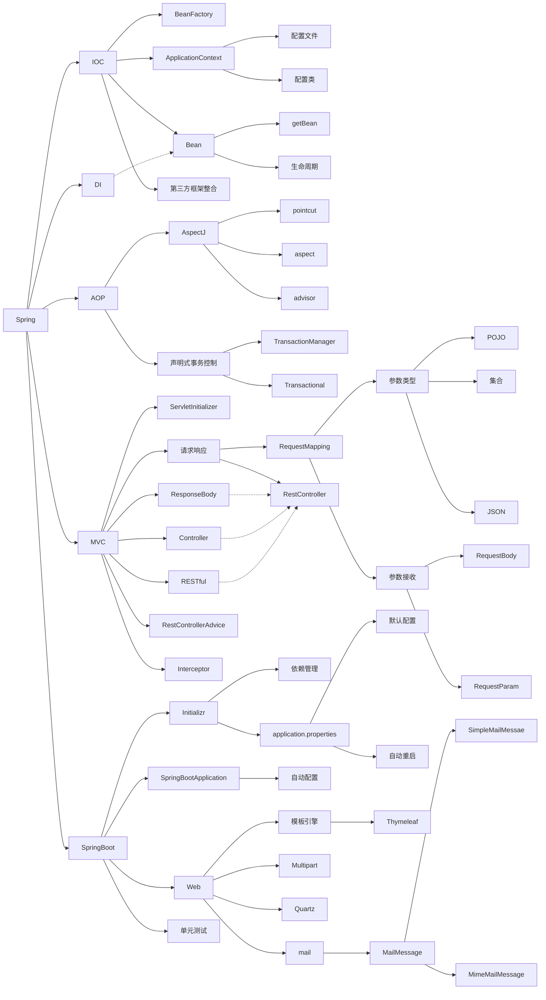
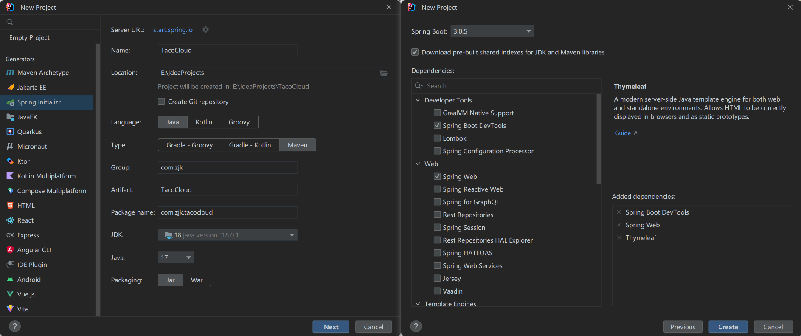
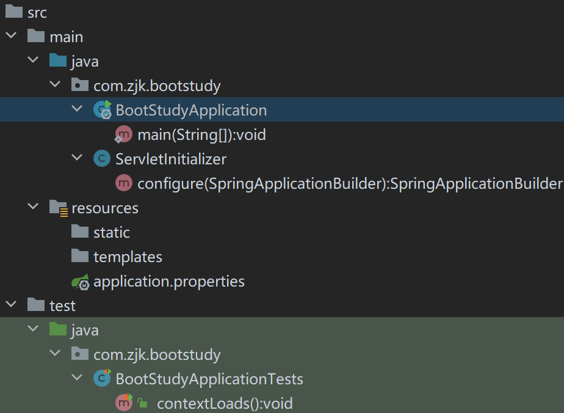
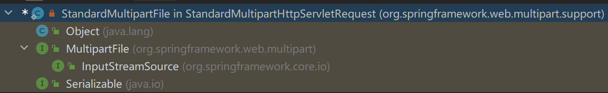
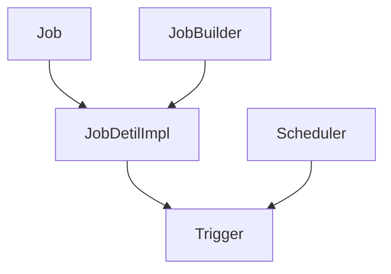
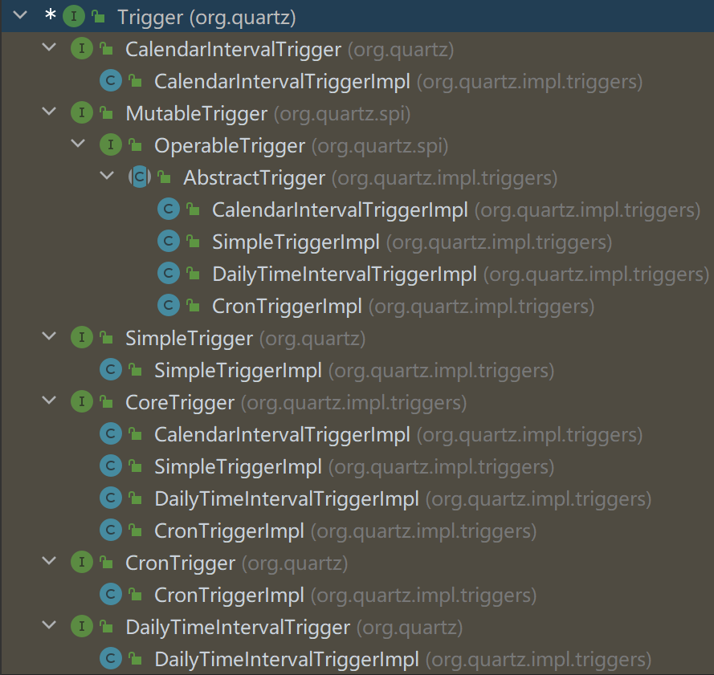
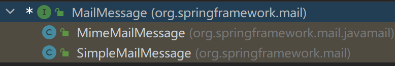
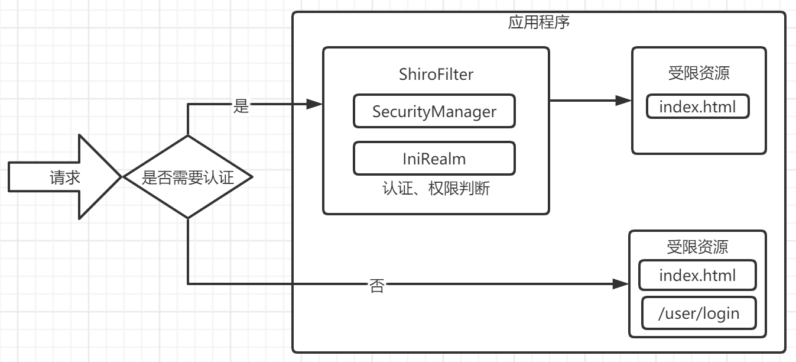

# Spring Boot

## Initializr

  


- `@SpringBootApplication` SpringBoot启动类：默认所在包为扫描路径。

- `/static`
- `/templates`
- application.properties

  

### Starter 依赖管理

- Starter：Spring对依赖包的集中描述。

```xml
spring-boot-starter
```

### SpringBoot参数设置

- /resources/application.properties：SpringBoot启动类默认读取该配置文件。 
- 直接在文件修改 或者 `System.setProperty();`

#### 默认配置 DevToolsPropertyDefaultsPostProcessor

```java
spring.devtools.addproperties=false //关闭默认配置
```

```java
package org.springframework.boot.devtools.env;

@Order(Integer.MAX_VALUE)
public class DevToolsPropertyDefaultsPostProcessor implements EnvironmentPostProcessor {
    private static final Log logger = DevToolsLogFactory.getLog(DevToolsPropertyDefaultsPostProcessor.class);
    private static final String ENABLED = "spring.devtools.add-properties";
    private static final String WEB_LOGGING = "logging.level.web";
    private static final String[] WEB_ENVIRONMENT_CLASSES = new String[]{"org.springframework.web.context.ConfigurableWebEnvironment", "org.springframework.boot.web.reactive.context.ConfigurableReactiveWebEnvironment"};
    private static final Map<String, Object> PROPERTIES;

    public DevToolsPropertyDefaultsPostProcessor() {
    }

    public void postProcessEnvironment(ConfigurableEnvironment environment, SpringApplication application) {
        if (DevToolsEnablementDeducer.shouldEnable(Thread.currentThread()) && this.isLocalApplication(environment)) {
            if (this.canAddProperties(environment)) {
                logger.info(LogMessage.format("Devtools property defaults active! Set '%s' to 'false' to disable", "spring.devtools.add-properties"));
                environment.getPropertySources().addLast(new MapPropertySource("devtools", PROPERTIES));
            }

            if (this.isWebApplication(environment) && !environment.containsProperty("logging.level.web")) {
                logger.info(LogMessage.format("For additional web related logging consider setting the '%s' property to 'DEBUG'", "logging.level.web"));
            }
        }

    }

    private boolean isLocalApplication(ConfigurableEnvironment environment) {
        return environment.getPropertySources().get("remoteUrl") == null;
    }

    private boolean canAddProperties(Environment environment) {
        if (!(Boolean)environment.getProperty("spring.devtools.add-properties", Boolean.class, true)) {
            return false;
        } else {
            return this.isRestarterInitialized() || this.isRemoteRestartEnabled(environment);
        }
    }

    private boolean isRestarterInitialized() {
        try {
            Restarter restarter = Restarter.getInstance();
            return restarter != null && restarter.getInitialUrls() != null;
        } catch (Exception var2) {
            return false;
        }
    }

    private boolean isRemoteRestartEnabled(Environment environment) {
        return environment.containsProperty("spring.devtools.remote.secret");
    }

    private boolean isWebApplication(Environment environment) {
        String[] var2 = WEB_ENVIRONMENT_CLASSES;
        int var3 = var2.length;

        for(int var4 = 0; var4 < var3; ++var4) {
            String candidate = var2[var4];
            Class<?> environmentClass = this.resolveClassName(candidate, environment.getClass().getClassLoader());
            if (environmentClass != null && environmentClass.isInstance(environment)) {
                return true;
            }
        }

        return false;
    }

    private Class<?> resolveClassName(String candidate, ClassLoader classLoader) {
        try {
            return ClassUtils.resolveClassName(candidate, classLoader);
        } catch (IllegalArgumentException var4) {
            return null;
        }
    }

    private static Map<String, Object> loadDefaultProperties() {
        Properties properties = new Properties();

        try {
            InputStream stream = DevToolsPropertyDefaultsPostProcessor.class.getResourceAsStream("devtools-property-defaults.properties");

            try {
                if (stream == null) {
                    throw new RuntimeException("Failed to load devtools-property-defaults.properties because it doesn't exist");
                }

                properties.load(stream);
            } catch (Throwable var5) {
                if (stream != null) {
                    try {
                        stream.close();
                    } catch (Throwable var4) {
                        var5.addSuppressed(var4);
                    }
                }

                throw var5;
            }

            if (stream != null) {
                stream.close();
            }
        } catch (IOException var6) {
            throw new RuntimeException("Failed to load devtools-property-defaults.properties", var6);
        }

        Map<String, Object> map = new HashMap();
        Iterator var2 = properties.stringPropertyNames().iterator();

        while(var2.hasNext()) {
            String name = (String)var2.next();
            map.put(name, properties.getProperty(name));
        }

        return Collections.unmodifiableMap(map);
    }

    static {
        if (NativeDetector.inNativeImage()) {
            PROPERTIES = Collections.emptyMap();
        } else {
            PROPERTIES = loadDefaultProperties();
        }

    }
}
```

#### 自动重启

- spring-boot-devtools监听文件状态：代码修改后项目自动重启。

##### 重启加载项

- Spring Boot通过两个类加载器：base和restart实现快速重启。

| 类加载器 | 属性            | 作用                                                         |
| -------- | --------------- | ------------------------------------------------------------ |
| base     | restart.exclude | 加载不发生变化的字节码文件                                   |
| restart  | restart.include | 加载开发中的字节码文件<br />在触发重启后：restart类加载器实例及其加载的内容都会被丢弃，并重新创建一个restart类加载器实例 |

- 默认情况下：IDEA中打开的开发项目中所有的代码都会被restart类加载加载。

##### 参数设置

| 参数                                                        | 说明                                                         |
| ----------------------------------------------------------- | ------------------------------------------------------------ |
| spring.devtools.restart.log-condition-evaluationdelta=false | 禁用condition evaluation日志                                 |
| spring.devtools.restart.additional-paths=目录               | 指定触发自动重启的目录<br>默认监控classpath除静态目录之外的文件的变化 |
| spring.devtools.restart.exclude=剔除的目录                  | 修改默认不触发重启目录配置                                   |
| spring.devtools.restart.enabled=false                       | 禁用自动重启                                                 |
| spring.devtools.restart.trigger-file=类路径文件             | 指定触发器文件<br>当设置了触发器文件后：只有该触发器文件被修改才会导致重启。 |

## @SpringBootApplication

- `@SpringBootApplication` SpringBoot启动类。

```java
@SpringBootApplication
public class BootStudyApplication {

    public static void main(String[] args) {
        //启动相应的SpringBoot容器，在之前可以对容器进行一系列的设置
        SpringApplication.run(BootStudyApplication.class, args);
    }
}
```

| 内含注解                 | 说明             |
| ------------------------ | ---------------- |
| @EnableAutoConfiguration | 自动配置         |
| @SpringBootConfiguration | SpringBoot配置类 |
| @ComponentScan           | 组件扫描         |

```java
@Target({ElementType.TYPE})
@Retention(RetentionPolicy.RUNTIME)
@Documented
@Inherited
@SpringBootConfiguration //SpringBoot配置类
@EnableAutoConfiguration //自动配置
@ComponentScan( //组件扫描
    excludeFilters = {@Filter(
    type = FilterType.CUSTOM,
    classes = {TypeExcludeFilter.class}
), @Filter(
    type = FilterType.CUSTOM,
    classes = {AutoConfigurationExcludeFilter.class}
)}
)
public @interface SpringBootApplication {
    @AliasFor(
        annotation = EnableAutoConfiguration.class
    )
    Class<?>[] exclude() default {};

    @AliasFor(
        annotation = EnableAutoConfiguration.class
    )
    String[] excludeName() default {};

    @AliasFor(
        annotation = ComponentScan.class,
        attribute = "basePackages"
    )
    String[] scanBasePackages() default {};

    @AliasFor(
        annotation = ComponentScan.class,
        attribute = "basePackageClasses"
    )
    Class<?>[] scanBasePackageClasses() default {};

    @AliasFor(
        annotation = ComponentScan.class,
        attribute = "nameGenerator"
    )
    Class<? extends BeanNameGenerator> nameGenerator() default BeanNameGenerator.class;

    @AliasFor(
        annotation = Configuration.class
    )
    boolean proxyBeanMethods() default true;
}
```

### 自动配置

- @EnableAutoConfiguration 和@SpringBootApplication

```java
CONDITIONS EVALUATION REPORT  //debug
Positive matches:  //生效的自动配置
Negative matches:  //不生效的自动配置
Exclusions:        //指定不生效的自动配置
Unconditional classes: //无条件生效的自动配置
```

**指定不生效的自动配置**

```java
@SpringBootApplication(exclude = MultipartAutoConfiguration.class)
public class BootStudyApplication {}

Exclusions:
-----------
    org.springframework.boot.autoconfigure.web.servlet.MultipartAutoConfiguration
```

## Model

### 数据传递

- Model主要用于将数据传递给视图层，以便在视图中渲染数据。

- 在 Spring MVC 中，Controller 控制器将数据存储在 Model（或者 Map）对象中，再将视图名称和 Model 对象返回给 DispatcherServlet（派发器），DispatcherServlet 根据视图名称找到对应的视图（View），并将 Model 对象传递给它。(具体来说，可以通过在方法的参数中声明一个 Model（或者 Map）类型的变量，然后在方法中通过该变量来存储数据)

### Model 和 Map

-  Model 接口的实现类：在 Spring MVC 中，默认使用的是 ExtendedModelMap，该类继承了 LinkedHashMap，因此与 Map 方法类似，Model 可以用于存储和检索数据。

```java
@GetMapping("/thymeleafHello")
public String hello(Model model){
    model.addAttribute("name","张三");
    model.addAttribute("age",18);
    return "thymeleafHello";
}
```

```java
public interface Model {
    Model addAttribute(String attributeName, @Nullable Object attributeValue);

    Model addAttribute(Object attributeValue);

    Model addAllAttributes(Collection<?> attributeValues);

    Model addAllAttributes(Map<String, ?> attributes);

    Model mergeAttributes(Map<String, ?> attributes);

    boolean containsAttribute(String attributeName);

    @Nullable
    Object getAttribute(String attributeName);

    Map<String, Object> asMap();
}
```

## 模板引擎

### Thymeleaf

#### Thymeleaf 视图模板技术

- Thymeleaf是适用于Web和独立环境的现代服务器端Java模板引擎
- 默认/classpath:/templates（src/main/resources/tempaltes）目录下的.htm文件被识别为模板文件，由模板引擎解析。
- Thymeleaf的应该使用@Controller注解，不能带有@ResponseBody。由Controller方法的返回值进行页面跳转。

#### 表达式

| EL表达式 | 名称                                       |
| -------- | ------------------------------------------ |
| `@{}`    | 链接表达式                                 |
| `${}`    | 变量表达式：对整个上下文                   |
| `*{}`    | 选择变量表达式：对选定对象                 |
| `#{}`    | 消息表达（文本外部化）：读取配置文件中数据 |

```html
<!--@{}链接表达式-->
<link rel="stylesheet" th:href="@{index.css}">
<script type="text/javascript" th:src="@{index.js}"></script>
<a th:href="@{index.html}">url</a>
```

```html
<!--${}变量表达式-->

<!--普通字符串-->
<p th:text="${name}"></p>
<!--POJO类型 person(name,age)-->
<p th:text="${person.name}"></p>
<p th:text="${person['name']}"></p>
<p th:text="${person.getName()}"></p>

<!--List-->
<tr th:each="item:${userlist}">
    <td th:text="${item}"></td>
</tr>

<!--Map取值-->
<td th:text="${map.place}"></td>
<td th:text="${map.['place']}"></td>
<td th:text="${map.get('place')}"></td>

<!--Map遍历-->
<tr th:each="item:${map}">
    <td th:text="${item.key}"></td>
    <td th:text="${item.value}"></td>
</tr>
```

```html
<!--*{}选择变量表达式-->
<div th:object="${user}">
    <p>Name: <span th:text="*{name}">赛</span>.</p>
    <p>Age: <span th:text="*{age}">18</span>.</p>
    <p>Detail: <span th:text="*{detail}">好好学习</span>.</p>
</div>
```

```
首先在templates目录下建立home.properties中写入以下内容：

bigsai.nane=bigsai
bigsai.age=22
province=Jiang Su
在application.properties中加入以下内容：

spring.messages.basename=templates/home
这样我们就可以在Thymeleaf中读取配置的文件了，完整代码如下：

<h2>消息表达</h2>
<table bgcolor="#ffe4c4" border="1">
    <tr>
    <td>name</td>
    <td th:text="#{bigsai.name}"></td>
    </tr>
    <tr>
    <td>年龄</td>
    <td th:text="#{bigsai.age}"></td>
    </tr>
    <tr>
    <td>province</td>
    <td th:text="#{province}"></td>
    </tr>
</table>
```

#### 常用标签

| 标签               | 作用               |
| :----------------- | :----------------- |
| th:id              | 替换id             |
| th:text            | 文本替换           |
| th:utext           | 支持html的文本替换 |
| th:src             | 替换资源           |
| th:href            | 替换超链接         |
| th:object          | 替换对象           |
| th:value           | 替换值             |
| th:if<br>th:unless | 判断               |
| th:each            | 循环               |

##### th:each

- th:each所在标签的内部都会被循环

```html
<!--List循环-->
<td th:each="user:${userList}" th:text="${user}"></td>

<!--Map循环-->
<table>
    <tr th:each="person:${personMapper}">
        <td th:text="${person.key}"></td>
        <td th:text="${person.value}"></td>
    </tr>
</table>
```

## Multipart 文件上传

### MultipartProperties 参数设置

- MultipartAutoConfiguration中自动文件上传的自动配置：Spring MVC默认开启。

- 文件上传参数：MultipartProperties。

```properties
spring.servlet.multipart.enabled=true
spring.servlet.multipart.file-size-threshold=0B
spring.servlet.multipart.location=
spring.servlet.multipart.max-file-size=1MB
spring.servlet.multipart.max-request-size=10MB
spring.servlet.multipart.resolve-lazily=false
```

```java
public class MultipartProperties {
    private boolean enabled = true; //是否开启分段上传
    private String location; //上传文件的临时目录
    private DataSize maxFileSize = DataSize.ofMegabytes(1L); //上传文件最大大小
    private DataSize maxRequestSize = DataSize.ofMegabytes(10L); //文件请求最大大小
    private DataSize fileSizeThreshold = DataSize.ofBytes(0L); //文件写入磁盘的阈值
    private boolean resolveLazily = false; //是否在文件或产生访问时延迟解析大部分请求

    public MultipartProperties() {
    }

    public boolean getEnabled() {
        return this.enabled;
    }

    public void setEnabled(boolean enabled) {
        this.enabled = enabled;
    }

    public String getLocation() {
        return this.location;
    }

    public void setLocation(String location) {
        this.location = location;
    }

    public DataSize getMaxFileSize() {
        return this.maxFileSize;
    }

    public void setMaxFileSize(DataSize maxFileSize) {
        this.maxFileSize = maxFileSize;
    }

    public DataSize getMaxRequestSize() {
        return this.maxRequestSize;
    }

    public void setMaxRequestSize(DataSize maxRequestSize) {
        this.maxRequestSize = maxRequestSize;
    }

    public DataSize getFileSizeThreshold() {
        return this.fileSizeThreshold;
    }

    public void setFileSizeThreshold(DataSize fileSizeThreshold) {
        this.fileSizeThreshold = fileSizeThreshold;
    }

    public boolean isResolveLazily() {
        return this.resolveLazily;
    }

    public void setResolveLazily(boolean resolveLazily) {
        this.resolveLazily = resolveLazily;
    }

    public MultipartConfigElement createMultipartConfig() {
        MultipartConfigFactory factory = new MultipartConfigFactory();
        PropertyMapper map = PropertyMapper.get().alwaysApplyingWhenNonNull();
        PropertyMapper.Source var10000 = map.from(this.fileSizeThreshold);
        Objects.requireNonNull(factory);
        var10000.to(factory::setFileSizeThreshold);
        var10000 = map.from(this.location).whenHasText();
        Objects.requireNonNull(factory);
        var10000.to(factory::setLocation);
        var10000 = map.from(this.maxRequestSize);
        Objects.requireNonNull(factory);
        var10000.to(factory::setMaxRequestSize);
        var10000 = map.from(this.maxFileSize);
        Objects.requireNonNull(factory);
        var10000.to(factory::setMaxFileSize);
        return factory.createMultipartConfig();
    }
}
```

### 文件上传处理 MultipartFile

- 表单提交

```html
<form method="post" action="/ upload" enctype="multipart/form-data">
    <input type="file" name="file">
    <br>
    <input type="submit" value="提交">
</form>
```

- Controller

```java
@RestController
@RequestMapping("/upload")
public class UploadController {
    @Value("${save.path}")
    String savePath; //save.path=E:\\files
    //注意保存的路径中使用 \\或/ 否则：InvalidPathException路径异常

    @PostMapping
    public String upload(@RequestParam("file") MultipartFile file) throws IOException {
        //重命名当前文件 file.getOriginalFilename()-->return this.filename;
        String fileSaveName = System.currentTimeMillis() + "-" + file.getOriginalFilename(); 
        //文件保存路径
        Path saveTo = Paths.get(savePath, fileSaveName);
        //写入文件
        Files.write(saveTo, file.getBytes());
        return fileSaveName + ", 上传成功";
    }
}
```

```java
@PostMapping
public String upload(@RequestParam("file") MultipartFile file) throws IOException {
    Resource resource = new FileUrlResource("E:/files");
    File dest = new File(resource.getFile(), file.getOriginalFilename());
    file.transferTo(dest);
    return  "上传成功";
}
```

#### MultipartFile

- 由StandardMultipartHttpServletRequest的内部类：StandardMultipartFile实现。

 

```java
public interface MultipartFile extends InputStreamSource {
    String getName();

    @Nullable
    String getOriginalFilename(); //获取当前文件名称

    @Nullable
    String getContentType(); //返回上传文件的类型
    //图像文件类型：image/jpeg、image/png
    //文本文件类型：text/plain

    boolean isEmpty();

    long getSize();

    byte[] getBytes() throws IOException;

    InputStream getInputStream() throws IOException;

    default Resource getResource() {
        return new MultipartFileResource(this);
        //根据指定的资源路径获取对应的Resource对象
    }

    void transferTo(File dest) throws IOException, IllegalStateException;
    //将上传的文件直接保存（覆盖）到指定的目的地文件，自动处理文件上传过程中的所有细节

    default void transferTo(Path dest) throws IOException, IllegalStateException {
        FileCopyUtils.copy(this.getInputStream(), Files.newOutputStream(dest));
    }
}
```

```java
private static class StandardMultipartFile implements MultipartFile, Serializable {
    private final Part part;
    private final String filename;

    public StandardMultipartFile(Part part, String filename) {
        this.part = part;
        this.filename = filename;
    }

    public String getName() {
        return this.part.getName();
    }

    public String getOriginalFilename() {
        return this.filename;
    }

    public String getContentType() {
        return this.part.getContentType();
    }

    public boolean isEmpty() {
        return this.part.getSize() == 0L;
    }

    public long getSize() {
        return this.part.getSize();
    }

    public byte[] getBytes() throws IOException {
        return FileCopyUtils.copyToByteArray(this.part.getInputStream());
    }

    public InputStream getInputStream() throws IOException {
        return this.part.getInputStream();
    }

    public void transferTo(File dest) throws IOException, IllegalStateException {
        this.part.write(dest.getPath());
        if (dest.isAbsolute() && !dest.exists()) {
            FileCopyUtils.copy(this.part.getInputStream(), Files.newOutputStream(dest.toPath()));
        }

    }

    public void transferTo(Path dest) throws IOException, IllegalStateException {
        FileCopyUtils.copy(this.part.getInputStream(), Files.newOutputStream(dest));
    }
}
```

## Quartz 任务调度

- QuartzAutoConfiguration开启Quartz的自动配置。
- Starter：spring-boot-starter-quartz

### QuartzProperties 参数设置

| 参数                                               | 默认值                                                       | 说明                                                         |
| -------------------------------------------------- | ------------------------------------------------------------ | ------------------------------------------------------------ |
| spring.quartz.auto-startup                         | true                                                         | 初始化之后是否启动调度器                                     |
| spring.quartz.jdbc.comment-prefix                  | `[#,--]`                                                     | 初始化sql脚本中的单行注释符号                                |
| spring.quartz.jdbc.initialize-schema               | embedded                                                     | 启动时进行存储初始<br>默认只在使用内存数据库时在启动时进行初始化 |
| spring.quartz.jdbc.schema                          | `classpath:org/quartz/impl/jdbcjobstore/tables_@@platform@@.sql` | 初始化数据库的SQL文件路径                                    |
| spring.quartz.job-store-type                       | memory                                                       | Quartz job存储类型：<br>mempry内存存储<br>jdbc数据库存储     |
| spring.quartz.overwrtite-existing-jobs             | false                                                        | 由配置文件创建的任务是否覆盖持久化存储中定义的任务           |
| spring.quartz.properties.*                         |                                                              | Quartz定时器的其他属性                                       |
| spring.quartz.sheduler-name                        | quartzScheduler                                              | 调度器在容器中的name                                         |
| spring.quartz.startup-delay                        | 0s                                                           | 初始化之后，调度程序启动的延时                               |
| spring.quartz.wait-for-jobs-to-comlete-on-shutdown | false                                                        | 在关闭程序时是否等待正在运行任务执行完成                     |

```java
@ConfigurationProperties("spring.quartz")
public class QuartzProperties {
    private JobStoreType jobStoreType; //Quartz job存储类型：mempry内存存储/jdbc数据库存储
    private String schedulerName; //调度器在容器中的name
    private boolean autoStartup; //初始化之后是否启动调度器
    private Duration startupDelay; //初始化之后，调度程序启动的延时
    private boolean waitForJobsToCompleteOnShutdown; //在关闭程序时是否等待正在运行任务执行完成
    private boolean overwriteExistingJobs; //由配置文件创建的任务是否覆盖持久化存储中定义的任务
    private final Map<String, String> properties; //Quartz定时器的其他属性
    private final Jdbc jdbc;

    public QuartzProperties() {
        this.jobStoreType = JobStoreType.MEMORY;
        this.autoStartup = true;
        this.startupDelay = Duration.ofSeconds(0L);
        this.waitForJobsToCompleteOnShutdown = false;
        this.overwriteExistingJobs = false;
        this.properties = new HashMap();
        this.jdbc = new Jdbc();
    }

    public JobStoreType getJobStoreType() {
        return this.jobStoreType;
    }

    public void setJobStoreType(JobStoreType jobStoreType) {
        this.jobStoreType = jobStoreType;
    }

    public String getSchedulerName() {
        return this.schedulerName;
    }

    public void setSchedulerName(String schedulerName) {
        this.schedulerName = schedulerName;
    }

    public boolean isAutoStartup() {
        return this.autoStartup;
    }

    public void setAutoStartup(boolean autoStartup) {
        this.autoStartup = autoStartup;
    }

    public Duration getStartupDelay() {
        return this.startupDelay;
    }

    public void setStartupDelay(Duration startupDelay) {
        this.startupDelay = startupDelay;
    }

    public boolean isWaitForJobsToCompleteOnShutdown() {
        return this.waitForJobsToCompleteOnShutdown;
    }

    public void setWaitForJobsToCompleteOnShutdown(boolean waitForJobsToCompleteOnShutdown) {
        this.waitForJobsToCompleteOnShutdown = waitForJobsToCompleteOnShutdown;
    }

    public boolean isOverwriteExistingJobs() {
        return this.overwriteExistingJobs;
    }

    public void setOverwriteExistingJobs(boolean overwriteExistingJobs) {
        this.overwriteExistingJobs = overwriteExistingJobs;
    }

    public Map<String, String> getProperties() {
        return this.properties;
    }

    public Jdbc getJdbc() {
        return this.jdbc;
    }

    public static class Jdbc {
        private static final String DEFAULT_SCHEMA_LOCATION = "classpath:org/quartz/impl/jdbcjobstore/tables_@@platform@@.sql";
        private String schema = "classpath:org/quartz/impl/jdbcjobstore/tables_@@platform@@.sql";
        private String platform;
        private DatabaseInitializationMode initializeSchema;
        private List<String> commentPrefix;

        public Jdbc() {
            this.initializeSchema = DatabaseInitializationMode.EMBEDDED;
            this.commentPrefix = new ArrayList(Arrays.asList("#", "--"));
        }

        public String getSchema() {
            return this.schema;
        }

        public void setSchema(String schema) {
            this.schema = schema;
        }

        public String getPlatform() {
            return this.platform;
        }

        public void setPlatform(String platform) {
            this.platform = platform;
        }

        public DatabaseInitializationMode getInitializeSchema() {
            return this.initializeSchema;
        }

        public void setInitializeSchema(DatabaseInitializationMode initializeSchema) {
            this.initializeSchema = initializeSchema;
        }

        public List<String> getCommentPrefix() {
            return this.commentPrefix;
        }

        public void setCommentPrefix(List<String> commentPrefix) {
            this.commentPrefix = commentPrefix;
        }
    }
}
```

### 任务调度



```java
public class MyJob extends QuartzJobBean {
    @Override
    protected void executeInternal(JobExecutionContext context) throws JobExecutionException {
        System.out.println("MyJob:" + new Date());
    }
}
```

```java
@Configuration
public class QuartzConfig {
    @Bean
    public JobDetail printTimeJobDetail() {
        return JobBuilder.newJob(MyJob.class)
                .withIdentity("MyJobDetail")
                .storeDurably()
                .build();
    }

    @Bean
    public Trigger printTimeJobTrigger() {
        CronScheduleBuilder cronScheduleBuilder = CronScheduleBuilder.cronSchedule("0/1 * * * * ?");
        return (Trigger) TriggerBuilder.newTrigger()
                .forJob("MyJobDetail")
                .withIdentity("quartzTaskService")
                .withSchedule(cronScheduleBuilder)
                .build();
    }
}
```

#### Job 任务

##### Job 工作类接口

- jobClass属性中的工作类，具体实现工作任务操作的类。

```java
public interface Job {
    void execute(JobExecutionContext var1) throws JobExecutionException;
}
```

###### QuartzJobBean

- 实现了Job接口的抽象类，继承QuartzJobBean的类更加方便。

```java
public abstract class QuartzJobBean implements Job {
    public QuartzJobBean() {
    }

    public final void execute(JobExecutionContext context) throws JobExecutionException {
        try {
            BeanWrapper bw = PropertyAccessorFactory.forBeanPropertyAccess(this);
            MutablePropertyValues pvs = new MutablePropertyValues();
            pvs.addPropertyValues(context.getScheduler().getContext());
            pvs.addPropertyValues(context.getMergedJobDataMap());
            bw.setPropertyValues(pvs, true);
        } catch (SchedulerException var4) {
            throw new JobExecutionException(var4);
        }

        this.executeInternal(context);
    }

    protected abstract void executeInternal(JobExecutionContext context) throws JobExecutionException;
}
```

##### JobDetailImpl

- JobBuilder实际创建的任务实例。

```java
public class JobDetailImpl implements Cloneable, Serializable, JobDetail {
    private static final long serialVersionUID = -6069784757781506897L; //序列化ID
    private String name; //作业名称
    private String group; //作业的组名
    private String description; //描述信息
    private Class<? extends Job> jobClass; //作业类的类型,用于标识Quartz中需要调度的作业实现类
    //实现了Job接口的类且有无参构造器。
    //当调度器开始执行任务时，Quartz框架会实例化这个类，然后调用execute方法执行任务具体的逻辑。
    private JobDataMap jobDataMap; //作业数据容器 Map<String, Object>
    //存储一些任务的上下文数据，可以在任务执行时被获取并使用。
    private boolean durability; //作业的持久化标识
    //如果为true，则表示即使没有Trigger关联的Job，作业也应该被保留。
    private boolean shouldRecover; //作业是否应该被恢复
    //如果为true，则在Quartz实例被重新启动时，尝试恢复丢失的Triggers。
    private transient JobKey key;//由作业名称name和作业组名group组成，唯一标识Job任务实例
    //JobKey jobKey = new JobKey("job1", "group1");

    public JobDetailImpl() {
        this.group = "DEFAULT";
        this.durability = false;
        this.shouldRecover = false;
        this.key = null;
    }

    /** @deprecated */
    public JobDetailImpl(String name, Class<? extends Job> jobClass) {
        this(name, (String)null, jobClass);
    }

    /** @deprecated */
    public JobDetailImpl(String name, String group, Class<? extends Job> jobClass) {
        this.group = "DEFAULT";
        this.durability = false;
        this.shouldRecover = false;
        this.key = null;
        this.setName(name);
        this.setGroup(group);
        this.setJobClass(jobClass);
    }

    /** @deprecated */
    public JobDetailImpl(String name, String group, Class<? extends Job> jobClass, boolean durability, boolean recover) {
        this.group = "DEFAULT";
        this.durability = false;
        this.shouldRecover = false;
        this.key = null;
        this.setName(name);
        this.setGroup(group);
        this.setJobClass(jobClass);
        this.setDurability(durability);
        this.setRequestsRecovery(recover);
    }

    public String getName() {
        return this.name;
    }

    public void setName(String name) {
        if (name != null && name.trim().length() != 0) {
            this.name = name;
            this.key = null;
        } else {
            throw new IllegalArgumentException("Job name cannot be empty.");
        }
    }

    public String getGroup() {
        return this.group;
    }

    public void setGroup(String group) {
        if (group != null && group.trim().length() == 0) {
            throw new IllegalArgumentException("Group name cannot be empty.");
        } else {
            if (group == null) {
                group = "DEFAULT";
            }

            this.group = group;
            this.key = null;
        }
    }

    public String getFullName() {
        return this.group + "." + this.name;
    }

    public JobKey getKey() {
        if (this.key == null) {
            if (this.getName() == null) {
                return null;
            }

            this.key = new JobKey(this.getName(), this.getGroup());
        }

        return this.key;
    }

    public void setKey(JobKey key) {
        if (key == null) {
            throw new IllegalArgumentException("Key cannot be null!");
        } else {
            this.setName(key.getName());
            this.setGroup(key.getGroup());
            this.key = key;
        }
    }

    public String getDescription() {
        return this.description;
    }

    public void setDescription(String description) {
        this.description = description;
    }

    public Class<? extends Job> getJobClass() {
        return this.jobClass;
    }

    public void setJobClass(Class<? extends Job> jobClass) {
        if (jobClass == null) {
            throw new IllegalArgumentException("Job class cannot be null.");
        } else if (!Job.class.isAssignableFrom(jobClass)) {
            throw new IllegalArgumentException("Job class must implement the Job interface.");
        } else {
            this.jobClass = jobClass;
        }
    }

    public JobDataMap getJobDataMap() {
        if (this.jobDataMap == null) {
            this.jobDataMap = new JobDataMap();
        }

        return this.jobDataMap;
    }

    public void setJobDataMap(JobDataMap jobDataMap) {
        this.jobDataMap = jobDataMap;
    }

    public void setDurability(boolean durability) {
        this.durability = durability;
    }

    public void setRequestsRecovery(boolean shouldRecover) {
        this.shouldRecover = shouldRecover;
    }

    public boolean isDurable() {
        return this.durability;
    }

    public boolean isPersistJobDataAfterExecution() {
        return ClassUtils.isAnnotationPresent(this.jobClass, PersistJobDataAfterExecution.class);
    }

    public boolean isConcurrentExectionDisallowed() {
        return ClassUtils.isAnnotationPresent(this.jobClass, DisallowConcurrentExecution.class);
    }

    public boolean requestsRecovery() {
        return this.shouldRecover;
    }

    public String toString() {
        return "JobDetail '" + this.getFullName() + "':  jobClass: '" + (this.getJobClass() == null ? null : this.getJobClass().getName()) + " concurrentExectionDisallowed: " + this.isConcurrentExectionDisallowed() + " persistJobDataAfterExecution: " + this.isPersistJobDataAfterExecution() + " isDurable: " + this.isDurable() + " requestsRecovers: " + this.requestsRecovery();
    }

    public boolean equals(Object obj) {
        if (!(obj instanceof JobDetail)) {
            return false;
        } else {
            JobDetail other = (JobDetail)obj;
            if (other.getKey() != null && this.getKey() != null) {
                return other.getKey().equals(this.getKey());
            } else {
                return false;
            }
        }
    }

    public int hashCode() {
        JobKey key = this.getKey();
        return key == null ? 0 : this.getKey().hashCode();
    }

    public Object clone() {
        try {
            JobDetailImpl copy = (JobDetailImpl)super.clone();
            if (this.jobDataMap != null) {
                copy.jobDataMap = (JobDataMap)this.jobDataMap.clone();
            }

            return copy;
        } catch (CloneNotSupportedException var3) {
            throw new IncompatibleClassChangeError("Not Cloneable.");
        }
    }

    public JobBuilder getJobBuilder() {
        JobBuilder b = JobBuilder.newJob().ofType(this.getJobClass()).requestRecovery(this.requestsRecovery()).storeDurably(this.isDurable()).usingJobData(this.getJobDataMap()).withDescription(this.getDescription()).withIdentity(this.getKey());
        return b;
    }
}
```

##### JobBulider

- 工厂类：创建JobDetail对象。

```java
public JobDetail printTimeJobDetail(){
    return JobBuilder.newJob(MyJob.class)
        .withIdentity("myJob1","group1")
        .storeDurably()
        .build();
}
```

```java
public class JobBuilder {
    private JobKey key; // withIdentity()
    private String description; //withDescription()
    private Class<? extends Job> jobClass; //newJob(Class<? extends Job> jobClass)
    private boolean durability; //storeDurably()
    private boolean shouldRecover; //requestRecovery()
    private JobDataMap jobDataMap = new JobDataMap(); 

    protected JobBuilder() {
    }

    public static JobBuilder newJob() {
        return new JobBuilder();
    }

    public static JobBuilder newJob(Class<? extends Job> jobClass) {
        JobBuilder b = new JobBuilder();
        b.ofType(jobClass);
        return b;
    }

    //创建任务实例：JobDetailImpl
    public JobDetail build() {
        JobDetailImpl job = new JobDetailImpl();
        job.setJobClass(this.jobClass);
        job.setDescription(this.description);
        if (this.key == null) {
            this.key = new JobKey(Key.createUniqueName((String)null), (String)null);
        }

        job.setKey(this.key);
        job.setDurability(this.durability);
        job.setRequestsRecovery(this.shouldRecover);
        if (!this.jobDataMap.isEmpty()) {
            job.setJobDataMap(this.jobDataMap);
        }

        return job;
    }

    //设置JobDetail的JobKey
    public JobBuilder withIdentity(String name) {
        this.key = new JobKey(name, (String)null);
        return this;
    }

    public JobBuilder withIdentity(String name, String group) {
        this.key = new JobKey(name, group);
        return this;
    }

    public JobBuilder withIdentity(JobKey jobKey) {
        this.key = jobKey;
        return this;
    }

    //设置任务的描述信息
    public JobBuilder withDescription(String jobDescription) {
        this.description = jobDescription;
        return this;
    }

    public JobBuilder ofType(Class<? extends Job> jobClazz) {
        this.jobClass = jobClazz;
        return this;
    }

    public JobBuilder requestRecovery() {
        this.shouldRecover = true;
        return this;
    }

    public JobBuilder requestRecovery(boolean jobShouldRecover) {
        this.shouldRecover = jobShouldRecover;
        return this;
    }

    //
    public JobBuilder storeDurably() {
        return this.storeDurably(true);
    }

    public JobBuilder storeDurably(boolean jobDurability) {
        this.durability = jobDurability;
        return this;
    }

    public JobBuilder usingJobData(String dataKey, String value) {
        this.jobDataMap.put(dataKey, value);
        return this;
    }

    public JobBuilder usingJobData(String dataKey, Integer value) {
        this.jobDataMap.put(dataKey, value);
        return this;
    }

    public JobBuilder usingJobData(String dataKey, Long value) {
        this.jobDataMap.put(dataKey, value);
        return this;
    }

    public JobBuilder usingJobData(String dataKey, Float value) {
        this.jobDataMap.put(dataKey, value);
        return this;
    }

    public JobBuilder usingJobData(String dataKey, Double value) {
        this.jobDataMap.put(dataKey, value);
        return this;
    }

    public JobBuilder usingJobData(String dataKey, Boolean value) {
        this.jobDataMap.put(dataKey, value);
        return this;
    }

    public JobBuilder usingJobData(JobDataMap newJobDataMap) {
        this.jobDataMap.putAll(newJobDataMap);
        return this;
    }

    public JobBuilder setJobData(JobDataMap newJobDataMap) {
        this.jobDataMap = newJobDataMap;
        return this;
    }
}
```

#### Scheduler 调度器

- 整合Job和Trigger。

##### SchedulerBuilder

| 子类                             | 说明                                                         |
| -------------------------------- | ------------------------------------------------------------ |
| SimpleScheduleBuilder            | 用来构建简单的定时任务规则，可以设置任务的执行间隔时间和重复执行次数。 |
| CronScheduleBuilder              | 用来构建Cron表达式的定时任务规则，可以精确指定任务的执行时间和重复执行规则。 |
| CalendarIntervalScheduleBuilder  | 用来构建基于日历的定时任务规则，可以设置任务的执行间隔时间，以及基于指定的日程表进行精确的任务执行。 |
| DailyTimeIntervalScheduleBuilder | 用来构建每日定时任务规则，可以指定任务的执行时间的起始时间和终止时间，以及任务的执行间隔时间和重复执行次数。 |

```java
public abstract class ScheduleBuilder<T extends Trigger> {
    public ScheduleBuilder() {
    }

    protected abstract MutableTrigger build();
}
```

###### CronScheduleBuilder

```java
CronScheduleBuilder cronScheduleBuilder = CronScheduleBuilder.cronSchedule("0/1 * * * * ?");
```

**Cron表达式**

```
Seconds Minutes Hours DayofMonth Month DayofWeek Year
Seconds Minutes Hours DayofMonth Month DayofWeek
```

| 字段                   | 允许值                          | 允许的特殊字符             |
| :--------------------- | :------------------------------ | :------------------------- |
| 秒（Seconds）          | 0-59的整数                      | , - * /   四个字符         |
| 分（Minutes）          | 0-59的整数                      | , - * /   四个字符         |
| 小时（Hours）          | 0-23的整数                      | , - * /   四个字符         |
| 日期（DayofMonth）     | 1-31的整数（需要考虑月的天数）  | ,- * ? / L W C   八个字符  |
| 月份（Month）          | 1-12的整数或者 JAN-DEC          | , - * /   四个字符         |
| 星期（DayofWeek）      | 1-7的整数或者 SUN-SAT （1=SUN） | , - * ? / L C #   八个字符 |
| 年(可选，留空)（Year） | 1970-2099                       | , - * /   四个字符         |

- 每一个域都使用数字，但还可以出现如下特殊字符：

| 特殊字符 | 说明                                                         |
| :------- | :----------------------------------------------------------- |
| `*`      | 表示匹配该域的任意值。                                       |
| ?        | 匹配域的任意值，但实际不会。因为DayofMonth和DayofWeek会相互影响。<Br>例如想在每月的20日触发调度，不管20日到底是星期几，则只能使用如下写法： `13 13 15 20 * ?`, 其中最后一位只能用？，而不能使用`*`。 |
| `-`      | 表示范围。<br>例如在Minutes域使用5-20，表示从5分到20分钟每分钟触发一次 |
| /        | 表示起始时间开始触发，然后每隔固定时间触发一次。<br>例如在Minutes域使用5/20,则意味着5分钟触发一次，而25，45等分别触发一次. |
| ,        | 表示列出枚举值。<br>例如：在Minutes域使用5,20，则意味着在5和20分每分钟触发一次。 |
| L        | 表示最后，只能出现在DayofWeek和DayofMonth域。<br>如果在DayofWeek域使用5L,意味着在最后的一个星期四触发。 |
| W        | 表示有效工作日(周一到周五)，只能出现在DayofMonth域，系统将在离指定日期的最近的有效工作日触发事件。<br>例如：在 DayofMonth使用5W，如果5日是星期六，则将在最近的工作日：星期五，即4日触发。如果5日是星期天，则在6日(周一)触发；如果5日在星期一到星期五中的一天，则就在5日触发。<br>W的最近寻找不会跨过月份 。 |
| LW       | L和W连用，表示在某个月最后一个工作日，即最后一个星期五。     |
| `#`      | 用于确定每个月第几个星期几，只能出现在DayofWeek域。<br>例如在`4#2`，表示某月的第二个星期三。 |

```java
public class CronScheduleBuilder extends ScheduleBuilder<CronTrigger> {
    private CronExpression cronExpression;
    private int misfireInstruction = 0;

    protected CronScheduleBuilder(CronExpression cronExpression) {
        if (cronExpression == null) {
            throw new NullPointerException("cronExpression cannot be null");
        } else {
            this.cronExpression = cronExpression;
        }
    }

    public MutableTrigger build() {
        CronTriggerImpl ct = new CronTriggerImpl();
        ct.setCronExpression(this.cronExpression);
        ct.setTimeZone(this.cronExpression.getTimeZone());
        ct.setMisfireInstruction(this.misfireInstruction);
        return ct;
    }

    //创建带有cron表达式的调度器CronSchedule对象
    public static CronScheduleBuilder cronSchedule(String cronExpression) {
        try {
            return cronSchedule(new CronExpression(cronExpression));
        } catch (ParseException var2) {
            throw new RuntimeException("CronExpression '" + cronExpression + "' is invalid.", var2);
        }
    }

    public static CronScheduleBuilder cronScheduleNonvalidatedExpression(String cronExpression) throws ParseException {
        return cronSchedule(new CronExpression(cronExpression));
    }

    private static CronScheduleBuilder cronScheduleNoParseException(String presumedValidCronExpression) {
        try {
            return cronSchedule(new CronExpression(presumedValidCronExpression));
        } catch (ParseException var2) {
            throw new RuntimeException("CronExpression '" + presumedValidCronExpression + "' is invalid, which should not be possible, please report bug to Quartz developers.", var2);
        }
    }

    public static CronScheduleBuilder cronSchedule(CronExpression cronExpression) {
        return new CronScheduleBuilder(cronExpression);
    }

    public static CronScheduleBuilder dailyAtHourAndMinute(int hour, int minute) {
        DateBuilder.validateHour(hour);
        DateBuilder.validateMinute(minute);
        String cronExpression = String.format("0 %d %d ? * *", minute, hour);
        return cronScheduleNoParseException(cronExpression);
    }

    public static CronScheduleBuilder atHourAndMinuteOnGivenDaysOfWeek(int hour, int minute, Integer... daysOfWeek) {
        if (daysOfWeek != null && daysOfWeek.length != 0) {
            Integer[] arr$ = daysOfWeek;
            int i = daysOfWeek.length;

            for(int i$ = 0; i$ < i; ++i$) {
                int dayOfWeek = arr$[i$];
                DateBuilder.validateDayOfWeek(dayOfWeek);
            }

            DateBuilder.validateHour(hour);
            DateBuilder.validateMinute(minute);
            String cronExpression = String.format("0 %d %d ? * %d", minute, hour, daysOfWeek[0]);

            for(i = 1; i < daysOfWeek.length; ++i) {
                cronExpression = cronExpression + "," + daysOfWeek[i];
            }

            return cronScheduleNoParseException(cronExpression);
        } else {
            throw new IllegalArgumentException("You must specify at least one day of week.");
        }
    }

    public static CronScheduleBuilder weeklyOnDayAndHourAndMinute(int dayOfWeek, int hour, int minute) {
        DateBuilder.validateDayOfWeek(dayOfWeek);
        DateBuilder.validateHour(hour);
        DateBuilder.validateMinute(minute);
        String cronExpression = String.format("0 %d %d ? * %d", minute, hour, dayOfWeek);
        return cronScheduleNoParseException(cronExpression);
    }

    public static CronScheduleBuilder monthlyOnDayAndHourAndMinute(int dayOfMonth, int hour, int minute) {
        DateBuilder.validateDayOfMonth(dayOfMonth);
        DateBuilder.validateHour(hour);
        DateBuilder.validateMinute(minute);
        String cronExpression = String.format("0 %d %d %d * ?", minute, hour, dayOfMonth);
        return cronScheduleNoParseException(cronExpression);
    }

    public CronScheduleBuilder inTimeZone(TimeZone timezone) {
        this.cronExpression.setTimeZone(timezone);
        return this;
    }

    public CronScheduleBuilder withMisfireHandlingInstructionIgnoreMisfires() {
        this.misfireInstruction = -1;
        return this;
    }

    public CronScheduleBuilder withMisfireHandlingInstructionDoNothing() {
        this.misfireInstruction = 2;
        return this;
    }

    public CronScheduleBuilder withMisfireHandlingInstructionFireAndProceed() {
        this.misfireInstruction = 1;
        return this;
    }
}
```

#### Trigger 触发器

  

```java
public interface Trigger extends Serializable, Cloneable, Comparable<Trigger> {
    long serialVersionUID = -3904243490805975570L;
    int MISFIRE_INSTRUCTION_SMART_POLICY = 0; //智能策略，Quartz会根据具体情况进行触发器misfire。
    int MISFIRE_INSTRUCTION_IGNORE_MISFIRE_POLICY = -1; //忽略misfire策略，直接对触发器执行。
    int DEFAULT_PRIORITY = 5; //优先级
    
    //其余代码省略...
}
```

##### TriggerBuilder

```java
public Trigger printTimeJobTrigger() {
    CronScheduleBuilder cronScheduleBuilder = CronScheduleBuilder.cronSchedule("0/1 * * * * ?");
    return (Trigger) TriggerBuilder.newTrigger()
        .forJob("MyJobDetail")
        .withIdentity("quartzTaskService")
        .withSchedule(cronScheduleBuilder)
        .build();
}
```

```java
public class TriggerBuilder<T extends Trigger> {
    private TriggerKey key; //触发器的唯一标识 
    //new TriggerKey(name, group)
    //withIdentity()
    private String description; //描述信息
    private Date startTime = new Date(); //触发器的开始时间
    private Date endTime; //触发器的结束时间
    private int priority = 5; //触发器的优先级
    private String calendarName; //触发器的执行日历
    private JobKey jobKey; //触发器绑定的JobDetail任务的jobKey
    //forJob()
    private JobDataMap jobDataMap = new JobDataMap(); //触发器绑定的JobDetail任务的数据jobDataMap
    private ScheduleBuilder<?> scheduleBuilder = null; //触发器绑定的调度器
    //withSchedule()

    private TriggerBuilder() {
    }

    //创建TriggerBuilder对象进行之后的配置
    public static TriggerBuilder<Trigger> newTrigger() {
        return new TriggerBuilder();
    }

    //创建Trigger，返回Trigger的子类
    public T build() {
        if (this.scheduleBuilder == null) {
            this.scheduleBuilder = SimpleScheduleBuilder.simpleSchedule();
        }

        MutableTrigger trig = this.scheduleBuilder.build();
        trig.setCalendarName(this.calendarName);
        trig.setDescription(this.description);
        trig.setStartTime(this.startTime);
        trig.setEndTime(this.endTime);
        if (this.key == null) {
            this.key = new TriggerKey(Key.createUniqueName((String)null), (String)null);
        }

        trig.setKey(this.key);
        if (this.jobKey != null) {
            trig.setJobKey(this.jobKey);
        }

        trig.setPriority(this.priority);
        if (!this.jobDataMap.isEmpty()) {
            trig.setJobDataMap(this.jobDataMap);
        }

        return trig;
    }

    public TriggerBuilder<T> withIdentity(String name) {
        this.key = new TriggerKey(name, (String)null);
        return this;
    }

    public TriggerBuilder<T> withIdentity(String name, String group) {
        this.key = new TriggerKey(name, group);
        return this;
    }

    public TriggerBuilder<T> withIdentity(TriggerKey triggerKey) {
        this.key = triggerKey;
        return this;
    }

    public TriggerBuilder<T> withDescription(String triggerDescription) {
        this.description = triggerDescription;
        return this;
    }

    public TriggerBuilder<T> withPriority(int triggerPriority) {
        this.priority = triggerPriority;
        return this;
    }

    public TriggerBuilder<T> modifiedByCalendar(String calName) {
        this.calendarName = calName;
        return this;
    }

    public TriggerBuilder<T> startAt(Date triggerStartTime) {
        this.startTime = triggerStartTime;
        return this;
    }

    public TriggerBuilder<T> startNow() {
        this.startTime = new Date();
        return this;
    }

    public TriggerBuilder<T> endAt(Date triggerEndTime) {
        this.endTime = triggerEndTime;
        return this;
    }

    public <SBT extends T> TriggerBuilder<SBT> withSchedule(ScheduleBuilder<SBT> schedBuilder) {
        this.scheduleBuilder = schedBuilder;
        return this;
    }

    //绑定Job任务的JobKey
    public TriggerBuilder<T> forJob(JobKey keyOfJobToFire) {
        this.jobKey = keyOfJobToFire;
        return this;
    }

    public TriggerBuilder<T> forJob(String jobName) {
        this.jobKey = new JobKey(jobName, (String)null);
        return this;
    }

    public TriggerBuilder<T> forJob(String jobName, String jobGroup) {
        this.jobKey = new JobKey(jobName, jobGroup);
        return this;
    }

    public TriggerBuilder<T> forJob(JobDetail jobDetail) {
        JobKey k = jobDetail.getKey();
        if (k.getName() == null) {
            throw new IllegalArgumentException("The given job has not yet had a name assigned to it.");
        } else {
            this.jobKey = k;
            return this;
        }
    }

    public TriggerBuilder<T> usingJobData(String dataKey, String value) {
        this.jobDataMap.put(dataKey, value);
        return this;
    }

    public TriggerBuilder<T> usingJobData(String dataKey, Integer value) {
        this.jobDataMap.put(dataKey, value);
        return this;
    }

    public TriggerBuilder<T> usingJobData(String dataKey, Long value) {
        this.jobDataMap.put(dataKey, value);
        return this;
    }

    public TriggerBuilder<T> usingJobData(String dataKey, Float value) {
        this.jobDataMap.put(dataKey, value);
        return this;
    }

    public TriggerBuilder<T> usingJobData(String dataKey, Double value) {
        this.jobDataMap.put(dataKey, value);
        return this;
    }

    public TriggerBuilder<T> usingJobData(String dataKey, Boolean value) {
        this.jobDataMap.put(dataKey, value);
        return this;
    }

    public TriggerBuilder<T> usingJobData(JobDataMap newJobDataMap) {
        Iterator i$ = this.jobDataMap.keySet().iterator();

        while(i$.hasNext()) {
            String dataKey = (String)i$.next();
            newJobDataMap.put(dataKey, this.jobDataMap.get(dataKey));
        }

        this.jobDataMap = newJobDataMap;
        return this;
    }
}
```

#### SchedulerFactoryBean

- Spring Framework中的一个Quartz Scheduler工厂bean，它用于创建和管理一个Quartz Scheduler实例。它可以配置和管理多个JobDetail和Trigger，并能够管理它们的调度时间和执行规则。

1. 在Spring中配置Quartz JobDetail和Trigger。
2. 在Spring中创建SchedulerFactoryBean，SchedulerFactoryBean创建Quartz Scheduler的实例，并将配置文件加载到Quartz Scheduler中。
3. 在SchedulerFactoryBean中，配置JobDetail和Trigger的实例，然后将它们注册到Scheduler的工厂bean中。
4. 启动SchedulerFactoryBean，在Spring容器启动时自动启动Quartz Scheduler，开始执行任务调度。
5. Quartz Scheduler 在指定的时间触发 Trigger，并执行对应的 Job。每次运行 Job 时，Quartz 会在容器中使用一个新的线程池来执行 Job。

## mail 邮件发送

- Starter：spring-boot-starter-mail


```properties
spring.mail.host=smtp.qq.com
spring.mail.port=587
spring.mail.username=1054860443@qq.com
spring.mail.password=umsqhkhvtvecbfca
```

```java
@Service
public class MyMailService {
    @Autowired
    private MailSender mailSender;
    @Value("${spring.mail.username}")
    private String from;

    public boolean sendMail(String to, String subject, String text) {
        SimpleMailMessage simpleMailMessage = new SimpleMailMessage();
        simpleMailMessage.setFrom(from);
        simpleMailMessage.setTo(to);
        simpleMailMessage.setSubject(subject);
        simpleMailMessage.setText(text);
        try {
            this.mailSender.send(simpleMailMessage);
            return true;
        }catch (MailException ex){
            return false;
        }
    }
}
```

```java
@Test
void testSendMail() {
    String sendTo = "zjk1054860443@163.com";
    String subject = "测试邮件";
    String context = "邮件内容";
    System.out.println(mailService.sendMail(sendTo, subject, context));
}
```

### 参数设置

| 参数                        | 说明                                                         |
| --------------------------- | ------------------------------------------------------------ |
| spring.mail.host            | SMTP服务器地址                                               |
| spring.jndi-name            | 会话的JNDI名，优先于会话的其他设置                           |
| spring.mail.port            | SMTP服务器端口<br>QQ邮箱：587                                |
| spring.mail.username        | SMTP服务器用户名                                             |
| spring.mail.password        | SMTP服务器密码或授权码<br>QQ邮箱需要使用授权码才能身份验证成功 |
| spring.mail.properties.*    | 其他JavaMail会话属性                                         |
| spring.mail.protocol        | SMTP服务器协议<br>默认 smtp                                  |
| spring.mail.test-connection | 程序启动时，是否检测SMTP服务器的可用性<br>默认 false         |
| spring.sendgrid.api-key     | SendGrid API Key                                             |
| spring.sendgrid.proxy.host  | SendGrid代理地址                                             |
| spring.sendgrid.proxy.port  | SendGrid代理端口                                             |

### SimpleMailMessage

  

```java
public class SimpleMailMessage implements MailMessage, Serializable {
    @Nullable
    private String from; //消息的发送者地址
    @Nullable
    private String replyTo; //回复邮件的地址
    @Nullable
    private String[] to; //接收邮件的地址列表
    @Nullable
    private String[] cc; //邮件抄送地址列表
    @Nullable
    private String[] bcc; //邮件密送地址列表
    @Nullable
    private Date sentDate; //发送邮件的日期
    @Nullable
    private String subject; //邮件主题
    @Nullable
    private String text; //邮件正文内容

    public SimpleMailMessage() {
    }

    public SimpleMailMessage(SimpleMailMessage original) {
        Assert.notNull(original, "'original' message argument must not be null");
        this.from = original.getFrom();
        this.replyTo = original.getReplyTo();
        this.to = copyOrNull(original.getTo());
        this.cc = copyOrNull(original.getCc());
        this.bcc = copyOrNull(original.getBcc());
        this.sentDate = original.getSentDate();
        this.subject = original.getSubject();
        this.text = original.getText();
    }

    public void setFrom(@Nullable String from) {
        this.from = from;
    }

    @Nullable
    public String getFrom() {
        return this.from;
    }

    public void setReplyTo(@Nullable String replyTo) {
        this.replyTo = replyTo;
    }

    @Nullable
    public String getReplyTo() {
        return this.replyTo;
    }

    public void setTo(@Nullable String to) {
        this.to = new String[]{to};
    }

    public void setTo(String... to) {
        this.to = to;
    }

    @Nullable
    public String[] getTo() {
        return this.to;
    }

    public void setCc(@Nullable String cc) {
        this.cc = new String[]{cc};
    }

    public void setCc(@Nullable String... cc) {
        this.cc = cc;
    }

    @Nullable
    public String[] getCc() {
        return this.cc;
    }

    public void setBcc(@Nullable String bcc) {
        this.bcc = new String[]{bcc};
    }

    public void setBcc(@Nullable String... bcc) {
        this.bcc = bcc;
    }

    @Nullable
    public String[] getBcc() {
        return this.bcc;
    }

    public void setSentDate(@Nullable Date sentDate) {
        this.sentDate = sentDate;
    }

    @Nullable
    public Date getSentDate() {
        return this.sentDate;
    }

    public void setSubject(@Nullable String subject) {
        this.subject = subject;
    }

    @Nullable
    public String getSubject() {
        return this.subject;
    }

    public void setText(@Nullable String text) {
        this.text = text;
    }

    @Nullable
    public String getText() {
        return this.text;
    }

    public void copyTo(MailMessage target) {
        Assert.notNull(target, "'target' MailMessage must not be null");
        if (this.getFrom() != null) {
            target.setFrom(this.getFrom());
        }

        if (this.getReplyTo() != null) {
            target.setReplyTo(this.getReplyTo());
        }

        if (this.getTo() != null) {
            target.setTo(copy(this.getTo()));
        }

        if (this.getCc() != null) {
            target.setCc(copy(this.getCc()));
        }

        if (this.getBcc() != null) {
            target.setBcc(copy(this.getBcc()));
        }

        if (this.getSentDate() != null) {
            target.setSentDate(this.getSentDate());
        }

        if (this.getSubject() != null) {
            target.setSubject(this.getSubject());
        }

        if (this.getText() != null) {
            target.setText(this.getText());
        }

    }

    public boolean equals(@Nullable Object other) {
        if (this == other) {
            return true;
        } else if (!(other instanceof SimpleMailMessage)) {
            return false;
        } else {
            SimpleMailMessage otherMessage = (SimpleMailMessage)other;
            return ObjectUtils.nullSafeEquals(this.from, otherMessage.from) && ObjectUtils.nullSafeEquals(this.replyTo, otherMessage.replyTo) && ObjectUtils.nullSafeEquals(this.to, otherMessage.to) && ObjectUtils.nullSafeEquals(this.cc, otherMessage.cc) && ObjectUtils.nullSafeEquals(this.bcc, otherMessage.bcc) && ObjectUtils.nullSafeEquals(this.sentDate, otherMessage.sentDate) && ObjectUtils.nullSafeEquals(this.subject, otherMessage.subject) && ObjectUtils.nullSafeEquals(this.text, otherMessage.text);
        }
    }

    public int hashCode() {
        int hashCode = ObjectUtils.nullSafeHashCode(this.from);
        hashCode = 29 * hashCode + ObjectUtils.nullSafeHashCode(this.replyTo);
        hashCode = 29 * hashCode + ObjectUtils.nullSafeHashCode(this.to);
        hashCode = 29 * hashCode + ObjectUtils.nullSafeHashCode(this.cc);
        hashCode = 29 * hashCode + ObjectUtils.nullSafeHashCode(this.bcc);
        hashCode = 29 * hashCode + ObjectUtils.nullSafeHashCode(this.sentDate);
        hashCode = 29 * hashCode + ObjectUtils.nullSafeHashCode(this.subject);
        return hashCode;
    }

    public String toString() {
        StringBuilder sb = new StringBuilder("SimpleMailMessage: ");
        sb.append("from=").append(this.from).append("; ");
        sb.append("replyTo=").append(this.replyTo).append("; ");
        sb.append("to=").append(StringUtils.arrayToCommaDelimitedString(this.to)).append("; ");
        sb.append("cc=").append(StringUtils.arrayToCommaDelimitedString(this.cc)).append("; ");
        sb.append("bcc=").append(StringUtils.arrayToCommaDelimitedString(this.bcc)).append("; ");
        sb.append("sentDate=").append(this.sentDate).append("; ");
        sb.append("subject=").append(this.subject).append("; ");
        sb.append("text=").append(this.text);
        return sb.toString();
    }

    @Nullable
    private static String[] copyOrNull(@Nullable String[] state) {
        return state == null ? null : copy(state);
    }

    private static String[] copy(String[] state) {
        return (String[])state.clone();
    }
}
```

#### MailMessage

```java
public interface MailMessage {
    void setFrom(String from) throws MailParseException;

    void setReplyTo(String replyTo) throws MailParseException;

    void setTo(String to) throws MailParseException;

    void setTo(String... to) throws MailParseException;

    void setCc(String cc) throws MailParseException;

    void setCc(String... cc) throws MailParseException;

    void setBcc(String bcc) throws MailParseException;

    void setBcc(String... bcc) throws MailParseException;

    void setSentDate(Date sentDate) throws MailParseException;

    void setSubject(String subject) throws MailParseException;

    void setText(String text) throws MailParseException;
}
```

#### MimeMailMessage

- 支持复杂的多部分邮件，比如HTML格式的邮件和包含附件的邮件。
- 主要通过MimeMessageHelper类来实现。

**MimeMessageHelper**

```java
public class MimeMessageHelper {
    public static final int MULTIPART_MODE_NO = 0;
    public static final int MULTIPART_MODE_MIXED = 1;
    public static final int MULTIPART_MODE_RELATED = 2;
    public static final int MULTIPART_MODE_MIXED_RELATED = 3;
    private static final String MULTIPART_SUBTYPE_MIXED = "mixed";
    private static final String MULTIPART_SUBTYPE_RELATED = "related";
    private static final String MULTIPART_SUBTYPE_ALTERNATIVE = "alternative";
    private static final String CONTENT_TYPE_ALTERNATIVE = "text/alternative";
    private static final String CONTENT_TYPE_HTML = "text/html";
    private static final String CONTENT_TYPE_CHARSET_SUFFIX = ";charset=";
    private static final String HEADER_PRIORITY = "X-Priority";
    private final MimeMessage mimeMessage;
    @Nullable
    private MimeMultipart rootMimeMultipart;
    @Nullable
    private MimeMultipart mimeMultipart;
    @Nullable
    private final String encoding;
    private FileTypeMap fileTypeMap;
    private boolean encodeFilenames;
    private boolean validateAddresses;

    public MimeMessageHelper(MimeMessage mimeMessage) {
        this(mimeMessage, (String)null);
    }

    public MimeMessageHelper(MimeMessage mimeMessage, @Nullable String encoding) {
        this.encodeFilenames = false;
        this.validateAddresses = false;
        this.mimeMessage = mimeMessage;
        this.encoding = encoding != null ? encoding : this.getDefaultEncoding(mimeMessage);
        this.fileTypeMap = this.getDefaultFileTypeMap(mimeMessage);
    }

    public MimeMessageHelper(MimeMessage mimeMessage, boolean multipart) throws MessagingException {
        this(mimeMessage, multipart, (String)null);
    }

    public MimeMessageHelper(MimeMessage mimeMessage, boolean multipart, @Nullable String encoding) throws MessagingException {
        this(mimeMessage, multipart ? 3 : 0, encoding);
    }

    public MimeMessageHelper(MimeMessage mimeMessage, int multipartMode) throws MessagingException {
        this(mimeMessage, multipartMode, (String)null);
    }

    public MimeMessageHelper(MimeMessage mimeMessage, int multipartMode, @Nullable String encoding) throws MessagingException {
        this.encodeFilenames = false;
        this.validateAddresses = false;
        this.mimeMessage = mimeMessage;
        this.createMimeMultiparts(mimeMessage, multipartMode);
        this.encoding = encoding != null ? encoding : this.getDefaultEncoding(mimeMessage);
        this.fileTypeMap = this.getDefaultFileTypeMap(mimeMessage);
    }

    public final MimeMessage getMimeMessage() {
        return this.mimeMessage;
    }

    protected void createMimeMultiparts(MimeMessage mimeMessage, int multipartMode) throws MessagingException {
        MimeMultipart rootMixedMultipart;
        switch (multipartMode) {
            case 0:
                this.setMimeMultiparts((MimeMultipart)null, (MimeMultipart)null);
                break;
            case 1:
                rootMixedMultipart = new MimeMultipart("mixed");
                mimeMessage.setContent(rootMixedMultipart);
                this.setMimeMultiparts(rootMixedMultipart, rootMixedMultipart);
                break;
            case 2:
                rootMixedMultipart = new MimeMultipart("related");
                mimeMessage.setContent(rootMixedMultipart);
                this.setMimeMultiparts(rootMixedMultipart, rootMixedMultipart);
                break;
            case 3:
                rootMixedMultipart = new MimeMultipart("mixed");
                mimeMessage.setContent(rootMixedMultipart);
                MimeMultipart nestedRelatedMultipart = new MimeMultipart("related");
                MimeBodyPart relatedBodyPart = new MimeBodyPart();
                relatedBodyPart.setContent(nestedRelatedMultipart);
                rootMixedMultipart.addBodyPart(relatedBodyPart);
                this.setMimeMultiparts(rootMixedMultipart, nestedRelatedMultipart);
                break;
            default:
                throw new IllegalArgumentException("Only multipart modes MIXED_RELATED, RELATED and NO supported");
        }

    }

    protected final void setMimeMultiparts(@Nullable MimeMultipart root, @Nullable MimeMultipart main) {
        this.rootMimeMultipart = root;
        this.mimeMultipart = main;
    }

    public final boolean isMultipart() {
        return this.rootMimeMultipart != null;
    }

    public final MimeMultipart getRootMimeMultipart() throws IllegalStateException {
        if (this.rootMimeMultipart == null) {
            throw new IllegalStateException("Not in multipart mode - create an appropriate MimeMessageHelper via a constructor that takes a 'multipart' flag if you need to set alternative texts or add inline elements or attachments.");
        } else {
            return this.rootMimeMultipart;
        }
    }

    public final MimeMultipart getMimeMultipart() throws IllegalStateException {
        if (this.mimeMultipart == null) {
            throw new IllegalStateException("Not in multipart mode - create an appropriate MimeMessageHelper via a constructor that takes a 'multipart' flag if you need to set alternative texts or add inline elements or attachments.");
        } else {
            return this.mimeMultipart;
        }
    }

    @Nullable
    protected String getDefaultEncoding(MimeMessage mimeMessage) {
        if (mimeMessage instanceof SmartMimeMessage smartMimeMessage) {
            return smartMimeMessage.getDefaultEncoding();
        } else {
            return null;
        }
    }

    @Nullable
    public String getEncoding() {
        return this.encoding;
    }

    protected FileTypeMap getDefaultFileTypeMap(MimeMessage mimeMessage) {
        if (mimeMessage instanceof SmartMimeMessage smartMimeMessage) {
            FileTypeMap fileTypeMap = smartMimeMessage.getDefaultFileTypeMap();
            if (fileTypeMap != null) {
                return fileTypeMap;
            }
        }

        ConfigurableMimeFileTypeMap fileTypeMap = new ConfigurableMimeFileTypeMap();
        fileTypeMap.afterPropertiesSet();
        return fileTypeMap;
    }

    public void setFileTypeMap(@Nullable FileTypeMap fileTypeMap) {
        this.fileTypeMap = fileTypeMap != null ? fileTypeMap : this.getDefaultFileTypeMap(this.getMimeMessage());
    }

    public FileTypeMap getFileTypeMap() {
        return this.fileTypeMap;
    }

    public void setEncodeFilenames(boolean encodeFilenames) {
        this.encodeFilenames = encodeFilenames;
    }

    public boolean isEncodeFilenames() {
        return this.encodeFilenames;
    }

    public void setValidateAddresses(boolean validateAddresses) {
        this.validateAddresses = validateAddresses;
    }

    public boolean isValidateAddresses() {
        return this.validateAddresses;
    }

    protected void validateAddress(InternetAddress address) throws AddressException {
        if (this.isValidateAddresses()) {
            address.validate();
        }

    }

    protected void validateAddresses(InternetAddress[] addresses) throws AddressException {
        InternetAddress[] var2 = addresses;
        int var3 = addresses.length;

        for(int var4 = 0; var4 < var3; ++var4) {
            InternetAddress address = var2[var4];
            this.validateAddress(address);
        }

    }

    public void setFrom(InternetAddress from) throws MessagingException {
        Assert.notNull(from, "From address must not be null");
        this.validateAddress(from);
        this.mimeMessage.setFrom(from);
    }

    public void setFrom(String from) throws MessagingException {
        Assert.notNull(from, "From address must not be null");
        this.setFrom(this.parseAddress(from));
    }

    public void setFrom(String from, String personal) throws MessagingException, UnsupportedEncodingException {
        Assert.notNull(from, "From address must not be null");
        this.setFrom(this.getEncoding() != null ? new InternetAddress(from, personal, this.getEncoding()) : new InternetAddress(from, personal));
    }

    public void setReplyTo(InternetAddress replyTo) throws MessagingException {
        Assert.notNull(replyTo, "Reply-to address must not be null");
        this.validateAddress(replyTo);
        this.mimeMessage.setReplyTo(new InternetAddress[]{replyTo});
    }

    public void setReplyTo(String replyTo) throws MessagingException {
        Assert.notNull(replyTo, "Reply-to address must not be null");
        this.setReplyTo(this.parseAddress(replyTo));
    }

    public void setReplyTo(String replyTo, String personal) throws MessagingException, UnsupportedEncodingException {
        Assert.notNull(replyTo, "Reply-to address must not be null");
        InternetAddress replyToAddress = this.getEncoding() != null ? new InternetAddress(replyTo, personal, this.getEncoding()) : new InternetAddress(replyTo, personal);
        this.setReplyTo(replyToAddress);
    }

    public void setTo(InternetAddress to) throws MessagingException {
        Assert.notNull(to, "To address must not be null");
        this.validateAddress(to);
        this.mimeMessage.setRecipient(RecipientType.TO, to);
    }

    public void setTo(InternetAddress[] to) throws MessagingException {
        Assert.notNull(to, "To address array must not be null");
        this.validateAddresses(to);
        this.mimeMessage.setRecipients(RecipientType.TO, to);
    }

    public void setTo(String to) throws MessagingException {
        Assert.notNull(to, "To address must not be null");
        this.setTo(this.parseAddress(to));
    }

    public void setTo(String[] to) throws MessagingException {
        Assert.notNull(to, "To address array must not be null");
        InternetAddress[] addresses = new InternetAddress[to.length];

        for(int i = 0; i < to.length; ++i) {
            addresses[i] = this.parseAddress(to[i]);
        }

        this.setTo(addresses);
    }

    public void addTo(InternetAddress to) throws MessagingException {
        Assert.notNull(to, "To address must not be null");
        this.validateAddress(to);
        this.mimeMessage.addRecipient(RecipientType.TO, to);
    }

    public void addTo(String to) throws MessagingException {
        Assert.notNull(to, "To address must not be null");
        this.addTo(this.parseAddress(to));
    }

    public void addTo(String to, String personal) throws MessagingException, UnsupportedEncodingException {
        Assert.notNull(to, "To address must not be null");
        this.addTo(this.getEncoding() != null ? new InternetAddress(to, personal, this.getEncoding()) : new InternetAddress(to, personal));
    }

    public void setCc(InternetAddress cc) throws MessagingException {
        Assert.notNull(cc, "Cc address must not be null");
        this.validateAddress(cc);
        this.mimeMessage.setRecipient(RecipientType.CC, cc);
    }

    public void setCc(InternetAddress[] cc) throws MessagingException {
        Assert.notNull(cc, "Cc address array must not be null");
        this.validateAddresses(cc);
        this.mimeMessage.setRecipients(RecipientType.CC, cc);
    }

    public void setCc(String cc) throws MessagingException {
        Assert.notNull(cc, "Cc address must not be null");
        this.setCc(this.parseAddress(cc));
    }

    public void setCc(String[] cc) throws MessagingException {
        Assert.notNull(cc, "Cc address array must not be null");
        InternetAddress[] addresses = new InternetAddress[cc.length];

        for(int i = 0; i < cc.length; ++i) {
            addresses[i] = this.parseAddress(cc[i]);
        }

        this.setCc(addresses);
    }

    public void addCc(InternetAddress cc) throws MessagingException {
        Assert.notNull(cc, "Cc address must not be null");
        this.validateAddress(cc);
        this.mimeMessage.addRecipient(RecipientType.CC, cc);
    }

    public void addCc(String cc) throws MessagingException {
        Assert.notNull(cc, "Cc address must not be null");
        this.addCc(this.parseAddress(cc));
    }

    public void addCc(String cc, String personal) throws MessagingException, UnsupportedEncodingException {
        Assert.notNull(cc, "Cc address must not be null");
        this.addCc(this.getEncoding() != null ? new InternetAddress(cc, personal, this.getEncoding()) : new InternetAddress(cc, personal));
    }

    public void setBcc(InternetAddress bcc) throws MessagingException {
        Assert.notNull(bcc, "Bcc address must not be null");
        this.validateAddress(bcc);
        this.mimeMessage.setRecipient(RecipientType.BCC, bcc);
    }

    public void setBcc(InternetAddress[] bcc) throws MessagingException {
        Assert.notNull(bcc, "Bcc address array must not be null");
        this.validateAddresses(bcc);
        this.mimeMessage.setRecipients(RecipientType.BCC, bcc);
    }

    public void setBcc(String bcc) throws MessagingException {
        Assert.notNull(bcc, "Bcc address must not be null");
        this.setBcc(this.parseAddress(bcc));
    }

    public void setBcc(String[] bcc) throws MessagingException {
        Assert.notNull(bcc, "Bcc address array must not be null");
        InternetAddress[] addresses = new InternetAddress[bcc.length];

        for(int i = 0; i < bcc.length; ++i) {
            addresses[i] = this.parseAddress(bcc[i]);
        }

        this.setBcc(addresses);
    }

    public void addBcc(InternetAddress bcc) throws MessagingException {
        Assert.notNull(bcc, "Bcc address must not be null");
        this.validateAddress(bcc);
        this.mimeMessage.addRecipient(RecipientType.BCC, bcc);
    }

    public void addBcc(String bcc) throws MessagingException {
        Assert.notNull(bcc, "Bcc address must not be null");
        this.addBcc(this.parseAddress(bcc));
    }

    public void addBcc(String bcc, String personal) throws MessagingException, UnsupportedEncodingException {
        Assert.notNull(bcc, "Bcc address must not be null");
        this.addBcc(this.getEncoding() != null ? new InternetAddress(bcc, personal, this.getEncoding()) : new InternetAddress(bcc, personal));
    }

    private InternetAddress parseAddress(String address) throws MessagingException {
        InternetAddress[] parsed = InternetAddress.parse(address);
        if (parsed.length != 1) {
            throw new AddressException("Illegal address", address);
        } else {
            InternetAddress raw = parsed[0];

            try {
                return this.getEncoding() != null ? new InternetAddress(raw.getAddress(), raw.getPersonal(), this.getEncoding()) : raw;
            } catch (UnsupportedEncodingException var5) {
                throw new MessagingException("Failed to parse embedded personal name to correct encoding", var5);
            }
        }
    }

    public void setPriority(int priority) throws MessagingException {
        this.mimeMessage.setHeader("X-Priority", Integer.toString(priority));
    }

    public void setSentDate(Date sentDate) throws MessagingException {
        Assert.notNull(sentDate, "Sent date must not be null");
        this.mimeMessage.setSentDate(sentDate);
    }

    public void setSubject(String subject) throws MessagingException {
        Assert.notNull(subject, "Subject must not be null");
        if (this.getEncoding() != null) {
            this.mimeMessage.setSubject(subject, this.getEncoding());
        } else {
            this.mimeMessage.setSubject(subject);
        }

    }

    public void setText(String text) throws MessagingException {
        this.setText(text, false);
    }

    public void setText(String text, boolean html) throws MessagingException {
        Assert.notNull(text, "Text must not be null");
        Object partToUse;
        if (this.isMultipart()) {
            partToUse = this.getMainPart();
        } else {
            partToUse = this.mimeMessage;
        }

        if (html) {
            this.setHtmlTextToMimePart((MimePart)partToUse, text);
        } else {
            this.setPlainTextToMimePart((MimePart)partToUse, text);
        }

    }

    public void setText(String plainText, String htmlText) throws MessagingException {
        Assert.notNull(plainText, "Plain text must not be null");
        Assert.notNull(htmlText, "HTML text must not be null");
        MimeMultipart messageBody = new MimeMultipart("alternative");
        this.getMainPart().setContent(messageBody, "text/alternative");
        MimeBodyPart plainTextPart = new MimeBodyPart();
        this.setPlainTextToMimePart(plainTextPart, plainText);
        messageBody.addBodyPart(plainTextPart);
        MimeBodyPart htmlTextPart = new MimeBodyPart();
        this.setHtmlTextToMimePart(htmlTextPart, htmlText);
        messageBody.addBodyPart(htmlTextPart);
    }

    private MimeBodyPart getMainPart() throws MessagingException {
        MimeMultipart mimeMultipart = this.getMimeMultipart();
        MimeBodyPart bodyPart = null;

        for(int i = 0; i < mimeMultipart.getCount(); ++i) {
            BodyPart bp = mimeMultipart.getBodyPart(i);
            if (bp.getFileName() == null) {
                bodyPart = (MimeBodyPart)bp;
            }
        }

        if (bodyPart == null) {
            MimeBodyPart mimeBodyPart = new MimeBodyPart();
            mimeMultipart.addBodyPart(mimeBodyPart);
            bodyPart = mimeBodyPart;
        }

        return bodyPart;
    }

    private void setPlainTextToMimePart(MimePart mimePart, String text) throws MessagingException {
        if (this.getEncoding() != null) {
            mimePart.setText(text, this.getEncoding());
        } else {
            mimePart.setText(text);
        }

    }

    private void setHtmlTextToMimePart(MimePart mimePart, String text) throws MessagingException {
        if (this.getEncoding() != null) {
            mimePart.setContent(text, "text/html;charset=" + this.getEncoding());
        } else {
            mimePart.setContent(text, "text/html");
        }

    }

    public void addInline(String contentId, DataSource dataSource) throws MessagingException {
        Assert.notNull(contentId, "Content ID must not be null");
        Assert.notNull(dataSource, "DataSource must not be null");
        MimeBodyPart mimeBodyPart = new MimeBodyPart();
        mimeBodyPart.setDisposition("inline");
        mimeBodyPart.setContentID("<" + contentId + ">");
        mimeBodyPart.setDataHandler(new DataHandler(dataSource));
        this.getMimeMultipart().addBodyPart(mimeBodyPart);
    }

    public void addInline(String contentId, File file) throws MessagingException {
        Assert.notNull(file, "File must not be null");
        FileDataSource dataSource = new FileDataSource(file);
        dataSource.setFileTypeMap(this.getFileTypeMap());
        this.addInline(contentId, (DataSource)dataSource);
    }

    public void addInline(String contentId, Resource resource) throws MessagingException {
        Assert.notNull(resource, "Resource must not be null");
        String contentType = this.getFileTypeMap().getContentType(resource.getFilename());
        this.addInline(contentId, resource, contentType);
    }

    public void addInline(String contentId, InputStreamSource inputStreamSource, String contentType) throws MessagingException {
        Assert.notNull(inputStreamSource, "InputStreamSource must not be null");
        if (inputStreamSource instanceof Resource resource) {
            if (resource.isOpen()) {
                throw new IllegalArgumentException("Passed-in Resource contains an open stream: invalid argument. JavaMail requires an InputStreamSource that creates a fresh stream for every call.");
            }
        }

        DataSource dataSource = this.createDataSource(inputStreamSource, contentType, "inline");
        this.addInline(contentId, dataSource);
    }

    public void addAttachment(String attachmentFilename, DataSource dataSource) throws MessagingException {
        Assert.notNull(attachmentFilename, "Attachment filename must not be null");
        Assert.notNull(dataSource, "DataSource must not be null");

        try {
            MimeBodyPart mimeBodyPart = new MimeBodyPart();
            mimeBodyPart.setDisposition("attachment");
            mimeBodyPart.setFileName(this.isEncodeFilenames() ? MimeUtility.encodeText(attachmentFilename) : attachmentFilename);
            mimeBodyPart.setDataHandler(new DataHandler(dataSource));
            this.getRootMimeMultipart().addBodyPart(mimeBodyPart);
        } catch (UnsupportedEncodingException var4) {
            throw new MessagingException("Failed to encode attachment filename", var4);
        }
    }

    public void addAttachment(String attachmentFilename, File file) throws MessagingException {
        Assert.notNull(file, "File must not be null");
        FileDataSource dataSource = new FileDataSource(file);
        dataSource.setFileTypeMap(this.getFileTypeMap());
        this.addAttachment(attachmentFilename, (DataSource)dataSource);
    }

    public void addAttachment(String attachmentFilename, InputStreamSource inputStreamSource) throws MessagingException {
        String contentType = this.getFileTypeMap().getContentType(attachmentFilename);
        this.addAttachment(attachmentFilename, inputStreamSource, contentType);
    }

    public void addAttachment(String attachmentFilename, InputStreamSource inputStreamSource, String contentType) throws MessagingException {
        Assert.notNull(inputStreamSource, "InputStreamSource must not be null");
        if (inputStreamSource instanceof Resource resource) {
            if (resource.isOpen()) {
                throw new IllegalArgumentException("Passed-in Resource contains an open stream: invalid argument. JavaMail requires an InputStreamSource that creates a fresh stream for every call.");
            }
        }

        DataSource dataSource = this.createDataSource(inputStreamSource, contentType, attachmentFilename);
        this.addAttachment(attachmentFilename, dataSource);
    }

    protected DataSource createDataSource(final InputStreamSource inputStreamSource, final String contentType, final String name) {
        return new DataSource() {
            public InputStream getInputStream() throws IOException {
                return inputStreamSource.getInputStream();
            }

            public OutputStream getOutputStream() {
                throw new UnsupportedOperationException("Read-only jakarta.activation.DataSource");
            }

            public String getContentType() {
                return contentType;
            }

            public String getName() {
                return name;
            }
        };
    }
}
```

### MailSender

```java
public interface MailSender {
    void send(SimpleMailMessage simpleMessage) throws MailException;

    void send(SimpleMailMessage... simpleMessages) throws MailException;
}
```

## Shiro

- Shiro：安全框架：用户认证和权限管理。
- Starter：shiro-spring-boot-web-starter、thymleaf-extras-shiro。

### ini配置文件

- 从/resources/shiro.ini配置文件中读取用户和角色信息。

```ini
[users]
zjk=1234,admin,goods_manager,order_manager
scott=tiger
# [标签]
# 用户名=密码,角色,角色...
```

### ShiroFilter

  

```java
@Configuration
public class ShiroConfig {

    @Bean
    //从ini配置文件中读取信息
    public IniRealm iniRealm() {
        return new IniRealm("classpath:shiro.ini"); //类路径的ini配置文件
    }

    @Bean
    //创建DefaultWebSecurityManager对象
    public DefaultWebSecurityManager defaultWebSecurityManager(IniRealm iniRealm) {
        DefaultWebSecurityManager defaultWebSecurityManager = new DefaultWebSecurityManager();
        defaultWebSecurityManager.setRealm(iniRealm);
        return defaultWebSecurityManager;
    }

    @Bean
    //通过Shiro提供的工厂类对象创建ShiroFilter对象
    public ShiroFilterFactoryBean shiroFilterFactoryBean(DefaultWebSecurityManager defaultWebSecurityManager) {
        ShiroFilterFactoryBean shiroFilterFactoryBean = new ShiroFilterFactoryBean();
        //绑定SecurityManager和shiroFilter
        shiroFilterFactoryBean.setSecurityManager(defaultWebSecurityManager);
        //ShiroFilter默认拦截所有请求，并重定向到login.jsp中
        //设置拦截之后的重定向路径。
        shiroFilterFactoryBean.setLoginUrl("/login.html");
        //设置匿名访问的过滤器AnonymousFilter
        Map<String, String> map = new LinkedMap();
        map.put("/login.html", "anon");
        map.put("/user/login", "anon");
        //配置认证和授权规则
        shiroFilterFactoryBean.setFilterChainDefinitionMap(map);
        return shiroFilterFactoryBean;
    }

    @Bean
    //配置Shiro和Thymeleaf 角色控制
    public ShiroDialect shiroDialect(){
        return new ShiroDialect();
    }
}
```

```java
@Controller
@RequestMapping("/user")
public class UserController {
    @PostMapping("/login")
    public String login(String username, String password) {
        //获取subject对象
        Subject subject = SecurityUtils.getSubject();
        try {
            subject.login(new UsernamePasswordToken(username, password));
            return "redirect:/user/index.html";
        } catch (UnknownAccountException ex) {
            System.out.println("用户名错误");
        } catch (IncorrectCredentialsException ex) {
            System.out.println("密码错误");
        } catch (Exception ex) {
            System.out.println("其他错误");
        }
        return "redirect:/login.html";
    }

    @GetMapping("index.html")
    public String loginPage(Model model) {
        Subject subject = SecurityUtils.getSubject();
        //获取主身份信息
        String username = (String) subject.getPrincipal();
        model.addAttribute("username",username);
        return "index.html";
    }
}
```

```html
<h2>你好，[[${username}]]！</h2>
<hr>
<ul>
  <li shiro:hasRole="admin">
    <h3><a href="">用户管理</a></h3>
  </li>
  <li shiro:hasrole="order_manager">
    <h3><a href="">订单管理</a></h3>
  </li>
  <li shiro:hasrole="goods_manager">
    <h3><a href="">商品管理</a></h3>
  </li>
</ul>
```


## SpringBootTest 单元测试

```java
@SpringBootTest
class TacoCloudApplicationTests {

    @Test
    void contextLoads() {
    }

}
```

```java
@RunWith(SpringJUnit4ClassRunner.class)
@ContextConfiguration(classes = SpringConfig.class)
public class BookServiceTest {
    @Test
    public void testGetById(){
        
    }

}
```

