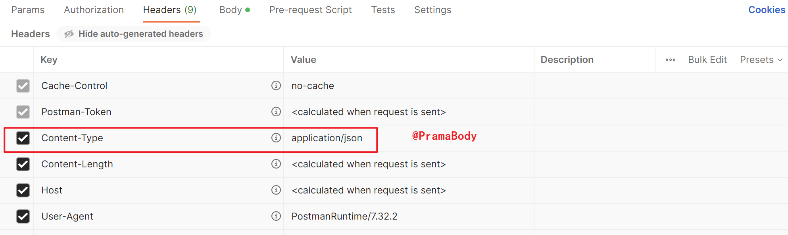

## 工作流程

   

- 如果是Spring5在使用之前一定要修改为JRE8（jdk1.8）：[ 解决:javac: 无效的目标发行版: 1.8](https://blog.csdn.net/qq_37107280/article/details/73246274)

1. 控制器 @Controller（@Component的衍生注解）配置映射信息。

2. SpringMVC配置

3. 前端控制器DispatcherServlet

- 启动服务器初始化过程和单次请求过程：

  

- 服务器初始化

1. 服务器启动，执行ServletContainersInitConfig类，初始化web容器（web.xml）。

2. 执行createServletApplicationContext()方法，创建WebApplicationContext对象。（加载配置类ApplicationContextConfig来初始化Spring容器。）

3. 执行getServletMappings()方法，设定SpringMVC拦截请求的路径规则。

- 单次请求过程

1. 发送请求`http://localhost/save`。
2. web容器发现该请求满足SpringMVC拦截规则，将请求交给SpringMVC处理。
3. 解析请求路径/save。@RequestMapping("/save")
4. 由/save匹配执行对应的方法save()。
5. 检测到有@ResponseBody直接将save()方法的返回值作为响应体返回给请求方。

## @Controller 控制器类

| 名称 | @Controller                   |
| ---- | ----------------------------- |
| 类型 | 类注解                        |
| 位置 | SpringMVC控制器类定义上方     |
| 作用 | 设定SpringMVC的核心控制器bean |

## ServletInitializer 前端控制器

#### AbstractAnnotationConfigDispatcherServletInitializer

- Spring和SpringMVC环境整合。

  

```java
public class ServletContainersInitConfig extends AbstractAnnotationConfigDispatcherServletInitializer {

    @Override
    protected Class<?>[] getRootConfigClasses() {
        return new Class[]{SpringConfig.class}; //Spring环境
    }

    @Override
    protected Class<?>[] getServletConfigClasses() {
        return new Class[]{SpringMvcConfig.class}; //SpringMVC环境
    }

    @Override
    protected String[] getServletMappings() {
        return new String[]{"/"}; //拦截路径
    }
}
```

- SpringMVC环境可以访问Spring环境，而Spring环境访问不了SpringMVC环境。

####  AbstractDispatcherServletInitializer

```java
public class ServletContainersInitConfig extends AbstractDispatcherServletInitializer {

    @Override
    protected WebApplicationContext createServletApplicationContext() {
        //将Spring容器添加到Web容器中
        AnnotationConfigWebApplicationContext applicationContext = new AnnotationConfigWebApplicationContext();
        applicationContext.register(SpringMvcConfig.class);
        return applicationContext;
    }

    @Override
    protected String[] getServletMappings() {
        return new String[]{"/"}; //设置被拦截的路径
    }

    @Override
    protected WebApplicationContext createRootApplicationContext() {
        return null;
    }
}
```

## 请求和响应

### PostMan工具

- PostMan是一款功能强大的网页调试与发送网页HTTP请求的Chrome插件。常用于进行接口测试。

  

#### PostMan使用

1. 创建WorkSpace工作空间。

  

2. 发送请求。

  

3. 保存当前请求。第一次请求需要创建一个新的目录，后面就不需要创建新目录，直接保存到已经创建好的目录即可。

  

### @RequestMapping 

#### 设置请求映射路径

| 名称     | @RequestMapping                 |
| -------- | ------------------------------- |
| 类型     | 类注解或方法注解                |
| 位置     | SpringMVC控制器类或方法定义上方 |
| 作用     | 设置当前控制器方法请求访问路径  |
| 相关属性 | value(默认)，请求访问路径       |

- @RequestMapping注解控制器类时，作为请求路径的前置。
- @RequestMapping注解value属性前面加不加`/`都可以

#### 返回值

1. `ModelAndView`: 该方法返回一个`ModelAndView`对象，用于表示Model和View的组合。其中Model是一个Map类型的对象，用于存储需要返回的数据；View用于表示需要渲染的视图。
2. `String`: 返回一个字符串，用于表示返回的视图名称。在此情况下，需要通过`viewResolver`来进行视图解析，将该字符串解析为具体的视图。
3. `ResponseEntity`: 返回一个`ResponseEntity`对象，该对象包含了HTTP响应的状态码、头部信息和响应体等内容。使用该对象可以直接控制HTTP响应，包括重定向、返回Json数据等操作。
4. `void`: 如果方法不需要返回任何数据，也可以使用`void`作为返回类型。此时，可以通过`HttpServletResponse`对象来手动控制HTTP响应。例如，可以在方法中设置状态码、设置响应头部信息等。但是，不推荐使用该方式来控制响应。

- 被注释的方法的返回值：String，进行页面跳转：

```java
return "/user/index.html"; //
return "redirect:/user/index.html"; //重定向
```

### 请求参数

#### 参数传递

##### GET

```http
http://localhost:8080/user/commonParam?name=zjk&age=19
```

###### Tomcat7中文乱码

```xml
<build>
    <plugins>
      <plugin>
        <groupId>org.apache.tomcat.maven</groupId>
        <artifactId>tomcat7-maven-plugin</artifactId>
        <version>2.1</version>
        <configuration>
          <port>8080</port><!--tomcat端口号-->
          <path>/</path> <!--虚拟目录-->
          <uriEncoding>UTF-8</uriEncoding><!--访问路径编解码字符集-->
        </configuration>
      </plugin>
    </plugins>
  </build>
```

##### POST

  

###### 过滤器 编码集乱码处理

- getServletFilters()：使用Spring内准备的过滤器。

```java
public class ServletContainersInitConfig extends AbstractAnnotationConfigDispatcherServletInitializer {
    //部分方法省略
    
    protected Filter[] getServletFilters() {
        //org.springframework.web.filter.CharacterEncodingFilter;
        CharacterEncodingFilter filter = new CharacterEncodingFilter();
        filter.setEncoding("utf-8");
        return new Filter[]{filter};
    }
    
}
```

#### 参数类型


| 参数类型         | 传递方式                                                     |
| :--------------- | :----------------------------------------------------------- |
| 普通参数         | url地址传参，地址参数名与形参变量名相同，定义形参即可接收参数 |
| POJO类型参数     | 请求参数名与形参对象属性名相同，定义POJO类型形参即可接收参数 |
| 嵌套POJO类型参数 | 请求参数名与形参对象属性名相同，按照对象层次结构关系即可接收嵌套POJO属性参数 |
| 数组类型参数     | 请求参数名与形参对象属性名相同且请求参数为多个，定义数组类型即可接收参数 |
| 集合类型参数     | 同名请求参数可以使用@RequestParam注解映射到对应名称的集合对象中作为数据 |

##### @RequestParam 地址参数名

- 形参与地址参数名不一致时，通过@RequestParam指定当前形参传递到的地址参数。默认将当前参数名作为地址参数名。

| 名称     | @RequestParam                                          |
| -------- | ------------------------------------------------------ |
| 类型     | 形参注解                                               |
| 位置     | SpringMVC控制器方法形参定义前面                        |
| 作用     | 绑定请求参数与处理器方法形参间的关系                   |
| 相关参数 | required：是否为必传参数 <br/>defaultValue：参数默认值 |

```java
@RequestMapping("/commonParam")
@ResponseBody
public String commonParam(@RequestParam("name") String userName,
                          @RequestParam("age") Integer age){
    System.out.println(userName);
    System.out.println(age);
    return "{'info':'commonParam'}";
}
```

##### POJO类型参数

- 按POJO类型的属性名进行注入。

```java
@RequestMapping("/userParam")
@ResponseBody
public String commonParam(User user){ //id、name、age
    System.out.println(user);
    return "{'info':'userParam'}";
}
```

- GET

```http
http://localhost:8080/user/userParam?id=9&name=zjk&age=18
```

- POST

  

##### 嵌套POJO类型参数

- 按照对象层次结构关系：作为属性的POJO.属性

```java
@RequestMapping("/userParam")
@ResponseBody
public String commonParam(User user){ //User:id,name,age,address(Address:province,city)
    System.out.println(user);
    return "{'info':'userParam'}";
}
```

  

##### 数组类型参数

- 数组名必须一致才能封装到一个数组中。

```java
@RequestMapping("/arrParam")
@ResponseBody
public String arrParam(String[] infos) {
    for (String info : infos) {
        System.out.println(info);
    }
    return "{'info':'arrParam'}";
}
```

  

##### 集合类型参数 @RequestParam

- 如果按数组注入： **SpringMVC将List看做是一个POJO对象来处理** ，将其创建一个对象并准备把前端的数据封装到对象中，但是List是一个接口无法创建对象，所以报错。

###### 集合保存普通参数

- 请求参数名与形参集合对象名相同且请求参数为多个，@RequestParam绑定参数关系。

```java
@RequestMapping("/listParam")
@ResponseBody
public String listParam(@RequestParam List<String> list) {
    System.out.println(list);
    return "{'info':'arrParam'}";
}
```

  

###### 集合保存POJO类型参数

##### JSON对象数组传递

- 坐标

```xml
<dependency>
    <groupId>com.fasterxml.jackson.core</groupId>
    <artifactId>jackson-databind</artifactId>
    <version>2.9.0</version>
</dependency>
```

###### @EnableWebMvc

- 开启SpringMVC注解驱动

```java
@Configuration
@ComponentScan("com.zjk.controller")
@EnableWebMvc
public class SpringMvcConfig {}
```

| 名称 | @EnableWebMvc             |
| ---- | ------------------------- |
| 类型 | 配置类注解                |
| 位置 | SpringMVC配置类定义上方   |
| 作用 | 开启SpringMVC多项辅助功能 |

###### @RequestBody

| 名称 | @RequestBody                                                 |
| ---- | ------------------------------------------------------------ |
| 类型 | 形参注解                                                     |
| 位置 | SpringMVC控制器方法形参定义前面                              |
| 作用 | 将请求中请求体所包含的数据传递给请求参数，此注解一个处理器方法只能使用一次 |

**@RequestBody与@RequestParam区别**

* 区别
  * @RequestParam用于接收url地址传参，表单传参【application/x-www-form-urlencoded】
  * @RequestBody用于接收json数据【application/json】
* 应用
  * 后期开发中，发送json格式数据为主，@RequestBody应用较广
  * 如果发送非json格式数据，选用@RequestParam接收请求参数

  

###### POJO类型参数

```java
@RequestMapping("/userParamForJson")
@ResponseBody
public String userParamForJson(@RequestBody User user) {
    System.out.println(user);
    return "{'info':'userParamForJson'}";
}
```

  

######  普通类型集合参数

```java
@RequestMapping("/listParamForJson")
@ResponseBody
public String listParamForJson(@RequestBody List<String> list) {
    System.out.println(list);
    return "{'info':'listParamForJson'}";
}
```

  

###### POJO类型集合参数

```java
@RequestMapping("/userListParamForJson")
@ResponseBody
public String userListParamForJson(@RequestBody List<User> list) {
    System.out.println(list);
    return "{'info':'userListParamForJson'}";
}
```

  

- 对于传输中的数据：考虑使用Map集合来存储。

##### 日期类型参数 @DateTimeFormat

###### 默认格式 yyyy/mm/dd

```java
@RequestMapping("/dateParam")
@ResponseBody
public String dateParam(Date date){
    System.out.println(date);
    return "{'info':'date'}";
}
```

  

###### @DateTimeFormat 设置格式pattern

| 名称     | @DateTimeFormat                 |
| -------- | ------------------------------- |
| 类型     | 形参注解                        |
| 位置     | SpringMVC控制器方法形参前面     |
| 作用     | 设定日期时间型数据格式          |
| 相关属性 | pattern：指定日期时间格式字符串 |

```java
@RequestMapping("/dateParam")
@ResponseBody
public String dateParam(@DateTimeFormat(pattern = "yyyy-mm-dd") Date date1,
                        @DateTimeFormat(pattern = "yyyy-mm-dd HH:mm:ss") Date date2){
    System.out.println(date1);
    System.out.println(date2);
    return "{'info':'date'}";
}
```

  

#### Converter接口 类型转换器

- 由SpringMVC对传递参数进行类型转换。

- Converter所属的包为org.springframework.core.convert.converter。

```java
@FunctionalInterface
public interface Converter<S, T> {
    @Nullable
    T convert(S var1);
}
```

### 响应

* 响应页面
* 响应数据
  * 文本数据
  * JSON数据

#### 文本数据

- 默认返回的字符串作为页面跳转的路径：
- 如下：返回的是index.jsp，但是跳转页面时，如果有模块名，则需要加上模块名(/user)。则跳转到：/user/index.jsp。

```java
@Controller
@RequestMapping("/user")
public class UserController {

    @RequestMapping("/toJumpPage")
    public String toJumpPage(){
        System.out.println("跳转页面...");
        //返回的是index.jsp，但是跳转页面时，如果有模块名，则需要加上模块名/user/index.jsp
        return "index.jsp"; 
    }
}
```

#### JSON数据 @ResponseBody

| 名称     | @ResponseBody                                                |
| -------- | ------------------------------------------------------------ |
| 类型     | 方法\类注解                                                  |
| 位置     | SpringMVC控制器方法定义上方和控制类上                        |
| 作用     | 设置当前控制器返回值作为响应体,<br/>写在类上，该类的所有方法都有该注解功能 |
| 相关属性 | pattern：指定日期时间格式字符串                              |

**@ReponseBody注解之后:**

* 方法的返回值为字符串，会将其 **作为文本内容 **直接响应给前端。 **而不是页面跳转** 。
* 方法的返回值为对象，会将 **对象转换成JSON** 响应给前端。

#### 类型转换 

- 内部还是通过 **Converter接口（HttpMessageConvert接口）** 的实现类完成的。

* 对象转Json数据(POJO -> json)
* 集合转Json数据(Collection -> json)

```java
@Controller
public class UserController {
    
    @RequestMapping("/toJsonPOJO")
    @ResponseBody
    public User toJsonPOJO(){
        System.out.println("返回json对象数据");
        User user = new User();
        user.setName("itcast");
        user.setAge(15);
        return user;
    }
    
}
```

##### HttpMessageConvert接口

```java
public interface HttpMessageConverter<T> {
    boolean canRead(Class<?> var1, @Nullable MediaType var2);

    boolean canWrite(Class<?> var1, @Nullable MediaType var2);

    List<MediaType> getSupportedMediaTypes();

    T read(Class<? extends T> var1, HttpInputMessage var2) throws IOException, HttpMessageNotReadableException;

    void write(T var1, @Nullable MediaType var2, HttpOutputMessage var3) throws IOException, HttpMessageNotWritableException;
}
```

  

## REST风格

### REST风格介绍

- REST（Representational State Transfer），表现形式状态转换,它是一种软件架构 **风格**  。

#### 表现网络资源

* 传统风格资源描述形式：一个请求url对应一种操作。
  * `http://localhost/user/getById?id=1` 查询id为1的用户信息
  * `http://localhost/user/saveUser` 保存用户信息
* REST风格描述形式：隐藏资源的访问行为，无法通过地址得知对资源是何种操作，书写简化。
  * `http://localhost/users/1` 
  * `http://localhost/users`

#### 区分请求

- 按照REST风格（不是规范）访问资源时使用 **行为动作** 区分对资源进行了何种操作。
- REST提供了对应的架构方式，按照这种架构设计项目可以降低开发的复杂性，提高系统的可伸缩性
- 描述模块的名称通常使用复数，也就是加s的格式描述，表示此类资源，而非单个资源，例如:users、books、accounts......

**按照不同的请求方式代表不同的操作类型**

| 请求   | 对应操作  |
| :----- | :-------- |
| GET    | 查询      |
| POST   | 增加/保存 |
| PUT    | 修改/更新 |
| DELETE | 删除      |

### RESTful

* 根据REST风格对资源进行访问。

#### @PathVariable

| 名称 | @PathVariable                                                |
| ---- | ------------------------------------------------------------ |
| 类型 | 形参注解                                                     |
| 位置 | SpringMVC控制器方法形参定义前面                              |
| 作用 | 绑定路径参数与处理器方法形参间的关系，要求路径参数名与形参名一一对应 |

```java
@RequestMapping(value = "/users/{id}",method = RequestMethod.GET)
@ResponseBody
public String getById(@PathVariable Integer id){
    System.out.println("user getById..." + id);
    return "{'module':'user getById'}";
}
```

##### @RequestBody、@RequestParam、@PathVariable比较

* 区别
  * @RequestParam用于接收url地址传参或表单传参
  * @RequestBody用于接收json数据
  * @PathVariable用于接收路径参数，使用{参数名称}描述路径参数
* 应用
  * 后期开发中，发送请求参数超过1个时，以json格式为主，@RequestBody应用较广
  * 如果发送非json格式数据，选用@RequestParam接收请求参数
  * 采用RESTful进行开发，当参数数量较少时，例如1个，可以采用@PathVariable接收请求路径变量，通常用于传递id值

#### @RestController

| 名称 | @RestController                                              |
| ---- | ------------------------------------------------------------ |
| 类型 | 类注解                                                       |
| 位置 | 基于SpringMVC的RESTful开发控制器类定义上方                   |
| 作用 | 设置当前控制器类为RESTful风格，<br/>等同于@Controller与@ResponseBody两个注解组合功能 |

#### @XxxMapping

| 名称       | @GetMapping @PostMapping @PutMapping @DeleteMapping          |
| ---------- | ------------------------------------------------------------ |
| 类型       | 方法注解                                                     |
| 位置       | 基于SpringMVC的RESTful开发控制器方法定义上方                 |
| 作用       | 设置当前控制器方法请求访问路径与请求动作，每种对应一个请求动作，<br/>例如@GetMapping对应GET请求 |
| 方法返回值 | String：表示响应的视图名称或重定向到的URL。<br>void：表示不需要返回任何响应。<br>ModelAndView：表示响应的视图和模型数据的容器。<br>ResponseEntity：表示带有自定义HTTP头和状态代码的HTTP响应。<br>其他类型（例如自定义对象）：表示响应的序列化数据类型 |

**方法返回值：**

```java
@RestController
@RequestMapping("/users")
public class UserController {

//    @RequestMapping(value = "/users", method = RequestMethod.POST)
//    @ResponseBody
    @PostMapping
    public String save() {
        System.out.println("user save...");
        return "{'module':'user save'}";
    }

//    @RequestMapping(value = "/users/{id}", method = RequestMethod.DELETE)
//    @ResponseBody
    @DeleteMapping("/{id}")
    public String delete(@PathVariable Integer id) {
        System.out.println("user delete..." + id);
        return "{'module':'user delete'}";
    }

//    @RequestMapping(value = "/users", method = RequestMethod.PUT)
//    @ResponseBody
    @PutMapping
    public String update(@RequestBody User user) {
        System.out.println("user update..." + user);
        return "{'module':'user update'}";
    }

//    @RequestMapping(value = "/users/{id}", method = RequestMethod.GET)
//    @ResponseBody
    @GetMapping("/{id}")
    public String getById(@PathVariable Integer id) {
        System.out.println("user getById..." + id);
        return "{'module':'user getById'}";
    }

//    @RequestMapping(value = "/users", method = RequestMethod.GET)
//    @ResponseBody
    @GetMapping
    public String getAll() {
        System.out.println("user getAll...");
        return "{'module':'user getAll'}";
    }
}
```

### WebMvcConfigurationSupport

- 设置静态资源放行。

```java
@Configuration
public class SpringMvcSupport extends WebMvcConfigurationSupport {
    @Override
    protected void addResourceHandlers(ResourceHandlerRegistry registry) {
        //当访问/pages/*时，走/pages目录下的内容
        registry.addResourceHandler("/pages/**").addResourceLocations("/pages/");
        registry.addResourceHandler("/js/**").addResourceLocations("/js/");
        registry.addResourceHandler("/css/**").addResourceLocations("/css/");
        registry.addResourceHandler("/plugins/**").addResourceLocations("/plugins/");
    }
}
```

```java
@Configuration
@ComponentScan({"com.zjk.controller","com.zjk.config"}) //扫描SpringMvcSupport
@EnableWebMvc
public class SpringMvcConfig {}
```

- SpringMVC拦截了静态资源：

```java
public class ServletContainersInitConfig extends AbstractAnnotationConfigDispatcherServletInitializer {
    //部分方法

    protected String[] getServletMappings() {
        return new String[]{"/"}; //拦截路径
    }
}
```

## SSM整合

### 表现层数据封装

- 设置统一数据返回结果类：如：

```java
public class Result{
    private Object data;
    private Integer code;
    private String message;
}
```

```java
public class Code {
    public static final Integer SAVE_OK = 20011;
    public static final Integer DELETE_OK = 20021;
    public static final Integer UPDATE_OK = 20031;
    public static final Integer GET_OK = 20041;
    public static final Integer SAVE_ERR = 20010;
    public static final Integer DELETE_ERR = 20020;
    public static final Integer UPDATE_ERR = 20030;
    public static final Integer GET_ERR = 20040;
}
```

```java
@GetMapping
public Result getAll() {
    List<Book> bookList = bookService.getAll();
    Integer code = bookList != null ? Code.GET_OK : Code.GET_ERR;
    String msg = bookList != null ? "" : "查询失败";
    return new Result(code,bookList,msg);
}
```

  

## 异常处理机制

### 异常处理思路

| 抛出异常的常见位置 | 诱因                                                 |
| :----------------- | :--------------------------------------------------- |
| 框架内部           | 使用不合规                                           |
| 数据层             | 外部服务器故障（服务器访问超时）                     |
| 业务层             | 业务逻辑书写错误（遍历业务书写操作，导致索引异常）   |
| 表现层             | 数据收集、校验等规则（不匹配的数据类型间导致异常）   |
| 工具类             | 工具类书写不严谨不够健壮（必要释放的连接长期未释放） |

- 所有的异常均抛出到表现层进行处理。
- AOP思想进行处理异常。

### 异常处理器 @RestControllerAdvice

```java
@RestControllerAdvice
public class ProjectExceptionAdvice {
    @ExceptionHandler(SystemException.class)
    public Result doSystemException(SystemException ex) {
        //记录日志
        //发送消息给运维
        //发送消息给开发人员
        return new Result(ex.getCode(), null, ex.getMessage());
    }

    @ExceptionHandler(BusinessException.class)
    public Result doBusinessException(BusinessException ex) {
        return new Result(ex.getCode(), null, ex.getMessage());
    }

    @ExceptionHandler(Exception.class)
    public Result doException(Exception ex) {
        return new Result(Code.SYSTEM_UNKNOW, null, "安抚客户");
    }
}

```

#### @ExceptionHandler

| 名称 | @ExceptionHandler                                            |
| ---- | ------------------------------------------------------------ |
| 类型 | 方法注解                                                     |
| 位置 | 专用于异常处理的控制器方法上方                               |
| 作用 | 设置指定异常的处理方案，功能等同于控制器方法，出现异常后终止原始控制器执行，并转入当前方法执行。 |

### 项目异常分类

| 异常                          | 说明                                                       | 处理方案                                                     |
| :---------------------------- | ---------------------------------------------------------- | :----------------------------------------------------------- |
| 业务异常（BusinessException） | 规范的用户行为产生的异常<br>不规范的用户行为操作产生的异常 | 发送对应消息传递给用户，提醒规范操作                         |
| 系统异常（SytemException）    | 项目运行过程中可预计且无法避免的异常                       | 发送固定消息给用户，安抚用户<br>发送特点消息给运维人员，提醒维护<br>记录日志 |
| 其他异常（Exception）         | 编程人员未预期到的异常                                     | 发送固定消息传递给用户，安抚用户<br>发送特定消息给编程人员，提醒维护（纳入预期范围内）<br>记录日志 |

```java
public class SystemException extends RuntimeException {
    private Integer code;

    public void setCode(Integer code) {
        this.code = code;
    }

    public Integer getCode() {
        return code;
    }

    public SystemException(Integer code, String message) {
        super(message);
        this.code = code;
    }

    public SystemException(Integer code, String message, Throwable cause) {
        super(message, cause);
        this.code = code;
    }

}
```

```java
if(id == 1){
    throw new BusinessException(Code.BUSINESS_ERR,"业务异常");
}
//将可能出现的异常进行包装，转换成自定义异常
try {
    int i = 1 / 0;
} catch (ArithmeticException e) {
    throw new SystemException(Code.SYSTEM_TIMEOUT_ERR, "服务器访问超时。。。", e);
}
```

## 拦截器

- 拦截器（Interceptor），动态拦截方法调用的机制，在SpringMVC中动态拦截控制器方法的执行。
  - 在指定的方法调用前后执行预先设定的代码。
  - 阻止原始方法的执行。

**拦截器和过滤器的区别**

- 归属不同：Filter属于Servlet技术，Interceptor属于SpringMVC技术。
- 拦截内容不同：Filter对所有访问进行增强，Interceptor仅针对SpringMVC的访问进行增强。

  

### HandlerInterceptor 拦截器接口

```java
//com.zjk.controller.interceptor
@Component
public class ProjextInterceptor implements HandlerInterceptor {
    @Override
    public boolean preHandle(HttpServletRequest request, HttpServletResponse response, Object handler) throws Exception {
        //在方法执行之前进行校验
        return true;//返回false则终止原始操作
    }

    @Override
    public void postHandle(HttpServletRequest request, HttpServletResponse response, Object handler, ModelAndView modelAndView) throws Exception {
    }

    @Override
    public void afterCompletion(HttpServletRequest request, HttpServletResponse response, Object handler, Exception ex) throws Exception {
    }
}
```

#### Object handler参数

- class org.springframework.web.method.HandlerMethod

```java
public boolean preHandle(HttpServletRequest request, HttpServletResponse response, Object handler) throws Exception {
    HandlerMethod handlerMethod = (HandlerMethod) handler;
    Method method = handlerMethod.getMethod(); //获得原始执行方法
    return true;
}
```

#### ModelAndView modelAndView参数

- 页面跳转

```java
public void postHandle(HttpServletRequest request, HttpServletResponse response, Object handler, ModelAndView modelAndView) throws Exception {
}
```

#### Exception ex参数

- 抛出的异常对象

```java
public void afterCompletion(HttpServletRequest request, HttpServletResponse response, Object handler, Exception ex) throws Exception {
}
```

### WebMvcConfigurer接口

### SpringMvcSuport

```java
public class SpringMvcSupport extends WebMvcConfigurationSupport {
    @Autowired
    private ProjextInterceptor projextInterceptor;
    @Override
    protected void addInterceptors(InterceptorRegistry registry) {
        //当调用/book请求时，使用拦截器
        registry.addInterceptor(projextInterceptor).addPathPatterns("/books","/books/**");
    }
}
```

#### 侵入式

```java
@Configuration
@ComponentScan("com.zjk.controller")
@EnableWebMvc
public class SpringMvcConfig implements WebMvcConfigurer {
    @Override
    public void addResourceHandlers(ResourceHandlerRegistry registry) {

    }

    @Autowired
    private ProjextInterceptor projextInterceptor;
    @Override
    public void addInterceptors(InterceptorRegistry registry) {
        registry.addInterceptor(projextInterceptor).addPathPatterns("/books","/books/**");
    }
}
```

### 拦截器链

- 拦截器链的运行顺序按照拦截器的添加顺序先后执行。
- 当拦截器中出现对原始处理器的拦截，后面的拦截器均终止运行。

  

  

  