# 命名空间

## xml标签概念

| 标签类型   | 说明                                                         |
| ---------- | ------------------------------------------------------------ |
| 默认标签   | 默认命名空间内的标签，如`<bean>`。                           |
| 自定义标签 | 导入的命名空间内的标签，如`<context:property-placeholder>`。 |

- xml标签格式：默认命名空间，可以省略前缀。

```xml
<命名空间前缀:标签名>
```

## 命名空间 xmlns

- 命名空间：默认命名空间、自定义命名空间。自动为 XML 标签补全前缀，避免标签命名冲突。

- 为了确保命名空间的唯一，不同的命名空间的通常使用URL作为被识别的id（名称空间被xml解释器内部所识别的时候所真正使用的id），只是被当做一个字符串名字去处理（而不是网址），xml解释器根据这个id去获取它对应的标准，从而知道这个命名空间定义有什么样的标签(xml解释器自带有一些通用的命名空间的标准)。

```xml
<beans xmlns="http://www.springframework.org/schema/beans" 
       xmlns:xsi="http://www.w3.org/2001/XMLSchema-instance"
       xsi:schemaLocation="http://www.springframework.org/schema/beans   
                           http://www.springframework.org/schema/beans/spring-beans.xsd"> 
</beans>
```

| 属性               | 说明         |
| :----------------- | :----------- |
| xmlns              | 默认命名空间 |
| xmlns:xsi          | 遵守xml规范  |
| xsi:schemaLocation | schema资源   |

- xmlns="`http://www.springframework.org/schema/beans`" 表示引入了一个默认的名称空间，下文中不使用命名空间前缀的都默认使用这个命名空间，其真正的id是"`http://www.springframework.org/schema/beans`"。

- schemaLocation中存储的值每两个为一组，第一个代表命名空间，第二个代表该命名空间的标准的.xsd schame约束文件位置。

  - 只允许存在一个schemaLocation；内部可以存放多个schema资源。
  - 使用META-INF目录下的约束映射文件spring.schemas、处理器映射文件spring.handlers。

**自定义命名空间**

- 需要引入新的 Spring 配置时，添加一个新的命名空间，以及其 schema 资源

```xml
<beans xmlns="http://www.springframework.org/schema/beans"
       xmlns:xsi="http://www.w3.org/2001/XMLSchema-instance"
       xmlns:context="http://www.springframework.org/schema/context"
       xsi:schemaLocation="http://www.springframework.org/schema/beans 
                           http://www.springframework.org/schema/beans/spring-beans.xsd
                           http://www.springframework.org/schema/context 
                           http://www.http://www.springframework.org/schema/context/spring-context.xsd">
</beans>
```

### 默认标签

- Spring的默认标签用到的是Spring的默认命名空间 `xmlns="http://www.springframework.org/schema/beans"`（里面维护的标签都是默认标签）。

| 标签       | 说明                                                |
| :--------- | :-------------------------------------------------- |
| `<beans>`  | 一般作为 xml 配置根标签，其他标签都是该标签的子标签 |
| `<bean>`   | Bean的配置标签                                      |
| `<import>` | 外部资源导入标签                                    |
| `<alias>`  | 指定Bean的别名标签，使用较少                        |

### 自定义标签

- **自定义标签**：Spring的自定义标签需要引入外部的命名空间，并为外部的命名空间指定前缀。（ `<前缀:标签>`）

```xml
<!--默认标签-->
<bean id="userDao" class="com.itheima.dao.impl.UserDaoImpl"/>
<!--自定义标签-->
<context:property-placeholder/>
<mvc:annotation-driven/>
<dubbo:application name="application"/>
```

1. 导入坐标
2. 命名空间

```xml
<beans xmlns="http://www.springframework.org/schema/beans"
       xmlns:xsi="http://www.w3.org/2001/XMLSchema-instance"
       xmlns:mvc="http://www.springframework.org/schema/mvc"
       xsi:schemaLocation="http://www.springframework.org/schema/beans
                           http://www.springframework.org/schema/beans/spring-beans.xsd
                           http://www.springframework.org/schema/mvc
                           http://www.springframework.org/schema/mvc/spring-mvc.xsd">
    <mvc:annotation-driven></mvc:annotation-driven>

</beans>
```

# IoC、DI

## BeanFactory

- BeanFactory（Bean工厂）：Spring底层核心部分。

  

 

### IoC 控制反转

- IoC：工厂设计模式，BeanFactory根据配置文件/配置类来生产Bean实例。

 

1. beans.xml配置文件

```xml
<?xml version="1.0" encoding="UTF-8"?>
<beans xmlns="http://www.springframework.org/schema/beans"
       xmlns:xsi="http://www.w3.org/2001/XMLSchema-instance"
       xsi:schemaLocation="http://www.springframework.org/schema/beans http://www.springframework.org/schema/beans/spring-beans.xsd">

    <bean id="userService" class="com.zjk.service.impl.UserServiceImpl"></bean>

</beans>
```

2. BeanFactory获取Bean对象：创建BeanFactory，加载配置文件，获取UserService实例对象。

```java
//1. 创建BeanFactory 工厂对象
DefaultListableBeanFactory beanFactory = new DefaultListableBeanFactory();
//2. 创建一个读取器 xml文件
XmlBeanDefinitionReader reader = new XmlBeanDefinitionReader(beanFactory);
//3. 绑定读取器和工厂对象 读取配置文件给工厂对象
reader.loadBeanDefinitions("beans.xml");
//4. 由beans.xml内配置的id获取Bean实例
UserService userService = (UserService) beanFactory.getBean("userService");

System.out.println(userService);
```

### DI 依赖注入

- DI：通过注入的方式反转Bean的创建权。

 

1. 定义接口及其实现类，setXxx(Xxx xxx)注入方法。（只要存在setXxx()，即使没有相应的xxx属性，也会执行该setXxx()注入方法）

```java
//com.zjk.service.UserService
public interface UserService {}
//com.zjk.service.impl.UserServiceImpl
public class UserServiceImpl implements UserService {
    //通过BeanFactory调用该方法 从容器中获取userDao设置到此处
    //需要先在beans.xml中配置对应的<bean>的<property>
    public void setUserDao(UserDao userDao){
        System.out.println("" + userDao);
    }
}
//com.zjk.dao
public interface UserDao{}
//com.zjk.dao.impl
public class UserDaoImpl implements UserDao{}
```

2. 具体的UserServiceImpl实现类

```java
package com.zjk.service.impl;

import com.zjk.dao.UserDao;
import com.zjk.service.UserService;

public class UserServiceImpl implements UserService {
    private UserDao userDao;

    //通过BeanFactory调用该set方法 从容器中获取userDao设置到此处
    //在beans.xml中的<bean id="userService" name="com.zjk.service.impl.userServiceImpl">中的
    //<property id="setXxx方法的xxx(即setUserDao的userDao)" name="beans.xml中配置的<bean id="userDao name="com.zjk.dao.UserDao">"的id"></property>
    public void setUserDao(UserDao userDao) {
        this.userDao = userDao;
    }
}
```

3. beans.xml配置文件 `<property>注入`

```xml
<bean id="userService" class="com.zjk.service.impl.UserServiceImpl">
    <property name="userDao" ref="userDao"></property>
    <!-- 配置注入
        name：UserServiceImpl中的属性名称(userDao) 即：setUserDao中的setXxx中的xxx
        ref： 在当前的配置文件(beans.xml)(容器)中查找相应的id(userDao)
    -->
</bean>
```

4. beans.xml

```xml
<?xml version="1.0" encoding="UTF-8"?>
<beans xmlns="http://www.springframework.org/schema/beans"
       xmlns:xsi="http://www.w3.org/2001/XMLSchema-instance"
       xsi:schemaLocation="http://www.springframework.org/schema/beans http://www.springframework.org/schema/beans/spring-beans.xsd">

    <bean id="userService" class="com.zjk.service.impl.UserServiceImpl">
        <property name="userDao" ref="userDao"></property>
    </bean>
    <bean id="userDao" class="com.zjk.dao.impl.UserDaoImpl"></bean>
</beans>
```

5. BeanFactory获取Bean对象：创建BeanFactory，加载配置文件，获取UserService实例对象，并提前将其依赖的UserDao注入。

```java
//1. 创建BeanFactory 工厂对象
DefaultListableBeanFactory beanFactory = new DefaultListableBeanFactory();
//2. 创建一个读取器 xml文件
XmlBeanDefinitionReader reader = new XmlBeanDefinitionReader(beanFactory);
//3. 绑定读取器和工厂对象 读取配置文件给工厂对象
reader.loadBeanDefinitions("beans.xml");
//4. 由id获取Bean实例  在获取时会执行UserService中的注入方法(set方法)setUserDao(UserDao userDao)
UserService userService = (UserService) beanFactory.getBean("userService");

System.out.println(userService);
```

### getBean()

| 方法                                    | 返回值和参数                                                 |
| :-------------------------------------- | :----------------------------------------------------------- |
| Object getBean (String beanName)        | 根据beanName(`<bean>`的id或别名)从容器中获取Bean实例。<br/>要求容器中Bean(id)唯一。<br/>返回值为Object，需要强转。 |
| T getBean (Class type)                  | 根据Class类型(`<bean>`的class)从容器中获取Bean实例。<br/>要求容器中Bean类型(class)唯一。<br/>返回值为Class类型实例，无需强转。 |
| T getBean (String beanName，Class type) | 根据beanName从容器中获得Bean实例。<br/>返回值为Class类型实例，无需强转。 |

```java
//根据beanName获取容器中的Bean实例，需要手动强转
UserService userService = (UserService) applicationContext.getBean("userService");
//根据Bean类型去容器中匹配对应的Bean实例，如存在多个匹配Bean则报错
UserService userService2 = applicationContext.getBean(UserService.class);
//根据beanName获取容器中的Bean实例，指定Bean的Type类型
UserService userService3 = applicationContext.getBean("userService", UserService.class);
```

## ApplicationContext 容器

- ApplicationContext（Spring容器）：内部封装BeanFactory。

### BeanFactory、ApplicationContext

1. BeanFactory是Spring的早期接口：Bean工厂；ApplicationContext是后期更高级接口：Spring容器。

2. ApplicationContext在BeanFactory基础上对功能进行了扩展，监听功能、国际化功能等。BeanFactory的API更偏向底层，ApplicationContext的API大多数是对这些底层API的封装。
     

   - ApplicationContext除了继承了BeanFactory外，还继承了ApplicationEventPublisher（事件发布器）、ResouresPatternResolver（资源解析器）、MessageSource（消息资源）等。但是ApplicationContext的核心功能还是BeanFactory。
       

3. ApplicationContext与BeanFactory既有继承关系，又有融合关系。Bean创建的主要逻辑和功能都被封装在BeanFactory中，ApplicationContext不仅继承了BeanFactory，而且ApplicationContext内部还维护着BeanFactory的引用。 

4. Bean的初始化时机不同，原始BeanFactory是在首次调用getBean("id")时才进行Bean的创建，而ApplicationContext是加载配置文件、容器创建时就将所有的Bean实例都创建好了，存储到一个单例池中，当调用getBean时直接从单例池中获取Bean实例返回。

```java
//1. 加载配置文件，实例化容器
ApplicationContext applicationContext = new ClassPathXmlApplicationContext("applicationContext.xml");
//2. 获取Bean实例对象
UserService userService = (UserService) applicationContext.getBean("userService");

System.out.println(userService);
```

### ApplicationContext继承体系

- 只在Spring基础环境下，即只导入spring-context坐标时，此时ApplicationContext的继承体系:

  

  

- Spring基础环境下，常用的三个ApplicationContext作用如下：

| 实现类                             | 功能描述                                    |
| :--------------------------------- | :------------------------------------------ |
| ClassPathXmlApplicationContext     | 加载类路径下的xml配置的ApplicationContext   |
| FileSystemXmlApplicationContext    | 加载磁盘路径下的xml配置的ApplicationContext |
| AnnotationConfigApplicationContext | 加载注解配置类的ApplicationContext          |

- 在Spring的web环境下，常用的两个ApplicationContext作用如下：

| 实现类                                | 功能描述                                               |
| :------------------------------------ | :----------------------------------------------------- |
| XmlWebApplicationContext              | web环境下，加载类路径下的xml配置的ApplicationContext   |
| AnnotationConfigWebApplicationContext | web环境下，加载磁盘路径下的xml配置的ApplicationContext |

# 第三方框架

- 不需要自定义命名空间xmlns，不需要使用Spring的配置文件配置第三方框架本身内容：MyBatis
- 需要引入第三方框架命名空间，需要使用Spring的配置文件配置第三方框架本身内容：Dubbo、Context

# MyBatis

- MyBatis提供了mybatis-spring.jar专门用于两大框架的整合。
- 对于Spring5：Unsupported class file major version 62：报错，注意jdk版本：可以换成jdk8。

### 步骤

**Spring整合MyBatis的步骤如下：**

1. 导入MyBatis整合Spring的相关坐标
2. 编写Mapper和Mapper.xml；（不需要mybatis核心配置文件）
3. 配置SqlSessionFactoryBean和MapperScannerConfigurer；
4. 编写测试代码

#### 1.导入mybatis-spring

```xml
<groupId>org.mybatis</groupId>
<artifactId>mybatis-spring</artifactId>
<version>2.0.5</version>
```

```xml
<groupId>org.springframework</groupId>
<artifactId>spring-jdbc</artifactId>
<version>5.2.13.RELEASE</version>
```

#### 2.mapper.xml配置

#### 3.applicationContext.xml配置 SqlSessionFactoryBean和MapperScannerConfigurer

- Spring容器内部自动绑定SqlSessionFactoryBean和MapperScannerConfigurer。并且自动提交事务。

**SqlSessionFactoryBean**：将SqlSessionFactory存储到Spring容器。

**MapperScannerConfigurer**：扫描指定的包，产生Mapper对象存储到Spring容器。

- applicationContext.xml

```xml
<!--配置数据源-->
<bean id="dataSource" class="com.alibaba.druid.pool.DruidDataSource">
    <property name="url" value="jdbc:mysql://127.0.0.1:3306/db1"/>
    <property name="username" value="root"/>
    <property name="password" value="1234"/>
</bean>
<!--SqlSessionFactoryBean    将SqlSessionFactory存储到Spring容器中-->
<bean class="org.mybatis.spring.SqlSessionFactoryBean">
    <property name="dataSource" ref="dataSource"/>
</bean>
<!--MapperScannerConfigurer    扫描指定的包，产生Mapper对象存储到Spring容器-->
<bean class="org.mybatis.spring.mapper.MapperScannerConfigurer">
    <property name="basePackage" value="com.zjk.mapper"/>
</bean>

<!--可以在UserService中直接使用UserMapper-->
<bean id="userService" class="com.zjk.service.impl.UserServiceImpl">
    <property name="userMapper" ref="userMapper"/>
</bean>
```

- mybatis-config.xml：在当前的配置中不需要，但是别名之类在mybatis核心配置文件中的配置也无法使用。

  - 别名：`sqlSessionFactoryBean.setTypeAliasesPackage("com.zjk.pojo");` 

- userMapper.xml：

```xml
<?xml version="1.0" encoding="UTF-8" ?>
<!DOCTYPE mapper
        PUBLIC "-//mybatis.org//DTD Mapper 3.0//EN"
        "http://mybatis.org/dtd/mybatis-3-mapper.dtd">

<mapper namespace="com.zjk.mapper.UserMapper">

    <select id="selectAll" resultType="com.zjk.pojo.User">
        select * from tb_user;
    </select>
</mapper>
```

- UserMapper接口

```java
public interface UserMapper {
    List<User> selectAll();
}
```

### 原理解析

- mybatis-spring整合包里提供了一个SqlSessionFactoryBean和一个扫描Mapper的配置对象，SqlSessionFactoryBean一旦被实例化，就开始扫描Mapper并通过动态代理产生Mapper的实现类存储到Spring容器中。

#### SqlSessionFactory

- #### 配置SqlSessionFactoryBean作用是向容器中提供SqlSessionFactory
- SqlSessionFactoryBean实现了FactoryBean和InitializingBean两个接口，所以会自动执行getObject() 和afterPropertiesSet()方法

```java
public class SqlSessionFactoryBean implements FactoryBean<SqlSessionFactory>, InitializingBean, ApplicationListener<ApplicationEvent> {
    //部分代码

    public void setDataSource(DataSource dataSource) {
        if (dataSource instanceof TransactionAwareDataSourceProxy) {
            this.dataSource = ((TransactionAwareDataSourceProxy)dataSource).getTargetDataSource();
        } else {
            //注入连接池
            this.dataSource = dataSource; 
        }
    }

    public void afterPropertiesSet() throws Exception {
        //部分代码
        //在注入完成后，执行buildSqlSessionFactory()获取sqlSessionFactory
        this.sqlSessionFactory = this.buildSqlSessionFactory(); 
    }

    protected SqlSessionFactory buildSqlSessionFactory() throws Exception {
        //部分代码
        return this.sqlSessionFactoryBuilder.build(targetConfiguration);
    }

    //将SqlSession对象存入Spring容器中
    public SqlSessionFactory getObject() throws Exception {
        if (this.sqlSessionFactory == null) {
            this.afterPropertiesSet();
        }

        return this.sqlSessionFactory;
    }
}
```

#### MapperScannerConfigurer

- **MapperScannerConfigurer**：用于扫描Mapper，向容器中注册Mapper对应的MapperFactoryBean，MapperScannerConfigurer实现了BeanDefinitionRegistryPostProcessor和InitializingBean两个接口，会在postProcessBeanDefinitionRegistry方法中向容器中注册MapperFactoryBean。
- **MapperFactoryBean**：Mapper的FactoryBean，获得指定Mapper时调用getObject()方法。
- **ClassPathMapperScanner**：definition.setAutowireMode(2) 修改了自动注入状态，所以MapperFactoryBean中的setSqlSessionFactory会自动注入。

```java
public class MapperScannerConfigurer implements BeanDefinitionRegistryPostProcessor, InitializingBean, ApplicationContextAware, BeanNameAware {
    //部分代码

    public void postProcessBeanDefinitionRegistry(BeanDefinitionRegistry registry) {
        //部分代码
        ClassPathMapperScanner scanner = new ClassPathMapperScanner(registry);
        //1. 扫描获取包 com.zjk.mapper
        scanner.scan(StringUtils.tokenizeToStringArray(this.basePackage, ",; \t\n"));
        //2. ClassPathMapperScanner调用父类ClassPathBeanDifinitionScanner的scan()
        public int scan(String... basePackages) {
            int beanCountAtScanStart = this.registry.getBeanDefinitionCount();
            this.doScan(basePackages);
            //部分代码
        }
        //3. ClassPathBeanDifinitionScanner的scan()调用其子类ClassPathMapperScanner的doScan()
        public Set<BeanDefinitionHolder> doScan(String... basePackages) {
            Set<BeanDefinitionHolder> beanDefinitions = super.doScan(basePackages);
            //4. ClassPathMapperScanner的doScan()又调用父类的doScan()获取beanDefinitions
            protected Set<BeanDefinitionHolder> doScan(String... basePackages) {
                //部分代码
                //注册BeanDifinition definitionHolder内的beanClass为要注册的接口
                //将扫描到的类注册到beanDefinitionMap中，此时beanClass是当前类全限定名
                this.registerBeanDefinition(definitionHolder, this.registry); 

                return beanDefinitions;
            }
            //5.获取mapper
            this.processBeanDefinitions(beanDefinitions);

                private void processBeanDefinitions(Set<BeanDefinitionHolder> beanDefinitions) {
                    for(Iterator var3 = beanDefinitions.iterator(); var3.hasNext(); definition.setLazyInit(this.lazyInitialization)) {
                        //部分代码
                        definition.setBeanClass(this.mapperFactoryBeanClass);
                        //public class MapperFactoryBean<T> extends SqlSessionDaoSupport implements FactoryBean<T>
                        public MapperFactoryBean(Class<T> mapperInterface) {
                            this.mapperInterface = mapperInterface;
                        }
                        public T getObject() throws Exception {
                            return this.getSqlSession().getMapper(this.mapperInterface);
                        }
                        public void setSqlSessionFactory(SqlSessionFactory sqlSessionFactory) {
                            this.sqlSessionTemplate = this.createSqlSessionTemplate(sqlSessionFactory);
                        }

                        //setAutowireMode(2)自动注入 1是根据名称自动装配，2是根据类型自动装配 
                        //从Spring容器中查找SqlSessionFactory注入产生mapper对象
                        definition.setAutowireMode(2);
                    }

                    return beanDefinitions;
                }
            }
        }
    }
}
```

## Context

### 加载外部properties文件，将键值对存储在Spring容器中

- context:property-placeholder 将properties文件导入到配置文件中
- 加载的properties文件中的属性最终通过Spring解析后会被存储到了Spring容器的environment中去，不仅自己定义的属性会进行存储，Spring也会把环境相关的一些属性进行存储。

  

- 使用SpEL表达式在xml或注解中根据key获得value：`${key}`来获取properties文件中相应的值

```xml
<context:property-placeholder location="classpath:jdbc.properties"></context:property-placeholder>
```

- jdbc.properties

```properties
jdbc.url=jdbc:mysql://127.0.0.1:3306/db1
jdbc.username=root
jdbc.password=1234
```

- applicationContext.xml

```xml
<?xml version="1.0" encoding="UTF-8"?>
<beans xmlns="http://www.springframework.org/schema/beans"
       xmlns:xsi="http://www.w3.org/2001/XMLSchema-instance"
       xmlns:context="http://www.springframework.org/schema/context"
       xsi:schemaLocation="http://www.springframework.org/schema/beans http://www.springframework.org/schema/beans/spring-beans.xsd http://www.springframework.org/schema/context https://www.springframework.org/schema/context/spring-context.xsd">

    <context:property-placeholder location="classpath:jdbc.properties"></context:property-placeholder>

    <!--配置数据源-->
    <bean id="dataSource" class="com.alibaba.druid.pool.DruidDataSource">
        <property name="url" value="${jdbc.url}"/>
        <property name="username" value="${jdbc.username}"/>
        <property name="password" value="${jdbc.password}"/>
    </bean>
</beans>
```

### 原理解析

  

- 如果是默认命名空间，则执行parseDefaultElement()方法。

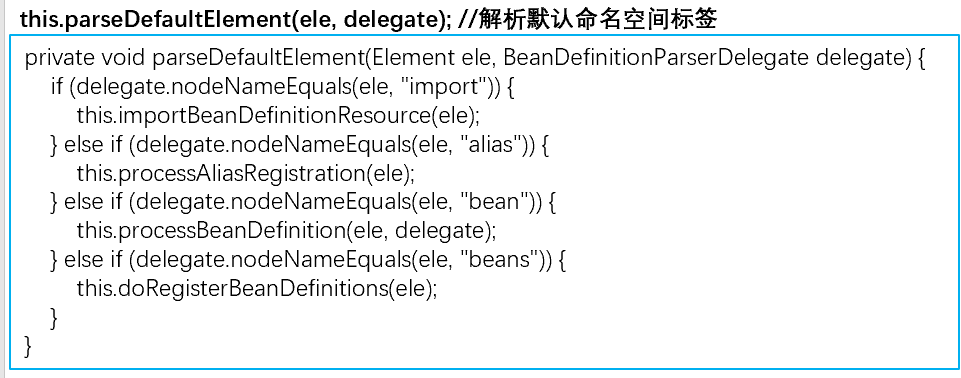  

- 如果是自定义命名空间，则执行parseCustomElement()方法。在执行resovle方法时，就是从Map<String, Object> handlerMappings中根据命名空间名称获得对应的处理器对象，此处是ContextNamespaceHandler，最终执行NamespaceHandler的parse方法。
- 在创建DefaultNamespaceHandlerResolver时，为处理器映射地址handlerMappingsLocation属性赋值，并加载命名空间处理器到Map<String, Object> handlerMappings 中去。用于DefaultBeanDefinitionDocumentReader的parseBeanDefinitions()方法中。

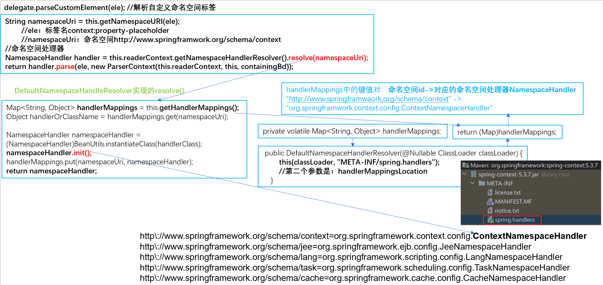  

- ContextNamespaceHandler，间接实现了NamespaceHandler接口，初始化方法init会被自动调用。由于context命名空间下有多个标签，所以每个标签又单独注册了对应的解析器，注册到了其父类NamespaceHandlerSupport的`Map<String,BeanDefinitionParser> parsers`

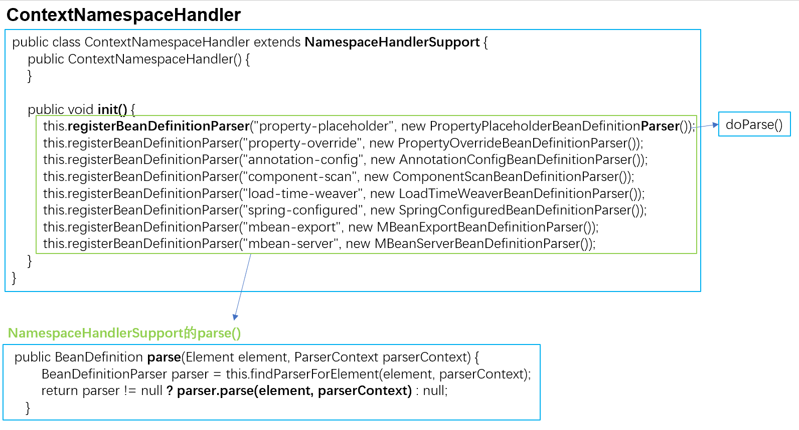  

## 外部命名空间标签的执行流程

1. 将自定义标签的约束 与 物理约束文件与网络约束名称的约束 以键值对形式存储到一个spring.schemas文件里，该文件存储在类加载路径的 META-INF里，Spring会自动加载到;
2. 将自定义命名空间的名称 与 自定义命名空间的处理器映射关系 以键值对形式存在到一个叫spring.handlers文件里，该文件存储在类加载路径的 META-INF里，Spring会自动加载到;
3. 准备好NamespaceHandler，如果命名空间只有一个标签，那么直接在parse方法中进行解析即可，一般解析结果就是注册该标签对应的BeanDefinition。如果命名空间里有多个标签，那么可以在init方法中为每个标签都注册一个BeanDefinitionParser，在执行NamespaceHandler的parse方法时在分流给不同的BeanDefinitionParser进行解析(重写doParse方法即可)。

  

## 框架与Spring的集成开发

- 效果是通过一个指示标签，向Spring容器中自动注入一个BeanPostProcessor

**步骤分析**：

1. 确定命名空间名称、schema虚拟路径、标签名称；

2. 编写schema约束文件haohao-annotation.xsd

3. 在类加载路径下创建META-INF目录，编写约束映射文件spring.schemas和处理器映射文件spring.handlers

4. 编写命名空间处理器 HaohaoNamespaceHandler，在init方法中注册HaohaoBeanDefinitionParser

5. 编写标签的解析器 HaohaoBeanDefinitionParser，在parse方法中注册HaohaoBeanPostProcessor

6. 编写HaohaoBeanPostProcessor

   ==========以上五步是框架开发者写的，以下是框架使用者写的===========

7. 在applicationContext.xml配置文件中引入命名空间

8. 在applicationContext.xml配置文件中使用自定义的标签

### 命名空间名称、schema虚拟路径、标签名称

- applicationContext.xml

```xml
<?xml version="1.0" encoding="UTF-8"?>
<beans xmlns="http://www.springframework.org/schema/beans"
       xmlns:xsi="http://www.w3.org/2001/XMLSchema-instance"
       xmln:myTest="http://www.zjk.com/myTest"   命名空间名称和标签名称
       xsi:schemaLocation="http://www.springframework.org/schema/beans 
                           http://www.springframework.org/schema/beans/spring-beans.xsd 
                           http://www.zjk.com/myTest  schema虚拟路径
                           http://www.zjk.com/myTest/myTest-annotation.xsd">
    <myTest:annotation-driven></myTest:annotation-driven>
</beans>
```

### schema约束文件

- 在resource下创建com/zjk/myTest/config存放每个标签的xsd文件。

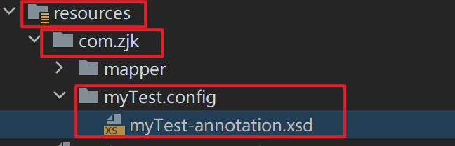  

```xml
<?xml version="1.0" encoding="utf-8" ?>
<xsd:schema xmlns="http://www.zjk.com/myTest" 命名空间
            xmlns:xsd="http://www.w3.org/2001/XMLSchema"
            targetNamespace="http://www.zjk.com/myTest">
    <xsd:element name="annotation-driven"></xsd:element>

</xsd:schema>
```

### META-INF目录

- 在schema约束文件的com/zjk/myTest/config的同一目录(resources)下创建META-INF目录。

  

#### spring.schemas 约束映射文件

- 配置映射关系：applcationContex.xml中的xsi:schemaLocation和真实的xsd文件路径的映射。

```properties
http\://www.zjk.com/myTest/myTest-annotation.xsd=com/zjk/myTest/config/myTest-annotation.xsd
```

#### spring.handlers 处理器映射文件

- 配置映射关系：applcationContex.xml中的xsi:schemaLocation和真实的命名空间处理器路径的映射

```properties
http\://www.zjk.com/myTest=com.zjk.handlers.MyTestNamespaceHandler
```

### 命名空间处理器 NamespaceHandler

```java
public interface NamespaceHandler {
    void init();

    @Nullable
    BeanDefinition parse(Element var1, ParserContext var2);

    @Nullable
    BeanDefinitionHolder decorate(Node var1, BeanDefinitionHolder var2, ParserContext var3);
}
```

- 通常选择extends NamespaceHandlerSupprtor只需要实现init()方法即可，其他方法已经准备。

- 如果是implements NamespaceHandler，则需要实现init()、parse()、decorate()方法。

- 一般情况下，一个命名空间下有多个标签，在init()方法中为每一个标签注册一个命名空间处理器。`this.registerBeanDefinitionParser("标签名",parser)`

```java
public class MyTestNamespaceHandler extends NamespaceHandlerSupport {
    @Override
    public void init() {
        //this.registerBeanDefinitionParser("标签名",parser)
        this.registerBeanDefinitionParser("annotation-driven",new MyTestBeanDefinitionParser());
    }
}
```

### 标签的解析器 BeanDefinitionParser

```java
public class MyTestBeanDefinitionParser implements BeanDefinitionParser {
    @Override
    public BeanDefinition parse(Element element, ParserContext parserContext) {
        //注入BeanPostProcessor
        BeanDefinition beanDefinition = new RootBeanDefinition();
        beanDefinition.setBeanClassName("com.zjk.processor.MyTestBeanPostProcessor");
        parserContext.getRegistry().registerBeanDefinition("myTestBeanPostProcessor", beanDefinition);
        return beanDefinition;
    }
}
```

- 相应的BeanPostProcessor

```java
public class MyTestBeanPostProcessor implements BeanPostProcessor {
    @Override
    public Object postProcessAfterInitialization(Object bean, String beanName) throws BeansException {
        System.out.println("MyTestBeanPostProcessor");
        return BeanPostProcessor.super.postProcessAfterInitialization(bean, beanName);
    }
}
```

# Bean

### 配置类/文件 @Configuration、 `<beans>`

| 名称     | 配置类 SpringConfig.class          | 配置文件 beans.xml                  |
| -------- | ---------------------------------- | ----------------------------------- |
| 配置方式 | @Configuration                     | `<beans>`                           |
| 容器     | AnnotationConfigApplicationContext | ClassPathXmlApplicationContext      |
| 说明     |                                    | xml配置的根标签（可嵌套在根标签内） |

```java
@Configuration
public class ApplicationContextConfig {}
```

  

```java
//注解方式加载配置文件
AnnotationConfigApplicationContext applicationContext =  new AnnotationConfigApplicationContext(ApplicationContextConfig.class);
```

#### 环境切换 @Profile、profile

| 设置环境 | 说明                                                         |
| -------- | ------------------------------------------------------------ |
| profile  |                                                              |
| @Profile | @Profile 标注在类或方法上，标注当前产生的Bean从属于哪个环境，只有激活了当前环境，被标注的Bean才能被注册到Spring容器里，不指定环境的Bean，任何环境下都能注册到Spring容器里。<br />没有被@Profile标注的，都是默认处于激活的环境中。 |

- profile：

```xml
<beans xmlns="http://www.springframework.org/schema/beans"
       xmlns:xsi="http://www.w3.org/2001/XMLSchema-instance"
       xmlns:context="http://www.springframework.org/schema/context"
       xsi:schemaLocation="http://www.springframework.org/schema/beans 
                           http://www.springframework.org/schema/beans/spring-beans.xsd">
    <beans profile="环境名1">
    </beans>

    <beans profile="环境名2">
    </beans>
</beans>
```

- @Profile：

```java
@Repository("userDao")
@Profile("test")
public class UserDaoImpl implements UserDao{}

@Component
public class OtherBean {
    @Bean("service")
    @Profile("test")
    public UserService userService(@Qualifier("userServiceImpl") UserService userService) {
        return userService;
    }
}
```

| 激活环境 | 语句                                                         |
| -------- | ------------------------------------------------------------ |
| JVM      | ` -Dspring.profiles.active=环境名`                           |
| 代码     | `System.setProperty("spring.profiles.active","环境名")`<br />必须在加载配置文件创建Spring容器前 |

- 默认激活最外层的`<beans>`；如果激活了子级的`<beans>`，则其父级也被激活。即：如果激活了最内层的`<beans>`则依次向外激活直到最外层的`<beans>`也被激活。
- 如果外层和内存的`<beans>`存在相同id或class的`<bean>`，在二者都被激活的情况下，如果是getBean(id)或getBean(class)会出错。

```xml
<beans xmlns="http://www.springframework.org/schema/beans"
       xmlns:xsi="http://www.w3.org/2001/XMLSchema-instance"
       xmlns:context="http://www.springframework.org/schema/context"
       xsi:schemaLocation="http://www.springframework.org/schema/beans
                           http://www.springframework.org/schema/beans/spring-beans.xsd
                           http://www.springframework.org/schema/context
                           http://www.http://www.springframework.org/schema/context/spring-context.xsd">
    <bean id="service" class="com.zjk.service.impl.UserServiceImpl"></bean>
    <beans profile="dev">
        <bean id="userService" class="com.zjk.service.impl.UserServiceImpl">
            <property name="userDao" ref="userDao"></property>
        </bean>
        <bean id="userDao" class="com.zjk.dao.impl.UserDaoImpl"></bean>
    </beans>
    <beans profile="test">
        <bean id="userDao" class="com.zjk.dao.impl.UserDaoImpl"></bean>
    </beans>
</beans>
```

```java
System.setProperty("spring.profiles.active", "dev"); //必须在加载配置文件创建Spring容器前
ApplicationContext applicationContext = new ClassPathXmlApplicationContext("applicationContext.xml");
UserService userService = applicationContext.getBean("userService",UserService.class);
```

#### 导入 @Import、`<import>`

| 导入方式   | 说明                                                         |
| ---------- | ------------------------------------------------------------ |
| @Import    | 加载其他配置类<br />替代原有xml中的`<import resource="classpath:beans.xml"/>`配置。 |
| `<import>` | 导入其他配置文件<br />相当于在该配置文件最外层的`<beans>`内加入其他配置文件的`<beans>`的内容。 |

- 如果使用`<import>`导入的配置文件的子级`<beans>`：只需要激活该环境即可，和普通子级`<beans>`的使用相同。
- `<import>`：

```xml
<beans xmlns="http://www.springframework.org/schema/beans"
       xmlns:xsi="http://www.w3.org/2001/XMLSchema-instance"
       xmlns:context="http://www.springframework.org/schema/context"
       xsi:schemaLocation="http://www.springframework.org/schema/beans 
                           http://www.springframework.org/schema/beans/spring-beans.xsd">

    <import resource="classpath:类路径配置文件名(同一个resources目录下的)"></import>

</beans>
```

```xml
<!--导入用户模块配置文件-->
<import resource="classpath:UserModuleApplicationContext.xml"/>
<!--导入商品模块配置文件-->
<import resource="classpath:ProductModuleApplicationContext.xml"/>**` `**
```

- @Import：

```java
@Configuration
@ComponentScan
@PropertySource("classpath:jdbc.properties")
@Import(OtherConfig.class)
public class ApplicationContextConfig {}
```

#### 组件扫描 @ComponentScan、context:component-scan

##### 包扫描

| 组件扫描                                    | 说明                                                         |
| ------------------------------------------- | ------------------------------------------------------------ |
| @Component("base-package")                  | 指定一个或多个包名：扫描指定包及其子包下使用注解的类<br />不配置包名：扫描当前@componentScan注解配置类所在包及其子包下的类<br />多个包扫描：`{"包1","包2"}` |
| `<context:component-scan base-package=""/>` |                                                              |

```xml
<context:component-scan base-package="com.zjk"/>
```

```java
@Configuration
@ComponentScan("com.zjk")
public class ApplicationContextConfig {
}
```

```java
@Configuration
@ComponentScan({"com.zjk.service","com.zjk.dao"})
public class ApplicationContextConfig {
}
```

##### Bean加载控制

###### 精确范围

```java
@Component({"com.zjk.service","com.zjk.dao"})
```

###### 过滤器 excludeFilters、includeFilgters

| 过滤器          | 说明                                 |
| --------------- | ------------------------------------ |
| excludeFilters  | 设置扫描加载bean时，排除的过滤规则。 |
| includeFilgters | 加载指定的bean。                     |

| type属性        | 说明                                |
| :-------------- | :---------------------------------- |
| ANNOTATION      | 按照注解排除                        |
| ASSIGNABLE_TYPE | 按照指定的类型过滤                  |
| ASPECTJ         | 按照Aspectj表达式排除，基本上不会用 |
| REGEX           | 按照正则表达式排除                  |
| CUSTOM          | 按照自定义规则排除                  |

```java
@ComponentScan(value = "com.zjk",
        excludeFilters = @ComponentScan.Filter(
                type = FilterType.ANNOTATION, //指定注解类型的Bean
                classes = Controller.class //排除指定注解的Bean
        )
)
```

##### 组件扫描原理

 

 

###### component-scan

- component-scan是一个context命名空间下的自定义标签，要找到对应的命名空间处理器（NamespaceHandler）和解析器，查看spring-context包下的spring.handlers文件。将标注的@Component的类生成的对应的BeanDefiition进行了注册。

```xml
<context:conponent-scan base-package="com.zjk"></context>
```


###### @ComponentScan

- AnnotationConfigApplicationContext容器在进行创建时，内部调用了如下代码，该工具注册了几个Bean后处理器。

```java
AnnotationConfigUtils.registerAnnotationConfigProcessors(this.registry)
```

- 其中，ConfigurationClassPostProcessor 是一个 BeanDefinitionRegistryPostProcessor，经过一系列源码调用，最终也被指定到了ClassPathBeanDefinitionScanner 的doScan 方法（与xml方式最终终点一致）。

  

      

#### properties资源加载 @PropertySource、`<context:property-placeholder>`

| 类型       | 加载外部properties资源配置                    |
| ---------- | --------------------------------------------- |
| Annotation | @PropertySource                               |
| xml        | `<context:property-placeholder location=""/>` |

```java
@Configuration
@ComponentScan
@PropertySource({"classpath:jdbc.properties","classpath:xxx.properties"})
public class ApplicationContextConfig {}
```

#### 同类型注入优先 @Primary

- @Primary：标注相同类型的Bean优先被使用权。与@Component、@Bean一起使用，标注该Bean的优先级更高。

> 通过类型获取Bean（getBean(class)）、@Autowired根据类型进行注入时，会选用优先级更高的Bean。
>
> @Qualifier指定名称注入，而不是优先级。

```java
@Repository
@Primary
public class UserDaoImpl implements UserDao{}

@Repository
public class UserDaoImpl2 implements UserDao{}
```

```java
@Bean
@Primary
public UserDao getUserDao01(){return new UserDaoImpl();}

@Bean
public UserDao getUserDao02(){return new UserDaoImpl2();}
```

### Bean配置 `<bean>`

| xml                                         | Annotation     | 功能描述                                                     |
| :------------------------------------------ | -------------- | :----------------------------------------------------------- |
| `<bean id="" class="">`                     | @Component     | Bean的id和全限定名配置；<br>在指定扫描范围内被Spring加载并实例化 |
| `<bean name="">`                            |                | Bean的别名                                                   |
| `<bean scope="">`                           | @Scope         | Bean的作用范围<br>BeanFactory作为容器时取值singleton和prototype |
| `<bean lazy-init="">`                       | @Lazy          | Bean的实例化时机，是否延迟加载。BeanFactory作为容器时无效    |
| `<bean init-method="">`                     | @PostConstruct | Bean实例化后自动执行的初始化方法，method指定方法名           |
| `<bean destroy-method="">`                  | @PreDestroy    | Bean实例销毁前的方法<br />method指定方法名                   |
| `<bean autowire="byType"> `                 |                | 设置自动注入模式<br />按照类型byType、按照名字byName         |
| `<bean factory-bean="" factory-method=""/>` | @Bean          | 指定工厂Bean的方法完成Bean的创建                             |

#### 基础配置 @Component

| 方式   | @Component("beanName") | `<bean id="" class="">` |
| ------ | ---------------------- | ----------------------- |
| 默认id | 类名首字母小写         | 全限定名                |

> id：存储到Spring容器 （singletonObjects单例池）中的Bean的beanName。
>
> class：实例对应的类。

| 构造型      | 层次    |
| :---------- | :------ |
| @Repository | Dao     |
| @Service    | Service |
| @Controller | Web     |

- bean标签：

```xml
<bean id="userDao" class="com.zjk.dao.impl.UserDaoImpl"></bean>
<bean class="com.zjk.dao.impl.UserDaoImpl"></bean>
```

```java
applicationContext.getBean("com.zjk.dao.impl.UserDaoImpl")
```

- @Component：

```java
@Component
public class UserDaoImpl implements UserDao {
}
```

```java
ApplicationContext applicationContext = new ClassPathXmlApplicationContext("applicationContext.xml");
UserDaoImpl userDao = applicationContext.getBean("userDaoImpl", UserDaoImpl.class);
System.out.println(userDao);
```

#### 别名配置 name、`<alias>`

- Bean可以指定多个别名，根据别名可以获得Bean对象、在配置文件中使用该别名（和id一样的用法）。

- beanFactory中维护`Map<String,String> aliasMap`：存储别名和beanName之间的映射关系。

| 情景     | beanName                                      |
| -------- | --------------------------------------------- |
| id存在   | 别名指向id，singletoObjects中的beanName使用id |
| id不存在 | singletonObjects中的beanName使用第一个别名    |

   

- name：对于多个别名，别名之间使用逗号`,`分隔： 

```xml
<bean id="userDao" name="别名" class="com.zjk.dao.impl.UserDaoImpl"></bean>
<bean id="userDao" name="alia1,alia2" class="com.zjk.dao.impl.UserDaoImpl"></bean>
```

- `<alas>`：

```xml
<bean id="Bean的id(userService)" name="别名1"></bean>
<alias name="添加别名的Bean的id(userService)" alias="别名2"></alias>   
```

```xml
<bean id="userService" class="com.zjk.service.impl.UserServiceImpl"></bean>
<alias name="userService" alias="service"></alias>
```

#### 范围配置 @Scope 、scope

- Spring-Context环境Bean的作用范围有两个：Singleton、Prototype。
- Spring-webmvc环境：request、session。

| 范围      | 说明                                                         |
| --------- | ------------------------------------------------------------ |
| singleton | 单例，默认值。<br/>Spring容器创建的时候，就会进行Bean的实例化，并存储到容器内部的单例池singletonObjects中。<br/>每次getBean()时都是从单例池中获取相同的Bean实例。 |
| prototype | 原型。<br/>pring容器初始化时不会创建Bean实例，当调用getBean()时才会实例化Bean。<br/>每次getBean()都会创建一个新的Bean实例。信息存放在 beanDefinitionMap 。 |

```xml
<bean id="userDao" class="com.zjk.dao.impl.UserDaoImpl" scope="singleton"></bean>
```

```java
@Scope("singleton")
public class UserDaoImpl{}
```

#### 延迟加载  @Lazy、lazy-init

- 延迟加载：Spring容器创建时，不会立即创建Bean实例，等到需要时再创建Bean实例并存储到单例池中，后续使用该Bean则从单例池获取，仍然是单例。

```xml
<bean id="userDao" class="com.zjk.dao.impl.UserDaoImpl" lazy-init="true"></bean>
```

```java
@Lazy(true)
public class UserDaoImpl{}
```

#### 初始化、销毁

- Bean实例化后，可以执行指定的初始化方法完成一些初始化的操作；Bean销毁前也可以执行指定的销毁方法完成一些操作。

> ClassPathXmlApplicationContext类的close()方法关闭容器时会销毁其中的Bean。

> Bean的销毁不一定调用Bean的销毁方法：有可能在Spring容器关闭之后，还未来得及调用Bean的销毁方法，尽管如此Bean还是被销毁了。

| 方式 | 初始化               | 销毁                    |
| ---- | -------------------- | ----------------------- |
| xml  | init-method="method" | destory-method="method" |
| 注解 | @PostConstruct       | @PreDestory             |

> @PostConstruct和 @PreDestroy注解位于javax.annotation包，需要引入javax.annotation-api依赖。

- xml：

```xml
<bean id="userDao" class="com.zjk.dao.impl.UserDaoImpl" init-method="init" destory-method="destory"></bean>
```

```java
public class UserDaoImpl implements UserDao {
    public void init(){ System.out.println("初始化方法..."); }
    public void destroy(){ System.out.println("销毁方法..."); }
}
```

- Annotation：

```java
public class UserDaoImpl implements UserDao {
    @PostConstruct
    public void init(){ System.out.println("初始化方法..."); }
    @PreDestory
    public void destroy(){ System.out.println("销毁方法..."); }
}
```

### DI 依赖注入

> setXxx()方法注入的属性值会覆盖给属性赋值的。
>
> ```java
> //最终username属性为tom。
> @Component
> public class UserDaoImpl implements UserDao {
>  @Value("zjk")
>  private String username;
> 
>  @Value("tom")
>  public void setUsername(String username) {
>      this.username = username;
>  }
> }
> ```

> 隐式注入：只有一个构造器的，其属性由Spring自动注入。

#### xml

| 注入方式 | xml                                                          |
| -------- | ------------------------------------------------------------ |
| set()    | `<property name="userDao" ref="userDao"/>` <br />`<property name="userDao" value="haohao"/>` |
| 构造器   | `<constructor-arg name="name" ref="userDao"/>` <br />`<constructor-arg name="name" value="haohao"/>` |

| 数据类型                               | xml                       |
| -------------------------------------- | ------------------------- |
| 普通数据<br />（基本数据类型、String） | value                     |
| 引用                                   | ref                       |
| 集合                                   | `<list><set><map><props>` |

```xml
<bean id="userService" class="com.zjk.service.impl.UserServiceImpl">
    <property name="属性">
        <value>hello</value> 
        <!--String（不需要双引号""）如果带上引号，则赋值的是："hello"而不是hello-->
    </property>
</bean>

<bean id="userService" class="com.zjk.service.impl.userService">
    <property name="name" value="hello"></property>
</bean>
```

```xml
<bean id="dao1" class="com.zjk.dao.impl.UserDaoImpl"></bean>
```

| 集合         | `<property>`对应标签                                     |
| :----------- | :------------------------------------------------------- |
| `List<T>`    | `<list>`                                                 |
| `Set<T>`     | `<set>`                                                  |
| `Map<T>`     | `<map>`内部`<entry key或key-ref="" value或value-ref="">` |
| `Properties` | `<props>`内部`<prop key="">value</prop>`                 |

```xml
<bean id="dao1" class="com.zjk.dao.impl.UserDaoImpl"></bean>
<bean id="dao2" class="com.zjk.dao.impl.UserDaoImpl"></bean>
<bean id="dao3" class="com.zjk.dao.impl.UserDaoImpl"></bean>

<!--引用类型-->
<bean id="userService" class="com.zjk.service.impl.UserServiceImpl">
    <property>
        <ref bean="dao1"> <!--对id=dao1的bean标签的引用-->
        <bean id="dao2" class="com.zjk.dao.impl.UserDaoImpl"></bean>
    </property>
</bean>

<!--List-->
<bean id="userService" class="com.zjk.service.impl.UserServiceImpl">
    <property name="userDaoList">
        <list>
            <ref bean="dao1"></ref>
            <bean id="dao2" class="com.zjk.dao.impl.UserDaoImpl"></bean>
            <bean id="dao3" class="com.zjk.dao.impl.UserDaoImpl"></bean>
        </list>
    </property>
</bean>
    
<!--Map-->
<bean id="userService" class="com.zjk.service.impl.UserServiceImpl">
    <property name="userDaoMap">
        <map>
            <entry key="1" value-ref="dao1"></entry>
            <entry key="2" value-ref="dao2"></entry>
            <entry key="3" value-ref="dao3"></entry>
        </map>
    </property>
</bean>

<!--properties-->
<context:property-placeholder location="classpath:jdbc.properties"/>
<bean id="userService" class="com.zjk.service.impl.UserServiceImpl">
    <property name="properties">
        <props>
            <prop key="username">zjk</prop>
            <prop key="password">123</prop>
        </props>
    </property>
</bean>
```

- autowire：如果被注入的属性类型是Bean引用，可以在`<bean>` 标签中使用 autowire 属性去配置自动注入方式。

```xml
<bean id="userService" class="com.zjk.service.impl.UserServiceImpl" autowire="byName"></bean>
<bean id="userDao" class="com.zjk.dao.impl.UserDaoImpl"></bean>
```

```xml
<bean id="userService" class="com.zjk.service.impl.UserServiceImpl" autowire="byType"></bean>
<bean id="userDao" class="com.zjk.dao.impl.UserDaoImpl"></bean>
```


| 注解       | 数据类型                     | 位置       |
| ---------- | ---------------------------- | ---------- |
| @Value     | 普通数据                     | 字段、方法 |
| @Autowired | 类型（byType）注入<br />缺省 | 字段、方法 |
| @Qualifier | 名称注入<br />结合@Autowired | 字段、方法 |
| @Resource  | 类型/名称注入                | 字段、方法 |

#### @PropertySource

1. 加载properties文件到Spring容器。

```java
@Configuration
@PropertySource("classpath:jdbc.properties")
public class SpringConfig{}
```

2. @Value在载入properties文件后，SpEL表达式注入properties文件中的属性。

```java
@Component
public class UserDaoImpl implements UserDao {
    @Value("${jdbc.username}")
    private String username;

    public String getUsername() {
        return username;
    }
}
```

#### 自动装配

| 注解                       | 属性   | 说明                                                         |
| -------------------------- | ------ | ------------------------------------------------------------ |
| @Autowired                 | byName | 属性名自动装配：匹配 setXxx()和id，在配置文件查找id="xxx"（或name="xxx"）的`<bean>` ，如果存在该`<bean>`则使用该Bean来装配。 |
| @Autowired<br />@Qualifier | byType | Bean的类型从容器中匹配：匹配setXxx(Yyy 参数)的数据类型Yyy，在配置文件中查找class的类型是Yyy的。<br />只要和set()方法的参数类型匹配，就会为该set()方法提供参数。  <br />同一类型只能匹配一个`<bean>`，匹配出多个相同Bean类型时（class相同：包括继承、实现），报错。 |


##### @Autowired

- 同一类型的Bean实例只有一个时：

```java
@Service
public class UserServiceImpl implements UserService {
    @Autowired
    private UserDao userDao;

    @Autowired
    public void show(UserDao userDao) {
        System.out.println("show:" + userDao);
    }
}
```

```java
@Repository
public class UserDaoImpl implements UserDao{}
```

- 同一类型的Bean实例存在多个时：

| 注入数量                                  | 说明                                                         |
| :---------------------------------------- | :----------------------------------------------------------- |
| 只注入一个Bean实例                        | 当容器中同一类型的Bean实例有多个时，会尝试通过被注入属性的参数名称进行二次匹配。如果不存在匹配的beanName，则报错。 |
| 注入多个Bean实例 <br>List`<Bean实例类型>` | 将通过类型匹配的Bean实例都注入到集合中。                     |

```java
@Repository
public class UserDaoImpl implements UserDao{}
@Repository
public class UserDaoImpl2 implements UserDao{}
```

```java
@Service
public class UserServiceImpl implements UserService {

    @Autowired
    private UserDao userDaoImpl;

    public UserDao getUserDao() {
        return userDaoImpl;
    }

    @Resource
    public void setUserDao(UserDao userDao) {
        this.userDaoImpl = userDao;
    }
}
```

```java
@Autowired
public void show(List<UserDao> userDaoList){
    userDaoList.forEach(dao -> System.out.println(dao));
}
```

##### @Qualifier 指定名称注入

```java
public @interface Qualifier {
    String value() default "";
}
```

- @Qualifier配合@Autowired根据名称注入Bean实例。

```java
@Service
public class UserServiceImpl implements UserService {
    @Autowired
    @Qualifier("userDaoImpl")
    private UserDao userDao;

    public UserDao getUserDao() {
        return userDao;
    }

    @Autowired
    @Qualifier("userDaoImpl2")
    public void setUserDao(UserDao userDao) {
        this.userDao = userDao;
    }
}
```

##### @Resource

- @Resource注解存在于 javax.annotation 包中，Spring对其进行解析。

- @Resource：不指定名称参数name时-->根据类型注入，指定名称参数name时-->根据名称注入。

- 当存在多个相同类型的Bean实例时，不会像@Autowired一样报错。  

```java
@Service
public class UserServiceImpl implements UserService {
    @Resource
    private UserDao userDao;

    public UserDao getUserDao() {
        return userDao;
    }

    @Resource(name="userDaoImpl2")
    public void setUserDao(UserDao userDao) {
        this.userDao = userDao;
    }
}
```

### Bean实例化

| 实例化方式 | 说明                                         |
| ---------- | -------------------------------------------- |
| 构造方式   | 底层通过构造方法对Bean进行实例化             |
| 工厂方式   | 底层通过调用自定义的工厂方法对Bean进行实例化 |

#### 构造器 constructor-arg

- 对于多个构造方法：根据`<consturctor-arg>`的参数来选择相应的构造器。

**无参构造方法** 

**有参构造方法**

- 使用`<bean>`的内嵌标签`<consturctor-arg>`进行参数注入
- 只要是为了实例化Bean对象而传递的参数都可以通过`<constructor-arg>`标签完成

```xml
<consturctor-arg name="构造方法中的参数名称" value="参数的值"></consturctor-arg>
```

```xml
<bean id="userDao" name="com.zjk.dao.impl.UserDaoImpl">
    <consturctor-arg name="name" value="Tom"></consturctor-arg>
    <constructor-arg name="age" value="18"></constructor-arg>
</bean>
```

```java
public UserDaoImpl(String name,int age){
}
```

#### 工厂

- 静态工厂方法实例化Bean。
- 实例工厂方法实例化Bean。
- 实现FactoryBean规范延迟实例化Bean。

##### 静态工厂 factory-method

- 静态工厂：配置一个工厂Bean，提供一个静态方法用于生产Bean实例。而不需要配置被生产的Bean。

```xml
<bean id="getBean()获取Bean实例的id" class="工厂类的全限定名" factory-method="工厂类定义的get方法 ">
    <!--只要是为了实例化对象而传递的参数都可以通过`<constructor-arg>`标签完成-->
    <constructor-arg name="工厂类get方法的参数" value="参数值"></constructor-arg>
</bean>
```

```xml
<bean id="userDao" class="com.zjk.factory.UserDaoFactory" factory-method="getUserDao"></bean>
```

```java
public class UserDaoFactory {
    public static UserDaoImpl getUserDao(){
        return new UserDaoImpl();
    }
}
```

##### 实例工厂方法 @Bean、factory-bean

###### factory-bean

- 实例工厂方法：工厂对象调用非静态方法，先配置工厂Bean，再配置目标Bean。实例化Bean对象时，先实例化工厂Bean对象，再通过工厂Bean对象调用getXxx()来获取Bean对象。

```xml
<beans>
    <bean id="工厂类id" class="工厂类的全限定名"></bean>
    <bean id="获取Bean实例" class="Bean实例的全限定名" factory-bean="工厂类id" factory-method="工厂类的get方法">
        <constructor-arg name="工厂类get方法的参数" value="传入的值"></constructor-arg>
    </bean>
</beans>
```

```xml
<bean id="@Bean指定的beanName" factory-bean="外层的@Component注解的Bean实例" factory-method="工厂类的get方法"></bean>
```

```xml
<bean id="userDaoFactoryBean" class="com.zjk.factory.UserFactoryBean"></bean>
<bean id="userDao" class="com.zjk.dao.impl.UserDaoImpl" factory-bean="userDaoFactoryBean" factory-method="getUserDao">
    <constructor-arg name="name" value="Tom"></constructor-arg>
</bean>
```

```java
public class UserDaoFactoryBean {
    //非静态工厂方法
    public UserDao getUserDao(String name){
        return new UserDaoImpl();
    }
}
```

   

###### @Bean

- @Bean工厂方法参数注入：@Value、@Autowired、@Qualifier。
  - 参数列表内对单个参数注解。
  - 方法上对所有参数注解。
- @Bean将方法的返回值作为Bean实例注册到Spring容器中。@Bean("beanName")指定当前返回的Bean实例的beanName，如果不指定，则直接使用当前方法的名称(getDataSource)来作为当前Bean实例的beanName。

```java
@Component
public class OtherBean {
    @Bean("dataSource")
    public DruidDataSource dataSource(@Value("${jdbc.url}") String url,
                                         @Value("${jdbc.username}") String userName,
                                         @Value("1234") String password) {
        DruidDataSource dataSource = new DruidDataSource();
        dataSource.setUrl(url);
        dataSource.setUsername(userName);
        dataSource.setPassword(password);
        return dataSource;
    }

    @Bean("userDao")
    //@Autowired 可以省略@Autowired 
    public UserDao userDao(UserDaoImpl userDao){
        return userDao;
    }

    @Bean("dao")
    //@Autowired 可以省略@Autowired 
    public UserDao userService(@Qualifier("userDaoImpl2") UserDao dao) {
        //由于UserDao类型的Bean实例存在多个，需要使用@Qualifier指定注入的beanName
        return dao;
    }
}
```

##### FactoryBean接口

- 实现FactoryBean接口，再交给Spring管理即可。

```java
public interface FactoryBean<T> {
    String OBJECT_TYPE_ATTRIBUTE = "factoryBeanObjectType";
    T getObject() throws Exception; //获得实例对象方法
    Class<?> getObjectType(); //获得实例对象类型方法
    default boolean isSingleton() {
        return true;
    }
}
```

```xml
<bean id="工厂类" class="工厂类的全限定名"></bean>
```

- Spring容器创建时，FactoryBean被实例化并存储到singletonObjects中，但getObject() 方法尚未被执行，UserDaoImpl也没被实例化，当首次用到UserDaoImpl时，才调用getObject() 。此工厂方式产生的Bean实例不会存储到singletonObjects中，而是存储到factoryBeanObjectCache中，之后每次使用到userDao都从该缓存池中获取同一个userDao实例。

   

```xml
<bean id="userDao" class="com.zjk.factory.UserDaoFactoryBean"></bean>
```

```java
public class UserDaoFactoryBean implements FactoryBean<UserDao> {

    @Override
    public UserDao getObject() throws Exception {
        return new UserDaoImpl();
    }

    @Override
    public Class<?> getObjectType() {
        return UserDao.class;
    }

    @Override
    public boolean isSingleton() {
        return FactoryBean.super.isSingleton();
    }
}
```

#### 非自定义Bean

##### Druid

1. 导入依赖
2. 配置 DruidDataSource

```xml
<!-- mysql驱动 -->
<dependency>
    <groupId>mysql</groupId>
    <artifactId>mysql-connector-java</artifactId>
    <version>5.1.49</version>
</dependency>
<!-- druid数据源 -->
<dependency>
    <groupId>com.alibaba</groupId>
    <artifactId>druid</artifactId>
    <version>1.1.23</version>
</dependency>
```

- 源码

```java
DruidDataSource dataSource = new DruidDataSource();
dataSource.setDriverClassName("com.mysql.jdbc.Driver");
dataSource.setUrl("jdbc://localhost:3306/db1");
dataSource.setUsername("root");
dataSource.setPassword("1234");
```

- xml配置

```xml
<!--配置 DruidDataSource数据源-->
<bean class="com.alibaba.druid.pool.DruidDataSource">
    <!--配置必要属性-->
        <property name="driverClassName" value="com.mysql.jdbc.Driver"/>
        <property name="url" value="jdbc:mysql://localhost:3306/db1"/>
        <property name="username" value="root"/>
        <property name="password" value="root"/>
</bean>
```

##### Connection

- Connection 的产生是通过DriverManager的静态方法getConnection获取的，所以我们要用静态工厂方式配置

- 源码

```java
//Connection conn = druidDataSource.getConnection();
Connection conn = DriverManager.getConnection("jdbc:mysql://127.0.0.1:3306/db1","root","1234");
```

- applicationContext.xml配置

```xml
<!--
<bean class="java.lang.Class" factory-method="forName">
    <constructor-arg name="className" value="com.mysql.jdbc.Driver"/>
</bean>                   
-->factory-method="getConnection"可能会报错，不影响
<bean id="connection" class="java.sql.DriverManager" factory-method="getConnection" scope="prototype">
    <constructor-arg name="url" value="jdbc:mysql:///db1"/>
    <constructor-arg name="user" value="root"/>
    <constructor-arg name="password" value="root"/>
</bean>
```

##### Date

```java
//产生一个指定日期格式的对象，原始代码按如下：
String currentTimeStr = "2023-08-27 07:20:00";
SimpleDateFormat simpleDateFormat = new SimpleDateFormat("yyyy-MM-dd HH:mm:ss");
Date date = simpleDateFormat.parse(currentTimeStr);
```

```xml
<bean id="dateFactoryBean" class="java.text.SimpleDateFormat">
    <constructor-arg value="yyyy-mm-dd HH:mm:ss"/>
</bean>
<bean id="date" class="java.util.Date" factory-bean="dateFactoryBean" factory-method="parse">
    <constructor-arg value="2023-04-03 17:44:20"/>
</bean>
```

- 如果需要自己提供值或改变值，而不只是配置文件内的设定值（可以看作默认值），可以对getBean()得到的Bean实例进行操作。

##### MyBatis

1. 导入MyBatis的相关坐标
2. SqlSessionFactory交由Spring管理配置

```xml
<!--mybatis框架-->
<dependency>
    <groupId>org.mybatis</groupId>
    <artifactId>mybatis</artifactId>
    <version>3.5.5</version>
</dependency>
<!-- mysql驱动 -->
<dependency>
    <groupId>mysql</groupId>
    <artifactId>mysql-connector-java</artifactId>
    <version>5.1.49</version>
</dependency>
```

- 源码

```java
//加载mybatis核心配置文件，使用Spring静态工厂方式
InputStream in = Resources.getResourceAsStream(“mybatis-conifg.xml”);
//创建SqlSessionFactoryBuilder对象，使用Spring无参构造方式
SqlSessionFactoryBuilder builder = new SqlSessionFactoryBuilder();
//调用SqlSessionFactoryBuilder的build方法，使用Spring实例工厂方式
SqlSessionFactory sqlSessionFactory = builder.build(in);
```

- applicationContext.xml配置

```xml
<!--静态工厂方式产生Bean实例-->
<bean id="inputStream" class="org.apache.ibatis.io.Resources" factory-method="getResourceAsStream">
    <constructor-arg name="resource" value="mybatis-config.xml"/>
</bean>
<!--无参构造方式产生Bean实例-->
<bean id="sqlSessionFactoryBuilder" class="org.apache.ibatis.session.SqlSessionFactoryBuilder"/>
<!--实例工厂方式产生Bean实例-->
<bean id="sqlSessionFactory" factory-bean="sqlSessionFactoryBuilder" factory-method="build">
    <constructor-arg name="inputStream" ref="inputStream"/>
</bean>
```

### 后处理器

- Spring的后处理器是Spring对外开发的重要扩展点，允许我们介入到Bean的整个实例化流程中来，以达到动态注册BeanDefinition，动态修改BeanDefinition，以及动态修改Bean的作用。

| 后处理器                                     | 执行时机                                                   |
| -------------------------------------------- | ---------------------------------------------------------- |
| BeanFactoryPostProcessor（Bean工厂后处理器） | BeanDefinitionMap填充完毕，Bean实例化之前执行              |
| BeanPostProcessor（Bean后处理器）            | 一般在Bean实例化之后，填充到单例池singletonObjects之前执行 |

##### Bean工厂后处理器 – BeanFactoryPostProcessor

###### BeanFactoryPostProcessor

- BeanFactoryPostProcessor接口规范：该接口的实现类如果交由Spring容器管理，则Spring自动回调该接口的方法，对BeanDefinition注册、修改。
  - 如果在postProcessBeanFactory()中修改了BeanDefinition的className，那么不能使用class来getBean()。

```java
public interface BeanFactoryPostProcessor {
    void postProcessBeanFactory(ConfigurableListableBeanFactory beanFactory);
}
```

###### ConfigurableListableBeanFactory

- postProcessBeanFactory的参数ConfigurableListab实质上是**DefaultListableBeanFactory**。可以对beanDefinitionMap中的BeanDefinition进行操作。

   

- applicationContext.xml

```xml
<?xml version="1.0" encoding="UTF-8"?>
<beans xmlns="http://www.springframework.org/schema/beans"
       xmlns:xsi="http://www.w3.org/2001/XMLSchema-instance"
       xsi:schemaLocation="http://www.springframework.org/schema/beans
                           http://www.springframework.org/schema/beans/spring-beans.xsd">
    <bean class="com.zjk.processor.MyBeanFactoryProcessor"></bean>
    <bean id="userDao" class="com.zjk.dao.impl.UserDaoImpl"></bean>
    <bean id="userService" class="com.zjk.service.impl.UserServiceImpl">
<!--        <property name="userDao" ref="userDao"></property>-->
    </bean>
</beans>
```

- MyBeanFactoryProcess

```java
public class MyBeanFactoryProcessor implements BeanFactoryPostProcessor {

    @Override
    public void postProcessBeanFactory(ConfigurableListableBeanFactory configurableListableBeanFactory) throws BeansException {
        //修改BeanDefinition
        //1.获取指定BeanDefinition
        BeanDefinition userService = configurableListableBeanFactory.getBeanDefinition("userService");
        //2.将UserService修改为UserDao对象
        userService.setBeanClassName("com.zjk.dao.impl.UserDaoImpl");

        //注册BeanDefinition
        //1.新建RootBeanDefinition对象
        BeanDefinition personDao = new RootBeanDefinition();
        //2.设置RootBeanDefinition对象的class
        personDao.setBeanClassName("com.zjk.dao.impl.PersonDaoImpl");
        //3.强转为DefaultListableBeanFactory
        DefaultListableBeanFactory defaultListableBeanFactory = (DefaultListableBeanFactory) configurableListableBeanFactory;
        //4.注册到BeanDefinitionMap中 registerBeanDefinition("id",beanDefinition)
        defaultListableBeanFactory.registerBeanDefinition("personDao",personDao);

        //使用BeanDefinitionRegistryPostProcessor进行注册
    }
}
```

- test

```java
ApplicationContext applicationContext = new ClassPathXmlApplicationContext("applicationContext.xml");
UserDao userService = (UserDao) applicationContext.getBean("userService"); //只能使用id来getBean()
System.out.println(userService); //com.zjk.dao.impl.UserDaoImpl@4fb61f4a

PersonDao personDao = applicationContext.getBean("personDao", PersonDao.class);
System.out.println(personDao);
```

###### BeanDefinitionRegistryPostProcessor

- BeanDefinitionRegistryPostProcessor：专门用于注册BeanDefinition操作的接口。

```java
public interface BeanDefinitionRegistryPostProcessor extends BeanFactoryPostProcessor {
    void postProcessBeanDefinitionRegistry(BeanDefinitionRegistry var1) throws BeansException;
}
```

- postProcessBeanDefinitionRegistry(BeanDefinitionRegistry beanDefinitionRegistry) 
- postProcessBeanFactory(ConfigurableListableBeanFactory configurableListableBeanFactory) 

```java
public class MyBeanDefinitionRegistryPostProcessor implements BeanDefinitionRegistryPostProcessor {
    @Override
    public void postProcessBeanDefinitionRegistry(BeanDefinitionRegistry beanDefinitionRegistry) throws BeansException {
        //1.新建RootBeanDefinition对象
        //2.设置RootBeanDefinition对象的className
        //3.注册到BeanDefinitionMap中 registerBeanDefinition("id",beanDefinition)
    }

    @Override
    public void postProcessBeanFactory(ConfigurableListableBeanFactory configurableListableBeanFactory) throws BeansException {

    }
}
```

- 执行顺序：BeanDefinitionRegistryPostProcessor的(postProcessBeanDefinitionRegistry > postProcessBeanFactory) > BeanFactoryPostProcessor的postProcessBeanFactory。

```xml
<bean class="com.zjk.processor.MyBeanDefinitionRegistryPostProcessor"></bean>
```

```java
public class MyBeanDefinitionRegistryPostProcessor implements BeanDefinitionRegistryPostProcessor {
    @Override
    public void postProcessBeanDefinitionRegistry(BeanDefinitionRegistry beanDefinitionRegistry) throws BeansException {
        //注册
        //1.新建RootBeanDefinition对象
        BeanDefinition personDao = new RootBeanDefinition();
        //2.设置RootBeanDefinition对象的class
        personDao.setBeanClassName("com.zjk.dao.impl.PersonDaoImpl");
        //3.注册到BeanDefinitionMap中 registerBeanDefinition("id",beanDefinition)
        beanDefinitionRegistry.registerBeanDefinition("personDao",personDao);
    }

    @Override
    public void postProcessBeanFactory(ConfigurableListableBeanFactory configurableListableBeanFactory) throws BeansException {

    }
}
```

##### Bean后处理器 – BeanPostProcessor

- Bean后处理器：实现了该接口并被容器管理的BeanPostProcessor会在创建每个Bean的流程节点上被Spring自动调用。

> @Nullable 标识，方法可以不被实现。

| 方法参数        | 说明                                 |
| --------------- | ------------------------------------ |
| Object bean     | 当前被实例化的Bean                   |
| String beanName | 当前Bean在容器中的名称               |
| 返回值          | 加入到singletonObjects单例池中的bean |

```java
public interface BeanPostProcessor {
    //在属性注入完毕，init初始化方法执行之前被回调
    @Nullable
    default Object postProcessBeforeInitialization(Object bean, String beanName) throws BeansException {
        return bean;
    }
    //在init初始化方法执行之后，被添加到单例池singletonObjects之前被回调
    @Nullable
    default Object postProcessAfterInitialization(Object bean, String beanName) throws BeansException {
        return bean;
    }
}
```

- Proxy 动态代理在运行期间执行增强操作：
  
  - 代理设计模式和包装设计模式。
  
  - 使用动态代理 对目标bean进行增强，返回proxy对象，存储在singletonObjects单例池中。
  
  - 主要是在postProcessAfterInitialization(Object bean, String beanName)中，对已经init初始化的bean进行增强。

```java
public class TimeLogBeanPostProcessor implements BeanPostProcessor {

    @Override
    public Object postProcessAfterInitialization(Object bean, String beanName) throws BeansException {
        Object beanProxy = Proxy.newProxyInstance(
                bean.getClass().getClassLoader(),
                bean.getClass().getInterfaces(),
                //new InvocationHandler()
                (proxy, method, args) -> {
                    //1.输出开始时间
                    System.out.println(method.getName() + "开始：" + new Date().getTime());
                    //2.输出目标方法
                    Object result = method.invoke(bean, args);
                    //3.输出结束时间
                    System.out.println(method.getName() + "结束：" + new Date().getTime());
                    return result;
                }
        );

        return beanProxy; //返回 的是包装后的proxy对象
    }
}
```

### Bean生命周期

- Spring Bean的生命周期：从 Bean 实例化之后（反射创建出对象之后），到Bean成为一个完整对象，最终存储到单例池。

| Bean所处阶段 | 说明                                                         |
| ------------ | ------------------------------------------------------------ |
| 实例化       | 取出BeanDefinition的信息进行判断当前Bean的范围是否是singleton的，是否是延迟加载的，是否是FactoryBean等，最终将一个普通的singleton的Bean通过反射进行实例化。 |
| 初始化       | Bean创建之后仅是个"半成品"，需要对Bean实例的属性进行填充、执行一些Aware接口方法、执行BeanPostProcessor方法、执行InitializingBean接口的初始化方法、执行自定义初始化init方法等。 |
| 完成         | 完整的Spring Bean被存储到单例池singletonObjects。            |

 

#### 实例化阶段

##### 基本流程

1. 加载xml配置文件，解析获取配置中的每个`<bean>`的信息，封装成一个个的BeanDefinition对象;

2. 将BeanDefinition存储在一个名为beanDefinitionMap的Map<String,BeanDefinition>中;

3. ApplicationContext底层遍历beanDefinitionMap，创建Bean实例对象;

4. 创建好的Bean实例对象，被存储到一个名为singletonObjects的Map<String,Object>中;

5. 当执行applicationContext.getBean(beanName)时，从singletonObjects去匹配Bean实例返回。
   
      

##### beanDefinitionMap

- Spring容器在进行初始化时，会将xml配置的`<bean>`的信息封装成一个BeanDefinition对象，所有的BeanDefinition存储到一个名为beanDefinitionMap（Map），Spring框架在对该Map进行遍历，使用反射创建Bean实例对象，创建好的Bean对象存储在singletonObjects（Map），当调用getBean()方法时则最终从singletonObjects中取出Bean实例对象返回。

   

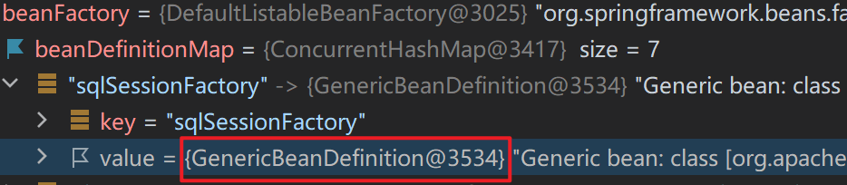   

- BeanDefinition接口：RootBeanDefinition。

   

##### DefaultListableBeanFactory

- DefaultListableBeanFactory对象内部维护着一个Map（beanDefinitionMap）：存储封装好的BeanDefinition。

```java
public class DefaultListableBeanFactory extends ... implements ... {
    //存储<bean>标签对应的BeanDefinition对象
    //key:是Bean的beanName，value:是Bean定义对象BeanDefinition
    private final Map<String, BeanDefinition> beanDefinitionMap;
}
```

- Spring框架会取出beanDefinitionMap中的每个BeanDefinition信息，反射构造方法或调用指定的工厂方法生成Bean实例对象：只要将BeanDefinition注册到beanDefinitionMap这个Map中，Spring就会进行对应的Bean的实例化操作。

   

##### Bean实例、单例池singletonObjects

- beanDefinitionMap中的BeanDefinition会被转化成对应的Bean实例对象，存储到单例池singletonObjects中去，在DefaultListableBeanFactory的上四级父类DefaultSingletonBeanRegistry中，维护着singletonObjects。

```java
public class DefaultSingletonBeanRegistry extends ... implements ... {
    //存储Bean实例的单例池
    //key:是Bean的beanName，value:是Bean的实例对象
    private final Map<String, Object> singletonObjects = new ConcurrentHashMap(256);
}
```

   

#### 初始化阶段

1. Bean实例的属性填充。
2. Aware接口属性注入。
3. BeanPostProcessor的Object postProcessBeforeInitialization(Object bean, String beanName)方法回调。
4. InitializingBean接口的afterPropertiesSet()初始化方法回调。
5. 自定义初始化方法init回调 init-method。
6. BeanPostProcessor的Object postProcessAfterInitialization(Object bean, String beanName)方法回调。

##### Bean实例属性填充、三级缓存

###### Bean实例属性填充

- BeanDefinition将当前Bean实体的注入信息存储在propertyValues属性。

   

| 属性注入     | 说明                                                         |
| ------------ | ------------------------------------------------------------ |
| 普通属性     | String、int、存储基本类型的集合时，直接通过set方法的反射设置 |
| 单向对象引用 | 从容器中getBean()获取后通过set方法反射设置进去。如果容器中没有，等待被注入对象Bean实例完成整个生命周期后，再进行注入操作。 |
| 双向对象引用 | 循环引用（循环依赖）问题。                                   |

- 单项对象引用：Bean对象的创建是按照在配置文件xml中`<bean>`的位置来确定先后顺序的。因此，尽量将被注入Bean的`<bean>`放在上面。

   

- 循环依赖 三级缓存存储：多个实体之间相互依赖并形成闭环的情况

   

   

###### 三级缓存存储

- Spring提供三级缓存存储完整Bean实例、半成品Bean实例：解决循环引用问题。
- 在DefaultListableBeanFactory的上四级父类**DefaultSingletonBeanRegistry**中提供如下三个Map：

```java
public class DefaultSingletonBeanRegistry ... {
    //1、最终存储单例Bean成品的容器，即实例化和初始化都完成的Bean，称之为"一级缓存"
    Map<String, Object> singletonObjects = new ConcurrentHashMap(256);
    //2、早期Bean单例池，缓存半成品对象，且当前对象已经被其他对象引用了，称之为"二级缓存"
    Map<String, Object> earlySingletonObjects = new ConcurrentHashMap(16);
    //3、单例Bean的工厂池，缓存半成品对象，对象未被引用，使用时在通过工厂创建Bean，称之为"三级缓存"
    Map<String, ObjectFactory<?>> singletonFactories = new HashMap(16);
}
```

| 缓存                            | 说明                                                         |
| ------------------------------- | ------------------------------------------------------------ |
| 三级缓存：singletonFactories    | 对象Bean创建时就放入三级缓存，还未完成注入                   |
| 二级缓存：earlySingletonObjects | 对象Bean被注入到其他Bean中时，如果在三级缓存中，则移入到二级缓存 |
| 一级缓存：singletoObjects       | 对象Bean完成实例化和初始化                                   |

- 假设UserService和UserDao循环依赖：
1. UserService 实例化对象，但尚未初始化，将UserService存储到三级缓存；
2. UserService 属性注入，需要UserDao，从缓存中获取，没有UserDao；
3. UserDao实例化对象，但尚未初始化，将UserDao存储到到三级缓存；
4. UserDao属性注入，需要UserService，依次从一二三级缓存查找，在三级缓存中发现并获取UserService，UserService从三级缓存移入二级缓存；
5. UserDao执行其他生命周期过程，最终成为一个完成Bean，存储到一级缓存，删除二三级缓存；
6. UserService 注入UserDao；
7. UserService执行其他生命周期过程，最终成为一个完成Bean，存储到一级缓存，删除二三级缓存。

   

##### Aware

- Aware接口：框架辅助属性注入。

| Aware接口               | 回调方法                                                     | 作用                                                      |
| :---------------------- | :----------------------------------------------------------- | :-------------------------------------------------------- |
| ServletContextAware     | setServletContext(ServletContext context)                    | Spring框架回调方法注入ServletContext对象，web环境下才生效 |
| BeanFactoryAware        | setBeanFactory(BeanFactory factory)                          | Spring框架回调方法注入beanFactory对象                     |
| BeanNameAware           | setBeanName(String beanName)                                 | Spring框架回调方法注入当前Bean在容器中的beanName          |
| ApplicationContextAware | setApplicationContext(ApplicationContext applicationContext) | Spring框架回调方法注入applicationContext对象              |

```java
public class UserServiceImpl implements UserService, ServletContextAware, ApplicationContextAware, BeanFactoryAware, BeanNameAware {
    private UserDao userDao;

    public UserServiceImpl() {
        System.out.println("userService创建");
    }

    public UserDao getUserDao() {
        return userDao;
    }

    public void setUserDao(UserDao userDao) {
        System.out.println("userDao setUserDao");
        this.userDao = userDao;
    }

    @Override
    public void setServletContext(ServletContext servletContext) {
        System.out.println(servletContext);
    }

    @Override
    public void setApplicationContext(ApplicationContext applicationContext) throws BeansException {
        System.out.println(applicationContext);
        //org.springframework.context.support.ClassPathXmlApplicationContext@366e2eef, started on Thu Apr 06 22:57:14 CST 2023

    }

    @Override
    public void setBeanFactory(BeanFactory beanFactory) throws BeansException {
        System.out.println(beanFactory);
        //org.springframework.beans.factory.support.DefaultListableBeanFactory@358ee631: defining beans [userService,userDao]; root of factory hierarchy
    }

    @Override
    public void setBeanName(String s) {
        System.out.println(s);
        //userService
    }
}
```

##### InitializingBean接口

- InitializingBean接口：重写afterPropertiesSet()，属性设置完成之后调用，执行时机早于init-method 内的方法。

```java
public class UserDaoImpl implements UserDao, InitializingBean {
    public UserDaoImpl() {System.out.println("UserDaoImpl创建了...");}
    public void init(){System.out.println("初始化方法...");}
    public void destroy(){System.out.println("销毁方法...");}
    //执行时机早于init-method配置的方法
    public void afterPropertiesSet() throws Exception {
        System.out.println("InitializingBean..."); 
    }
}
```

# AOP

### AOP概念

| 面向 | 说明                                                         |
| ---- | ------------------------------------------------------------ |
| OOP  | 纵向对一个事物的抽象                                         |
| AOP  | 横向的对不同事物的抽象<br />属性与属性、方法与方法、对象与对象都可以组成一个切面。 |

| 概念      | 名词      | 解释                                                 |
| :-------- | :-------- | :--------------------------------------------------- |
| 目标对象  | Target    | 被增强方法                                           |
| 代理对象  | Proxy     | 对目标对象进行增强后的对象，即：客户端实际调用的对象 |
| 连接点    | Joinpoint | 目标对象可以被增强的方法                             |
| 切入点    | Pointcut  | 目标对象实际被增强的方法                             |
| 通知/增强 | Advice    | 增强部分的代码逻辑                                   |
| 切面      | Aspect    | 增强和切入点的组合                                   |
| 织入      | Weaving   | 将通知和切入点组合动态组合的过程                     |

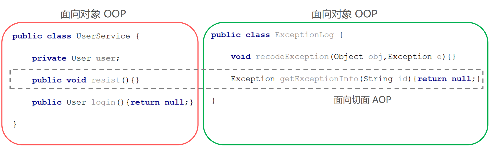

 


### 通知

- 坐标：aspectjweaver包。

#### pointcut 切点

##### execution 切入表达式

```
execution([访问修饰符] 返回值类型 包名.类名.方法名(参数))
```

- 访问修饰符可以省略不写；

- 返回值类型、某一级包名、类名、方法名 可以使用 * 表示任意；

- 包名与类名之间使用单点 . 表示该包下的类，使用双点 .. 表示该包及其子包下的类；

- 参数列表可以使用两个点 .. 表示任意参数。

```java
//表示访问修饰符为public、无返回值、在com.itheima.aop包下的TargetImpl类的无参方法show
execution(public void com.itheima.aop.TargetImpl.show())
//表述com.itheima.aop包下的TargetImpl类的任意方法
execution(* com.itheima.aop.TargetImpl.*(..))
//表示com.itheima.aop包下的任意类的任意方法
execution(* com.itheima.aop.*.*(..))
//表示com.itheima.aop包及其子包下的任意类的任意方法
execution(* com.itheima.aop..*.*(..))
//表示任意包中的任意类的任意方法
execution(* *..*.*(..))
```

##### pointcut 切点表达式抽取

###### `aop:pointcut`

```xml
<aop:pointcut id="myPointcut" expression="execution(void com.itheima.service.impl.UserServiceImpl.show1())"/>
```

###### @Pointcut

- 在通知类中定义方法，并注解为@Pointcut("切入表达式")
- 在通知的注解中使用如：@Before("通知类.标记方法()") 的形式获取切入。

```java
@Component
public class UserServiceAdvice{
    @Pointcut("execution(* com.zjk.service.*.*(..))")
    public void userServiceAdvicePointcut(){};

    @Before("userServiceAdvicePointcut()")
    public void before(){
        System.out.println("before");
    }
}
```

#### Aspect 织入

##### @Aspect

| 通知类型     | 注解                                          |
| :----------- | :-------------------------------------------- |
| 前置通知     | @Before("切点表达式")                         |
| 后置通知     | @AfterReturning("切点表达式")                 |
| 环绕通知     | @Around("切点表达式")                         |
| 异常抛出通知 | @Throwable(pointcut="切点表达式" throwing="") |
| 最终通知     | @Afters("切点表达式")                         |

- 配置类

```java
@Configuration
@ComponentScan("com.zjk")
@EnableAspectJAutoProxy
public class ApplicationContextConfig {}
```

- 增强类

```java
@Component
@Aspect
public class UserServiceAdvice{
    @Pointcut("execution(* com.zjk.service.impl.*.*(..))")
    public void userServicePointcut() {
    }

    @Before("userServicePointcut()")
    public void before() {
        System.out.println("前置增强");
    }

    @Around("userServicePointcut()")
    public void around(ProceedingJoinPoint joinPoint) throws Throwable {
        System.out.println("环绕前增强");
        joinPoint.proceed();
        System.out.println("环绕后增强");
    }

    @AfterThrowing(pointcut = "userServicePointcut()", throwing = "e")
    public void afterThrowable(Throwable e) {
        e.printStackTrace();
    }
}
```

- 目标类

```java
@Component
public class UserServiceImpl implements UserService {

    @Override
    public void show1() {
        System.out.println("show1");
    }

    @Override
    public void show2() {
        System.out.println("show2");
    }
}
```

###### AOP自动代理

**注解@Aspect、@Around需要被Spring解析**

```xml
<aop:aspectj-autoproxy/>
```

```java
@EnableAspectJAutoProxy
```

##### AspectJ

###### aspect

| 通知名称 | 配置方式                | 执行时机                                                 |
| :------- | :---------------------- | :------------------------------------------------------- |
| 前置通知 | ` <aop:before> `        | 目标方法执行之前执行                                     |
| 后置通知 | `<aop:after-returning>` | 目标方法执行之后执行，目标方法异常时，不再执行           |
| 环绕通知 | ` <aop:around >`        | 目标方法执行前后执行，目标方法异常时，环绕后通知不再执行 |
| 异常通知 | ` <aop:after-throwing>` | 目标方法抛出异常时执行                                   |
| 最终通知 | ` <aop:after>`          | 不管目标方法是否有异常，最终都会执行（finally）          |

```xml
<!--目标类-->
<bean id="userService" class="com.zjk.service.impl.UserServiceImpl"></bean>
<!--增强方法类-->
<bean id="userServiceAdvice" class="com.zjk.advice.UserServiceAdvice"></bean>

<aop:config>
    <!--配置切点表达式,对哪些方法进行增强-->
    <aop:pointcut id="myPointcut" expression="execution(void com.itheima.service.impl.UserServiceImpl.show1())"/>
    <!--切面=切点+通知-->
    <aop:aspect ref="myAdvice">
        <!--指定前置通知方法是beforeAdvice-->
        <aop:before method="beforeAdvice" pointcut-ref="myPointcut"/>
        <!--指定后置通知方法是afterAdvice-->
        <aop:after-returning method="afterAdvice" pointcut="execution(void com.itheima.service.impl.UserServiceImpl.show1())"/>
    </aop:aspect>
</aop:config>
```

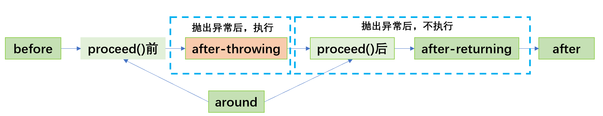 

###### # 环绕通知

- ProceedingJoinPoint参数
- **joinPoint.proceed();** 执行目标方法

```java
public void around(ProceedingJoinPoint joinPoint) throws Throwable {
    System.out.println("环绕前通知");
    Object proceed = joinPoint.proceed(); //执行目标方法 可能有返回值
    System.out.println("环绕后通知");
}
```

###### # 通知方法参数传递

| 参数类型            | 作用                                                         |
| :------------------ | :----------------------------------------------------------- |
| JoinPoint           | 连接点对象，任何通知都可使用，可以获得当前目标对象、目标方法参数等信息 |
| ProceedingJoinPoint | JoinPoint子类对象，主要是在环绕通知中执行proceed()，进而执行目标方法 |
| Throwable           | 异常对象，使用在异常通知中，需要在配置文件中指出异常对象名称 |

**JoinPoint**

```java
public void beforeAdvice(JoinPoint joinPoint) {
    System.out.println("当前增强的对象：" + joinPoint.getTarget()); //com.zjk.service.impl.UserServiceImpl@2eea88a1
    System.out.println("表达式：" + joinPoint.getStaticPart()); //execution(void com.zjk.service.UserService.show1())
    System.out.println("前置增强");
}
```

**Throwable**

- throwing：抛出的异常对象。

```xml
<aop:after-throwing method="afterThrowing" pointcut-ref="userServicePointcut" throwing="throwable"/>
```

```java
public void afterThrowing(Throwable throwable){
    System.out.println("异常信息：" + throwable);
}
```

###### advisor

**通知类实现Advice的子功能接口**

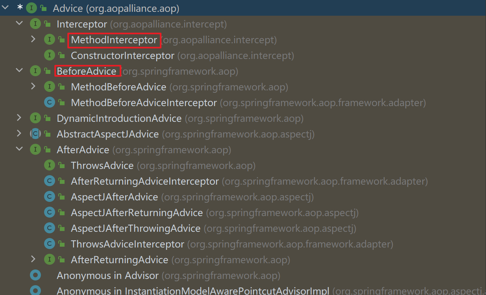  

| 通知类型 | 接口                 | 实现的方法                                                   |
| :------- | :------------------- | :----------------------------------------------------------- |
| 前置通知 | MethodBeforeAdvice   | public void before(Method method, Object[] args, Object target) |
| 后置通知 | AfterReturningAdvice | public void afterReturning(Object returnValue, Method method, Object[] args, Object target) |
| 环绕通知 | MethodInterceptor    | public Object invoke(MethodInvocation methodInvocation)      |

```xml
<aop:advisor advice-ref="Advice子接口的实现类id" pointcut-ref="切入点"/>
```

- applicationContext.xml

```xml
<!--目标类-->
<bean id="userService" class="com.zjk.service.impl.UserServiceImpl"></bean>
<!--增强方法类-->
<bean id="userServiceAdvice2" class="com.zjk.advice.UserServiceAdvice2"></bean>

<aop:config>
    <aop:pointcut id="userServicePointcut" expression="execution(void com.zjk.service.impl.UserServiceImpl.*(..))"/>
    <aop:advisor advice-ref="userServiceAdvice2" pointcut-ref="userServicePointcut"/>
</aop:config>
```

- 增强类-实现相应的Advice子接口

```java
public class UserServiceAdvice2 implements MethodBeforeAdvice, AfterReturningAdvice {

    @Override
    public void before(Method method, Object[] args, Object target) throws Throwable {
        System.out.println("前置通知");
    }

    @Override
    public void afterReturning(Object returnValue, Method method, Object[] args, Object target) throws Throwable {
        System.out.println("后置通知");
    }
}
```

###### aspect和advisor比较

- 通知类的定义要求
  - advisor 需要的通知类需要实现Advice的子功能接口
  - aspect 不需要通知类实现任何接口，在配置的时候指定哪些方法属于哪种通知类型即可，更加灵活方便：
- 可配置的切面数量
  - `<aop advisor>`只能配置一个固定通知和一个切点表达式；
  - `<aop aspect>`可以配置多个通知和多个切点表达式任意组合，粒度更细。
- 使用场景
  - 如果通知类型多、允许随意搭配情况下可以使用aspect进行配置；
  - 如果通知类型单一、且通知类中通知方法一次性都会使用到的情况下可以使用advisor进行配置； 
  - 在通知类型已经固定，不用人为指定通知类型时，可以使用advisor进行配置，例如Spring事务控制的配置；

```xml
<aop:config>
    <aop:pointcut id="userServicePointcut" expression="execution(void com.zjk.service.impl.UserServiceImpl.*(..))"/>
    <aop:advisor advice-ref="userServiceAdvice2" pointcut-ref="userServicePointcut"/>
</aop:config>
```

```xml
<aop:config>
    <!--配置切入-->
    <aop:pointcut id="userServicePointcut"
                  expression="execution(* com.zjk.service.impl.UserServiceImpl.*(..))"/>
    <!--配置织入-->
    <aop:aspect ref="userServiceAdvice">
        <aop:before method="beforeAdvice" pointcut-ref="userServicePointcut"/>
        <aop:after-returning method="afterAdvice" pointcut-ref="userServicePointcut"/>
        <aop:around method="around" pointcut-ref="userServicePointcut"/>
        <aop:after-throwing method="afterThrowing" pointcut-ref="userServicePointcut" throwing="throwable"/>
    </aop:aspect>
</aop:config>
```

#### 通知原理

##### 获取增强的Proxy对象

- xml配置：spring-aop jar包的META-INF下的spring.handlers和sprin.schemas

- AopNamespaceHandler：spring.handlers

```xml
http\://www.springframework.org/schema/aop=org.springframework.aop.config.AopNamespaceHandler
```

 

- **wrapIfNecessary()** 方法最终返回的就是一个Proxy对象：`return this.wrapIfNecessary(bean, beanName, cacheKey);`

##### 获取的Proxy对象类型

- 动态代理的实现的选择，在调用getProxy() 方法时，可选用的 AopProxy接口的两个实现类：
  
  - 基于JDK：JdkDynamicAopProxy
  
  - 基于Cglib：CglibAopProxy

| 代理技术           | 使用条件                                                     | 配置方式                                                     |
| :----------------- | :----------------------------------------------------------- | :----------------------------------------------------------- |
| JDK 动态代理技术   | 目标类有接口，是基于接口动态生成实现类的代理对象             | 目标类有接口的情况下，默认方式                               |
| Cglib 动态代理技术 | 目标类无接口且不能使用final修饰，是基于被代理对象动态生成子对象为代理对象 | 目标类无接口时，默认使用该方式；目标类有接口时，手动配置`<aop:config proxytarget-class="true">`强制使用Cglib方式 |

 

 

 

###### Cglib基于超类的动态代理

- 设置Enhancer对象(代理对象)的父类为目标类`enhancer.setSuperclass(目标类.class);`

- 设置回调

```java
enhander.setCallback(new MethodInterceptor() {
    @Override
    public Object intercept(Object obj, Method method, Object[] args, MethodProxy proxy) throws Throwable {
        advice.before();
        Object result = method.invoke(person, args);
        advice.afterReturning();
        return result;
    }
});
```

- 生成代理对象：返回Object可强转为代理的目标类类型

```java
enhander.create();
```

**例**

- 目标类 com.zjk.test.Person

```java
public class Person{
    public void show(){
        System.out.println("show");
    }
}
```

- 增强类 com.zjk.advice.PersonAdvice

```java
public class PersonAdvice{
    public void before(){
        System.out.println("前置增强");
    }

    public void afterReturning(){
        System.out.println("后置增强");
    }
}
```

- 测试

```java
//目标类对象
Person person = new Person();
//增强类对象
PersonAdvice advice = new PersonAdvice();
//代理器
Enhancer enhander = new Enhancer();
//1.设置代理器的父类
enhander.setSuperclass(Person.class);
//2.设置回调
enhander.setCallback(new MethodInterceptor() {
    @Override
    public Object intercept(Object obj, Method method, Object[] args, MethodProxy proxy) throws Throwable {
        advice.before();
        Object result = method.invoke(person, args);
        advice.afterReturning();
        return result;
    }
});
//3.创建代理
Person personProxy = (Person) enhander.create();

personProxy.show();
```

##### AOP自动代理

- `<aop:aspectj-autoproxy/>`

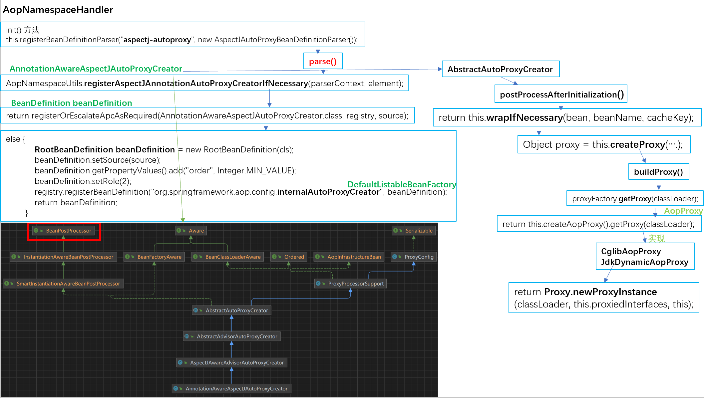 

- @EnableAspectJAutoProxy

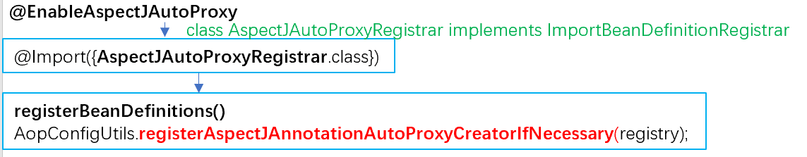 

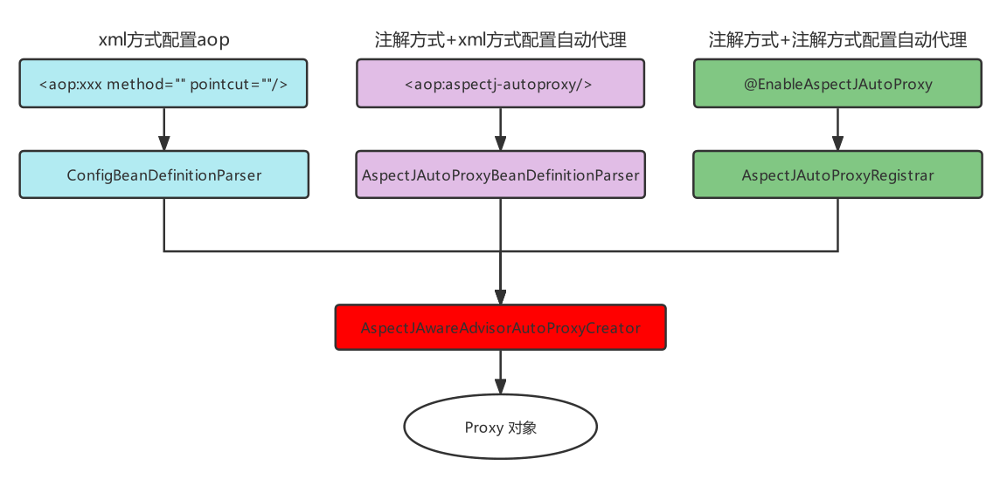 

### 声明式事务控制

#### Spring事务编程概述

- JDBC使用connection对事务进行控制；MyBatis使用SqlSession对事务进行控制。当切换数据库访问技术时，事务控制的方式总会变化，Spring提供了统一的控制事务的接口。
- 事物控制：保证事务的原子性。

| 事务控制方式   | 解释                                                         |
| :------------- | :----------------------------------------------------------- |
| 编程式事务控制 | Spring提供了事务控制的类和方法，使用编码的方式对业务代码进行事务控制，事务控制代码和业务操作代码耦合到了一起，开发中不使用 |
| 声明式事务控制 | Spring将事务控制的代码封装，对外提供了xml和注解配置方式，通过配置的方式完成事务的控制，可以达到事务控制与业务操作代码解耦合，开发中使用 |

##### 编程式事务控制

###### Spring事务编程相关的类

| 事务控制相关类                            | 解释                                                         |
| :---------------------------------------- | :----------------------------------------------------------- |
| 平台事务管理器 PlatformTransactionManager | 接口标准，实现类都具备事务提交、回滚和获得事务对象的功能，不同持久层框架可能会有不同实现方案 |
| 事务定义 TransactionDefinition            | 封装事务的隔离级别、传播行为、过期时间等属性信息             |
| 事务状态 TransactionStatus                | 存储当前事务的状态信息，如果事务是否提交、是否回滚、是否有回滚点等 |

> spring-jdbc坐标已经引入的spring-tx坐标。

###### 平台事务管理器

- MyBatis作为持久层框架时，使用的平台事务管理器实现是DataSourceTransactionManager。

- Hibernate作为持久层框架时，使用的平台事务管理器是HibernateTransactionManager。

**Mybatis平台事务管理器**

- MyBatis使用的平台事务管理器： **DataSourceTransactionManager**

 

- 需要注入的属性：

```java
private DataSource dataSource;
```

#### 基于xml

##### 平台事务管理器Bean

```xml
<!--MyBatis使用的平台事务管理器：DataSourceTransactionManager-->
<bean id="transactionManager" class="org.springframwork.jdbc.datasource.DataSourceTranctionManager">
    <property name="dataSource" ref="数据连接池Bean引用"/>
</bean>
```

##### Spring提供通知类  `<tx:advice>`

- 相当于配置通知类的`<bean>`

```xml
<tx:advice id="advice-ref引用" transaction-manager="平台事务管理器Bean引用">
    <!--配置不同方法的事务属性-->
    <tx:attributes> 
        <tx:method name="*"></tx:method>
    </tx:attributes>
</tx:advice>
```

###### `<tx:method>`

| `<tx:method>`属性 | 说明                                                         |
| :---------------- | :----------------------------------------------------------- |
| name              | 方法名称。`*` 模糊匹配(addUser、addAccount-->add`*`或`*`)    |
| isolation         | 事务的隔离级别：解决事务并发问题                             |
| timeout           | 设置事务执行的超时时间，单位是秒，如果超过该时间限制但事务还没有完成，则自动回滚事务，不再继续执行。默认值是-1，即没有超时时间限制 |
| read-only         | 设置当前的只读状态，如果是查询则设置为true，可以提高查询性能，如果是DML（增删改）操作则设置为false。 |
| propagation       | 设置事务的传播行为，主要解决是A方法调用B方法时，事务的传播方式问题的。例如：使用单方的事务，还是A和B都使用自己的事务等 |

**isolation**

- 指定事务的隔离级别，事务并发存在三大问题：脏读、不可重复读、幻读/虚读。可以通过设置事务的隔离级别来保证并发问题的出现，常用的是READ_COMMITTED 和 REPEATABLE_READ。

| isolation属性    | 解释                                                         |
| :--------------- | :----------------------------------------------------------- |
| DEFAULT          | 默认隔离级别，取决于当前数据库隔离级别，例如MySQL默认隔离级别是REPEATABLE_READ |
| READ_UNCOMMITTED | A事务可以读取到B事务尚未提交的事务记录，不能解决任何并发问题，安全性最低，性能最高 |
| READ_COMMITTED   | A事务只能读取到其他事务已经提交的记录，不能读取到未提交的记录。可以解决脏读问题，但是不能解决不可重复读和幻读 |
| REPEATABLE_READ  | A事务多次从数据库读取某条记录结果一致，可以解决不可重复读，不可以解决幻读 |
| SERIALIZABLE     | 串行化，可以解决任何并发问题，安全性最高，但是性能最低       |

**propagation**

| 事务传播行为       | 解释                                                         |
| :----------------- | :----------------------------------------------------------- |
| REQUIRED（默认值） | A调用B，B需要事务，如果A有事务B就加入A的事务中，如果A没有事务，B就自己创建一个事务 |
| REQUIRED_NEW       | A调用B，B需要新事务，如果A有事务就挂起，B自己创建一个新的事务 |
| SUPPORTS           | A调用B，B有无事务无所谓，A有事务就加入到A事务中，A无事务B就以非事务方式执行 |
| NOT_SUPPORTS       | A调用B，B以无事务方式执行，A如有事务则挂起                   |
| NEVER              | A调用B，B以无事务方式执行，A如有事务则抛出异常               |
| MANDATORY          | A调用B，B要加入A的事务中，如果A无事务就抛出异常              |
| NESTED             | A调用B，B创建一个新事务，A有事务就作为嵌套事务存在，A没事务就以创建的新事务执行 |

##### 织入 advisor

- Spring已经配置好的通知类：使用advisor方式。

##### 原理解析

  

- TxAdviceBeanDefinitionParser二级父类AbstractBeanDefinitionParser的parse方法将TransactionInterceptor以配置的名称注册到了Spring容器中

#### 基于注解

##### 事务控制 @Transactional

| 注释位置 | 说明                                                         |
| -------- | ------------------------------------------------------------ |
| 类       | 该类下的所有方法都使用这注释的事务。                         |
| 方法     | 只对该方法使用该注释的事务。<br />优先级大于对类注释（就近原则）。 |

```java
@Transactional(isolation = Isolation.REPEATABLE_READ,propagation = Propagation.REQUIRED,readOnly = false,timeout = 5)
```

- 配置织入，对应于xml的：

```xml
<tx:advice id="advice-ref引用" transaction-manager="平台事务管理器Bean引用">
    <!--配置不同方法的事务属性-->
    <tx:attributes> 
        <tx:method name="*"></tx:method>
    </tx:attributes>
</tx:advice>
```

##### 配置类 @EnableTransactionManagemen

- 事务的自动代理，默认查找 **transactionManager** 命名的Bean
- 对应于xml的：

```xml
<tx:annotation-driven/>
<!--<tx:annotation-driven transaction-manager="transactionManager"/>-->
```

- 配置类

```java
@Configuration
@MapperScan("com.zjk.mapper")
@PropertySource("classpath:jdbc.properties")
@ComponentScan("com.zjk")
@EnableTransactionManagement
public class ApplicationContextConfig {
    @Bean
    public DataSource dataSource(@Value("${jdbc.url}") String url,
                                 @Value("${jdbc.username}") String username,
                                 @Value("${jdbc.password}") String password) {
        DruidDataSource dataSource = new DruidDataSource();
        dataSource.setUrl(url);
        dataSource.setUsername(username);
        dataSource.setPassword(password);
        return dataSource;
    }

    @Bean
    public SqlSessionFactoryBean sqlSessionFactoryBean(DataSource dataSource) {
        SqlSessionFactoryBean sqlSessionFactoryBean = new SqlSessionFactoryBean();
        sqlSessionFactoryBean.setDataSource(dataSource);
        return sqlSessionFactoryBean;
    }

    //平台事务管理器
    @Bean
    public DataSourceTransactionManager transactionManager(DataSource dataSource){
        DataSourceTransactionManager transactionManager = new DataSourceTransactionManager();
        transactionManager.setDataSource(dataSource);
        return transactionManager;
    }
}
```

- 切入点

```java
@Service
public class AccountServiceImpl implements AccountService {

    @Autowired
    private AccountMapper accountMapper;

    public AccountMapper getAccountMapper() {
        return accountMapper;
    }

    public void setAccountMapper(AccountMapper accountMapper) {
        this.accountMapper = accountMapper;
    }

    //被事务控制的方法
    @Transactional
    public void trancate(Integer money, String fromAccountName,String toAccountName) {
        accountMapper.decrMoney(money, fromAccountName);
        accountMapper.incrMoney(money, toAccountName);
    }
}
```
