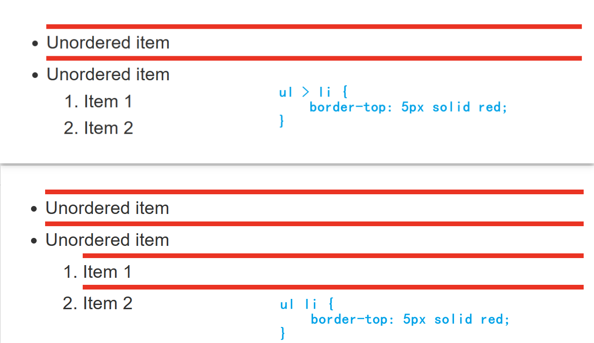
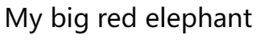
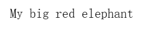
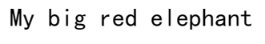
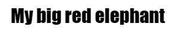

# CSS介绍

## CSS运行


 

1. 浏览器载入 HTML 文件。
2. 将 HTML 文件转化成一个 DOM（Document Object Model）。
3. 接下来，浏览器会拉取该 HTML 相关的大部分资源，比如嵌入到页面的图片、视频和 CSS 样式。JavaScript 则会稍后进行处理，简单起见，同时此节主讲 CSS，所以这里对如何加载 JavaScript 不会展开叙述。
4. 浏览器拉取到 CSS 之后会进行解析，根据选择器的不同类型（比如 element、class、id 等等）把他们分到不同的“桶”中。浏览器基于它找到的不同的选择器，将不同的规则（基于选择器的规则，如元素选择器、类选择器、id 选择器等）应用在对应的 DOM 的节点中，并添加节点依赖的样式（这个中间步骤称为渲染树）。
5. 上述的规则应用于渲染树之后，渲染树会依照应该出现的结构进行布局。
6. 网页展示在屏幕上（着色）。

# 样式表

- CSS样式表由选择器和声明组成

## 解析规则

- 浏览器在解析你所书写的 CSS 规则的过程中遇到了无法理解的属性或者值，它会忽略这些并继续解析下面的 CSS 声明。
- 当浏览器遇到无法解析的选择器的时候，会直接忽略整个选择器规则，然后解析下一个 CSS 选择器

## 声明

- 声明放在声明块`{}`内，并且声明可以是多条，区分大小写。
- 每条声明由一对属性和值组成，属性和值之间用冒号`:`分开，每条声明以分号`;`结尾。

## 选择器

**专一性**

- 级联规则：相同的选择器，后面的样式会覆盖之前相同属性的样式。
- 专用规则：id选择器 > 类选择器 > 类型选择器。

```css
/*为以下元素建立样式：在 <body> 之内，紧接在 <h1> 后面的 <p> 元素的内部，类名为 special。*/
body h1 + p .special {
  color: yellow;
  background-color: black;
  padding: 5px;
}
```

### 常用选择器

|名称|选择器|说明|
|:--|:--|:--|
|标签选择器|HTML标签||
|类选择器|class属性 `.类名` ||
|ID选择器|id属性 `#id名`||
|| , |多个选择器建立相同样式|
|全局选择器|`*`|选中了文档中的所有内容<br>紧随在其他元素以及邻代运算符之后时：父元素的所有内容 |

### 属性选择器

#### 存否和值选择器

| 选择器       | 示例                            | 描述                                                         |
| :----------- | :------------------------------ | :----------------------------------------------------------- |
| `[属性]`     | `a[title]`                      | 匹配带有某属性的元素                                         |
| `[属性=值]`  | `a[href="https://example.com"]` | 匹配带有某属性和值的元素                                     |
| `[属性~=值]` | `p[class~="special"]`           | 匹配带有某属性和值的元素，该属性的值有一个或者更多，至少有一个和该值匹配。<br>在一列中的好几个值，是用空格隔开的。 |
| `[属性|=值]` | `div[lang|="zh"]`               | 匹配带有某属性和值的元素，或者其中的值开头为该值。           |

- `li[class]`，匹配任何有 class 属性的选择器。
- `li[class="a"]`匹配只带有一个`a`类的选择器。
- `li[class~="a"]`会匹配一个`a`类或一列用空格分开、包含`a`类的值。

#### 子字符串匹配选择器

| 选择器          | 示例                | 描述                                                         |
| :-------------- | :------------------ | :----------------------------------------------------------- |
| `[attr^=value]` | `li[class^="box-"]` | 匹配带有一个名为*attr*的属性的元素，其值开头为*value*子字符串。 |
| `[attr$=value]` | `li[class$="-box"]` | 匹配带有一个名为*attr*的属性的元素，其值结尾为*value*子字符串 |
| `[attr*=value]` | `li[class*="box"]`  | 匹配带有一个名为*attr*的属性的元素，其值的字符串中的任何地方，至少出现了一次*value*子字符串。 |

- `li[class^="a"]`匹配了任何值开头为`a`的属性
- `li[class$="a"]`匹配了任何值结尾为`a`的属性
- `li[class*="a"]`匹配了任何值的字符串中出现了`a`的属性

#### 大小写敏感

- 在闭合括号之前，使用`i`值：告诉浏览器以大小写不敏感的方式匹配 ASCII 字符。

```css
li[class^="a" i] {
    color: red;
}
```

### 伪类和伪元素

- 用于选择处于特定状态的元素

```css
/*选择一个`<article>`元素里面的第一个`<p>`元素的第一行。*/
article p:first-child::first-line {
  font-size: 120%;
  font-weight: bold;
}
```

#### 伪类

| 选择器                | 描述                                                         |
| :-------------------- | :----------------------------------------------------------- |
| `:active`             | 在用户激活（例如点击）元素的时候匹配。                       |
| `:any-link`           | 匹配一个链接的`:link`和`:visited`状态。                      |
| `:blank`              | 匹配空输入值的[``元素](https://developer.mozilla.org/zh-CN/docs/Web/HTML/Element/input)。 |
| `:checked`            | 匹配处于选中状态的单选或者复选框。                           |
| `:current(en-US)`     | 匹配正在展示的元素，或者其上级元素。                         |
| `:default`            | 匹配一组相似的元素中默认的一个或者更多的 UI 元素。           |
| `:dir`                | 基于其方向性（HTML[`dir`](https://developer.mozilla.org/zh-CN/docs/Web/HTML/Global_attributes/dir)属性或者 CSS[`direction`](https://developer.mozilla.org/zh-CN/docs/Web/CSS/direction)属性的值）匹配一个元素。 |
| `:disabled`           | 匹配处于关闭状态的用户界面元素                               |
| `:empty`              | 匹配除了可能存在的空格外，没有子元素的元素。                 |
| `:enabled`            | 匹配处于开启状态的用户界面元素。                             |
| `:first`              | 匹配[分页媒体](https://developer.mozilla.org/zh-CN/docs/Web/CSS/Paged_Media)的第一页。 |
| `:first-child`        | 匹配兄弟元素中的第一个元素。                                 |
| `:first-of-type`      | 匹配兄弟元素中第一个某种类型的元素。                         |
| `:focus`              | 当一个元素有焦点的时候匹配。                                 |
| `:focus-visible`      | 当元素有焦点，且焦点对用户可见的时候匹配。                   |
| `:focus-within`       | 匹配有焦点的元素，以及子代元素有焦点的元素。                 |
| `:future`             | 匹配当前元素之后的元素。                                     |
| `:hover`              | 当用户悬浮到一个元素之上的时候匹配。                         |
| `:indeterminate`      | 匹配未定态值的 UI 元素，通常为[复选框](https://developer.mozilla.org/zh-CN/docs/Web/HTML/Element/input/checkbox)。 |
| `:in-range`           | 用一个区间匹配元素，当值处于区间之内时匹配。                 |
| `:invalid`            | 匹配诸如`<input>`的位于不可用状态的元素。                    |
| `:lang`               | 基于语言（HTML[lang](https://developer.mozilla.org/zh-CN/docs/Web/HTML/Global_attributes/lang)属性的值）匹配元素。 |
| `:last-child`         | 匹配兄弟元素中最末的那个元素。                               |
| `:last-of-type`       | 匹配兄弟元素中最后一个某种类型的元素。                       |
| `:left`               | 在[分页媒体 (en-US)](https://developer.mozilla.org/en-US/docs/Web/CSS/CSS_Pages)中，匹配左手边的页。 |
| `:link`               | 匹配未曾访问的链接。                                         |
| `:local-link` (en-US) | 匹配指向和当前文档同一网站页面的链接。                       |
| `:is()`               | 匹配传入的选择器列表中的任何选择器。                         |
| `:not`                | 匹配作为值传入自身的选择器未匹配的物件。                     |
| `:nth-child`          | 匹配一列兄弟元素中的元素——兄弟元素按照*an+b*形式的式子进行匹配（比如 2n+1 匹配元素 1、3、5、7 等。即所有的奇数个）。 |
| `:nth-of-type`        | 匹配某种类型的一列兄弟元素（比如，`<p>`元素）——兄弟元素按照*an+b*形式的式子进行匹配（比如 2n+1 匹配元素 1、3、5、7 等。即所有的奇数个）。 |
| `:nth-last-child`     | 匹配一列兄弟元素，从后往前倒数。兄弟元素按照*an+b*形式的式子进行匹配（比如 2n+1 匹配按照顺序来的最后一个元素，然后往前两个，再往前两个，诸如此类。从后往前数的所有奇数个）。 |
| `:nth-last-of-type`   | 匹配某种类型的一列兄弟元素（比如，`<p>`元素），从后往前倒数。兄弟元素按照*an+b*形式的式子进行匹配（比如 2n+1 匹配按照顺序来的最后一个元素，然后往前两个，再往前两个，诸如此类。从后往前数的所有奇数个）。 |
| `:only-child`         | 匹配没有兄弟元素的元素。                                     |
| `:only-of-type`       | 匹配兄弟元素中某类型仅有的元素。                             |
| `:optional`           | 匹配不是必填的 form 元素。                                   |
| `:out-of-range`       | 按区间匹配元素，当值不在区间内的的时候匹配。                 |
| `:past` (en-US)       | 匹配当前元素之前的元素。                                     |
| `:placeholder-shown`  | 匹配显示占位文字的 input 元素。                              |
| `:playing` (en-US)    | 匹配代表音频、视频或者相似的能“播放”或者“暂停”的资源的，且正在“播放”的元素。 |
| `:paused` (en-US)     | 匹配代表音频、视频或者相似的能“播放”或者“暂停”的资源的，且正在“暂停”的元素。 |
| `:read-only`          | 匹配用户不可更改的元素。                                     |
| `:read-write`         | 匹配用户可更改的元素。                                       |
| `:required`           | 匹配必填的 form 元素。                                       |
| `:right`              | 在[分页媒体 (en-US)](https://developer.mozilla.org/en-US/docs/Web/CSS/CSS_Pages)中，匹配右手边的页。 |
| `:root`               | 匹配文档的根元素。                                           |
| `:scope`              | 匹配任何为参考点元素的的元素。                               |
| `:valid`              | 匹配诸如`<input>`元素的处于可用状态的元素。                  |
| `:target`             | 匹配当前 URL 目标的元素（例如如果它有一个匹配当前[URL 分段](https://en.wikipedia.org/wiki/Fragment_identifier)的元素）。 |
| `:visited`            | 匹配已访问链接。                                             |

#### 伪元素

| 选择器             | 描述                                                 |
| :----------------- | :--------------------------------------------------- |
| `::after`          | 匹配出现在原有元素的实际内容之后的一个可样式化元素。 |
| `::before`         | 匹配出现在原有元素的实际内容之前的一个可样式化元素。 |
| `::first-letter`   | 匹配元素的第一个字母。                               |
| `::first-line`     | 匹配包含此伪元素的元素的第一行。                     |
| `::grammar-error`  | 匹配文档中包含了浏览器标记的语法错误的那部分。       |
| `::selection`      | 匹配文档中被选择的那部分。                           |
| `::spelling-error` | 匹配文档中包含了浏览器标记的拼写错误的那部分。       |

### 关系选择器

| 名称               | 选择器                                                  | 示例      |
| ------------------ | ------------------------------------------------------- | --------- |
| 后代选择器         | ` `：单个空格组合多个选择器，所有后代                   | `ul li`   |
| 子代关系选择器     | `>`：只会在选择器选中直接子元素的时候匹配               | `ul > li` |
| 邻接兄弟选择器     | `+`：选中恰好处于另一个在继承关系上同级的元素旁边的物件 | `p + img` |
| 通用兄弟关系选择器 | `~`：选中一个元素的兄弟元素，即使它们不直接相邻         | `p ~ img` |

```html
<ul>
    <li>Unordered item</li>
    <li>Unordered item
        <ol>
            <li>Item 1</li>
            <li>Item 2</li>
        </ol>
    </li>
</ul>
```

  

```css
/*选中所有的<p>元素后任何地方的元素*/
p ~ img
```

# 页面添加样式表

| 类型       | 导入方式                                                     |
| ---------- | ------------------------------------------------------------ |
| 外部样式表 | `<link rel="stylesheet" href="css文件路径">`                 |
| 内部样式表 | `<style>css代码</style>`                                     |
| 内联样式   | HTML 元素的 style 属性：`<span style="font-size:60px";>HELLO</span>` |

# 函数

## calc()  计算

```css
.box {
    padding: 10px;
    width: calc(90% - 30px);
    background-color: rebeccapurple;
    color: white;
}
```

## transform

```css
.box {
    margin: 30px;
    width: 100px;
    height: 100px;
    background-color: rebeccapurple;
    transform: rotate(0.8turn)
}
```

# @规则

## @media

```css
/*将给 <body> 元素一个粉红色的背景色。*/
body {
    background-color: pink;
}
/* @media 创建样式表的一个部分，该部分仅适用于视口大于 30em 的浏览器。如果浏览器的宽度大于 30em，则背景色将为蓝色。*/
@media (min-width: 30em) {
    body {
        background-color: blue;
    }
}
```

# 速记属性

| 速记属性   | 说明   |
| ---------- | ------ |
| font       | 字体   |
| background | 背景   |
| padding    | 内边距 |
| border     | 边框   |
| margin     | 外边距 |

# 层叠与继承

**冲突规则**

## 层叠

1. 资源顺序：资源顺序仅在规则的优先级相同时才体现出来
2. 优先级
3. 重要程度

### 优先级算法

- 一个选择器的优先级可以说是由三个不同的值（或分量）相加：百（ID）、十（类）、个（元素）

| 选择器                                                       | 分量                                                         |
| ------------------------------------------------------------ | ------------------------------------------------------------ |
| ID                                                           | 选择器中包含 ID 选择器则百位得一分。                         |
| 类                                                           | 选择器中包含类选择器、属性选择器或者伪类则十位得一分。       |
| 元素                                                         | 选择器中包含元素、伪元素选择器则个位得一分。                 |
| 通用选择器（[`*`](https://developer.mozilla.org/zh-CN/docs/Web/CSS/Universal_selectors)）<br>组合符（`+`、`>`、`~`、' '）<br>调整优先级的选择器（[`:where()`](https://developer.mozilla.org/zh-CN/docs/Web/CSS/:where)） | 不会影响优先级。                                             |
| 否定（`:not()`）<br>任意匹配（`:is()`）                      | 伪类本身对优先级没有影响，但它们的参数则会带来影响。参数中，对优先级算法有贡献的参数的优先级的最大值将作为该伪类选择器的优先级。 |

- 内联样式：优先于所有普通的样式，无论其优先级如何。这样的声明没有选择器，但它们的优先级可以理解为 1-0-0-0
- `!important`：用于修改特定属性的值，能够覆盖普通规则的层叠。

```css
.better {
    background-color: gray;
    border: none !important;
}
```

### 覆盖声明的顺序

- 相互冲突的声明将按以下顺序应用：

1. 用户代理样式表中的声明（例如，浏览器的默认样式，在没有设置其他样式时使用）。
2. 用户样式表中的常规声明（由用户设置的自定义样式）。
3. 作者样式表中的常规声明（这些是我们 web 开发人员设置的样式）。
4. 作者样式表中的 `!important` 声明
5. 用户样式表中的 `!important` 声明
6. 用户代理样式表中的 `!important` 声明

### 级联层的顺序

- 优先级的顺序由声明层的顺序来决定。在任何层之外声明的 CSS 样式会被按声明的顺序组合在一起，形成一个未命名的层，它会被当作最后声明的层。对于存在冲突的常规（没有 `!important` 声明）样式，后面的层比先前定义的层的优先级高。但对于带有 `!important` 标记的样式，其顺序相反——先前的层中的 important 样式比后面的层以及为在层中声明的 important 样式优先级要高。但内联样式比所有作者定义的样式的优先级都要高，不受级联层规则的影响。

- 当你在不同的层中有多个样式块，且其中提供了对于某一元素的单一属性的相互冲突的值时，声明该冲突样式的层的顺序将决定其优先级。而不是高优先级的层直接覆盖低优先级的层中的所有样式。需要注意的是单独的一个层中的样式的优先级仍旧会起作用。

## 继承

### 继承属性

- 一些设置在父元素上的 CSS 属性是可以被子元素继承：如果你设置一个元素的 `color` 和 `font-family`，每个在里面的元素也都会有相同的属性，除非你直接在元素上设置属性。

### 控制继承

**控制属性**

|属性|说明|
|:--|:--|
|inherit|开启继承：设置该属性会使子元素属性和父元素相同。|
|initial|将应用于选定元素的属性值设置为该属性的初始值。|
|revert (en-US)|将应用于选定元素的属性值重置为浏览器的默认样式，而不是应用于该属性的默认值。<br>在许多情况下，此值的作用类似于 unset。|
|revert-layer (en-US)|将应用于选定元素的属性值重置为在上一个层叠层中建立的值。|
|unset|将属性重置为自然值，如果属性是自然继承那么就是 inherit，否则和 initial 一样|

**属性指定**

| 属性 | 说明                       |
| ---- | -------------------------- |
| all  | 对当前样式表的所有属性设置 |

```html
body {
    color: green;
}
          
.my-class-1 a {
    color: inherit;
}
          
.fix-this {
    all: unset;
}
```

# 级联层

# 盒子模型

## 块级盒子和内联盒子

| 块级盒子 (block)                                             | 内联盒子 (inline)                                            |
| ------------------------------------------------------------ | ------------------------------------------------------------ |
| 盒子会在内联的方向上扩展并占据父容器在该方向上的所有可用空间<br>在绝大数情况下意味着盒子会和父容器一样宽 |                                                              |
| 每个盒子都会换行                                             | 盒子不会产生换行                                             |
| width 和 height 属性可以发挥作用                             | width 和 height 属性将不起作用。                             |
| 内边距（padding）, 外边距（margin）和 边框（border）会将其他元素从当前盒子周围“推开” | 垂直方向的内边距、外边距以及边框会被应用但是不会把其他处于 `inline` 状态的盒子推开<br>水平方向的内边距、外边距以及边框会被应用且会把其他处于 `inline` 状态的盒子推开 |
| 标题 (`<h1>`等) 和段落 (`<p>`) 默认情况下都是块级的盒子      | 用做链接的 `<a>` 元素、 `<span>`、 `<em>` 以及 `<strong>` 都是默认处于 `inline` 状态的 |

## 盒模型

|组成|属性|说明|
|:--|:--|:--|
|Content box|`width`和 `height`|显示内容的区域。|
|Padding box| `padding` |包围在内容区域外部的空白区域|
|Border box|`border`|边框盒包裹内容和内边距。|
|Margin box|`margin`| 这是最外面的区域，是盒子和其他元素之间的空白区域。 |

  

### 标准盒模型

- 浏览器默认使用标准盒模型。

- 在标准模型中：给盒设置 `width` 和 `height`，实际设置的是 content box、padding 和 border 再加上设置的宽高一起决定整个盒子的大小。

```css
.box {
  width: 350px;
  height: 150px;
  margin: 25px;
  padding: 25px;
  border: 5px solid black;
}
/*标准模型：实际占用空间的宽高分别为：
宽度 = 410px (350 + 25 + 25 + 5 + 5)
高度 = 210px (150 + 25 + 25 + 5 + 5)*/
```

### IE盒模型

## 盒子效果

### 悬浮盒子

```css
/*当鼠标悬停时*/
.box-bd ul li:hover {
    /*向上8px*/
    top: -8px;
    /*设置阴影*/
    box-shadow: 0 15px 30px rgb(0 0 0 / 10%);
}
```

<iframe src="../../../pages/悬浮选中案例/css_box_01.html" width="1000px" height="300px"></iframe>

### 图片放大

```css
.list li {
  position: relative;
  /*1秒的过渡时间*/
  transition: all 1s;
  margin-top: 15px;
}

.list li:first-child {
  margin-left: 0;
}

.list li:hover {
  /*放大未原来的1.3倍*/
  transform: scale(1.3);
  /*将其以更高的z-index带到前面*/
  z-index: 999;
}
```

<iframe src="../../../pages/英雄列表案例/hero(学生练习).html" width="1000px" height="300px"></iframe>

# 背景样式

# 溢出

# 样式化文本

## 字体样式

| 属性              | 作用                         | 属性                                                         |
| ----------------- | ---------------------------- | ------------------------------------------------------------ |
| `font-family`     | 字体种类                     |                                                              |
| `font-style`      | 打开和关闭文本 italic (斜体) | `normal`: 将文本设置为普通字体 (将存在的斜体关闭) <br>`italic`: 如果当前字体的斜体版本可用，那么文本设置为斜体版本；如果不可用，那么会利用 oblique 状态来模拟 italics。 <br>`oblique`: 将文本设置为斜体字体的模拟版本，也就是将普通文本倾斜的样式应用到文本中。 |
| `font-weight`     | 文本的粗体大小               | `normal`, `bold`: 普通或者加粗的字体粗细 <br>`lighter`, `bolder`: 将当前元素的粗体设置为比其父元素粗体更细或更粗。<br>`100`–`900`: 数值粗体值，更精细的粒度控制。 |
| `text-transform`  | 设置要转换的字体             | `none`: 防止任何转型。<br> `uppercase`: 将所有文本转为大写。<br> `lowercase`: 将所有文本转为小写。<br> `capitalize`: 转换所有单词让其首字母大写。 <br>`full-width`: 将所有字形转换成全角，即固定宽度的正方形。 |
| `text-decoration` | 文本装饰                     | `none`: 取消已经存在的任何文本装饰。 <br>`underline`: 文本下划线。 <br>`overline`: 文本上划线 <br>`line-through`: 穿过文本的线 |
| `text-shadow`     | 文本阴影                     | 一共要设置4个值：`text-shadow: 4px 4px 5px red;`<br>阴影与原始文本的水平偏移<br>阴影与原始文本的垂直偏移<br>模糊半径，默认0<br>阴影的基础颜色，默认black |

```css
/*以逗号分隔的多个阴影值，将多个阴影应用于同一文本*/
text-shadow: -1px -1px 1px #aaa,
             0px 4px 1px rgba(0,0,0,0.5),
             4px 4px 5px rgba(0,0,0,0.7),
             0px 0px 7px rgba(0,0,0,0.4);
```

### 默认字体

| font-family属性 | 定义                             | 示例                                                         |
| :-------------- | :------------------------------- | :----------------------------------------------------------- |
| `serif`         | 衬线字体，                       |   |
| `sans-serif`    | 无衬线字体。                     |   |
| `monospace`     | 等宽字体，通常在编辑代码时使用。 |   |
| `cursive`       | 手写字体                         |   |
| `fantasy`       | 装饰字体                         |   |

## 文本布局风格

| 属性          | 作用          | 说明                                                         |
| ------------- | ------------- | ------------------------------------------------------------ |
| `text-align`  | 文本对齐      | `left`: 左对齐文本。 <br>`right`: 右对齐文本。 <br>`center`: 居中文字 <br>`justify`: 使文本展开，改变单词之间的差距，使所有文本行的宽度相同 |
| `line-height` | 行高          | 推荐的行高大约是 1.5–2 。`line-height: 1.5;`                 |
|               | 字母/单词间距 | 字母与字母之间的间距：`letter-spacing`<br>单词与单词之间的间距：`word-spacing` |
|               |               |                                                              |
|               |               |                                                              |
|               |               |                                                              |


# CSS布局

- position 定位
   - absolute 绝对定位，需要配合使用left、top
   - relative 相对定位，一般会和float、margin、padding ... 一起使用

```html
<html>
  <head>
    <meta charset="utf-8">
    <style>
      #div1{
        width:200px;
        height:50px;
        background-color:greenyellow;

        /*绝对定位*/
        position:absolute;
        left:100px;
        top:100px;
      }

      #div2{
        width:200px;
        height:50px;
        background-color:yellow;
        
        /*相对定位*/
        position:relative;
        float:left;
        margin-left:20px;
      }
      #div3{
        height:50px;
        background-color:pink;
      }
      #div4{
        width:200px;
        height:50px;
        background-color:blue;
        float:left;
      }
      #div5{
        width:200px;
        height:50px;
        background-color:black;
        float:left;
      }
      div{
        position:relative;
      }
    </style>
  </head>
  <body>
    <div id="div1">&nbsp;</div>
    <div id="div2">&nbsp;</div>
    <div id="div3">
      <div id="div4">&nbsp;</div>
      <div id="div5">&nbsp;</div>
    </div>
  </body>
</html>
```