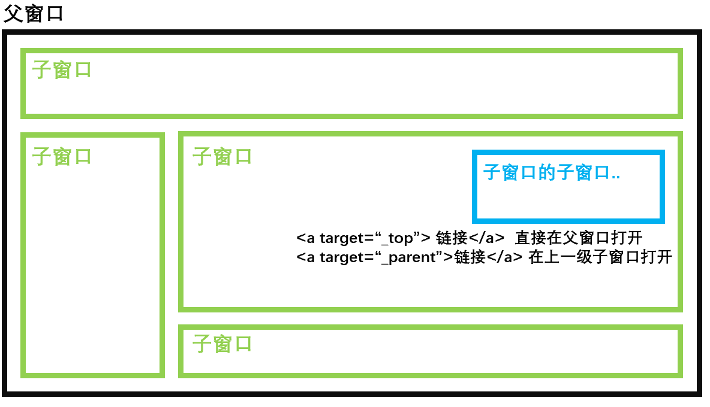
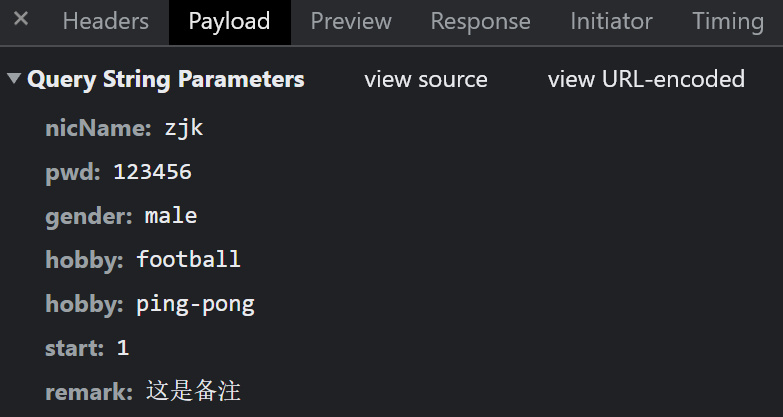
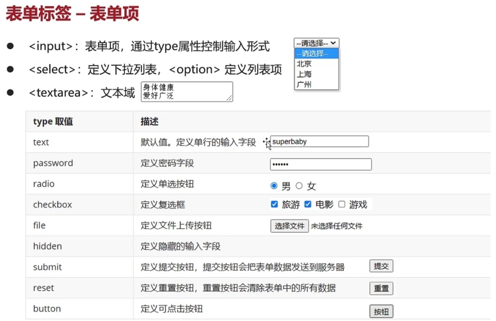

# HTML介绍

- HTML（超文本标记语言）是解释型的标记语言，
- HTML标签不区分大小写
- 浏览器是容错的
- .html或.htm

**W3C标准：** 网页主要由以下三个部分：

1. 结构：HTML
2. 表现：CSS
3. 行为：Javascript

https://developer.mozilla.org/

# HTML文档

## 基本元素

- HTML文档由5个主要元素组成：`<!DOCTYPE html> <html> <head> <title> <body>`。

```html
<!DOCTYPE html>
<html lang="en">
<head>
    <meta charset="UTF-8">
    <title>Title</title>
</head>
<body>

</body>
</html>
```

| 元素              | 说明                                                         |
| ----------------- | ------------------------------------------------------------ |
| `<!DOCTYPE html>` | 声明文档类型                                                 |
| `<html></html>`   | 根元素                                                       |
| `<head>`          | 放置HTML文件的信息 **容器**  <br>包含所有想包含在 HTML 页面中但不在 HTML 页面中显示的内容 |
| `<body>`          | 访问页面时所有显示在页面上的内容                             |

### 文档主语言

- 如果你的 HTML 文档的语言设置好了，那么你的 HTML 文档就会被搜索引擎更有效地索引

```html
<html lang="zh-CN">
  …
</html>
```

## 元数据

| 元素                       | 说明         |
| -------------------------- | ------------ |
| `<title>`                  | 页面标题     |
| `<meta charset="utf-8" />` | 编码格式     |
| `<link>`                   | 引入外部资源 |
| `<script>`                 |              |
| `<base>`                   |              |

### `<meta>`

#### charset属性

- 编码集

#### name和content属性

- 定义页面的作者和提供页面的简要描述

|属性|说明|
|:--|:--|
|name| 指定了 meta 元素的类型；说明该元素包含了什么类型的信息。|
|content| 指定了实际的元数据内容。|

```html
<meta name="author" content="Chris Mills" />
<meta
  name="description"
  content="The MDN Web Docs Learning Area aims to provide
complete beginners to the Web with all they need to know to get
started with developing web sites and applications." />

```

### 网页图标

```html
<!-- 含有高分辨率 Retina 显示屏的第三代 iPad：-->
<link
  rel="apple-touch-icon-precomposed"
  sizes="144x144"
  href="https://developer.mozilla.org/static/img/favicon144.png" />
<!-- 含有高分辨率 Retina 显示屏的 iPhone：-->
<link
  rel="apple-touch-icon-precomposed"
  sizes="114x114"
  href="https://developer.mozilla.org/static/img/favicon114.png" />
<!-- 第一代和第二代 iPad：-->
<link
  rel="apple-touch-icon-precomposed"
  sizes="72x72"
  href="https://developer.mozilla.org/static/img/favicon72.png" />
<!-- 不含高分辨率 Retina 显示的 iPhone、iPod Touch 和 Android 2.1+ 设备：-->
<link
  rel="apple-touch-icon-precomposed"
  href="https://developer.mozilla.org/static/img/favicon57.png" />
<!-- 基本 favicon -->
<link
  rel="icon"
  href="https://developer.mozilla.org/static/img/favicon32.png" />
```

### 引入外部CSS文件

```html
<link rel="stylesheet" href="my-css-file.css" />
```

### 引入外部js文件

```html
<script src="my-js.js async"></script>
```

# 特殊字符

| 原义字符 | 等价字符引用 |
| :------- | :----------- |
| <        | `&lt;`          |
| >        | `&gt;`          |
| "        | `&gt;`          |
| '        | `&apos;`          |
| &        | `&amp;`          |
|`&ge;` |>=|
|`&le;`| <=|
|`&reg;`|注册商标®|
|`&copy;`|版权符号©|
|`&nbsp;`| 空格|

# 元素

## 普通元素

| 元素                | 名称   | 说明                                                         |
| :------------------ | :----- | :----------------------------------------------------------- |
| `<br>`              | 换行   | 在HTML文件中输入换行符是无用的，必须使用`<br/>`标记来实现换行操作 |
| `<p></p>`           | 段落   | 段落标签在段前和段后各添加一个空行                           |
| `<h1></h1>`         | 标题   | `<h1>~<h6>`：一共6级标题                                     |
| `<span></span>`     | 无语义 | 当想要对它用 CSS（或者 JS）时，可以用它包裹内容，且不附加任何额外的意义。 |
|                     | 字体   | `<b></b>` 字体加粗 <br>`<i></i>` 字体倾斜 <br>`<u></u> `下划线 |
| `<center></center>` | 居中   | HTML页面的默认布局方式是从左到右。<br>`<center></center>`标记中的内容为居中显示 |
|`<label></label>`|标签|`<label for="其他标签的id"></label>`<br> 可以增加其他标签的事件触发范围|
||上下标|`<sub></sub>` 下标<br> `<sup></sup> `上标|
||引用|将其他元素嵌套在内<br> `<q></q>`行内引用<br>`<blockquote></blockquote>`块引用<br>cite属性：引文：引用资源指向的URL|
|`<hr>`|水平分割线||
|`<button>`|按钮||
||||
||||

## 列表

### 基本列表

| 元素        | 名称     | 说明                                                         |
| ----------- | -------- | ------------------------------------------------------------ |
| `<li></li>` | 列表项   |                                                              |
| `<ol></ol>` | 有序列表 | start： 表示从显示类型的第n个开始<br>type 显示的类型 A、a、I、i、1 |
| `<ul></ul>` | 无序列表 | type：disc 实心圆点、square 实心方块、circle 空心圆点        |

```html
<ul>
  <li>豆浆</li>
  <li>油条</li>
  <li>豆汁</li>
  <li>焦圈</li>
</ul>
```

### 描述列表

| 元素        | 名称       |
| ----------- | ---------- |
| `<dl></dl>` | 描述列表   |
| `<dt></dt>` | 列表项     |
| `<dd></dd>` | 列表项描述 |

```html
<dl>
    <dt>旁白：</dt>
    <dd>世界灿烂盛大</dd>
</dl>
```

<dl>
    <dt>旁白：</dt>
    <dd>世界灿烂盛大</dd>
</dl>


## `<a></a>` 锚点（超链接）

|属性|说明|子属性|
|:--|:--|:--|
|href |链接url|URL 可以指向 HTML 文件、文本文件、图像、文本文档、视频和音频文件以及可以在网络上保存的任何其他内容。|
|title|链接提示信息|  |
|target|窗口打开的方式| `_self` 在本窗口打开，默认<br>`_blank` 打开一个新的标签页<br>`_parent` 在父窗口打开<br>`_top` 在顶层窗口打开|

  

### 块级链接

- 任何内容（包括块级内容）都可以作为链接。

```html
<a href="https://developer.mozilla.org/zh-CN/">
  
</a>
```

### URL和路径

### 邮件链接 `mailto:` 

```html
<a href="mailto:zjk1054860443@163.com">向zjk发邮件</a>
mailto:
mailto:nowhere@mozilla.org
mailto:nowhere@mozilla.org,nobody@mozilla.org
mailto:nowhere@mozilla.org?cc=nobody@mozilla.org
mailto:nowhere@mozilla.org?cc=nobody@mozilla.org&subject=This%20is%20the%20subject
```

## 多媒体嵌入

| 元素                | 名称     | 说明                                                         |
| ------------------- | -------- | ------------------------------------------------------------ |
| `<figure></figure>` | 语义容器 | `<audio><video>`等<br>`<figcaption></figcaption>`：图片标题 |
| ``            | 图片     | src：图片的url<br>alt：图片的提示，图片显示失败后，在图片位置显示的文字<br>title：图片标题（悬停提示） |
| `<audio></audio>`   | 音频     | 支持MP3、WAV、OGG<br>src：音频的url<br>controls：显示播放控件<br>标签内容：显示失败后，在当前位置显示的文字 |
| `<video></video>`   | 视频     | 容器格式：支持MP4、WebM、OGG<br>src：音频的url<br/>controls：显示播放控件<br/>标签内容：显示失败后，在当前位置显示的文字 |

### svg 矢量图形

```html
<svg width="300" height="200">
    <rect width="100%" height="100%" fill="green" />
</svg>
```

```html
<iframe src="triangle.svg" width="500" height="500" sandbox>
    
</iframe>
```

### 响应式图片

## `<div></div>` 层

- `<div></div>` 定义HTML文档中的一个区域部分，经常和CSS一起使用。布局网页。

## `<table></table>` 表格 

| 元素                    | 名称                | 说明                                    |
| ----------------------- | ------------------- | --------------------------------------- |
| `<table></table>`       | 表格                | 表格可以嵌套                            |
| `<caption></caption>`   | 标题                |                                         |
| `<th></th>`             | 表头                | scope：表头类型：col / row<br>headers： |
| `<tr></tr>`             | 行                  |                                         |
| `<td></td>`             | 列                  | rowspan 跨行合并<br>colspan 跨列合并    |
| `<colgroup></colgroup>` | 列样式              | `<col>`：对应的列                       |
| `<thead>`               | 表头样式            | 通常放在`<colgroup></colgroup>`后面     |
| `<tfoot>`               | 表脚样式            |                                         |
| `<tbody>`               | 除表头/表脚外的部分 |                                         |

```html
<table>
    <caption>测试表</caption>
    <colgroup>
        <col>
        <col style="background-color: yellow">
    </colgroup>
    <tr>
        <th>Data 1</th>
        <th>Data 2</th>
    </tr>
    <tr>
        <th scope="col">Calcutta</td>
        <td>Orange</td>
    </tr>
    <tr>
        <th scope="col">Robots</td>
        <td>Jazz</td>
    </tr>
</table>
```

<table>
    <caption>测试表</caption>
    <colgroup>
        <col>
        <col style="background-color: yellow">
    </colgroup>
    <tr>
        <th>Data 1</th>
        <th>Data 2</th>
    </tr>
    <tr>
        <th scope="col">Calcutta</td>
        <td>Orange</td>
    </tr>
    <tr>
        <th scope="col">Robots</td>
        <td>Jazz</td>
    </tr>
</table>

# 网站架构

## 典型布局

| 标签                | 名称                                                         |
| ------------------- | ------------------------------------------------------------ |
| `<header></header>` | 页眉：简介形式的内容。<br>作为`<body>`子元素：网站的全局页眉<br>作为`<section>`/`<article>`子元素：部分的页眉 |
| `<nav></nav>`       | 导航栏                                                       |
| `<main></main>`     | 主内容，存放每个页面独有的内容。每个页面上只能用一次。<br>`<article></artcle>`文章<br>`<div></div>`<br>`<section></section>` |
| `<aside></aside>`   | 侧边栏：间接信息（术语条目、作者简介、相关链接，等等）       |
| `<footer></footer>` | 页脚                                                         |

#  嵌入

## `<iframe></iframe>`


# 表单

## `<form></form>` 表单

```html
<form action = "url" method = "get|post" name = "name" onSubmit = "" target = "">
</form>
```

| 属性     | 名称                             | 说明                                                         |
| -------- | -------------------------------- | ------------------------------------------------------------ |
| action   | 服务器接收地址                   | 服务器端能够接收表单数据的地址url，默认当前页面              |
| name     | 表单名称                         | name 必须要指定，否则这个文本框的数据将来是不会发送给服务端的 |
| value    | 发送给服务器的值                 |                                                              |
| method   | 指定数据传输到服务器的方式       | **get**  默认，将输入的数据追加到action指定的地址url后面，且最多2KB <br>**post** 会将输入的数据按照HTTP协议中的post传输方式传送到服务器。 |
| onSubmit | 指定当用户单击提交按钮时触发事件 |                                                              |
| target   | 指定输入数据结果显示的窗口       | `_blank` 在新窗口中打开目标文件。<br/>`_self` 在同一个窗口打开，默认。<br/>`_parent` 在父级窗口打开，一般使用框架页时使用。<br/>`_top` 在浏览器的整个窗口中打开，忽略任何框架。 |

- name属性：

   

## 表单控件

###  `<input/>` 输入 

**type类型**

 

| type类型 | 名称     |说明|
| :------- | :------- |:---|
| text     | 文本框   ||
| password | 密码域   ||
| file     | 文件域   ||
| radio    | 单选按钮 |name的属性值需要保持一致：实现互斥<br> checked属性设置默认选中的项|
| checkbox | 复选框   |name的属性值建议保持一致，以便获取数组 <br>checked属性设置默认选中的项|
| submit   | 提交按钮 |通过form标签的action属性|
| reset    | 重置按钮 |恢复到默认状态，不等于清空|
| button   | 普通按钮 ||
| hidden   | 隐藏域   |隐藏域设置的表单项不会显示到页面上。<br>提交表单时会一起被提交。|
| image    | 图像域   ||

**属性**

| 属性            | 描述                             |                        属性值                        |                           type属性                           |
| :-------------- | :------------------------------- | :--------------------------------------------------: | :----------------------------------------------------------: |
| type            | 指定输入字段的类型               |                          -                           |                              -                               |
| disabled        | 指定输入字段不可用（变为灰色）。 |                   null 或 disabled                   |                              -                               |
| checked         | 指定输入字段是否处于被选中状态。 |                   null 或 checked                    |                      radio 和 checkbox                       |
| maxlength       | 指定指定可输入文字的个数。       |                   默认没有字符限制                   |                       text 和 password                       |
| readonly        | 指定字段是否只读。               |                   null 或 readonly                   |                                                              |
| size            | 指定输入字段的宽度。             | text和password以文字个数为单位。其他时，以像素为单位 |                              -                               |
| src             | 指定图片的url。                  |                          -                           |                            image                             |
| width 和 height | 指定输入字段的宽和高。           |                          -                           |                            image                             |
| usemap          | 为图片设置热点地图               |       URI，URI格式为："#+`<map>`标记的name值"        |                            image                             |
| alt             | 指定当图片无法显示时显示的文字   |                          -                           |                            image                             |
| name            | 输入指定字段的名称               |                          -                           |                              -                               |
| value           | 指定输入字段默认的数据值         |     checkbox和radio不可忽略该属性；其他可忽略。      | button、reset和submit指定的是按钮上的文字；checkbox和radio指定的是数据项选定时的值 |

```html
<form action="demo04.html">
    昵称：<input type="text" name="nicName"/><br/><br/>
    密码：<input type="password" name="pwd"/><br><br/>
    性别：<input type="radio" name="gender" value="male"/> 男
         <input type="radio" name="gender" value="female" checked/> 女<br/><br/>
    爱好：<input type="checkbox" name="hobby" value="basketball"/> 篮球
         <input type="checkbox" name="hobby" value="football"/> 足球
          <input type="checkbox" name="hobby" value="ping-pong"/> 乒乓球 <br/><br/>
    星座：<select name="start">
              <option value="1">据星</option>
              <option value="2" selected>明星</option>
              <option value="3">后星</option>
              </select><br/><br/>
    备注：<textarea name="remark" rows="4" cols="50"></textarea><br/><br/>
    <input type="submit" value="注册"/>
    <input type="reset" value="重置"/>
    <input type="button" value="普通按钮"/>
</form>
```

<form action="demo04.html">
    昵称：<input type="text" name="nicName"/><br/><br/>
    密码：<input type="password" name="pwd"/><br><br/>
    性别：<input type="radio" name="gender" value="male"/> 男
         <input type="radio" name="gender" value="female" checked/> 女<br/><br/>
    爱好：<input type="checkbox" name="hobby" value="basketball"/> 篮球
         <input type="checkbox" name="hobby" value="football"/> 足球
          <input type="checkbox" name="hobby" value="ping-pong"/> 乒乓球 <br/><br/>
    星座：<select name="start">
              <option value="1">据星</option>
              <option value="2" selected>明星</option>
              <option value="3">后星</option>
              </select><br/><br/>
    备注：<textarea name="remark" rows="4" cols="50"></textarea><br/><br/>
    <input type="submit" value="注册"/>
    <input type="reset" value="重置"/>
    <input type="button" value="普通按钮"/>
</form>
### `<textarea></textarea>` 多行文本框/文本域 

- `<textarea></textarea>` 
  - rows 默认显示n行
  - cols 默认显示n列
- 其value值就是开始`<textarea>`和结束`</textarea>`标签之间的内容

**属性**

| 属性     | 描述                                 |
| :------- | :----------------------------------- |
| name     | 用于指定多行文本的名称               |
| cols     | 用于指定多行文本框显示的列数（宽度） |
| rows     | 用于指定多行文本框显示的行数（高度） |
| disabled | 用于指定当前多行文本框不可用（灰色） |
| readonly | 用于指定当前多行文本框为只读         |
| wrap     | 用于设置多行文本框的文字是否自动换行 |

**wrap属性的可选值**

| 可选值 | 描述                                                         |
| :----- | :----------------------------------------------------------- |
| hard   | 默认，表示自动换行，如果文字超过cols属性所指的列数就自动换行，并且提交到服务器时换行符自动被提交 |
| soft   | 表示自动换行，如果文字超过cols属性所指的列数就自动换行，但提交到服务器时换行符不被提交 |
| off    | 表示不自动换行，如果想让文字换行，只能按下Enter回车强制换行  |

### `<label></label>` 标签

```html
<label for="mail">E-mail:</label>
```

- for="id"：将标签链接到表单控件

## `<filedset></filedset>`部件组

| 元素                | 说明           |
| ------------------- | -------------- |
| `<legend></legend>` | 表单部件组标题 |

```html
<form>
  <fieldset>
    <legend>Fruit juice size</legend>
    <p>
      <input type="radio" name="size" id="size_1" value="small">
      <label for="size_1">Small</label>
    </p>
    <p>
      <input type="radio" name="size" id="size_2" value="medium">
      <label for="size_2">Medium</label>
    </p>
    <p>
      <input type="radio" name="size" id="size_3" value="large">
      <label for="size_3">Large</label>
    </p>
  </fieldset>
</form>
```

<form>
  <fieldset>
    <legend>Fruit juice size</legend>
    <p>
      <input type="radio" name="size" id="size_1" value="small">
      <label for="size_1">Small</label>
    </p>
    <p>
      <input type="radio" name="size" id="size_2" value="medium">
      <label for="size_2">Medium</label>
    </p>
    <p>
      <input type="radio" name="size" id="size_3" value="large">
      <label for="size_3">Large</label>
    </p>
  </fieldset>
</form>
