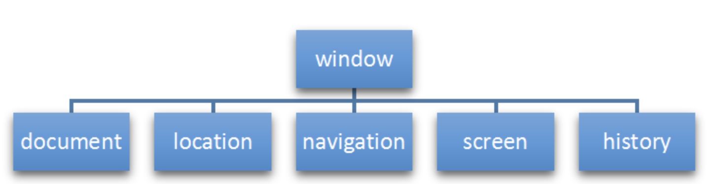

# JavaScript介绍

## JavaScript

- 解释型的脚本语言
   - 不会产生编译出来的字节码文件，而是在程序的运行过程中对源文件逐行进行解释。
- 基于对象
   - 基于对象的脚本语，能够实现封装，可以模拟继承，不支持多态
- 弱类型语言
  - 变量的数据类型由所赋的值决定
  - 有明确的数据类型，但声明一个变量后它可以接收任何类型的数据，并且会在程序执行过程中根据上下文自动转换类型。
- 采用事件驱动的脚本语言，它不需要经过Web服务器就可以对用户的输入做出响应
- 跨平台
  - 不依赖于操作系统，仅需要浏览器的支持

**JavaScript和Java**

| JavaScript                                                   | Java                                                         |
| :----------------------------------------------------------- | :----------------------------------------------------------- |
| 面向对象。不区分对象类型。通过原型机制继承，任何对象的属性和方法均可以被动态添加。 | 基于类系统。分为类和实例，通过类层级的定义实现继承。不能动态增加对象或类的属性或方法。 |
| 变量类型不需要提前声明 (动态类型)。                          | 变量类型必须提前声明 (静态类型)。                            |
| 不能直接自动写入硬盘。                                       | 可以直接自动写入硬盘。                                       |

**ECMAScript 规范**

## 向页面添加JavaScript

### 内部JavaScript

- 在`<head>`标签结束前：

```html
<html>
    <head>
        <script>
            //书写内部JavaScript
        </script>
    </head>
    <body>
        
    </body>
</html>
```

### 外部JavaScript

```html
<script src="/js/demo01.js" async></script>
```

#### 脚本调用策略

| 属性  | 说明                                             |
| ----- | ------------------------------------------------ |
| async | 异步，js和html一同加载；但无法控制脚本的运行次序 |
| defer | 按上下顺序控制脚本的运行次序                     |

## Web控制台

**单行模式**

```javascript
console.log()
```

**多行模式**

```javascript
(function(){
    "use strict";

    function greetMe(yourName) {
        alert('Hello ' + yourName);
    }

    greetMe('World');

})();
```

# 基础语法

## 变量

### 声明

- JavaScript 是区分大小写的，并使用 Unicode 字符集。

| 变量  | 说明                                                         |
| :---- | :----------------------------------------------------------- |
| var   | 声明一个变量，可选初始化一个值。                             |
| let   | 声明一个块作用域的局部变量，可选初始化一个值。               |
| const | 声明一个块作用域的只读常量，不允许重新赋值 ，声明的时候必须赋值（初始化） |

- 如果访问一个未声明的变量会导致抛出一个引用错误（ReferenceError）异常。
- 只声明而没有初始化的变量：值为undefined。

**作用域**

- 全局变量：在函数之外声明的变量，可被当前文档中的任何其他代码所访问。
- 局部变量：在函数内部声明的变量，只能在当前函数的内部访问。
  - 函数内部，如果变量没有声明而直接赋值（var)，相当于对同名的全局变量操作。

```js
let number = 1;
(function (){
    number = 33;
})();
alert(number); //33 全局变量number被更改
```

### var 变量提升

| 变量      | 说明                                                         |
| --------- | ------------------------------------------------------------ |
| var       | 提升变量到代码块的顶部，初始值为undefined ，直到变量的声明代码处，才被赋予应有的赋值。 |
| let const | 提升变量到代码块的顶部但是不会被赋予初始值。在变量声明之前引用这个变量，将抛出引用错误（ReferenceError）：直到变量的声明代码处，才被赋予初始值。 |

```javascript
console.log(x === undefined); // true
var x = 3;

console.log(y); // ReferenceError
let y = 3;
```

- 一个函数中所有的var语句应尽可能地放在接近函数顶部的地方，避免变量提升。

**函数提升**

- 只有函数声明会被提升到顶部，而函数表达式不会被提升。

```javascript
/* 函数声明 */

foo(); // "bar"

function foo() {
  console.log("bar");
}


/* 函数表达式 */

baz(); // 类型错误：baz 不是一个函数

var baz = function() {
  console.log("bar2");
};
```

### 解构赋值

- 对于数组等可迭代的对象：

```javascript
let [x,y] = [1,2]
//x,y分别被赋值1,2
```

- 如果等号左边的参数少于右边：右边多出的会被忽略。
- 如果等号左边的参数多于右边：左边多出的参数值为undifind。
- 对于对象属性：只有名称相对应的参数会被赋值，不匹配的参数值为undifind。

## 基本数据类型

| 类型      | 名称   | 说明                                                         |
| :-------- | :----- | :----------------------------------------------------------- |
| number    | 数值型 | Infinity 无穷<br>NaN 非数值                                  |
| string    | 字符串 | JavaScript不区分字符、字符串；<br>单引号、双引号作用相同。   |
| boolean   | 布尔型 | true：非零的数值，非空字符串，非空对象<br>false：零 NaN，空字符串，null，undefined |
| null      | 空     | number: 0 <br>boolean：false<br>typeof()返回object类型       |
| undefined | 未定义 | 变量未初始化时的默认为undefined                              |

- typeof(变量) 返回变量数据类型

### 类型转化

**自动转换**

| 类型       | 值               | boolean | String              | number |
| :-------- | :-------------- | :------ | :------------------ | :----- |
| number    | 0<br>NaN        | false   | "0"<br>"NaN"        |        |
|           | Infinity<br>123 | true    | "Infinity"<br>"123" |        |
| string    | "" 空字符串      | false   |                     | 0      |
|           | "abc" 非数值     | true    |                     | NaN    |
|           | "123" 数值       | true    |                     | 123    |
| null      |                 | false   | "null"              | NaN    |
| undefined |                 | false   | "undefined          | 0      |

**强制转换**

| 转换          | 方法                        |
| :----------- | :------------------------- |
| 转换为String  | String()                   |
|               | toString()                 |
| 转换为number  | Number()                   |
|               | parseInt()<br>parseFloat() |
| 转换为boolean | Boolean()                  |
|               |                            |

- string 按照字符串的字面值，转为数字；不是数字则转为NaN
  - `var number = +"123"; `  **+转为数字**
  - `parseInt(str)`
- boolean  true转为1，false转为0
  - `var number = +true;` 

### 堆栈空间分配

  

## 运算符

| 运算符 | 说明                                       | 实例              |
| :----- | :----------------------------------------- | ----------------- |
| ==     | 等于，只根据表面的值判断，不考虑数据类型   | "17"==17 //true   |
| ===    | 绝对等于，根据表面值和数据类型考虑         | "17"===17 //false |
| !=     | 不等于，只根据表面的值判断，不考虑数据类型 | "17"!=17 //false  |
| !==    | 绝对不等于，根据表面值和数据类型考虑       | "17"!==17 //true  |

## 操作符

| 操作符      | 说明                                                         | 示例                                                         |
| ----------- | ------------------------------------------------------------ | ------------------------------------------------------------ |
| in          | 是否为对象的属性名                                           | `let person = {name:"tom"};`<br>`"name" in person;`//true    |
| instanceof  | 是否为对象类的实例                                           | `let d = new Date();`<br>`d instanceof Date;`//true          |
| eval() 函数 | 传入非字符串：返回该值<br>传入字符串：作为JavaScript代码解析 | 返回最后一句表达式/语句的值；没有值则undefined<br>eval()内使用const/let声明的变量只在eval内作用<br>eval()内使用var变量作用域和eval()所在相同 |
| ?:          | 三元操作符                                                   |                                                              |
| ??          | 先定义：如果左侧为null/undefined，则返回右侧的值             | `null ?? 1`//返回1                                           |
| typeof      | 显示类型<br>null --> object<br>符号--> symbol                | `typeof 123`//"number"                                       |
| delete      | 删除                                                         | `delete person.name;`//删除person对象的name属性<br>`delete arr[0];`//删除arr数组的第1个元素 |
| await       |                                                              |                                                              |
| void        |                                                              |                                                              |

## 流程控制

### 条件语句

#### if..else

- 如果需要在条件表达式中使用赋值，通常在赋值语句前后额外添加一对括号

```javascript
if ((x = y)) {
  /* statements here */
}
```

#### switch

```javascript
switch (expression) {
   case label_1:
      statements_1
      [break;]
   case label_2:
      statements_2
      [break;]
   ...
   default:
      statements_def
      [break;]
}
```

### 循环

#### for

```javascript
for ([initialExpression]; [condition]; [incrementExpression]){
  statement
}
```

#### for..of和for..in

- for..in循环一个指定的变量来循环一个对象所有可枚举的属性 。


- for...of循环可迭代对象，对值的每一个独特属性调用一次迭代。

- Map类型：for..of每次循环输出一个数组：`[key,value]`。

**for..of和for..in**

|循环|遍历的结果|
|:--|:--|
|for...in|数组元素的下标|
|for...of|元素的值|

- 数组迭代是实时的，如果在迭代中修改数组中下一个元素的值，则迭代出的下个元素的值是修改后的。

```javascript
let arr = [3, 5, 7];
arr.foo = "hello"; 
//这里的foo严格意义上来说是数组的属性，而不是数组中的元素
//所以for..of不会输出foo属性对应的值，而是输出数组中的元素

for (let i in arr) {
  console.log(i); // 输出 "0", "1", "2", "foo"
}

for (let i of arr) {
  console.log(i); // 输出 "3", "5", "7"
}

// 注意 for...of 的输出没有出现 "hello"
```

#### do..while

- statement在检查条件之前会执行一次。

```javascript
do{
    statement
}while (condition);
```

#### while

```javascript
while (condition){
    statement
}
```

#### continue

```javascript
var num = 0;
outPoint:
for (var i = 0 ; i < 10 ; i++){
  for (var j = 0 ; j < 10 ; j++){
    if( i == 5 && j == 5 ){
      break outPoint; // 在 i = 5，j = 5 时，跳出所有循环，
                      // 返回到整个 outPoint 下方，继续执行
    }
    num++;
  }
}

alert(num); // 输出 55
```

#### break

- 当使用不带 label 的 break时，它会立即终止当前所在的 `while`，`do-while`，`for`，或者 `switch` 并把控制权交回这些结构后面的语句。
- 当使用带 label 的 break时，它会终止指定的带标记（label）的语句。

```javascript
break [label];
```

#### label

- 当使用不带 label 的 `continue` 时，它终止当前 `while`，`do-while`，或者 for 语句到结尾的这次的循环并且继续执行下一次循环。
- 当使用带 label 的 `continue` 时，它会应用被 label 标识的循环语句。

```javascript
continue [label];
```

## 异常处理

### throw

```javascript
throw new UserException("Value too high");
```

### try-catch-finally

```javascript
openMyFile();
try {
    writeMyFile(theData); //This may throw a error
}catch(e){
    handleError(e); // If we got a error we handle it
    console.log(e.name);
    console.log(e.message);
}finally {
    closeMyFile(); // always close the resource
}
```

### Error对象

**属性**

|Error属性|说明|
|:--|:--|
|name|提供了常规的错误类（如 'DOMException' 或 'Error'）|
|message|通常提供了一条从错误对象转换成字符串的简明信息。|

```javascript
throw (new Error('The message'));
```

## 函数

### 定义函数

- 形参不需要数据类型
- 返回值也不需要定义类型，如果需要返回值，直接return相应的数据即可。

```javascript
function 函数名(参数1, 参数2,...) {
    ...语句;
  return 返回值;
}

var 变量 =  function (参数列表) {
   //执行语句
}
```

### 调用函数

- 调用时，函数调用可以传递任意个数的参数，可以没有参数也可以超过列表中的参数。
- 如果参数超过参数列表的个数：多余的参数被传递，但不接收
- 如果参数低于参数列表的个数：其没有接收到传递值的参数会转为undifined

**调用方式**

```javascript
//绑定函数变量
var 变量 = 函数名(参数列表);
//事件绑定
事件名 = "函数名()"
//直接调用
函数名(参数列表);
```

```javascript
var add = function (a,b){
    return a + b;
}

alert(add);  //返回函数体
alert(add(1,2,3)); //3 多余的参数不接收
alert(add(1)); //NaN
```

### 匿名函数

- 声明一个函数，相当于创建了一个函数对象，将这个对象的引用赋值给变量。

```javascript
var 变量 = function(参数1, 参数2) {
    ...语句;
  return 返回值;
};
```

### 立即函数

- 立刻调用执行

```js
(function (a, b) {
    console.log(a + b);
})(1, 2);
```

# 事件

- 侦听事件发生的结构称为**事件监听器**（Event Listener）
- 响应事件触发而运行的代码块被称为**事件处理器**（Event Handler）

## 常见事件

[HTML 事件参考手册 (w3school.com.cn)](https://www.w3school.com.cn/tags/html_ref_eventattributes.asp)

## 事件绑定

- 事件传递

**事件绑定方式：**

1. 通过HTML标签中的事件属性进行绑定
   - `<标签 事件="函数()">`
2. 通过DOM的Element属性进行绑定
   - `document.getElementById("id属性").事件 = 函数()`

```javascript
document.getElementById("H1").onclick = function (){
    alert("点击成功");
}
```

# 对象

## 自定义对象

### 声明对象

```javascript
//通过new构造对象
obj = new Object();

//声明对象
let person = {
    name: "Tom",
    age: 18,
    eat: function () {
        alert("eat food");
    },
    show : function () {
        alert(`hello ${this.age}岁的${this.name} !`);
    }
}

//动态添加属性
person.sex = "man";
person["father"] = "Mac";
//动态添加方法
person.say = function (word){
    console.log(`${word}`);
}

let students = [
    //匿名对象
    {name:'小明',age:"18",gender:"男",hometown:"河北省"},
    {name:'小红',age:"19",gender:"女",hometown:"福建省"},
    {name:'小刚',age:"17",gender:"男",hometown:"山东省"}
]
```

- 同名的属性/方法会被后来的覆盖。
- 使用delete操作符删除对象的属性/方法。

### 属性/方法访问

 ```javascript
 person.name;
 person["name"];
 ```

#### ?. 条件访问/调用

```javascript
//当属性（右侧）为null或undefined时，不访问该属性，直接返回undefined
person?.name;
person?.[name];
//当调用者（左侧）为null或undefined时，不调用该函数，直接返回undefined
person?.(eat("apple"));
```

### this关键字

| this位置   | 指向                                 |
| ---------- | ------------------------------------ |
| 在函数外面 | 指向window对象（代表当前浏览器窗口） |
| 在函数里面 | 指向调用函数的对象                   |

## 系统对象

| 对象   | 说明             |
| :----- | :--------------- |
| Date   | 日期时间处理     |
| Array  | 数组处理         |
| String | 字符串处理       |
| Math   | 数学处理         |
| Number | number对应的对象 |

### Math对象

| 方法     | 说明              |
| -------- | ----------------- |
| random() | 返回0~1的随机小数 |
| floor()  | 地板数            |
| ceil()   | 天花板数          |

```js
Math.floor(Math.random() * 10); //0~9
```

### Date对象

**创建**

1. 指定日期时间

```javascript
var 日期实例 = new Date("MM DD,YYYY,hh:mm:ss);
```

2. 当前日期时间

```javascript
var 日期实例 = new Date();
```

**常用方法**

| 方法              | 说明                                                 |
| :---------------- | :--------------------------------------------------- |
| getDate()         | 返回月中的第几天（从 1 到 31）。                     |
| getDay()          | 返回星期几（0-6）。                                  |
| getFullYear()     | 返回年份。                                           |
| getHours()        | 返回小时（从 0-23）。                                |
| getMilliseconds() | 返回毫秒（0-999）。                                  |
| getMinutes()      | 返回分钟（从 0-59）。                                |
| getMonth()        | 返回月份（从 0-11）。                                |
| getSeconds()      | 返回秒数（从 0-59）。                                |
| getTime()         | 返回自 1970 年 1 月 1 日午夜以来与指定日期的毫秒数。 |

### Array 数组

#### 创建数组

- 该数组是变长变类型的；数组的长度不固定；数组存放的各元素的数据类型可以不一样。

```javascript
var 数组名 = new Array(元素列表);
var 数组名 = [元素列表];
```

**添加和访问：**

- `arr[下标] = 值;` `arr[下标];`
- 下标从0开始

```javascript
// 1.创建数组对象
var arr01 = new Array(1,2,3);
alert(arr01); //1,2,3
var arr = ["cat","dog","tiger"];
alert(arr); //cat,dog,tiger
alert(arr[0]); //cat
//数组的长度不固定
alert(arr.length); //3
//数组存放的各元素的数据类型可以不一样。
alert(arr[10] = "ten"); //ten
alert(arr.length); //11
alert(arr[9]); //undefined
```

#### 数组方法

| 方法                       | 说明                                             |
| :------------------------- | :----------------------------------------------- |
| push(value)                | 向数组中压入value值                              |
| splice(index,count,item..) | 删除元素，且返回被删除元素。                     |
| reverse()                  | 数组元素反序                                     |
| join("分隔符")             | 数组元素拼接成字符串，每个元素之间以分隔符连接   |
| split("分隔符")            | 以分隔符将字符串拆分为数组                       |
| pop()                      | 弹出（删除）数组中的最后一个元素，同时返回该元素 |

#### 数组删除

##### delete操作符

- delete 方法用于删除对象的某个属性，也可以用来删除数组中某个元素。
- 不会改变数组的长度，即删除后数组的元素个数不会改变， 数组中删除的元素的位置会被设置为 undefined，并且它的位置不会被重新分配，因此被删除的元素将占用内存空间。

```javascript
const arr = [0, 1, 2, 3, 4];
delete arr[2];
console.log(arr); // [0, 1, <1 empty item>, 3, 4]
```

##### splice()

- splice 方法用于删除数组中的元素且可以改变数组的长度。

```javascript
array.splice(start, deleteCount, item1, item2, ...)
```

- start: 表示开始位置的索引，必填；

- deleteCount: 表示要删除的元素数量，如果为0，则不删除元素，如果不指定，则从start位置开始，将数组中从该位置开始到数组结尾的所有元素都删除；

- item1, item2, ...: 表示要插入的元素，如果没有要插入的元素，则可以省略。


```javascript
//删除了从索引2开始的1个元素（即2），并返回已删除的元素。
//同时，原数组被改变，从而变成[0, 1, 3, 4]。
const arr = [0, 1, 2, 3, 4];
arr.splice(2, 1);
console.log(arr); // [0, 1, 3, 4] 
```

### String 字符串

```javascript
var 变量 = new String(""); 
var 变量 = ""
```

**模板字符串**

- 字符串使用反引号\`\`
- \$\{\}内为引用的变量

```js
let name = "Tom";
let str = `hello ${name}`; //hello Tom
```

**属性**

- length

**方法**

| 方法      | 说明                                             |
| :-------- | :----------------------------------------------- |
| charAt()  | 返回指定位置的字符，超过字符串长度的返回空格     |
| indexOf() | 检索字符串，返回第一个找到的下标，找不到则返回-1 |
| trim()    | 去除字符串前后两端的空白字符                     |

### RegExp 正则表达式 

**正则表达式对象**

```javascript
var reg = /正则/
var reg = new RegExp("正则")
```

**语法规则**

**单个**

| 符号 | 含义                                                     |
| :--- | :------------------------------------------------------- |
| ^    | 表示开始                                                 |
| $    | 表示结束                                                 |
| [ ]  | 代表某个范围内的单个字符，比如： [0-9] 单个数字字符      |
| .    | 代表任意单个字符，除了换行和行结束符                     |
| \w   | 代表单词字符：字母、数字、下划线(_)，相当于 [A-Za-z0-9_] |
| \d   | 代表数字字符： 相当于 [0-9]                              |

**量词：**

| 符号  | 含义             |
| :---- | :--------------- |
| +     | 至少一个         |
| `*`   | 零个或多个       |
| ？    | 零个或一个       |
| {x}   | x个              |
| {m,}  | 至少m个          |
| {m,n} | 至少m个，最多n个 |

#### 表单验证

- 当输入框失去焦点时，验证输入内容是否符号要求
- 当点击注册按钮时，判断所有输入框的内容是否都符合要求，如果不符合则阻止表单提交。

**应用**

- js文件

```javascript
var userNameInput = document.getElementById("userNameInput");
userNameInput.onblur = checkUserName;

function checkUserName() {
    var userName = userNameInput.value.trim();
    var reg = /^\w{6,12}$/;
    //判断名字是否符合规则：6~12位
    if (userName.length >= 6 && userName.length <= 12 && reg.test(userName)) {
        document.getElementById("userNameErr").style.display = "none";
        return true;
    } else {
        document.getElementById("userNameErr").style.display = "";
        userNameInput.value = "";
        return false;
    }
}

var passwdInput = document.getElementById("passwdInput");
passwdInput.onblur = checkPasswd;

function checkPasswd() {
    //密码规则：6~12位 不能全部为数字
    if (passwdInput.value.length >= 6 && passwdInput.value.length <= 12 && !/^\d{6,12}$/.test(passwdInput.value)) {
        document.getElementById("passwdErr").style.display = "none";
        return true;
    } else {
        document.getElementById("passwdErr").style.display = "";
        passwdInput.value = "";
        return false;
    }
};

var phoneNumInput = document.getElementById("phoneNumInput");
phoneNumInput.onblur = checkPhoneNum;

function checkPhoneNum() {
    //电话号码：11位；且全部数字
    if (phoneNumInput.value.length == 11 && /^\d{6,12}$/.test(phoneNumInput.value)) {
        document.getElementById("phoneNumErr").style.display = "none";
        return true;
    } else {
        document.getElementById("phoneNumErr").style.display = "";
        phoneNumInput.value = "";
        return false;
    }
}

var regForm = document.getElementById("reg-form");
//表单提交
regForm.onsubmit = function () {
    if (checkPasswd() && checkUserName() && checkPhoneNum()) {
        alert("已提交");
        return true;
    } else
        return false;
}
```

## BOM 浏览器对象模型

- Browser Object Model
- JavaScript将浏览器的各个组成部分封装为对象

   

**主要包含的对象**

| 对象      | 说明           |
| :-------- | :------------- |
| Window    | 浏览器窗口对象 |
| History   | 历史记录对象   |
| Location  | 地址栏对象     |
| Navigator | 浏览器对象     |
| Screen    | 屏幕对象       |

### Window 浏览器窗口对象

- 直接使用window对象，`window.`可以省略

**属性**

| 属性      | 说明                               |
| :-------- | :--------------------------------- |
| history   | 对 History 对象的只读引用。        |
| Navigator | 对 Navigator 对象的只读引用。      |
| Screen    | 对 Screen 对象的只读引用。         |
| location  | 用于窗口或框架的 Location 对象。。 |

**方法**

| 方法          | 说明                                                        |
| :------------ | :---------------------------------------------------------- |
| alert()       | 显示带有一段消息和一个确认按钮的警告框。                    |
| confirm()     | 显示带有一段消息以及确认按钮和取消按钮的对话框。返回boolean |
| setInterval() | 按照指定的周期（以毫秒计）来调用函数或计算表达式。          |
| setTimeout()  | 在指定的毫秒数后调用函数或计算表达式。                      |

```html
<!DOCTYPE html>
<html lang="en">
<head>
    <meta charset="UTF-8">
    <title>Title</title>
</head>
<body>
</body>
<script typr="text/javascript">
    window.alert("Hello"); //window可以省略

    //confirm 返回boolean
    //确定：true 取消：false
    if(confirm("是否确认删除"))
        alert("删除成功");
    else
        alert("已取消");

    //定时器 在一段时间后执行
    //setTimeout(函数,毫秒) 执行一次
    //setInterval(函数,毫秒) 循环执行
    setTimeout(function (){
        alert("setTimeout 执行")
    },1000);
    var count = 0;
    setInterval(function (){
        alert("setInterval 执行" + ++count);
    },1000);
</script>
</html>
```

**不常用的**

| 属性          | 说明                                                    |
| :------------ | :------------------------------------------------------ |
| closed        | 返回窗口是否已被关闭。                                  |
| defaultStatus | 设置或返回窗口状态栏中的默认文本。                      |
| document      | 对 Document 对象的只读引用。请参阅 Document 对象。      |
| innerheight   | 返回窗口的文档显示区的高度。                            |
| innerwidth    | 返回窗口的文档显示区的宽度。                            |
| length        | 设置或返回窗口中的框架数量。                            |
| name          | 设置或返回窗口的名称。                                  |
| opener        | 返回对创建此窗口的窗口的引用。                          |
| outerheight   | 返回窗口的外部高度。                                    |
| outerwidth    | 返回窗口的外部宽度。                                    |
| pageXOffset   | 设置或返回当前页面相对于窗口显示区左上角的 X 位置。     |
| pageYOffset   | 设置或返回当前页面相对于窗口显示区左上角的 Y 位置。     |
| parent        | 返回父窗口。                                            |
| self          | 返回对当前窗口的引用。等价于 Window 属性。              |
| status        | 设置窗口状态栏的文本。                                  |
| top           | 返回最顶层的先辈窗口。                                  |
| window        | window 属性等价于 self 属性，它包含了对窗口自身的引用。 |

- screenXxx只读整数。声明了窗口的左上角在屏幕上的的 x 坐标和 y 坐标
  - IE、Safari 和 Opera 支持 screenLeft 和 screenTop
  - 而 Firefox 和 Safari 支持 screenX 和 screenY

**方法**

| 方法            | 说明                                           |
| :-------------- | :--------------------------------------------- |
| blur()          | 把键盘焦点从顶层窗口移开。                     |
| clearInterval() | 取消由 setInterval() 设置的 timeout。          |
| clearTimeout()  | 取消由 setTimeout() 方法设置的 timeout。       |
| close()         | 关闭浏览器窗口。                               |
| createPopup()   | 创建一个 pop-up 窗口。                         |
| focus()         | 把键盘焦点给予一个窗口。                       |
| moveBy()        | 可相对窗口的当前坐标把它移动指定的像素。       |
| moveTo()        | 把窗口的左上角移动到一个指定的坐标。           |
| open()          | 打开一个新的浏览器窗口或查找一个已命名的窗口。 |
| print()         | 打印当前窗口的内容。                           |
| prompt()        | 显示可提示用户输入的对话框。                   |
| resizeBy()      | 按照指定的像素调整窗口的大小。                 |
| resizeTo()      | 把窗口的大小调整到指定的宽度和高度。           |
| scrollBy()      | 按照指定的像素值来滚动内容。                   |
| scrollTo()      | 把内容滚动到指定的坐标。                       |

#### 定时函数

| 函数                                     | 说明                           |
| :--------------------------------------- | :----------------------------- |
| setTimeout("要执行的语句",时间)          | 在指定毫秒时间后执行           |
| clearTimeout(timeoutID)                  | 清除定时设置                   |
| setInterval("要执行的语句",周期间隔时间) | 按照指定的周期（毫秒时间）执行 |
| clearInterval()                          | 清除定时设置                   |

```javascript
function myShowTime(){  
    console.log(new Date());
}

function myRun(){
    console.log("等待3秒");    
    setTimeout(3000);
    myShowTime();
    console.log("结束");
}

var counter = 0;

function myCycle(){
    setInterval(1000);
    console.log("开始" + ++counter + "次");
    myShowTime();
}

myRun();
myCycle();
```

#### 定时切换图片

```html
<!DOCTYPE html>
<html lang="en">
<head>
    <meta charset="UTF-8">
    <title>Title</title>
</head>
<body>
<input type="button" onclick="th()" value="picture_01">

<input type="button" onclick="th02()" value="picture_02">
</body>
<script typr="text/javascript">
    function th() {
        document.getElementById("myImage").src = "E:\\HTML\\images\\th.jpg";
    }

    function th02() {
        document.getElementById("myImage").src = "E:\\HTML\\images\\th02.jpg";
    }

    var count = 1;
    setInterval(function () {
        if (++count % 2 == 0) {
            th();
        } else {
            th02();
        }
    }, 1000)
</script>
</html>
```

#### 定时切换随机颜色

- 十六进制：`#ffffff`
- RGB：`rgb(00,00,99)`

```js
let getRGB = function () {
    let rgb = "rgb(";
    for (let i = 0; i < 3; i++) {
        rgb += Math.floor(Math.random() * 255) + 1 + ",";
    }
    rgb = rgb.substring(0, rgb.length - 1);
    rgb += ")";
    return rgb;
}
let getFFF = function () {
    let fff = "#";
    let arr = ["0", "1", "2", "3", "4", "5", "6", "7", "8", "9", "a", "b", "c", "d", "e", "f"];
    for (let i = 0; i < 6; i++) {
        fff += arr[Math.floor(Math.random() * 15)];
    }
    return fff;
}

setInterval(function (){
    document.getElementById("timeShow").style.color = getRGB();
},1000);
```

### history对象

**获取history对象**

```javascript
window.history().方法();
history.方法();
```

**方法**

| 属性      | 说明                                |
| :-------- | :---------------------------------- |
| back()    | 加载 history 列表中的前一个 URL。   |
| forward() | 加载 history 列表中的下一个 URL。   |
| go()      | 加载 history 列表中的某个具体页面。 |

### location对象

**获取**

```javascript
window.location().方法();
location.方法();
```

| 属性 | 说明                   |
| :--- | :--------------------- |
| href | 设置或返回完整的 URL。 |

```javascript
alert("即将到达百度");
document.write("3秒后跳转到百度");

setTimeout(function (){
    location.href = "https://www.baidu.com"; //直接跳转到百度
},3000)
```

**属性**

| 属性     | 说明                                          |
| :------- | :-------------------------------------------- |
| hash     | 设置或返回从井号 (#) 开始的 URL（锚）。       |
| host     | 设置或返回主机名和当前 URL 的端口号。         |
| hostname | 设置或返回当前 URL 的主机名。                 |
| pathname | 设置或返回当前 URL 的路径部分。               |
| port     | 设置或返回当前 URL 的端口号。                 |
| protocol | 设置或返回当前 URL 的协议。                   |
| search   | 设置或返回从问号 (?) 开始的 URL（查询部分）。 |

**方法**

| 方法      | 说明                     |
| :-------- | :----------------------- |
| assign()  | 加载新的文档。           |
| reload()  | 重新加载当前文档。       |
| replace() | 用新的文档替换当前文档。 |


### navigator对象

### screen对象


## DOM 文档对象模型

- DOM定义了访问HTML和xml文档的标准。W3C（万维网联盟）的标准。

**W3C DOM标准分为3个不同部分：**

1. 核心DOM：针对任何结构化文档的标准模型
   - Document  整个文档对象 
   - Element 元素对象
   - Attribute 属性对象    
   - Text 文本对象
   - Comment  注释对象  
2. XML DOM：针对xml文档的标准模型
3. HTML DOM：找到HTML文档的标准模型
   - Image：``
   - Button：`<input type="button">`

**DOM树**

 

| 对象     | 节点名称 | 组成部分         |
| -------- | -------- | ---------------- |
| Document | 文档节点 | 整个文档         |
| Element  | 元素节点 | HTML标签         |
| Text     | 文本节点 | HTML标签内的文本 |
| Attr     | 属性节点 | HTML标签内的属性 |
| Comment  | 注释节点 | 注释             |

### Element 元素对象

[DOM具体属性使用](https://www.w3school.com.cn/js/js_htmldom.asp)

#### 获取Element对象

| 方法                                     | 说明                                     |
| :--------------------------------------- | :--------------------------------------- |
| document.getElementById("id")            | 根据id属性值获取，返回一个Element对象    |
| document.getElementsByName("name")       | 根据name属性值获取，返回Element对象数组  |
| document.getElementsByTagName("h1")      | 返回带有指定标签名的对象的集合           |
| document.getElementsByClassName("class") | 根据class属性值获取，返回Element对象数组 |
| document.querySelector("css选择器")      | 根据CSS选择器获取，返回第一个Element对象 |
| document.querySelectorAll("css选择器")   | 根据CSS选择器获取，返回Element对象集合   |

#### 操作Element对象

| 常用用途  | 属性      | 说明                                                         |
| --------- | :-------- | :----------------------------------------------------------- |
| 文档      | referrer  | 设置或返回载入当前文档的URL                                  |
|           | URL       | 设置或返回当前文档的URL                                      |
| 样式      | style     | 设置或返回元素的style属性：CSS样式                           |
| 表单      | value     | 设置和返回元素的value值                                      |
|           | checked   | 设置和返回元素是否被选中                                     |
|           | type      | 设置和返回元素的类型：如表单中的password                     |
| HTML内容  | innerHTML | 设置（覆盖）或返回元素的内容，文本中包含的标签会被解析       |
|           | innerText | 设置（覆盖）或返回元素的内容，文本中包含的标签不会被解析     |
| class属性 | classList | 返回节点的class属性列表<br>add("class") 增加类<br>remove("class") 删除类<br>toggle("class") 切换类：如果元素中已经存在该类名，toggle方法会将其移除；如果不存在该类名，toggle方法会将其添加。<br>toggle方法还支持一个可选的参数，该参数为布尔值，指定是否强制添加或删除类名。当参数为true时，toggle方法会强制添加类名；当参数为false时，toggle方法会强制删除类名。 |
|           | className | 设置或返回节点的class属性（通常使用classList）               |

| 方法    | 说明                                     |
| :------ | :--------------------------------------- |
| write() | 向文档写文本、HTML表达式、JavaScript代码 |

#### 自定义属性

- html5：data-自定义属性  

- 在标签上一律以data-开头

- 在DOM对象上一律以dataset对象方式获取

```html
<div data-id="1"> 自定义属性 </div>
<script>
    // 1. 获取元素
    let div = document.querySelector('div')
    // 2. 获取自定义属性值
    console.log(div.dataset.id)

</script>
```

### Core DOM操作节点

**访问节点**

| 方法                  | 说明                               |
| :-------------------- | :--------------------------------- |
| getElementById()      | 返回对拥有指定id的第一个对象的引用 |
| getElementByName()    | 返回带有指定名称的对象的集合       |
| getElementByTagName() | 返回带有指定标签名的对象的集合     |

| 属性       | 说明                                                         |
| :--------- | :----------------------------------------------------------- |
| parentNode | 该节点的父节点                                               |
| firstChild | 首个子节点，（如果某有，文本和属性节点返回空数组，元素节点返回null） |
| lasstChild | 最后一个字节点                                               |

**操作节点属性值**

| 方法                   | 说明       |
| :--------------------- | :--------- |
| getAttribute("属性名") | 获取属性值 |
| setAttribute("属性名") | 设置属性值 |

**创建和增加属性**

| 方法                          | 说明                                                         |
| :---------------------------- | :----------------------------------------------------------- |
| createElement(tagName)        | 按照给定的标签名创建一个新的元素节点                         |
| appendChild(nodeName)         | 向已存在节点列表的末尾添加新的节点                           |
| insertBefore(newNode,oldNode) | 向指定的节点之前插入一个新的节点                             |
| cloneNode(boolean)            | 复制某个指定的节点（true复制该节点及其字节点，false只复制当前节点） |

**删除和替换节点**

| 方法                          | 说明                       |
| :---------------------------- | :------------------------- |
| removeChild(node)             | 删除指定的节点             |
| replaceChild(newNode,oldNode) | 用其他的节点替换指定的节点 |

### HTML DOM

**table对象**

| 属性   | 说明                         |
| :----- | :--------------------------- |
| rows[] | 返回该表格中所有行的一个数组 |

| 方法        | 说明                 |
| :---------- | :------------------- |
| insertRow() | 从表格中插入一个新行 |
| deleteRow() | 从表格中删除一行     |

**tableRow对象**

| 属性     | 说明                             |
| :------- | :------------------------------- |
| cells[]  | 返回包含行中所有单元格的一个数组 |
| rowIndex | 返回该行在表中的位置             |

| 方法              | 说明                                     |
| :---------------- | :--------------------------------------- |
| insertCell(index) | 在一行中的指定位置插入一个空的`<td>`标签 |
| deleteCell()      | 删除行中指定的单元格                     |

**tableCell对象**

| 属性      | 说明                                   |
| :-------- | :------------------------------------- |
| cellIndex | 返回单元格在某行单元格集合中的位置     |
| innerHTML | 设置或返回单元格                       |
| align     | 设置或返回单元格内部数据的水平排列方式 |
| className | 设置或返回元素的class属性              |

# AJAX

## AJAX介绍

- AJAX (Asynchronous JavaScript And XML)：异步的 JavaScript 和 XML。

**AJAX作用**

1. **与服务器进行数据交换**：通过AJAX可以给服务器发送请求，服务器将数据直接响应回给浏览器。使用AJAX和服务器进行通信，以达到使用 HTML+AJAX来替换JSP页面
2. **异步交互**：可以在不重新加载整个页面的情况下，与服务器交换数据并更新部分网页的技术，如：搜索联想、用户名是否可用校验，等等…

  


```js
//1.创建核心对象
var xhttp;
if (window.XMLHttpRequest) {
    xhttp = new XMLHttpRequest();
} else {
    xmlhttp = new ActiveXObject("Microsoft.XMLHTTP");
}
//2.发送请求 url使用全路径
xmlhttp.open("GET", "http://localhost:8080/ajaxServlet");
xmlhttp.send();
//3.获取响应
xmlhttp.onreadystatechange = function () {
    if (this.readyState == 4 && this.status == 200) {
        alert(this.responseText);
        // document.getElementById("demo").innerHTML =
        //     this.responseText;
    }
}
```

## XMLHttpRequest 对象

### 创建XMLHttpRequest对象

- 检查浏览器是否支持 XMLHttpRequest 对象
- 如果支持，创建 XMLHttpRequest 对象，如果不支持，则创建 ActiveX 对象：

```javascript
var xmlhttp;
if (window.XMLHttpRequest) { 
    xmlhttp = new XMLHttpRequest();
    } else {
     xmlhttp = new ActiveXObject("Microsoft.XMLHTTP");
}
```

### 请求

| 方法                     | 描述                                                         |
| :----------------------- | :----------------------------------------------------------- |
| open(method, url, async) | method：请求类型：GET、POST<br>url：服务器（文件）位置 <br>async：true（异步）、 false（同步） |
| send()                   | 向服务器发送GET请求                                          |
| send(string)             | 向服务器发送POST请求                                         |
| setRequestHeader(header, value) | 向请求添加 HTTP 头部<br>header：头部名称<br>value：头部值 |

### 响应

| 属性               | 描述                                                         |
| :----------------- | :----------------------------------------------------------- |
| onreadystatechange | 定义了当 readyState 属性发生改变时所调用的函数。             |
| readyState         | 保存了 XMLHttpRequest 的状态。 <br>0: 请求未初始化 <br>1: 服务器连接已建立  <br>2: 请求已接收  <br>3: 正在处理请求   <br>4: 请求已完成且响应已就绪 |
| status             | 200: "OK"  <br>403: "Forbidden" <br>404: "Page not found"    |
| statusText         | 返回状态文本（例如 "OK" 或 "Not Found"）                     |

# axios

- axios异步框架 对原生的AJAX进行封装，简化书写。

## axios()

```javascript
axios({
    method:"post",
    url="http://localhost:8080/aJAXDemo1",
    data:"username=zjk"
}).then(function(resp){
    alert(resp.data);
})s
```

**axios() 是用来发送异步请求的，使用 js 对象传递请求相关的参数：**

| 属性   | 说明                                                         |
| ------ | ------------------------------------------------------------ |
| method | 请求方式：get、post                                          |
| url    | 资源路径。<br>如果是 `get` 请求： `url?参数名=参数值&参数名2=参数值2`。 |
| data   | 请求体发送的数据。<br>如果是 `post` 请求的话，数据需要作为 `data` 属性的值。 |

**then(回调函数) ** 

-  回调函数在发送请求时不会被调用，而是在成功响应后调用的函数。
-  该回调函数中的 `resp` 参数是对响应的数据进行封装的对象，通过 `resp.data` 可以获取到响应的数据。

## axios实例

- axios.create([config])

```js
const instance = axios.create({
  baseURL: 'https://some-domain.com/api/',
  timeout: 1000,
  headers: {'X-Custom-Header': 'foobar'}
});
```

## 请求方式别名

| 请求    | 别名                            |
| :------ | :------------------------------ |
| get     | axios.get(url[,config])         |
| delete  | axios.delete(url[,config])      |
| head    | axios.head(url[,config])        |
| options | axios.option(url[,config])      |
| post    | axios.post(url[,data[,config])  |
| put     | axios.put(url[,data[,config])   |
| patch   | axios.patch(url[,data[,config]) |

```javascript
axios.post('/user', {
    firstName: 'Fred',
    lastName: 'Flintstone'
  })
  .then(response => {
    console.log(response);
  })
  .catch(function (error) {
    console.log(error);
  });
```
