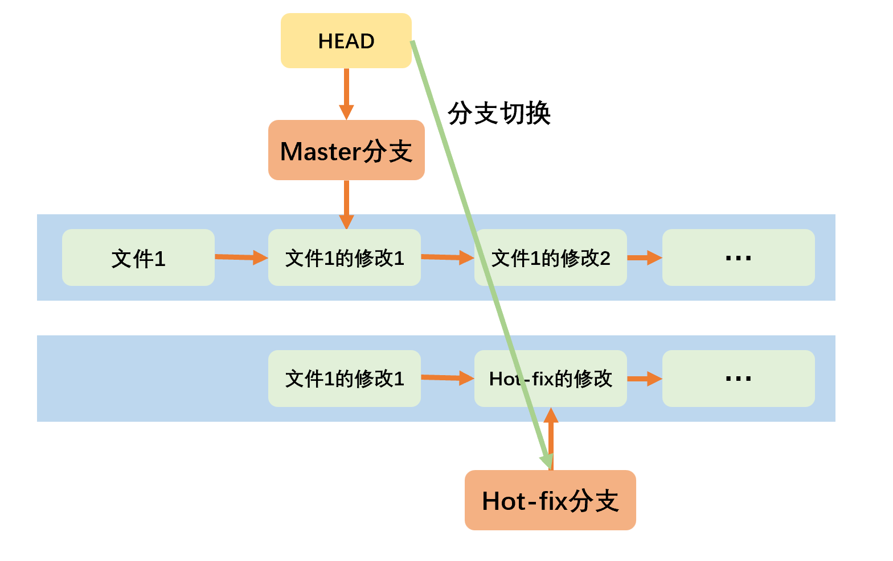

# Git基础

## 基础命令

> Linux命令和Git命令通用。

| 命令                                 | 说明              |
|:---------------------------------- |:--------------- |
| git config --global user.name 用户名  | 设置用户名 (设置一次即可)  |
| git config --global user.email 邮箱名 | 设置用户签名 (设置一次即可) |
| git init                           | 初始化本地库          |
| git status                         | 查看本地库状态         |
| git add 文件名                        | 添加到暂存区          |
| git -rm --cached 文件                | 从暂存区移除          |
| git commit [-m "日志信息"] 文件名         | 提交到本地库          |
| git reflog                         | 查看历史记录          |
| gir reset --hard 版本号               | 版本穿梭            |

## 注册、初始化

- 设置Git用户名、用户签名：首次安装Git时必须设置用户签名，否则无法提交代码。

```
git config --global user.name 用户名
git config --global user.email 邮箱(不会检验邮箱是否正确)
```

```
zjk10@DESKTOP-HSVIOTH MINGW64 ~/Desktop
$ git config --global user.name scott

zjk10@DESKTOP-HSVIOTH MINGW64 ~/Desktop
$ git config --global user.email zjk1054860443@163.com
```

- 初始化本地库：目标文件目录位置再右键打开Git Bash，自动切换到该路径。

```git
git init
```

```git
zjk10@DESKTOP-HSVIOTH MINGW64 /g/GitDemo
$ git init
Initialized empty Git repository in G:/GitDemo/.git/
```

# 命令别名 config

- 命令别名：简化git命令的使用。文件位置：用户目录下的.gitconfig。

| 操作                       | 语句                                                                             |
| ------------------------ | ------------------------------------------------------------------------------ |
| 新建全局命令别名                 | `git config --global alias.命令别名 '原git命令'`                                      |
| 删除全局命令别名                 | `git config --global --unset alias.命令别名`                                       |
| 新建局部命令别名<br />（只对当前仓库有效） | `git config --local alias.命令别名 '原git命令'`<br />`git config alias.命令别名 '原git命令'` |
| 删除所有全局别名                 | `git config --global --remove-section alias`                                   |
| 删除所有局部别名                 | `git config --remove-section alias`                                            |

- 命令别名执行多条命令：需要shell函数的方式。（Linux）
  - `!`->以shell执行，可以使用分号分割语句。

```
git config --global alias.book '!f(){git add --all;git commit -m "$@";git push book;};f'
```

- 相当于.gitconfig中：

```
[alias]
    book = "!f(){git add --all;git commit -m "$1";git push book;};f"
```

# 历史版本

| 命令                   | 说明       |
|:-------------------- |:-------- |
| git reflog           | 查看版本信息   |
| git log              | 查看版本详细信息 |
| git reset --hard 版本号 | 版本穿梭     |

## 版本指针的移动

- 在修改文件之后，需要重新添加到暂存区，并再次提交。
- 在完成提交之后，会有新的历史版本，同时指针指向该版本

```git
zjk10@DESKTOP-HSVIOTH MINGW64 /g/GitDemo (master)
$ vim hello.txt

zjk10@DESKTOP-HSVIOTH MINGW64 /g/GitDemo (master)
$ git status
On branch master
Changes not staged for commit:
  (use "git add <file>..." to update what will be committed)
  (use "git restore <file>..." to discard changes in working directory)
        modified:   hello.txt

no changes added to commit (use "git add" and/or "git commit -a")

zjk10@DESKTOP-HSVIOTH MINGW64 /g/GitDemo (master)
$ git status
On branch master
Changes not staged for commit:
  (use "git add <file>..." to update what will be committed)
  (use "git restore <file>..." to discard changes in working directory)
        modified:   hello.txt

no changes added to commit (use "git add" and/or "git commit -a")

zjk10@DESKTOP-HSVIOTH MINGW64 /g/GitDemo (master)
$ git add hello.txt
warning: in the working copy of 'hello.txt', LF will be replaced by CRLF the next time Git touches it

zjk10@DESKTOP-HSVIOTH MINGW64 /g/GitDemo (master)
$ git status
On branch master
Changes to be committed:
  (use "git restore --staged <file>..." to unstage)
        modified:   hello.txt


zjk10@DESKTOP-HSVIOTH MINGW64 /g/GitDemo (master)
$ git commit -m "second Commit 日志信息" hello.txt
warning: in the working copy of 'hello.txt', LF will be replaced by CRLF the next time Git touches it
[master fb9be28] second Commit 日志信息
 1 file changed, 2 insertions(+)

zjk10@DESKTOP-HSVIOTH MINGW64 /g/GitDemo (master)
$ git reflog
fb9be28 (HEAD -> master) HEAD@{0}: commit: second Commit 日志信息
5920c4a HEAD@{1}: commit (initial): first commit 日志信息
```

## 版本信息

```git
git reflog
```

```
git log
```

```git
zjk10@DESKTOP-HSVIOTH MINGW64 /g/GitDemo (master)
$ git reflog
fb9be28 (HEAD -> master) HEAD@{0}: commit: second Commit 日志信息
5920c4a HEAD@{1}: commit (initial): first commit 日志信息


zjk10@DESKTOP-HSVIOTH MINGW64 /g/GitDemo (master)
$ git log
commit fb9be28b255e26c8d2327c06293e35ed8681f3f3 (HEAD -> master)
Author: scott <zjk1054860443@163.com>
Date:   Wed Nov 9 20:33:04 2022 +0800

    second Commit 日志信息

commit 5920c4ad653816559f14c65e11d613cb899b1010
Author: scott <zjk1054860443@163.com>
Date:   Wed Nov 9 20:28:47 2022 +0800

    first commit 日志信息
```

## 版本穿梭

```git
git reset --hard 版本号
```

- 版本穿梭之后，查看的文件就是对应版本号的文件。
- 底层：HEAD指针的移动

 

```git
zjk10@DESKTOP-HSVIOTH MINGW64 /g/GitDemo (master)
$ git reset --hard fb9be28
HEAD is now at fb9be28 second Commit 日志信息

$ git reflog
fb9be28 (HEAD -> master) HEAD@{0}: reset: moving to fb9be28
fb9be28 (HEAD -> master) HEAD@{1}: commit: second Commit 日志信息
5920c4a HEAD@{2}: commit (initial): first commit 日志信息
```

- 查看指针文件（隐藏文件）：
  
  - 路径G:\GitDemo\.git
    
    - 查看内容 ref: refs/heads/master 
  
  - 根据查看的内容，选择路径G:\GitDemo\.git\refs\heads\master
    
    - 查看内容（即为记录的版本号）  5920c4ad653816559f14c65e11d613cb899b1010 

# 分支

## 基础命令

- 分支：在开发过程中，任何分支的修改都不会对其他分支有影响。
  - 并行推进多个分支，提高开发效率。

| 命令               | 说明             |
|:---------------- |:-------------- |
| git branch 分支名   | 创建分支           |
| git branch -v    | 查看分支           |
| git checkout 分支名 | 切换分支           |
| git merge 分支名    | 把指定的分支合并到当前分支上 |

## 分支-指针

 

## 合并分支

### 正常合并

```git
zjk10@DESKTOP-HSVIOTH MINGW64 /g/GitDemo (hot-fix)
$ git checkout hot-fix
Already on 'hot-fix'

zjk10@DESKTOP-HSVIOTH MINGW64 /g/GitDemo (hot-fix)
$ git checkout master
Switched to branch 'master'

zjk10@DESKTOP-HSVIOTH MINGW64 /g/GitDemo (master)
$ git merge hot-fix
Updating 5920c4a..8f45a48
Fast-forward
 hello.txt | 2 ++
 1 file changed, 2 insertions(+)

zjk10@DESKTOP-HSVIOTH MINGW64 /g/GitDemo (master)
$ git reflog
8f45a48 (HEAD -> master, hot-fix) HEAD@{0}: merge hot-fix: Fast-forward
5920c4a HEAD@{1}: checkout: moving from hot-fix to master
8f45a48 (HEAD -> master, hot-fix) HEAD@{2}: checkout: moving from hot-fix to hot-fix
8f45a48 (HEAD -> master, hot-fix) HEAD@{3}: commit: 日志信息：hot-fix 提交
5920c4a HEAD@{4}: checkout: moving from master to hot-fix
5920c4a HEAD@{5}: reset: moving to 5920c4a
fb9be28 HEAD@{6}: reset: moving to fb9be28
fb9be28 HEAD@{7}: commit: second Commit 日志信息
5920c4a HEAD@{8}: commit (initial): first commit 日志信息
```

### 冲突合并

- 冲突合并：合并分支时，两个分支在同一个文件的同一个位置有两套完全不同的修改。Git无法决定要保留哪个修改，需要我们进行选择。
1. 在完成修改后，此时提交到本地库时，不能带有文件名：`fatal: cannot do a partial commit during a merge.`
2. 只会修改合并到的分支的文件，要被合并的分支不受影响。

```git
zjk10@DESKTOP-HSVIOTH MINGW64 /g/GitDemo (master)
$ vim hello.txt

zjk10@DESKTOP-HSVIOTH MINGW64 /g/GitDemo (master)
$ cat hello.txt
hello Git !
test master
hot-fix

zjk10@DESKTOP-HSVIOTH MINGW64 /g/GitDemo (master)
$ git add hello.txt

zjk10@DESKTOP-HSVIOTH MINGW64 /g/GitDemo (master)
$ git commit -m "日志信息：master 4" hello.txt
[master 42191c7] 日志信息：master 4
 1 file changed, 1 insertion(+), 1 deletion(-)

zjk10@DESKTOP-HSVIOTH MINGW64 /g/GitDemo (master)
$ git checkout hot-fix
Switched to branch 'hot-fix'
M       hello.txt

zjk10@DESKTOP-HSVIOTH MINGW64 /g/GitDemo (hot-fix)
$ vim hello.txt

zjk10@DESKTOP-HSVIOTH MINGW64 /g/GitDemo (hot-fix)
$ cat hello.txt
hello Git !
test hot-fix
hot-fix

zjk10@DESKTOP-HSVIOTH MINGW64 /g/GitDemo (hot-fix)
$ git add hello.txt

zjk10@DESKTOP-HSVIOTH MINGW64 /g/GitDemo (hot-fix)
$ git commit -m "日志信息：hot-fix 2" hello.txt
[hot-fix 53ddaa5] 日志信息：hot-fix 2
 1 file changed, 1 insertion(+), 1 deletion(-)


# 此时在hello.txt文件中，的test位置有两个分支完全不同的修改。

# 报冲突
zjk10@DESKTOP-HSVIOTH MINGW64 /g/GitDemo (master)
$ git merge hot-fix
Auto-merging hello.txt
CONFLICT (content): Merge conflict in hello.txt
Automatic merge failed; fix conflicts and then commit the result.

# 正在合并中的状态
zjk10@DESKTOP-HSVIOTH MINGW64 /g/GitDemo (master|MERGING)
$ vim hello.txt

# 查看冲突文件

hello Git !
<<<<<<< HEAD  # 表示当前分支
test master
=======
test hot-fix 
>>>>>>> hot-fix  # 表示要合并的分支
hot-fix

# 手动修改 修改该文件，选择要保留的内容

hello Git !
test hot-fix
hot-fix

# 再次添加和提交

zjk10@DESKTOP-HSVIOTH MINGW64 /g/GitDemo (master|MERGING)
$ git add hello.txt

# 此时提交到本地库时，不能带有文件名

zjk10@DESKTOP-HSVIOTH MINGW64 /g/GitDemo (master|MERGING)
$ git commit -m "日志信息 matser 5 + hot-fix"
[master fed0b15] 日志信息 matser 5 + hot-fix

# 只会修改合并到的分支的文件，要被合并的分支不受影响
```

# 远程仓库

## 相关命令

### 基础命令

| 命令                     | 说明                                                             |
|:---------------------- |:-------------------------------------------------------------- |
| git remote -v          | 查看当前所有的远程地址别名<br />没有则都不显示                                     |
| git remote add 别名 远程地址 | 新建远程地址的别名                                                      |
| git push 别名 [远程仓库分支]   | 推送本地仓库上的内容到远程仓库<br />必须要保证本地库的版本要比远程库的版本高：如果版本不一致，push的操作会被拒绝。 |
| git clone 远程地址         | 克隆远程仓库到本地                                                      |
| git pull 远程库地址别名 远程分支名 | 拉取远程库到本地库、且直接合并后自动提交到本地库                                       |

```
git remote add Git-Demo https://github.com/creatern/Git-Demo.git
```

> 网络异常问题：`fatal: unable to access 'https://github.com/creatern/Git-Demo.git/': Failed to connect to github.com port 443 after 21059 ms: Timed out`

### clone 克隆远程仓库

- 在`G:\GitDemo\`处克隆远程仓库`Git-Demo`：先到想要的文件目录打开Git。
  - 公共的仓库不需要公钥就可以克隆。
  - 私有仓库需要公钥。

```
zjk10@DESKTOP-HSVIOTH MINGW64 /g/GitDemo (master)
$ git clone https://github.com/creatern/Git-Demo.git
Cloning into 'Git-Demo'...
remote: Enumerating objects: 19, done.
remote: Counting objects: 100% (19/19), done.
remote: Compressing objects: 100% (6/6), done.
remote: Total 19 (delta 1), reused 13 (delta 1), pack-reused 0
Receiving objects: 100% (19/19), done.
Resolving deltas: 100% (1/1), done.
```

### push -f 强制推送

```
git push -f 远程仓库地址 远程分支
```

- -f：强制将本地仓库覆盖远程仓库。
  - 版本穿梭之后，本地仓库和远程仓库版本不一致时，只能使用强制推送覆盖远程仓库。

## 创建远程仓库

### GitHub

- Windows凭据管理器：

 

> 如何解决Github打不开的问题？
> 
> - 打开C:\Windows\System32\drivers\etc\hosts
> - 添加(以管理员权限打开记事本，Ctrl + O 输入文件地址进行修改)
> - 修改完映射文件，打开cmd输入`ipconfig/flushdns`刷新dns缓存
> 
> ```
> # GitHub Start 
> 
> 140.82.113.3       github.com
> 140.82.114.20      gist.github.com
> 199.232.69.194     github.global.ssl.fastly.net
> 151.101.184.133    assets-cdn.github.com
> 151.101.184.133    raw.githubusercontent.com
> 199.232.28.133     raw.githubusercontent.com 
> 151.101.184.133    gist.githubusercontent.com
> 151.101.184.133    cloud.githubusercontent.com
> 151.101.184.133    camo.githubusercontent.com
> 199.232.96.133     avatars.githubusercontent.com
> 
> # GitHub End
> ```

- 创建GitHub库：

 

- Https连接：

 

- https://github.com/creatern/Git-Demo.git

### Gitee

- 新建仓库：

 

- GitHub迁移至Gitee：


- 更新迁移的项目库：

 

## 跨团队合作

**搜索他人的仓库**

- 需要是`public`的才可以搜索到
- 可以`@拥有者/仓库名`精准搜索

**fork添加到自己的仓库**

 

**Pull requests**

- 给别人
   
   
   
- 查看收到的
   
- 合并收到的
   
   

## SSH

- SSH方式：使用时和HTTP基本一致。
- 对于网络连接情况不好的，尽量使用SSH，而不是HTTP协议。

| ssh文件类型    | 说明  |
| ---------- | --- |
| id_rsa     | 私钥  |
| id_rsa.pub | 公钥  |

- 生成.ssh文件

```git
ssh-keygen -t rsa -C 邮箱
```

```git
zjk10@DESKTOP-HSVIOTH MINGW64 ~
$ ssh-keygen -t rsa -C zjk1054860443@163.com
Generating public/private rsa key pair.
Enter file in which to save the key (/c/Users/zjk10/.ssh/id_rsa): 生成的ssh文件路径（回车跳过）
Created directory '/c/Users/zjk10/.ssh'. 
Enter passphrase (empty for no passphrase): （回车跳过）
Enter same passphrase again: （回车跳过）
Your identification has been saved in /c/Users/zjk10/.ssh/id_rsa
Your public key has been saved in /c/Users/zjk10/.ssh/id_rsa.pub
The key fingerprint is:
SHA256:Jo45BrJ4Vp9MtMque+T74/vDotYPCrI8wyBMtl6VE8U zjk1054860443@163.com
The key's randomart image is:
+---[RSA 3072]----+
|      o.         |
|     . E         |
|      +          |
| o   = .         |
|= o o = S        |
|+= =.O +         |
|O =oB.*.         |
|.X ++o+.o        |
|..====+*o.       |
+----[SHA256]-----+
```

- 获取公钥：

```git
zjk10@DESKTOP-HSVIOTH MINGW64 ~
$ cd .ssh

zjk10@DESKTOP-HSVIOTH MINGW64 ~/.ssh
$ ll
total 5
-rw-r--r-- 1 zjk10 197609 2610 Nov  9 23:27 id_rsa
-rw-r--r-- 1 zjk10 197609  575 Nov  9 23:27 id_rsa.pub

zjk10@DESKTOP-HSVIOTH MINGW64 ~/.ssh
$ cat id_rsa.pub
ssh-rsa AAAAB3NzaC1yc2EAAAADAQABAAABgQDCo4Y42+qZM6Z0Y3dXnkOnWrP1zhJHfz3v6bRRkHt8o+OtLN1nKK51Lcf05E/ObMsaReKSMwwIomxHYKcpU82A8G5/TekMaYcESSrIgM2jm0k/CTAbSgMC1C0VtSC7ORWUAW6HdNcolusF7lD80Bs61P7A8gr2jYryHBbQfM2vp7n/9BsulTshxPT2azVAhHiz/iaC915eQuLEwvnQMsdGKsplECz2V1WcH8hzy8txiHQJDLYkth5wnBfzBNC8+NjDfAeIAvrk16p9s364grQtt1Hj1lCTeWuqhvQ/JnoyM5G6jQHMxzUIpUpejZF6CJdPpDAYsRm/wTLKeerBpapUh7/TS1nnxbIxiXg6b32UTzdwllggWox7Qj2HbBpdg6MMdCPUlyZWUVpgzjUHf6LSvr0g2h3wSKLWLZWMKbHih2REjKawAGV+6y5JzzfVFSYYN0PnQQwtLHbiJoygRxZ6290tRfpW1vcLvC7/wXFzSASB1WZbvRRBm4HgIAKa8Pc= zjk1054860443@163.com
```

 

# IDEA 集成 Git

## 配置 .ignore

- Xxx.ignore内容设置：

```
*.class

*.log

*.ctxt

.mtj.tmp/

*.jar
*.war
*.nar
*.ear
*.zip
*.tar.gz
*.rar

hs_err_pid*

.classpath
.project
.settings
target
.idea
*.iml
```

- `~/.gitconfig`文件引用忽略配置文件：

```
[user]
    name = scott
    email = zjk1054860443@163.com
[core]
    excludesfile = C:/Users/zjk10/git.ignore （忽略配置文件的路径）
```

## 定位Git程序

 

- 初始化Git 如下，然后找到项目根目录ok即可
   
- add
   
- commit
   

## 版本信息

- 查看版本信息：

 

- 版本穿梭：

 

## 分支

### 切换分支

1. 方式1
    
2. 方式2
    
    

### 创建分支

 
 

### 合并分支

#### 正常合并

 
 

#### 冲突合并

 
 

## GitHub插件

- GitHub插件：IDEA默认安装，如果没有则自行安装。

### 口令登录 Token

 

- 设置口令权限：

 

- 获取口令并在IDEA中设置：

 

 

### 本地仓库分享至GitHub

 
 

### SSH设置

- 获取ssh：

 

 

### clone 克隆远程库到本地

 
 

## Gitee插件

 

- 设置登录：

 

- 分享本地库到Gitee：

 

# GitLab 自建代码托管平台
