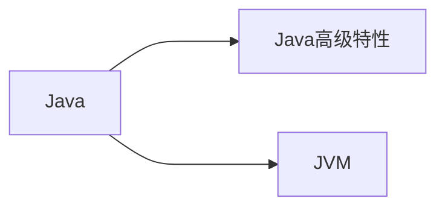

# HTML语法

- 可以使用HTML内的部分语法

| 标签   | 对应MarckDown语法      | 说明                   |
| ------ | ---------------------- | ---------------------- |
| img    | `` |                        |
| a      | `[链接别名](链接url)`  |                        |
| video  |                        |                        |
| iframe |                        | 目前只有typore支持显示 |

# 代码块

### 普通语言

- 对应语言进行高亮

### mermaid 

**流程图方向**

| 语法     | 方向 |
| -------- | ---- |
| graph TD | 垂直 |
| graph LR | 水平 |

**流程图节点**

| 语法           | 节点       |
| -------------- | ---------- |
| `node[text]`   | 矩形       |
| `node(text)`   | 圆角矩形   |
| `node>text`    | 不对称矩形 |
| `node{text}`   | 棱形       |
| `node((text))` | 圆形       |

**连接线**

- 节点之间的连接线分为：实线 '---'、加粗实线 '==='、虚线 '-.-'。

- 带箭头的连接线分为：带箭头实线 '-->'、带箭头加粗实线 '==>'，带箭头虚线 '-.->'。

- 如果要在连接线上加上备注，则上面两类加备注的方式如下：

- - 实线备注 '--yes---'，加粗实线备注 'yes='，虚线备注 '-.yes.-'。
  - 带箭头实线备注 '--yes-->'，带箭头加粗实线备注 'yes>'，带箭头虚线备注 '-.yes.->'

- 其中，每种连接符号的左边是开始节点，右边是结束节点，可以由同一个节点指向不同节点，也可以由不同节点指向同一个节点，实现各种指向方式都是通过节点ID标注。



### flow

```flow

```

# 数学公式 latex

- latex

```
$$
公式
$$
```

## 组

- 使用`{}`将一组数字包含在内：视为一个元素。

## 希腊字母

| 名称    | 大写 | TeX        | 小写 | TeX        |
| ------- | ---- | ---------- | ---- | ---------- |
| alpha   | `A`  | `A`        | `α`  | `\alpha`   |
| beta    | `B`  | `B`        | `β`  | `\beta`    |
| gamma   | `Γ`  | `\Gamma`   | `γ`  | `\gamma`   |
| delta   | `Δ`  | `\Delta`   | `δ`  | `\delta`   |
| epsilon | `E`  | `E`        | `ϵ`  | `\epsilon` |
| zeta    | `Z`  | `Z`        | `ζ`  | `\zeta`    |
| eta     | `H`  | `H`        | `η`  | `\eta`     |
| theta   | `Θ`  | `\Theta`   | `θ`  | ` \theta`  |
| iota    | `I`  | `I`        | `ι`  | `\iota`    |
| kappa   | `K`  | `K`        | `κ`  | `\kappa`   |
| lambda  | `Λ`  | `\Lambda`  | `λ`  | `\lambda`  |
| mu      | `M`  | `M`        | `μ`  | `\mu`      |
| nu      | `N`  | `N`        | `ν`  | `\nu`      |
| xi      | `Ξ`  | `\Xi`      | `ξ`  | `\xi`      |
| omicron | `O`  | `O`        | `ο`  | `\omicron` |
| pi      | `Π`  | `\Pi`      | `π`  | `\pi`      |
| rho     | `P`  | `P`        | `ρ`  | `\rho`     |
| sigma   | `Σ`  | `\Sigma`   | `σ`  | `\sigma`   |
| tau     | `T`  | `T`        | `τ`  | `\tau`     |
| upsilon | `Υ`  | `\Upsilon` | `υ`  | `\upsilon` |
| phi     | `Φ`  | `\Phi`     | `ϕ`  | `\phi`     |
| chi     | `X`  | `X`        | `χ`  | `\chi`     |
| psi     | `Ψ`  | `\Psi`     | `ψ`  | `\psi`     |
| omega   | `Ω`  | `\Omega`   | `ω`  | `\omega`   |

## 上下标

- 上标：`^`
- 下标：`_`

- 上下标符号仅仅对下一个组起作用

## 编号

`\tag{n}`
$$
\tag{n}
$$

## 分数

`\frac{x}{y}`
$$
\frac{x}{y}
$$

## 开方

`\sqrt[n]{x}`
$$
\sqrt[n]{x}
$$

## 对数

| 算式 | markdown |
| ---- | -------- |
| ln   | `\ln`    |
| log  | `\log`   |
| lg   | `\lg`    |

`\log_1^2`
$$
\log_1^2
$$

## 矢量

`\vec{a}`
$$
\vec{a}
$$


## 矩阵

```
$$
\begin{matrix}
1 & 2 & 3 \\
4 & 5 & 6 \\
7 & 8 & 9 
\end{matrix} \tag{1}
$$
```

$$
\begin{matrix}
1 & 2 & 3 \\
4 & 5 & 6 \\
7 & 8 & 9 
\end{matrix} \tag{1}
$$

```
$$
\left[
\begin{matrix}
1 & 2 & 3 \\
4 & 5 & 6 \\
7 & 8 & 9 
\end{matrix} \right]\tag{2}
$$
```

$$
\left[
\begin{matrix}
1 & 2 & 3 \\
4 & 5 & 6 \\
7 & 8 & 9 
\end{matrix} \right]\tag{2}
$$

## 符号

| 符号    | TeX                 | 符号    | TeX                 | 符号 | TeX                 |
| ------- | ------------------- | ------- | ------------------- | ---- | ------------------- |
| `±`     | `\pm`               | `∓`     | `\mp`               | `⋅`  | `\cdot`             |
| `×`     | `\times`            | `÷ `    | `\div`              | `⋆`  | `\star`             |
| `∗`     | `\ast`              | `∪ `    | `\cup`              | `∩`  | `\cap`              |
| `∨`     | `\vee`<br>`\lor`    | `∧`     | `\wedge`<br>`\land` | `≃`  | `\simeq`            |
| `⊕`     | `\oplus`            | `⊗`     | `\otimes`           | `∼`  | `\sim`              |
| `∘`     | `\circ`             | `∙`     | `\bullet`           | `⊂`  | `\subset`           |
| `△`     | `\bigtriangleup`    | `▽ `    | `\bigtriangledown`  | `⊃`  | `\supset`           |
| `∇`     | `\nabla`            | `∃`     | `\exists`           | `⊆`  | `\subseteq`         |
| `∂`     | `\partial`          | `∞`     | `\infty`            | `⊇`  | `\supseteq`         |
| `∀`     | `\forall`           | `√`     | `\surd`             | `∈`  | `\in`               |
| `∠`     | `\angle`            | `⊥`     | `\bot`              | `∋`  | `\ni`<br>`\owns`    |
| `≤`     | `\leq`<br>`\le`     | `≥`     | `\geq`<br>`\ge`     | `∉`  | `\notin`            |
| `≡`     | `\equiv`            | `≈`     | `\approx`           | `≠`  | `\neq`<br>`\ne`     |
| `⋘`     | `\lll`              | `⋙`     | `\ggg`              | `≅`  | `\cong`             |
| `∝`     | `\propto`           | `⫋`     | `\varsubsetneqq`    | `⫌`  | `\varsupsetneqq`    |
| `∣`     | `\mid`              | `⇛`     | `\Rrightarrow`      | `⇚`  | `\Lleftarrow`       |
| `||`    | `\parallel`         | `↾ `    | `\upharpoonright`   | `⇂`  | `\downharpoonright` |
| `∵`     | `\because`          | `∴ `    | `\therefore`        |      |                     |
| `⌊ x ⌋` | `\lfloor x \rfloor` | `⌈ x ⌉` | `\lceil x \rceil`   |      |                     |

## 大型数学运算符

| 运算符 | TeX         | 运算符 | TeX         |
| ------ | ----------- | ------ | ----------- |
| `∑`    | `\sum`      | `∫`    | `\int`      |
| `∏`    | `\pro`      | `∬`    | `\iint`     |
| `∐`    | `\coprod`   | `∭`    | `\iiint`    |
| `⋁`    | `\bigvee`   | `⋀`    | `\bigwedge` |
| `⨁ `   | `\bigoplus` | `⨂`    | `\bigotime` |
| `⋃`    | `\bigcup`   | `lim`  | `\lim`      |

