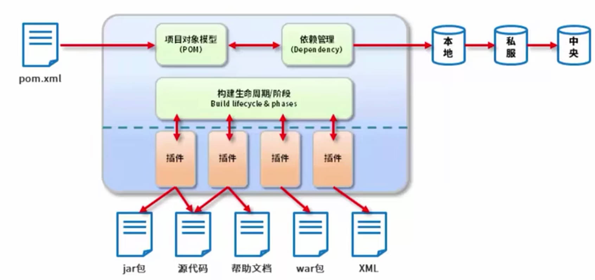
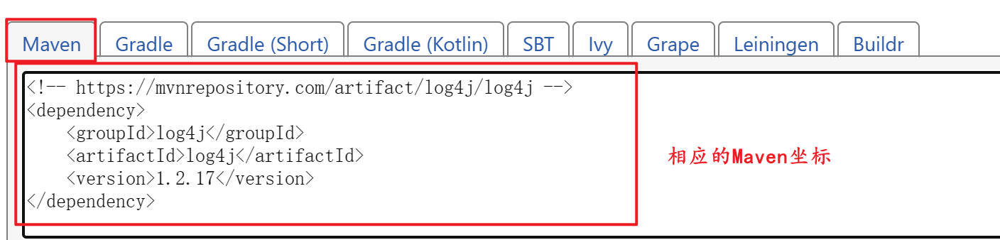
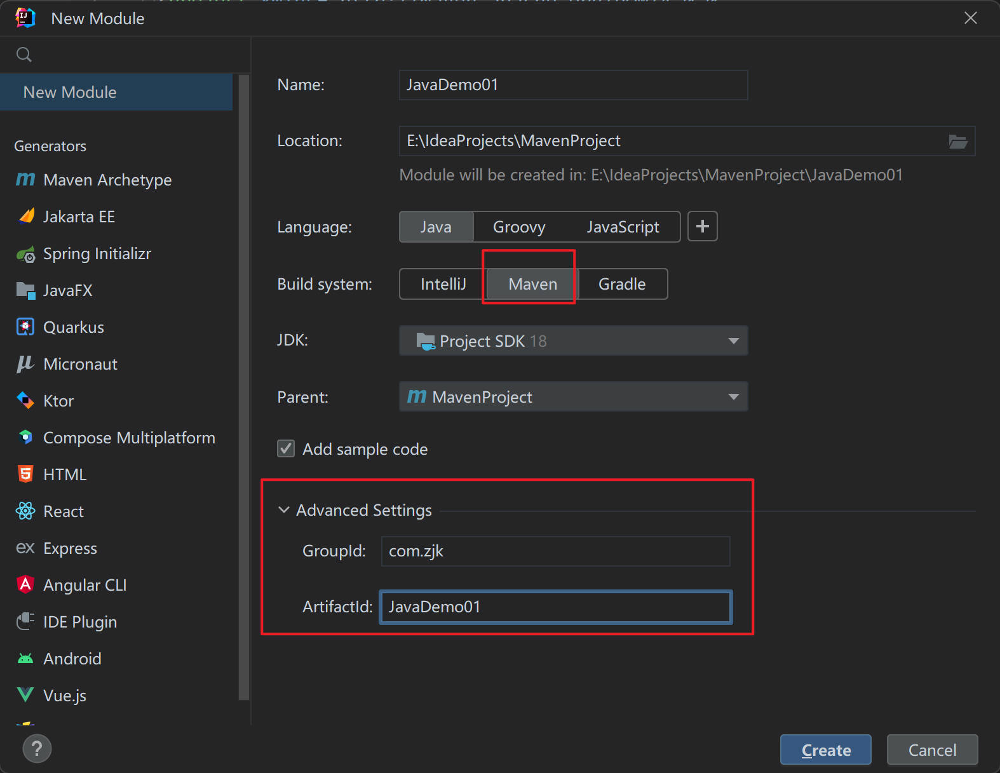
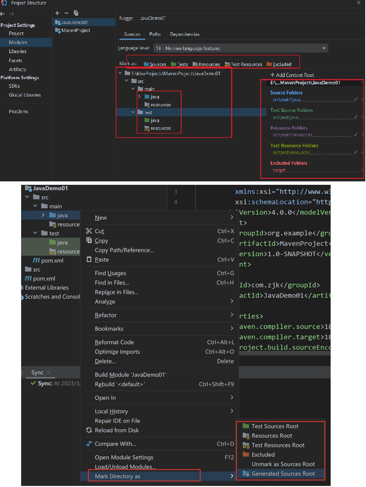
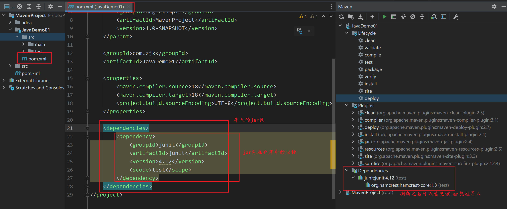

# 概述

## POM

- 项目管理工具（项目对象模型）：POM。

  

1. 项目构建。
2. 依赖管理。
3. 统一开发结构。

## 环境配置

| 环境配置变量 | 路径                                  |
| ------------ | ------------------------------------- |
| JAVA_HOME    | D:\Java\jdk-18.0.1.1                  |
| MAVEN_HOME   | D:\apache-maven-3.9.0                 |
| Path         | %JAVA_HOME%\bin<br />%MAVEN_HOME%\bin |

## 基础概念

### 仓库

- 仓库：存储资源，包含各种jar包。
- Maven中央仓库：[mvn](https://mvnrepository.com/)。

- 获取jar包的方式：中央仓库、本地仓库、私服。

| 仓库     | 说明                               |
| -------- | ---------------------------------- |
| 本地仓库 |                                    |
| 远程仓库 | 中央仓库<br />私服：版权和访问速度 |

### 坐标

- 坐标：描述仓库中资源的位置。

| 坐标的主要组成 | 说明                                                 |
| -------------- | ---------------------------------------------------- |
| groupid        | 当前Maven项目隶属组织名称：org.mybatis等（域名反写） |
| artifactid：   | 当前Maven项目名称：通常是模块名称：CRM、SMS等        |
| version        | 当前项目版本号                                       |
| packaging      | 该项目的打包方式                                     |

  

# 仓库配置

- Maven配置文件：conf/settings.xml。

| setting     | 说明                                                         |
| ----------- | ------------------------------------------------------------ |
| 全局setting | 当前计算器中Maven的公共配置。<br />maven安装路径的conf/settings.xml |
| 用户setting | 当前用户的配置                                               |

## 本地仓库配置

```xml
<!-- localRepository 49行
   | The path to the local repository maven will use to store artifacts.
   | 默认的本地仓库位置
   | Default: ${user.home}/.m2/repository
   配置本地仓库的模板
  <localRepository>/path/to/local/repo</localRepository>
  -->
<!--
   对本地仓库的配置
  -->
<localRepository>D:\maven\repository</localRepository>
```

## 远程仓库配置

### 中央仓库 cetral

- pom-4.0.0.xml文件：在lib目录下随便找一个jar包，用WinRAR打开，并在WinRAR回到上一级目录，搜索`pom*.*`找到不同的那个，并打开即可发现pom-4.0.0.xml。

```xml
<repositories>
    <repository>
        <id>central</id>
        <name>Central Repository</name>
        <url>https://repo.maven.apache.org/maven2</url>
        <layout>default</layout>
        <snapshots>
            <enabled>false</enabled>
        </snapshots>
    </repository>
</repositories>
```

### 镜像仓库配置

- maven安装路径的conf/settings.xml

```xml
<mirrors> 配置镜像仓库 148行
    <mirror>
        <!--此镜像的唯一标识符：用来区分不同的mirror元素-->
        <id>aliyunmaven</id>
        <!--对哪种仓库进行镜像：即替代哪个库-->
        <mirrorOf>central</mirrorOf>
        <!--镜像名称：可以随便起-->
        <name>aliyunmaven</name>
        <!--镜像url-->
        <url>https://maven.aliyun.com/repository/public</url>
    </mirror>
</mirrors>
```

> 阿里云等镜像仓库的url可能会更新，需要去阿里云maven官网查看id和url并及时更改。

# 项目构建

## 标准Maven项目

1. 标准Maven项目的文件结构：

- 项目 --> src 

  - main 主目录
    - java Java文件
    - resources 静态资源

  - test  测试目录
    - java Java测试文件
    - resources 静态资源

2. src同级目录配置pom.xml：

```xml
<?xml version="1.0" encoding="UTF-8"?>
<project xmlns="http://maven.apache.org/POM/4.0.0" xmlns:xsi="http://www.w3.org/2001/XMLSchema-instance" xsi:schemaLocation="http://maven.apache.org/POM/4.0.0 https://maven.apache.org/xsd/maven-4.0.0.xsd">
  <modelVersion>4.0.0</modelVersion>

  <groupId>com.zjk</groupId>
  <artifactId>project-java</artifactId>
  <version>1.0</version>
  <packaging>jar</packaging>

  <dependencies>
    <dependency>
      <groupId>junit</groupId>
      <artifactId>junit</artifactId>
      <version>4.12</version>
    </dependency>
  </dependencies>

</project>
```

## 插件创建工程

- 插件创建工程：要求创建时，目录内部是空的，不能已经是Maven的项目文件。
- 在当前目录下自动创建工程：

```
mvn archetype:generate 使用模板生成
-DgroupId={project-packaging} 项目内的包
-DartifactId={project-name} 要创建的项目名称
-DarchetypeArtifactId=maven-archetype-quickstart 使用的模板
-DinteractiveMode=false
```

- 创建Java工程：

```xml
mvn archetype:generate -DgroupId=com.zjk -DartifactId=java-project -DarchetypeArtifactId=maven-archetype-quickstart -Dversion=0.0.1-snapshot -DinteractiveMode=false
```

- 创建Web工程：

```xml
mvn archetype:generate -DgroupId=com.zjk -DartifactId=web-project -DarchetypeArtifactId=maven-archetype-webapp -Dversion=0.0.1-snapshot -DinteractiveMode=false
```

## IDEA

### 构建Maven项目

1. 创建、配置Maven项目：

 

2. 创建Maven的Module：

 

3. 为相应的文件设置属性，通常已经设置好：

  

### 管理Maven

  

- 配置快捷命令：

  

```xml
<project xmlns="http://maven.apache.org/POM/4.0.0" xmlns:xsi="http://www.w3.org/2001/XMLSchema-instance"
         xsi:schemaLocation="http://maven.apache.org/POM/4.0.0 http://maven.apache.org/maven-v4_0_0.xsd">
    <modelVersion>4.0.0</modelVersion> 指定maven的POM的模型版本
    <parent>
        <groupId>org.example</groupId> 组织id
        <artifactId>MavenProject</artifactId> 项目id
        <version>1.0-SNAPSHOT</version> 版本号 release完成版，snapshot开发版
    </parent>
    <groupId>com.zjk</groupId> 
    <artifactId>JaveWebDemo02</artifactId> 
    <packaging>war</packaging> 打包方式：web工程打包为war；java工程打包为jar
    <name>JaveWebDemo02 Maven Webapp</name> 非必要
    <url>http://maven.apache.org</url>
    <dependencies> 设置当前工程的所有依赖
        <dependency> 具体的依赖
            <groupId>junit</groupId>
            <artifactId>junit</artifactId>
            <version>3.8.1</version>
            <scope>test</scope>
        </dependency>
    </dependencies>
    <build> 构建
        <finalName>JaveWebDemo02</finalName>
        <plugins> 插件
            <plugin> 插件
                <groupId>org.apache.tomcat.maven</groupId>
                <artifactId>tomcat7-maven-plugin</artifactId>
                <version>2.1</version>
                <configuration> 插件设置
                    <port>8080</port> 端口号
                    <path>/</path> 路径
                </configuration>
            </plugin>
        </plugins>
    </build>
</project>
```


    

### 导入Maven项目

1. 已经创建Maven工程的，可以直接导入别的Maven工程：选择要导入的Maven工程的pom.xml文件。

2. View-->Apperance-->Tool Window Bars。

# 依赖管理 dependencies

## 导入依赖 dependency



| 依赖分类             | 说明                                                         |
| -------------------- | ------------------------------------------------------------ |
| 直接依赖             | 导入仓库中的坐标。                                           |
| 依赖传递（间接依赖） | 将另一个项目的坐标复制到当前项目的dependencies中作为dependency；可以使用另一个项目中的依赖。 |

- 依赖冲突问题：

| 解决方式 | 说明                                 |
| -------- | ------------------------------------ |
| 路径优先 | 层级越深，优先级越低。               |
| 声明优先 | om.xml中配置的位置先后，在上的优先。 |

## 可选依赖 optional

```xml
<dependency>
    <groupId>log4j</groupId>
    <artifactId>log4j</artifactId>
    <version>1.2.12</version>
    <optional>true</optional> 表示依赖传递时，该依赖不会被传递
</dependency>
```

## 排除依赖 exclusion

```xml
<dependency>
    <groupId></groupId> 被传递依赖的项目
    <artifactId></artifactId>
    <version></version>
    <exclusions> 需要排除的依赖
        <exclusion>
            <groupId></groupId>
            <artifactId></artifactId>
            不需要版本号versionId
        </exclusion>
    </exclusions>
</dependency>
```

## 依赖范围 scope

- scope：设定依赖的作用范围。
  - 依赖jar包默认情况下可以在任何地方使用。


| 作用范围     | 说明                        |
| ------------ | --------------------------- |
| main         | 主程序范围有效 main目录下   |
| test         | 测试程序范围有效 test目录下 |
| 是否参与打包 | package指令范围             |

| scope           | 主代码 | 测试代码 | 打包 |
| :-------------- | :----: | :------: | :--: |
| compile（默认） |   √    |    √     |  √   |
| test            |        |    √     |      |
| provided        |   √    |    √     |      |
| runtime         |        |          |  √   |

```xml
<dependency>
    <groupId>junit</groupId>
    <artifactId>junit</artifactId>
    <version>4.12</version>
    <scope>test</scope> 依赖范围
</dependency>
```

- 依赖范围具有传递性：

| 间接依赖、直接依赖 | compile | test | provided | runtime |
| :----------------: | :-----: | :--: | :------: | :-----: |
|      compile       | compile | test | provided | runtime |
|        test        |         |      |          |         |
|      provided      |         |      |          |         |
|      runtime       | runtime | test | provided | runtime |

## 父级 parent

- 子级可以直接使用父级的Maven项目的所有依赖和插件。

```xml
<parent>  <!--父级项目的坐标-->
    <groupId>com.zjk</groupId>
    <artifactId>MavenProject</artifactId>
    <version>1.0-SNAPSHOT</version>
</parent>
```

# 生命周期

 

- 对于生命周期，如果要执行一个命令，则在其生命周期之前的命令也全部会被执行。

> 执行test：会先执行compile等命令。

| 命令        | 功能           | 说明                                                         |
| :---------- | :------------- | ------------------------------------------------------------ |
| mvn compile | 编译           | 在项目下创建新的内容：<br />`E:\project-java\target`         |
| mvn clean   | 清理           |                                                              |
| mvn test    | 测试           | 存放测试报告日志的内容：<br />`E:\project-java\target\surefire-reports` |
| mvn package | 打包           | 打包的jar包放在项目同级目录下                                |
| mvn install | 安装到本地仓库 | 由groupid和version来确定存放在仓库的位置                     |

# build

## 插件 plugins

- 插件与生命周期内的阶段绑定：在执行到对应生命周期时，执行对应的插件功能。
  - Maven默认在各个生命周期上绑定有预设的功能。

- 插件可以自定义其他功能。

```xml
<build>
    <plugins>
        <plugin>
            <groupId></groupId>
            <artifactId></artifactId>
            <version></version>
            <executions> 执行
                <execution>
                    <goals> 插件的输出
                        <goal></goal>
                    </goals>
                    <phase></phase> 对应的生命周期
                </execution>
            </executions>
        </plugin>
    </plugins>
</build>
```

```xml
<build> 构建
    <plugins>
        <plugin> 插件
            坐标
            <groupId>org.apache.tomcat.maven</groupId> 
            <artifactId>tomcat7-maven-plugin</artifactId>
            <version>2.1</version>
            <configuration> 插件信息
                <port>8080</port> 端口号设置
                <path>/</path> 路径设置
            </configuration>
        </plugin>
    </plugins>
</build>
```

  

# 分模块开发与设计

## 模块拆分思想

