# 面向对象的UML 

- UML：可视化的面向对象的统一建模语言。

  - 软件开发过程中的分析设计阶段使用。

  - 支持面向对象。

  - 独立与软件的实现。

# 基本元素

## 结构事物 

- 结构事物：构成模型的静态部分，负责描述静态功能和客观元素。

- UML中一共定义了7种结构事物：类、接口、协作、用例、主动类、构件、节点。

### 类 Class

- 类：完全对应于面向对象分析中的类，具有自己的属性和操作。 

### 接口 Interface

- 接口：由一组对操作的定义组成，但不包括对操作的实现进行详细的描述。
- 接口描述一个类或构件的一个服务的操作集、元素的外部可见的操作。
- 接口往往依赖于实现接口的类或构件。

   

### 协作 Collaboration

- 协作：对一个交互过程的定义，由一组共同工作以提供协作行为的角色和其他元素构成的一个整体。
  - 通常这些协作行为大于所有元素的行为的总和。

- 一个类可以参与到多个协作中，在协作中表现了系统构成模式的实现。

### 用例 user case

- 用例：系统所提供的服务，定义了系统是如何被参与者使用的，描述参与者为了使用系统所提供的某一完整功能而与系统发生的一段对话。（对一组动作序列的抽象描述，即：行为事物）
  - 系统执行这些动作将产生一个对特定的参与者有价值而且可观察的结果。 

### 主动类 active class

- 主动对象：主动类的对象，能够有自动的启动控制行为，其本身至少拥有一个进程或线程，每个主动对象都由它自己的事件驱动控制线程，控制线程与其他主动对象并行执行。
- 被动对象：被主动对象所调用的对象，被动地等待其他对象发出请求，该对象所描述的元素的行为和其他元素的行为并发。只在被调用时接受控制，当被动对象返回时将控制放弃。

### 构件 component

- 构件定义了良好接口的物理实现单元，是系统中物理的、可替代的部件，遵循且提供一组接口的实现，每个构件体现了系统设计中特定类的实现。
  - 良好定义的构件不直接依赖于其他构件而依赖于构件所支持的接口，系统中的一个构件可以被支持正确接口的其他构件所替代。
  - 每个系统中都有不同类型的部署构件。

1. 将一个大系统分解成若干个小软件（子系统），有助于降低系统开发的复杂度。
2. 采用构件机制开发的系统，在系统需要修改时，更为容易。
3. 构件机制有助于提高复用水平，同时也是一种好的销售方法。  

### 节点 node

- 节点 是系统在运行时切实存在的物理对象，表示某种可计算资源，这些资源往往具有一定的存储能力和处理能力。
- 一个构件集可以驻留在一个节点，也可以从一个节点迁移到另一个节点。
- 一个节点可以代表一个物理机或一个虚拟物理机。
- 节点在Rational Rose中分为：设备节点、处理节点。  

## 行为事物

- 行为事物：构成模型的动态部分，描述跨越时间和空间的行为。通常使用动词来表示。
- 行为事物分为：交互、状态机。

### 交互

- 交互：特定的语境中，一组对象为共同完成一定任务而进行的一系列消息交换而组成的动作以及消息交换的过程中形成的消息机制。
- 交互包括：一组对象，连接对象间的消息、消息发出的动作形成的有序的序列和对象间的普通连接。

- 交互的可视化表示主要通过消息来表示：带有名字或内容的有向箭头。

  
  
  

### 状态机

- 是一个类对象所有的**生命历程**模型，因此状态机可以用于描述一个对象在其生命周期内响应时间所经历的**状态序列**。
- 当对象探测到一个**外部事件**后，它依照当前的状态做出反应，这种反应包括执行一个相关动作或转换到一个新的状态中去。
- 单个类的状态变换或多个类之间的协作过程都可以使用状态机描述。

  
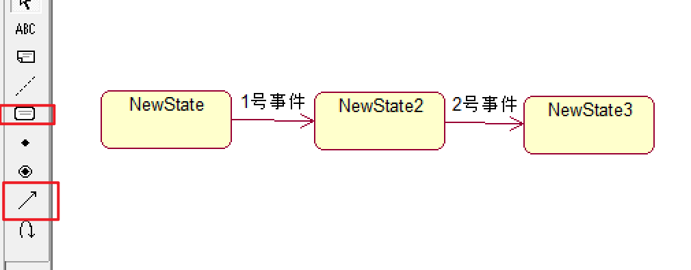  
  

## 分组事物

- 分组事物：UML对模型中的各种组成部分进行事物分组的一种机制。
- 目前只有一种分组事物：包。
- 包：描述拥有和管理模型内容的组织单元，任何元素都可以被包所拥有。   

## 注释事物

- 注释事物：UML模型的解释部分，依附于某个元素或一组建模元素，对该元素/该组建模元素进行约束或解释。

 

# 关系元素

- UML模型是由各种事物以及这些事物之间的各种关系构成的。
- 关系是指支配、协调各种模型元素存在并相互使用的规则。
- 主要包含四种关系：依赖、关联、泛化、实现。

## 依赖关系 dependency

- 依赖关系：两个事物之间的一种语义关系，当其中一个事物（独立事物）发生变化就会影响另外一个事物（依赖事物）的语义。

 

## 关联关系  associate

- 关联关系：事物之间的结构关系。描述一组链（对象之间的连接）。
  - 聚合：描述整体和部分之间的结构关系。
  - 组成：描述整体和部分之间的结构关系，但部分不能脱离整体而独立存在。
  - 无方向的普通关联关系。

- 如果系统元素之间的关系不能明显地由其他关系来表示，则可以被抽象为关联关系。
- 当一个类“知道”另一个类时，可以使用关联关系来表示：
  - 车间内工人知道他车间的车间主任是谁。
  - 企鹅迁移时必须知道气候。

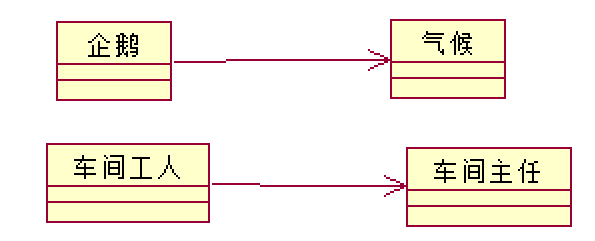 

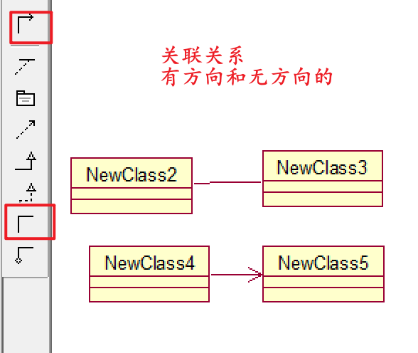 

## 泛化关系 generalization

- 泛化关系是事物之间的一种特殊/一般关系，特殊元素（子元素）的对象可替代一般元素（父元素）的对象，即继承。

 

## 实现关系 realization

- 实现关系描述了一组操作的规约和一组对操作的具体实现之间的语义关系。
- 通常用于：接口和实现接口的类/构件之间、用例和实现用例的协作之间。

 

# 视图和图

## 简述

- 视图：不是图，是表达系统某方面特征得UML建模构件的子集。
- 视图是由一个或多个图组成的对系统某个角度的抽象：在每一类视图中使用一种或两种特定的图来可视化地表示视图中的各种概念。
- 最常用的UML图包括：用例图、类图、序列图、状态图、活动图、构件图、部署图。

**视图模型分为3个视图域** 

- 结构分类：描述系统中的结构成员及其相互关系。
  - 类元包括：类、用例、构件、节点。类元是研究系统动态行为的基础。
  - 类元视图包括：静态视图、用例视图、物理视图（实现视图、部署视图）。
- 动态行为：描述系统随时间变化的行为。
  - 行为：从静态视图中抽取的瞬间值的变化来描述行为。
  - 动态行为视图包括：状态机视图、活动视图、交互视图。

- 模型管理：说明了模型的分层组织结构。
  - 包是模型的基本组织单元，特殊的包还包括模型和子系统。
  - 模型管理视图跨越了其他视图并根据系统开发和配置组织这些视图。

## 静态视图

### 简述

- 静态视图的基本元素是类元和类元之间的关系，可视化表达的图主要是类图。
- 类元是描述事物的基本建模元素，包括：类、接口、数据类型等。

1. 静态视图是UML的基础，描绘客观现实世界的基本认知元素，是建立一个系统所需概念的集合。
2. 静态视图包括：类（对象数据结构、对数据的操作）。
3. 静态视图是构建其他动态视图的基础，将具体的数据操作使用离散的模型元素进行描述，说明交互作用的进行。

### 类图 Class

- 类图描述系统的静态结构：定义系统中的类、描述类之间的关系、类的内部结构，在系统的整个生命周期中有效。

1. 为系统的词汇建模。
2. 模型化逻辑数据库模式。
3. 模型化简单的协作。

- 通常在用例视图Use Case View创建Class Diagram。

#### 类

- 类：一组具有相同属性、操作、关系和语义的事物的抽象。

##### 类的基本结构

 

###### 属性

 

###### 方法

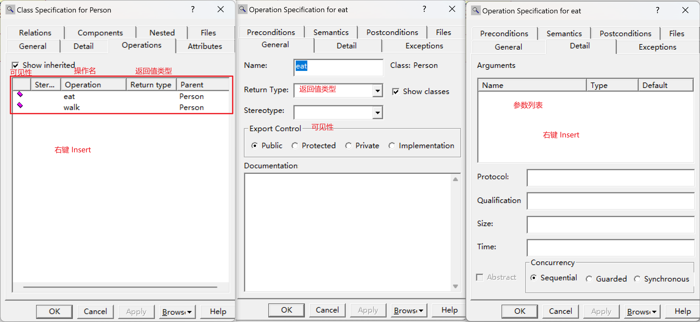 

###### 可见性

| 关键字       | 名称       | 符号 | 图标 | 语义                                          |
| ------------ | ---------- | ---- | ---- | --------------------------------------------- |
| public       | 公有类型   | `+`  |      | 允许在类的外部使用或查看该属性/操作           |
| protected    | 受保护类型 | `#`  |      | 子类允许访问父类中受保护类型的属性/操作       |
| private      | 私有类型   | `-`  |      | 只有类本身才能访问到属性/操作，外部一概不允许 |
| Implemention | 实现类型   |      |      | 属性/操作仅在被定义的包中可见                 |

###### 约束 Constriant

###### 职责 Responsibility

##### 类的类型

###### 实例化类 InstantiatedClass

###### 参数化类（模板类） ParameterizedClass

##### 类的构造型

- 实体类：保存永久信息的存储体。

- 控制类：负责协调其他类的构造，本身不完成任何业务功能。
- 边界类：位于系统与外界的交界处，包括所有的窗体、报表、打印机等硬件的接口以及其他系统的接口。

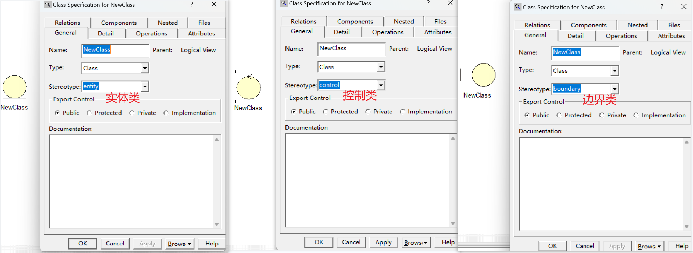 

#### 关系

- 关系：角色、名称、多重性（1..n）。

- 由类与类之间的耦合度从弱到强：依赖 < 关联 < 聚合 < 组合 < 泛化 = 实现

> 企业由职能部门组成，每个职能部门由一个经理，0-2个副经理和1个以上的员工组成。每个职能部门承担多项工作任务或一项工作任务也可能由多个部门共同承担，工作任务可能是赢利、后勤保障、公关。一项工作任务需要使用一到多种资源，这些资源由设备、经费、技术方法组成。
>
>  

##### 依赖

- 提供者的某些变化会要求或指示依赖关系中客户的变化。

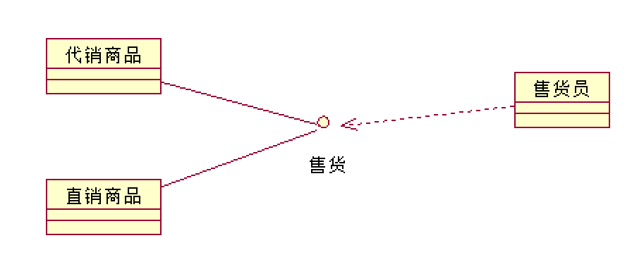 

##### 关联

- 描述对象/实例之间的离散连接。
- 关联类：即是关联也是类，关联本身也有其特性需要描述时。
- 链：关联的一个实例，不独立于对象而存在，是所涉及对象的一个有序表，每个对象必须是关联中对应类的实例或此类后代的实例。

 

> 某系统需要创建三个类“课程”、“学生”和“书”。其中“课程”类含有一个私有属性“课程号”，一个公共操作“选择课程”。学生需要知道课程号，并调用操作“选择课程”才能完成选课。“书”类含有一个私有属性“书号”，一个公共操作“借书”。学生需要知道“书号”，并调用操作“借书”才能完成借阅。为了区分这两个关联的语义，将学生类在两个关联关系中的角色分别命名为“学员”和“借阅者”。将上述需求在ROSE中用类图表达出来。
>
> 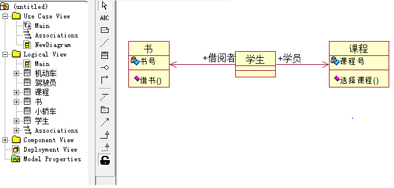 

> 1名教师可以为多名学生指导论文，每名学生只能由1名教师指导论文。使用关联类和一般类表达。
>
>  

> 学生可以是在校生或者毕业生。
> 助教必须是在校生。
> 一名助教指导一名学生。
> 教师和教授属于不同级别的教员。
> 一名教师助理可以协助一名教师或一名教授，一名教师最多只能有一名教师助理，一名教授最多可以有5名教师助理。
> 教师助理必须是毕业生。
>
>  

###### 自返关联（递归关联）(一元关联)

- 一个对象类与本身的关联，即类内两个对象的关联。

> 

###### N元关联

- 在3个及以上的对象类之间发生的关联，N元关联的每个实例是被关联的类的对象的多元组。

##### 聚合 Aggregation 、组合 Composition

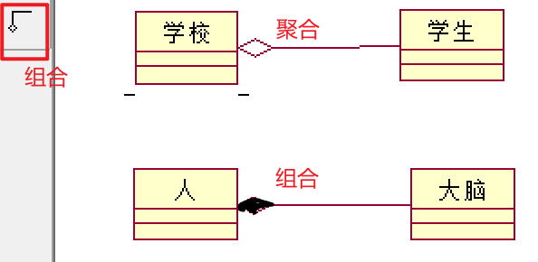 

> 已知“机床”类和“抽风机” 类都有一组属性和操作描述其中的电动机，则可考虑把这些共同的属性和操作分离出来，设立一个“电动机”类，使之与原先的两个类构成整体-部分结构。将上述需求用ROSE绘制出来。
>
>  

**聚合和组合的区别**

- 相同点：描述部分和整体的关系。

- 聚合关系：成员对象（部分）的生命周期不取决于整体的生命周期：教师和学校。
- 组合关系：成员对象（部分）的生命关系取决于整体的生命周期：手和人体。

##### 泛化

- is a kind of ...：父类和子类。 

1. 可替代性
2. 多态操作
3. 继承

##### 实现

- 类和接口之间的实现关系。

 

**泛化和实现的关系**

- 泛化和实现关系都可以将一般描述和具体描述联系。
- 泛化：将同一语义层的元素连接，通常在同一模型内。
- 实现：将不同语义层的元素连接，通常在不同模型内。

### 对象图

#### 概述

- 协作图来创建对象。
- 对象之间的关系只有链。

 

#### 发现对象

- 先松后紧：候选对象。

**1.问题域、系统边界、系统责任**

1. 人员
2. 组织
3. 物品
4. 抽象事物
5. 事件
6. 文件
7. 系统外人员
8. 系统责任

**2.审查、筛选**

1. 舍弃：是否提供了有用的属性操作。
2. 精简：
   - 对有多个操作，但是每个操作只有一个使用者的，分配到相应的使用者中合并。
3. 特殊结构-->子类：将不适用于所有对象的属性和操作分发给相应的子类。
4. 属性和操作相同的两个类：考虑合并为一个类
5. 属性和操作相似的两个类：一般-特殊结构或者部分-整体关系。

## 用例视图

### 简述

- 用例视图：描述了系统的参与者和系统进行交互的功能，是参与者所有观察和使用到的系统功能的模型图。
  - 标识出系统中的用例和参与者之间的联系，并确定什么样的参与者执行了哪个用例。
  - 当用例视图出现在系统参与者面前时，用例视图捕获了系统、子系统和用户执行的动作行为，将系统描述为系统的参与者对系统有用功能的需求（用例）。
- 用例：用例是系统的一个功能单元，是系统参与者和系统之间进行的一次交互作用。
  - 系统与一个或多个参与者之间的一系列消息来描述系统的交互作用。
  - 系统参与者：可以是人、外部系统、外部子系统等。

### 用例图 Use Case

#### 用例图简述

- 用例图：由参与者（Actor）、用例（Use Case）依据他们之间的关系构成的用于描述系统功能的动态视图。描述系统提供的一个功能单元，表示用例的组织关系。主要用于需求分析阶段，帮助开发团队以一种可视化的方式理解系统的功能需求。

1. Use Case图是指系统的外部事物（参与者）与系统的交互，表达了系统的功能，即系统向用户所提供的服务。

2. Use Case图是后续的系统分析与设计工作的依据，也是系统测试的依据。

3. Use Case图对需求的描述规范化，较好地避免了表达地歧义性，便于用户和开发人员理解系统的需求，取得共识。 

>某电话公司决定开发一个管理所有客户信息的交互网络系统。系统功能（用例）如下：
>
>1. 浏览客户信息：任何使用Internet的网络用户都可以浏览电话公司所有的客户信息（包括姓名、住址、电话号码等）。
>2. 登录：电话公司授予每个客户一个帐号。拥有授权帐号的客户，可以使用系统提供的页面设置个人密码，并使用该帐号和密码向系统注册。
>3. 修改个人信息：客户登录后，可以对个人信息进行修改。
>4. 删除客户信息：管理员登录后，可以删除不再接受公司服务的客户的信息。
>
>

> 某“错误报告系统”包含以下功能：
>
> 1. 用户登录
> 2. 修改个人资料
> 3. 错误报告
> 4. 用邮件报告错误
> 5. 用短信报告错误
> 6. 保留登录信息
>
> 说明：用户修改个人资料或者进行错误报告时，都必须先进行用户登录；错误报告有两种方式，一种是用邮件、一种是用短信；用户登录时可以选择保存登录信息，以便下一次登录。使用ROSE实现以上说明。
>
> 

> 现有一个产品销售系统，其总体需求如下：
>
> 1. 销售员负责产品销售，每次产品销售时都需要完成支付、更新存货清单和登记销售记录，更新存货清单和登记销售记录时均可选择输出报告。
> 2. 完成支付有两种方式，信用卡支付或支票支付，两种支付方式都必须进行身份验证。
> 3. 管理员负责系统维护，需要时可选择输出报告。
>
> 根据上述需求，使用ROSE绘制出用例图。
>
> 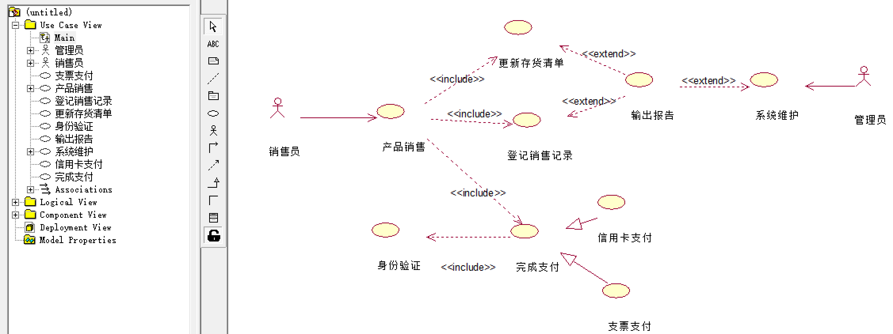

#### 参与者

##### 参与者简述

- 参与者是指存在于系统外部并直接与系统进行交互的人、其他系统、设备、时间等。
- 每个参与者可以参与一个或多个用例，一个用例可以有多个参与者。 

**参与者之间的泛化关系**

- 参与者本质上也是类，参与者和参与者之间主要是泛化关系（继承）。
- 泛化关系：提取共同的用例，将用例都是共同的用例的参与者当作父类来继承。

##### 识别、确认参与者

**如何确定参与者**

- 负责支持或维护系统中信息的人。
- 与系统进行信息交换（包括数据信息和控制信息交换）的外部事物可以确定为参与者；包括：人、设备、第三方系统。
- 时间是否会触发某些事件。时间也可以是参与者。

**识别参与者： 以图书管理系统为例**

1. 系统开发以后，使用系统主要功能的对象。 （学生、教师）
2. 需要借助系统来完成日常工作的对象。 （图书管理员）
3. 系统需要从哪些对象（人或系统等）中获取数据。 （扫码枪、读卡器、学籍管理系统）
4. 系统会为哪些人或系统提供数据。 （借阅人员、学籍系统、图书管理员）
5. 系统会与哪些系统交互。包括计算机系统和计算机中的其他应用软件。其他系统可以分为两类：
   - 该系统要使用的系统 （E卡通系统）
   - 启动该系统的系统 （WindowsXP系统）
6. 系统是由谁来维护和管理的，以保证系统处于工作状态 （系统管理员）
7. 系统控制的硬件设备有哪些。 （扫码枪、读卡器）
8. 对本系统产生的结果感兴趣的对象。（馆长、图书供应商）

##### 参与者的分类

**主要参与者和次要参与者**

- 主要参与者：执行系统主要功能的参与者。
- 次要参与者：使用系统次要功能的参与者。

**发起参与者和参加参与者**

- 参与者发起了用例的执行过程，一个用例只有一个发起参与者，可以有若干个参加参与者。

#### 用例

##### 用例简述

- 用例是外部可见的系统功能、是参与者可以感受到的系统服务或功能单元。定义系统如何被参与者使用，描述参与者为使用系统所提供的某一完整功能而与系统之间发生的一段对话。
- 每个用例在其所属包里都有唯一的位置，往往是一个能准确描述功能的动词或者动名词短语。

**用例的特征**

1. 用例表明的是类，而不是某个具体的实例：描述的是它代表的功能的各个方面，包含了用例指向期间可能发生的各种情况。
2. 用例必须由某一个参与者触发激活后才能执行，即每个用例至少拥有一个参与者。
3. 用例是一个完整的描述：只有当所有的小用例都完成，并最终产生了返回给参与者的结果，才代表整个用例的完成。

##### 识别用例

1. 参与者会将哪些外部事件通知给系统。 （续借图书）
2. 系统中发生的哪些事件会通知参与者。 （图书超期）
3. 是否存在影响系统的外部事件。 （E通卡升级） 
4. 参与者希望系统提供哪些功能。
5. 参与者是否会读取、创建、修改、存储系统的某种信息。

##### 用例粒度

- 用例的粒度：用例所包含的系统服务或功能单元的多少。
  - 用例粒度越大、用例包含的功能越多、得到的用例数越少。

- 一般的做法是复杂系统的用例粒度大一些，简单系统的用例粒度小一些：如果用例数目过多会造成用例模型过大，用例之间的关系过于负责，导致后续的系统设计难度大大提高。

##### 用例规约

- 用例规范：对每一个用例的详细描述信息：

1. 简要说明：对用例名称、编号、相关参与者、作用和目的的简要说明。
2. 事件流：
   - 基本事件流（基本流）：用例的基本流程，用例正常运行时的场景。
   - 扩展事件流（备选流）：很少使用的逻辑路径，异常、错误情况下所执行的逻辑路径。
3. 前置条件：执行用例之前系统必须所处的状态。

> 要求用户有访问的权限或是要求某个用例必须先被执行等。

4. 后置条件：用例执行完毕之后系统可能处于的一组状态。

> 货品出库用例执行后、需要执行应付款处理用例。

5. 非功能性需求：可靠性、性能、可用性和可扩展性等。

> 法律或法规方面的需求、应用程序标准和所构建系统的质量属性等。

#### 用例间的关系

- 关系：带箭头和不带箭头；箭尾连接对话的主动发起者，箭头所指的是对话的被动接受者。   
  - 参与者可以是主动发起者和被动接收者。

| 对比   | 泛化                                                         | 扩展                                                         | 包含                                                         |
| ------ | ------------------------------------------------------------ | ------------------------------------------------------------ | ------------------------------------------------------------ |
| 构造型 |                                                              | `<<extend>>`                                                 | `<<include>>`                                                |
| 指向   |  |  |  |
| 符号   | 空心箭头                                                     | 虚箭线                                                       | 虚箭线                                                       |
| 执行   |                                                              | 基用例执行，扩展用例不一定执行                               | 基用例执行，被包含用例必执行                                 |

##### 泛化

- 用户的泛化指的是一个父用例可以被特化形成多个子用例，而父用例和子用例之间的关系就是泛化关系。
- 在用例的泛化关系中，子用例继承了父用例所有的结构、行为和关系，子用例是父用例的一种特殊形式。
- 子用例还可以添加、覆盖、改变继承的行为。
- 在UML中用例的泛化关系通过一个三角箭头从子用例指向父用例来表示。

>   

##### 扩展

- 扩展：从扩展用例到基础用例的关系，添加对小概率事件的扩展，往往被用来处理异常或者构建灵活的系统框架。
  - 扩展用例：在一定条件下，把新的行为加入到已有的用例中，获得的新用例。
  - 基础用例：原有的用例。

> 员工需要使用“执行查询”功能，有时还需要“导出查询结果”或“打印查询结果”。
>
> 后期业务进一步发展，员工“执行查询”功能细分为“执行财务报表查询”和“执行人员档案查询”。
>
> 将以上需求用用例图表达出来。
>
>  

##### 包含

- 包含：一个用例的功能过多、事件流过于复杂时，将某一段事件流（多个用例用到同一段的行为）抽象成为一个被包含的用例。
- 基础用例的执行必然引起被包含用例的执行。

1. 避免在多个用例中重复描述一段行为。
2. 提高用例模型可维护性，复用用例中的公共行为。

> 共有“下订单”、“查供应商”、“查询产品”、“查订单目录”、“安排付款”、“付现金”、“付支票”7个用例。他们之 间的关系如下：
>
> - 下订单的过程中必需查供应商、查询产品并且安排付款，如果有需要的话，还可以查订单目录；
> - 付款的方式有两种，包括付现金和付支票。
>
> 从支持复用、简化用例的角度出发，使用ROSE设计用例图：
>
> 

## 交互视图

### 简述

- 交互视图：描述执行系统功能的各个角色之间相互传递信息的顺序关系，是描绘系统中各种角色或功能交互的模型，跨越多个对象的系统控制流程。

**交互视图的表示形式**

- 协作图：表示对象之间是如何协作完成一个功能的。

- 序列图：反映执行系统功能的各个角色之间传递消息的顺序关系。

**通过不同对象间的相互作用描述系统的行为**

- 以独立的对象为中心（状态机）：描述对象内部的深层次的行为。
- 以相互作用的一组对象为中心（交互视图）：描述一组对象的整体行为。

### 协作图

### 顺序图（序列图）

- 顺序图：对象之间随时间的交互，对象之间的通信过程。

1. 对用例中的基本流程和备选流程（用例）进行逻辑描述。
2. 将交互关系表示为一个二维图：
   - 纵向：时间轴，时间沿竖线向下延伸。
   - 横向：参与交互的对象。

- 作用：

1. 对对象之间的交互建模。
2. 业务人员：描述业务流程中对象的交互过程，更精确的描述业务需求。
3. 需求分析：细化用例的表达。
4. 技术人员：记录系统行为。

> 以下是合同管理员通过采购合同数据库增加一个采购合同的描述，用顺序图表示出来。
>
> 参与者“合同管理员”向对象“采购合同数据库”调用操作“增加采购合同”；
>
> 对象“采购合同数据库”创建一个对象“采购合同”；
>
> 对象“采购合同”返回一条消息，通知“采购合同数据库”，一个新的“采购合同”对象创建完毕；
>
> 对象“采购合同数据库”自调用操作“存入采购合同”，将新创建的采购合同对象存入采购合同数据库；
>
> 采购合同数据库返回消息，通知合同管理员，新合同已加入数据库。
>
> 

> 还书用例剧本：
>
> 1. 管理员在主界面中点击进入还书界面。
> 2. 主界面创建临时对象“还书界面”。
> 3. 管理员在还书界面中输入“图书编码和借书证号”，还书界面带着参数“图书编码”调用对象“借书记录表”的操作“查借书记录”，并返回消息借书记录。
> 4. 还书界面带着参数“借书证号”调用对象“借阅者信息表”的操作“查借阅者信息”，并返回消息借阅者信息。
> 5. 还书界面自调用操作“显示还书信息” 。
> 6. 管理员确认归还。
> 7. 还书界面分别调用对象“借书记录表”的操作“修改借书记录”，“图书信息表”的操作“图书信息表”的操作“修改图书状态”，“借阅者信息表”的操作“修改借阅者状态”。
> 8. 管理员关闭还书界面。
>
> - 参与者：管理员
> - 交互对象：主界面、还书界面、借阅者信息表、图书信息表、借书记录表
>
>  

#### 对象、生命线

- 对象：使用生命线进行表示，当对象存在时，生命线用一条虚线表示，此时对象不处于激活状态，当对象的过程处于激活状态时，生命线是一个双道线。
  - 可以是系统的参与者、任何有效的系统对象。
- 如果对象的开始位置位于顺序图的顶部，则表明该对象在顺序图开始交互时就已经存在了，如果对象的位置不在顶部，则表明该对象在交互的过程中被创建。
  - 主角：交互的发起对象，通常放在顺序图的最左端。

| 对象标记    | 说明                     |
| ----------- | ------------------------ |
| {new}       | 在执行期间被创建         |
| {destory}   | 在执行期间被销毁         |
| {transient} | 在执行期间被创建而后销毁 |

>  

- 生命线：对象存在的时段。
- 激活：对象接收到一个消息时，该对象中的一个程序启动的过程。
  - 当一个对象在激活期时，该对象处于激活状态，能够响应或发送消息，执行动作或活动。

 

#### 消息

- 消息：对象之间的交互和通信。
  - 从一个对象的生命线到另一个对象生命线的箭头，箭头以时间顺序在图中从上到下排列。

 

##### 约束

- `序号 [判断条件] *[循环] 返回值:=操作名/消息(参数列表) {约束条件}`
  - 序号一般自动给出。

>序号为1，如果n>1则循环调用fun1()方法10次，且需要在30秒内完成，参数为param，返回result
>
>- 则：1: [n>1] *[i==0,i<10,i++] result:=fun1(param){30秒内完成}

> 顺序图包含三个交互对象A、B、C，它们按以下次序进行交互。
>
> 1. A调用B的操作op1，B执行op1后返回消息return1给A；
> 2. B向C循环发送10次消息message1：B带着参数a自调用op1；
> 3. A在满足条件n>1的情况下向C发出消息message2。
>
>  

> 通话管理”顺序图：
>
> - 电话S调用交换机T的操作“激活通话”，激活交换机开始工作；
> - 交换机T返回“拨号提示音”提醒对象S可以开始拨号；
> - S自调用“拨号”操作，在30秒内拨完全部8位号码；
> - 完成拨号后，调用交换机T的操作“逻辑连通”；
> - 交换机T创建会话对象C，由C管理具体的通话事宜；
> - C调用电话R的操作“振铃”，振铃时间少于30秒；
> - 电话R返回本机号码，表示会话被接受；
> - C返回参数S和R号码给交换机T；
> - 交换机T带着参数（S,R）自调用 “通话”操作。
> - 通话结束后，交换机销毁临时对象C。
> - 参与交互的对象：电话S、电话R、交换机T、会话管理对象C。
>
> 

> 客服人员修改客户信息的用例剧本：
>
> 1. 客服人员进入客户信息界面；
> 2. 对象“客户信息界面”创建临时对象“客户信息控制器” ；
> 3. “客户信息控制器”调用对象“数据库管理器”的操作“获取所有客户信息”；
> 4. “数据库管理器”返回消息“所有客户信息”到对象“客户信息控制器”，“客户信息控制器”带参数调用“客户信息界面”的操作“信息显示”，显示所有客户信息；
> 5. 客服人员在客户信息界面中选择要修改的客户；
> 6. “客户信息界面”调用”数据库管理器”的操作“获取特定客户数据”；
> 7. “数据库管理器”返回消息“特定客户信息”到对象“客户信息界面”，“客户信息界面”自调用操作“信息显示”，显示特定客户信息；
> 8. 客服人员在客户信息界面中修改客户的数据；
> 9. 客户信息界面自调用操作“提示”，提示用户“是否确定更新数据”；
> 10. 客户确认后，“客户信息界面”调用“客户信息控制器”的操作“接收需更新的客户数据”；
> 11. “客户信息控制器”调用“数据库管理器”的操作“执行数据的更新”；
> 12. “数据库管理器”返回消息“更新后的所有客户信息”到“客户信息控制器” ；
> 13. “客户信息控制器”带参数调用“客户信息界面”的操作“信息显示”，将“更新后的所有客户信息” 显示到客户信息界面；
> 14. “客户信息控制器”自销毁。
>
>  

##### 操作

 

##### 标记

| 消息标记      | 含义     |
| ------------- | -------- |
| `<<create>>`  | 创建对象 |
| `<<destory>>` | 销毁对象 |

#### 分支、从属流

- 分支：从同一点发出多个消息的并指向不同的对象，根据条件是否互斥，可以有条件和并行两种结构。

| 分支     | 说明                                                         |
| -------- | ------------------------------------------------------------ |
| 条件分支 | 多个消息的保安条件是互斥的，在一个特定的时刻，仅有一个消息的保安条件会得到满足，导致该消息的发送。 |
| 并发分支 | 多个消息的保安条件是互为相容的，在一个特定的时刻多个消息的保安条件都可能满足，则多个消息可能同时发送。 |

- 从属流：从同一点发出多个消息指向同一个对象的不同生命线。

> 1. 当x=2,y=-1时，有几个对象参与过交互？
> 2. 当x=-1,y=-1时，有几个对象参与过交互？
> 3. 当x=0,y=0时，整个交互过程共传递了多少条信息？
>
>  

> 修改采购合同剧本：
>
> - 对象“采购合同管理器” 用异步消息创建一个临时对象“采购合同” ；
> - 对象“采购合同管理器” 带参数“序号”调用“采购合同”对象的操作“录入采购合同数据” ；
> - 对象“采购合同”根据“序号”调用对象“采购合同数据库接口”的操作“提取采购合同” ；
> - 采购合同数据库接口返回“序号”对应的采购合同；
> - 采购合同对象调用自己的操作“修改合同数据”，修改完毕后，调用“采购合同数据库接口”的操作“存储采购合同” ；
> - “采购合同数据库接口”返回提示消息“存储成功” ；
> - “采购合同”对象返回提示消息“修改成功”给“采购合同管理器”；
> - “采购合同管理器”销毁临时对象“采购合同”。
>
> 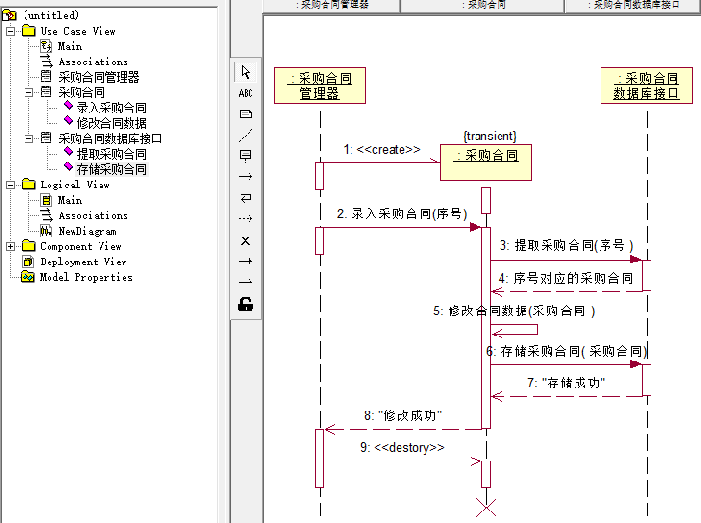 

> 下面是一个客户在ATM机上的取款工作流程：
>
> 1. 客户在ATM对话框中点击选择取款功能选项；
> 2. ATM对话框自调用操作“显示信息”，提示用户插入IC卡，并创建读卡器临时管理对象；
> 3. 读卡器临时管理对象循环自调用IC卡检查操作，当读卡器有IC卡时，返回提示信息用户输入密码给ATM对话框；
> 4. ATM对话框自调用操作“显示信息”，提示客户输入自己的密码；
> 5. ATM对话框调用“后台数据管理”的操作“验证密码”，检查用户密码是否正确；
> 6. 如果密码正确，则系统显示用户账户上的剩余金额，并提示用户输入想要提取的金额；
>
> 7. ATM对话框自调用操作“显示信息”，提示客户账户余额及所需提取金额。用户输入提取金额后，ATM对话框调用“后台数据管理”的操作“检查数据合法性”，检查取款金额是否正确；
> 8. 若取款金额正确，ATM对话框调用“后台数据管理”的操作“更新账户余额”；带着参数“取款金额”调用“出钞设备”的操作“输出现金” 。
>
> - 参与者：客户
> - 交互对象：ATM对话框、读卡器临时管理对象、出钞设备、后台数据管理
>
> 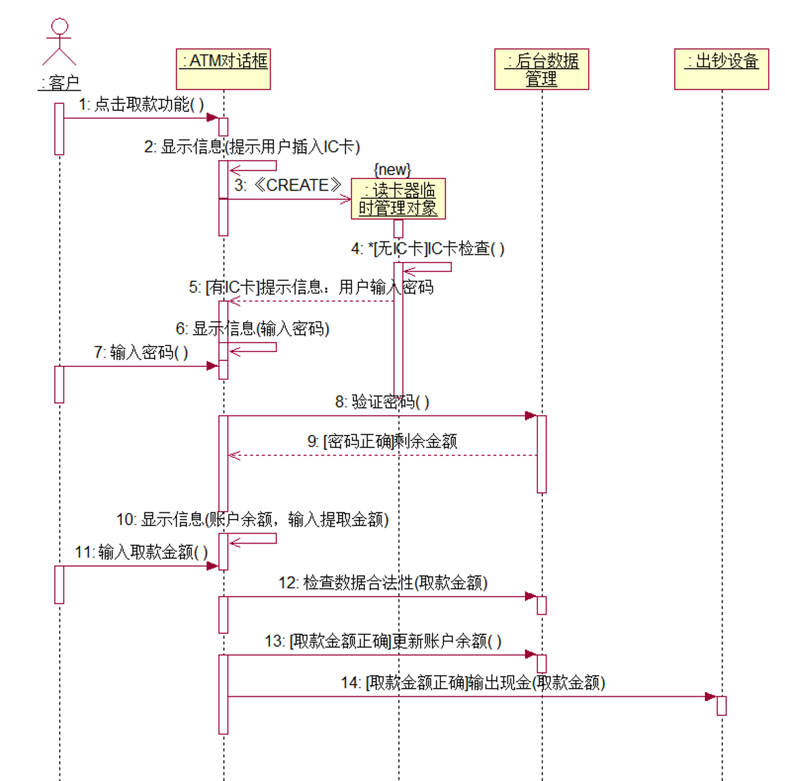

#### 交互框架

- 片段（Fragment）、交互片段（Interaction Fragment）：顺序图中的一个分区域，包含着该顺序图的局部内容。对于一个片段允许带有保安条件（Guard），当该条件为真时才执行该片段。 一个或多个片段可以由一个交互框架包围，在框架图形左上角的标题框中给出操作符，表明该交互框架中片段的处理方式。
- 组合片段：把二个或多个片段放在一个交互框架里，各片段的区域之间用一条虚线分隔。组合片段常用于表示交互中的条件选择、并发或引用情况。

| 片段 | 名称 | 说明                                                         |
| ---- | ---- | ------------------------------------------------------------ |
| alt  | 选择 | 有多重片段供选择，且必选其一，只有当其保安条件为真的片段才被执行。 |
| opt  | 任选 | 有多重片段供选择，只有当其保安条件为真的片段才被执行。       |
| par  | 并行 | 每个片段都并发执行                                           |
| loop | 循环 | 片段可重复执行，保安条件给出执行条件。                       |
| ref  | 引用 | 引用在其它图上定义的一个交互                                 |

 

## 状态机视图

### 简述

- 状态机视图：通过对象的各种状态建立模型来描述对象随时间变化的动态行为。由描述对象状态的一组属性和描述对象变化的动作构成。状态机用状态图来表达。
  - 一个状态机由该对象的各种所处状态以及连接这些状态的符号组成。每个状态对一个对象在其 **生命周期** 中满足某种条件的一个时间段建模。当一个事件发生时，它会触发状态间的转换，导致对象从一种状态转化到另一新的状态。与转换相关的活动执行时，转换也同时发生。
- 对象：
  - 状态机视图以独立的对象为中心，通过不同对象间的相互交互作用来描述系统的行为。
  - 每个对象都拥有自己的状态，通过事件触发改变状态：对象被看作通过事件进行触发并做出相应的动作来与外界的其他对象进行通信的独立实体。
- 事件：任何影响对象状态变化的操作。事件表达了对象可以被使用操作，同时反映了对象状态的变化。
- 状态：状态是使用类的一组属性值来进行标识的，这组属性根据所发生不同的事件进行不同的反应，从而标志对象的不同状态。处于相同状态的对象对同一事件具有相同的反应，处于不同状态下的对象会通过不同的动作对同一事件作出不同的反应。

### 状态图

- 状态图：描述一个对象在其生命周期内的动态行为。

1. 描述状态之间的转换顺序-->事件的执行顺序，避免事件顺序出错。
2. 描述了影响状态的因素，避免非法事件的进入。
3. 描述工作流的分支和汇合。

> 银行账户有三种状态：账户打开状态、透支状态、账户关闭状态。
>
> - 银行账户初始状态是“账户打开状态”，当“客户请求关闭”事件出现时，进入“账户关闭状态”，这是银行账户的终止状态。
> - 当“取款”事件出现，且账户满足“余额小于0”的条件时，银行账户从“账户打开状态”进入“透支状态”。
> - 当“存款”事件出现，且账户满足“余额大于0”的条件时，银行账户从“透支状态”进入“账户打开状态”。
> - 当“检查账户余额”出现，且账户满足“余额小于0且达30天以上”的条件时，银行账户从“透支状态”进入“账户关闭状态”。
>
> 

#### 状态机

- 状态机：展示状态和状态转换的图，描述一个对象或一个交互在其生命周期内响应事件所经历的动态序列。
- 状态机包含：状态、转换、事件、活动（动作）。 

#### 状态

- 状态：在对象的生命周期中满足某些条件、执行某些活动或等待某些事件时的一个条件或状态。
- 状态包括：名称、进入动作、退出动作、子状态、延迟事件。

| 状态     | 说明                                     |
| -------- | ---------------------------------------- |
| 初始状态 | 伪状态，无监护条件 只能作为转换的源 |
| 终止状态 | 可以存在多个 只能作为转换的目标     |

##### 子状态（组合）

| 子状态     | 特征   | 说明                                                         |
| ---------- | ------ | ------------------------------------------------------------ |
| 顺序子状态 | 顺序   | 一个组合状态对应的对象在其生命周期内的任何时刻只能处于一个子状态： 多个子状态之间互斥。 |
| 并发子状态 | 并发条 | 并发工作流的分支和汇合。                                     |

 

> 利用同步机制完善下图，该图是一张采购订单的状态图：
>
> 1. 在售状态是一个复合状态；
> 2. 商品检查和付款检查可以并发进行；
> 3. 付款检查通过后进入已付款状态，不通过进入拒绝状态；
> 4. 商品检查和付款检查都完成后才能进入办理订货状态，如果商品检查先完成，而付款检查还未完成，则商品检查进入等待状态，等到付款检查完成后，才一起进入办理订货状态；
> 5. 办理订货和已付款都完成后才能进入发货状态；
> 6. 在售状态下，用户可以随时取消订单，进入终止态，
>
> 

##### 历史状态

- 历史状态：伪状态（初始状态的一种构造型），记住从组合状态中退出时所处的子状态。

 

#### 转移

##### 转移要素

- 转换：两个状态之间的关系：对象在一个状态中执行一定的动作，并在某个特定事件发生且某个特定条件满足时进入下一个状态。
- 转换包括：源状态、事件触发、监护条件、动作、目标状态。

 

> |      | 空 （指针值=0） | 半满 （0<指针值<1000） | 满 （指针值=1000） |
> | ---- | -------------------- | --------------------------- | ----------------------- |
> | 压入 | 可执行               | 可执行                      | 不可执行                |
> | 弹出 | 不可执行             | 可执行                      | 可执行                  |
>
> 

##### 转移类型

| 类型     | 说明                                    |
| -------- | --------------------------------------- |
| 内部转移 | 不导致状态改变 不执行entry、exit动作 |
| 外部转移 |                                         |
| 自转移   | 返回自身状态的转移                      |

| 类型     | 说明             |
| -------- | ---------------- |
| 完成转移 | 有触发器、无条件 |
| 条件转移 | 无触发器、有条件 |

#### 动作/活动

- 动作是原子的，活动是由动作组成的非原子的。

| 动作  | 名称     | 说明                                                         |
| ----- | -------- | ------------------------------------------------------------ |
| entry | 入口动作 | 状态的内部初始化、最优先且不可避开                           |
| exit  | 出口动作 | 退出状态时执行 内部活动异常中断                           |
| do    | 内部活动 | 存在外部转移时，do可能不会被执行 do结束 --> 触发转移 外部转移 --> 终止 |

  

#### 事件

| 类型     | 说明                                            |
| -------- | ----------------------------------------------- |
| 信号事件 | 异步、对象之间的通信                            |
| 调用事件 | 同步                                            |
| 变化事件 | When(布尔表达式)/动作 When:布尔表达式/动作   |
| 时间时间 | When(时间表达式)/动作 After(时间表达式)/动作 |

**变化事件和监护条件的区别**

- 变化事件：由系统连续测试事件。
- 监护条件：只在触发器事件触发时测试一次。如果监护条件为假，则转换不激活且事件被遗失，条件也不会再被测试。

> 用状态机图描述图书的状态变迁，图书状态如下：
>
> 1. 初始状态为预备流通状态，内部活动是编目；编目完成后从预备流通状态进入流通状态。
> 2. 流通状态是组合状态，包括：在库状态，已预约状态和已借出状态；初始态为在库状态；
> 3. 读者预约后，从在库状态进入已预约状态；取消预约或者超过预约日期时，回到在库状态。
> 4. 借书事件出现时，图书从在馆状态或已预约状态进入到已借出状态；还书事件出现时，回到在馆状态。
> 5. 丢失事件出现时，图书从流通状态进入退出流通状态。
> 6. 终止状态为退出流通状态，出口动作是删除编目信息。
>
>  

> 用状态机图描述借阅者账户的状态变迁，借阅者账户状态如下：
>
> 1. 初始状态为新建状态，入口动作是账户初始化；开通账户事件出现时，进入可借状态。
> 2. 可借状态；借书事件出现时，如果借书数量达到最大可借数，则进入不可借状态，否则还是回到可借状态，借书数+1。
> 3. 不可借状态；还书事件出现时，回到可借状态，借书数-1。
> 4. 删除状态。不管账户处于何种状态，销号事件出现时，均进入删除状态，出口动作为删除账户信息。
>
> 

## 活动视图

### 简述

- 活动视图是一种特殊形式的状态机视图，是状态机的一个变体，用来描述执行算法的工作流程中涉及的活动，通常用于对计算流程和工作流程建模。活动视图使用活动图来体现。
- 活动视图中的状态：表示计算过程中所处的各种状态。

**活动图**

- 活动图：活动图中包含了描述对象活动或动作的状态以及对这些状态的控制。
- 活动状态：活动图包含对象活动的状态，活动的状态表示命令执行过程中或工作流程中活动的运行。
  - 与等待某一个事件发生的一般等待状态不同，活动状态等待计算处理过程的完成，当活动完成的时候，执行流程才能进入活动图的下一个活动状态中去。当一个活动的前导活动完成时，活动图的完成转换被激发。活动状态通常没有明确表示出引起活动状态转换的事件，当出现闭包循环时，活动状态会异常终止。
- 动作状态：活动图也包含了对象的动作状态，它与活动状态有些类似，不同的是，动作状态是种原子活动操作并且当它们处于活动状态时不允许发生转换。
- 对状态的控制：这种控制包括对并发的控制等。并发线程表示能被系统中的不同对象和人并发执行的活动。在活动图中通常包含聚集和分叉等操作。在聚集关系中每个对象有着它们自己的线程，这些线程可并发执行。并发活动可以同时执行也可以顺序执行。活动图能够表达顺序流程控制还能够表达并发流程控制。
- 活动图不仅可以对事物进行建模，也可以对软件系统中的活动进行建模。活动图可以很好地帮助我们去理解系统高层活动的执行过程，并且在描述这些执行的过程中不需要去建立协作图所需的消息传送细节，可以简单地使用连接活动和对象流状态的关系流表示活动所需的输入/输出参数。

### 活动图

#### 活动图简述

- 活动图：描述系统行为，描述动作和动作导致对象状态改变的结果。（描述用例的具体行为）
- 动作：原子的。
- 活动：非原子的，由动作组成。
- 组合活动：包含内嵌活动/动作。

 

#### 分支与合并

- 分支：每条路径的监护条件互斥，各种可能。
- 合并：多个控制路径在此汇合。

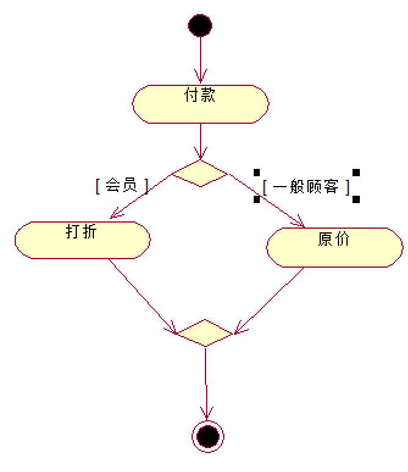 

#### 分叉与汇合

- 并发：在同一时间内，多个活动并行执行，在汇合处等待所有的分支都完成后再继续执行。

 

#### 泳道

- 泳道：为了对活动的职责进行组织而在活动图中将活动状态分为不同的组，明确表示活动由哪些对象执行。一个活动只能属于一个泳道。
- 每个泳道可能由一个或者多个类实施，类所执行的动作或拥有的状态按照发生的事件顺序自上而下的排列在泳道内。

#### 对象流

- 对象流：将对象作为输入或输出的控制流。在活动图中，对象流描述了动作或者活动与对象之间的关系，表示动作使用对象以及动作对对象的影响。
- 虚箭线：
   - 从活动（动作）状态出发指向对象，表示该动作创建或更新了对象流所指向的对象，该对象是动作的输出。
   - 从对象出发指向活动（动作）状态，表示该动作使用对象流所来源的对象，该对象是动作的输入。

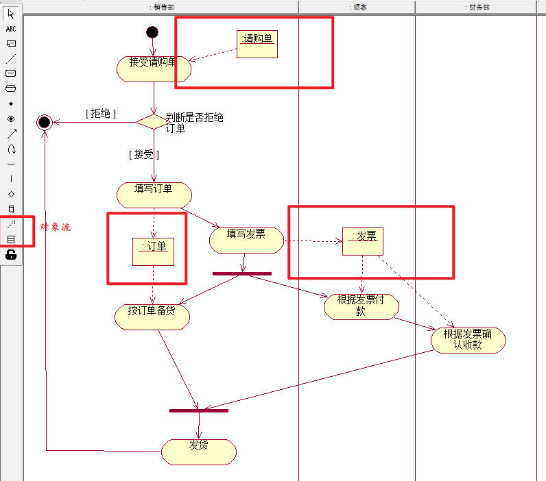 

## 物理视图

- 物理视图包含：实现视图（构件图）、部署视图（部署图）。
- 物理视图对应用自身的实现结构建模，提供了将系统中的类映射成物理构件和节点的机制。
- 逻辑方面需要发现和描述对象类、接口、协同、交互和状态机等事物，物理方面需要找出构件和节点。 
- 构件图描述软件的各个构件以及它们之间的关系，部署图描述硬件的各个构件以及它们之间的关系.

### 实现视图（构件图）

#### 简述

- 构件是系统高层的可重用的组成部件：实现视图将系统中可重用的块包装成为具有可替代性的物理单元（构件）。
- 实现视图：构件、构件间的接口、依赖关系。
- 组件图(构件图)=构件（component）+接口（interface）＋关系（relationship） +端口（port）+连接器（connector）
- 构件图：描述各种软件构件之间的依赖关系

 

> 某软件由构件“调度程序”、“计划程序”和“GUI”构成，其中构件“调度程序”实现接口“注册登记”、构件“计划程序”实现接口“更新”，并使用接口“注册登记”，构件“GUI”使用接口“更新”。根据以上信息绘制构件图。
>
> 

#### 构件（组件）

- 构件：系统中遵守一组接口且提供其实现的物理的、可替换的部分（物理实现单元）。构件能够完成独立功能，是软件系统的组成部分。
- 良好的构件不依赖于其他构件，而依赖于构件所支持的接口。构件提供接口的实现，一个构件可以实现一个或多个接口。 
- 构件代表了将系统中的类、接口等逻辑模型元素打包后形成的物理模块。

| 构件类型                 | 说明                                                 |
| :----------------------- | :--------------------------------------------------- |
| 基本构件                 | 系统中可执行的元素                                   |
| 包装构件 （扩充构件） | 对基本构件的扩展 一组相关的元素，即构件的命名空间 |

- 构件的命名空间：类、接口、构件、包、用况、依赖、制品。
- 构件的另一含义：可以用构件装配大粒度的构件，方法为把所复用的构件作为大粒度构件的成分，并把他们的请求和提供接口连接在一起。（组件包含组件、组拼大组件）

#### 接口

| 接口类型               | 说明                                                   |
| :--------------------- | :----------------------------------------------------- |
| 提供接口 （供接口） | 构件实现的接口 给其他构件提供服务的接口             |
| 请求接口 （需接口） | 构件使用的接口 构件向其他构件请求服务时要遵守的接口 |

 

#### 端口

- 端口：描述在构件和其环境之间、构件和其内部构件之间的一个交互点（被分装的构件和外界的交互点），所有进出构件的交互都要通过端口。
- 端口是构件的一部分，端口的实例随着其所属的构件的实例一起被创建和撤销。
- 端口和接口的关系：构件的通讯完全通过端口支持的接口来描述。

#### 连接器

- 连接器（连接件）：特点语境下两个部件之间、两个端口之间的通信关系。

##### 代理连接器

##### 组装连接器

##### 装配连接器

#### 关系

##### 实现关系

- 实现关系：组件与接口之间的联系，代表谁实现了该接口。

##### 依赖关系

- 依赖关系：组件使用了另一个组件的接口，依赖于另一个接口的存在。

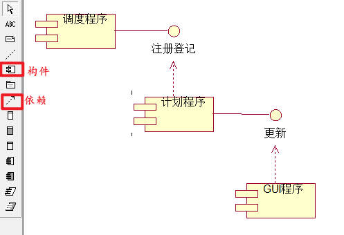 

### 部署视图（部署图）

#### 部署图简述

- 部署视图：表示运行时的计算资源（节点）的物理布置。
- 在运行时，节点包含构件和对象，构件和对象的分配可以是静态的，也可以在节点之间迁移。
- 如果含有依赖关系的构件实例放置在不同的节点上，部署视图可以展示出执行过程中的瓶颈。

- 部署图：对部署系统时涉及到的硬件进行建模。
- 一个系统模型只能有一个部署图。
- 标记符：节点、关联关系标记符，描述实际的计算机、设备、连接关系。

##### 目的

- 部署图的主要目的：硬件拓扑，代表如何在硬件组件上安装软件，描述了软件以何种方式与硬件交互以执行。

1. 设想系统的硬件拓扑。
2. 表示安装了软件组件的硬件组件。
3. 描述运行时节点的处理。

##### 用途

1. 为系统的网络和硬件拓扑建模。
2. 为分布式网络和系统建模。
3. 实施转发和逆向工程流程。
4. 为C/S系统的硬件详细信息建模。
5. 用于对嵌入式系统进行建模。

##### 原则

1. 找出所要绘图系统的节点，确定节点。
2. 找出节点间的通信联系。
3. 找出工作。
4. 绘制部署图，每个节点都有名称，写明节点间物理联系的名称。

- 涉及的参数：

1. 高性能
2. 可扩展性
3. 可维护性
4. 可移植性
5. 容易理解

#### 节点

##### 节点简述

- 节点：存在于运行期间的系统的物理元素，代表计算机资源（处理器、其他硬件设备），系统的构件可以配置在节点上。
- 节点实例

| 节点类型   | 说明                                                         |
| ---------- | ------------------------------------------------------------ |
| 处理器节点 | 本身具有计算能力且能执行各软件的节点 包含处理器的调度、进程。 |
| 设备节点   | 本身不具备处理能力的节点。                                   |

- 设备节点：`<<cdrom>>、<<cd-rom>>、<<computer>>、<<disk array>>、<<pc>>、<<pc client>>、<<pc server>>、<<secure>>、<<server>>、<<store>>、<<unix server>>、<<user pc>>`。

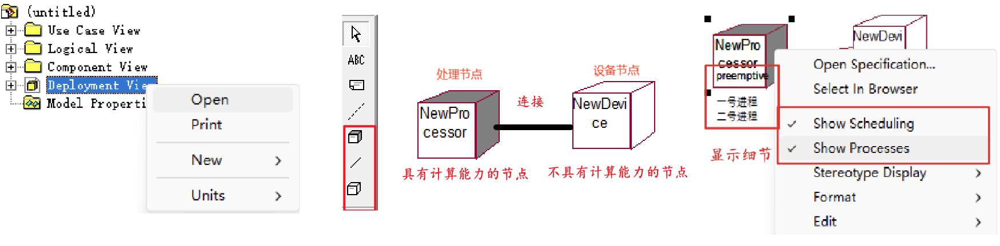 

##### 进程、调度策略

| 调度策略                  | 说明                                                         |
| :------------------------ | ------------------------------------------------------------ |
| Preemptive 抢占式         | 默认，高优先级的进程可以抢占低优先级的进程。                 |
| Non preemptive 无优先方式 | 进程没有优先级，当前进程在执行完毕后再执行下一个进程。       |
| Cyclic 循环调度           | 进程循环控制，每个进程都有一定的时间，超过时间 或 执行完毕后交给下一个进程执行。 |
| Executive                 | 使用计算机算法控制进程调度                                   |
| Manual                    | 用户手动计划进程调度                                         |

 

#### 物件

- 物件（`<<artifact>>`）：软件开发过程中的产物，包括过程模型（用例图、设计图等）、源代码、可执行文件、设计文档、测试报告、需求模型、用户手册等。

#### 连接

- 连接：两个节点之间的硬件连接，连接通常是双向的，有网络协议。

> 假定系统的功能为允许用户通过Web对检索的商品进行扫描。更加详细的软硬件部署需求为：扫描仪通过PCI总线连接到网卡；网卡通过无线电波与Web服务器通信，Web服务器通过HTTP协议与客户计算机通信；将通信软件安装在Web服务器上，通过JDBC协议与数据库服务器连接，并使用专用数据库访问软件与数据库服务器通信；在客户计算机上安装浏览器软件，并在其上运行商品查询插件。按照以上软硬件部署需求绘制部署图。
>
>  

#### 节点容器

- 节点容器：包含其他节点的节点（组件、物件等）。

## 模型管理视图

### 简述

- 模型管理视图是对模型自身组织进行的建模，是由自身的一系列模型元素构成的包所组成的模型。
- 包是操作模型内容、存取控制和配置控制的基本单元。
- 每一个模型元素包含或被包含于其他模型元素中：模型是从某一观点以一定的精确程度对系统所进行的完整描述。模型是一种特殊的包。一个包还可以包含其他的包。整个系统的静态模型实际上可看成是系统最大的包，它直接或间接包含了模型中的所有元素内容。
  - 子系统是另一种特殊的包。它代表了系统的一个部分，它有清晰的接口，这个接口可作为一个单独的构件来实现。任何大的系统都必须被分成几个小的单元，这使得人们可以一次只处理有限的信息，并且分别处理这些信息的工作组之间不会相互干扰。
- 模型管理由包及包之间的依赖组成。模型管理信息通常在类图中表达。

**组织层次结构--三层结构** 如 MVC

- 用户界面层：用户交互。
- 业务逻辑层：系统的业务流程。
- 数据访问层：数据库交互。

### 包图

#### 概述

- 包：将所有模型元素组织成各种功能/用途的模块，并控制包中元素的可见性、描述包之间的依赖关系。

- 包图由包之间的关系组成，描述系统的模块之间的依赖关系。

- 包是可以拥有任何模型元素的通用命名空间：每个建模元素必须在系统中唯一的命名空间进行声明，每个图必须被一个唯一确定的包所有。
- 包构成进行配置控制、存储、访问控制的基础。

| 可见性    | 符号 | 说明                       |
| --------- | ---- | -------------------------- |
| public    | #    | 对所有引入的包及其后代可见 |
| protected | +    | 只对该包的泛化可见         |
| private   | -    | 对包外元素完全不可见       |

- 包是不透明的：通常一个包不能访问另一个包的内容，只有被访问或引入依赖关系才能打开。

- 子系统 subSystem：具有单独说明和实现部分的包、对系统其他部分存在接口的连贯模型单元。

- 构造型 Stereotype

#### 关系

- 包的关系有：依赖、泛化。

##### 依赖

###### 包的依赖关系

- 包的依赖：两个包所包含的模型元素之间存在一个或多个依赖。
- 基用例依赖扩展用例，基用例依赖被包含用例。
- 包的循环依赖关系：如果把包理解成子系统，那么循环依赖的包意味着这两个子系统的联系是密切的，可能存在高耦合联系，从这个角度看包之间不应该存在有循环依赖的情况。但是，由于包的依赖联系没有传递性，因此，包之间的循环依赖并不完全等同于系统的高耦合联系，应该具体情况具体分析。

###### 引入关系 import

- 引入关系：包与包之间的一种存取依赖关系。引入指允许一个包的元素存取另一个包的公共部分。
- 包的输出：包的公共部分，即其可视性为“公共”的模型元素。包的输出只对另一个与它有引入关系的包才是可视的、可存取的。 

 

- 依赖中扩展和包含的体现：
  - 基用例依赖扩展用例。
  - 基用例依赖被包含用例。

> 系统中有四个包分别是：客户机、服务器、策略、GUI。
>
> - 客户机包中包含三个类：公共的“订货表”类和“追踪表”类，还有一个私有的“订货”类；
> - 策略包中包含两个类:公共的“订货规则”类和私有的“交易规则”类；
> - GUI包中包含三个类：公共的“窗口”类和“表格”类，保护的“事件处理”类；
> - 服务器包中包含两个类：公共的“数据库”类和“登录服务”类。
>
> 其中客户机包需要存取策略包中的“订货规则”类；策略包需要存取GUI包中的“窗口”和“表格”类。
> 根据以上描述绘制包图。
>
> i

> 每个职能部门由一个经理，0-2个副经理和1个以上的员工组成。每个职能部门承担多项工作任务或一项工作任务也可能由多个部门共同承担，工作任务可能是赢利、后勤保障、公关。一项工作任务需要使用一到多种资源，这些资源由设备、经费、技术方法组成。将以下对象类组织成包。
>
>  
>
> 

> 在学生管理系统中，系统的结构设计为三层架构，其中用户服务包中的类为获取数据、显示消息提供了可视化接口。数据服务包中的类负责对数据的存取、更新和维护等。业务服务包是用户服务包和数据服务包的桥梁，业务服务包中的类负责处理用户的请求，执行业务任务。用户服务包和业务服务包之间，业务服务包和数据服务包之间存在着引入依赖关系，用构造型“《import》”标识。根据以上要求，画出系统的包图。
>
> 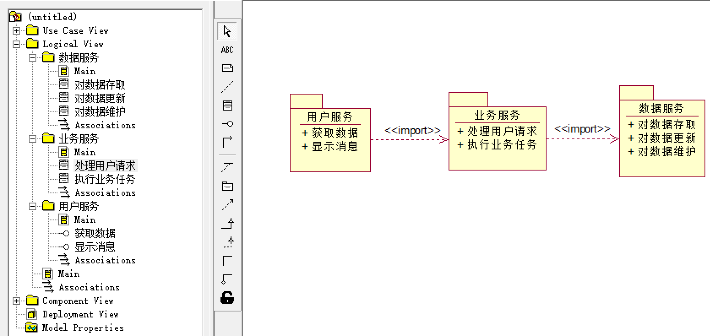 

##### 泛化

- 泛化可以通过嵌套来实现。

##### 嵌套

- 包可以拥有其他包作为包内的元素，子包又可以拥有自己的子包。

 

# Rational Rose 

## 基本使用功能

### 导入/导出模型

 

### 发布模型

- Tools --> Web Publisher

 

### 控制单元

### 模型集成器

## 视图模型

 

### 用例视图 Use Case View

- 用例视图关注系统功能的高级抽象，而不关注系统的具体实现方法。
- 用例视图包括了系统中所有参与者、用例、用例图；必要时可以添加：顺序图、协作图、活动图、类图等。

 

### 逻辑视图 Logical View

- 逻辑视图关注系统如何实现用例中所描述的功能，主要是对系统功能性需求提供支持：在为用户提供服务方面，系统所应该提供的功能。
- 逻辑视图的模型元素：类、类工具、用例、接口、类图、用例图、协作图、顺序图、活动图、状态图等。

 

### 构件视图

### 部署视图
