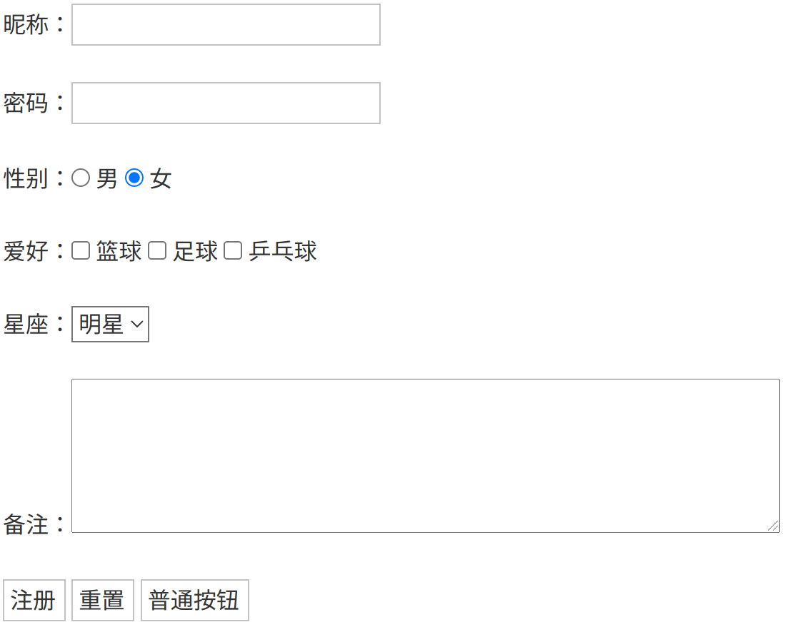

# HTML

- HTML（超文本标记语言 .html .htm）：解释型的标记语言，标签不区分大小写，且浏览器是容错的

| HTML的基本元素     | 意义                |
| ------------------ | ------------------- |
| \<\!DOCTYPE html\> | 文档类型            |
| \<html\>\</html\>  | 根元素              |
| \<head\>           | 信息容器 （隐藏域） |
| \<body\>           | 页面内容            |

```html
<!DOCTYPE html>
<html lang="en">
    <head>
        <meta charset="UTF-8">
        <title>Title</title>
    </head>
    <body>
        
    </body>
</html>
```

# 标签属性

| 属性  | 说明                                                         |
| ----- | ------------------------------------------------------------ |
| id    | 唯一性标识                                                   |
| class | 分类标识                                                     |
| name  | 返回给服务器的名称（封装数据）<br />前端数据封装实体类，需要将HTML元素的name属性赋值为需要封装的对象的属性名。 |

# 文本标签

## \<br /\> 换行

## \<h1\>\</h1\> 标题

- 标题：\<h1\>\~\<h6\>

## \<span\>\</span\> 无语义

# \<li\>\</li\> 列表

| \<li\>\</li\> | 列表选项 |
| ------------- | -------- |
| \<ol\>\</ol\> | 有序列表 |
| \<ul\>\</ul\> | 无序列表 |

```html
<ul>
  <li>豆浆</li>
  <li>油条</li>
</ul>
```

# \<table\>\</table\> 表格

| \<table\>\</table\> | 表格（可嵌套） |
| ------------------- | -------------- |
| \<tr\>\</tr\>       | 行             |
| \<td\>\</td\>       | 列             |

````html
<table>
    <tr>
    	<th></th>
    </tr>
	<tr>
		<td></td>
	</tr>
</table>
````

# \<form\>\</form\>  表单

| form属性 | 说明             |
| -------- | ---------------- |
| action   | 服务器响应url    |
| name     | 表单名称         |
| value    | 发送给服务器的值 |
| method   | 请求类型         |

 

```html
<form action="demo04.html">
    昵称：<input type="text" name="nicName"/><br/><br/>
    密码：<input type="password" name="pwd"/><br><br/>
    性别：<input type="radio" name="gender" value="male"/> 男
         <input type="radio" name="gender" value="female" checked/> 女<br/><br/>
    爱好：<input type="checkbox" name="hobby" value="basketball"/> 篮球
         <input type="checkbox" name="hobby" value="football"/> 足球
          <input type="checkbox" name="hobby" value="ping-pong"/> 乒乓球 <br/><br/>
    星座：<select name="start">
              <option value="1">据星</option>
              <option value="2" selected>明星</option>
              <option value="3">后星</option>
              </select><br/><br/>
    备注：<textarea name="remark" rows="4" cols="50"></textarea><br/><br/>
    <input type="submit" value="注册"/>
    <input type="reset" value="重置"/>
    <input type="button" value="普通按钮"/>
</form>
```

## \<input/\> 表单填写

| type           | 类型                                                         |
| :------------- | :----------------------------------------------------------- |
| text           | 文本框                                                       |
| password       | 密码域                                                       |
| file           | 文件域                                                       |
| radio          | 单选按钮<br />单选组的name必须一致                           |
| checkbox       | 复选框                                                       |
| submit         | 提交按钮                                                     |
| reset          | 重置按钮<br />恢复到默认状态（不等于清空）                   |
| button         | 普通按钮                                                     |
| hidden         | 隐藏域<br />隐藏域不会在页面显示，但提交表单时会一起被提交。 |
| image          | 图像域                                                       |
| date           | 日期选择器，YYYY-MM-DD                                       |
| datetime-local | 日期时间选择器                                               |

## \<select\>\</select\> 下列列表

```html
<select name="start">
    <option value="1">据星</option>
    <option value="2" selected>明星</option>
    <option value="3">后星</option>
</select>
```
